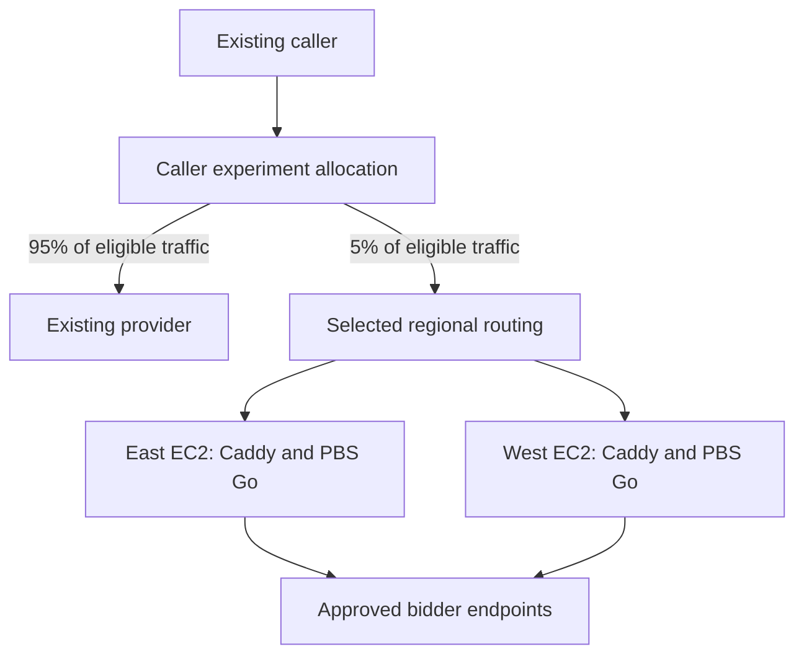

# Worked example: two-region pilot

This is a conditional design derived from a supplied pilot plan, not a default architecture or evidence of provisioned capacity. Use it only when the user accepts its limitations. Operational rules live in the skill references.

## Example requirements

Assume the user has confirmed:

- Prebid Server Go on AWS with Terraform.
- One deployment in `us-east-1` and one in `us-west-2`.
- A retained provider and a caller-controlled trial targeting 5% of eligible traffic.
- A fixed approved bidder set, versioned configuration, and credential rotation.
- Host maintenance interruptions, manual host replacement, and no autoscaling for this bounded pilot.

Still resolve absolute peak traffic, regional distribution, bidder fan-out, caller type, domain ownership, inventory/cache dependencies, secret permissions, budget, recovery expectations, and numeric rollout gates. The 5% value supplies no instance-size evidence.

## Conditional recommendation

Per region, propose a public subnet, internet gateway, EC2 host with encrypted storage and Elastic IP, Compose, Caddy, SSM access, regional secret access, release artifacts, and telemetry. Select actual instance sizes and images only after workload and compatibility evidence.

Prefer existing caller-side regional routing when suitable. Otherwise evaluate shared-hostname Route 53 latency routing with independent regional health checks and a verified DNS-challenge certificate setup. Implement only the selected branch.

Use one pilot Terraform root with two provider aliases and explicit regional module calls, unless ownership requires separate roots. Keep backend bootstrap independent. Generate Compose/Caddy and host deployment tools only after approving this profile.

No ALB, NAT gateway, ECS, distributed database, or cache is justified solely by the pilot's two regions. Add or replace components when a confirmed requirement demands it. Exclude inventory with unmet dependencies explicitly rather than presenting a reduced-function trial as equivalent.

## Approval and evidence gates

The user must accept one-host-per-region outages and maintenance behavior. If regional failover concentrates the pilot on one node, prove that capacity or agree on reducing allocation. Automatic replacement, uninterrupted deployment, or tighter recovery requirements invalidate this profile and require another architecture decision.

File generation starts after architecture-changing questions and target paths are approved. Live-traffic gates remain deferred to authorized execution: zero-allocation deployment checks, internal inventory validation, then agreed 1% and 5% observation windows. A tested caller kill switch and measured refresh bound are required before the live pilot.

## Walkthrough assertions

Use these contrasts when reviewing the skill. They are expected behavior, not executed deployment tests. Terraform cases exercise the rules in `references/terraform.md`.

| Input                                                                          | Expected planning behavior                                                                                                                                                                          |
| ------------------------------------------------------------------------------ | --------------------------------------------------------------------------------------------------------------------------------------------------------------------------------------------------- |
| This pilot, with outage acceptance but unknown QPS                             | Preserve the supplied answers; ask about workload and other blockers; propose this profile provisionally without inventing instance capacity                                                        |
| Production requires AZ survival, uninterrupted releases, and automatic scaling | Reopen topology; evaluate multi-AZ ECS/ALB or EC2 Auto Scaling/ALB against the existing platform; define minimum/failover capacity and scaling evidence; generate only the selected runtime's files |
| Pilot adds video with independent regional caches                              | Resolve cache write/retrieval and failure behavior before generating affected infrastructure, or obtain approval to exclude that inventory                                                          |
| User approves file generation but has supplied no AWS execution authorization  | Generate inactive tools and run safe local checks; leave cloud actions and traffic changes unexecuted                                                                                               |
| A requirement is unknown or a validation tool is unavailable                   | Record a blocker or not-run check; preserve the distinction between a draft and locally checked files                                                                                               |
| A proposed local test omits `command` and uses a real AWS provider             | Do not run it: the default is apply. Generate an explicitly commanded, isolated mocked test or defer it as an authorized cloud integration test                                                     |
| A plan-mode suite mocks East but retains a real West provider alias            | Reject the credential-free claim; inspect all provider mappings and setup dependencies, mock the remaining external provider, and select exact reviewed test files                                  |
| The existing S3 backend uses DynamoDB locking                                  | Preserve it while proposing a version/permissions/recovery-aware migration; no backend replacement, lock removal, or state migration during generation                                              |
| An upstream CI example uses stored AWS keys and applies after merge            | Generate the approved short-lived identity and protected saved-plan review procedure as inactive tooling; upstream examples grant no execution authority                                            |
