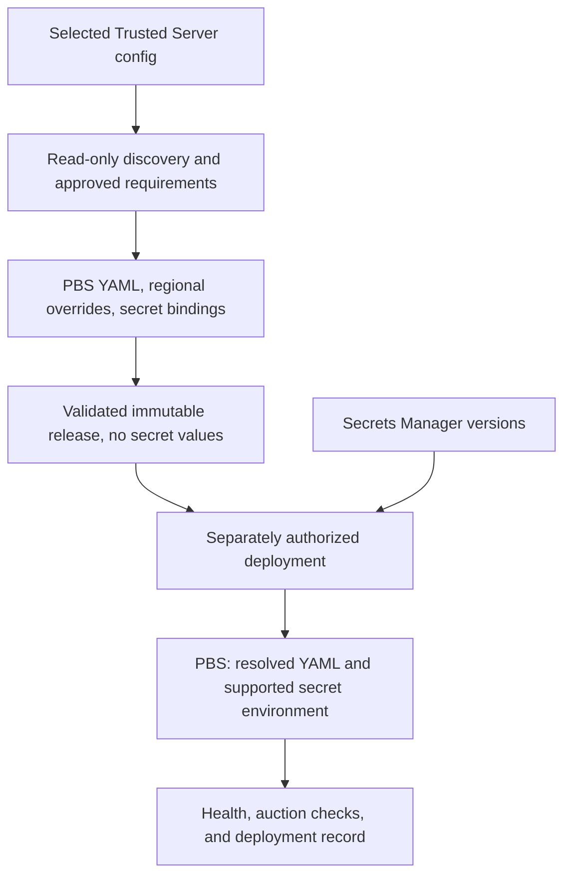

# Configuration, secrets, and operator workflow

Use this reference for Trusted Server configuration discovery, the experimental `ts pbs` operator commands, and proposed runtime delivery. The current commands are implemented in `crates/trusted-server-cli`; deployment and rollback remain design work. Their existence does not authorize cloud operations. Read the [CLI usage and schema](../../../../crates/trusted-server-cli/README.md) before generating its input files or documenting invocations.

## Discover requirements from Trusted Server

Before asking questions the repository can answer:

1. Locate `trusted-server.toml` in the selected project, including ignored operator-owned files and any path supplied by the user. Limit discovery to that project. When several files or environments could apply, ask which is authoritative; never select one by modification time. If none exists, continue the interview and label example files as examples.
2. Parse the selected file with a TOML parser and inspect only relevant fields. Check their semantics against the repository's Trusted Server schema. Comments, disabled integrations, and browser build inputs do not establish active server-side demand.
3. Ask whether environment overrides, remote configuration, or request-time parameters make the file incomplete or stale. Record the effective source as unresolved when it cannot be established locally. Cloud inspection still requires authorization.
4. Add observations to the existing deployment decision record with source path/key, candidate requirement, confidence/status, and the remaining question. Report credential identifiers or presence only; keep raw TOML, credential values, and commercially sensitive publisher values out of reports and generated examples.
5. Verify candidate adapters against the selected PBS Go release and confirm partner authorization. Record each host-secret requirement as required, not needed, or unresolved. A bidder name alone proves neither a secret requirement nor permission to use the bidder.

| Trusted Server input                                  | Discovery use                                                                                        |
| ----------------------------------------------------- | ---------------------------------------------------------------------------------------------------- |
| `integrations.prebid.enabled`                         | Determine active versus disabled intent using the schema's defaults                                  |
| `server_url`, `account_id`                            | Identify existing provider/account compatibility questions, not automatically portable settings      |
| `bidders`                                             | Candidate server-side adapter set, subject to effective runtime configuration                        |
| `client_side_bidders`                                 | Browser-side participation; do not automatically enable these adapters in PBS                        |
| `timeout_ms`                                          | Caller budget; leave room for network/proxy work when proposing PBS auction timeouts                 |
| `test_mode`, `debug`                                  | Testing/diagnostic intent, not authorization to contact bidders or proof that no real auction occurs |
| `bid_param_override_rules`                            | Conditional publisher/placement inputs and inventory behavior, not generic host credentials          |
| `bundle.adapters`, identity modules                   | Browser bundle capabilities and identity questions, not proof of server-side use                     |
| Relevant privacy, format, and stored-request settings | Identify dependencies that need confirmation from the caller/request path                            |

Use `ts pbs inspect --config <selected-path>` for redacted local discovery. It reports explicit values without expanding defaults or proving host-secret requirements. Resolve schema defaults and adapter metadata separately, recording unsupported details as unresolved rather than fetching credentials or inventing mappings. Read config without invoking commands that publish or rewrite it. Leave `trusted-server.toml` unchanged. Propose caller endpoint/account changes separately after integration approval; discovery must not activate bidders, publish configuration, or change traffic.

Done when the selected source and its limits are recorded, every observed bidder is classified, and missing inputs remain visible rather than filled from examples.

## One home for each input

Use existing repository paths where available. For a new deployment, propose:

| Input                               | Owner and destination                                                                                                                              |
| ----------------------------------- | -------------------------------------------------------------------------------------------------------------------------------------------------- |
| `runtime/pbs.yaml`                  | Git-owned nonsecret PBS baseline                                                                                                                   |
| `runtime/regions/`                  | Optional nonsecret regional overrides, rendered into each region's YAML                                                                            |
| `runtime/secret-bindings.json`      | Git-owned secret identifiers, JSON key names, supported PBS destinations, types, required/optional status, and regional scope; no values           |
| `deployment.yaml`                   | Nonsecret deployment descriptor: environment, AWS account/profile or role, regions, selected runtime, resource identifiers, and artifact locations |
| Credential values                   | Secrets Manager through an authorized operator or automation workflow                                                                              |
| Publisher/site/placement parameters | The approved caller configuration or stored-request system, passed with auctions                                                                   |

PBS Go supports files and environment variables, with environment values taking precedence. Default to YAML for normal PBS settings and environment bindings for supported host secrets. Keep unrelated process/AWS environment variables separate. Any nonsecret PBS environment override must be explicit, generated, and justified; never forward arbitrary operator `PBS_*` variables into the container.

Resolve one YAML file per region using a real parser. Define precedence as baseline then regional overrides; merge mapping keys and replace sequences as whole values. Validate the resolved fields and binding types against the pinned PBS release. A secret-bound field has one source: reject conflicting YAML values, duplicate environment destinations, and unknown bindings instead of silently choosing a winner. Keep unresolved required settings blocking release preparation.

Cover external URL, listener, adapters/endpoints, timeout, privacy/account policy, identity, stored requests/cache, and telemetry. Preserve required upstream static assets. The privacy policy owner approves privacy defaults; a smoke test does not justify weakening them.

## Release and runtime delivery

This is the design contract for a separately approved runtime integration, not a capability of the current CLI. If Terraform user data currently owns runtime files, agree on the ownership transition before implementing independent release updates. A Secrets Manager write alone does not install a secret loader or replace consumers.

An immutable release records resolved nonsecret configuration checksums, PBS and ancillary image digests, required bindings, and optional stored-request assets. Pin CPU-compatible images. Resolve intended regional secret versions for an authorized deployment and record their identifiers with the release and target. Make containers consume those versions; recording a version while injecting an unconstrained latest value is not reproducible.

Generate only the approved runtime's mechanism:

- EC2/Compose: a versioned release supplies `/etc/config/pbs.yaml` through a read-only mount. A host-side role retrieves the selected secret versions and validates required keys before replacement. A parser/encoder writes restricted runtime environment files atomically on ephemeral storage; recreate them on boot. Test Compose quoting, dollars, newlines, and empty values. Never construct environment files through shell evaluation. Keep instance-role credentials inaccessible to the application.
- ECS: prefer an immutable configuration-bearing image containing the resolved nonsecret YAML and required assets. If using artifact retrieval instead, specify the downloader, permissions, checksums, startup ordering, and failure handling; an S3 object alone is not configuration delivery. Use supported task-definition secret references with the selected versions and execution/task-role permissions. Verify replacement tasks can load configuration and credentials before retiring healthy capacity according to the approved availability policy.

Never package or log secret values. Treat container inspection and debug output as privileged; test redaction with dummy secrets. Follow [Terraform ownership](terraform.md#credentials-and-resource-ownership) for metadata and access policy instead of recreating that responsibility in runtime scripts.

## Operator command contract

Use `ts pbs` instead of generating deployment-local wrappers for these implemented operations. Keep existing `ts config`, `ts deploy`, and `ts prebid bundle` behavior unchanged.

| Command                                                             | Current result and boundary                                                                                                                                     |
| ------------------------------------------------------------------- | --------------------------------------------------------------------------------------------------------------------------------------------------------------- |
| `ts pbs inspect --config <path>`                                    | Local discovery with unresolved requirements; no source changes or secret retrieval                                                                             |
| `ts pbs check --deployment <path>`                                  | Local schema, binding, and regional merge checks; no AWS calls, upstream PBS schema validation, or startup proof                                                |
| `ts pbs secrets set <bidder> --deployment <path> --region <region>` | Authorized complete-value write to an existing declared secret; hidden terminal or file/stdin input, account/confirmation checks, and retry UUID; no deployment |
| `ts pbs status --deployment <path>`                                 | Authorized EC2 infrastructure reads for declared instances; PBS health, installed release, and consumed secret versions stay unknown                            |

There are no `ts pbs deploy` or `ts pbs rollback` subcommands. Versioned release delivery, runtime injection, and release-aware status need separate implementation and approval. Do not present the future release contract as a working command. Current descriptors accept only `ec2-compose`; an ECS design requires another approved implementation rather than a fabricated descriptor.

Read targets from the deployment descriptor. Allow an explicit deployment selection; if selection is ambiguous, stop. Before cloud operations, display environment/account/regions and verify authenticated account identity against the descriptor. Require deliberate regional scope for mutations rather than silently changing every region or defaulting to production. Local commands do not authenticate. Cloud read commands must not retrieve credential values merely to report status.

Interactive mutations require confirmation of the concrete target and proposed change. Automation uses explicit target, release or secret-write inputs and an external approval gate; missing approval is an error, not a prompt fallback. Release preparation may render/build locally, but publication and cloud changes occur only after approval. If the preview changes, obtain approval again. A skill run that only authorizes file generation must not invoke these cloud commands.

Secret input supports a hidden interactive prompt in the operator's terminal, not the agent conversation, and mutually exclusive file/stdin inputs. Accept no credential values as ordinary arguments. Validate a complete payload against the binding definition; use restricted temporary storage only when needed and clean up tool-created files on success or failure. Leave operator-supplied input files unchanged. Write the declared primary secret for replicated credentials or the selected independently owned regional secret, not a replica as if it were writable independently. Preserve retry identity for a logical write so retrying it does not create unintended versions. Report changed version identifiers and regions requiring deployment, never the payload.

A future approved deployment implementation must own the render/package/inject/restart sequence; operators should not manually edit generated environment files or ECS task definitions. Reuse the [release lifecycle](file-generation.md#generated-deployment-tools) for locking, health deadlines, draining, and failure handling. Routine configuration or credential-value changes do not require Terraform apply. New secret metadata, permissions, or infrastructure changes follow the separate reviewed Terraform workflow. None of these commands modifies caller traffic allocation implicitly.

For supported CLI commands, reference the CLI's input and failure contract in the runbook. For any separately approved deployment tool, document inputs, local versus cloud access, output, nonzero failure behavior, and the recovery action. Distinguish desired configuration from observed running state in status output; provide machine-readable nonsecret output where automation consumes it.

## Rotation and recovery

Updating Secrets Manager does not refresh a running container's environment. Coordinate credential issuance and overlap with the bidder, write the new value, verify regional availability, replace consumers in the approved order, and verify each region before retiring the old credential. Replication alone proves neither successful injection nor bidder authorization. Keep partial regional success visible with the release and secret versions actually running.

On required-secret retrieval or validation failure, preserve working capacity and report the blocker. On failed deployment, use the recorded prior release and compatible credential versions; refuse a known-incompatible rollback. If partner validity is unknown, report that uncertainty before replacement rather than promising recovery. An application rollback cannot restore a credential revoked by the bidder.

Done when the runbook gives each supported routine task one documented command, expected evidence, and failure/recovery behavior, with unimplemented release tasks clearly deferred. Prove discovery preserves the source file and redacts values; test rendering determinism, override conflicts, missing/optional keys, special-character dummy secrets, wrong-account/ambiguous-target refusal, retries, partial regional rollout, and revoked-credential recovery. Separate local fixture results from deferred live integration evidence.

## Sources

- [PBS Go configuration guide](https://github.com/prebid/prebid-server/blob/master/docs/developers/configuration.md), then the configuration definitions and adapter schema at the pinned release
- [ECS Secrets Manager injection](https://docs.aws.amazon.com/AmazonECS/latest/developerguide/secrets-envvar-secrets-manager.html)
- [Secrets Manager regional replication](https://docs.aws.amazon.com/secretsmanager/latest/userguide/replicate-secrets.html)
- [Secrets Manager value updates](https://docs.aws.amazon.com/cli/latest/reference/secretsmanager/put-secret-value.html)
