# 🎯 Auction Orchestration Flow

## 🔄 System Flow Diagram

```mermaid
%%{init: {
  "theme": "base",
  "themeVariables": {
    "background": "#ffffff",
    "primaryColor": "#dbeafe",
    "primaryTextColor": "#1e3a8a",
    "primaryBorderColor": "#2563eb",
    "lineColor": "#334155",
    "secondaryColor": "#fef3c7",
    "tertiaryColor": "#d1fae5",
    "actorBkg": "#eff6ff",
    "actorBorderColor": "#3b82f6",
    "actorTextColor": "#1e40af",
    "actorLineColor": "#64748b",
    "signalColor": "#1e293b",
    "signalTextColor": "#0f172a",
    "labelBoxBkgColor": "#f1f5f9",
    "labelBoxBorderColor": "#cbd5e1",
    "labelTextColor": "#1e293b",
    "loopTextColor": "#1e293b",
    "noteBkgColor": "#fef3c7",
    "noteBorderColor": "#d97706",
    "noteTextColor": "#78350f",
    "activationBorderColor": "#059669",
    "activationBkgColor": "#d1fae5",
    "sequenceNumberColor": "#0f172a"
  },
  "themeCSS": ".sequenceNumber{font-size:26px!important;font-weight:900!important;fill:#ffffff!important;paint-order:stroke fill;stroke:#1e293b;stroke-width:1px;} .sequenceNumber circle{r:32px!important;stroke-width:3px!important;stroke:#1e293b!important;fill:#2563eb!important;} .mermaid svg{background:#ffffff!important;border-radius:8px;box-shadow:0 2px 4px rgba(0,0,0,0.06);} .actor{font-weight:600!important;} .messageText{font-weight:600!important;font-size:16px!important;} .activation0{stroke-width:3px!important;} .messageLine0,.messageLine1{stroke-width:3px!important;} .messageText tspan{font-size:16px!important;} path.messageLine0,path.messageLine1{stroke-width:3px!important;} marker#arrowhead path,marker#crosshead path{stroke-width:2px!important;}"
}}%%
sequenceDiagram
  autonumber

  participant Client as 🌐 Browser/TSJS
  participant TS as 🛡️ Trusted Server
  participant Orch as 🎯 Orchestrator
  participant APS as 📦 APS Provider
  participant Prebid as 🎰 Prebid Provider
  participant Med as ⚖️ AdServer Mediator
  participant Mock as 🎭 Mocktioneer

  %% === Auction Request Initiation ===
  rect rgb(243,244,246)
    Note over Client,Mock: 🚀 Auction Request Initiation
    activate Client
    activate TS
    Client->>TS: POST /auction<br/>AdRequest with adUnits[]
    Note right of Client: { "adUnits": [{ "code": "header-banner",<br/>  "mediaTypes": { "banner": { "sizes": [[728,90]] } } }] }
    
    TS->>TS: 🔧 Parse AdRequest<br/>🔄 Transform to AuctionRequest<br/>🆔 Generate user IDs<br/>📊 Build context
    deactivate Client
    deactivate TS
  end

  %% === Orchestrator Strategy Detection ===
  rect rgb(239,246,255)
    Note over Client,Mock: 🧠 Auction Strategy Detection
    activate TS
    activate Orch
    TS->>Orch: orchestrator.run_auction()
    Orch->>Orch: 🔍 Detect strategy<br/>mediator? parallel_mediation : parallel_only
    deactivate TS
    
    Note over Orch: Strategy determined by config:<br/>[auction]<br/>mediator = "adserver_mock" → parallel_mediation<br/>No mediator → parallel_only
  end

  %% === Parallel Provider Execution ===
  rect rgb(243,232,255)
    Note over Client,Mock: 🔄 Parallel Provider Execution
    activate APS
    activate Prebid
    activate Mock
    
    par Parallel Provider Calls
      Orch->>APS: POST /e/dtb/bid<br/>APS TAM format
      Note right of Orch: { "pubId": "5128",<br/>  "slots": [{ "slotID": "header-banner",<br/>    "sizes": [[728,90]] }] }
      
      APS->>Mock: APS TAM request
      Mock-->>APS: APS bid response<br/>(encoded prices, no creative)
      Note right of Mock: { "contextual": { "slots": [{<br/>  "slotID": "header-banner",<br/>  "amznbid": "Mi41MA==", // "2.50"<br/>  "fif": "1" }] } }
      
      APS-->>Orch: AuctionResponse<br/>(APS bids)
    and
      Orch->>Prebid: POST /openrtb2/auction<br/>OpenRTB 2.x format
      Note right of Orch: { "id": "request",<br/>  "imp": [{ "id": "header-banner",<br/>    "banner": { "w": 728, "h": 90 } }] }
      
      Prebid->>Mock: OpenRTB request
      Mock-->>Prebid: OpenRTB response<br/>(clear prices, with creative)
      Note right of Mock: { "seatbid": [{ "seat": "prebid",<br/>  "bid": [{ "price": 2.00, "adm": "<html>..." }] }] }
      
      Prebid-->>Orch: AuctionResponse<br/>(Prebid bids)
    end
    
    Note over Orch: 📊 Collected bids from all providers<br/>APS: encoded prices, no creative<br/>Prebid: clear prices, with creative
    deactivate Mock
    deactivate APS
    deactivate Prebid
  end

  %% === Winner Selection Strategy ===
  alt Mediator Configured (parallel_mediation)
    rect rgb(236,253,245)
      Note over Client,Mock: ⚖️ Mediation Flow
      activate Med
      Orch->>Med: POST /adserver/mediate<br/>All bids for final selection
      Note right of Orch: { "id": "auction-123",<br/>  "imp": [...],<br/>  "ext": { "bidder_responses": [<br/>    { "bidder": "amazon-aps",<br/>      "bids": [{ "encoded_price": "Mi41MA==" }] },<br/>    { "bidder": "prebid",<br/>      "bids": [{ "price": 2.00 }] }] } }
      
      Med->>Med: 🔓 Decode APS encoded prices<br/>📏 Apply floor prices<br/>🏆 Select highest CPM per slot
      Note right of Med: Base64 decode: "Mi41MA==" → "2.50"<br/>Winner: APS at $2.50 vs Prebid at $2.00
      
      Med-->>Orch: OpenRTB response with winners
      Note right of Med: { "seatbid": [{ "seat": "amazon-aps",<br/>  "bid": [{ "price": 2.50, "impid": "header-banner" }] }] }
      deactivate Med
    end
  else No Mediator (parallel_only)
    rect rgb(253,243,235)
      Note over Client,Mock: 🏆 Direct Winner Selection
      Orch->>Orch: 📏 Compare clear prices only<br/>⚠️  Skip APS (encoded prices)<br/>🏆 Select highest CPM
      Note right of Orch: APS bids skipped (encoded prices)<br/>Winner: Prebid at $2.00 (only clear price)
      
      Note over Orch: 📝 Results: Limited winner selection<br/>Cannot compare encoded APS prices<br/>Prebid wins by default
    end
  end

  %% === Response Assembly ===
  rect rgb(243,244,246)
    Note over Client,Mock: 📦 Response Assembly
    activate TS
    activate Client
    Orch->>Orch: 🔄 Transform to OpenRTB response<br/>🖼️ Generate iframe creatives<br/>🔏 Rewrite creative URLs<br/>📊 Add orchestrator metadata
    
    Orch-->>TS: OpenRTB BidResponse
    Note right of Orch: { "id": "auction-response",<br/>  "seatbid": [{ "seat": "amazon-aps",<br/>    "bid": [{ "price": 2.50,<br/>      "adm": "<iframe src=\"/first-party/proxy?tsurl=...\">",<br/>      "w": 728, "h": 90 }] }] }<br/>  "ext": { "orchestrator": {<br/>    "strategy": "parallel_mediation",<br/>    "bidders": 2, "time_ms": 150 } }
    
    TS-->>Client: 200 OpenRTB response<br/>with winning creative
    deactivate Orch
    deactivate TS
  end

  %% === Creative Rendering ===
  rect rgb(239,246,255)
    Note over Client,Mock: 🖼️ Creative Rendering
    Client->>Client: 💉 Inject winning creative<br/>🖼️ Render iframe<br/>🌐 Load creative through proxy
    Note right of Client: iframe src="/first-party/proxy?tsurl=...&tstoken=sig"<br/>Ensures first-party serving<br/>Maintains privacy & security
    deactivate Client
  end

```



## 📋 Flow Summary

### **Phase 1: Request Initiation**
- **Browser** sends `POST /auction` with ad units in Prebid.js format
- **Trusted Server** parses and transforms to internal `AuctionRequest`
- Generates user IDs (persistent + fresh) and builds auction context

### **Phase 2: Strategy Detection**
- **Orchestrator** checks configuration for mediator
- **With mediator** → `parallel_mediation` strategy
- **Without mediator** → `parallel_only` strategy

### **Phase 3: Parallel Execution**
- **APS Provider** receives APS TAM format request
  - Mocktioneer returns APS response with **encoded prices** (`amznbid: "Mi41MA=="`)
  - **No creative HTML** provided (typical for real APS)
- **Prebid Provider** receives OpenRTB 2.x request  
  - Mocktioneer returns OpenRTB response with **clear prices**
  - **Includes creative HTML** in `adm` field

### **Phase 4: Winner Selection**

#### **🔄 With Mediator (Recommended)**
1. **AdServer Mediator** receives all bids
2. **Decodes APS prices** (base64 → actual CPM)
3. **Applies floor prices** and selects highest CPM per slot
4. **Returns OpenRTB response** with proper winner selection

#### **⚡ Without Mediator (Limited)**
1. **Orchestrator** compares only clear prices
2. **APS bids skipped** (encoded prices can't be compared)
3. **Prebid wins by default** if no other clear-price bidders

### **Phase 5: Response Assembly**
- **Creative HTML** rewritten with first-party proxy URLs
- **Orchestrator metadata** added (strategy, timing, bid counts)
- **OpenRTB response** returned to browser

### **Phase 6: Creative Rendering**
- **Winning creative** injected into iframe
- **Resources proxied** through first-party domain
- **Privacy & security** maintained throughout

## 🔑 Key Technical Details

### **Price Encoding**
- **APS Mock**: Uses base64 encoding (`"Mi41MA=="` → `"2.50"`)
- **Real APS**: Uses proprietary encoding (only Amazon/GAM can decode)
- **Prebid**: Uses clear decimal prices (`2.50`)

### **Request Formats**
- **APS TAM**: `{ "pubId": "...", "slots": [...] }`
- **OpenRTB 2.x**: `{ "imp": [...] }` 
- **AdRequest**: `{ "adUnits": [...] }`

### **Response Formats**
- **APS**: `{ "contextual": { "slots": [...] } }` (no `adm`)
- **OpenRTB**: `{ "seatbid": [{ "seat": "...", "bid": [...] }] }`

### **Configuration Examples**

#### **Parallel Mediation**
```toml
[auction]
enabled = true
providers = ["prebid", "aps"]
mediator = "adserver_mock"  # ← Enables mediation
timeout_ms = 2000
```

#### **Parallel Only**
```toml
[auction]
enabled = true
providers = ["prebid", "aps"]
# No mediator = direct comparison
timeout_ms = 2000
```

### **Advantages of Mediation**
- ✅ **Proper APS integration** - Can decode and compare APS bids
- ✅ **Fair competition** - All bidders compete on equal footing
- ✅ **Floor pricing** - Configurable minimum bid thresholds
- ✅ **Flexibility** - Easy to add new providers

### **Limitations Without Mediation**
- ❌ **APS bids ignored** - Can't compare encoded prices
- ❌ **Unfair competition** - Only clear-price bidders compete
- ❌ **Reduced revenue** - May miss higher APS bids