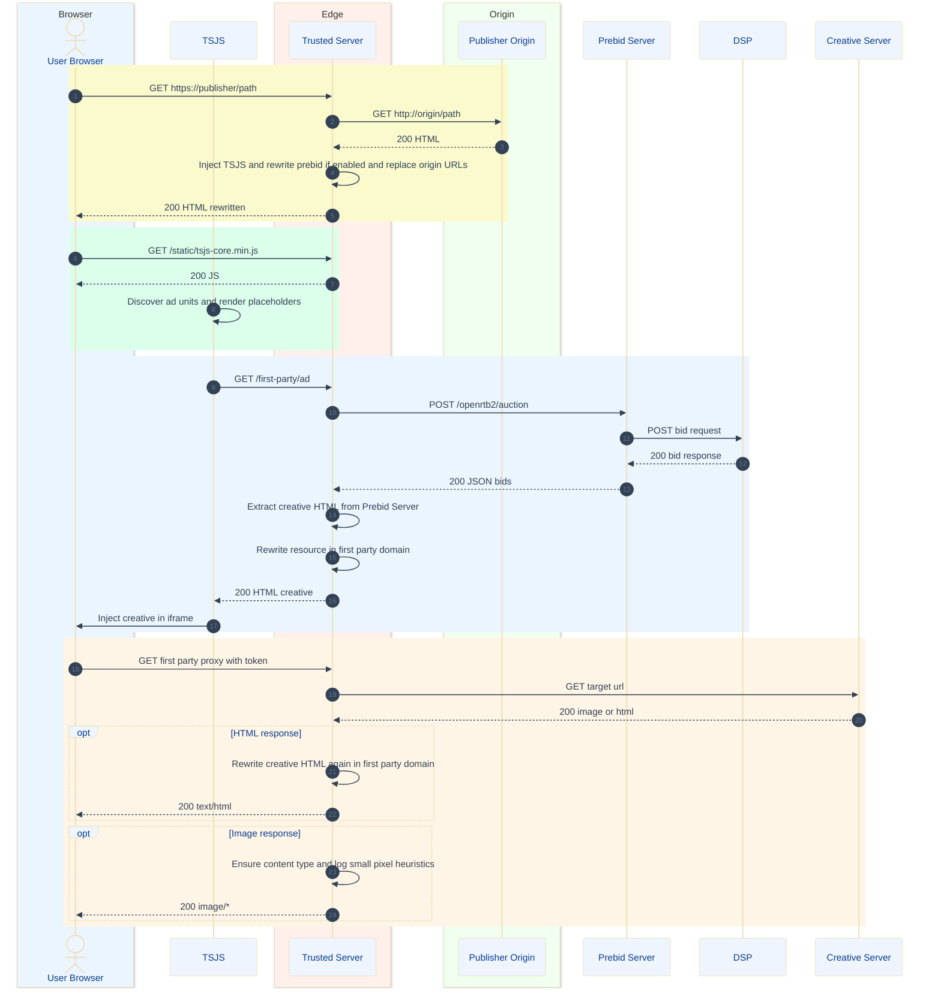

# Trusted Server — First-Party Proxying Flow

This sequence diagram shows how the Trusted Server proxies a publisher page, injects TSJS, rewrites publisher HTML, runs the auction path(s), and rewrites ad creative resources to the unified first‑party proxy.

Tip: In VS Code, open this file and use the Markdown preview. If Mermaid isn’t rendering, install a Mermaid preview extension (e.g., “Markdown Preview Mermaid Support”) or use the built‑in preview if available.

## Notes
- TSJS
  - Served first-party at `/static/tsjs-core.min.js` (and `/static/tsjs-ext.min.js` if prebid auto-config is enabled).
  - Discovers ad units and renders placeholders; either uses slot-level HTML (`/first-party/ad`) or JSON auction (`/third-party/ad`).
- Publisher HTML Rewriting
  - Injects TSJS loader and rewrites absolute URLs from origin domain to first-party domain during streaming.
- Creative HTML Rewriting
  - Rewrites ``, `srcset`, and `<iframe>` URLs to `/first-party/proxy?u=<token>`.
  - `<token>` is an encrypted+authenticated value using XChaCha20-Poly1305 with `publisher.proxy_secret`.
- Unified Proxy
  - `/first-party/proxy?u=<token>` decrypts to the target URL, proxies it, rewrites HTML responses again, and ensures image content-type if missing (also logs likely 1×1 pixels by heuristics).
- Prebid Server
  - OpenRTB requests are posted to `prebid.server_url`; responses are transformed to ensure first-party serving (HTML `adm` or JSON fields like `nurl/burl`).
