# 🛡️ Trusted Server — First-Party Proxying Flow

## 🔄 System Flow Diagram

```mermaid
%%{init: {
  "theme": "base",
  "themeVariables": {
    "background": "#ffffff",
    "primaryColor": "#dbeafe",
    "primaryTextColor": "#1e3a8a",
    "primaryBorderColor": "#2563eb",
    "lineColor": "#334155",
    "secondaryColor": "#fef3c7",
    "tertiaryColor": "#d1fae5",
    "actorBkg": "#eff6ff",
    "actorBorderColor": "#3b82f6",
    "actorTextColor": "#1e40af",
    "actorLineColor": "#64748b",
    "signalColor": "#1e293b",
    "signalTextColor": "#0f172a",
    "labelBoxBkgColor": "#f1f5f9",
    "labelBoxBorderColor": "#cbd5e1",
    "labelTextColor": "#1e293b",
    "loopTextColor": "#1e293b",
    "noteBkgColor": "#fef3c7",
    "noteBorderColor": "#d97706",
    "noteTextColor": "#78350f",
    "activationBorderColor": "#059669",
    "activationBkgColor": "#d1fae5",
    "sequenceNumberColor": "#0f172a"
  },
  "themeCSS": ".sequenceNumber{font-size:26px!important;font-weight:900!important;fill:#ffffff!important;paint-order:stroke fill;stroke:#1e293b;stroke-width:1px;} .sequenceNumber circle{r:32px!important;stroke-width:3px!important;stroke:#1e293b!important;fill:#2563eb!important;} .mermaid svg{background:#ffffff!important;border-radius:8px;box-shadow:0 2px 4px rgba(0,0,0,0.06);} .actor{font-weight:600!important;} .messageText{font-weight:600!important;font-size:16px!important;} .activation0{stroke-width:3px!important;} .messageLine0,.messageLine1{stroke-width:3px!important;} .messageText tspan{font-size:16px!important;} path.messageLine0,path.messageLine1{stroke-width:3px!important;} marker#arrowhead path,marker#crosshead path{stroke-width:2px!important;}"
}}%%
sequenceDiagram
  autonumber

  participant U as 🌐 User Browser
  participant JS as 📦 TSJS
  participant TS as 🛡️ Trusted Server
  participant OR as 🏢 Publisher Origin
  participant PBS as 🎯 Prebid Server
  participant DSP as 💰 DSP
  participant CS as 🎨 Creative Server

  %% === Page Load ===
  rect rgb(243,244,246)
    Note over U,CS: 📄 Page Load
    activate U
    activate TS
    activate OR
    U->>TS: GET https://publisher.com/page
    TS->>OR: GET http://origin/page
    OR-->>TS: 200 HTML (original)
    TS->>TS: 🔧 Inject TSJS loader<br/>🔄 Rewrite origin URLs<br/>⚙️ Transform prebid config
    TS-->>U: 200 HTML (transformed)
    deactivate OR
    deactivate TS
    deactivate U
  end

  %% === TSJS Bootstrap ===
  rect rgb(239,246,255)
    Note over U,CS: 🚀 TSJS Bootstrap
    activate U
    activate TS
    activate JS
    U->>TS: GET /static/tsjs-core.min.js
    TS-->>U: 200 JavaScript bundle
    JS->>JS: 🔍 Discover ad units<br/>📊 Collect signals<br/>🖼️ Render placeholders
    deactivate JS
    deactivate TS
    deactivate U
  end

  %% === Ad Auction ===
  rect rgb(243,232,255)
    Note over U,CS: 💱 Real-Time Auction
    activate JS
    activate TS
    activate PBS
    activate DSP
    JS->>TS: GET /first-party/ad<br/>(with signals)
    TS->>PBS: POST /openrtb2/auction<br/>(OpenRTB 2.x)
    PBS->>DSP: POST bid request
    DSP-->>PBS: 200 bid response
    PBS-->>TS: 200 JSON (winning bids)
    TS->>TS: 📝 Extract creative HTML<br/>🔏 Generate signed target URLs<br/>🔄 Rewrite resource URLs
    TS-->>JS: 200 HTML (secured creative)
    deactivate PBS
    deactivate DSP
    activate U
    JS->>U: 💉 Inject into iframe
    deactivate U
    deactivate TS
    deactivate JS
  end

  %% === Creative Resources ===
  rect rgb(236,253,245)
    Note over U,CS: 🖼️ Proxied Resources
    activate U
    activate TS
    activate CS
    U->>TS: GET /first-party/proxy?tsurl=base_url&<orig_params>&tstoken=sig
    TS->>TS: ✅ Reconstruct full URL<br/>✅ Validate tstoken (enc+SHA256)
    TS->>CS: GET original_url
    CS-->>TS: 200 (image/HTML)
    
    opt 📄 HTML Response
      TS->>TS: 🔏 Generate signed target URLs<br/>🔄 Rewrite resource URLs
      TS-->>U: 200 text/html (secured)
    end
    
    opt 🖼️ Image Response
      TS->>TS: ✅ Verify content-type<br/>📊 Log pixel tracking
      TS-->>U: 200 image/* (proxied)
    end

    opt 📚 Text Resource (eg JS/CSS/etc)
      TS->>TS: ✅ Verify content-type
      TS-->>U: 200 (proxied)
    end
    deactivate CS
    deactivate TS
    deactivate U
  end
```

## Notes
- TSJS
  - Served first-party at `/static/tsjs-core.min.js` (and `/static/tsjs-ext.min.js` if prebid auto-config is enabled).
  - Discovers ad units and renders placeholders; either uses slot-level HTML (`/first-party/ad`) or JSON auction (`/auction`).
- Publisher HTML Rewriting
  - Injects TSJS loader and rewrites absolute URLs from origin domain to first-party domain during streaming.
- Creative HTML Rewriting
  - Rewrites ``, `srcset`, and `<iframe>` URLs to `/first-party/proxy?tsurl=<base-url>&<original-query-params>&tstoken=<sig>`.
  - `tstoken` is derived by encrypting the full target URL and hashing (enc+SHA256) under `publisher.proxy_secret`.
- Unified Proxy
  - `/first-party/proxy?tsurl=<base-url>&<original-query-params>&tstoken=<sig>` reconstructs and validates the target URL, proxies it, rewrites HTML responses again, ensures image content-type if missing (also logs likely 1×1 pixels by heuristics).
- Prebid Server
  - OpenRTB requests are posted to `prebid.server_url`; responses are transformed to ensure first-party serving (HTML `adm` or JSON fields like `nurl/burl`).
