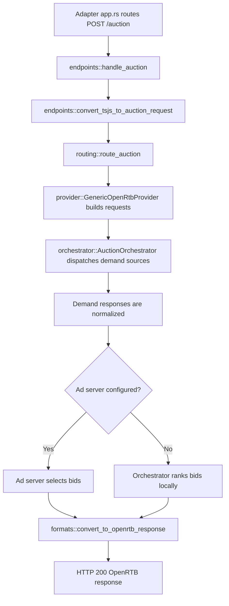

# Auction orchestration

The auction module compiles operator configuration into one immutable plan,
routes browser demand to the configured demand sources, runs their requests
concurrently where the adapter permits it, and returns normalized OpenRTB bids.

The maintained operator guide is
[`docs/guide/auction-orchestration.md`](../../../../docs/guide/auction-orchestration.md),
and the configuration syntax every provider type shares is in
[`docs/guide/configuration-rules.md`](../../../../docs/guide/configuration-rules.md).
This file describes the code layout and runtime flow for contributors.

## Runtime flow



Each adapter owns transport routing in its `app.rs`. Core request handling stays
in `auction::endpoints`, so no demand implementation depends on Fastly types.

`handle_auction` performs these steps:

1. Enforce the body limit and parse the Trusted Server ad-unit request.
2. Apply the disabled-auction and consent gates before any demand work.
3. Consume the request's existing EC and consent context. The endpoint does not
   generate an EC ID.
4. Convert the request with `convert_tsjs_to_auction_request`.
5. Route slots and bidder params through the compiled `AuctionPlan`.
6. Run the plan-backed orchestrator and the optional ad server.
7. Build the OpenRTB response with `convert_to_openrtb_response`.

## Configuration boundary

`auction::compile_auction_plan` is the single settings-to-plan boundary used by
startup and operator validation. It reads `[demand]`, `[adserver]` and
`[auction.bidders]` and validates:

- demand source and ad server names, which must be snake_case
- a settings table its type's `provider` does not select
- an `implementation` no builder registered, naming the ones that are
- endpoints, which must be HTTPS or HTTP to a loopback host, with no
  credentials or fragment
- timeouts, routing modes and notification bounds
- the settings each implementation accepts, since each one rejects unknown keys
- bidder-to-demand ownership, and
- request-signing structure.

Adapters then call `AuctionPlan::validate_for_target` for backend naming,
fan-out support, and target resource limits.

A plan-backed orchestrator contains generic OpenRTB demand sources compiled from
the plan. `AuctionOrchestrator::register_provider` and the old concrete Prebid
provider remain test-only parity code. They are not extension APIs.

## Routing

`routing::route_auction` normalizes the browser `trustedServer` envelope and
produces one `ProviderAuctionInput` per demand source.

- `explicit` sends a slot only when it has bidder demand assigned to that
  source, or trusted stored-request demand where the implementation supports it.
- `all_eligible` sends every compatible banner slot without copying another
  source's bidder params.
- `prebid_server` requires `explicit`. PBS rejects impressions that have neither
  bidder demand nor a stored-request reference.
- APS normally uses `all_eligible` because APS participates across eligible
  inventory without browser bidder params.

Each `[auction.bidders.<bidder-id>]` route has one owner, named by its
`[demand]` table name. Unlisted page bidders remain browser demand.

## Demand execution

`provider::GenericOpenRtbProvider` owns the shared transport path for the
`openrtb`, `prebid_server` and `aps` implementations. An implementation receives
routed and privacy-approved facts, not the raw inbound request.

The orchestrator launches all eligible demand sources before collecting
responses. It uses adapter `PlatformHttpClient` handles and predicted backend
names for correlation. Launch, transport, HTTP, parse and admission failures are
local to one demand source when another can continue.

## Response admission

Demand sources normalize successful upstream bids into `auction::types::Bid`.
Admission checks keep malformed or unrequested bids out of ranking. Aggregate
metadata reports bounded rejection counts without retaining raw upstream bid
payloads.

Notification suppression runs after normalization and matches exact returned
OpenRTB seats. Response identity uses the configured demand source name, such
as `pbs_main`.

## Creative delivery

`formats::convert_to_openrtb_response` assembles the direct `POST /auction`
response.

- `sanitize_creatives = true` strips executable markup. It is opt-in.
- `rewrite_creatives = true` rewrites eligible URLs through first-party routes
  and removes bidder `<base>` elements. It is enabled by default.
- The publisher inline delivery path uses absolute first-party URLs without
  injecting the direct endpoint's creative runtime.
- Creatives over the configured hard cap are rejected.

## Example plan

```toml
[auction]
enabled = true
timeout_ms = 2000

[demand]
provider = ["pbs_main", "aps_main"]

[demand.pbs_main]
implementation = "prebid_server"
endpoint = "https://prebid.example.com/openrtb2/auction"
timeout_ms = 900
routing = "explicit"
debug = false
test_mode = false
consent_forwarding = "both"

[demand.pbs_main.notifications]
suppress_all = false
suppress_seats = ["example-seat"]

[demand.aps_main]
implementation = "aps"
endpoint = "https://aps.example.com/e/pb/bid"
routing = "all_eligible"
account_id = "example-account"

[auction.bidders.example-server]
provider = "pbs_main"

[adserver]
provider = "adserver_mock"

[adserver.adserver_mock]
endpoint = "https://adserver.example.com/decide"
timeout_ms = 500
```

The table name is the implementation unless the table carries an
`implementation` line, which is how two Prebid Servers run side by side under
names of their own. Endpoints must be HTTPS, or HTTP to `127.0.0.1`, `::1` or
`localhost`. Replace all example values before enabling an auction.

## Code map

- `mod.rs` compiles plans and builds the shared orchestrator.
- `endpoints.rs` handles `POST /auction` and converts the browser request.
- `plan.rs` owns plan validation and target capability checks.
- `demand.rs` owns the demand and ad server implementation seam.
- `routing.rs` assigns slots and bidder params to demand sources.
- `openrtb.rs` builds shared requests and parses standard responses.
- `provider.rs` runs plan-backed demand requests and per-implementation parsing.
- `orchestrator.rs` owns fan-out, deadlines, the ad server call, and local
  ranking.
- `formats.rs` builds direct endpoint responses and processes creatives.
- `types.rs` contains normalized auction request, response, slot, and bid types.

## Testing

Use `compile_auction_plan` in tests, then construct the orchestrator and
integration registry from the same `Arc<AuctionPlan>`. Tests for one
implementation should cover its typed settings, exact request output, response
admission, routing, local failures, and target validation.

Run target-matched aliases rather than bare workspace tests:

```bash
cargo test-fastly
cargo test-axum
cargo test-cloudflare
cargo test-spin
```
