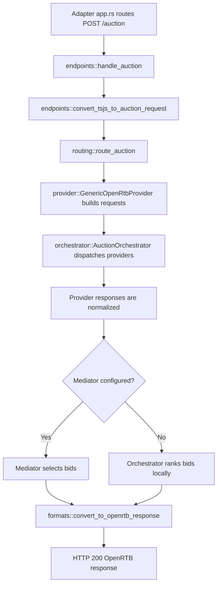

# Auction orchestration

The auction module compiles operator configuration into one immutable plan,
routes browser demand to providers, runs provider requests concurrently where
the adapter permits it, and returns normalized OpenRTB bids.

The maintained operator guide is
[`docs/guide/auction-orchestration.md`](../../../../docs/guide/auction-orchestration.md).
This file describes the code layout and runtime flow for contributors.

## Runtime flow



Each adapter owns transport routing in its `app.rs`. Core request handling stays
in `auction::endpoints`, so no provider or profile depends on Fastly types.

`handle_auction` performs these steps:

1. Enforce the body limit and parse the Trusted Server ad-unit request.
2. Apply the disabled-auction and consent gates before provider work.
3. Consume the request's existing EC and consent context. The endpoint does not
   generate an EC ID.
4. Convert the request with `convert_tsjs_to_auction_request`.
5. Route slots and bidder params through the compiled `AuctionPlan`.
6. Run the plan-backed orchestrator and optional mediator.
7. Build the OpenRTB response with `convert_to_openrtb_response`.

## Configuration boundary

`auction::compile_auction_plan` is the single settings-to-plan boundary used by
startup and operator validation. It validates:

- provider IDs, protocols, profiles, endpoints, timeouts, and routing modes;
- bidder-to-provider ownership;
- profile-specific configuration;
- mediator and request-signing references;
- bounded configuration values.

Adapters then call `AuctionPlan::validate_for_target` for backend naming,
fan-out support, and target resource limits.

A plan-backed orchestrator contains generic OpenRTB providers compiled from the
plan. `AuctionOrchestrator::register_provider` and the old concrete Prebid
provider remain test-only parity code. They are not extension APIs.

## Routing

`routing::route_auction` normalizes the browser `trustedServer` envelope and
produces one `ProviderAuctionInput` per provider.

- `explicit` sends a slot only when it has bidder demand assigned to that
  provider, or trusted stored-request demand where the profile supports it.
- `all_eligible` sends every compatible banner slot without copying another
  provider's bidder params.
- `prebid-server` requires `explicit`. PBS rejects impressions that have neither
  bidder demand nor a stored-request reference.
- APS normally uses `all_eligible` because APS participates across eligible
  inventory without browser bidder params.

Each `[auction.bidders.<bidder-id>]` route has one provider owner. Unlisted page
bidders remain browser demand.

## Provider execution

`provider::GenericOpenRtbProvider` owns the shared transport path for the
`standard`, `prebid-server`, and `aps` profiles. Profiles receive routed and
privacy-approved facts, not the raw inbound request.

The orchestrator launches all eligible providers before collecting responses.
It uses adapter `PlatformHttpClient` handles and predicted backend names for
correlation. Provider launch, transport, HTTP, parse, and admission failures are
provider-local when another provider can continue.

When no mediator is configured, the orchestrator selects the highest decoded
CPM per slot and applies floors locally. When a mediator is configured, it sends
normalized provider responses to the separately registered mediator and falls
back to local ranking when mediation cannot run.

## Response admission

Providers normalize successful upstream bids into `auction::types::Bid`.
Admission checks keep malformed or unrequested bids out of ranking. Aggregate
metadata reports bounded rejection counts without retaining raw upstream bid
payloads.

Notification suppression runs after normalization and matches exact returned
OpenRTB seats. Provider response identity uses the configured provider ID, such
as `pbs-main`.

## Creative delivery

`formats::convert_to_openrtb_response` assembles the direct `POST /auction`
response.

- `sanitize_creatives = true` strips executable markup. It is opt-in.
- `rewrite_creatives = true` rewrites eligible URLs through first-party routes
  and removes bidder `<base>` elements. It is enabled by default.
- The publisher inline delivery path uses absolute first-party URLs without
  injecting the direct endpoint's creative runtime.
- Creatives over the configured hard cap are rejected.

## Example plan

```toml
[auction]
enabled = true
timeout_ms = 2000

[auction.providers.pbs-main]
protocol = "openrtb-2.6"
profile = "prebid-server"
endpoint = "https://prebid.example.com/openrtb2/auction"
timeout_ms = 900
routing = "explicit"

[auction.providers.pbs-main.profile_config]
debug = false
test_mode = false
consent_forwarding = "both"

[auction.providers.pbs-main.notifications]
suppress_all = false
suppress_seats = ["example-seat"]

[auction.bidders.example-server]
provider = "pbs-main"

[auction.providers.aps-main]
protocol = "openrtb-2.6"
profile = "aps"
endpoint = "https://aps.example.com/e/pb/bid"
routing = "all_eligible"
profile_config = { account_id = "example-account" }
```

Provider endpoints must be absolute HTTPS URLs. Replace all example values
before enabling an auction.

## Code map

- `mod.rs` compiles plans and builds the shared orchestrator.
- `endpoints.rs` handles `POST /auction` and converts the browser request.
- `plan.rs` owns plan validation and target capability checks.
- `profile.rs` owns typed OpenRTB profile configuration.
- `routing.rs` assigns slots and bidder params to providers.
- `openrtb.rs` builds shared requests and parses standard responses.
- `provider.rs` runs plan-backed provider requests and profile-specific parsing.
- `orchestrator.rs` owns fan-out, deadlines, mediation, and local ranking.
- `formats.rs` builds direct endpoint responses and processes creatives.
- `types.rs` contains normalized auction request, response, slot, and bid types.

## Testing

Use `compile_auction_plan` in tests, then construct the orchestrator and
integration registry from the same `Arc<AuctionPlan>`. Profile tests should
cover typed configuration, exact request output, response admission, routing,
provider-local failures, and target validation.

Run target-matched aliases rather than bare workspace tests:

```bash
cargo test-fastly
cargo test-axum
cargo test-cloudflare
cargo test-spin
```
