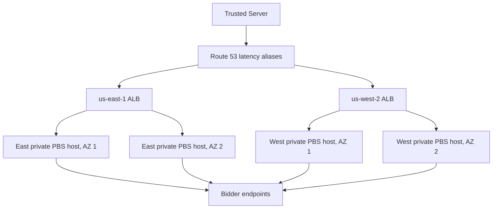

# Prebid Server AWS example deployment plan

Status: draft generated files, locally checked after validation. This directory is an example only. It has not been planned against a live AWS account, applied, deployed, or load tested.

## Decision record

| Requirement | Value | Status | Evidence or decision owner | Blocks |
| --- | --- | --- | --- | --- |
| Purpose | Production-shaped architecture example, not a live deployment | Confirmed | User approval | None |
| Caller | Trusted Server | Confirmed | User | Caller egress ranges remain required |
| Regions | `us-east-1` and `us-west-2` | Confirmed | User | Account-specific AZ selection remains unresolved |
| Regional topology | Two AZs, one PBS EC2 host per AZ | Confirmed | User | AMIs and subnets remain required |
| Total PBS hosts | Four | Confirmed | Derived from topology | Capacity remains unmeasured |
| Runtime | EC2 with Docker Compose | Confirmed | User | Release and secret injection are deferred implementation work |
| Regional ingress | Public HTTPS ALB | Confirmed | User | ACM certificate ARNs and caller CIDRs required |
| Global routing | Route 53 latency aliases with ALB health evaluation | Proposed | Architecture decision | Existing hosted-zone ID required |
| WAF | Not included in this demo | Confirmed | User | Abuse controls remain outside this example |
| Terraform state | Local backend | Confirmed | User | No team locking or remote recovery |
| PBS release | Go v4.7.0, digest pinned | Proposed and verified | PBS release and Docker metadata checked during generation | Recheck before any future use |
| Workload | 200 global peak auctions/s, 4 bidders, 1.5 s caller timeout, 1 s PBS timeout | Proposed example assumption | Planning assumption | No capacity claim until load tested |
| Secrets | Secrets Manager metadata and EC2 read policy; values written separately | Confirmed | User and repository CLI contract | Real bidder mapping and authorization required |
| Trusted Server config | No authoritative `trusted-server.toml` exists in this checkout | Confirmed | Repository inspection | Caller behavior remains an external input |
| Deployment directory | `deploy/pbs-example/` | Confirmed | User | None |

## Architecture

Each region has a public ALB in two public subnets and one private PBS host in each AZ. Each private subnet has its own NAT gateway so normal outbound traffic remains in the AZ and can use a stable Elastic IP for bidder allowlists. Route 53 returns the lowest-latency healthy regional ALB. DNS caching means failover is not immediate.

The EC2 AMIs are inputs rather than built by Terraform. They must contain the approved OS, SSM agent, Docker, and Compose. The generated Terraform does not install packages or deploy PBS through user data. Runtime release delivery, configuration rendering, secret injection, restart, and rollback need a separately approved implementation.

## Services and ownership

| Service or artifact | Action | Owner | Purpose |
| --- | --- | --- | --- |
| VPC, subnets, routes, IGW, NAT, security groups | Create | Terraform | Regional network and egress |
| ALB, target group, HTTPS listener | Create | Terraform | Regional HTTPS ingress and health routing |
| Route 53 records | Reuse zone, create records | Terraform | Latency-based regional selection |
| EC2 instances and IAM profiles | Create | Terraform | Compose hosts and SSM access |
| Secrets Manager secret metadata | Create | Terraform | One regional secret for the example bidder |
| Secret values | External write | Authorized operator or automation | Credential lifecycle; never Terraform |
| PBS YAML and Compose definition | Git-owned | Runtime owner | Nonsecret runtime contract |
| Regional YAML merge and rendered file | Deferred runtime release owner | Deployment implementation | One resolved config per region |
| PBS process lifecycle | Deferred runtime release owner | Deployment implementation | Start, replace, health, rollback |
| Terraform state | Local operator | Terraform | Demo-only state; no shared locking |

## Capacity assumptions

The example uses these fictional planning values:

- 200 peak eligible auctions per second globally.
- 100 QPS per region during normal routing.
- Either region must be able to receive 200 QPS during regional failover.
- Four bidder requests per auction, or 800 outbound requests per second globally.
- 16 KiB average request and 32 KiB average response.
- Trusted Server timeout of 1.5 seconds and PBS auction timeout of 1 second.
- `c7i.large` is an initial instance-type example, not a throughput guarantee.

A controlled load test must measure CPU, memory, connection reuse, outbound bandwidth, bidder tail latency, ALB target health, and PBS queueing before changing these values. The four-host count does not prove capacity or availability.

## Failure boundaries and limitations

- Loss of one host leaves the other regional target serving traffic. The ALB health check must drain the failed target.
- Loss of one AZ removes that region's one target and leaves the region degraded. A later scale-out would be required for full AZ redundancy.
- Loss of a whole region depends on Route 53 resolver behavior and surviving-region capacity.
- NAT, ALB, and EC2 resources have separate regional failure and cost boundaries.
- Local state has no remote locking or shared recovery. Only one operator may use it.
- No WAF or rate-based abuse control is included.
- The example uses a fictional bidder binding. The adapter name, credential keys, source authorization, and PBS mapping must be replaced and verified against v4.7.0 before use.
- A Secrets Manager write does not refresh a running Compose container. The deferred runtime implementation must retrieve a selected version, render an environment file atomically, replace the consumer, and verify health before retiring the old version.

## Cost drivers

No price estimate is claimed. The main drivers are four EC2 instances, four NAT gateways and their Elastic IPs, two ALBs, public IPv4 addresses, cross-AZ traffic if routing changes, CloudWatch logs and alarms, Secrets Manager, Route 53 records, and bidder internet traffic. A current estimate requires selected regions, traffic volume, log retention, and current AWS pricing verification.

## Generated files and checks

| Path | Consumer | Local check |
| --- | --- | --- |
| `terraform.tf`, `providers.tf`, `variables.tf` | Terraform | Format and validate |
| `main.tf`, `modules/regional/` | Terraform | Format and validate |
| `runtime/pbs.yaml`, `runtime/regions/` | PBS release process and CLI check | YAML parse and `ts prebid server check` |
| `runtime/compose.yaml` | Deferred EC2 runtime owner | Compose config with dummy values |
| `runtime/secret-bindings.json` | CLI and runtime secret loader | JSON parse and deployment check |
| `deployment.yaml` | Existing PBS CLI | `ts prebid server check` only |
| `DEPLOYMENT_PLAN.md` | Reviewers | Diff and decision review |
| `RUNBOOK.md` | Authorized operator | Procedure review; no cloud execution |

## Sources and verification

- PBS Go v4.7.0 release: https://github.com/prebid/prebid-server/releases
- PBS v4.7.0 configuration guide: https://github.com/prebid/prebid-server/blob/v4.7.0/docs/developers/configuration.md
- PBS v4.7.0 configuration definitions: https://github.com/prebid/prebid-server/blob/v4.7.0/config/config.go
- PBS v4.7.0 Docker metadata: https://hub.docker.com/v2/repositories/prebid/prebid-server/tags/v4.7.0
- ALB requirements: https://docs.aws.amazon.com/elasticloadbalancing/latest/application/application-load-balancers.html
- Route 53 latency routing: https://docs.aws.amazon.com/Route53/latest/DeveloperGuide/routing-policy-latency.html
- Secrets Manager value updates: https://docs.aws.amazon.com/cli/latest/reference/secretsmanager/put-secret-value.html
- Terraform S3 backend guidance, not selected for this demo: https://developer.hashicorp.com/terraform/language/backend/s3
- HashiCorp Terraform style guide revision consulted: `c2d65dfe492f74d360d35b859b88932222470bd8`
