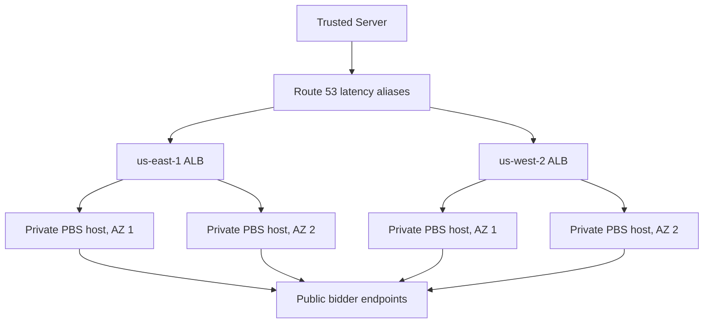

# PBS AWS example

This directory is the locally checked output of the Prebid Server AWS planning workflow. It is a reference for preparing infrastructure and operator inputs. It does not deploy PBS, inject runtime secrets, or change traffic.

## What it models



Each region has two AZs, one EC2 host per AZ, a public ALB, and one NAT gateway per AZ. Terraform creates regional Secrets Manager metadata but never stores credential values.

## Safe local walkthrough

These commands do not contact AWS:

```bash
terraform fmt -check -recursive deploy/pbs-example
terraform -chdir=deploy/pbs-example init -backend=false -input=false
terraform -chdir=deploy/pbs-example validate
terraform -chdir=deploy/pbs-example test -filter=tests/root_unit_test.tftest.hcl
terraform -chdir=deploy/pbs-example/modules/regional init -backend=false -input=false
terraform -chdir=deploy/pbs-example/modules/regional test -filter=tests/security_unit_test.tftest.hcl
cargo run_cli_linux prebid server check \
  --deployment deploy/pbs-example/deployment.example.yaml \
  --json
python3 -m json.tool \
  deploy/pbs-example/runtime/secret-bindings.example.json >/dev/null
docker compose \
  --env-file deploy/pbs-example/runtime/examples/compose.env \
  -f deploy/pbs-example/runtime/compose.yaml \
  config --quiet
bash -n deploy/pbs-example/scripts/smoke-runtime.sh
deploy/pbs-example/scripts/test-smoke-runtime.py
```

The Terraform tests use mocked AWS providers and explicit plan mode. The deployment descriptor and binding file contain fictional identifiers for local validation only. The wiring test renders Compose JSON and exercises the smoke script with fake lifecycle and health commands. It verifies the deployment all-interface binding, smoke-only loopback binding, and forced dummy input selectors without starting containers.

A separately approved `deploy/pbs-example/scripts/smoke-runtime.sh` run pulls and starts the pinned image with dummy values on loopback, checks `/status` and startup-log redaction, and sends no auction request. Static rendering and fake-command checks are not runtime startup evidence.

## Adapting the example

1. Copy this directory into an environment-specific deployment root.
2. Replace the fictional values from `terraform.tfvars.example` in a protected, ignored `.tfvars` file.
3. Replace `examplebidder` with adapters and credential mappings verified against the pinned PBS release and approved by each bidder.
4. Supply approved regional AMIs. Each AMI must contain the chosen OS, SSM agent, Docker, and Compose. This repository does not build the AMIs.
5. Run the local checks above.
6. Obtain separate authorization for AWS identity checks, Terraform plan, apply, and secret writes.
7. Follow `RUNBOOK.md` for the reviewed plan and apply process.

## Generating real CLI inputs after apply

A successful apply produces actual instance IDs and regional secret ARNs. Render ignored operator files from those outputs instead of editing the fictional fixtures:

```bash
terraform output -raw deployment_descriptor_yaml > deployment.generated.yaml
terraform output -raw secret_bindings_json > runtime/secret-bindings.generated.json

ts prebid server check --deployment deployment.generated.yaml
ts prebid server status --deployment deployment.generated.yaml
```

Run these commands from this directory. `status` performs authenticated EC2 reads and requires separate authorization. Review both generated files before using them. They contain resource identifiers but no credential values.

An authorized operator can then write a complete regional secret value with `ts prebid server secrets set`, as documented in `RUNBOOK.md`.

## Stop boundary

The current workflow stops after infrastructure preparation and secret-value writes. It does not install a secret loader, resolve regional PBS YAML onto hosts, start or replace Compose, verify application health, or roll back a release. Those operations require a separately approved runtime implementation. A secret write alone does not update a running container.

See `DEPLOYMENT_PLAN.md` for decisions and limitations, and `RUNBOOK.md` for operator contracts.
