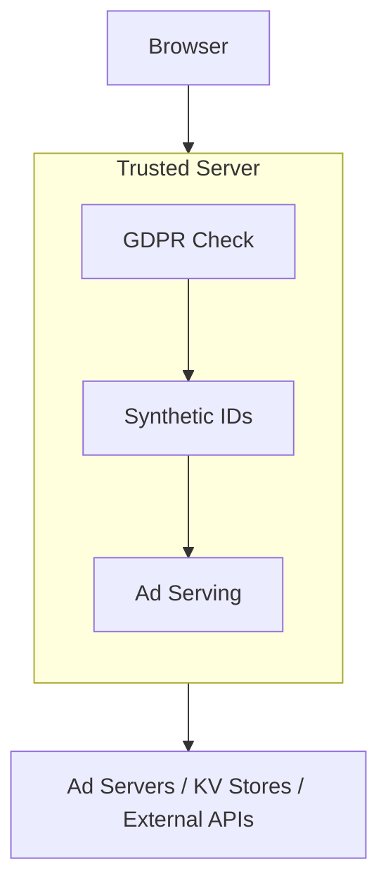

# Architecture

Understanding the architecture of Trusted Server.

## High-Level Overview

Trusted Server is built as a Rust-based edge computing application that runs on Fastly Compute platform.



## Core Components

### trusted-server-common

Core library containing shared functionality:

- Synthetic ID generation
- Cookie handling
- HTTP abstractions
- GDPR consent management
- Ad server integrations

### trusted-server-fastly

Fastly-specific implementation:

- Main application entry point
- Fastly SDK integration
- Request/response handling
- KV store access

## Design Patterns

### RequestWrapper Trait

Abstracts HTTP request handling to support different backends:

```rust
// Placeholder example
pub trait RequestWrapper {
    fn get_header(&self, name: &str) -> Option<String>;
    fn get_cookie(&self, name: &str) -> Option<String>;
    // ...
}
```

### Settings-Driven Configuration

External configuration via `trusted-server.toml` allows deployment-time customization without code changes.

### Privacy-First Design

All tracking operations require explicit GDPR consent checks before execution.

## Data Flow

1. **Request Ingress** - Request arrives at Fastly edge
2. **Consent Validation** - GDPR consent checked
3. **ID Generation** - Synthetic ID generated (if consented)
4. **Ad Request** - Backend ad server called
5. **Response Processing** - Creative processed and modified
6. **Response Egress** - Response sent to browser

## Storage

### Fastly KV Store

Used for:

- Counter storage
- Domain mappings
- Configuration cache
- Synthetic ID state

### No User Data Persistence

User data is not persisted in storage - only processed in-flight at the edge.

## Performance Characteristics

- **Low Latency** - Edge execution near users
- **High Throughput** - Parallel request processing
- **Global Distribution** - Fastly's global network
- **Caching** - Aggressive edge caching

## Security

- **HMAC-based IDs** - Cryptographically secure identifiers
- **No PII Storage** - Privacy by design
- **Request Signing** - Optional request authentication
- **Content Security** - Creative scanning and modification

## WebAssembly Target

Compiled to `wasm32-wasip1` for Fastly Compute:

- Sandboxed execution
- Fast cold starts
- Efficient resource usage

## Next Steps

- Learn about [Configuration](/guide/configuration)
- Set up [Testing](/guide/testing)
