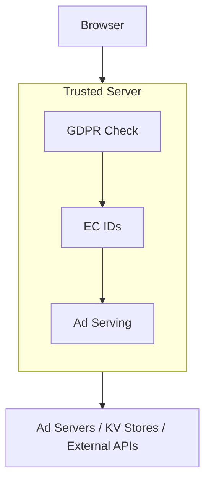

# Architecture

Understanding the architecture of Trusted Server.

## High-Level Overview

Trusted Server is built as a Rust-based edge computing application. The core logic lives in a platform-agnostic library; platform-specific adapters target different runtimes (Fastly Compute, native Axum).


```mermaid
flowchart TD
  browser["Browser"]
  backends["Ad Servers / KV Stores / External APIs"]

  subgraph edge["Trusted Server"]
    direction TB
    gdpr["GDPR Check"]
    ids["EC IDs"]
    ads["Ad Serving"]
    gdpr --> ids --> ads
  end

  browser --> edge
  edge --> backends
```

## Core Components

### trusted-server-core

Core library containing shared functionality:

- Edge Cookie (EC) ID generation
- Cookie handling
- HTTP abstractions
- GDPR consent management
- Ad server integrations

### trusted-server-adapter-fastly

Fastly Compute adapter (WASM binary, `wasm32-wasip1` target):

- Main application entry point for production Fastly deployment
- Fastly SDK integration (KV stores, secret stores, geo lookup)
- Compiled to WebAssembly and run via Viceroy locally or on Fastly's edge

### trusted-server-adapter-axum

Native Axum dev/test adapter (native binary):

- Local development and integration-test adapter — not a production-equivalent runtime
- Platform implementations backed by environment variables instead of Fastly stores
- Listens on `http://localhost:8787` by default

**Current limitations compared to the Fastly adapter:**

| Feature                                    | Axum dev server                                                                                                                              |
| ------------------------------------------ | -------------------------------------------------------------------------------------------------------------------------------------------- |
| KV store                                   | Unavailable — synthetic-ID and consent routes degrade gracefully                                                                             |
| Geo lookup                                 | Always returns `None`                                                                                                                        |
| Config/secret-store writes                 | Return an error (read-only via env vars)                                                                                                     |
| Admin key management (`/_ts/admin/keys/*`) | Returns 501 Not Implemented. Legacy `/admin/keys/*` aliases are denied locally with 404 and are not proxied to the publisher fallback        |
| Auction fan-out ordering                   | Requests run concurrently via `tokio::spawn`; `select` returns first-to-complete but does not replicate Fastly's priority-queue tie-breaking |

## Design Patterns

### RequestWrapper Trait

Abstracts HTTP request handling to support different backends:

```rust
// Placeholder example
pub trait RequestWrapper {
    fn get_header(&self, name: &str) -> Option<String>;
    fn get_cookie(&self, name: &str) -> Option<String>;
    // ...
}
```

### Settings-Driven Configuration

External configuration via `trusted-server.toml` allows deployment-time customization without code changes.

### Privacy-First Design

All tracking operations require explicit GDPR consent checks before execution.

## Data Flow

1. **Request Ingress** - Request arrives at Fastly edge
2. **Consent Validation** - GDPR consent checked
3. **ID Generation** - EC ID generated (if consented)
4. **Ad Request** - Backend ad server called
5. **Response Processing** - Creative processed and modified
6. **Response Egress** - Response sent to browser

## Storage

### Fastly KV Store

Used for:

- Counter storage
- Domain mappings
- Configuration cache
- EC ID state

### No User Data Persistence

User data is not persisted in storage - only processed in-flight at the edge.

## Performance Characteristics

- **Low Latency** - Edge execution near users
- **High Throughput** - Parallel request processing
- **Global Distribution** - Fastly's global network
- **Caching** - Aggressive edge caching

## Security

- **HMAC-based IDs** - Cryptographically secure identifiers
- **No PII Storage** - Privacy by design
- **Request Signing** - Optional request authentication
- **Content Security** - Creative scanning and modification

## Runtime Targets

| Adapter                         | Target          | Use case                                                          |
| ------------------------------- | --------------- | ----------------------------------------------------------------- |
| `trusted-server-adapter-fastly` | `wasm32-wasip1` | Production on Fastly Compute                                      |
| `trusted-server-adapter-axum`   | native          | Local development and integration testing (see limitations above) |

The Fastly adapter compiles to WebAssembly for sandboxed, low-cold-start edge execution. The Axum adapter is a standard native binary — no WASM toolchain required for local development.

## Next Steps

- Learn about [Configuration](/guide/configuration)
- Set up [Testing](/guide/testing)
