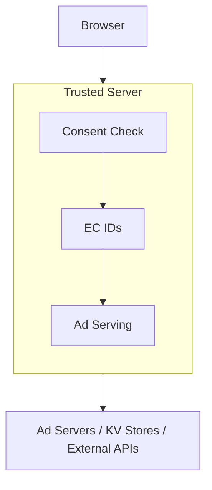

# Architecture

Understanding the architecture of Trusted Server.

## High-Level Overview

Trusted Server is built as a Rust-based edge computing application that runs on Fastly Compute platform.


```mermaid
flowchart TD
  browser["Browser"]
  backends["Ad Servers / KV Stores / External APIs"]

  subgraph edge["Trusted Server"]
    direction TB
    gdpr["Consent Check"]
    ids["EC IDs"]
    ads["Ad Serving"]
    gdpr --> ids --> ads
  end

  browser --> edge
  edge --> backends
```

## Core Components

### trusted-server-core

Core library containing shared functionality:

- Edge Cookie (EC) ID generation
- Cookie handling
- HTTP abstractions
- Consent signal handling
- Ad server integrations

### trusted-server-adapter-fastly

Fastly-specific implementation:

- Main application entry point
- Fastly SDK integration
- Request/response handling
- KV store access

## Design Patterns

### RequestWrapper Trait

Abstracts HTTP request handling to support different backends:

```rust
// Placeholder example
pub trait RequestWrapper {
    fn get_header(&self, name: &str) -> Option<String>;
    fn get_cookie(&self, name: &str) -> Option<String>;
    // ...
}
```

### Settings-Driven Configuration

External configuration via `trusted-server.toml` allows deployment-time customization without code changes.

### Consent-Aware Design

Data collection operations are subject to available consent signals (TCF v2 format, GPP, GPC). Enforcement follows built-in per-jurisdiction rules, with publisher configuration tuning jurisdiction lists, signal interpretation, and conflict resolution.

## Data Flow

1. **Request Ingress**: request arrives at Fastly edge
2. **Consent Signal Read**: any signals present on the request are decoded
3. **ID Generation**: EC ID generated when the consent evaluation permits
4. **Ad Request**: backend ad server called
5. **Response Processing**: creative processed and modified
6. **Response Egress**: response sent to browser

## Storage

### Fastly KV Store

Used for:

- Counter storage
- Domain mappings
- Configuration cache
- EC ID state

### Data Persistence

Page content and request bodies are processed in-flight and are not persisted. EC ID state and related metadata are stored in KV stores as configured.

## Performance Characteristics

- **Low Latency** - Edge execution near users
- **High Throughput** - Parallel request processing
- **Global Distribution** - Fastly's global network
- **Caching** - Aggressive edge caching

## Security

- **HMAC-based IDs** - Cryptographically secure identifiers
- **No Direct Identifiers Stored** - No name, email, or account fields are stored
- **Request Signing** - Optional request authentication
- **Content Security** - Creative scanning and modification

## WebAssembly Target

Compiled to `wasm32-wasip1` for Fastly Compute:

- Sandboxed execution
- Fast cold starts
- Efficient resource usage

## Next Steps

- Learn about [Configuration](/guide/configuration)
- Set up [Testing](/guide/testing)
