# Runtime Integration Attestation Architecture

> **Status:** Proposal
> **Author:** Architecture Team
> **Date:** January 2026

## Problem Statement

The Trusted Server is a WASM-based edge computing system that handles ad serving with pluggable **integrations** (Prebid, Lockr, Didomi, etc.). Publishers configure these integrations via `trusted-server.toml`. The challenge:

**If a publisher tweaks an integration configuration, how can vendors (ad-tech companies, SSPs, DSPs) verify at runtime that what's running is the "canonical" certified version vs. a modified deployment?**

This is critical for:

1. **Vendor Trust**: Ad networks need assurance that bid requests, consent signals, and tracking aren't being tampered with
2. **Compliance**: GDPR/TCF handling must be verifiable
3. **Revenue Integrity**: Bid manipulation or creative injection detection

## Why Attest Configuration?

Attesting the WASM binary alone is insufficient. Here's why configuration requires separate attestation:

### Configuration Controls Behavior Without Changing Code

The Trusted Server's behavior is fundamentally determined by its configuration, not just its code. A publisher can dramatically alter how integrations work by changing `trusted-server.toml`:

```toml
# Example: Publisher could redirect Prebid traffic
[prebid]
server_url = "https://malicious-prebid-proxy.example.com"  # Not the real Prebid server
timeout_ms = 50  # Artificially low timeout to suppress bids

[bidders]
blocked = ["legitimate-competitor"]  # Block specific SSPs
```

Even with a perfectly attested, unmodified WASM binary, these configuration changes would:

- Route bid requests through unauthorized intermediaries
- Suppress legitimate bids through aggressive timeouts
- Block competing demand sources

**Binary attestation proves the code is authentic. Config attestation proves the behavior is approved.**

### The Trust Boundary Problem

| What Binary Attestation Proves         | What It Does NOT Prove                      |
| -------------------------------------- | ------------------------------------------- |
| Code was built from a specific commit  | Which Prebid adapers are configured         |
| Build environment wasn't tampered with | What timeout values are set                 |
| No malicious code was injected         | Which bidders are enabled/blocked           |
| Integration code is authentic          | Whether integration is configured correctly |

Vendors need both:

1. **Code attestation**: "This is the real Prebid integration code"
2. **Config attestation**: "This Prebid integration is configured according to our certification requirements"

### Real-World Attack Scenarios

Without config attestation, a malicious publisher could:

1. **Bid Suppression**: Configure extremely low timeouts so certain SSPs always lose
2. **Traffic Hijacking**: Point integration endpoints to proxy servers that skim data
3. **Consent Manipulation**: Configure CMP integrations to report false consent
4. **Revenue Skimming**: Modify bid response handling to replace creative URLs

All of these attacks use **unmodified code** with **malicious configuration**.

### Vendor Certification Requirements

Many ad-tech vendors have certification programs that require specific configurations:

| Vendor Type      | Configuration Requirements                              |
| ---------------- | ------------------------------------------------------- |
| **SSPs**         | Specific server endpoints, minimum timeout values       |
| **CMPs**         | Correct TCF vendor list, proper consent signal handling |
| **ID Providers** | Approved partner IDs, correct storage domains           |
| **Exchanges**    | Valid seller.json entries, authorized inventory sources |

Config attestation enables vendors to verify: _"Is this deployment configured according to my certification requirements?"_

### Separation Enables Independent Updates

With config separated from binary:

| Scenario               | Binary Attestation    | Config Attestation                     |
| ---------------------- | --------------------- | -------------------------------------- |
| Update Prebid timeout  | Same hash (unchanged) | New config hash                        |
| Add new bidder         | Same hash (unchanged) | New config hash                        |
| Upgrade Trusted Server | New binary hash       | Same config hash (if config unchanged) |
| Security patch         | New binary hash       | Same config hash (if config unchanged) |

This separation allows:

- Publishers to update config without rebuilding
- Vendors to certify configs independently of code versions
- Clear audit trails showing what changed and when

## Current Architecture Analysis

### What Exists Today

| Component                    | Current Implementation                                                                       |
| ---------------------------- | -------------------------------------------------------------------------------------------- |
| **Request Signing**          | Ed25519 signatures on OpenRTB request IDs (`crates/common/src/request_signing/signing.rs`)   |
| **Key Management**           | JWKS at `/.well-known/trusted-server.json`, key rotation via admin endpoints                 |
| **Build Process**            | Cargo → WASM (`wasm32-wasip1`), TS/JS bundled via Vite (`crates/js/build.rs`)                |
| **Integration Registration** | Runtime trait-based discovery from `Settings` (`crates/common/src/integrations/registry.rs`) |
| **Configuration**            | TOML-based, **embedded at build time**, no runtime validation of config authenticity         |

### Current Limitation: Embedded Configuration

**In Fastly Compute (and similar edge runtimes), there is no mutable filesystem for runtime configuration.** The current build embeds configuration into the WASM binary at build time:

```rust
// crates/common/src/settings_data.rs (CURRENT - TO BE REPLACED)
const SETTINGS_DATA: &[u8] = include_bytes!("../../../target/trusted-server-out.toml");

pub fn get_settings() -> Result<Settings, Report<TrustedServerError>> {
    let toml_str = str::from_utf8(SETTINGS_DATA)?;
    Settings::from_toml(toml_str)
}
```

**Why this must change:**

1. **Config changes require a rebuild** - publishers need Rust toolchain just to change settings
2. **Binary hash changes for config tweaks** - can't distinguish "code changed" from "config changed"
3. **No multi-platform support** - config is baked into a single deployment artifact
4. **Attestation is all-or-nothing** - vendors can't certify code separately from config

**Solution:** All major edge platforms provide runtime key-value stores that WASM can access. We will load configuration from these stores instead of embedding it.

### The Gap

Currently, request signing proves "this request came from a Trusted Server instance" but **not**:

- Which WASM binary version is running
- What integration configurations are active (embedded in the binary)
- Whether the deployment matches a vendor-certified build

## Proposed Solution

Two foundational architectural decisions enable comprehensive attestation:

### Core Architecture Decisions

| Decision                       | Status       | Rationale                                                                                                                                |
| ------------------------------ | ------------ | ---------------------------------------------------------------------------------------------------------------------------------------- |
| **Config Separation**          | **Required** | Config loaded from edge platform Config Store at runtime, not embedded in WASM. Enables independent attestation of code vs. settings.    |
| **Modular Integration Crates** | **Required** | Each integration (Prebid, Lockr, Didomi, etc.) is a separate crate with vendor CODEOWNERS. Enables per-vendor code ownership and review. |

### Implementation Components

| Area                      | Approach                                                                                                                          |
| ------------------------- | --------------------------------------------------------------------------------------------------------------------------------- |
| **Core Attestation**      | GitHub Artifact Attestations (Sigstore/SLSA) for WASM binary                                                                      |
| **Integration Ownership** | Vendor CODEOWNERS in monorepo; vendors review/approve their integration code                                                      |
| **Config Store**          | Platform-agnostic loading from Fastly Config Store, Cloudflare KV, or Akamai EdgeKV                                               |
| **Runtime Verification**  | `/.well-known/trusted-server-attestation.json` exposes binary attestation reference + config hash/metadata + integration metadata |
| **CLI Tooling**           | `ts-cli` for config deployment, validation, and attestation across platforms                                                      |

### Implementation Path

1. **Phase 1 - Config Store Implementation**
   - Implement `ConfigStore` trait with platform abstraction
   - Add Fastly, Cloudflare, and Akamai backends
   - Build `ts-cli` for config management (`config push`, `validate`, `hash`)
   - Migrate from embedded config to runtime Config Store loading

2. **Phase 2 - Attestation**
   - Add GitHub Attestations (Sigstore/SLSA) to CI for WASM binary
   - Implement `/.well-known/trusted-server-attestation.json` endpoint
   - Expose config hash in runtime attestation

3. **Phase 3 - Vendor Code Ownership**
   - Set up CODEOWNERS for integration directories
   - Vendors review/approve changes to their integration code
   - IAB CI attests the unified binary after vendor approval

## Architecture Diagrams

### Current Architecture (No Attestation)

Today, there is **no attestation**. Config is embedded at build time, and the WASM binary is deployed without any provenance verification:

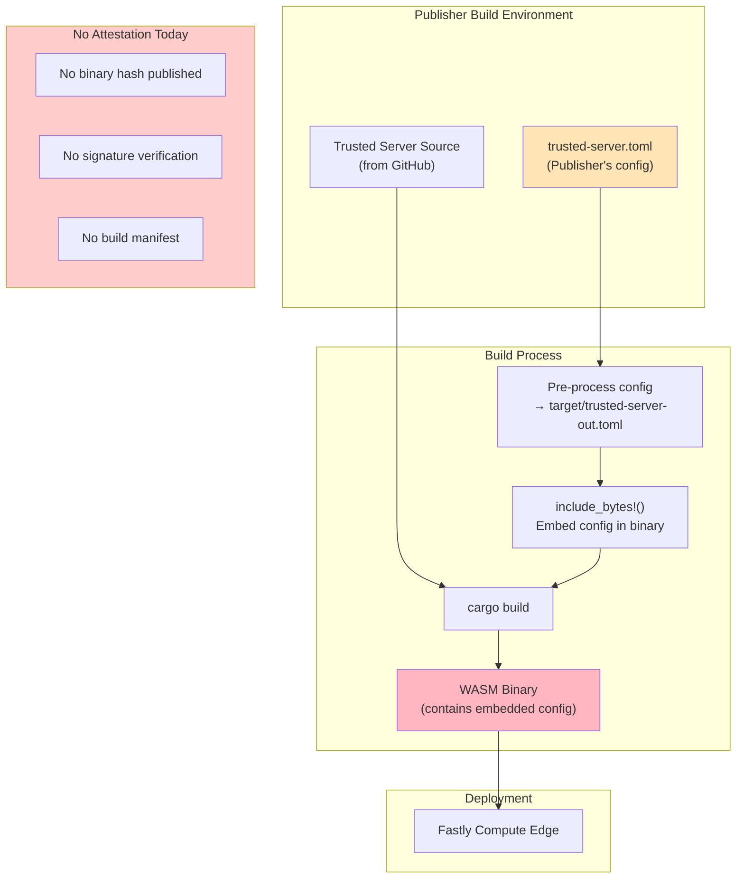

**Problems with current approach:**

- No way to verify which code is running
- Config changes require full rebuild
- Vendors cannot verify deployment integrity
- No separation between code and config attestation

### Target Architecture (Attestation + Config in KV Store)

The target architecture:

1. **Config in KV Store** - loaded at runtime, not embedded in WASM
2. **IAB attests the binary** - single attestation covering core + all integrations
3. **Vendor CODEOWNERS** - vendors review their integration code before merge

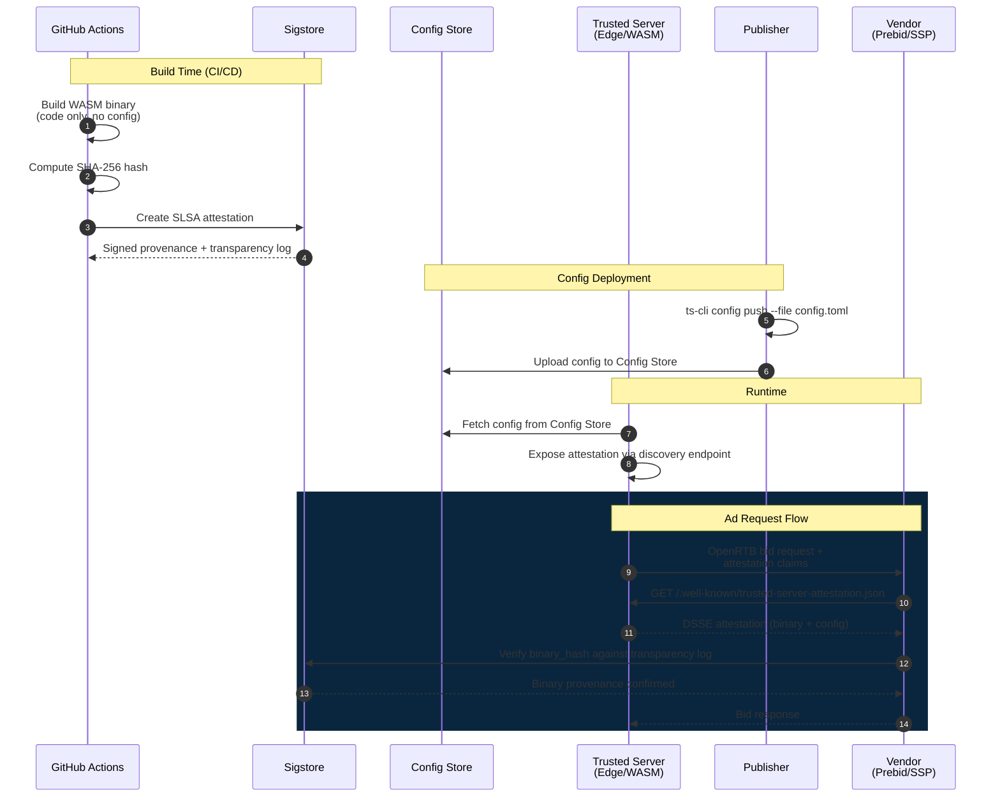

### Target: Attestation Data Flow

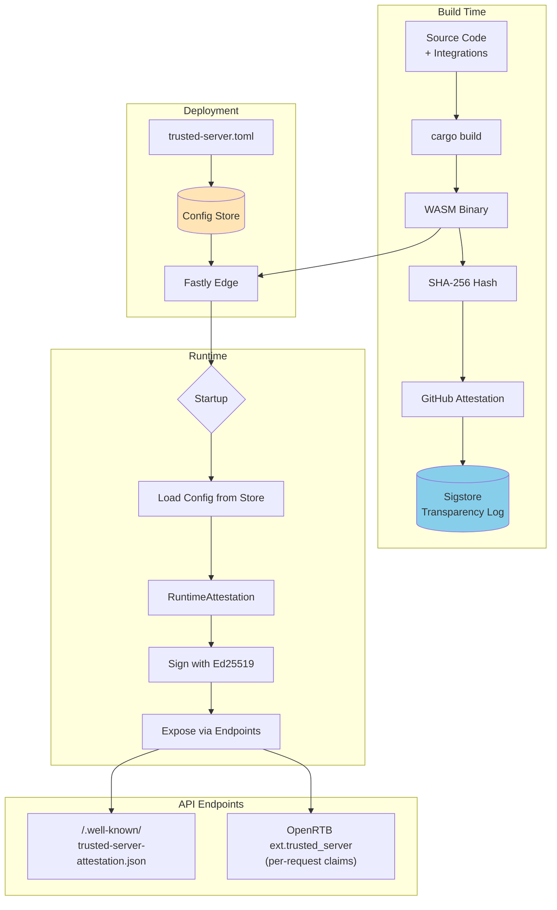

### Target: Verification Flow

Verification is straightforward - vendors verify the binary came from the official IAB repo via Sigstore:

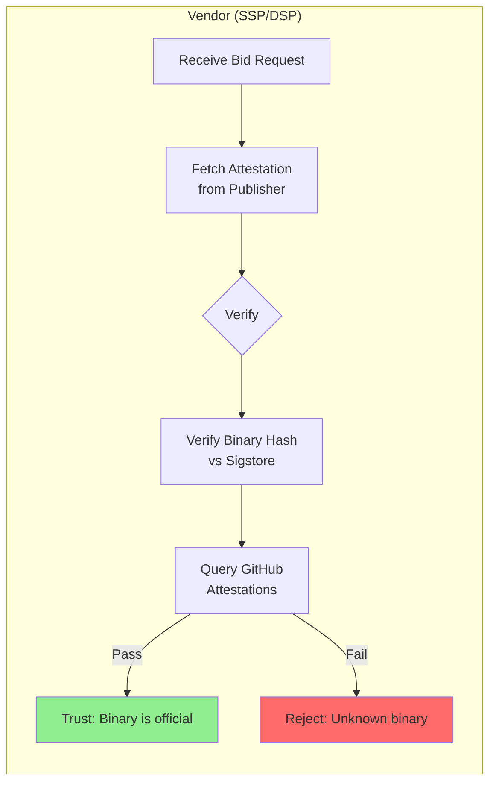

Vendors don't need separate integration attestations - the CODEOWNERS process ensures their code was approved before inclusion, and the integration list is metadata for sanity checks.

## Config Store Architecture (Required)

To enable proper attestation, **configuration must be separated from the WASM binary**. This is a foundational architectural requirement, not an optional enhancement.

### Legacy: Config Embedded in Binary

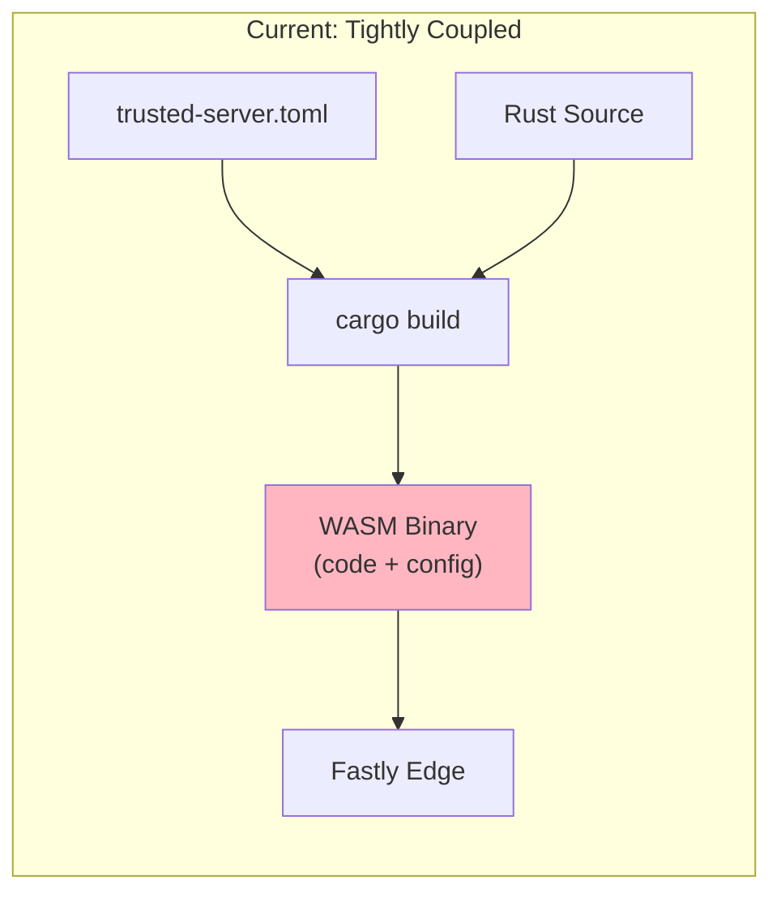

**Problems:**

- Any config change requires a full rebuild
- Binary hash changes even for non-code config tweaks
- Publishers need Rust toolchain to change config
- Can't distinguish "code changed" from "config changed"

### Target: Decoupled Build and Config

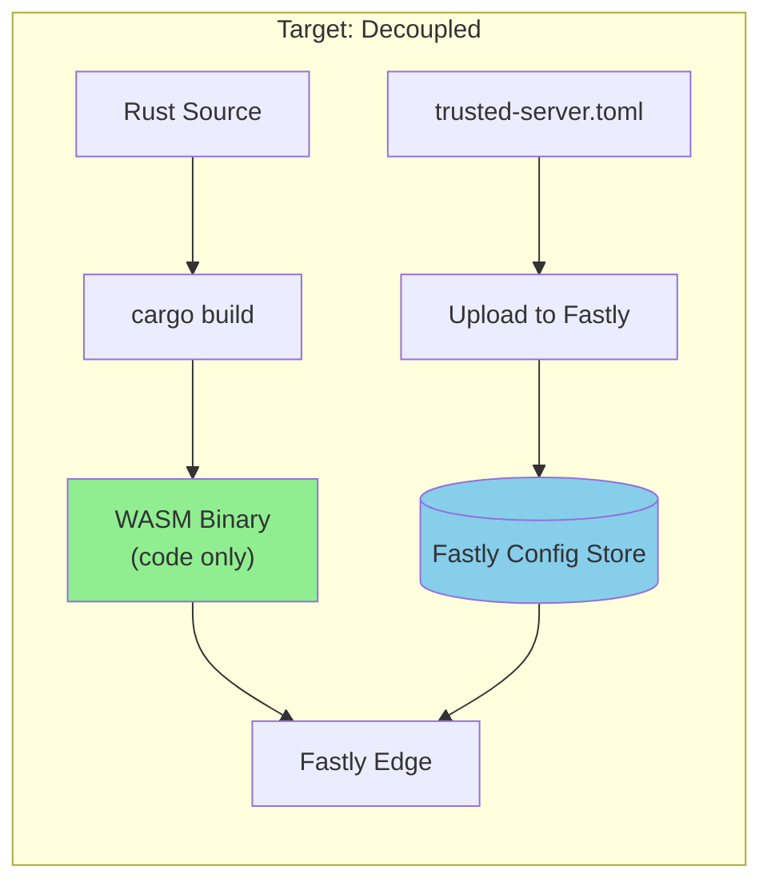

**Benefits:**

- Binary can be attested once per release (code provenance)
- Config can be attested separately (publisher settings)
- Config changes don't require rebuild
- Clear separation: "Is the code trusted?" vs "Is the config compliant?"

### Multi-Platform Config Store Support

All major edge platforms provide runtime key-value stores. The architecture must support all of them:

| Platform               | Config Store                                                                                        | API      | Consistency                        | CLI Tool              |
| ---------------------- | --------------------------------------------------------------------------------------------------- | -------- | ---------------------------------- | --------------------- |
| **Fastly Compute**     | [Config Store](https://www.fastly.com/documentation/reference/api/services/resources/config-store/) | REST API | Near real-time (treat as eventual) | `fastly config-store` |
| **Cloudflare Workers** | [Workers KV](https://developers.cloudflare.com/kv/)                                                 | REST API | Eventually consistent (~60s)       | `wrangler kv`         |
| **Akamai EdgeWorkers** | [EdgeKV](https://www.akamai.com/products/edgekv)                                                    | REST API | Eventually consistent (~10s)       | `akamai edgekv`       |

### Implementation: Platform-Agnostic Config Loading

We define a trait for config store access, with platform-specific implementations:

```rust
// crates/common/src/config_store.rs
use async_trait::async_trait;

pub const SETTINGS_KEY: &str = "settings";
pub const SETTINGS_HASH_KEY: &str = "settings-hash";
pub const SETTINGS_SIGNATURE_KEY: &str = "settings-signature";
pub const SETTINGS_METADATA_KEY: &str = "settings-metadata";

/// Platform-agnostic config store trait
#[async_trait]
pub trait ConfigStore {
    async fn get(&self, key: &str) -> Result<Option<String>, ConfigStoreError>;
}

/// Load settings from the platform's config store
pub async fn get_settings<S: ConfigStore>(store: &S) -> Result<Settings, TrustedServerError> {
    match store.get(SETTINGS_KEY).await? {
        Some(toml_str) => {
            tracing::info!("Loading config from Config Store");
            Settings::from_toml(&toml_str)
        }
        None => Err(TrustedServerError::Configuration {
            message: format!("No '{}' key found in Config Store", SETTINGS_KEY),
        }),
    }
}
```

Config Store keys are standardized:

- `settings` contains the UTF-8 TOML payload
- `settings-hash` (optional) contains `sha256:<hex>` of the exact bytes stored under `settings`
- `settings-signature` (optional) contains a DSSE envelope whose payload is the exact bytes stored under `settings` (use `payloadType: application/vnd.iab.trusted-server.config+toml`)
- `settings-metadata` (optional) is JSON containing `version`, `published_at` (RFC3339), `valid_until` (RFC3339), and optional `policy_id` (validated policy/schema identifier)

#### Fastly Implementation

```rust
// crates/fastly/src/config_store.rs
use async_trait::async_trait;
use fastly::ConfigStore as FastlyStore;

pub struct FastlyConfigStore {
    store: FastlyStore,
}

impl FastlyConfigStore {
    pub fn open(name: &str) -> Result<Self, ConfigStoreError> {
        let store = FastlyStore::open(name);
        Ok(Self { store })
    }
}

#[async_trait]
impl ConfigStore for FastlyConfigStore {
    async fn get(&self, key: &str) -> Result<Option<String>, ConfigStoreError> {
        Ok(self.store.get(key))
    }
}
```

#### Cloudflare Implementation

```rust
// crates/cloudflare/src/config_store.rs
use async_trait::async_trait;
use worker::kv::KvStore;

pub struct CloudflareConfigStore {
    kv: KvStore,
}

impl CloudflareConfigStore {
    pub fn from_binding(kv: KvStore) -> Self {
        Self { kv }
    }
}

#[async_trait]
impl ConfigStore for CloudflareConfigStore {
    async fn get(&self, key: &str) -> Result<Option<String>, ConfigStoreError> {
        self.kv.get(key).text().await
    }
}
```

#### Akamai Implementation

```rust
// crates/akamai/src/config_store.rs
use async_trait::async_trait;
use edgekv::EdgeKV;

pub struct AkamaiConfigStore {
    namespace: String,
    group: String,
}

impl AkamaiConfigStore {
    pub fn new(namespace: &str, group: &str) -> Self {
        Self {
            namespace: namespace.to_string(),
            group: group.to_string(),
        }
    }
}

#[async_trait]
impl ConfigStore for AkamaiConfigStore {
    async fn get(&self, key: &str) -> Result<Option<String>, ConfigStoreError> {
        EdgeKV::open(&self.namespace, &self.group)?.get_text(key)
    }
}
```

### Attestation with Decoupled Architecture

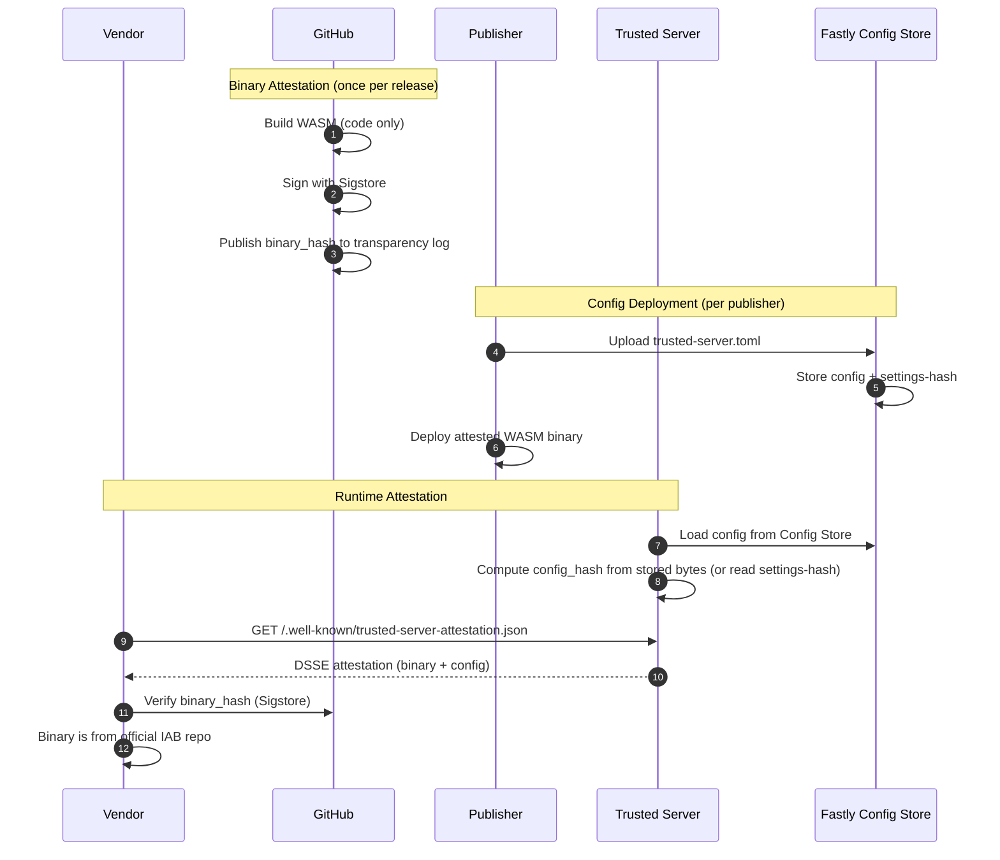

### Runtime Attestation Statement (in-toto)

Sigstore uses DSSE envelopes carrying in-toto Statements. The runtime attestation should follow the same pattern.

```json
{
  "_type": "https://in-toto.io/Statement/v1",
  "subject": [
    {
      "name": "trusted-server-fastly.wasm",
      "digest": {
        "sha256": "abc123..."
      }
    }
  ],
  "predicateType": "https://iab.com/trusted-server/runtime-attestation/v1",
  "predicate": {
    "version": "1.0",
    "binary": {
      "name": "trusted-server",
      "version": "1.5.0",
      "hash": "sha256:abc123...",
      "git_commit": "def456...",
      "sigstore_log_index": 123456,
      "attested_by": {
        "identity": "iab-tech-lab",
        "oidc_issuer": "https://token.actions.githubusercontent.com",
        "certificate_subject": "https://github.com/IABTechLab/trusted-server/.github/workflows/release.yml@refs/tags/v1.5.0"
      }
    },
    "integrations": [
      {
        "name": "prebid",
        "enabled": true,
        "codeowner": "@prebid/trusted-server-maintainers"
      },
      {
        "name": "didomi",
        "enabled": true,
        "codeowner": "@didomi/trusted-server-maintainers"
      }
    ],
    "config": {
      "hash": "sha256:789abc...",
      "source": "config_store",
      "version": "2026-02-15T10:30:00Z",
      "published_at": "2026-02-15T10:30:00Z",
      "valid_until": "2026-02-16T10:30:00Z",
      "policy_id": "prebid-v1"
    }
  }
}
```

**Signature and hashing rules:**

- The Statement is wrapped in a DSSE envelope with `payloadType: application/vnd.in-toto+json`
- `keyid` in the DSSE signature identifies the deployment signing key published in `/.well-known/trusted-server.json` (reuses the request-signing JWKS)
- `binary.hash` is embedded at build time (the runtime does not compute it from the module)
- `subject.digest.sha256` must match `binary.hash` (without the `sha256:` prefix)
- `config.hash` is SHA-256 over the exact bytes stored under `settings` (LF-normalized), represented as `sha256:<hex>`
- If `settings-signature` is present, it is verified before the config is parsed or used

Vendors verify `binary.hash` against the Sigstore transparency log and verify the DSSE signature using the JWKS.
If `sigstore_log_index` is present, vendors can resolve the log entry directly without searching.

#### Attestation Envelope (Sigstore/DSSE)

```json
{
  "payloadType": "application/vnd.in-toto+json",
  "payload": "eyJfdHlwZSI6Imh0dHBzOi8vaW4tdG90by5pby9TdGF0ZW1lbnQvdjEiLC4uLn0",
  "signatures": [
    {
      "keyid": "publisher-2026-A",
      "sig": "m9R0tQ...base64url..."
    }
  ]
}
```

### Implementation Phases

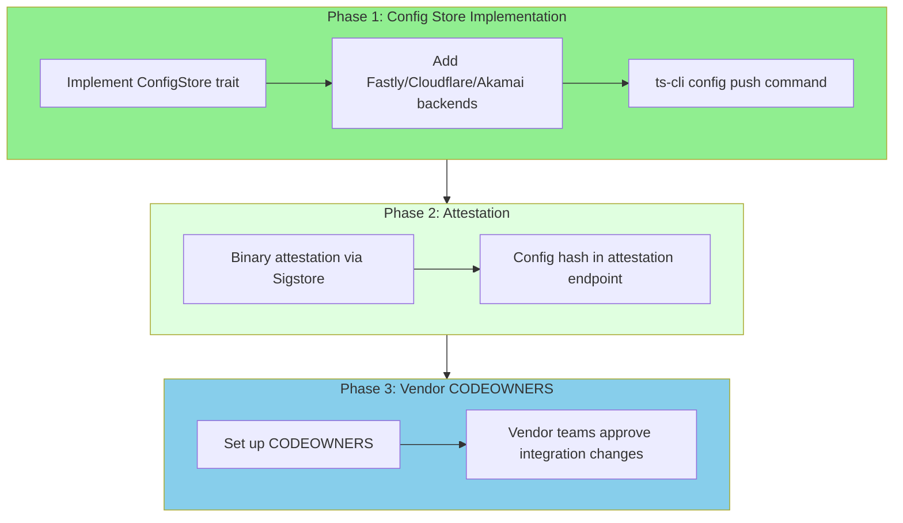

### Design Considerations

| Aspect                   | Design Decision                                        | Rationale                                          |
| ------------------------ | ------------------------------------------------------ | -------------------------------------------------- |
| **Config source**        | Config Store only (no embedded fallback in production) | Ensures consistent attestation model               |
| **Local development**    | Mock config store or env-based loading                 | `ts-cli` can populate local Viceroy config store   |
| **Cold start latency**   | Accept slight overhead                                 | Config Store reads are fast (<10ms on Fastly)      |
| **Config tampering**     | Detectable via hash mismatch                           | Runtime hash computation + attestation             |
| **Config authenticity**  | Verify signed config payload                           | `settings-signature` checked before parsing config |
| **Rollback protection**  | Config version + validity window                       | Prevents replay of stale configs                   |
| **Attestation envelope** | DSSE (Sigstore standard)                              | Avoids canonicalization ambiguity, better tooling  |
| **Request binding**      | Include `attestation_hash` in signed request           | Cryptographically binds runtime claims per request |
| **Provenance lookup**    | Include Sigstore log index or bundle                   | Enables low-latency verification                   |
| **Multi-platform**       | Abstract via trait                                     | Same WASM binary logic, platform-specific backends |
| **Eventual consistency** | Include config version + publish time                  | Vendors can detect stale configs briefly           |

### CLI Tool: `ts-cli`

To support the Config Store workflow, we need a CLI tool for managing configuration deployment and attestation. This tool bridges local development with edge deployment.

#### Commands

```bash
# Push config to edge platform (auto-detects from config or --platform flag)
ts-cli config push --file trusted-server.toml

# Push to specific platform
ts-cli config push --platform fastly --store-id <STORE_ID> --file trusted-server.toml
ts-cli config push --platform cloudflare --namespace <NS_ID> --file trusted-server.toml
ts-cli config push --platform akamai --namespace <NS> --group <GRP> --file trusted-server.toml

# Push with signature + metadata (recommended)
ts-cli config push --platform fastly --store-id <STORE_ID> --file trusted-server.toml --sign --key signing-key.pem --version 2026-02-15T10:30:00Z

# Validate config syntax
ts-cli config validate --file trusted-server.toml

# Show config hash (SHA-256) for attestation
ts-cli config hash --file trusted-server.toml

# Compare local config with deployed config
ts-cli config diff --platform fastly --store-id <STORE_ID> --file trusted-server.toml

# Generate attestation document for config
ts-cli attest config --file trusted-server.toml --sign --key signing-key.pem

# Pull current config from Config Store (for debugging)
ts-cli config pull --platform fastly --store-id <STORE_ID> --output current.toml
```

#### Architecture

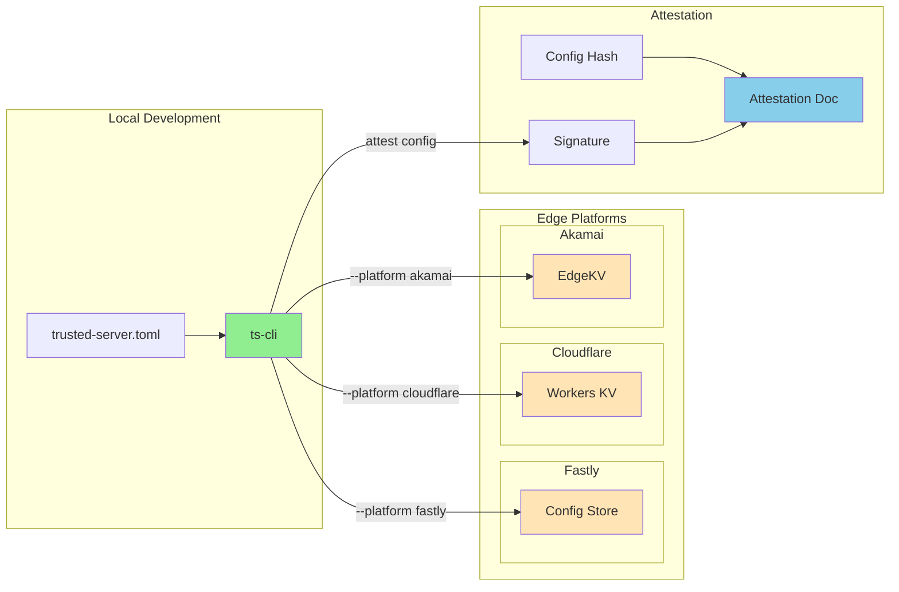

#### Config Push Workflow

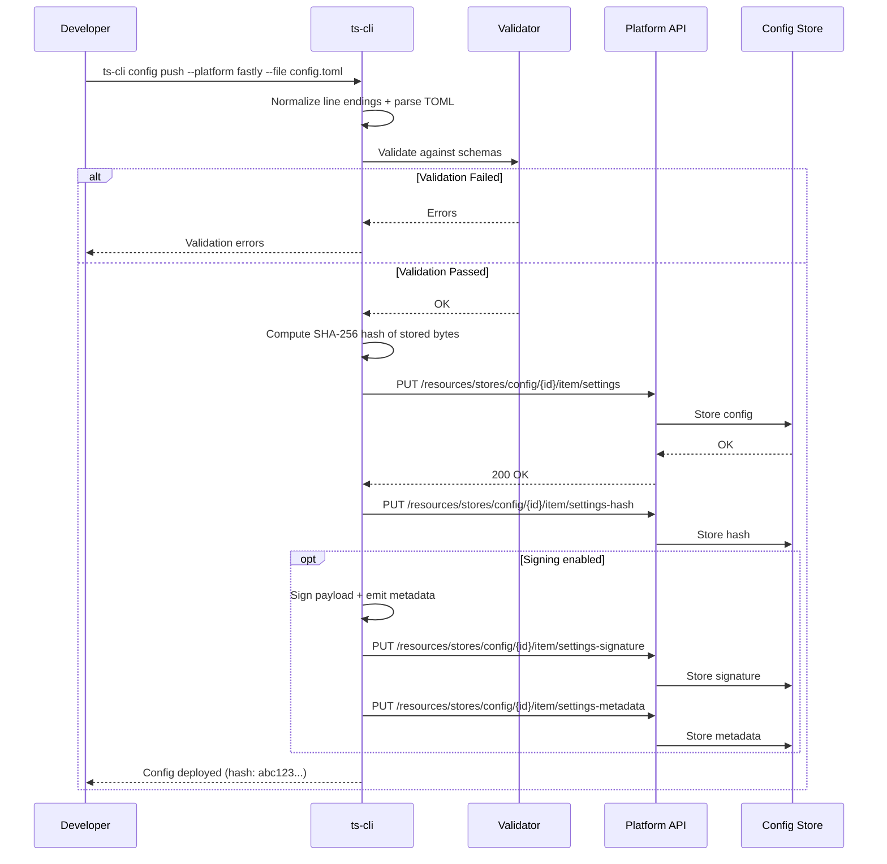

#### Implementation

The CLI would be implemented as a Rust binary in `crates/ts-cli/`:

```rust
// crates/ts-cli/src/main.rs
use clap::{Parser, Subcommand};

#[derive(Parser)]
#[command(name = "ts-cli")]
#[command(about = "Trusted Server CLI for config and attestation management")]
struct Cli {
    #[command(subcommand)]
    command: Commands,
}

#[derive(Subcommand)]
enum Commands {
    /// Configuration management
    Config {
        #[command(subcommand)]
        action: ConfigAction,
    },
    /// Attestation generation
    Attest {
        #[command(subcommand)]
        action: AttestAction,
    },
}

#[derive(Clone, ValueEnum)]
enum Platform {
    Fastly,
    Cloudflare,
    Akamai,
}

#[derive(Subcommand)]
enum ConfigAction {
    /// Push config to edge platform Config Store
    Push {
        #[arg(long, short)]
        platform: Platform,
        #[arg(long, short)]
        file: PathBuf,
        /// Fastly: store ID, Cloudflare: namespace ID, Akamai: namespace
        #[arg(long)]
        store_id: Option<String>,
        /// Cloudflare: namespace ID (alias for store_id)
        #[arg(long)]
        namespace: Option<String>,
        /// Akamai: group name
        #[arg(long)]
        group: Option<String>,
        /// Sign config payload and upload settings-signature/settings-metadata
        #[arg(long)]
        sign: bool,
        /// Signing key for config payload (Ed25519 private key)
        #[arg(long)]
        key: Option<PathBuf>,
        /// Config version identifier (monotonic or timestamp)
        #[arg(long)]
        version: Option<String>,
        /// Optional validity window end (RFC3339)
        #[arg(long)]
        valid_until: Option<String>,
        /// Optional published timestamp (RFC3339, defaults to now)
        #[arg(long)]
        published_at: Option<String>,
        /// Optional policy identifier for vendor compliance
        #[arg(long)]
        policy_id: Option<String>,
    },
    /// Validate config against schemas
    Validate {
        #[arg(long, short)]
        file: PathBuf,
    },
    /// Compute and display config hash
    Hash {
        #[arg(long, short)]
        file: PathBuf,
        #[arg(long, default_value = "sha256")]
        algorithm: String,
    },
    /// Compare local vs deployed config
    Diff {
        #[arg(long, short)]
        platform: Platform,
        #[arg(long)]
        store_id: Option<String>,
        #[arg(long)]
        namespace: Option<String>,
        #[arg(long, short)]
        file: PathBuf,
    },
    /// Pull config from Config Store
    Pull {
        #[arg(long, short)]
        platform: Platform,
        #[arg(long)]
        store_id: Option<String>,
        #[arg(long)]
        namespace: Option<String>,
        #[arg(long, short)]
        output: PathBuf,
    },
}

#[derive(Subcommand)]
enum AttestAction {
    /// Generate attestation for config
    Config {
        #[arg(long, short)]
        file: PathBuf,
        #[arg(long)]
        sign: bool,
        #[arg(long)]
        key: Option<PathBuf>,
        #[arg(long, default_value = "json")]
        format: String,
    },
}
```

#### Config Hash Computation

```rust
// crates/ts-cli/src/hash.rs
use sha2::{Sha256, Digest};
use std::fs;

pub fn compute_config_hash(path: &Path) -> Result<String, Error> {
    // Read and normalize line endings to avoid OS-dependent hashes
    let content = fs::read_to_string(path)?;
    let normalized = content.replace("\r\n", "\n");

    // Compute SHA-256 over the exact bytes that will be stored
    let mut hasher = Sha256::new();
    hasher.update(normalized.as_bytes());
    let hash = hasher.finalize();

    Ok(format!("sha256:{}", hex::encode(hash)))
}
```

`ts-cli` should upload the normalized bytes and store `settings-hash` computed from the same payload so runtime and CLI hashes always match.

If signing is enabled, `ts-cli` should also emit `settings-signature` as a DSSE envelope over the normalized bytes and write `settings-metadata` with `version`, `published_at` (defaulting to now), and optional `valid_until`/`policy_id`.

#### Attestation Document Format

The CLI generates attestation documents compatible with Sigstore/in-toto:

```json
{
  "_type": "https://in-toto.io/Statement/v1",
  "subject": [
    {
      "name": "trusted-server.toml",
      "digest": {
        "sha256": "abc123..."
      }
    }
  ],
  "predicateType": "https://iab.com/trusted-server/config-attestation/v1",
  "predicate": {
    "timestamp": "2024-01-15T10:30:00Z",
    "publisher": "example.com",
    "integrations": {
      "prebid": {
        "enabled": true,
        "version_constraint": "^1.0.0"
      },
      "lockr": {
        "enabled": true,
        "config_hash": "sha256:def456..."
      }
    },
    "validation": {
      "passed": true,
      "schemas_checked": ["prebid-v1", "lockr-v1"]
    }
  }
}
```

Publish this Statement as a DSSE envelope (`payloadType: application/vnd.in-toto+json`) to align with Sigstore tooling.

#### Integration with CI/CD

```yaml
# .github/workflows/deploy-config.yml
name: Deploy Config

on:
  push:
    paths:
      - "trusted-server.toml"

jobs:
  deploy:
    runs-on: ubuntu-latest
    steps:
      - uses: actions/checkout@v4

      - name: Install ts-cli
        run: cargo install --path crates/ts-cli

      - name: Validate config
        run: ts-cli config validate --file trusted-server.toml

      - name: Generate attestation
        run: |
          ts-cli attest config \
            --file trusted-server.toml \
            --sign \
            --key ${{ secrets.SIGNING_KEY }} \
            --format json > attestation.json

      - name: Push to Config Store
        env:
          FASTLY_API_KEY: ${{ secrets.FASTLY_API_KEY }}
        run: |
          ts-cli config push \
            --platform fastly \
            --store-id ${{ vars.CONFIG_STORE_ID }} \
            --file trusted-server.toml

      - name: Upload attestation artifact
        uses: actions/attest-build-provenance@v1
        with:
          subject-path: trusted-server.toml
```

#### Environment Variables

```bash
# Platform selection
TRUSTED_SERVER__PLATFORM=fastly          # Default platform (fastly, cloudflare, akamai)

# Fastly
FASTLY_API_KEY=xxx                       # Fastly API key
TRUSTED_SERVER__FASTLY__CONFIG_STORE_ID=abc123
TRUSTED_SERVER__FASTLY__SECRET_STORE_ID=def456

# Cloudflare
CLOUDFLARE_API_TOKEN=xxx                 # Cloudflare API token
CLOUDFLARE_ACCOUNT_ID=xxx                # Cloudflare account ID
TRUSTED_SERVER__CLOUDFLARE__KV_NAMESPACE_ID=abc123

# Akamai
AKAMAI_EDGEGRID_CONFIG=~/.edgerc         # Akamai EdgeGrid credentials
TRUSTED_SERVER__AKAMAI__NAMESPACE=trusted_server
TRUSTED_SERVER__AKAMAI__GROUP=config

# Attestation
TRUSTED_SERVER__ATTESTATION__SIGNING_KEY_PATH=./key

# CLI Behavior
TRUSTED_SERVER__CLI__OUTPUT_FORMAT=json  # Output format (json, yaml, text)
TRUSTED_SERVER__CLI__VERBOSE=true        # Verbose logging
```

## Integration Code Ownership (Required Architecture)

Integrations are part of the trusted-server monorepo, with vendor ownership via GitHub CODEOWNERS. This keeps attestation simple: **IAB attests the entire binary** (including all integrations) via a single Sigstore attestation, just like any other release.

### Key Principle: Unified Attestation

The attestation model is identical for core code and integrations:

| Component           | Who Reviews Code           | Who Attests Binary     |
| ------------------- | -------------------------- | ---------------------- |
| Core trusted-server | IAB maintainers            | IAB via GitHub Actions |
| Prebid integration  | Prebid team (CODEOWNERS)   | IAB via GitHub Actions |
| Lockr integration   | AuDigent team (CODEOWNERS) | IAB via GitHub Actions |
| Didomi integration  | Didomi team (CODEOWNERS)   | IAB via GitHub Actions |

**Vendors don't need separate integration attestations** - they trust the CODEOWNERS process, and the integration list in the attestation is metadata for sanity checks.

### CODEOWNERS File

```
# .github/CODEOWNERS
# Vendors own their integration directories

/crates/common/src/integrations/prebid/    @prebid/trusted-server-maintainers
/crates/common/src/integrations/lockr/     @AuDigent/trusted-server-maintainers
/crates/common/src/integrations/didomi/    @didomi/trusted-server-maintainers
/crates/common/src/integrations/permutive/ @permutive/trusted-server-maintainers
```

### Attestation Flow

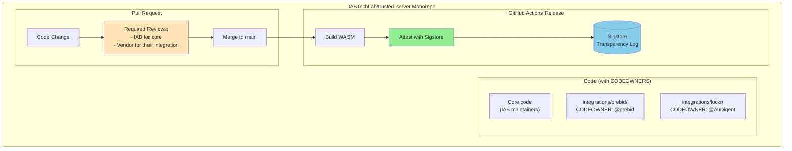

This is the same flow as the main binary attestation - no special vendor verification needed.

### Trust Model

| Actor         | What They Trust                             | How They Verify                                 |
| ------------- | ------------------------------------------- | ----------------------------------------------- |
| **Vendor**    | Their code wasn't modified without approval | CODEOWNER approval required for their directory |
| **Publisher** | Binary came from official IAB repo          | IAB's Sigstore attestation                      |
| **IAB**       | Vendors approved their integration code     | CODEOWNER approval in PR history                |

### Monorepo Structure

```
trusted-server/
├── .github/
│   └── CODEOWNERS               # Vendor ownership rules
├── crates/
│   ├── common/
│   │   └── src/
│   │       └── integrations/
│   │           ├── mod.rs       # Integration registry
│   │           ├── prebid/      # CODEOWNER: @prebid
│   │           ├── lockr/       # CODEOWNER: @AuDigent
│   │           ├── didomi/      # CODEOWNER: @didomi
│   │           └── permutive/   # CODEOWNER: @permutive
│   └── fastly/                  # Fastly runtime (IAB owned)
```

### Challenges and Mitigations

| Challenge                | Mitigation                                             |
| ------------------------ | ------------------------------------------------------ |
| **Vendor Coordination**  | CODEOWNERS ensures vendors are notified of changes     |
| **Testing Matrix**       | CI tests all integration combinations                  |
| **Vendor Response Time** | Branch protection rules with timeout for vendor review |

### Attestation Document

The attestation document exposed at `/.well-known/trusted-server-attestation.json` is a DSSE envelope whose payload is the in-toto Statement shown earlier. Integration metadata lives under `predicate.integrations`:

```json
{
  "_type": "https://in-toto.io/Statement/v1",
  "predicateType": "https://iab.com/trusted-server/runtime-attestation/v1",
  "predicate": {
    "integrations": [
      {
        "name": "prebid",
        "enabled": true,
        "codeowner": "@prebid/trusted-server-maintainers"
      },
      {
        "name": "didomi",
        "enabled": true,
        "codeowner": "@didomi/trusted-server-maintainers"
      }
    ]
  }
}
```

## Detailed Implementation Reference

This section provides detailed code examples and implementation patterns for the attestation system.

### GitHub Artifact Attestations (CI/CD)

Use [GitHub Artifact Attestations](https://docs.github.com/actions/security-for-github-actions/using-artifact-attestations/using-artifact-attestations-to-establish-provenance-for-builds) to create SLSA Build Level 2/3 provenance for the WASM binary.

```yaml
# .github/workflows/release.yml
jobs:
  build:
    runs-on: ubuntu-latest
    permissions:
      id-token: write
      contents: read
      attestations: write
    steps:
      - uses: actions/checkout@v4

      - name: Build WASM
        run: cargo build --bin trusted-server-fastly --release --target wasm32-wasip1

      - name: Generate SBOM
        uses: anchore/sbom-action@v0
        with:
          path: target/wasm32-wasip1/release/

      - name: Attest Build Provenance
        uses: actions/attest-build-provenance@v2
        with:
          subject-path: target/wasm32-wasip1/release/trusted-server-fastly.wasm

      - name: Attest SBOM
        uses: actions/attest-sbom@v2
        with:
          subject-path: target/wasm32-wasip1/release/trusted-server-fastly.wasm
          sbom-path: sbom.spdx.json
```

**What This Provides:**

- Sigstore-signed attestation proving the binary was built from specific commit
- SLSA provenance linking artifact → source → build environment
- Verification via `gh attestation verify trusted-server-fastly.wasm -R IABTechLab/trusted-server`

**Limitation:** This proves build provenance but not runtime state.

### WASM Binary Signing (Embedded Signatures)

Optionally, implement [wasm-sign](https://github.com/frehberg/wasm-sign) style signatures embedded in the WASM custom section for additional verification.

```rust
// New crate: crates/attestation/src/wasm_signature.rs

/// Signature stored in WASM custom section "ts-attestation"
#[derive(Serialize, Deserialize)]
pub struct WasmAttestation {
    /// Ed25519 signature over the WASM module (excluding this section)
    pub signature: [u8; 64],
    /// Key ID from IAB's JWKS
    pub kid: String,
    /// Timestamp of signing
    pub signed_at: u64,
    /// SHA-256 of the WASM module (pre-signature)
    pub module_hash: [u8; 32],
    /// Version identifier
    pub version: String,
}
```

**Integration with Fastly:**

```rust
// crates/fastly/src/main.rs - Add to startup

fn load_embedded_binary_attestation() -> Result<WasmAttestation, AttestationError> {
    // In WASM, we can't read our own module bytes directly at runtime.
    // Embed the attestation payload at build time instead.
    let attestation_json = include_str!(concat!(env!("OUT_DIR"), "/attestation.json"));
    let attestation: WasmAttestation = serde_json::from_str(attestation_json)?;

    // Expose via endpoint for external verification
    Ok(attestation)
}
```

### Configuration Attestation

Configuration attestation exposes the config hash for transparency. If `settings-signature` is present, verify it before parsing the config. If `settings-metadata` is present, propagate its `version`, `published_at`, and `valid_until` into the attestation document. This allows anyone to verify that a deployment's configuration hasn't changed unexpectedly.

```rust
// crates/common/src/attestation/runtime.rs

/// Integration metadata exposed in runtime attestation
pub struct IntegrationMetadata {
    pub name: String,
    pub enabled: bool,
    /// Optional CODEOWNER handle (if embedded at build time)
    pub codeowner: Option<String>,
}

/// Runtime attestation state computed at startup
pub struct RuntimeAttestation {
    /// Binary name (stable identifier)
    pub binary_name: String,
    /// Binary version
    pub version: String,
    /// Git commit SHA (embedded at build time)
    pub git_commit: String,
    /// Sigstore log index for the attested binary (if known)
    pub sigstore_log_index: Option<u64>,
    /// Binary hash (embedded at build time; matches Sigstore attestation)
    pub binary_hash: [u8; 32],
    /// Hash of current configuration
    pub config_hash: [u8; 32],
    /// Config version (monotonic or timestamp)
    pub config_version: String,
    /// Config published timestamp (RFC3339)
    pub config_published_at: String,
    /// Config validity window end (RFC3339)
    pub config_valid_until: Option<String>,
    /// Optional policy identifier validated at deploy time
    pub config_policy_id: Option<String>,
    /// Integrations enabled in this deployment
    pub integrations: Vec<IntegrationMetadata>,
    /// Timestamp of attestation computation
    pub computed_at: u64,
    /// Hash of the in-toto Statement payload (for request binding)
    pub attestation_hash: [u8; 32],
}
```

Compute `attestation_hash` over the in-toto Statement bytes before signing; do not include `attestation_hash` inside the payload itself.

#### Attestation Endpoint

```rust
// New endpoint: GET /.well-known/trusted-server-attestation.json

pub async fn handle_attestation_request(
    settings: &Settings,
) -> Result<Response, Report<TrustedServerError>> {
    let attestation = compute_runtime_attestation(settings)?;

    let statement = build_runtime_statement(&attestation)?;
    let envelope = dsse::sign(
        serde_json::to_vec(&statement)?,
        "application/vnd.in-toto+json",
        &load_signing_key()?,
        get_current_key_id()?,
    )?;

    Ok(Response::from_status(StatusCode::OK)
        .with_header(header::CONTENT_TYPE, "application/json")
        .with_body(serde_json::to_vec(&envelope)?))
}
```

### Request-Level Attestation Claims

Embed attestation claims in outgoing requests:

```rust
// Modify enhance_openrtb_request in prebid.rs

fn enhance_openrtb_request(
    request: &mut Json,
    settings: &Settings,
    attestation: &RuntimeAttestation,
) -> Result<(), Report<TrustedServerError>> {
    if let Some(request_signing_config) = &settings.request_signing {
        if request_signing_config.enabled {
            // Use a per-request nonce (for example, OpenRTB request ID).
            // Include attestation_hash in the request signature payload.
            let nonce = request["id"].clone();
            let claims = json!({
                "ts_attestation": {
                    "binary_hash": format!("sha256:{}", hex::encode(&attestation.binary_hash)),
                    "binary_version": &attestation.version,
                    "config_hash": format!("sha256:{}", hex::encode(&attestation.config_hash)),
                    "attestation_hash": format!("sha256:{}", hex::encode(&attestation.attestation_hash)),
                    "timestamp": attestation.computed_at,
                    "valid_until": attestation.config_valid_until,
                    "nonce": nonce,
                }
            });

            request["ext"]["trusted_server"]["attestation"] = claims;
        }
    }

    Ok(())
}
```

The request signing scheme should cover the attestation claims (or at least `attestation_hash`) so they cannot be replayed or substituted out of band.

## GitHub Attestations Applicability

**Are GitHub Attestations usable here?** Yes, as the foundation:

| GitHub Attestation Feature | Applicability                                 |
| -------------------------- | --------------------------------------------- |
| Build Provenance (SLSA)    | Proves WASM was built from specific commit    |
| Sigstore Signing           | Provides public transparency log              |
| SBOM Attestations          | Documents dependencies                        |
| `gh attestation verify`    | Allows vendors to verify against GitHub's log |

**But they're insufficient alone because:**

1. They attest to _build time_, not _runtime configuration_
2. They can't detect configuration changes post-deployment
3. Edge deployment (Fastly) has no native integration with Sigstore

**Solution:** Use GitHub Attestations for build provenance, add runtime attestation for config verification.

## Security Considerations

| Threat                                | Mitigation                                                                                                           |
| ------------------------------------- | -------------------------------------------------------------------------------------------------------------------- |
| Publisher modifies WASM after signing | Sigstore verification of `binary.hash`; changing the module requires a new deploy                                    |
| Publisher replays old attestation     | Timestamp + per-request nonce (e.g., OpenRTB request ID) + freshness window + attestation hash bound to request sign |
| Config store tampering                | Verify `settings-signature` before parsing or using config                                                           |
| Rollback to stale config              | `config_version` + `published_at` + `valid_until` checks                                                             |
| Attestation tampering                 | DSSE envelope with verified key id                                                                                  |
| Vendor key compromise                 | Key rotation, transparency log, short-lived signatures                                                               |
| Schema downgrade                      | Version pinning, schema hash in attestation                                                                          |
| Side-channel config leaks             | Only expose hashes, not actual values                                                                                |

## Alternative Approaches Considered

### TEE-based (Twine/SGX)

Provides strongest guarantees but Fastly Compute doesn't support SGX enclaves. Would require different deployment target.

### Browser-based verification (Sigstore-browser)

Vendors could verify in-browser, but adds latency and complexity to bid flow.

### Blockchain attestation

Immutable but slow; doesn't fit real-time bidding latency requirements.

### Simple hash publication

Just publish config hash - insufficient because it doesn't indicate _what_ changed or whether it's acceptable.

## Recommended First Step

Start with **GitHub Attestations** as it:

- Requires minimal code changes (~50 lines of YAML)
- Provides immediate value for supply chain security
- Establishes foundation for runtime attestation
- Aligns with industry standards (SLSA, Sigstore)

## References

### Attestation & Signing

- [GitHub Artifact Attestations](https://docs.github.com/actions/security-for-github-actions/using-artifact-attestations/using-artifact-attestations-to-establish-provenance-for-builds)
- [SLSA Build Level 3 with GitHub](https://docs.github.com/actions/security-guides/using-artifact-attestations-and-reusable-workflows-to-achieve-slsa-v1-build-level-3)
- [wasm-sign - WASM Module Signing](https://github.com/frehberg/wasm-sign)
- [WASM Module Signatures Proposal](https://github.com/WebAssembly/design/issues/1413)
- [Sigstore for Model Transparency](https://next.redhat.com/2025/04/10/model-authenticity-and-transparency-with-sigstore/)
- [Twine - Trusted WASM Runtime](https://arxiv.org/html/2312.09087v1)

### Edge Platform Config Stores

- [Fastly Config Store](https://www.fastly.com/documentation/reference/api/services/resources/config-store/)
- [Cloudflare Workers KV](https://developers.cloudflare.com/kv/)
- [Cloudflare KV - Distributed Configuration](https://developers.cloudflare.com/kv/examples/distributed-configuration-with-workers-kv/)
- [Akamai EdgeKV](https://www.akamai.com/products/edgekv)
- [Akamai EdgeKV CLI](https://github.com/akamai/cli-edgeworkers/blob/master/docs/edgekv_cli.md)
