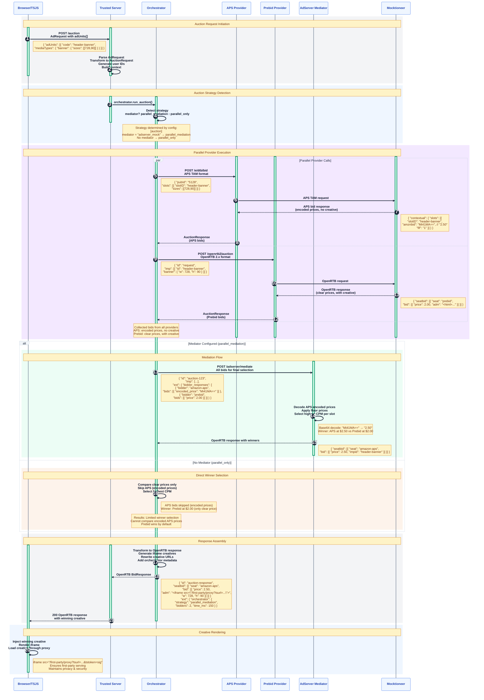

# Auction Orchestration

Learn how Trusted Server coordinates multiple demand sources in parallel to maximize revenue and minimize latency.

## Overview

The auction orchestrator is the core system that manages server-side ad auctions. It launches bid requests to multiple demand providers simultaneously, collects responses, and selects winners.

Key capabilities:

- **Parallel execution** — Bid requests to all providers launch concurrently using Fastly's `select()` API
- **Strategy-based winner selection** — Automatic strategy detection based on configuration
- **Mediator support** — Optional external mediator for decoding encoded prices (e.g., APS) and applying unified floor pricing
- **Provider abstraction** — Pluggable provider interface for adding new demand sources
- **Creative rewriting** — Winning creatives automatically rewritten with first-party proxy URLs

## System Flow (Prebid + APS)

The following diagram shows the full auction flow when both Prebid and APS providers are configured with a mediator:



## Architecture

### Request Flow

The auction system processes requests through a pipeline of transformations:

```
POST /auction (AdRequest in Prebid.js format)
  │
  ├─ Parse body → AdRequest { adUnits[] }
  ├─ Generate synthetic + fresh user IDs
  ├─ Convert adUnits → AdSlots with formats and bidder params
  ├─ Extract device info (User-Agent, geo)
  │
  ▼
AuctionOrchestrator.run_auction()
  │
  ├─ Detect strategy (parallel_only or parallel_mediation)
  ├─ Launch all providers in parallel via select()
  ├─ Collect responses as they complete
  │
  ├─[parallel_only]─── Select highest CPM per slot (clear prices only)
  └─[parallel_mediation]─── Forward all bids to mediator for final selection
  │
  ▼
Convert OrchestrationResult → OpenRTB 2.x Response
  │
  ├─ Rewrite creative HTML with first-party proxy URLs
  ├─ Add ext.orchestrator metadata
  └─ Set synthetic ID response headers
```

### Key Components

The orchestrator is composed of several modules:

| Module            | Path                         | Purpose                                     |
| ----------------- | ---------------------------- | ------------------------------------------- |
| `orchestrator.rs` | `crates/common/src/auction/` | Core parallel execution and bid selection   |
| `provider.rs`     | `crates/common/src/auction/` | `AuctionProvider` trait definition          |
| `types.rs`        | `crates/common/src/auction/` | Data structures (AuctionRequest, Bid, etc.) |
| `formats.rs`      | `crates/common/src/auction/` | Format conversions (TSJS ↔ OpenRTB)         |
| `endpoints.rs`    | `crates/common/src/auction/` | HTTP handler for `POST /auction`            |
| `config.rs`       | `crates/common/src/auction/` | Auction configuration types                 |

### Provider Auto-Discovery

Providers register themselves at startup via builder functions. The `build_orchestrator()` function in `auction/mod.rs` iterates all registered builders, passes the application settings, and each builder returns zero or more providers depending on whether its config section is present and enabled:

```rust
// Each integration registers its own builder
fn provider_builders() -> &'static [ProviderBuilder] {
    &[
        prebid::register_auction_provider,
        aps::register_providers,
        adserver_mock::register_providers,
    ]
}
```

This means you only need to add a config section to `trusted-server.toml` for a provider to be automatically discovered and registered.

## Auction Strategies

The orchestrator automatically selects a strategy based on whether a `mediator` is configured.

### Parallel Only

When no mediator is set, the orchestrator runs all providers in parallel and selects winners by comparing decoded prices directly. This is the simplest strategy.

```toml
[auction]
enabled = true
providers = ["prebid", "aps"]
# No mediator — direct price comparison
timeout_ms = 2000
```

**How winner selection works:**

1. Collect bids from all providers
2. Group bids by slot ID
3. For each slot, select the bid with the highest CPM
4. Bids with `price: None` (e.g., APS encoded prices) are **skipped** — they cannot be compared without decoding
5. Apply floor prices — drop winners below the slot's floor

**Limitations:**

- APS bids are effectively ignored since their prices are encoded
- Only bidders returning clear decimal prices can compete
- May result in lower revenue when APS would have won

### Parallel Mediation

When a `mediator` is configured, all provider responses are forwarded to the mediator service for final winner selection. The mediator can decode proprietary price formats (like APS encoded bids) and apply unified floor pricing.

```toml
[auction]
enabled = true
providers = ["prebid", "aps"]
mediator = "adserver_mock"  # Enables mediation
timeout_ms = 2000
```

**How mediation works:**

1. Run all providers in parallel (same as parallel_only)
2. Collect all responses
3. Forward all bids to the mediator as a single request, including:
   - Regular bids with clear `price` fields
   - APS bids with `encoded_price` fields (from `amznbid` metadata)
4. Mediator decodes APS prices, applies floor pricing, and selects the highest CPM per slot
5. Mediator returns an OpenRTB response with winning bids at decoded prices
6. Orchestrator filters any bids the mediator returned without a decoded price

**Advantages over parallel_only:**

- All bidders compete on equal footing, including those with encoded prices
- Centralized floor pricing enforcement
- Proper APS integration — encoded bids are decoded and compared fairly
- Higher potential revenue from broader competition

## Providers

### Provider Interface

All demand sources implement the `AuctionProvider` trait:

```rust
pub trait AuctionProvider: Send + Sync {
    fn provider_name(&self) -> &'static str;

    fn request_bids(
        &self,
        request: &AuctionRequest,
        context: &AuctionContext<'_>,
    ) -> Result<PendingRequest, Report<TrustedServerError>>;

    fn parse_response(
        &self,
        response: fastly::Response,
        response_time_ms: u64,
    ) -> Result<AuctionResponse, Report<TrustedServerError>>;

    fn supports_media_type(&self, media_type: &MediaType) -> bool;
    fn timeout_ms(&self) -> u32;
    fn is_enabled(&self) -> bool;
    fn backend_name(&self) -> Option<String>;
}
```

The trait uses a two-phase design:

1. **`request_bids()`** — Builds and sends the HTTP request, returning a `PendingRequest` (Fastly's async handle)
2. **`parse_response()`** — Called once the response arrives, parses the provider-specific format into a unified `AuctionResponse`

This split enables true parallel execution: all requests launch first, then the orchestrator uses `select()` to process responses as they arrive.

### Prebid Provider

Transforms auction requests into OpenRTB 2.x format and sends them to a Prebid Server instance.

**Request transformation:**

- `AdSlot` → `Imp` with `Banner { format: [Format { w, h }] }`
- Bidder params from slot config → `ext.prebid.bidder` map
- Synthetic and fresh user IDs injected into `User` object
- Device info, geo data, and GPC signals included
- Optional Ed25519 request signing (see [Request Signing](/guide/request-signing))

**Response parsing:**

- Bids include decoded `price` (clear decimal CPM)
- Creative HTML provided in `adm` field
- Creative URLs rewritten to first-party proxy format

```toml
[integrations.prebid]
enabled = true
server_url = "https://prebid-server.example.com"
timeout_ms = 1000
bidders = ["appnexus", "rubicon"]
```

### APS Provider

Transforms auction requests into Amazon's TAM (Transparent Ad Marketplace) format.

**Request transformation:**

- `AdSlot` → `ApsSlot` with `slot_id`, `slot_name`, and `sizes` array
- Publisher ID, page URL, user agent, and timeout included

**Response parsing:**

- Bids have `price: None` — APS uses proprietary encoding (`amznbid` field is base64-encoded)
- Bids have `creative: None` — APS does not return HTML creatives
- Encoded price metadata (`amznbid`, `amznp`) preserved in bid metadata for the mediator
- Only slots with `fif: "1"` (filled) are processed

This is why mediation is important when using APS: without a mediator, APS bids cannot participate in winner selection.

```toml
[integrations.aps]
enabled = true
pub_id = "5128"
endpoint = "https://aax.amazon-adsystem.com/e/dtb/bid"
timeout_ms = 800
```

### AdServer Mock Mediator

An external mediation service that receives all bidder responses and performs unified winner selection. The mock implementation uses base64 decoding for APS prices; a production mediator would use Amazon's proprietary decoding.

**Mediation request format:**

```json
{
  "id": "auction-123",
  "imp": [
    { "id": "header-banner", "banner": { "format": [{ "w": 728, "h": 90 }] } }
  ],
  "ext": {
    "bidder_responses": [
      {
        "bidder": "amazon-aps",
        "bids": [{ "imp_id": "header-banner", "encoded_price": "Mi41MA==" }]
      },
      {
        "bidder": "prebid",
        "bids": [
          { "imp_id": "header-banner", "price": 2.0, "adm": "<html>..." }
        ]
      }
    ],
    "config": { "price_floor": 0.5 }
  }
}
```

**Mediation response:** Standard OpenRTB with decoded prices and selected winners.

```toml
[integrations.adserver_mock]
enabled = true
endpoint = "https://your-mediator.example.com/adserver/mediate"
timeout_ms = 500
price_floor = 0.50
```

## Data Structures

### AuctionRequest

The internal representation of an auction, converted from the incoming `AdRequest`:

```rust
pub struct AuctionRequest {
    pub id: String,                                    // UUID
    pub slots: Vec<AdSlot>,                            // Ad placements
    pub publisher: PublisherInfo,                       // Domain, page URL
    pub user: UserInfo,                                // Synthetic ID, fresh ID, consent
    pub device: Option<DeviceInfo>,                    // UA, IP, geo
    pub site: Option<SiteInfo>,                        // Domain, page
    pub context: HashMap<String, serde_json::Value>,   // Additional metadata
}
```

### AdSlot

Represents a single ad placement on the page:

```rust
pub struct AdSlot {
    pub id: String,
    pub formats: Vec<AdFormat>,                         // Supported sizes
    pub floor_price: Option<f64>,                       // Minimum CPM
    pub targeting: HashMap<String, serde_json::Value>,  // Key-value targeting
    pub bidders: HashMap<String, serde_json::Value>,    // Per-bidder params
}
```

### Bid

The unified bid format used across all providers:

```rust
pub struct Bid {
    pub slot_id: String,
    pub price: Option<f64>,           // None for APS (encoded)
    pub currency: String,
    pub creative: Option<String>,     // None for APS (no HTML from TAM)
    pub adomain: Option<Vec<String>>,
    pub bidder: String,
    pub width: u32,
    pub height: u32,
    pub nurl: Option<String>,         // Win notification URL
    pub burl: Option<String>,         // Billing URL
    pub metadata: HashMap<String, serde_json::Value>,
}
```

The `price` and `creative` fields are `Option` types specifically to handle APS, which returns encoded prices and no creative HTML. This is a key design decision — it lets the type system enforce awareness of encoded vs. decoded bids throughout the auction pipeline.

### OrchestrationResult

The complete result of an auction:

```rust
pub struct OrchestrationResult {
    pub provider_responses: Vec<AuctionResponse>,       // All provider results
    pub mediator_response: Option<AuctionResponse>,     // Mediator result (if used)
    pub winning_bids: HashMap<String, Bid>,             // Slot ID → winning bid
    pub total_time_ms: u64,
    pub metadata: HashMap<String, serde_json::Value>,
}
```

## Input and Output Formats

### Request Format (TSJS / Prebid.js)

The `POST /auction` endpoint accepts a Prebid.js-compatible `AdRequest`:

```json
{
  "adUnits": [
    {
      "code": "header-banner",
      "mediaTypes": {
        "banner": {
          "sizes": [
            [728, 90],
            [970, 250]
          ]
        }
      },
      "bids": [
        {
          "bidder": "appnexus",
          "params": { "placementId": 12345 }
        }
      ]
    }
  ]
}
```

### Response Format (OpenRTB 2.x)

Auction results are returned in standard OpenRTB format with an `ext.orchestrator` metadata block:

```json
{
  "id": "auction-abc123",
  "seatbid": [
    {
      "seat": "prebid",
      "bid": [
        {
          "id": "bid-1",
          "impid": "header-banner",
          "price": 2.5,
          "adm": "<iframe src=\"/first-party/proxy?tsurl=...&tstoken=sig\">...</iframe>",
          "w": 728,
          "h": 90
        }
      ]
    }
  ],
  "ext": {
    "orchestrator": {
      "strategy": "parallel_mediation",
      "providers": 2,
      "total_bids": 3,
      "time_ms": 145
    }
  }
}
```

The response also includes synthetic ID headers:

- `X-Synthetic-ID` — The persistent synthetic user ID
- `X-Synthetic-Fresh` — A fresh ID generated for this session
- `X-Synthetic-Trusted-Server` — Trusted Server marker

## Creative Processing

Winning creatives are processed through a streaming HTML rewriter (`lol_html`) before being returned. This rewrites external resource URLs to first-party proxy paths, maintaining privacy and enabling security controls.

**Elements rewritten:**

| Element                          | Attributes                  | Target                         |
| -------------------------------- | --------------------------- | ------------------------------ |
| ``                          | `src`, `data-src`, `srcset` | `/first-party/proxy?tsurl=...` |
| `<script>`                       | `src`                       | `/first-party/proxy?tsurl=...` |
| `<link>`                         | `href`, `imagesrcset`       | `/first-party/proxy?tsurl=...` |
| `<iframe>`                       | `src`                       | `/first-party/proxy?tsurl=...` |
| `<video>`, `<audio>`, `<source>` | `src`                       | `/first-party/proxy?tsurl=...` |
| `<a>`, `<area>`                  | `href`                      | `/first-party/click?tsurl=...` |
| `<style>`, `[style]`             | `url()` references          | `/first-party/proxy?tsurl=...` |
| SVG `<image>`, `<use>`           | `href`, `xlink:href`        | `/first-party/proxy?tsurl=...` |

URLs that are relative, or use `data:`, `javascript:`, `blob:`, or `mailto:` schemes are left unchanged. Domains in the `rewrite.exclude_domains` config list (supports wildcards like `*.cloudflare.com`) are also skipped.

Each proxied URL includes a `tstoken` HMAC signature for tamper protection. See [Proxy Signing](/guide/proxy-signing) for details.

## Configuration

### Full Example

```toml
[auction]
enabled = true
providers = ["prebid", "aps"]
mediator = "adserver_mock"    # Remove for parallel_only strategy
timeout_ms = 2000

[integrations.prebid]
enabled = true
server_url = "https://prebid-server.example.com"
timeout_ms = 1000
bidders = ["appnexus", "rubicon"]
auto_configure = true
debug = false

[integrations.aps]
enabled = true
pub_id = "5128"
endpoint = "https://aax.amazon-adsystem.com/e/dtb/bid"
timeout_ms = 800

[integrations.adserver_mock]
enabled = true
endpoint = "https://your-mediator.example.com/adserver/mediate"
timeout_ms = 500
price_floor = 0.50
```

### Configuration Reference

#### `[auction]`

| Field        | Type     | Default | Description                                                     |
| ------------ | -------- | ------- | --------------------------------------------------------------- |
| `enabled`    | bool     | `false` | Enable the auction system                                       |
| `providers`  | string[] | `[]`    | Ordered list of provider names to call                          |
| `mediator`   | string?  | `null`  | Provider name to use as mediator (enables `parallel_mediation`) |
| `timeout_ms` | u32      | `2000`  | Overall auction timeout in milliseconds                         |

#### `[integrations.prebid]`

| Field            | Type     | Default           | Description                                 |
| ---------------- | -------- | ----------------- | ------------------------------------------- |
| `enabled`        | bool     | `true`            | Enable Prebid provider                      |
| `server_url`     | string   | —                 | Prebid Server URL (required)                |
| `timeout_ms`     | u32      | `1000`            | Request timeout                             |
| `bidders`        | string[] | `["mocktioneer"]` | Default bidders when not specified per-slot |
| `auto_configure` | bool     | `true`            | Auto-remove client-side prebid.js scripts   |
| `debug`          | bool     | `false`           | Enable Prebid debug mode                    |

#### `[integrations.aps]`

| Field        | Type   | Default                                     | Description                 |
| ------------ | ------ | ------------------------------------------- | --------------------------- |
| `enabled`    | bool   | `false`                                     | Enable APS provider         |
| `pub_id`     | string | —                                           | APS publisher ID (required) |
| `endpoint`   | string | `https://aax.amazon-adsystem.com/e/dtb/bid` | APS TAM endpoint            |
| `timeout_ms` | u32    | `800`                                       | Request timeout             |

#### `[integrations.adserver_mock]`

| Field         | Type   | Default                                  | Description               |
| ------------- | ------ | ---------------------------------------- | ------------------------- |
| `enabled`     | bool   | `false`                                  | Enable mediator           |
| `endpoint`    | string | `http://localhost:6767/adserver/mediate` | Mediator service endpoint |
| `timeout_ms`  | u32    | `500`                                    | Request timeout           |
| `price_floor` | f64?   | `null`                                   | Global price floor CPM    |

### Timeout Tuning

The orchestrator timeout should exceed the sum of provider timeouts to allow all providers to respond. Providers that exceed their individual timeouts are collected as they finish — the orchestrator doesn't wait indefinitely.

```toml
[auction]
timeout_ms = 2000              # Overall ceiling

[integrations.prebid]
timeout_ms = 1000              # Prebid Server budget

[integrations.aps]
timeout_ms = 800               # APS budget

[integrations.adserver_mock]
timeout_ms = 500               # Mediator budget (called after providers)
```

### Environment Variable Overrides

All auction configuration can be overridden via environment variables:

```bash
TRUSTED_SERVER__AUCTION__ENABLED=true
TRUSTED_SERVER__AUCTION__PROVIDERS=prebid,aps
TRUSTED_SERVER__AUCTION__MEDIATOR=adserver_mock
TRUSTED_SERVER__AUCTION__TIMEOUT_MS=2000
TRUSTED_SERVER__INTEGRATIONS__PREBID__SERVER_URL=https://pbs.example.com
TRUSTED_SERVER__INTEGRATIONS__APS__PUB_ID=5128
```

## Floor Prices

Floor prices can be set per-slot in the auction request. The orchestrator enforces floors after winner selection:

- In **parallel_only** mode: bids below the floor are dropped after selection
- In **parallel_mediation** mode: the floor is sent to the mediator in `ext.config.price_floor`, and also enforced locally as a safety net
- Bids with `price: None` (encoded prices) **pass through** floor checks — the floor is deferred to the mediator

## Error Handling

The orchestrator is designed to be resilient:

- **Provider launch failure** — If a provider fails to launch its request (e.g., missing backend), it is skipped with a warning. Other providers continue.
- **Provider parse failure** — If a response can't be parsed, an `AuctionResponse::error()` is recorded. Other results are unaffected.
- **No providers configured** — Returns an error: `"No providers configured"`
- **All providers fail** — Returns an empty `OrchestrationResult` with zero winning bids
- **Mediator returns bids without decoded prices** — Those bids are filtered out with a warning

## Observability

### Logging

The auction system logs at multiple levels throughout execution:

| Level   | Examples                                                                              |
| ------- | ------------------------------------------------------------------------------------- |
| `info`  | Auction request received, provider launch, bid counts, winner selection, total timing |
| `debug` | Skipped bids (encoded prices), creative rewrite sizes                                 |
| `warn`  | Provider launch failures, parse failures, mediator bids without decoded prices        |

### Response Metadata

Every auction response includes structured metadata in `ext.orchestrator`:

```json
{
  "strategy": "parallel_mediation",
  "providers": 2,
  "total_bids": 3,
  "time_ms": 145
}
```
