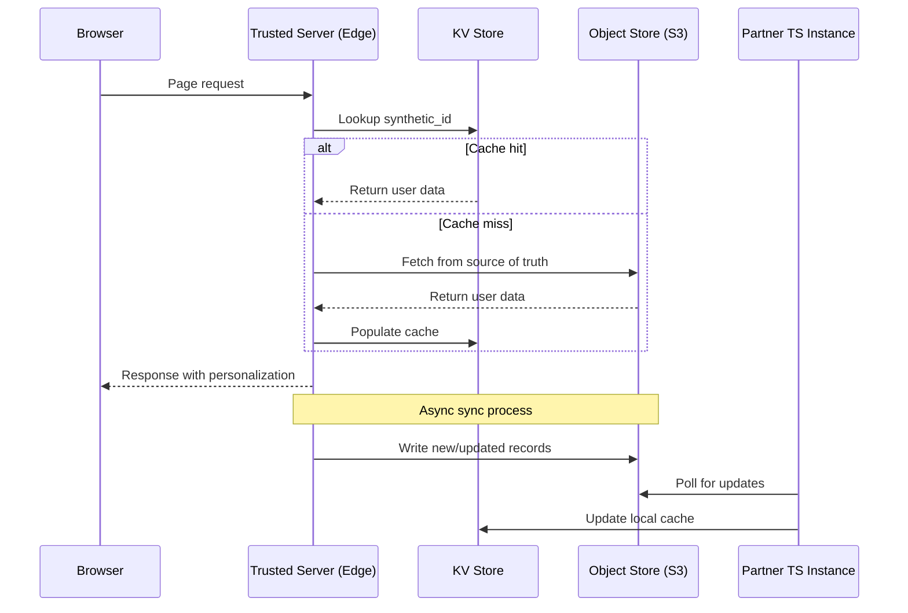

# Collective Sync Architecture

Trusted Server supports cross-publisher data sharing through a **Collective Sync** model. Publishers who share the same synthetic ID secret key can synchronize user data across their properties, enabling privacy-preserving audience insights without third-party cookies.

## Overview



## Architecture Principles

| Component        | Role            | Characteristics                                        |
| ---------------- | --------------- | ------------------------------------------------------ |
| **KV Store**     | Hot cache       | Fast reads (~1ms), edge-local, eventually consistent   |
| **Object Store** | Source of truth | Durable, supports range queries, sync endpoint         |
| **Secret Key**   | Shared salt     | Distributed out-of-band, enables collective membership |

## Configuration

Add the following to your `trusted-server.toml`:

```toml
[collective]
enabled = true
sync_endpoint = "https://collective.example.com/sync"

# KV Store names (must match fastly.toml)
kv_store = "collective_store"
```

### Fastly.toml Setup

```toml
[local_server.kv_stores]
    [[local_server.kv_stores.collective_store]]
        key = "placeholder"
        data = "placeholder"
```

## Data Model

### KV Store Record

Each synthetic ID maps to a compact JSON record optimized for fast reads:

```json
{
  "sid": "0f99d7dc...a98e.45np22",
  "seg": ["auto-intender", "sports-fan"],
  "lst": 1706470800,
  "src": ["pub-a.com", "pub-b.com"]
}
```

| Field | Type     | Description                        |
| ----- | -------- | ---------------------------------- |
| `sid` | string   | Full synthetic ID (`64hex.6alnum`) |
| `seg` | string[] | Audience segments                  |
| `lst` | integer  | Last seen timestamp (Unix epoch)   |
| `src` | string[] | Contributing publisher domains     |

### Object Store Record (Source of Truth)

The Object Store maintains a richer record with full history:

```json
{
  "synthetic_id": "0f99d7dc...a98e.45np22",
  "hmac_base": "0f99d7dc...a98e",
  "random_suffix": "45np22",
  "segments": ["auto-intender", "sports-fan"],
  "last_seen": "2024-01-28T15:00:00Z",
  "first_seen": "2024-01-15T10:30:00Z",
  "sources": [
    { "domain": "pub-a.com", "last_seen": "2024-01-28T15:00:00Z" },
    { "domain": "pub-b.com", "last_seen": "2024-01-27T12:00:00Z" }
  ],
  "version": 3
}
```

## Sync Protocol

### Initial Sync

When a new publisher joins the collective, they perform a full sync:

```http
GET /sync?type=full
Authorization: Bearer <collective-token>
```

Response (NDJSON stream for large datasets):

```json
{"synthetic_id": "abc123.x1y2z3", "segments": [...], "last_seen": "..."}
{"synthetic_id": "def456.a1b2c3", "segments": [...], "last_seen": "..."}
```

### Incremental Updates

Subsequent syncs only fetch changes since last sync:

```http
GET /sync?type=incremental&since=1706470800
Authorization: Bearer <collective-token>
```

Response includes only records modified after the `since` timestamp:

```json
{
  "records": [
    {"synthetic_id": "abc123.x1y2z3", "segments": [...], "last_seen": "..."}
  ],
  "next_cursor": "1706475000",
  "has_more": false
}
```

### Write Operations

When a publisher observes new data, they write to the Object Store:

```http
POST /sync
Authorization: Bearer <collective-token>
Content-Type: application/json

{
  "records": [
    {
      "synthetic_id": "abc123.x1y2z3",
      "segments": ["new-segment"],
      "source_domain": "pub-a.com"
    }
  ]
}
```

The sync endpoint handles:

- Deduplication by synthetic_id
- Segment merging (union of all observed segments)
- Source tracking (which publishers contributed data)
- Version increment for conflict resolution

## Request Flow

### Read Path (Hot)

```
1. Browser request arrives at edge
2. Extract/generate synthetic_id
3. KV Store lookup by synthetic_id
4. If hit: return cached segments
5. If miss: fetch from Object Store, populate KV, return
```

### Write Path (Async)

```
1. Observe new user data (segment, behavior)
2. Queue write to Object Store
3. Object Store updates source of truth
4. Partner instances poll for updates
5. Partners update their KV caches
```

## Privacy Considerations

- **No PII**: Synthetic IDs contain no personally identifiable information
- **Consent-gated**: Only users with GDPR consent are included
- **Publisher control**: Each publisher controls what segments they share
- **Audit trail**: Object Store maintains full history of data sources

## Implementation Status

| Feature              | Status            |
| -------------------- | ----------------- |
| KV Store integration | ✅ Available      |
| Object Store writes  | 🚧 In development |
| Sync endpoint        | 🚧 In development |
| Incremental sync     | 📋 Planned        |
| Segment merging      | 📋 Planned        |

## Next Steps

- [Synthetic IDs](/guide/synthetic-ids) - Understand ID generation
- [Configuration Reference](/guide/configuration) - Full config options
- [GDPR Compliance](/guide/gdpr-compliance) - Privacy requirements
