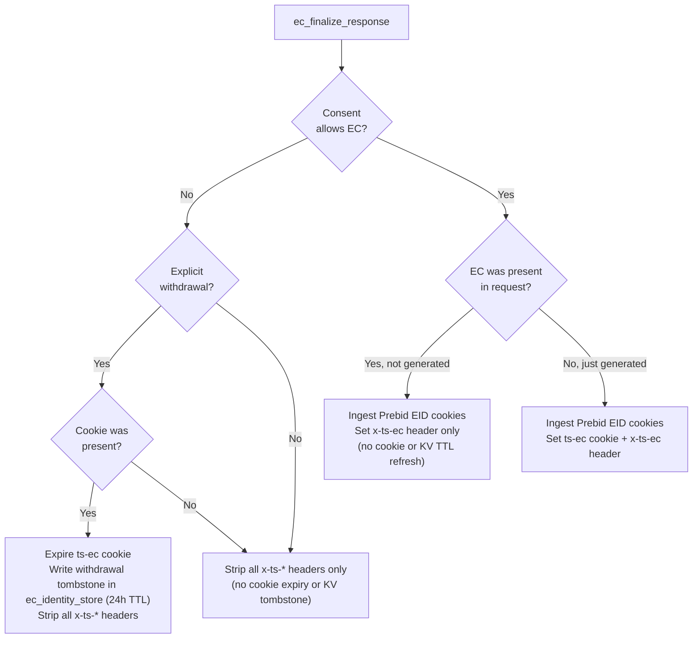
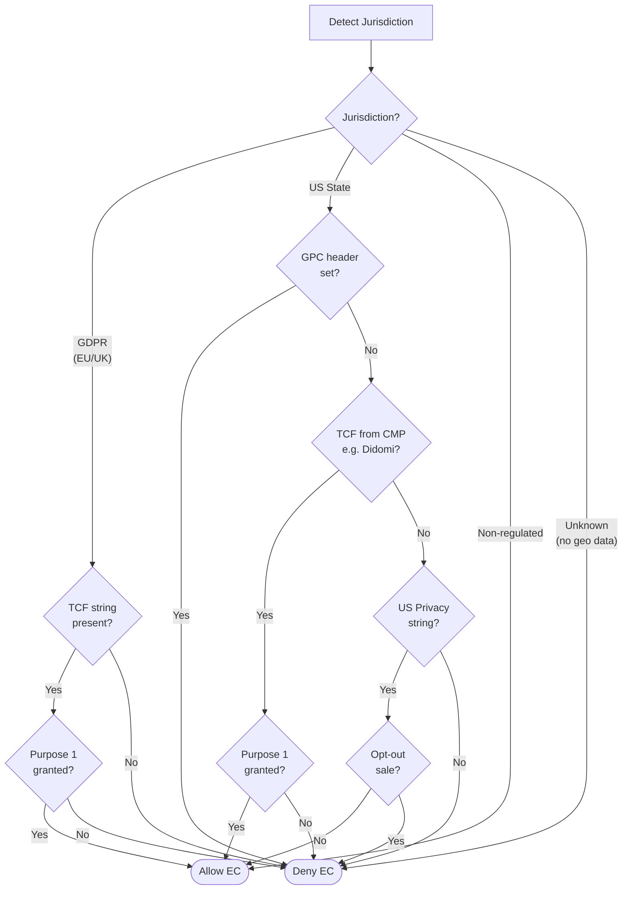
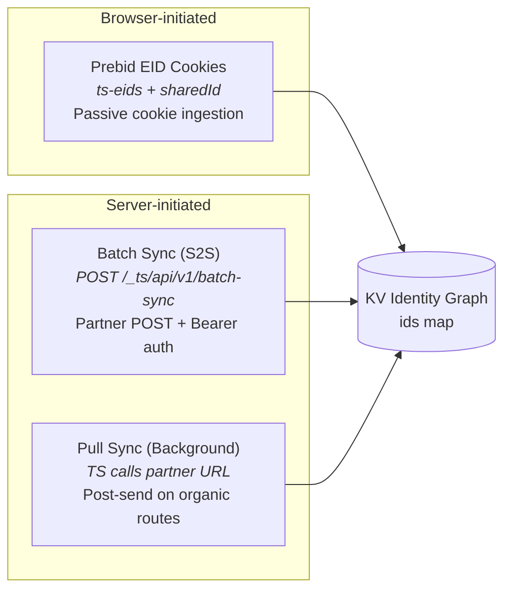
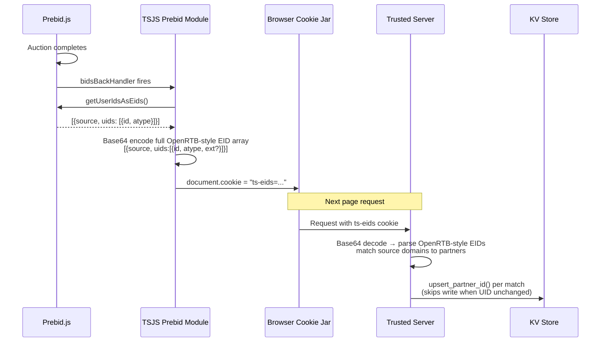

# Edge Cookies (EC)

Trusted Server's EC module maintains user recognition across all browsers through first-party identifiers.

## What are Edge Cookies?

Edge Cookies (EC) are privacy-safe identifiers generated on a first site visit using HMAC-based hashing that allow tracking with user consent while protecting user privacy. Trusted Server derives a deterministic HMAC base from the client IP address and appends a short random suffix to reduce collision risk. They are passed in requests on subsequent visits and activity.

Trusted Server surfaces the current EC ID via response headers and a first-party cookie. For the exact header and cookie names, see the [API Reference](/guide/api-reference).

For full operational onboarding (partner configuration, batch sync, identify, and auction verification), use the [EC Setup Guide](/guide/ec-setup-guide).

## How They Work

### HMAC-Based Generation

EC IDs use HMAC (Hash-based Message Authentication Code) to generate a deterministic base from the client IP address, then append a short random suffix.

**Format**: `64-hex-hmac`.`6-alphanumeric-suffix`

**IP normalization**: IPv6 addresses are normalized to a /64 prefix before hashing.

### Request Lifecycle

Every request passes through four phases. EC generation only happens on organic routes (publisher proxy, integration proxy, auction) — read-only endpoints like `/identify` and `/batch-sync` skip generation entirely. During pre-routing, Trusted Server builds consent from request-local cookies, headers, geolocation, and policy defaults; it does not load consent from a separate KV store.


### Response Finalization

After routing completes, the server evaluates consent state and cookie presence to decide what to do with the EC cookie on the response.



When consent cannot be verified for the current request — for example, unknown jurisdiction or missing/undecodable consent signals in a regulated region — Trusted Server fails closed for EC use by stripping EC headers, but it does **not** treat that as authoritative revocation of an already-issued EC.

## Consent Model

EC creation is gated by jurisdiction. The server detects jurisdiction from geolocation data attached to the request and applies the appropriate consent framework. Live consent comes from request-local signals (`euconsent-v2`, `__gpp`, `__gpp_sid`, `us_privacy`, `Sec-GPC`) plus geolocation and policy defaults; there is no separate consent KV fallback.



- **GDPR**: Opt-in required. TCF Purpose 1 (store/access device) must be explicitly consented.
- **US State**: Opt-out model with three-tier fallback — GPC always blocks, then TCF if a CMP uses it, then US Privacy string, then fail-closed.
- **Non-regulated**: EC always allowed.
- **Unknown**: Fail-closed when jurisdiction cannot be determined.

The `ec_identity_store` KV store is the only EC lifecycle store. It holds identity graph state, partner IDs, a minimal consent snapshot used for EC entry metadata, and withdrawal tombstones. Consent interpretation for each request remains based on the live request signals listed above.

## Partner Sync Channels

Partner identities flow into the KV identity graph through three channels. Each writes to the same `ids` map in the KV entry via idempotent upsert logic: unchanged UIDs are accepted without a KV write, while different UIDs replace the stored value.



### Prebid EID Cookie Flow

The `ts-eids` cookie bridges client-side Prebid user ID modules with the server-side identity graph.



Current TSJS writers preserve the full OpenRTB-style `{source, uids:[...]}` shape in `ts-eids`. The server remains backward-compatible with earlier flattened `{source, id, atype}` cookies during rollout, but new cookies use the structured `uids[]` form.

The `sharedId` cookie follows a similar path but is written directly by Prebid's SharedID module rather than by TSJS. The server reads it separately and maps it via the `sharedid.org` source domain.

### EID Seeding and Prebid Bidstream Forwarding

EIDs can reach the EC identity graph from either server-side pull sync or browser-side Prebid sync. During a Prebid-routed auction, Trusted Server combines those stored IDs with any same-request EIDs from Prebid.js, applies consent gating, and forwards the merged set to Prebid Server as OpenRTB `user.ext.eids`. Prebid Server then passes those EIDs downstream to demand partners in its OpenRTB requests.


The relevant OpenRTB structure forwarded to Prebid Server and downstream partners is:

```json
{
  "user": {
    "id": "<ec-id-when-forwarding-is-allowed>",
    "ext": {
      "eids": [
        {
          "source": "id5-sync.com",
          "uids": [
            {
              "id": "ID5-abc123",
              "atype": 1
            }
          ]
        },
        {
          "source": "liveramp.com",
          "uids": [
            {
              "id": "LR-xyz789",
              "atype": 3,
              "ext": {
                "rtiPartner": "idl"
              }
            }
          ]
        }
      ]
    }
  }
}
```

Server-resolved EIDs and current-request Prebid EIDs are deduplicated by `source + uid.id`. When a partner UID already exists in KV, pull sync does not periodically refresh it; browser-side Prebid sync can still replace the stored UID if a later `ts-eids` cookie carries a different value for the same configured partner source.

## Configuration

Configure EC settings in `trusted-server.toml`. See the full [Configuration Reference](/guide/configuration) for the `[ec]` section and environment variable overrides.

## Privacy Considerations

- EC IDs combine a deterministic HMAC base derived from the client IP with a random suffix for uniqueness. The cookie is only set when storage consent is present
- No personally identifiable information (PII) is stored in the ID
- The hash input is the client IP address only
- IDs can be rotated by changing the secret key

## Best Practices

1. Always verify GDPR consent before generating IDs
2. Rotate secret keys periodically
3. Monitor ID collision rates

## Runtime Behavior Notes

- Returning requests with consent and an existing `ts-ec` receive an `x-ts-ec` response header only; ordinary page views do not refresh the EC cookie or KV TTL.
- Newly generated ECs receive both `Set-Cookie: ts-ec=...` and `x-ts-ec`.
- When consent is blocked but not explicitly withdrawn, Trusted Server strips EC response headers for that request but leaves any existing `ts-ec` cookie intact; cookie expiry and tombstones happen only on explicit withdrawal.
- `/_ts/api/v1/identify` is read-oriented and returns identity enrichment for the authenticated partner. It computes `cluster_size` only when the EC entry does not already store one.
- `/_ts/api/v1/batch-sync` writes mappings into the EC identity graph. Mapping timestamps are retained for API compatibility but no longer order writes; valid mappings use idempotent last-write-wins semantics.
- Pull sync fills missing partner UIDs only. Existing partner UIDs are not periodically refreshed because EC entries no longer store per-partner sync timestamps.

## Next Steps

- Follow the [EC Setup Guide](/guide/ec-setup-guide)
- Learn about [GDPR Compliance](/guide/gdpr-compliance)
- Configure [Ad Serving](/guide/ad-serving)
- Learn about [Collective Sync](/guide/collective-sync) for cross-publisher data sharing details and diagrams
