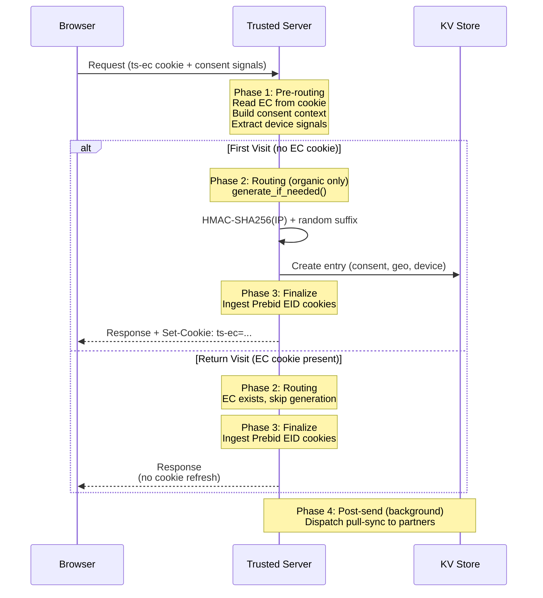
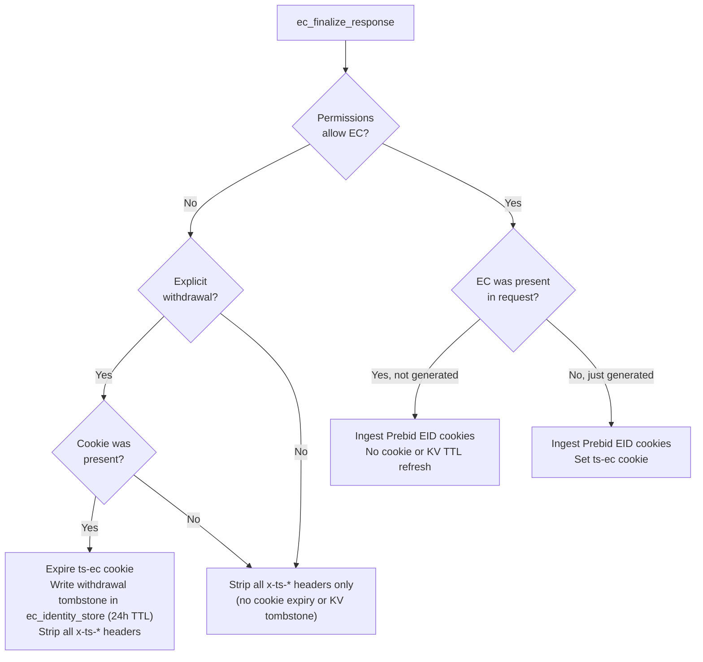
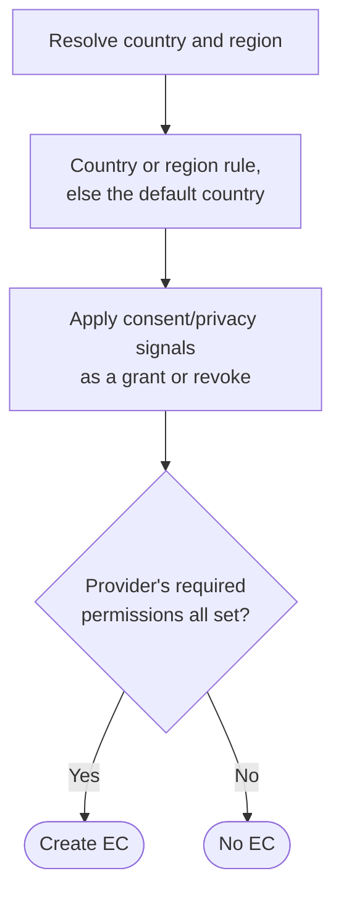
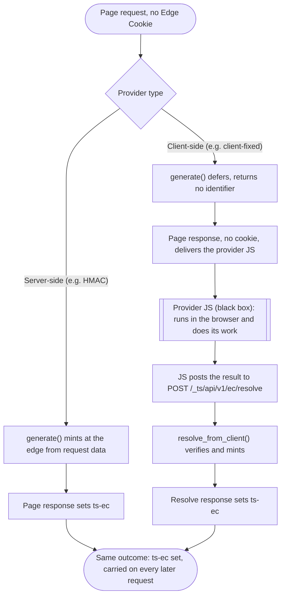
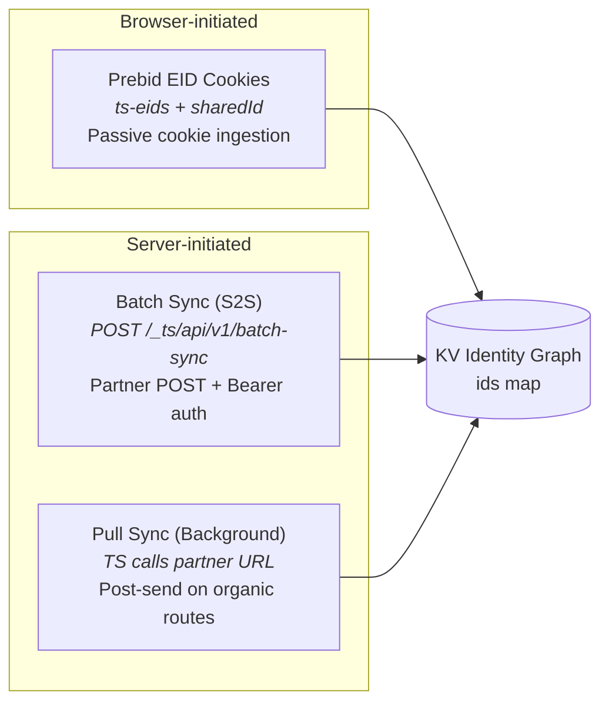
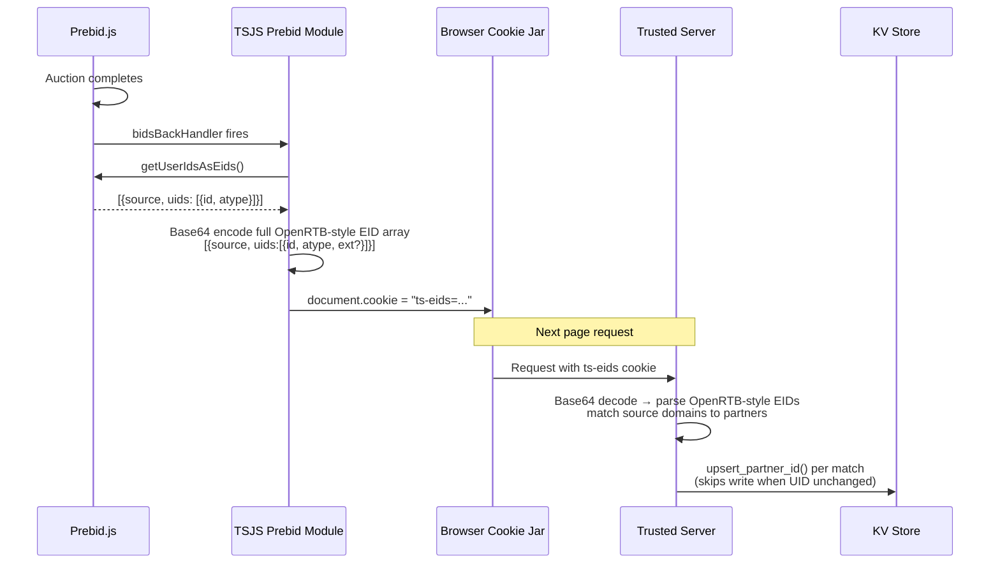
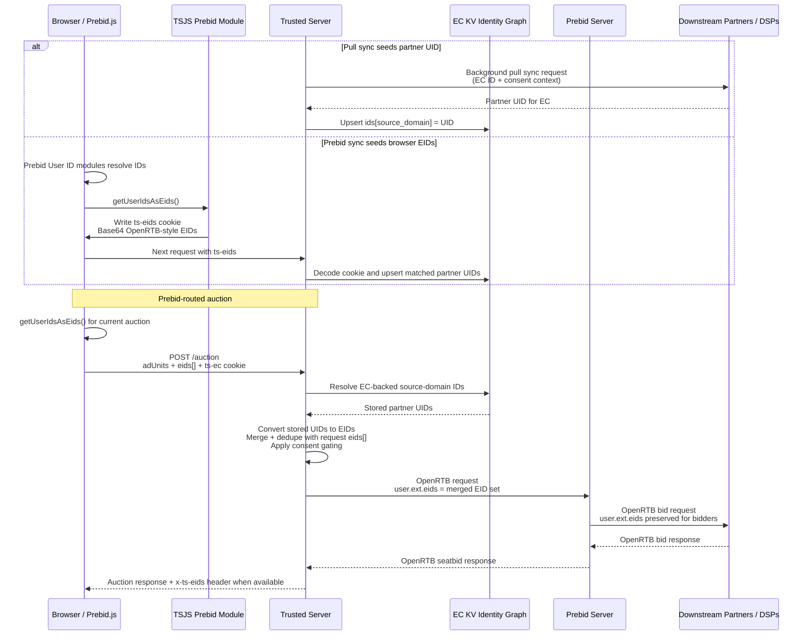

# Edge Cookies (EC)

Trusted Server's EC module maintains user recognition across all browsers through first-party identifiers.

## What are Edge Cookies?

Edge Cookies (EC) are privacy-safe identifiers generated on a first site visit using HMAC-based hashing, created only when the permission model allows it. Trusted Server derives a deterministic HMAC base from the client IP address and appends a short random suffix to reduce collision risk. They are passed in requests on subsequent visits and activity.

Trusted Server surfaces the current EC ID via response headers and a first-party cookie. For the exact header and cookie names, see the [API Reference](/guide/api-reference).

For full operational onboarding (partner configuration, batch sync, identify, and auction verification), use the [EC Setup Guide](/guide/ec-setup-guide).

## How They Work

### HMAC-Based Generation

EC IDs use HMAC (Hash-based Message Authentication Code) to generate a deterministic base from the client IP address, then append a short random suffix.

**Format**: `64-hex-hmac`.`6-alphanumeric-suffix`

**IP normalization**: IPv6 addresses are normalized to a /64 prefix before hashing.

### Request Lifecycle

Every request passes through four phases. EC generation only happens on organic routes (publisher proxy, integration proxy, auction). Read-only endpoints like `/identify` and `/batch-sync` skip generation entirely. During pre-routing, Trusted Server builds the consent context from request-local cookies, headers, geolocation, and policy defaults. It does not load consent from a separate KV store.



### Response Finalization

After routing completes, the server evaluates the permission state and cookie presence to decide what to do with the EC cookie on the response.



When the required permissions cannot be established for the current request (for example an unknown country with no configured default, or missing or undecodable consent signals), Trusted Server fails closed for EC use by stripping EC headers, but it does **not** treat that as authoritative revocation of an already-issued EC.

## Permission Gating

EC creation is gated through the [permission model](/guide/permission-model), not by a jurisdiction rule baked into the core. The Edge Cookie provider advertises the permissions its data use requires, and Trusted Server creates an Edge Cookie only when every required permission is set. The built-in HMAC provider requires `store-on-device` (TCF Purpose 1), because the `Set-Cookie` operation stores information on the device.

The Edge Cookie code never reads consent. It checks only whether the required **permission** is set. Consent is one of the sources that _set_ a permission, not something the gate reads directly, so the Edge Cookie logic does not change when a consent framework changes. Two sources combine for each request:

- **A country and region baseline.** The country, and an optional region such as a US state, that the geo provider returns. A region rule takes precedence over its country, and when no country is identified, or the country/region has no rule, the configured default country applies.
- **Consent and privacy signals.** TCF, GPP, and GPC (`euconsent-v2`, `__gpp` / `__gpp_sid`, `us_privacy`, `Sec-GPC`) decoded from the request and mapped onto permissions as a **grant or a revoke** on top of that baseline. There is no separate consent KV fallback.

Today only `store-on-device` is resolved this way: its country and region baseline is adjusted by the incoming TCF signal, and the Edge Cookie is created only when the result is set. With no configured default country, an unknown country sets nothing without a signal, so the cookie is not created unless a signal grants the permission. The core encodes no jurisdiction's law. The deployer brings the policy, and the per-country and per-region rules are configuration rather than core logic. See the [permission model](/guide/permission-model) for the full list of permission sources and the resolution order.



The `ec_identity_store` KV store is the only EC lifecycle store. It holds identity graph state, source-domain keyed partner UIDs, a minimal consent snapshot used for EC entry metadata, and withdrawal tombstones. Permission resolution for each request is based on the live request signals listed above.

## Provider Types: Server-Side and Client-Side

The Edge Cookie identifier comes from a configurable provider, selected by `[ec] provider`. A provider is one of two types, and the permission gate above applies to both. The two reach the **same outcome** (a `ts-ec` cookie set and carried on every later request) by **different routes**.

- **Server-side** (for example the built-in HMAC provider, or the built-in `host-signals` provider that mints from the host's TLS JA4 and HTTP/2 fingerprints on a host that supplies them). The provider derives the identifier at the edge from request data in `generate()`, and the **page response** sets the cookie. Nothing client-side is involved.
- **Client-side** (for example the `client-fixed` demo). The provider cannot derive the identifier at the edge, so `generate()` defers and returns no identifier. The page then runs the provider's own JavaScript in the browser, which does its work and posts the result to the resolve endpoint. The provider mints from that value in `resolve_from_client()`, and the **resolve response** sets the cookie.



The two types differ only in route and in the methods they use:

| Feature              | Server-side               | Client-side                                    |
| -------------------- | ------------------------- | ---------------------------------------------- |
| Example              | HMAC (`hmac`)             | `client-fixed` (demo)                          |
| Mints in             | `generate()`, at the edge | `resolve_from_client()`, from the posted value |
| `generate()` returns | the identifier            | no identifier (defers)                         |
| Client JavaScript    | none                      | the provider JS (black box), which posts back  |
| Endpoint             | none                      | `POST /_ts/api/v1/ec/resolve`                  |
| Cookie set on        | the page response         | the resolve response                           |

The resolve endpoint sets the cookie on its own first-party `200` response, so the value is live for every subsequent request without a second navigation. The cookie is `HttpOnly`, so the page script never reads it back. The script only posts the value, which the server then uses.

Because the posted value comes from the browser, **verification is the provider's responsibility**. A client-side provider must verify the payload (for example a signature) before minting, or a client could forge an Edge Cookie. The endpoint itself is provider-agnostic. It bounds the body, applies the same permission gate as organic generation, calls the provider, and writes the cookie.

A built-in `client-fixed` provider demonstrates the client-side type end to end with no vendor coupling. Client and server share one fixed, known word. When no Edge Cookie is present, the page script (shipped in the tsjs bundle when that provider is selected) posts that word, the server verifies it matches, and on a match sets it as the Edge Cookie. The value is verifiable because it is a known constant, which is the point of the demo. It is useless in production, because a fixed value is not an identity, so it is for demonstration and testing only.

## Partner Sync Channels

Partner identities flow into the KV identity graph through three channels. Each writes to the same `ids` map in the KV entry via idempotent upsert logic: unchanged UIDs are accepted without a KV write, while different UIDs replace the stored value.



### Prebid EID Cookie Flow

The `ts-eids` cookie bridges client-side Prebid user ID modules with the server-side identity graph.



Current TSJS writers preserve the full OpenRTB-style `{source, uids:[...]}` shape in `ts-eids`. The server remains backward-compatible with earlier flattened `{source, id, atype}` cookies during rollout, but new cookies use the structured `uids[]` form.

The `sharedId` cookie follows a similar path but is written directly by Prebid's SharedID module rather than by TSJS. The server reads it separately and maps it via the `sharedid.org` source domain.

### EID Seeding and Prebid Bidstream Forwarding

EIDs can reach the EC identity graph from either server-side pull sync or browser-side Prebid sync. During a Prebid-routed auction, Trusted Server combines those stored IDs with any same-request EIDs from Prebid.js, applies consent gating, and forwards the merged set to Prebid Server as OpenRTB `user.ext.eids`. Prebid Server then passes those EIDs downstream to demand partners in its OpenRTB requests.



The relevant OpenRTB structure forwarded to Prebid Server and downstream partners is:

```json
{
  "user": {
    "id": "<ec-id-when-forwarding-is-allowed>",
    "ext": {
      "eids": [
        {
          "source": "id5-sync.com",
          "uids": [
            {
              "id": "ID5-abc123",
              "atype": 1
            }
          ]
        },
        {
          "source": "liveramp.com",
          "uids": [
            {
              "id": "LR-xyz789",
              "atype": 3,
              "ext": {
                "rtiPartner": "idl"
              }
            }
          ]
        }
      ]
    }
  }
}
```

Server-resolved EIDs and current-request Prebid EIDs are deduplicated by `source + uid.id`. When a partner UID already exists in KV, pull sync does not periodically refresh it; browser-side Prebid sync can still replace the stored UID if a later `ts-eids` cookie carries a different value for the same configured partner source.

## Configuration

Configure EC settings in `trusted-server.toml`. See the full [Configuration Reference](/guide/configuration) for the `[ec]` section and environment variable overrides.

## Privacy Considerations

- EC IDs combine a deterministic HMAC base derived from the client IP with a random suffix for uniqueness. The cookie is only set when storage consent is present
- No personally identifiable information (PII) is stored in the ID
- The hash input is the client IP address only
- IDs can be rotated by changing the secret key

## Best Practices

1. Always verify GDPR consent before generating IDs
2. Rotate secret keys periodically
3. Monitor ID collision rates

## Runtime Behavior Notes

- Returning requests with consent and an existing `ts-ec` do not refresh the EC cookie or KV TTL.
- Newly generated ECs receive `Set-Cookie: ts-ec=...`.
- When consent is blocked but not explicitly withdrawn, Trusted Server strips EC response headers for that request but leaves any existing `ts-ec` cookie intact; cookie expiry and tombstones happen only on explicit withdrawal.
- `/_ts/api/v1/identify` is read-oriented and returns identity enrichment for the authenticated partner. It computes `cluster_size` only when the EC entry does not already store one.
- `/_ts/api/v1/batch-sync` writes mappings into the EC identity graph. Mapping timestamps are retained for API compatibility but no longer order writes; valid mappings use idempotent last-write-wins semantics.
- Pull sync fills missing partner UIDs only. Existing partner UIDs are not periodically refreshed because EC entries no longer store per-partner sync timestamps.

## Next Steps

- Follow the [EC Setup Guide](/guide/ec-setup-guide)
- Learn about [GDPR Compliance](/guide/gdpr-compliance)
- Configure [Ad Serving](/guide/ad-serving)
- Learn about [Collective Sync](/guide/collective-sync) for cross-publisher data sharing details and diagrams
