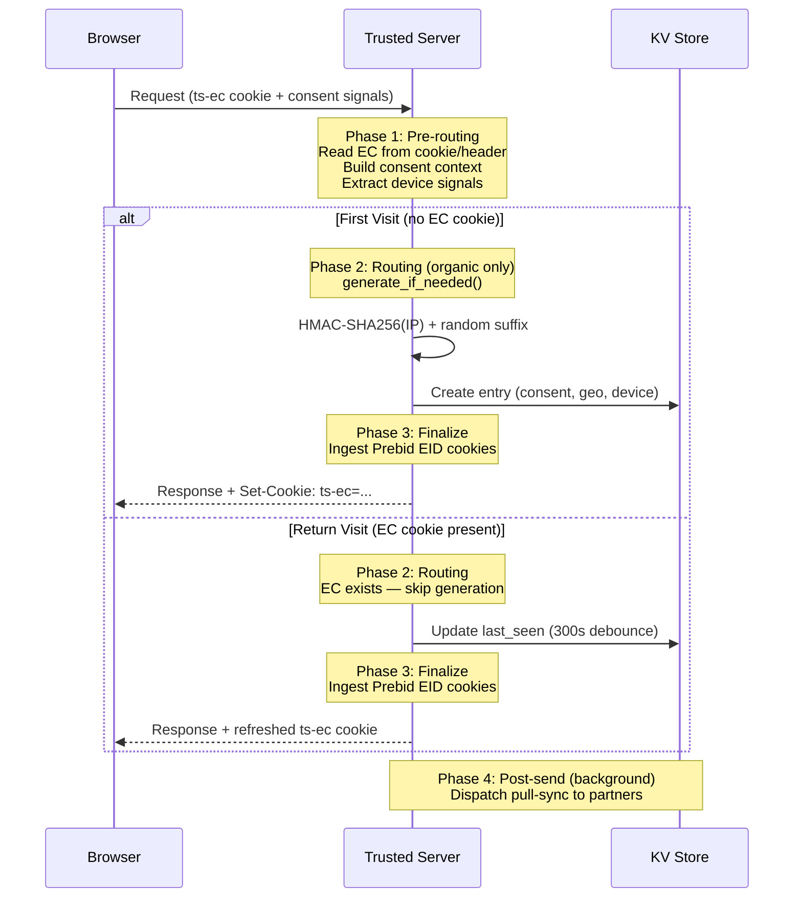
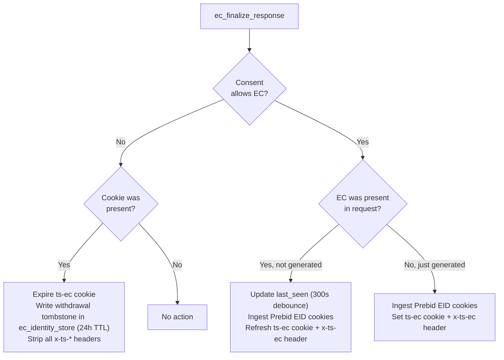
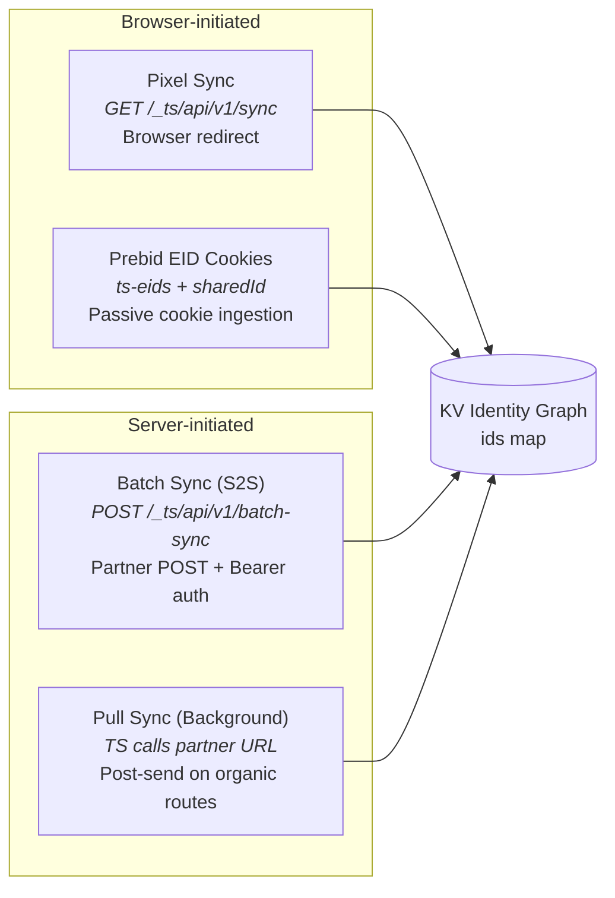
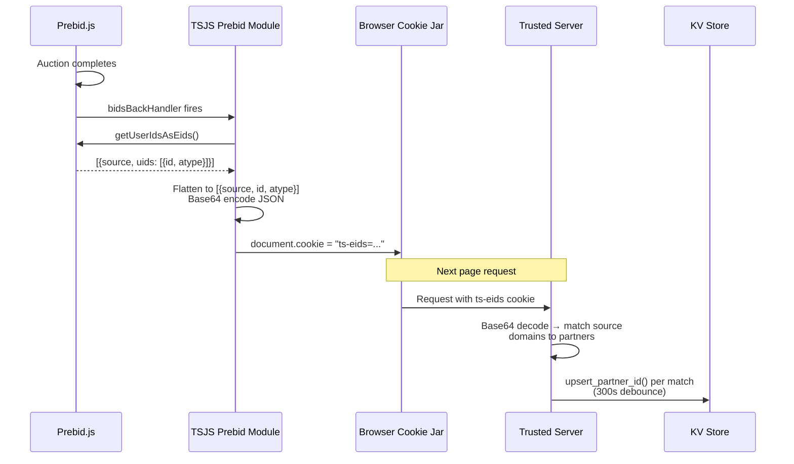

# Edge Cookies (EC)

Trusted Server's EC module maintains user recognition across all browsers through first-party identifiers.

## What are Edge Cookies?

Edge Cookies (EC) are privacy-safe identifiers generated on a first site visit using HMAC-based hashing that allow tracking with user consent while protecting user privacy. Trusted Server derives a deterministic HMAC base from the client IP address and appends a short random suffix to reduce collision risk. They are passed in requests on subsequent visits and activity.

Trusted Server surfaces the current EC ID via response headers and a first-party cookie. For the exact header and cookie names, see the [API Reference](/guide/api-reference).

For full operational onboarding (partner registration, pixel sync, batch sync, identify, and auction verification), use the [EC Setup Guide](/guide/ec-setup-guide).

## How They Work

### HMAC-Based Generation

EC IDs use HMAC (Hash-based Message Authentication Code) to generate a deterministic base from the client IP address, then append a short random suffix.

**Format**: `64-hex-hmac`.`6-alphanumeric-suffix`

**IP normalization**: IPv6 addresses are normalized to a /64 prefix before hashing.

### Request Lifecycle

Every request passes through four phases. EC generation only happens on organic routes (publisher proxy, integration proxy, auction) — read-only endpoints like `/identify` and `/batch-sync` skip generation entirely. During pre-routing, Trusted Server builds consent from request-local cookies, headers, geolocation, and policy defaults; it does not load consent from a separate KV store.

### Response Finalization

After routing completes, the server evaluates consent state and cookie presence to decide what to do with the EC cookie on the response.

## Consent Model

EC creation is gated by jurisdiction. The server detects jurisdiction from geolocation data attached to the request and applies the appropriate consent framework. Live consent comes from request-local signals (`euconsent-v2`, `__gpp`, `__gpp_sid`, `us_privacy`, `Sec-GPC`) plus geolocation and policy defaults; there is no separate consent KV fallback.

- **GDPR**: Opt-in required. TCF Purpose 1 (store/access device) must be explicitly consented.
- **US State**: Opt-out model with three-tier fallback — GPC always blocks, then TCF if a CMP uses it, then US Privacy string, then fail-closed.
- **Non-regulated**: EC always allowed.
- **Unknown**: Fail-closed when jurisdiction cannot be determined.

The `ec_identity_store` KV store is the only EC lifecycle store. It holds identity graph state, partner IDs, a minimal consent snapshot used for EC entry metadata, and withdrawal tombstones. Consent interpretation for each request remains based on the live request signals listed above.

## Partner Sync Channels

Partner identities flow into the KV identity graph through four channels. Each writes to the same `ids` map in the KV entry via `upsert_partner_id()`.

### Prebid EID Cookie Flow

The `ts-eids` cookie bridges client-side Prebid user ID modules with the server-side identity graph.

The `sharedId` cookie follows a similar path but is written directly by Prebid's SharedID module rather than by TSJS. The server reads it separately and maps it via the `sharedid.org` source domain.

## Configuration

Configure EC settings in `trusted-server.toml`. See the full [Configuration Reference](/guide/configuration) for the `[ec]` section and environment variable overrides.

## Privacy Considerations

- EC IDs combine a deterministic HMAC base derived from the client IP with a random suffix for uniqueness. The cookie is only set when storage consent is present
- No personally identifiable information (PII) is stored in the ID
- The hash input is the client IP address only
- IDs can be rotated by changing the secret key

## Best Practices

1. Always verify GDPR consent before generating IDs
2. Rotate secret keys periodically
3. Monitor ID collision rates

## Runtime Behavior Notes

- Returning requests with consent and an existing `ts-ec` receive both:
  - `x-ts-ec` response header
  - refreshed `Set-Cookie: ts-ec=...`
- `/_ts/api/v1/identify` is read-only and returns identity enrichment (`uids` and `eids`)
- `/_ts/api/v1/sync` and `/_ts/api/v1/batch-sync` write mappings into the EC identity graph

## Next Steps

- Follow the [EC Setup Guide](/guide/ec-setup-guide)
- Learn about [GDPR Compliance](/guide/gdpr-compliance)
- Configure [Ad Serving](/guide/ad-serving)
- Learn about [Collective Sync](/guide/collective-sync) for cross-publisher data sharing details and diagrams
