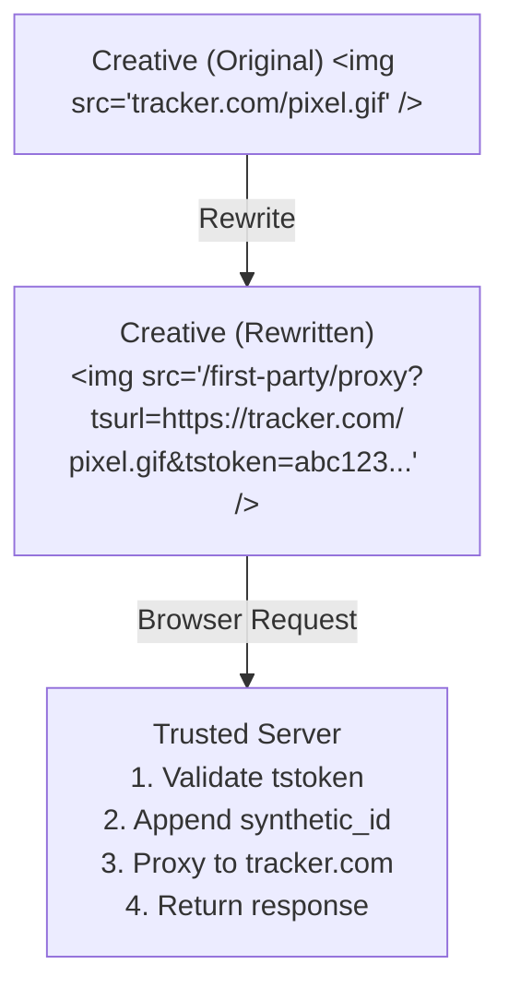

# First-Party Proxy

Learn how Trusted Server proxies third-party assets through first-party domains to improve privacy, security, and ad performance.

## Overview

The First-Party Proxy system rewrites third-party URLs in ad creatives to route through your domain, providing:

- **Privacy Protection** - No direct third-party cookies or tracking
- **Synthetic ID Forwarding** - Controlled identity propagation
- **Creative Rewrites** - Automatic HTML/CSS URL transformation
- **Click Tracking** - First-party click redirects
- **Content Security** - Validated, signed URLs prevent tampering

## How It Works



## Core Endpoints

### `/first-party/proxy` - Asset Proxy

Proxies third-party assets with automatic HTML/CSS rewriting.

**Request**:

```
GET /first-party/proxy?tsurl=https://example.com/ad.html&tstoken=signature
```

**Query Parameters**:
| Parameter | Required | Description |
|-----------|----------|-------------|
| `tsurl` | Yes | Base URL of the resource (without query params) |
| `tstoken` | Yes | HMAC-SHA256 signature of the full URL |
| `tsexp` | No | Unix timestamp expiration (30s default from signing) |
| _(others)_ | No | Original query parameters from target URL |

**Behavior**:

1. **Validates** the `tstoken` signature against reconstructed URL
2. **Appends** `synthetic_id` query parameter (if available)
3. **Proxies** request to target URL with forwarded headers:
   - `User-Agent`
   - `Accept`
   - `Accept-Language`
   - `Accept-Encoding`
   - `Referer`
   - `X-Forwarded-For`
4. **Processes** response based on content type:
   - **HTML** (`text/html`) - Rewrites all URLs, returns `text/html`
   - **CSS** (`text/css`) - Rewrites `url()` values, returns `text/css`
   - **Images** - Detects pixels, sets `image/*` if missing
   - **Other** - Passthrough without modification

**Example**:

Original URL:

```
https://tracker.com/pixel.gif?campaign=123&uid=abc
```

Signed proxy URL:

```
/first-party/proxy?
  tsurl=https://tracker.com/pixel.gif&
  campaign=123&
  uid=abc&
  tstoken=HmacSha256Signature
```

Final proxied request:

```
https://tracker.com/pixel.gif?campaign=123&uid=abc&synthetic_id=xyz
```

### `/first-party/click` - Click Redirects

Handles click tracking with first-party redirects.

**Request**:

```
GET /first-party/click?tsurl=https://advertiser.com/landing&tstoken=signature
```

**Query Parameters**: Same as `/first-party/proxy`

**Behavior**:

1. **Validates** the `tstoken` signature
2. **Appends** `synthetic_id` parameter to target URL
3. **Issues** 302 redirect to target (browser navigates directly)
4. **Logs** click metadata:
   - Target URL base (`tsurl`)
   - Whether parameters were present
   - Full reconstructed URL
   - Referer, User-Agent
   - Synthetic ID (if available)

**Example**:

Click URL in creative:

```html
<a
  href="/first-party/click?
  tsurl=https://advertiser.com/buy&
  product=widget&
  tstoken=signature"
>
  Buy Now
</a>
```

User clicks → Server responds:

```
HTTP/1.1 302 Found
Location: https://advertiser.com/buy?product=widget&synthetic_id=xyz
```

::: tip Click vs Proxy
Use `/first-party/click` for navigational links (anchors) since it avoids downloading content. Use `/first-party/proxy` for embedded resources (images, scripts, iframes) that need to be rendered inline.
:::

### `/first-party/sign` - URL Signing

Generates signed proxy URLs for dynamic use cases.

**Request (GET)**:

```
GET /first-party/sign?url=https://example.com/resource.jpg
```

**Request (POST)**:

```json
POST /first-party/sign
{
  "url": "https://example.com/resource.jpg?param=value"
}
```

**Response**:

```json
{
  "href": "/first-party/proxy?tsurl=https://example.com/resource.jpg&param=value&tstoken=signature&tsexp=1234567890",
  "base": "https://example.com/resource.jpg"
}
```

**Response Fields**:
| Field | Description |
|-------|-------------|
| `href` | Complete signed proxy URL ready to use |
| `base` | Original base URL (without query parameters) |

**Expiration**:

- Default: 30 seconds from signing
- `tsexp` parameter included in signed URL
- Validation fails after expiration

**Example Usage**:

```javascript
// Client-side JavaScript dynamically signing URLs
fetch('/first-party/sign?url=' + encodeURIComponent(imageUrl))
  .then((r) => r.json())
  .then((data) => {
    img.src = data.href // Use signed URL
  })
```

### `/first-party/proxy-rebuild` - URL Modification

Modifies existing signed URLs by adding or removing parameters.

**Request**:

```
POST /first-party/proxy-rebuild?tsclick=encoded_click_url&add=key:value&del=key
```

**Query Parameters**:
| Parameter | Required | Description |
|-----------|----------|-------------|
| `tsclick` | Yes | Base64-encoded original click/proxy URL |
| `add` | No | Parameter to add (format: `key:value`) |
| `del` | No | Parameter key to remove |

**Behavior**:

1. **Decodes** the `tsclick` base64 URL
2. **Parses** existing parameters
3. **Adds** specified parameters (`add`)
4. **Removes** specified parameters (`del`)
5. **Re-signs** the modified URL
6. **Returns** new signed URL

**Example**:

Original click URL:

```
/first-party/click?tsurl=https://example.com&product=A&tstoken=sig1
```

Modify URL (add `variant=red`, remove `product`):

```
POST /first-party/proxy-rebuild?
  tsclick=L2ZpcnN0LXBhcnR5L2NsaWNrP3RzdXJsPWh0dHBzOi8vZXhhbXBsZS5jb20mcHJvZHVjdD1BJnRzdG9rZW49c2lnMQ==&
  add=variant:red&
  del=product
```

Response:

```json
{
  "href": "/first-party/click?tsurl=https://example.com&variant=red&tstoken=sig2"
}
```

::: warning Use Cases
This endpoint is designed for advanced scenarios like A/B testing where you need to modify URLs without re-signing from scratch. Most implementations won't need this.
:::

## URL Signing & Validation

Trusted Server signs proxy and click URLs using the publisher `proxy_secret`. Signed URLs include a `tstoken` and may include `tsexp` for expiration.

For the detailed signing algorithm, validation steps, and security notes, see [Proxy Signing](/guide/proxy-signing).

## Content Type Handling

### HTML Rewriting

**Triggers**: Response `Content-Type: text/html`

**Process**:

1. Parse HTML with streaming processor
2. Rewrite absolute URLs to `/first-party/proxy` or `/first-party/click`
3. Preserve relative URLs unchanged
4. Sign all rewritten URLs with `tstoken`
5. Return as `text/html; charset=utf-8`

**Rewritten Elements**: See [Creative Processing](/guide/creative-processing) for full list.

### CSS Rewriting

**Triggers**: Response `Content-Type: text/css`

**Process**:

1. Parse CSS for `url(...)` values
2. Rewrite absolute URLs to `/first-party/proxy`
3. Sign URLs with `tstoken`
4. Return as `text/css; charset=utf-8`

**Example**:

```css
/* Original */
.banner {
  background: url(https://cdn.com/bg.jpg);
}

/* Rewritten */
.banner {
  background: url(/first-party/proxy?tsurl=https://cdn.com/bg.jpg&tstoken=sig);
}
```

### Image Handling

**Triggers**:

- Response `Content-Type: image/*`, OR
- Request `Accept` header contains `image/`

**Process**:

1. Set `Content-Type: image/*` if missing
2. Detect likely pixels with heuristics:
   - `Content-Length` ≤ 256 bytes
   - URL contains `/pixel`, `/p.gif`, `/1x1`, `/track`
3. Log pixel detection (no response alteration)
4. Passthrough image data

**Logging**:

```
proxy: likely pixel detected size=43 url=https://tracker.com/p.gif
```

### Passthrough (Other Types)

**Triggers**: Any other `Content-Type`

**Process**:

- Forward response without modification
- Preserve original `Content-Type`
- No HTML/CSS/URL rewriting
- Useful for: JSON, JavaScript, binary files, etc.

## Redirect Handling

The proxy automatically follows HTTP redirects:

**Supported Status Codes**:

- `301` - Moved Permanently
- `302` - Found
- `303` - See Other (switches to GET)
- `307` - Temporary Redirect
- `308` - Permanent Redirect

**Behavior**:

1. Follow up to **4 redirect hops**
2. Re-apply `synthetic_id` on each hop
3. Switch to `GET` after `303` response
4. Log when redirect limit reached
5. Preserve request headers across hops

**Example Flow**:

```
Request: /first-party/proxy?tsurl=https://short.link&tstoken=sig
  → 302 to https://cdn.com/ad.html
  → 200 with HTML content
  → Rewrite HTML and return
```

## Synthetic ID Propagation

### Automatic Forwarding

When proxying, Trusted Server automatically appends the `synthetic_id` parameter:

**Source Priority**:

1. `x-synthetic-id` request header
2. `synthetic_id` cookie
3. Generate new ID if missing

**Example**:

```
Original request to proxy:
  /first-party/proxy?tsurl=https://tracker.com/pixel.gif&tstoken=sig
  Cookie: synthetic_id=user123

Proxied backend request:
  https://tracker.com/pixel.gif?synthetic_id=user123
```

### Redirect Propagation

Synthetic IDs are re-applied on **every redirect hop**:

```
/first-party/proxy?tsurl=https://redirect1.com&tstoken=sig
  → https://redirect1.com?synthetic_id=user123
  → 302 to https://redirect2.com
  → https://redirect2.com?synthetic_id=user123
  → 302 to https://final.com
  → https://final.com?synthetic_id=user123
  → 200 response
```

This ensures downstream trackers receive consistent IDs even through redirect chains.

### Click ID Forwarding

Click redirects also forward synthetic IDs:

```html
<a href="/first-party/click?tsurl=https://advertiser.com&tstoken=sig"></a>
```

User clicks → redirect includes ID:

```
302 Found
Location: https://advertiser.com?synthetic_id=user123
```

::: tip Privacy Control
Synthetic IDs are only forwarded when:

1. User has given GDPR consent (if required)
2. ID exists in request (header/cookie)
3. Integration hasn't disabled forwarding (`forward_synthetic_id: false`)
   :::

## Configuration

### Publisher Settings

Configure proxy behavior in `trusted-server.toml`:

```toml
[publisher]
domain = "publisher.com"
origin_url = "https://origin.publisher.com"
proxy_secret = "your-secure-random-secret"
cookie_domain = ".publisher.com"  # For synthetic_id cookies
```

### URL Rewrite Exclusions

Exclude specific domains from rewriting:

```toml
[rewrite]
exclude_domains = [
  "*.cdn.trusted.com",      # Wildcard pattern
  "first-party.example.com" # Exact match
]
```

URLs matching these patterns will NOT be rewritten to `/first-party/proxy`.

### Streaming vs Buffered

Control whether responses are streamed or buffered:

```rust
// Integration code example
ProxyRequestConfig::new(url)
    .with_streaming()  // Enable streaming (no HTML/CSS rewrites)
```

**Streaming** (buffered rewrites disabled):

- Preserves origin compression (gzip/brotli)
- Lower memory usage
- No HTML/CSS URL rewriting
- Best for: large files, images, videos

**Buffered** (default):

- Enables HTML/CSS rewriting
- Decompresses response
- Higher memory usage
- Best for: ad creatives, landing pages

## Performance Optimization

### Compression

**Buffered Mode**:

- Decompresses origin response
- Processes content
- Returns uncompressed (Fastly can re-compress)

**Streaming Mode**:

- Preserves origin `Content-Encoding`
- No decompression/recompression overhead
- Passes through gzip/brotli/deflate

### Caching

Proxy responses respect origin cache headers:

- `Cache-Control`
- `Expires`
- `ETag`
- `Last-Modified`

**Best Practices**:

```http
Cache-Control: public, max-age=3600
Vary: Accept-Encoding
```

### Header Forwarding

Only essential headers are forwarded to reduce overhead:

**Forwarded Headers**:

- `User-Agent` - Client identification
- `Accept` - Content negotiation
- `Accept-Language` - Language preferences
- `Accept-Encoding` - Compression support
- `Referer` - Page context
- `X-Forwarded-For` - Client IP chain

**Not Forwarded**:

- Authentication headers (unless explicitly added)
- Cookies (except synthetic ID appended as query param)
- Custom headers (unless added via `ProxyRequestConfig`)

## Error Handling

### Common Errors

**Invalid Signature**:

```
HTTP 403 Forbidden
tstoken validation failed: signature mismatch
```

**Solutions**:

- Verify `proxy_secret` matches signing configuration
- Check URL reconstruction includes all parameters in correct order
- Ensure no URL encoding issues

**Expired URL**:

```
HTTP 403 Forbidden
tstoken expired
```

**Solutions**:

- URLs signed with `/first-party/sign` expire in 30s
- Re-sign URL if needed
- Check client/server clock sync

**Missing Parameters**:

```
HTTP 400 Bad Request
Missing required parameter: tsurl
```

**Solutions**:

- Ensure `tsurl` parameter is present
- Include `tstoken` in request
- Verify URL encoding is correct

### Redirect Limit

When redirect limit (4 hops) is reached:

```
Log: proxy: redirect limit reached for url=https://...
```

Response: Returns last redirect response (302/307/308) without following.

**Solutions**:

- Contact origin to reduce redirect chain
- Increase limit in code (modify `MAX_REDIRECTS` constant)

## Security Considerations

### Token Security

**Do**:
✅ Use cryptographically strong `proxy_secret` (32+ bytes random)  
✅ Rotate secrets periodically  
✅ Validate expiration on all requests  
✅ Use constant-time comparison for signatures

**Don't**:
❌ Expose `proxy_secret` in client-side code  
❌ Reuse secrets across environments  
❌ Accept unsigned URLs  
❌ Skip validation for "trusted" domains

### URL Injection Prevention

Signed URLs prevent injection attacks:

```
Attacker tries:
  /first-party/proxy?tsurl=https://evil.com&tstoken=forged

Trusted Server:
  1. Computes expected token for https://evil.com
  2. Compares with provided token
  3. Rejects if mismatch (403 Forbidden)
```

### Content Security

**Automatic Protection**:

- HTML/CSS rewriting removes malicious URLs
- Data URIs are skipped (`data:`, `javascript:`, `blob:`)
- Protocol validation (only `http://` and `https://`)

**Considerations**:

- Origin content is still served (validate trusted sources)
- Streaming mode bypasses HTML inspection
- Enable CSP headers for additional protection

## Monitoring & Debugging

### Logging

Proxy requests emit detailed logs:

```
proxy: origin response status=200 ct=text/html cl=1234 accept=text/html url=https://...
proxy: likely pixel detected size=43 url=https://tracker.com/p.gif
click: tsurl=https://advertiser.com had_params=true target=... referer=... ua=... tsid=...
```

### Diagnostic Headers

Add custom headers for debugging:

```toml
[response_headers]
X-Proxy-Mode = "rewrite"
X-TS-Version = "1.0"
```

### Metrics to Track

**Key Metrics**:

- Proxy request count (total)
- Signature validation failures (rate)
- Redirect hops (average/max)
- Response time (p50/p95/p99)
- Content type distribution
- Pixel detection rate

## Next Steps

- Learn about [Creative Processing](/guide/creative-processing) for HTML rewriting details
- Review [Synthetic IDs](/guide/synthetic-ids) for identity management
- Set up [Configuration](/guide/configuration) for your deployment
- Explore [Integration Guide](/guide/integration-guide) for custom integrations
