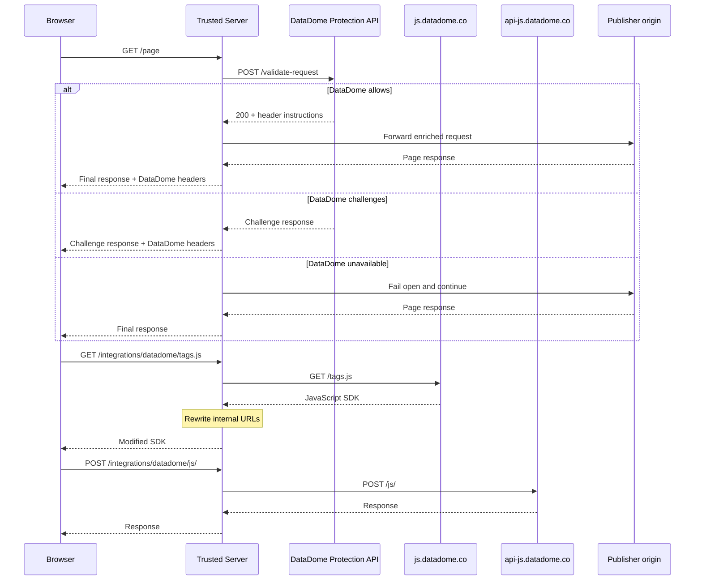

# DataDome Integration

DataDome provides bot protection and fraud prevention for websites. Trusted Server supports two complementary DataDome layers:

1. **First-party client delivery**: proxy the DataDome JavaScript tag and signal collection API through the publisher domain.
2. **Server-side request protection**: call the DataDome Protection API before route matching so DataDome can allow, challenge, or enrich requests at the edge.

## Overview

The DataDome integration can:

- Proxy `tags.js` through your first-party domain
- Rewrite internal DataDome URLs to route through Trusted Server
- Proxy signal collection API (`/js/*`) through first-party context
- Automatically rewrite `<script>` tags in HTML responses
- Auto-inject the client-side tag when `client_side_key` is configured
- Validate in-scope requests through the DataDome Protection API before publisher-origin routing
- Apply DataDome request-enrichment headers and downstream response headers/cookies

## Benefits

| Traditional setup          | Trusted Server approach             |
| -------------------------- | ----------------------------------- |
| Requires DNS CNAME changes | No DNS changes needed               |
| Separate subdomain setup   | Uses existing publisher domain      |
| Direct browser-to-DataDome | Traffic can flow through edge       |
| Ad blockers may interfere  | First-party context avoids blocking |
| Origin sees every request  | Edge can challenge before origin    |

## Configuration

Add the following to your `trusted-server.toml`:

```toml
[integrations.datadome]
enabled = true

# First-party JavaScript/proxy layer
sdk_origin = "https://js.datadome.co"
api_origin = "https://api-js.datadome.co"
cache_ttl_seconds = 3600
rewrite_sdk = true

# Server-side Protection API layer
enable_protection = false
server_side_key_secret_store = "datadome"
server_side_key_secret_name = "server_side_key"
protection_api_origin = "https://api-fastly.datadome.co"
timeout_ms = 1500
url_pattern_exclusion = "\\.(avi|flv|mka|mkv|mov|mp4|mpeg|mpg|mp3|flac|ogg|ogm|opus|wav|webm|webp|bmp|gif|ico|jpeg|jpg|png|svg|svgz|swf|eot|otf|ttf|woff|woff2|css|less|js|map)$"
url_pattern_inclusion = ""
enable_graphql_support = false

# Client-side tag auto-injection
client_side_key = ""
inject_client_side_tag = true
client_side_tag_url = "/integrations/datadome/tags.js"
client_side_configuration = { ajaxListenerPath = true }
```

### Configuration options

| Option                         | Type    | Default                          | Description                                                                             |
| ------------------------------ | ------- | -------------------------------- | --------------------------------------------------------------------------------------- |
| `enabled`                      | boolean | `false`                          | Enable the DataDome integration                                                         |
| `sdk_origin`                   | string  | `https://js.datadome.co`         | DataDome SDK origin URL for `tags.js`                                                   |
| `api_origin`                   | string  | `https://api-js.datadome.co`     | DataDome signal collection API origin URL for `/js/*`                                   |
| `cache_ttl_seconds`            | integer | `3600`                           | Cache TTL for `tags.js`                                                                 |
| `rewrite_sdk`                  | boolean | `true`                           | Rewrite DataDome script URLs in HTML to first-party paths                               |
| `enable_protection`            | boolean | `false`                          | Call the Protection API before route matching                                           |
| `server_side_key_secret_store` | string  | `datadome`                       | Runtime secret store containing the DataDome server-side key                            |
| `server_side_key_secret_name`  | string  | `server_side_key`                | Secret name containing the DataDome server-side key                                     |
| `protection_api_origin`        | string  | `https://api-fastly.datadome.co` | Protection API origin                                                                   |
| `timeout_ms`                   | integer | `1500`                           | Dynamic backend first-byte timeout for Protection API calls                             |
| `url_pattern_exclusion`        | string  | Static asset extension regex     | Case-insensitive regex matched against `host + pathname` to skip protection             |
| `url_pattern_inclusion`        | string  | `""`                             | Optional case-insensitive regex matched against `host + pathname` to include protection |
| `enable_graphql_support`       | boolean | `false`                          | Reserved for future GraphQL body inspection; ignored in v1                              |
| `client_side_key`              | string  | `""`                             | DataDome client-side JavaScript key used for tag injection                              |
| `inject_client_side_tag`       | boolean | `true`                           | Auto-inject the browser tag when `client_side_key` is non-empty                         |
| `client_side_tag_url`          | string  | `/integrations/datadome/tags.js` | Script URL used by auto-injection                                                       |
| `client_side_configuration`    | object  | `{ ajaxListenerPath = true }`    | Options assigned to `window.ddoptions`                                                  |

## Client-side setup

### Auto-injection

Set `client_side_key` to have Trusted Server inject the DataDome browser tag into processed HTML responses:

```toml
[integrations.datadome]
enabled = true
client_side_key = "YOUR_DATADOME_JS_KEY"
inject_client_side_tag = true
```

Trusted Server emits the DataDome configuration before the Trusted Server JavaScript bundle:

```html
<script>
  window.ddjskey = 'YOUR_DATADOME_JS_KEY'
  window.ddoptions = { ajaxListenerPath: true }
</script>
<script src="/integrations/datadome/tags.js" async></script>
```

If your site already manages the DataDome tag, disable auto-injection:

```toml
[integrations.datadome]
inject_client_side_tag = false
```

### Manual setup

You can also load DataDome manually through the first-party path:

```html
<script>
  window.ddjskey = 'YOUR_DATADOME_JS_KEY'
  window.ddoptions = {}
</script>
<script src="/integrations/datadome/tags.js" async></script>
```

If `rewrite_sdk` is enabled, Trusted Server rewrites existing DataDome script tags in HTML:

```html
<!-- Original -->
<script src="https://js.datadome.co/tags.js" async></script>

<!-- Becomes -->
<script
  src="https://www.example.com/integrations/datadome/tags.js"
  async
></script>
```

## Server-side Protection API

When `enable_protection = true`, Trusted Server calls DataDome before normal route matching. DataDome can return:

- **Allow**: continue routing and optionally enrich the upstream request.
- **Challenge**: return the DataDome response directly without contacting the publisher origin.
- **Fail-open condition**: continue routing without DataDome effects when the Protection API times out, returns malformed instructions, or returns an unexpected status.

The configured `server_side_key_secret_store` and `server_side_key_secret_name` must resolve to a non-empty secret when server-side protection is enabled. If the secret cannot be read, DataDome protection fails open for that request.

### Protected traffic

A request is protected when all of the following are true:

1. The DataDome integration is enabled.
2. `enable_protection = true`.
3. The method is not `OPTIONS`.
4. The path is not one of Trusted Server's internal routes.
5. The `host + pathname` matches `url_pattern_inclusion`, when configured.
6. The `host + pathname` does not match `url_pattern_exclusion`, when configured.

Static assets are excluded by default using a case-insensitive file-extension regex. Trusted Server internal routes such as `/static/tsjs=`, `/integrations/`, `/first-party/`, admin routes, discovery routes, and signature-verification routes are also excluded by default.

Auction traffic at `/auction` is protected by default.

### Header handling

DataDome can return pointer headers that identify which headers Trusted Server should copy:

| Pointer header               | Applied to                                 |
| ---------------------------- | ------------------------------------------ |
| `X-DataDome-request-headers` | Request forwarded to Trusted Server/origin |
| `X-DataDome-headers`         | Final browser response                     |

Trusted Server copies only the named headers. Pointer headers themselves are not forwarded. `Set-Cookie` is appended, while other copied headers are set/replaced. Unsafe hop-by-hop, framing, host, and internal `x-ts-*` headers are rejected.

DataDome downstream response headers are applied after EC response finalization and generic Trusted Server response headers so DataDome challenge/cache/cookie headers win.

### GraphQL limitation

`enable_graphql_support` is reserved for future request-body inspection. Trusted Server v1 does not parse GraphQL bodies for DataDome payload enrichment.

## Endpoints

The first-party layer exposes these routes:

| Method     | Path                             | Description           |
| ---------- | -------------------------------- | --------------------- |
| `GET`      | `/integrations/datadome/tags.js` | DataDome SDK script   |
| `GET/POST` | `/integrations/datadome/js/*`    | Signal collection API |

## How it works


```mermaid
sequenceDiagram
    participant Browser
    participant TS as Trusted Server
    participant DD as DataDome Protection API
    participant SDK as js.datadome.co
    participant API as api-js.datadome.co
    participant Origin as Publisher origin

    Browser->>TS: GET /page
    TS->>DD: POST /validate-request
    alt DataDome allows
        DD-->>TS: 200 + header instructions
        TS->>Origin: Forward enriched request
        Origin-->>TS: Page response
        TS-->>Browser: Final response + DataDome headers
    else DataDome challenges
        DD-->>TS: Challenge response
        TS-->>Browser: Challenge response + DataDome headers
    else DataDome unavailable
        TS->>Origin: Fail open and continue
        Origin-->>TS: Page response
        TS-->>Browser: Final response
    end

    Browser->>TS: GET /integrations/datadome/tags.js
    TS->>SDK: GET /tags.js
    SDK-->>TS: JavaScript SDK
    Note over TS: Rewrite internal URLs
    TS-->>Browser: Modified SDK

    Browser->>TS: POST /integrations/datadome/js/
    TS->>API: POST /js/
    API-->>TS: Response
    TS-->>Browser: Response
```

## Environment variables

Override configuration via environment variables:

```bash
TRUSTED_SERVER__INTEGRATIONS__DATADOME__ENABLED=true
TRUSTED_SERVER__INTEGRATIONS__DATADOME__SDK_ORIGIN=https://js.datadome.co
TRUSTED_SERVER__INTEGRATIONS__DATADOME__API_ORIGIN=https://api-js.datadome.co
TRUSTED_SERVER__INTEGRATIONS__DATADOME__CACHE_TTL_SECONDS=3600
TRUSTED_SERVER__INTEGRATIONS__DATADOME__REWRITE_SDK=true
TRUSTED_SERVER__INTEGRATIONS__DATADOME__ENABLE_PROTECTION=true
TRUSTED_SERVER__INTEGRATIONS__DATADOME__SERVER_SIDE_KEY_SECRET_STORE=datadome
TRUSTED_SERVER__INTEGRATIONS__DATADOME__SERVER_SIDE_KEY_SECRET_NAME=server_side_key
TRUSTED_SERVER__INTEGRATIONS__DATADOME__CLIENT_SIDE_KEY=your-client-side-key
```

## Client-side script guard

For single-page applications and frameworks like Next.js that dynamically insert script tags, the integration includes a client-side guard. When the `datadome` module is included in your TSJS bundle, it intercepts dynamically inserted DataDome scripts and rewrites them to use first-party paths.

The guard handles:

- `<script src="js.datadome.co/...">` elements
- `<link rel="preload" as="script" href="js.datadome.co/...">` elements
- `<link rel="prefetch" as="script" href="js.datadome.co/...">` elements

This keeps DataDome scripts routed through first-party context, even when inserted dynamically by client-side JavaScript.

## Troubleshooting

### Script not loading

Check that the integration is enabled:

```toml
[integrations.datadome]
enabled = true
```

If you rely on auto-injection, verify `client_side_key` is non-empty and `inject_client_side_tag = true`.

### Signals not sending

Verify that signal collection routes are working:

```bash
curl -X POST https://www.example.com/integrations/datadome/js/check
```

### Server-side protection not running

Check that both fields are configured:

```toml
[integrations.datadome]
enabled = true
enable_protection = true
server_side_key_secret_store = "datadome"
server_side_key_secret_name = "server_side_key"
```

Also verify the request is not excluded by the default internal/static route exclusions or your custom inclusion/exclusion regexes.

### HTML rewriting not working

Ensure `rewrite_sdk = true` and that your pages are being proxied through Trusted Server's HTML processing pipeline.

## See also

- [DataDome First-Party Integration Docs](https://docs.datadome.co/docs/integrations#first-party-javascript-tag)
- [Integrations Overview](/guide/integrations-overview)
- [First-Party Proxy](/guide/first-party-proxy)
