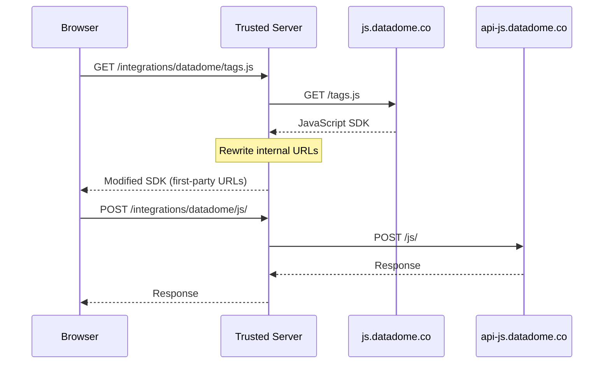

# DataDome Integration

DataDome provides bot protection and fraud prevention for websites. This integration enables first-party delivery of DataDome's JavaScript tag and signal collection through Trusted Server, eliminating the need for DNS/CNAME configuration.

## Overview

The DataDome integration:

- Proxies `tags.js` SDK through your first-party domain
- Rewrites internal DataDome URLs to route through Trusted Server
- Proxies signal collection API (`/js/*`) through first-party context
- Automatically rewrites `<script>` tags in HTML responses

## Benefits

| Traditional Setup          | Trusted Server Approach             |
| -------------------------- | ----------------------------------- |
| Requires DNS CNAME changes | No DNS changes needed               |
| Separate subdomain setup   | Uses existing publisher domain      |
| Direct browser-to-DataDome | All traffic through publisher edge  |
| Ad blockers may interfere  | First-party context avoids blocking |

## Configuration

Add the following to your `trusted-server.toml`:

```toml
[integrations.datadome]
enabled = true
sdk_origin = "https://js.datadome.co"        # SDK script origin (tags.js)
api_origin = "https://api-js.datadome.co"    # Signal collection API origin (/js/*)
cache_ttl_seconds = 3600
rewrite_sdk = true
```

### Configuration Options

| Option              | Type    | Default                      | Description                                               |
| ------------------- | ------- | ---------------------------- | --------------------------------------------------------- |
| `enabled`           | boolean | `false`                      | Enable the DataDome integration                           |
| `sdk_origin`        | string  | `https://js.datadome.co`     | DataDome SDK origin URL (for tags.js)                     |
| `api_origin`        | string  | `https://api-js.datadome.co` | DataDome signal collection API origin URL (for /js/\*)    |
| `cache_ttl_seconds` | integer | `3600`                       | Cache TTL for tags.js (1 hour default)                    |
| `rewrite_sdk`       | boolean | `true`                       | Rewrite DataDome script URLs in HTML to first-party paths |

## Usage

### Publisher Page Setup

Update your page to load DataDome through Trusted Server:

```html
<script>
  window.ddjskey = 'YOUR_DATADOME_JS_KEY'
  window.ddoptions = {}
</script>
<script src="/integrations/datadome/tags.js" async></script>
```

If `rewrite_sdk` is enabled, Trusted Server will automatically rewrite any existing DataDome script tags in your HTML:

```html
<!-- Original -->
<script src="https://js.datadome.co/tags.js" async></script>

<!-- Becomes -->
<script
  src="https://your-domain.com/integrations/datadome/tags.js"
  async
></script>
```

## Endpoints

The integration exposes the following routes:

| Method     | Path                             | Description           |
| ---------- | -------------------------------- | --------------------- |
| `GET`      | `/integrations/datadome/tags.js` | DataDome SDK script   |
| `GET/POST` | `/integrations/datadome/js/*`    | Signal collection API |

## How It Works



### Request Flow

1. **SDK Loading**: Browser requests `/integrations/datadome/tags.js`
2. **Proxy & Rewrite**: Trusted Server fetches from `js.datadome.co`, rewrites internal URLs to first-party paths
3. **Signal Collection**: SDK sends signals to `/integrations/datadome/js/`
4. **Transparent Proxy**: Trusted Server forwards to `api-js.datadome.co`, returns response

## Environment Variables

Override configuration via environment variables:

```bash
TRUSTED_SERVER__INTEGRATIONS__DATADOME__ENABLED=true
TRUSTED_SERVER__INTEGRATIONS__DATADOME__SDK_ORIGIN=https://js.datadome.co
TRUSTED_SERVER__INTEGRATIONS__DATADOME__API_ORIGIN=https://api-js.datadome.co
TRUSTED_SERVER__INTEGRATIONS__DATADOME__CACHE_TTL_SECONDS=3600
TRUSTED_SERVER__INTEGRATIONS__DATADOME__REWRITE_SDK=true
```

## Client-Side Script Guard

For single-page applications (SPAs) and frameworks like Next.js that dynamically insert script tags, the integration includes a client-side guard. When the `datadome` module is included in your tsjs bundle, it automatically intercepts dynamically inserted DataDome scripts and rewrites them to use first-party paths.

The guard handles:

- `<script src="js.datadome.co/...">` elements
- `<link rel="preload" as="script" href="js.datadome.co/...">` elements
- `<link rel="prefetch" as="script" href="js.datadome.co/...">` elements

This ensures DataDome scripts are always loaded through first-party context, even when inserted dynamically by client-side JavaScript.

## Notes

- **No Captcha Support**: This integration currently focuses on signal collection. CAPTCHA functionality may require additional configuration.
- **Cache Headers**: The SDK response includes caching headers based on `cache_ttl_seconds`.
- **Origin Headers**: Trusted Server forwards appropriate headers to DataDome for proper request context.
- **URL Rewriting**: Both `js.datadome.co` and `api-js.datadome.co` URLs in the SDK are rewritten to first-party paths.

## Troubleshooting

### Script Not Loading

Check that the integration is enabled:

```toml
[integrations.datadome]
enabled = true
```

### Signals Not Sending

Verify that signal collection routes are working:

```bash
curl -X POST https://your-domain.com/integrations/datadome/js/check
```

### HTML Rewriting Not Working

Ensure `rewrite_sdk = true` and that your pages are being proxied through Trusted Server's HTML processing pipeline.

## See Also

- [DataDome First-Party Integration Docs](https://docs.datadome.co/docs/integrations#first-party-javascript-tag)
- [Integrations Overview](/guide/integrations-overview)
- [First-Party Proxy](/guide/first-party-proxy)
