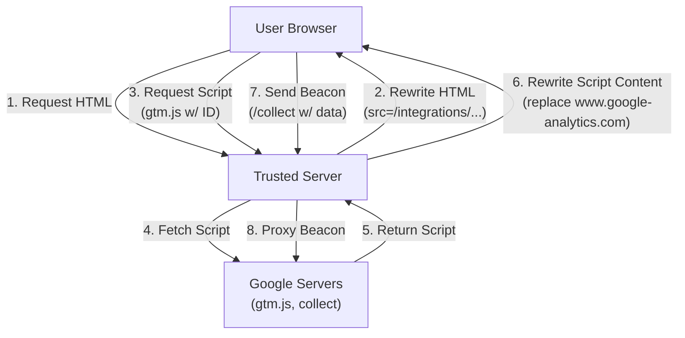

# Google Tag Manager Integration

**Category**: Tag Management
**Status**: Production
**Type**: First-Party Tag Gateway

## Overview

The Google Tag Manager (GTM) integration enables Trusted Server to act as a first-party proxy for GTM scripts and analytics beacons. This improves performance, tracking accuracy, and privacy control by serving these assets from your own domain.

## What is the Tag Gateway?

The Tag Gateway intercepts requests for GTM scripts (`gtm.js`) and Google Analytics beacons (`collect`). Instead of the user's browser connecting directly to Google content servers, it connects to your Trusted Server. Trusted Server then fetches the content from Google and serves it back to the user.

**Benefits**:

- **Bypass Ad Blockers**: Serving scripts from a first-party domain can prevent them from being blocked by some ad blockers and privacy extensions.
- **Extended Cookie Life**: First-party cookies set by these scripts are more durable in environments like Safari (ITP).
- **Performance**: Utilize edge caching for scripts.
- **Privacy Control**: Strips client IP addresses before forwarding data to Google.

## Configuration

Add the GTM configuration to `trusted-server.toml`:

```toml
[integrations.google_tag_manager]
enabled = true
container_id = "GTM-XXXXXX"
# upstream_url = "https://www.googletagmanager.com" # Optional override
```

### Configuration Options

| Field          | Type    | Required | Description                                   |
| -------------- | ------- | -------- | --------------------------------------------- |
| `enabled`      | boolean | No       | Enable/disable integration (default: `false`) |
| `container_id` | string  | Yes      | Your GTM Container ID (e.g., `GTM-A1B2C3`)    |
| `upstream_url` | string  | No       | Custom upstream URL (advanced usage)          |

## How It Works



### 1. Script Rewriting

When Trusted Server processes an HTML response, it automatically rewrites GTM script tags to point to the local proxy:

**Before:**

```html
<script src="https://www.googletagmanager.com/gtm.js?id=GTM-XXXXXX"></script>
```

**After:**

```html
<script src="/integrations/google_tag_manager/gtm.js?id=GTM-XXXXXX"></script>
```

### 2. Script Proxying

The proxy intercepts requests for the GTM library and modifies it on-the-fly. This is critical for First-Party context.

1.  **Fetch**: Retrieves the original `gtm.js` from Google.
2.  **Rewrite**: Replaces hardcoded references to `www.google-analytics.com` and `www.googletagmanager.com` with the local proxy path.
3.  **Serve**: Returns the modified script with correct caching headers.

### 3. Beacon Proxying

Analytics data (events, pageviews) normally sent to `google-analytics.com/collect` are now routed to:

`https://your-server.com/integrations/google_tag_manager/collect`

Trusted Server acts as a gateway, stripping client IP addresses (privacy) before forwarding the data to Google.

## Core Endpoints

### `GET .../gtm.js` - Script Proxy

Proxies the Google Tag Manager library.

**Request**:

```
GET /integrations/google_tag_manager/gtm.js?id=GTM-XXXXXX
```

**Behavior**:

- Proxies to `https://www.googletagmanager.com/gtm.js`
- Rewrites internal URLs to use the first-party proxy
- Sets `Accept-Encoding: identity` during fetch to ensure rewriteable text response

### `GET/POST .../collect` - Analytics Beacon

Proxies analytics events (GA4/UA).

**Request**:

```
POST /integrations/google_tag_manager/g/collect?v=2&...
```

**Behavior**:

- Proxies to `https://www.google-analytics.com/g/collect`
- Forwarding: User-Agent, Referer, Payload
- Privacy: Does NOT forward client IP (Google sees Trusted Server IP)

## Performance & Caching

### Compression

The integration requires the upstream `gtm.js` to be uncompressed to perform string replacement. Trusted Server fetches it with `Accept-Encoding: identity`.

_Note: Trusted Server will re-compress the response (gzip/brotli) before sending it to the user if the `compression` feature is enabled._

### Direct Proxying

Beacon requests (`/collect`) are proxied directly using streaming, minimizing latency overhead.

## Manual Verification

You can verify the integration using `curl`:

**Test Script Result**:

```bash
curl -v "http://localhost:8080/integrations/google_tag_manager/gtm.js?id=GTM-XXXXXX"
```

_Expected_: `200 OK`. Body should contain `/integrations/google_tag_manager` instead of `google-analytics.com`.

**Test Beacon Result**:

```bash
curl -v -X POST "http://localhost:8080/integrations/google_tag_manager/g/collect?v=2&tid=G-TEST"
```

_Expected_: `200 OK` (or 204).

## Implementation Details

See [crates/common/src/integrations/google_tag_manager.rs](https://github.com/IABTechLab/trusted-server/blob/main/crates/common/src/integrations/google_tag_manager.rs).

## Next Steps

- Review [Prebid Integration](/guide/integrations/prebid) for header bidding.
- Check [Configuration Guide](/guide/configuration) for other integration settings.
- Learn more about [Synthetic IDs](/guide/synthetic-ids) which are generated alongside this integration.
