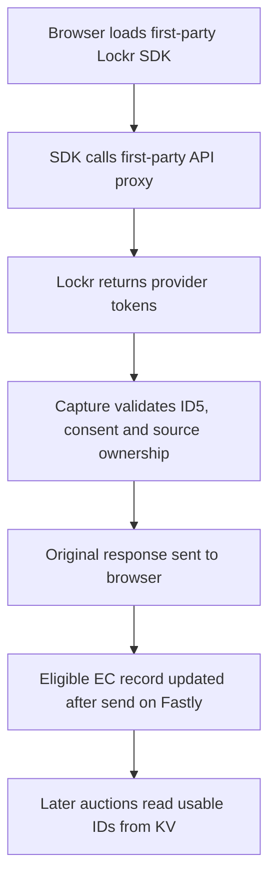

# Lockr Integration

**Category**: Identity
**Status**: Production
**Type**: Identity Management & Privacy Vault

## Overview

The Lockr integration enables first-party identity resolution and data management through Lockr's identity vault platform. This integration provides identity synchronization, with downstream forwarding subject to available consent signals.

## What is Lockr?

Lockr is an identity resolution and privacy platform that helps publishers manage user identities across fragmented environments (cookieless browsers, multiple devices, etc.) subject to user consent.

**Key Capabilities**:

- Identity graph management
- Consent-based data sharing
- Secure identity vault
- Cross-device user recognition
- Publisher-owned identity infrastructure

## How It Works



## Configuration

Add Lockr configuration to `trusted-server.toml`:

```toml
[integrations.lockr]
enabled = true
app_id = "example-app-id"
# Leave capture off until provider, consent, ownership and rollout gates pass.
capture_identity = false
capture_global_withdrawal = false

[[ec.partners]]
name = "ID5"
source_domain = "id5-sync.com"
openrtb_atype = 1
bidstream_enabled = true
identity_owner = "lockr"
```

### Configuration Options

| Field                       | Type    | Required | Description                                                                    |
| --------------------------- | ------- | -------- | ------------------------------------------------------------------------------ |
| `enabled`                   | boolean | No       | Enable/disable the integration (default: `true` when configured)               |
| `app_id`                    | string  | Yes      | Lockr application ID                                                           |
| `capture_identity`          | boolean | No       | Token-capture kill switch (default: `true`; set `false` for rollout)           |
| `capture_global_withdrawal` | boolean | No       | Approved global EC withdrawal on application-success revoke (default: `false`) |
| `api_endpoint`              | URL     | No       | Override the Lockr API origin                                                  |
| `sdk_url`                   | URL     | No       | Override the SDK URL                                                           |
| `cache_ttl_seconds`         | integer | No       | SDK response cache lifetime in seconds (default: 3600)                         |
| `rewrite_sdk`               | boolean | No       | Rewrite matching SDK URLs to the first-party route (default: `true`)           |
| `origin_override`           | URL     | No       | Origin header override for local or approved domains                           |

`rewrite_sdk_host` is deprecated and ignored. An absent Lockr configuration does not register the integration.

### Environment Variables

```bash
TRUSTED_SERVER__INTEGRATIONS__LOCKR__ENABLED=true
TRUSTED_SERVER__INTEGRATIONS__LOCKR__APP_ID=example-app-id
TRUSTED_SERVER__INTEGRATIONS__LOCKR__CAPTURE_IDENTITY=false
```

## Features

### Identity Synchronization

The SDK requests identities from Lockr through the first-party proxy. Trusted Server does not call Lockr to resolve identifiers independently. With approved capture enabled, valid ID5 tokens enrich an existing consenting EC record after the proxy response has been sent on Fastly. Later auctions can use that ID once the KV write is visible. Neither the first auction nor a failed post-send write has a guaranteed repair.

### Privacy Vault

User data is stored securely in Lockr's privacy vault:

- Encrypted at rest
- Consent-based access
- User right to erasure
- Data portability support

### Extended ID (EID) Support

A later server-side auction can include a usable registered ID5 record as an `id5-sync.com` EID with `atype=1`. Trusted Server does not store provider `ext` or OpenRTB `inserter`/`matcher` metadata in KV; browser-supplied provenance remains current-request-only. Other provider token mappings are not enabled by the ID5 parser.

## Use Cases

### 1. Cookieless Identity Resolution

**Problem**: Safari and Firefox block third-party cookies, fragmenting user identity.

**Solution**: Lockr provides first-party identity resolution that works across cookieless environments.

**Benefit**: Maintain user recognition and monetization in browsers that restrict third-party cookies.

### 2. Cross-Device User Recognition

**Problem**: Users access content from multiple devices, appearing as different users.

**Solution**: Lockr's identity graph links devices to a unified user profile.

**Benefit**: Provider-side linking may support cross-device recognition. Trusted Server does not link EC IDs across browsers or devices through capture.

### 3. Consent-Based Data Sharing

**Problem**: Sharing user data with partners raises GDPR/CCPA compliance risks.

**Solution**: Lockr enforces consent-based access to identity data.

**Benefit**: Data monetization gated on recorded consent.

## Implementation Details

The Lockr integration is implemented in [crates/trusted-server-core/src/integrations/lockr.rs](https://github.com/IABTechLab/trusted-server/blob/main/crates/trusted-server-core/src/integrations/lockr.rs).

### Key Components

**Routed Endpoints**:

- Route: `/integrations/lockr/sdk` (GET) serves the Lockr SDK first-party
- Route: `/integrations/lockr/api/*` (GET, POST) proxies Lockr API calls
- Purpose: Keep SDK delivery and identity API traffic on the publisher origin

**ID Mapping**:

- The only supported capture mapping is Lockr `id5id` to registered `id5-sync.com` with `atype=1`.
- The EC identity graph retains the source, UID and lifecycle metadata, including known provider expiry. It does not store provider `ext` or additional UIDs.
- Publisher SDK storage remains the SDK's responsibility. Capture does not add an EID cookie.

**Consent Validation**:

- Request consent and populated body `consentString`, `gppString` and `ccpaString` pass shared acquisition policy. Malformed populated signals fail closed.
- Body signals can restrict but cannot override denied request consent, including opt-out and GPC.
- An explicitly approved successful revoke is separate from acquisition gating.

### Capture and rollout

Capture inspects only exact POST `page-view`, `generate-tokens`, `refresh-tokens` and `sync-no-hem-ids` routes under `/publisher/app/v2/identityLockr/`. It decodes URL-encoded `advertising_token.universal_uid` from `aimTokens`, verifies an associated `ids.id5id.eid` when present, and converts `identity_expires` milliseconds to Unix seconds. Unknown provider keys, mismatched source or UID, expired tokens and malformed responses do not change stored identity. SDK, settings and unlisted API requests stay on the original proxy path. The proxy still strips publisher `Cookie` and `Authorization` headers.

Original and decoded capture responses have separate 64 KiB limits. Inspection failure leaves upstream response bytes and headers intact. With capture enabled, Fastly sends the SDK response before shared capture persistence against the existing consenting EC record. Missing, unreadable or tombstoned roots cannot be created or revived by acquisition. There is no native resolver, extra EID cookie, first-auction guarantee or durable retry queue.

`capture_identity` defaults to `true` but must be explicitly set to `false` during rollout until sanitized provider fixtures, consent requirements, source ownership, metadata-aware binary drain and an approved publisher test route have been verified. Disabling capture keeps the registered ID5 source claim and already-stored metadata. Do not roll back to a metadata-unaware binary after managed writes without an approved compatibility procedure. Reject conflicting legacy push or pull writers before assigning `identity_owner = "lockr"`.

`capture_global_withdrawal` remains `false` until Lockr confirms that a 2xx `revoke-consent` response with `"success": true` means global withdrawal for this EC identity. Only then may operators opt in: the normal finalizer expires `ts-ec` and the existing-key-only tombstone prevents later enrichment. Empty token arrays, network failures and other responses never imply withdrawal. Overlapping SDK calls have no provider sequence contract; CAS follows observation order.

Use synthetic or sanitized source/count/status evidence for an approved test route. Verify unchanged proxy response, delayed KV read-back of UID/source/expiry/writer/revision without exporting values, later auction source presence, same-UID expiry extension, expired omission and confirmed opt-out/revoke. No live IDs, consent strings, credentials or query URLs belong in test records.

## Best Practices

### 1. Consent First

The publisher should gate SDK activity according to its consent policy. Trusted Server also checks EC consent and any populated request-body signals before ID5 capture. A denied token acquisition does not block an approved explicit revocation.

### 2. Cache Lockr IDs

The SDK response can be cached for the configured `cache_ttl_seconds`. Trusted Server stores accepted provider IDs in the EC identity graph with known provider expiry where supplied; expiry is not an instruction to refresh or call Lockr. Consent withdrawal tombstones the existing EC row.

### 3. Monitor Sync Rate

Track the proxy success rate and source-only counts for accepted or skipped capture, without logging IDs, consent strings, credentials or provider query URLs. Monitor post-send KV failures separately from the SDK's response status.

### 4. Test Identity Flow

On an approved synthetic test route, first confirm the SDK request and original response. After post-send persistence becomes visible, inspect the EC row without exporting identifiers and check for the registered EID source in a later auction. A no-token SDK response must not create an identity.

## Troubleshooting

### Lockr Sync Fails

**Symptoms**:

- No Lockr ID in bid requests
- Sync endpoint returns errors

**Solutions**:

- Verify `app_id`, the SDK URL and the API endpoint configuration
- Check that the first-party proxy reaches the configured Lockr API origin
- Check publisher consent gating and whether `capture_identity` is still disabled for rollout
- Review upstream status codes without logging response tokens or request query URLs

### Missing EID in Bid Requests

**Symptoms**:

- Lockr sync succeeds but EID missing from OpenRTB

**Solutions**:

- Confirm `id5-sync.com` is registered with `identity_owner = "lockr"` and bidstream enabled
- Confirm the response contained a valid, unexpired ID5 token with allowed consent
- Wait for the Fastly post-send KV update, then inspect the EC row and a later auction
- Check whether the EC ID rotated, the record expired, or withdrawal tombstoned its row

## Performance

### Response timing

The SDK call still waits for the upstream Lockr API response. Fastly runs eligible KV capture updates after sending that response; later auctions see a UID only after the write is visible. The SDK route uses `cache_ttl_seconds` for its own response. No separate Lockr fetch loop or refresh timeout is configured by capture.

### Optimization Tips

- Set the SDK cache lifetime to suit the publisher's deployment
- Monitor upstream proxy latency and capture persistence separately
- Avoid assuming an ID will be present in the first auction

## Security Considerations

### API Credentials

- Keep provider configuration and any credentials in approved secret management
- Never commit credentials to git or forward publisher `Authorization` and `Cookie` headers to Lockr
- Do not log provider query URLs, body tokens, UID values or consent strings

### Data Privacy

- Apply publisher consent policy before SDK activity and shared acquisition consent policy before KV writes
- Handle right-to-erasure requests through the established EC deletion process, not a token response
- Use HTTPS and record status/count evidence without exporting private identifiers

## Next Steps

- Learn about [Edge Cookies](/guide/edge-cookies) for identity generation
- Review [GDPR Compliance](/guide/gdpr-compliance) for consent management
- Explore [Didomi Integration](/guide/integrations/didomi) for CMP integration
- Check [Configuration Reference](/guide/configuration) for advanced options
