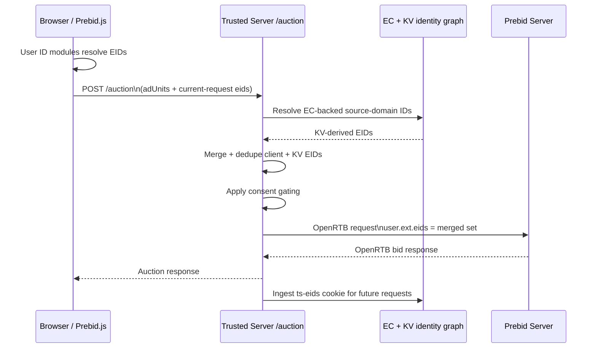

# Prebid Integration

**Category**: Demand Wrapper
**Status**: Production
**Type**: Header Bidding

## Overview

The Prebid integration enables server-side header bidding through Prebid Server while maintaining first-party context and privacy compliance.

## What is Prebid?

Prebid is the leading open-source header bidding solution that allows publishers to offer ad inventory to multiple demand sources simultaneously, maximizing revenue through competition.

## Configuration

```toml
[integrations.prebid]
enabled = true
server_url = "https://prebid-server.example.com/openrtb2/auction"
timeout_ms = 1200
bidders = ["kargo", "appnexus", "openx"]
debug = false
# test_mode = false

# Generated external Prebid bundle served through /integrations/prebid/bundle.js.
external_bundle_url = "https://assets.example/prebid/trusted-prebid.js"
# external_bundle_sha256 = "..."
# external_bundle_sri = "sha384-..."

# Bidders that run client-side via native Prebid.js adapters instead of
# being routed through the server-side auction.
client_side_bidders = ["rubicon"]

# Script interception patterns (optional - defaults shown below)
script_patterns = ["/prebid.js", "/prebid.min.js", "/prebidjs.js", "/prebidjs.min.js"]

# Required when external_bundle_url is configured. Include the bundle host and
# any HTTPS redirect targets used by that host.
[proxy]
allowed_domains = ["assets.example"]

# External bundle generation inputs used by `ts prebid bundle`.
[integrations.prebid.bundle]
adapters = ["rubicon"]
user_id_modules = ["sharedIdSystem"]

# Optional static per-bidder param overrides (shallow merge)
[integrations.prebid.bid_param_overrides.criteo]
networkId = 99999
pubid = "server-pub"

# Optional per-bidder, per-zone param overrides (shallow merge)
[integrations.prebid.bid_param_zone_overrides.kargo]
header       = {placementId = "_s2sHeaderPlacement"}
in_content   = {placementId = "_s2sContentPlacement"}

# Optional canonical ordered override rules
[[integrations.prebid.bid_param_override_rules]]
when.bidder = "kargo"
when.zone = "header"
set = { placementId = "_s2sHeaderPlacement" }
```

### Configuration Options

| Field                      | Type          | Default                                                                | Description                                                                                                                                                      |
| -------------------------- | ------------- | ---------------------------------------------------------------------- | ---------------------------------------------------------------------------------------------------------------------------------------------------------------- |
| `enabled`                  | Boolean       | `true`                                                                 | Enable Prebid integration                                                                                                                                        |
| `server_url`               | String        | Required                                                               | Prebid Server endpoint URL                                                                                                                                       |
| `timeout_ms`               | Integer       | `1000`                                                                 | Request timeout in milliseconds                                                                                                                                  |
| `bidders`                  | Array[String] | `["mocktioneer"]`                                                      | List of enabled bidders                                                                                                                                          |
| `external_bundle_url`      | String        | Required when enabled                                                  | Absolute HTTPS URL of the generated external Prebid bundle, proxied through `/integrations/prebid/bundle.js`; its host must be listed in `proxy.allowed_domains` |
| `external_bundle_sha256`   | String        | `None`                                                                 | Optional 64-character hex SHA-256 used for versioned first-party URLs, immutable cache headers, and `sha256:` ETags                                              |
| `external_bundle_sri`      | String        | `None`                                                                 | Optional Subresource Integrity metadata added to the same-origin bundle script tag when configured                                                               |
| `bid_param_overrides`      | Table         | `{}`                                                                   | Static per-bidder param overrides; normalized into the canonical override-rule engine and shallow-merged into bidder params                                      |
| `bid_param_zone_overrides` | Table         | `{}`                                                                   | Per-bidder, per-zone param overrides; normalized into the canonical override-rule engine and shallow-merged into bidder params                                   |
| `bid_param_override_rules` | Array[Table]  | `[]`                                                                   | Canonical ordered override rules with `when` matchers and `set` objects; evaluated after compatibility fields so later rules win on conflicts                    |
| `debug`                    | Boolean       | `false`                                                                | Enable Prebid debug mode (sets `ext.prebid.debug` and `ext.prebid.returnallbidstatus`; surfaces debug metadata in auction responses)                             |
| `test_mode`                | Boolean       | `false`                                                                | Set the OpenRTB `test: 1` flag so bidders treat the auction as non-billable test traffic. Separate from `debug` to avoid suppressing real demand                 |
| `debug_query_params`       | String        | `None`                                                                 | Extra query params appended for debugging                                                                                                                        |
| `client_side_bidders`      | Array[String] | `[]`                                                                   | Bidders that run client-side via native Prebid.js adapters instead of server-side. See [Client-Side Bidders](#client-side-bidders)                               |
| `script_patterns`          | Array[String] | `["/prebid.js", "/prebid.min.js", "/prebidjs.js", "/prebidjs.min.js"]` | URL patterns for Prebid script interception                                                                                                                      |
| `bundle.adapters`          | Array[String] | Required for `ts prebid bundle`                                        | Prebid.js bidder adapter modules imported into the generated external browser bundle                                                                             |
| `bundle.user_id_modules`   | Array[String] | Generator default preset when omitted                                  | Prebid User ID modules imported into the generated external browser bundle                                                                                       |

## External Bundle Generation

Use `ts prebid bundle` to build the publisher-specific browser bundle from
`[integrations.prebid.bundle]` selections:

```bash
ts prebid bundle
```

The command writes generated artifacts to `dist/prebid/` by default and updates
`external_bundle_sha256` and `external_bundle_sri` in `trusted-server.toml` from
the generated manifest. Upload the generated JavaScript file manually, set
`external_bundle_url` to the hosted HTTPS asset URL, and include that host (plus
any redirect targets) in `proxy.allowed_domains` before running
`ts config validate` or `ts config push`.

## Debug Mode

When `debug = true`, the Prebid integration enables additional diagnostics on both the outgoing OpenRTB request and the incoming response.

### Outgoing request flags

| OpenRTB field                   | Value  | Purpose                                                                                             |
| ------------------------------- | ------ | --------------------------------------------------------------------------------------------------- |
| `ext.prebid.debug`              | `true` | Tells Prebid Server to include `ext.debug` in the response (httpcalls, resolvedrequest)             |
| `ext.prebid.returnallbidstatus` | `true` | Asks Prebid Server to return per-bid status for every bidder, including those that returned no bids |

### Response metadata enrichment

The Prebid provider extracts metadata from the Prebid Server response and attaches it to the `AuctionResponse.metadata` map:

**Always-on fields** (present regardless of `debug`):

| Key                  | Source                   | Description                    |
| -------------------- | ------------------------ | ------------------------------ |
| `responsetimemillis` | `ext.responsetimemillis` | Per-bidder response times (ms) |
| `errors`             | `ext.errors`             | Per-bidder error diagnostics   |
| `warnings`           | `ext.warnings`           | Per-bidder warning diagnostics |

**Debug-only fields** (only when `debug = true`):

| Key         | Source                 | Description                                              |
| ----------- | ---------------------- | -------------------------------------------------------- |
| `debug`     | `ext.debug`            | Prebid Server debug payload (httpcalls, resolvedrequest) |
| `bidstatus` | `ext.prebid.bidstatus` | Per-bid status from every invited bidder                 |

::: warning
Enabling `debug` increases response sizes and adds overhead. Use it in development or when diagnosing auction issues — not in production.
:::

### Test mode vs. debug

`test_mode` and `debug` are independent flags:

- **`debug`** — Enables diagnostic data without affecting bidder behavior. Bidders still treat the auction as live.
- **`test_mode`** — Sets the top-level OpenRTB `test: 1` flag. Bidders treat the request as non-billable test traffic, which can significantly reduce fill rates.

You can combine both to get debug diagnostics on test traffic, or use `debug` alone to inspect live auctions without affecting revenue.

## Features

### Server-Side Header Bidding

Move header bidding to the server for:

- Faster page loads (reduce browser JavaScript)
- Better mobile performance
- Reduced client-side latency
- Improved user experience

### OpenRTB 2.6 Support

Full OpenRTB protocol conversion:

- Converts ad units to OpenRTB `imp` objects
- Injects publisher domain and page URL
- Adds EC ID for privacy-safe tracking
- Supports banner formats (video and native are currently not emitted by the Prebid provider)

### EC ID Injection

Automatically injects privacy-preserving EC ID into bid requests for user recognition without cookies.

### Request Signing

Optional Ed25519 request signing for bid request authentication and fraud prevention.

### Script Interception

The `script_patterns` configuration controls which publisher-provided Prebid scripts are intercepted and replaced with empty JavaScript. Trusted Server always injects its managed first-party `/integrations/prebid/bundle.js` script for the configured external bundle, so interception prevents duplicate Prebid instances.

**Pattern Matching**:

- **Suffix matching**: `/prebid.min.js` matches any URL ending with that path
- **Wildcard patterns**: `/static/prebid/*` matches paths under that prefix (filtered by known Prebid script suffixes)
- **Case-insensitive**: All patterns are matched case-insensitively

**Examples**:

```toml
# Default patterns (intercept common Prebid scripts)
script_patterns = ["/prebid.js", "/prebid.min.js"]

# Custom CDN path with wildcard
script_patterns = ["/static/prebid/*", "/assets/js/prebid.min.js"]

# Disable script interception (not recommended; may duplicate the managed bundle)
script_patterns = []
```

When a request matches a script pattern, Trusted Server returns an empty JavaScript file with aggressive caching (`max-age=31536000`).

### Bid Param Overrides

Use `bid_param_overrides` for static per-bidder param overrides when the same override should apply regardless of ad zone.

**Behavior**:

- Overrides are matched by bidder name only
- Override params are shallow-merged into incoming bidder params
- Override values win on key conflicts
- Unrelated incoming fields are preserved
- These compatibility entries are normalized into the same runtime engine as `bid_param_override_rules`

**Example**:

```toml
[integrations.prebid.bid_param_overrides.criteo]
networkId = 99999
pubid = "server-pub"
```

**Environment variable**:

```text
TRUSTED_SERVER__INTEGRATIONS__PREBID__BID_PARAM_OVERRIDES='{"criteo":{"networkId":99999,"pubid":"server-pub"}}'
```

### Bid Param Zone Overrides

Use `bid_param_zone_overrides` for per-zone, per-bidder param overrides. This is designed for bidders like Kargo that use different server-to-server placement IDs per ad zone.

The JS adapter reads the zone from `mediaTypes.banner.name` on each Prebid ad unit (e.g., `"header"`, `"in_content"`, `"fixed_bottom"`) and sends it alongside the bidder params. The server then uses this zone to look up the correct override. When `mediaTypes.banner.name` is not set, no zone is sent and zone overrides are skipped for that impression.

**Behavior**:

- Overrides are matched by bidder name + zone combination
- Override params are shallow-merged into incoming bidder params (override values win on key conflicts)
- Non-conflicting incoming fields are preserved
- When no zone override matches (unknown zone or missing zone), incoming params are left unchanged
- These compatibility entries are normalized into the same runtime engine as `bid_param_override_rules`

**Example**:

```toml
[integrations.prebid.bid_param_zone_overrides.kargo]
header       = {placementId = "_s2sHeaderPlacement"}
in_content   = {placementId = "_s2sContentPlacement"}
fixed_bottom = {placementId = "_s2sBottomPlacement"}
```

If the incoming request for zone `header` has:

```json
{ "kargo": { "placementId": "client_side_abc" } }
```

the outgoing bidder params become:

```json
{ "kargo": { "placementId": "_s2sHeaderPlacement" } }
```

For an unrecognised zone (e.g., `sidebar`), the incoming params are left unchanged.

**Environment variable**:

```text
TRUSTED_SERVER__INTEGRATIONS__PREBID__BID_PARAM_ZONE_OVERRIDES='{"kargo":{"header":{"placementId":"_s2sHeaderPlacement"}}}'
```

### Bid Param Override Rules

Use `bid_param_override_rules` for the canonical ordered override format. Each rule contains exact-match `when` conditions and a non-empty `set` object that is shallow-merged into bidder params when all populated matchers match.

**Behavior**:

- Rules can match on `when.bidder`, `when.zone`, or both
- Matching is exact and case-sensitive — `when.bidder = "Kargo"` will not match a runtime bidder named `kargo`
- Rules are evaluated in declaration order
- Later matching rules win on overlapping keys
- Compatibility fields from `bid_param_overrides` and `bid_param_zone_overrides` are normalized into earlier rules, so explicit canonical rules take precedence on conflicts
- Within compat fields, `bid_param_overrides` is normalized before `bid_param_zone_overrides`, so zone overrides win on overlapping keys when both fields target the same bidder
- `set` values may be `null`; `null` is inserted into outgoing bidder params wholesale — behavior varies by PBS adapter, so verify adapter handling before relying on this. Note: TOML has no null literal — null values are only reachable via the env-var JSON shape (e.g. `[{"when":{"bidder":"kargo"},"set":{"placementId":null}}]`)

**Example**:

```toml
[[integrations.prebid.bid_param_override_rules]]
when.bidder = "kargo"
when.zone = "header"
set = { placementId = "_s2sHeaderPlacement", keep = "server" }
```

**Environment variable**:

```text
TRUSTED_SERVER__INTEGRATIONS__PREBID__BID_PARAM_OVERRIDE_RULES='[{"when":{"bidder":"kargo","zone":"header"},"set":{"placementId":"_s2sHeaderPlacement","keep":"server"}}]'
```

## Client-Side Bidders

Some Prebid.js bid adapters do not work well through Prebid Server (e.g. Magnite/Rubicon). The `client_side_bidders` config field lets you keep these bidders running natively in the browser while routing all other bidders through the server-side auction.

### How it works

1. The server injects the `clientSideBidders` list into the page via `window.__tsjs_prebid`.
2. When `pbjs.requestBids()` is called, the TSJS shim checks each bid against the list.
3. **Client-side bidders** are left as standalone bids — their native Prebid.js adapters handle them in the browser.
4. **All other bidders** are absorbed into the `trustedServer` adapter and routed through the `/auction` orchestrator to Prebid Server.
5. Both sets of bids compete in the same Prebid.js auction.

### Configuration

```toml
[integrations.prebid]
bidders = ["kargo", "appnexus", "openx"]    # server-side via PBS
client_side_bidders = ["rubicon"]             # native browser adapters
```

The two lists are independent — the operator manages both explicitly. If a bidder appears in both lists, a warning is logged at startup (the bidder will run in both paths, which is likely unintended).

### External bundle adapter selection

Client-side bidders need their Prebid.js adapter modules included in the generated external bundle:

```bash
cd crates/trusted-server-js/lib
npm run build:prebid-external -- \
  --adapters=rubicon,appnexus,openx \
  --user-id-modules=sharedIdSystem,uid2IdSystem \
  --out=dist/prebid
```

The generator validates that each adapter exists in `prebid.js/modules/{name}BidAdapter.js`, writes a content-addressed bundle plus `manifest.json`, and reports the SHA-256 and SRI values to copy into `integrations.prebid` config. At runtime, TSJS validates that every bidder in `client_side_bidders` has a registered adapter and logs an error if one is missing.

::: warning
Adding a new client-side bidder requires both a config change (`client_side_bidders`) **and** a regenerated external bundle with the adapter included in `--adapters`. Without the adapter in the bundle, the bidder is silently dropped from both server-side and client-side auctions.
:::

## User ID Modules

Prebid.js can expose publisher-configured User ID Module output via
`pbjs.getUserIdsAsEids()`. The TSJS Prebid shim reads those current-request
EIDs after auctions and forwards them to Trusted Server when they are available.

User ID submodule inclusion is selected by the external bundle generator. The
available modules and default preset are checked in at
`crates/trusted-server-js/lib/src/integrations/prebid/user_id_modules.json`. Pass
`--user-id-modules` to `build-prebid-external.mjs` when a publisher needs a
specific subset; omit it to use the default preset.

This is deliberate: Trusted Server injects a generated Prebid.js bundle so we
can install the `trustedServer` adapter and route auctions through `/auction`,
but publishers often need different User ID submodules. Moving that selection to
the external bundle keeps publisher-specific Prebid choices out of the Trusted
Server WASM artifact while preserving a manifest and bundle hash for auditing.

The current preset includes common ID modules such as Yahoo ConnectID, Criteo,
LiveIntent, SharedID, UID2, ID5, LiveRamp IdentityLink, PubProvidedID, and
Unified ID / TDID. LiveIntent is imported through a local ESM shim because the
public Prebid wrapper contains a CommonJS `require(...)` mode switch that is not
safe for the TSJS IIFE bundle.

Example EID source mapping:

| EID source                                                        | Included module        |
| ----------------------------------------------------------------- | ---------------------- |
| `yahoo.com`                                                       | `connectIdSystem`      |
| `criteo.com`                                                      | `criteoIdSystem`       |
| `liveintent.com`, `bidswitch.net`, `openx.net`, `pubmatic.com`, … | `liveIntentIdSystem`   |
| `pubcid.org`                                                      | `sharedIdSystem`       |
| `adserver.org` with `rtiPartner = TDID`                           | `unifiedIdSystem`      |
| `uidapi.com`                                                      | `uid2IdSystem`         |
| `id5-sync.com`                                                    | `id5IdSystem`          |
| `liveramp.com`                                                    | `identityLinkIdSystem` |

User ID module selection is separate from `--adapters`, which controls
client-side bidder adapter modules.

## Identity Forwarding

Trusted Server uses a **hybrid EID forwarding model** for Prebid-routed auctions:

1. **Current-request EIDs from Prebid.js** are read from `pbjs.getUserIdsAsEids()` in the browser and sent in the `/auction` request body.
2. **Server-side EIDs from the EC/KV identity graph** are resolved on the edge from the current EC ID.
3. Trusted Server **merges and deduplicates** both sets before calling Prebid Server.
4. The merged result is forwarded downstream as `user.ext.eids` in the OpenRTB request.
5. The `ts-eids` cookie is still ingested after the response so later requests can reuse the IDs even when the current auction does not provide them again.

This means Prebid auctions get same-request transparency for browser-resolved IDs without giving up the durability of the server-managed EC identity graph.

### Identity flow



### Merge and deduplication rules

- Client-request EIDs and KV-resolved EIDs are merged by `source`
- UIDs are deduplicated by `source + id`
- If the same UID appears in both places, it is sent only once downstream
- Distinct UIDs under the same source are preserved
- Consent gating is applied to the **merged** set before forwarding

### What reaches Prebid Server

The downstream Prebid Server request includes:

- `user.id` when EC forwarding is allowed
- `user.ext.eids` containing the merged, deduplicated EID set
- forwarded browser cookies (subject to consent-forwarding mode)

In practice, this gives operators both:

- **same-request identity transparency** for Prebid User ID Module output, and
- **future-request continuity** through cookie ingestion and KV-backed partner resolution.

## Endpoints

### GET /first-party/ad

Server-side ad rendering for single ad slot.

**Query Parameters**:

- `slot` - Ad unit code
- `w` - Width in pixels
- `h` - Height in pixels

**Response**: Complete HTML creative with first-party proxying.

### POST /third-party/ad

Client-side auction endpoint for TSJS library.

**Request Body**: Ad units configuration
**Response**: OpenRTB bid response with creatives

### GET `<script_patterns>` (Dynamic)

Routes are registered dynamically based on the `script_patterns` configuration. Each pattern creates an endpoint that returns an empty JavaScript file to prevent client-side Prebid.js loading.

Default registered routes:

- `GET /prebid.js`
- `GET /prebid.min.js`
- `GET /prebidjs.js`
- `GET /prebidjs.min.js`

Set `script_patterns = []` to disable these routes entirely.

## Use Cases

### Pure Server-Side Header Bidding

Replace client-side Prebid.js entirely with server-side auctions for maximum performance.

### Hybrid Client + Server

Use server-side for primary demand and `client_side_bidders` for adapters that don't work well with Prebid Server (e.g. Magnite/Rubicon). See [Client-Side Bidders](#client-side-bidders) for configuration details.

### Mobile-First Monetization

Optimize mobile ad serving with reduced JavaScript overhead.

## Implementation

See [crates/trusted-server-core/src/integrations/prebid.rs](https://github.com/IABTechLab/trusted-server/blob/main/crates/trusted-server-core/src/integrations/prebid.rs) for full implementation.

### Key Components

- **`PrebidIntegration`**: Handles script interception and HTML attribute rewriting to remove Prebid script references
- **`PrebidAuctionProvider`**: Implements the `AuctionProvider` trait for the auction orchestrator

### OpenRTB Request Construction

The `to_openrtb()` method in `PrebidAuctionProvider` builds OpenRTB requests:

- Converts ad slots to OpenRTB `imp` objects with bidder params
- Sets bid floor and currency (`bidfloor`/`bidfloorcur`) from slot configuration
- Marks impressions as `secure: 1` (HTTPS-only creatives)
- Sets `tagid` from the slot ID
- Adds site metadata with publisher domain, page URL, `site.ref` from the Referer header, and `site.publisher` from the domain
- Injects EC ID in the user object
- Merges current-request browser EIDs with KV-resolved EIDs and forwards the deduplicated result as `user.ext.eids`
- Forwards user consent string and sets the GDPR flag based on geo and consent presence
- Translates the `Sec-GPC` header to a US Privacy string (`us_privacy`)
- Extracts `DNT` and `Accept-Language` headers into device fields
- Includes device info (user-agent, client IP) and geo (lat/lon/metro) when available
- Sets `tmax` from the configured timeout and `cur` to `["USD"]`
- Sets `ext.prebid.debug` and `ext.prebid.returnallbidstatus` when `debug` is enabled
- Sets the top-level `test: 1` flag when `test_mode` is enabled
- Appends `debug_query_params` to page URL when configured
- Applies `bid_param_overrides`, `bid_param_zone_overrides`, and `bid_param_override_rules` via the unified override engine before request dispatch
- Signs requests when request signing is enabled

## Best Practices

1. **Configure Timeouts**: Set `timeout_ms` based on your latency requirements
2. **Select Bidders**: Enable only bidders you have direct relationships with
3. **Monitor Performance**: Track bid response times and fill rates
4. **Test Thoroughly**: Validate bid requests in debug mode before production

## Next Steps

- Review [Ad Serving Guide](/guide/ad-serving) for general concepts
- Check [OpenRTB Support](/roadmap) on the roadmap for enhancements
- Explore [Request Signing](/guide/request-signing) for authentication
- Learn about [Edge Cookies](/guide/edge-cookies) for privacy-safe tracking
