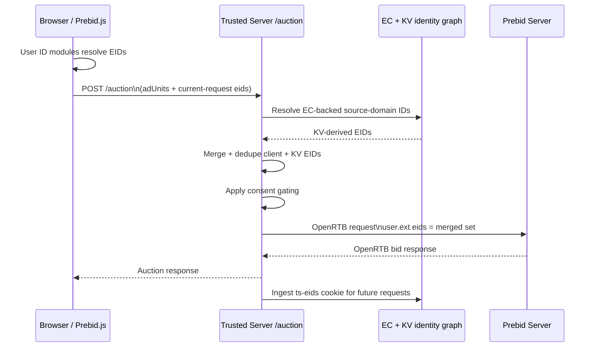

# Prebid Integration

**Category**: Demand Wrapper
**Status**: Production
**Type**: Header Bidding

## Overview

The Prebid integration enables server-side header bidding through Prebid Server while maintaining first-party context and applying publisher-configured consent enforcement.

## What is Prebid?

Prebid is the leading open-source header bidding solution that allows publishers to offer ad inventory to multiple demand sources simultaneously, maximizing revenue through competition.

## Configuration

Prebid configuration has two independent owners:

- `[integrations.prebid]` owns browser Prebid.js behavior: bundle selection and
  injection, browser timeout/debug, account injection, script interception,
  client-side bidders, and refresh exclusions.
- `[auction.providers.<id>]`, its `profile_config`, `notifications`, and
  `[auction.bidders]` own every Prebid Server request.

```toml
[integrations.prebid]
enabled = true
timeout_ms = 1000
debug = false
client_side_bidders = ["example-browser"]
excluded_gam_ad_unit_path_suffixes = ["/example-tracking-only"]
script_patterns = ["/prebid.js", "/prebid.min.js"]
external_bundle_url = "https://assets.example.com/prebid/trusted-prebid.js"
# external_bundle_sha256 = "<fictional sha256>"
# external_bundle_sri = "sha384-<fictional digest>"

[integrations.prebid.bundle]
adapters = ["example-browser"]
user_id_modules = ["sharedIdSystem"]

[proxy]
allowed_domains = ["assets.example.com"]

[auction]
enabled = true
timeout_ms = 2000

[auction.providers.pbs-main]
protocol = "openrtb-2.6"
profile = "prebid-server"
endpoint = "https://prebid.example.com/openrtb2/auction"
timeout_ms = 900
routing = "explicit"

[auction.providers.pbs-main.profile_config]
debug = false
test_mode = false
debug_query_params = "example-debug=1"
consent_forwarding = "both"
bid_param_overrides = { example-server = { placement = "example-placement" } }
bid_param_zone_overrides = { example-server = { header = { placement = "example-header" } } }

[[auction.providers.pbs-main.profile_config.bid_param_override_rules]]
when.bidder = "example-server"
when.zone = "header"
set = { placement = "example-rule-placement" }

[auction.providers.pbs-main.notifications]
suppress_all = false
suppress_seats = ["example-seat"]

[auction.bidders.example-server]
provider = "pbs-main"
```

### Browser configuration options

| Field                                | Default                                                                | Ownership and behavior                                                              |
| ------------------------------------ | ---------------------------------------------------------------------- | ----------------------------------------------------------------------------------- |
| `enabled`                            | `true`                                                                 | Enables browser bundle injection/interception; it does not create a server provider |
| `account_id`                         | `None`                                                                 | Optional browser-injected account value                                             |
| `timeout_ms`                         | `1000`                                                                 | Browser Prebid.js timeout only                                                      |
| `debug`                              | `false`                                                                | Browser Prebid.js debug only                                                        |
| `client_side_bidders`                | `[]`                                                                   | Native browser adapters that are not folded into `trustedServer`                    |
| `excluded_gam_ad_unit_path_suffixes` | `[]`                                                                   | GAM suffixes omitted from Trusted Server refresh auctions                           |
| `script_patterns`                    | `["/prebid.js", "/prebid.min.js", "/prebidjs.js", "/prebidjs.min.js"]` | Publisher Prebid scripts intercepted to prevent duplicate instances                 |
| `external_bundle_url`                | Required when enabled                                                  | HTTPS generated bundle URL; host and redirects must be in `proxy.allowed_domains`   |
| `external_bundle_sha256`             | `None`                                                                 | Optional content hash used for versioning, cache policy, and ETag                   |
| `external_bundle_sri`                | `None`                                                                 | Optional SRI metadata                                                               |
| `bundle.adapters`                    | Required for `ts prebid bundle`                                        | Browser bidder adapters compiled into the external bundle                           |
| `bundle.user_id_modules`             | Generator preset                                                       | Browser User ID modules compiled into the external bundle                           |

### Server provider options

Common fields are `protocol`, `profile`, required HTTPS `endpoint`, optional
`timeout_ms`, and `routing`. The `prebid-server` timeout defaults to 1000 ms;
an explicit provider value overrides it, and the remaining auction budget caps
runtime `tmax`.

When migrating an origin-only legacy `server_url`, use that origin as the
provider `endpoint`. The compiler adds `/openrtb2/auction` and preserves query
parameters. A configured non-root path, such as `/bid` or `/custom/pbs`, stays
exact. `/openrtb2/auction/` is normalized to `/openrtb2/auction`.

The typed `profile_config` fields are:

| Field                      | Default | Behavior                                            |
| -------------------------- | ------- | --------------------------------------------------- |
| `debug`                    | `false` | PBS request/response diagnostics                    |
| `test_mode`                | `false` | Top-level OpenRTB `test: 1`; independent of debug   |
| `debug_query_params`       | `None`  | Optional page-URL debug query fragment              |
| `bid_param_overrides`      | `{}`    | Static per-bidder shallow merges                    |
| `bid_param_zone_overrides` | `{}`    | Per-bidder/per-zone shallow merges                  |
| `bid_param_override_rules` | `[]`    | Ordered exact-match rules; later matching rules win |
| `consent_forwarding`       | `both`  | `openrtb_only`, `cookies_only`, or `both`           |

`notifications.suppress_all` replaces the old global notification switch.
`notifications.suppress_seats` removes `nurl` and `burl` only for exact returned
`seatbid.seat` values. It does not match bidder route IDs. See
[Configuration](/guide/configuration#auction-configuration) for bounds.

### Browser/server bidder ownership

Every server-side bidder code comes from `[auction.bidders.<code>]`; the browser
integration has no server bidder list. The validated route keys are injected as
`serverSideBidders`. On initial and refresh auctions, only matching publisher
bids are folded into the `trustedServer.bidderParams` envelope. Configured
`client_side_bidders` and other unowned demand remain native browser bids. Both
paths compete in the same Prebid.js auction.

The reserved `trustedServer` envelope cannot select a provider or endpoint. Its
nested bidder keys resolve through `[auction.bidders]`, and one envelope accepts
at most 128 bidder entries. The optional `zone` fact is limited to 256 UTF-8
bytes. Missing, `null`, or empty `bidderParams` invokes Prebid stored-request
routing; malformed envelopes do not.

Browser `timeout_ms`/`debug` never inherit a server provider timeout or profile
debug value. Enabling the browser integration does not create a server provider,
and a `prebid-server` provider can exist independently from browser injection.

## External Bundle Generation

Use `ts prebid bundle` to build the publisher-specific browser bundle from
`[integrations.prebid.bundle]` selections:

```bash
ts prebid bundle
```

The command writes generated artifacts to `dist/prebid/` by default and updates
`external_bundle_sha256` and `external_bundle_sri` in `trusted-server.toml` from
the generated manifest. Upload the generated JavaScript file manually, set
`external_bundle_url` to the hosted HTTPS asset URL, and include that host (plus
any redirect targets) in `proxy.allowed_domains` before running
`ts config validate` or `ts config push`.

The generated bundle is pure Prebid.js — core, consent modules, User ID
modules, and the selected bid adapters. The Trusted Server shim
(`tsjs-prebid`) is served separately by the server as a deferred script and
installs itself onto the `window.pbjs` global the bundle populates. The two
artifacts ship in lockstep: a bundle generated before the shim was split out
still carries a baked-in copy of the shim, so upgrading the server requires
regenerating and re-uploading the bundle (and pushing the updated
`external_bundle_sha256`/`external_bundle_sri` config) as part of the same
rollout. The shim refuses to install twice on one page via the
`window.__tsjsPrebidShimInstalled` sentinel.

## Debug Mode

When `debug = true`, the Prebid integration enables additional diagnostics on both the outgoing OpenRTB request and the incoming response.

### Outgoing request flags

| OpenRTB field                   | Value  | Purpose                                                                                             |
| ------------------------------- | ------ | --------------------------------------------------------------------------------------------------- |
| `ext.prebid.debug`              | `true` | Tells Prebid Server to include `ext.debug` in the response (httpcalls, resolvedrequest)             |
| `ext.prebid.returnallbidstatus` | `true` | Asks Prebid Server to return per-bid status for every bidder, including those that returned no bids |

### Response metadata enrichment

The Prebid provider extracts metadata from the Prebid Server response and attaches it to the `AuctionResponse.metadata` map:

**Always-on fields** (present regardless of `debug`):

| Key                  | Source                   | Description                    |
| -------------------- | ------------------------ | ------------------------------ |
| `responsetimemillis` | `ext.responsetimemillis` | Per-bidder response times (ms) |
| `errors`             | `ext.errors`             | Per-bidder error diagnostics   |
| `warnings`           | `ext.warnings`           | Per-bidder warning diagnostics |

**Debug-only fields** (only when `debug = true`):

| Key         | Source                 | Description                                              |
| ----------- | ---------------------- | -------------------------------------------------------- |
| `debug`     | `ext.debug`            | Prebid Server debug payload (httpcalls, resolvedrequest) |
| `bidstatus` | `ext.prebid.bidstatus` | Per-bid status from every invited bidder                 |

### Upstream HTTP errors

When Prebid Server returns a non-2xx status, the provider detail always includes a safe error classification, HTTP status, and generic message:

```json
{
  "error_type": "http_status",
  "http_status": 400,
  "message": "Prebid Server returned HTTP 400"
}
```

With `debug = true`, Trusted Server also extracts the first error message from allowlisted JSON fields (`message`, `error`, `errors`, `detail`, `title`, or `reason`) or a plain-text response. The message is normalized to one line and limited to 500 characters:

```json
{
  "error_type": "http_status",
  "http_status": 400,
  "message": "Prebid Server returned HTTP 400",
  "upstream_message": "Invalid request: imp[0] has no valid bidders",
  "upstream_message_truncated": false
}
```

HTML error pages and unrecognized JSON payloads are not exposed. Debug mode also writes a bounded error-body preview to `tslog`, correlated with the auction ID.

::: warning
Enabling `debug` increases response sizes and adds overhead. It can also expose bounded upstream diagnostics to `/auction` callers and logs. Use it temporarily when diagnosing auction issues, not as a permanent production setting.
:::

### Test mode vs. debug

`test_mode` and `debug` are independent flags:

- **`debug`** — Enables diagnostic data without affecting bidder behavior. Bidders still treat the auction as live.
- **`test_mode`** — Sets the top-level OpenRTB `test: 1` flag. Bidders treat the request as non-billable test traffic, which can significantly reduce fill rates.

You can combine both to get debug diagnostics on test traffic, or use `debug` alone to inspect live auctions without affecting revenue.

## Features

### Server-Side Header Bidding

Move header bidding to the server for:

- Faster page loads (reduce browser JavaScript)
- Better mobile performance
- Reduced client-side latency
- Improved user experience

### OpenRTB 2.6 Support

Full OpenRTB protocol conversion:

- Converts ad units to OpenRTB `imp` objects
- Injects publisher domain and page URL
- Injects EC ID into bid requests for user recognition
- Supports banner formats (video and native are currently not emitted by the Prebid provider)

### EC ID Injection

Automatically injects EC ID into bid requests for user recognition via first-party context.

### Request Signing

Optional Ed25519 request signing for bid request authentication and fraud prevention.

### Script Interception

The `script_patterns` configuration controls which publisher-provided Prebid scripts are intercepted and replaced with empty JavaScript. Trusted Server always injects its managed first-party `/integrations/prebid/bundle.js` script for the configured external bundle, so interception prevents duplicate Prebid instances.

**Pattern Matching**:

- **Suffix matching**: `/prebid.min.js` matches any URL ending with that path
- **Wildcard patterns**: `/static/prebid/*` matches paths under that prefix (filtered by known Prebid script suffixes)
- **Case-insensitive**: All patterns are matched case-insensitively

**Examples**:

```toml
# Default patterns (intercept common Prebid scripts)
script_patterns = ["/prebid.js", "/prebid.min.js"]

# Custom CDN path with wildcard
script_patterns = ["/static/prebid/*", "/assets/js/prebid.min.js"]

# Disable script interception (not recommended; may duplicate the managed bundle)
script_patterns = []
```

When a request matches a script pattern, Trusted Server returns an empty JavaScript file with aggressive caching (`max-age=31536000`).

### Bid Param Overrides

Use `bid_param_overrides` for static per-bidder param overrides when the same override should apply regardless of ad zone.

**Behavior**:

- Overrides are matched by bidder name only
- Override params are shallow-merged into incoming bidder params
- Override values win on key conflicts
- Unrelated incoming fields are preserved
- These compatibility entries are normalized into the same runtime engine as `bid_param_override_rules`

**Example**:

```toml
[auction.providers.pbs-main.profile_config.bid_param_overrides.example-server]
networkId = 99999
pubid = "example-server-pub"
```

**Environment variable**:

```text
TRUSTED_SERVER__AUCTION__PROVIDERS__PBS-MAIN__PROFILE_CONFIG__BID_PARAM_OVERRIDES='{"example-server":{"networkId":99999,"pubid":"example-server-pub"}}'
```

### Bid Param Zone Overrides

Use `bid_param_zone_overrides` for per-zone, per-bidder param overrides. This is designed for bidders like Kargo that use different server-to-server placement IDs per ad zone.

The JS adapter reads the zone from `mediaTypes.banner.name` on each Prebid ad unit (e.g., `"header"`, `"in_content"`, `"fixed_bottom"`) and sends it alongside the bidder params. The server then uses this zone to look up the correct override. When `mediaTypes.banner.name` is not set, no zone is sent and zone overrides are skipped for that impression.

**Behavior**:

- Overrides are matched by bidder name + zone combination
- Override params are shallow-merged into incoming bidder params (override values win on key conflicts)
- Non-conflicting incoming fields are preserved
- When no zone override matches (unknown zone or missing zone), incoming params are left unchanged
- These compatibility entries are normalized into the same runtime engine as `bid_param_override_rules`

**Example**:

```toml
[auction.providers.pbs-main.profile_config.bid_param_zone_overrides.example-server]
header = { placementId = "example-header-placement" }
in_content = { placementId = "example-content-placement" }
fixed_bottom = { placementId = "example-bottom-placement" }
```

If the incoming request for zone `header` has:

```json
{ "kargo": { "placementId": "client_side_abc" } }
```

the outgoing bidder params become:

```json
{ "kargo": { "placementId": "_s2sHeaderPlacement" } }
```

For an unrecognized zone (e.g., `sidebar`), the incoming params are left unchanged.

**Environment variable**:

```text
TRUSTED_SERVER__AUCTION__PROVIDERS__PBS-MAIN__PROFILE_CONFIG__BID_PARAM_ZONE_OVERRIDES='{"example-server":{"header":{"placementId":"example-header-placement"}}}'
```

### Bid Param Override Rules

Use `bid_param_override_rules` for the canonical ordered override format. Each rule contains exact-match `when` conditions and a non-empty `set` object that is shallow-merged into bidder params when all populated matchers match.

**Behavior**:

- Rules can match on `when.bidder`, `when.zone`, or both
- Matching is exact and case-sensitive — `when.bidder = "Kargo"` will not match a runtime bidder named `kargo`
- Rules are evaluated in declaration order
- Later matching rules win on overlapping keys
- Compatibility fields from `bid_param_overrides` and `bid_param_zone_overrides` are normalized into earlier rules, so explicit canonical rules take precedence on conflicts
- Within compat fields, `bid_param_overrides` is normalized before `bid_param_zone_overrides`, so zone overrides win on overlapping keys when both fields target the same bidder
- `set` values may be `null`; `null` is inserted into outgoing bidder params wholesale — behavior varies by PBS adapter, so verify adapter handling before relying on this. Note: TOML has no null literal — null values are only reachable via the env-var JSON shape (e.g. `[{"when":{"bidder":"kargo"},"set":{"placementId":null}}]`)

**Example**:

```toml
[[auction.providers.pbs-main.profile_config.bid_param_override_rules]]
when.bidder = "example-server"
when.zone = "header"
set = { placementId = "example-header-placement", keep = "example" }
```

**Environment variable**:

```text
TRUSTED_SERVER__AUCTION__PROVIDERS__PBS-MAIN__PROFILE_CONFIG__BID_PARAM_OVERRIDE_RULES='[{"when":{"bidder":"example-server","zone":"header"},"set":{"placementId":"example-header-placement","keep":"example"}}]'
```

## Refresh Auction GAM-Path Opt-Out

Use `excluded_gam_ad_unit_path_suffixes` when a GAM slot must refresh for an
impression or measurement purpose but must not participate in Trusted Server's
Prebid refresh auction:

```toml
[integrations.prebid]
excluded_gam_ad_unit_path_suffixes = ["/trackingonly"]
```

Trusted Server reads each refreshed GPT slot's `getAdUnitPath()` and compares it to
the configured suffixes with an exact, case-sensitive `endsWith()` match. A matching
slot is omitted from the synthetic Prebid refresh ad units, but it remains in the
original GPT refresh call. In a mixed global refresh, normal display slots still
auction and receive refreshed Prebid targeting while excluded slots still refresh in
GAM. Because the original refresh is preserved as one GPT call, an excluded slot in
that mixed refresh waits for the auction to complete or the refresh watchdog to fire
(up to 1.5 seconds by default); an all-excluded refresh passes through immediately.

Each suffix must be a non-empty slash-prefixed path with no surrounding whitespace.
The root suffix (`"/"`) is rejected, as are suffixes without a leading slash; exact
duplicates are injected once. Matching is literal: paths are not case-normalized or
slash-normalized. Use a specific terminal GAM path segment, not a broad size rule or
div ID.

If GPT does not expose `getAdUnitPath()` for a slot or the getter fails, Trusted
Server fails open and runs the normal refresh auction. The option affects only this
Trusted Server GPT-refresh wrapper; it does not block direct publisher Prebid,
APS, or other auction flows.

The filter runs in the server-served `tsjs-prebid` shim, and the server injects its
suffix list into the same page. Deploy the updated Trusted Server application and
configuration together; this option does not require regenerating the external Prebid
bundle. Follow the [External Bundle Generation](#external-bundle-generation) migration
note only when upgrading a bundle generated before the shim split, or when changing
external Prebid adapters or User ID modules.

## Client-Side Bidders

The `client_side_bidders` config field keeps selected demand on native
Prebid.js adapters while validated `[auction.bidders]` routes identify demand
owned by Trusted Server.

### How it works

1. The server emits `clientSideBidders` as release-bound typed integration configuration; the module loader validates, freezes, and consumes it before committing the public API.
2. When `pbjs.requestBids()` is called, the Prebid adapter checks each bid against the immutable list.
3. **Client-side bidders** are left as standalone bids — their native Prebid.js adapters handle them in the browser.
4. **Bidders present in `[auction.bidders]`** are absorbed into the
   `trustedServer` adapter and routed through `/auction` to their configured
   provider. Unowned bidders remain native browser demand.
5. Both sets of bids compete in the same Prebid.js auction.

### Configuration

```toml
[integrations.prebid]
client_side_bidders = ["example-browser"]

[auction.bidders.example-server]
provider = "pbs-main"
```

Do not route the same bidder through `[auction.bidders]` while also listing it in
`client_side_bidders`; choose one owner. Include every client-side adapter in
the generated external bundle.

### External bundle adapter selection

Client-side bidders need their Prebid.js adapter modules included in the generated external bundle:

```bash
cd crates/trusted-server-js/lib
npm run build:prebid-external -- \
  --adapters=example-browser \
  --user-id-modules=sharedIdSystem,uid2IdSystem \
  --out=dist/prebid
```

The generator validates that each adapter exists in `prebid.js/modules/{name}BidAdapter.js`, writes a content-addressed bundle plus `manifest.json`, and reports the SHA-256 and SRI values to copy into `integrations.prebid` config. At runtime, TSJS validates that every bidder in `client_side_bidders` has a registered adapter and logs an error if one is missing.

::: warning
Adding a new client-side bidder requires both a config change (`client_side_bidders`) **and** a regenerated external bundle with the adapter included in `--adapters`. Without the adapter in the bundle, the bidder is silently dropped from both server-side and client-side auctions.
:::

## User ID Modules

Prebid.js can expose publisher-configured User ID Module output via
`pbjs.getUserIdsAsEids()`. The TSJS Prebid shim reads those current-request
EIDs after auctions and forwards them to Trusted Server when they are available.

User ID submodule inclusion is selected by the external bundle generator. The
available modules and default preset are checked in at
`crates/trusted-server-js/lib/src/integrations/prebid/user_id_modules.json`. Pass
`--user-id-modules` to `build-prebid-external.mjs` when a publisher needs a
specific subset; omit it to use the default preset.

This is deliberate: the external bundle is pure Prebid.js (core, consent and
User ID modules, and client-side bid adapters) while the server-served TSJS
prebid shim installs the `trustedServer` adapter onto `window.pbjs` and routes
auctions through `/auction` — but publishers often need different User ID
submodules. Moving that selection to the external bundle keeps
publisher-specific Prebid choices out of the Trusted Server WASM artifact while
preserving a manifest and bundle hash for auditing.

The current preset includes common ID modules such as Yahoo ConnectID, Criteo,
LiveIntent, SharedID, UID2, ID5, LiveRamp IdentityLink, PubProvidedID, and
Unified ID / TDID. LiveIntent is imported through a local ESM shim because the
public Prebid wrapper contains a CommonJS `require(...)` mode switch that is not
safe for the TSJS IIFE bundle.

Example EID source mapping:

| EID source                                                        | Included module        |
| ----------------------------------------------------------------- | ---------------------- |
| `yahoo.com`                                                       | `connectIdSystem`      |
| `criteo.com`                                                      | `criteoIdSystem`       |
| `liveintent.com`, `bidswitch.net`, `openx.net`, `pubmatic.com`, … | `liveIntentIdSystem`   |
| `pubcid.org`                                                      | `sharedIdSystem`       |
| `adserver.org` with `rtiPartner = TDID`                           | `unifiedIdSystem`      |
| `uidapi.com`                                                      | `uid2IdSystem`         |
| `id5-sync.com`                                                    | `id5IdSystem`          |
| `liveramp.com`                                                    | `identityLinkIdSystem` |

User ID module selection is separate from `--adapters`, which controls
client-side bidder adapter modules.

## Identity Forwarding

Trusted Server uses a **hybrid EID forwarding model** for Prebid-routed auctions:

1. **Current-request EIDs from Prebid.js** are read from `pbjs.getUserIdsAsEids()` in the browser and sent in the `/auction` request body.
2. **Server-side EIDs from the EC/KV identity graph** are resolved on the edge from the current EC ID.
3. Trusted Server **merges and deduplicates** both sets before calling Prebid Server.
4. The merged result is forwarded downstream as `user.ext.eids` in the OpenRTB request.
5. The `ts-eids` cookie is still ingested after the response so later requests can reuse the IDs even when the current auction does not provide them again.

This means Prebid auctions get same-request transparency for browser-resolved IDs without giving up the durability of the server-managed EC identity graph.

### Identity flow


```mermaid
sequenceDiagram
    participant B as Browser / Prebid.js
    participant T as Trusted Server /auction
    participant K as EC + KV identity graph
    participant P as Prebid Server

    B->>B: User ID modules resolve EIDs
    B->>T: POST /auction\n(adUnits + current-request eids)
    T->>K: Resolve EC-backed source-domain IDs
    K-->>T: KV-derived EIDs
    T->>T: Merge + dedupe client + KV EIDs
    T->>T: Apply consent gating
    T->>P: OpenRTB request\nuser.ext.eids = merged set
    P-->>T: OpenRTB bid response
    T-->>B: Auction response
    T->>K: Ingest ts-eids cookie for future requests
```

### Merge and deduplication rules

- Client-request EIDs and KV-resolved EIDs are merged by `source`
- UIDs are deduplicated by `source + id`
- If the same UID appears in both places, it is sent only once downstream
- Distinct UIDs under the same source are preserved
- Consent gating is applied to the **merged** set before forwarding

### What reaches Prebid Server

The downstream Prebid Server request includes:

- `user.id` when EC forwarding is allowed
- `user.ext.eids` containing the merged, deduplicated EID set
- forwarded browser cookies (subject to consent-forwarding mode)

In practice, this gives operators both:

- **same-request identity transparency** for Prebid User ID Module output, and
- **future-request continuity** through cookie ingestion and KV-backed partner resolution.

## Endpoints

### POST /auction

Browser and programmatic auction endpoint used by the Trusted Server Prebid adapter.

**Request Body**: Ad units configuration
**Response**: OpenRTB bid response with creatives

### GET /integrations/prebid/bundle.js

First-party proxy route for the configured `external_bundle_url`. An optional
`?v=<external_bundle_sha256>` query enables content-addressed caching.

### GET `<script_patterns>` (Dynamic)

Routes are registered dynamically based on the `script_patterns` configuration. Each pattern creates an endpoint that returns an empty JavaScript file to prevent client-side Prebid.js loading.

Default registered routes:

- `GET /prebid.js`
- `GET /prebid.min.js`
- `GET /prebidjs.js`
- `GET /prebidjs.min.js`

Set `script_patterns = []` to disable these routes entirely.

## Use Cases

### Pure Server-Side Header Bidding

Replace client-side Prebid.js entirely with server-side auctions for maximum performance.

### Hybrid Client + Server

Use server-side for primary demand and `client_side_bidders` for adapters that don't work well with Prebid Server (e.g. Magnite/Rubicon). See [Client-Side Bidders](#client-side-bidders) for configuration details.

### Mobile-First Monetization

Optimize mobile ad serving with reduced JavaScript overhead.

## Implementation

See [crates/trusted-server-core/src/integrations/prebid.rs](https://github.com/IABTechLab/trusted-server/blob/main/crates/trusted-server-core/src/integrations/prebid.rs) for full implementation.

### Key Components

- **`PrebidIntegration`**: Handles script interception and HTML attribute rewriting to remove Prebid script references
- **`PrebidAuctionProvider`**: Implements the `AuctionProvider` trait for the auction orchestrator

### OpenRTB Request Construction

The `to_openrtb()` method in `PrebidAuctionProvider` builds OpenRTB requests:

- Converts ad slots to OpenRTB `imp` objects with bidder params
- Sets bid floor and currency (`bidfloor`/`bidfloorcur`) from slot configuration
- Marks impressions as `secure: 1` (HTTPS-only creatives)
- Sets `tagid` from the slot ID
- Adds site metadata with publisher domain, a validated publisher-owned page URL with query and fragment removed, `site.publisher` from the domain, and the browser `Referer` as `site.ref`. Removing query and fragment data from `site.page` can reduce contextual targeting or per-page reporting for sites whose page identity depends on query parameters
- Injects EC ID in the user object
- Merges current-request browser EIDs with KV-resolved EIDs and forwards the deduplicated result as `user.ext.eids`
- Forwards user consent string and sets the GDPR flag based on geo and consent presence
- Translates the `Sec-GPC` header to a US Privacy string (`us_privacy`)
- Extracts `DNT` and `Accept-Language` headers into device fields
- Includes device info (user-agent, client IP) and geo (lat/lon/metro) when available
- Sets `tmax` from the configured timeout and `cur` to `["USD"]`
- Sets `ext.prebid.debug` and `ext.prebid.returnallbidstatus` when `debug` is enabled
- Sets the top-level `test: 1` flag when `test_mode` is enabled
- Appends `debug_query_params` to page URL when configured
- Applies `bid_param_overrides`, `bid_param_zone_overrides`, and `bid_param_override_rules` via the unified override engine before request dispatch
- Signs requests when request signing is enabled

## Best Practices

1. **Configure Timeouts**: Set `timeout_ms` based on your latency requirements
2. **Select Bidders**: Enable only bidders you have direct relationships with
3. **Monitor Performance**: Track bid response times and fill rates
4. **Test Thoroughly**: Validate bid requests in debug mode before production

## Next Steps

- Review [Ad Serving Guide](/guide/ad-serving) for general concepts
- Check [OpenRTB Support](/roadmap) on the roadmap for enhancements
- Explore [Request Signing](/guide/request-signing) for authentication
- Learn about [Edge Cookies](/guide/edge-cookies) for state management
