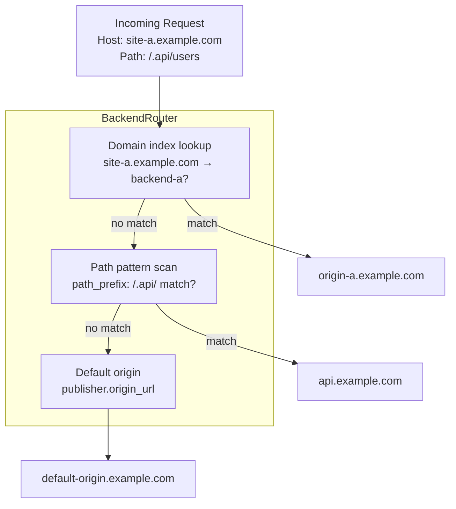

# Multi-Backend Routing

Route incoming requests to different origin servers based on the request's host
domain or URL path. This is useful when a single Trusted Server deployment
serves multiple publishers or products that live on different backend origins.

## Overview

By default, all requests proxy to the single `origin_url` defined in
`[publisher]`. Multi-backend routing lets you override that origin on a
per-request basis using two matching strategies:

- **Domain matching** — exact hostname match (with automatic `www.` stripping)
- **Path pattern matching** — URL prefix or regex match, optionally scoped to a
  specific host

Backends are evaluated in order. Domain matches take priority over path
patterns. Unmatched requests fall back to the default `publisher.origin_url`.

## Configuration

Backends are declared as `[[backends]]` entries in `trusted-server.toml` (or
a separate `backends.toml` file merged at build time — see
[Separating Customer Config](#separating-customer-config)).

### Domain-Based Routing

Route all traffic for a set of domains to a specific origin:

```toml
[[backends]]
id = "site-a"
origin_url = "https://origin-a.example.com"
domains = ["site-a.example.com", "www.site-a.example.com"]

[[backends]]
id = "site-b"
origin_url = "https://origin-b.example.com"
domains = ["site-b.example.com"]
```

`www.` prefixes are stripped before matching, so `www.site-a.example.com` and
`site-a.example.com` both resolve to the same backend entry.

### Path-Based Routing

Route a subset of paths to a different origin, optionally scoped to a specific
host:

```toml
[[backends]]
id = "api"
origin_url = "https://api.example.com"

  [[backends.path_patterns]]
  host = "site-a.example.com"
  path_prefix = "/.api/"

  [[backends.path_patterns]]
  host = "site-a.example.com"
  path_prefix = "/my-account"
```

Use a regular expression when prefix matching is not precise enough:

```toml
[[backends]]
id = "image-cdn"
origin_url = "https://cdn.example.com"

  [[backends.path_patterns]]
  host = "*"
  path_regex = "^/image/upload/"
```

Setting `host = "*"` (or omitting `host`) matches any hostname.

### TLS Settings

Each backend can control whether TLS certificates are verified:

```toml
[[backends]]
id = "internal"
origin_url = "http://internal.corp"
certificate_check = false   # disable TLS verification for internal backends
domains = ["internal.example.com"]
```

> **Warning:** Only disable `certificate_check` for internal origins you fully
> control. Disabling it for public origins exposes requests to interception.

### Reference

| Field               | Type              | Default | Description                                      |
| ------------------- | ----------------- | ------- | ------------------------------------------------ |
| `id`                | string            | —       | Optional label used in log output for debugging  |
| `origin_url`        | string (URL)      | —       | **Required.** Backend origin URL                 |
| `domains`           | array of strings  | `[]`    | Hostnames to route to this backend               |
| `path_patterns`     | array of patterns | `[]`    | Path-based routing rules (see below)             |
| `certificate_check` | boolean           | `true`  | Verify TLS certificate on the backend connection |

**Path pattern fields:**

| Field         | Type   | Description                                                   |
| ------------- | ------ | ------------------------------------------------------------- |
| `host`        | string | Hostname to scope this pattern to. `"*"` or omit for any host |
| `path_prefix` | string | Route requests whose path starts with this string             |
| `path_regex`  | string | Route requests whose path matches this regular expression     |

Only one of `path_prefix` or `path_regex` should be set per pattern entry.

## Selection Priority

For each request Trusted Server picks an origin in this order:

1. **Domain index** — exact hostname match (after `www.` stripping)
2. **Path patterns** — first matching pattern across all backend entries
3. **Default** — `publisher.origin_url`

Because domain matches are checked before path patterns, a backend that declares
both `domains` and `path_patterns` will always be reached via its domain match;
its path patterns only fire for hostnames not covered by any domain entry.

## Separating Customer Config

For deployments serving many sites, keep domain lists out of
`trusted-server.toml` by placing them in a separate file:

```
crates/trusted-server-adapter-fastly/backends.toml
```

`build.rs` merges this file into the embedded config at compile time. The file
uses the same `[[backends]]` syntax and is invisible to the shared application
template.

```toml
# crates/trusted-server-adapter-fastly/backends.toml
# Merged at build time by crates/trusted-server-core/build.rs

[[backends]]
id = "raven"
origin_url = "https://origin.prod.example.com"
certificate_check = true
domains = [
    "site-a.example.com",
    "site-b.example.com",
    # ... additional domains
]
```

## How It Works



The router is built once per request from the embedded config. Dynamic Fastly
backends are created on demand — the backend name encodes the origin URL, port,
TLS settings, and timeout so that configurations never collide.

## See Also

- [Configuration](/guide/configuration)
- [Architecture](/guide/architecture)
