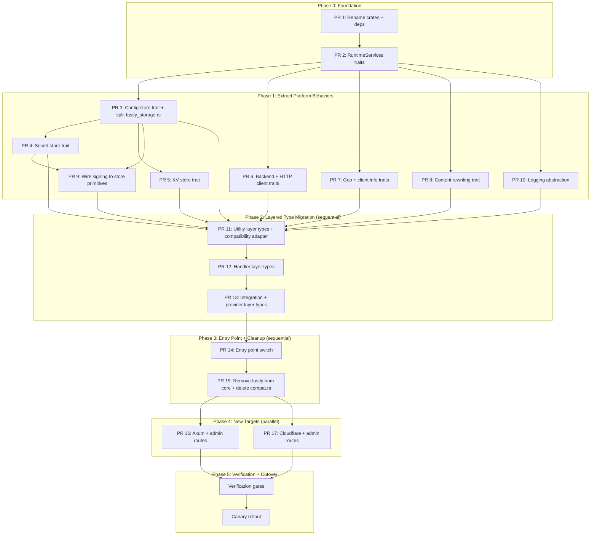

# EdgeZero Migration Plan

> Migration plan for moving trusted-server from direct Fastly Compute SDK usage
> to the [EdgeZero](https://github.com/stackpop/edgezero) framework, enabling
> deployment across Fastly, Cloudflare Workers, and native Axum/Tokio from a
> single codebase.

## Table of Contents

- [Decisions Locked](#decisions-locked)
- [Crate Naming Convention](#crate-naming-convention)
- [Current Fastly Primitive Usage](#current-fastly-primitive-usage)
- [EdgeZero Features Required](#edgezero-features-required)
  - [Already In Review](#already-in-review)
  - [Critical Path](#critical-path--blocks-core-migration)
  - [Important](#important--needed-for-full-feature-parity)
  - [Issue Coverage](#issue-coverage)
  - [Not Required from EdgeZero](#not-required-from-edgezero)
- [Trusted Server Migration Epic](#trusted-server-migration-epic)
  - [Migration Strategy](#migration-strategy)
  - [Why Not Migrate Types Module-by-Module](#why-not-migrate-types-module-by-module)
  - [PR Dependency Graph](#pr-dependency-graph)
  - [Phase 0: Foundation](#phase-0-foundation)
  - [Phase 1: Extract Platform Behaviors](#phase-1-extract-platform-behaviors)
  - [Phase 2: Layered Type Migration](#phase-2-layered-type-migration)
  - [Phase 3: Entry Point and Cleanup](#phase-3-entry-point-and-cleanup)
  - [Phase 4: New Targets](#phase-4-new-targets)
  - [Phase 5: Verification, Cutover, and Rollback](#phase-5-verification-cutover-and-rollback)
- [Internal Prerequisites](#internal-prerequisites)
- [Parallelization Plan](#parallelization-plan)
  - [EdgeZero Feature Tracker](#edgezero-feature-tracker)
  - [Trusted-Server Issue Backlog](#trusted-server-issue-backlog)

---

## Decisions Locked

These decisions are finalized and reflected in this plan:

1. **Request-signing is core business logic, not a platform primitive** — all
   signing behavior (key rotation, JWKS management, signature verification)
   lives in `trusted-server-core` and composes platform store primitives
   (config store read/write, secret store read/write). No `SigningService`
   trait exists — adapters only implement store primitives with full CRUD
   support.
2. **Migrate all integrations** including GPT and Google Tag Manager as
   first-class scope.
3. **Admin key routes must be supported on all adapters** —
   `/admin/keys/rotate` and `/admin/keys/deactivate` are required on Fastly,
   Axum, and Cloudflare (no disabled-route mode).
4. **Temporary Fastly compatibility adapter is required** — `compat.rs` lives in
   trusted-server during migration (created in PR 11, deleted in PR 15),
   bridging Fastly-specific request and response helper APIs during layered
   type migration.
5. **Behavior-first, types-last** — extract platform behaviors into traits
   before touching `fastly::Request/Response` types.
6. **IntegrationProxy trait + all implementations change in one PR** — the
   trait has 8 production implementations (plus 2 test impls); splitting
   across PRs breaks compilation.
7. **Rust CI must enforce workspace-wide gates** — required commands are
   `cargo test --workspace`, `cargo clippy --workspace --all-targets
--all-features -- -D warnings`, and `cargo fmt --all -- --check`.
8. **Follow EdgeZero crate naming convention** — `trusted-server-core`,
   `trusted-server-adapter-fastly`, `trusted-server-adapter-cloudflare`,
   `trusted-server-adapter-axum`.

---

## Crate Naming Convention

Follow the EdgeZero convention (`{app}-core`, `{app}-adapter-{platform}`):

| Current                                   | New                                                                              | Purpose                          |
| ----------------------------------------- | -------------------------------------------------------------------------------- | -------------------------------- |
| `crates/common` (`trusted-server-common`) | `crates/trusted-server-core` (`trusted-server-core`)                             | Platform-agnostic business logic |
| `crates/fastly` (`trusted-server-fastly`) | `crates/trusted-server-adapter-fastly` (`trusted-server-adapter-fastly`)         | Fastly Compute entry point       |
| —                                         | `crates/trusted-server-adapter-axum` (`trusted-server-adapter-axum`)             | Native Axum dev server           |
| —                                         | `crates/trusted-server-adapter-cloudflare` (`trusted-server-adapter-cloudflare`) | Cloudflare Workers entry point   |
| `crates/js` (`trusted-server-js`)         | `crates/js` (`trusted-server-js`)                                                | JS build (unchanged)             |

The rename from `common` → `trusted-server-core` and `fastly` →
`trusted-server-adapter-fastly` happens in **PR 1** (foundation) to avoid
mid-migration confusion. All subsequent PRs use the new names.

---

## Current Fastly Primitive Usage

The trusted-server uses these Fastly-specific primitives across ~28 source
files in `crates/trusted-server-core` and `crates/trusted-server-adapter-fastly`:

| Primitive                              | Files Affected                                      | EdgeZero Status                                                                                                                                                                          |
| -------------------------------------- | --------------------------------------------------- | ---------------------------------------------------------------------------------------------------------------------------------------------------------------------------------------- |
| `fastly::Request` / `Response`         | All (~28 files)                                     | Ready (`http` crate types)                                                                                                                                                               |
| `fastly::Body`                         | publisher, proxy, integrations                      | Ready (`edgezero_core::Body`)                                                                                                                                                            |
| `fastly::backend::Backend` (dynamic)   | backend.rs, all integrations                        | Backlog ([#79-87](https://github.com/stackpop/edgezero/issues?q=is%3Aissue%20id%3A%2079%2080%2081%2082%2083%2084%2085%2086%2087))                                                        |
| `req.send()` / `req.send_async()`      | proxy.rs, all integrations                          | Partial (`ProxyClient` exists)                                                                                                                                                           |
| `select(Vec<PendingRequest>)`          | auction/orchestrator.rs                             | Backlog ([#147-148](https://github.com/stackpop/edgezero/issues?q=is%3Aissue%20id%3A%20147%20148))                                                                                       |
| `fastly::ConfigStore`                  | fastly_storage.rs                                   | In review ([#51-58](https://github.com/stackpop/edgezero/issues?q=is%3Aissue%20id%3A%2051%2052%2053%2054%2055%2056%2057%2058), PR [#209](https://github.com/stackpop/edgezero/pull/209)) |
| `fastly::SecretStore`                  | fastly_storage.rs                                   | Backlog ([#59-67](https://github.com/stackpop/edgezero/issues?q=is%3Aissue%20id%3A%2059%2060%2061%2062%2063%2064%2065%2066%2067))                                                        |
| KV Store (counter, opid, creative)     | fastly_storage.rs                                   | In review ([#43-50](https://github.com/stackpop/edgezero/issues?q=is%3Aissue%20id%3A%2043%2044%2045%2046%2047%2048%2049%2050), PR [#165](https://github.com/stackpop/edgezero/pull/165)) |
| `fastly::geo::geo_lookup`              | geo.rs                                              | Covered by [#88-92](https://github.com/stackpop/edgezero/issues?q=is%3Aissue%20id%3A%2088%2089%2090%2091%2092) (Client Info)                                                             |
| `req.get_client_ip_addr()`             | geo.rs, synthetic.rs, didomi.rs, auction/formats.rs | Backlog ([#88-92](https://github.com/stackpop/edgezero/issues?q=is%3Aissue%20id%3A%2088%2089%2090%2091%2092))                                                                            |
| `req.get_tls_protocol()`               | http_util.rs                                        | Covered by [#88-92](https://github.com/stackpop/edgezero/issues?q=is%3Aissue%20id%3A%2088%2089%2090%2091%2092) (Client Info)                                                             |
| `log_fastly::Logger`                   | main.rs                                             | Ready (adapter handles logging)                                                                                                                                                          |
| `#[fastly::main]`                      | main.rs                                             | Ready (`dispatch()`)                                                                                                                                                                     |
| `fastly::http::Url`                    | integrations/prebid.rs                              | Trivial (use `url::Url`)                                                                                                                                                                 |
| `fastly::mime`                         | request_signing/endpoints.rs                        | Trivial (use `mime` crate)                                                                                                                                                               |
| `response.get_backend_name()`          | auction/orchestrator.rs                             | Filed as [#213](https://github.com/stackpop/edgezero/issues/213)                                                                                                                         |
| Fastly API transport (runtime updates) | fastly_storage.rs, request_signing/rotation.rs      | Adapter-specific implementation behind abstraction                                                                                                                                       |

### Import Locations

> **Note:** Paths below use post-rename crate names (`crates/trusted-server-core/`,
> `crates/trusted-server-adapter-fastly/`). Before PR 1 lands, these correspond to
> `crates/common/` and `crates/fastly/` respectively.

| Module                                                                                 | Fastly Imports                                                                           |
| -------------------------------------------------------------------------------------- | ---------------------------------------------------------------------------------------- |
| `crates/trusted-server-adapter-fastly/src/main.rs`                                     | `fastly::{Error, Request, Response}`, `fastly::http::Method`, `log_fastly::Logger`       |
| `crates/trusted-server-adapter-fastly/src/error.rs`                                    | `fastly::Response`                                                                       |
| `crates/trusted-server-core/src/fastly_storage.rs`                                     | `fastly::{ConfigStore, Request, Response, SecretStore}`                                  |
| `crates/trusted-server-core/src/backend.rs`                                            | `fastly::backend::Backend`                                                               |
| `crates/trusted-server-core/src/http_util.rs`                                          | `fastly::http::{header, StatusCode}`, `fastly::{Request, Response}`                      |
| `crates/trusted-server-core/src/geo.rs`                                                | `fastly::geo::geo_lookup`, `fastly::{Request, Response}`                                 |
| `crates/trusted-server-core/src/publisher.rs`                                          | `fastly::http::{header, StatusCode}`, `fastly::{Body, Request, Response}`                |
| `crates/trusted-server-core/src/proxy.rs`                                              | `fastly::http::{header, HeaderValue, Method, StatusCode}`, `fastly::{Request, Response}` |
| `crates/trusted-server-core/src/auth.rs`                                               | `fastly::http::{header, StatusCode}`, `fastly::{Request, Response}`                      |
| `crates/trusted-server-core/src/synthetic.rs`                                          | `fastly::http::header`, `fastly::Request`                                                |
| `crates/trusted-server-core/src/cookies.rs`                                            | `fastly::http::header`, `fastly::Request`                                                |
| `crates/trusted-server-core/src/auction/orchestrator.rs`                               | `fastly::http::request::{select, PendingRequest}`                                        |
| `crates/trusted-server-core/src/auction/provider.rs`                                   | `fastly::http::request::PendingRequest`, `fastly::Response`                              |
| `crates/trusted-server-core/src/auction/types.rs`                                      | `fastly::Request`                                                                        |
| `crates/trusted-server-core/src/auction/formats.rs`                                    | `fastly::http::{header, StatusCode}`, `fastly::{Request, Response}`                      |
| `crates/trusted-server-core/src/auction/endpoints.rs`                                  | `fastly::{Request, Response}`                                                            |
| `crates/trusted-server-core/src/request_signing/endpoints.rs`                          | `fastly::{Request, Response}`, `fastly::mime`                                            |
| `crates/trusted-server-core/src/integrations/registry.rs`                              | `fastly::http::Method`, `fastly::{Request, Response}`                                    |
| All integration modules (superset — individual modules vary; not all use every import) | `fastly::http::{header, HeaderValue, Method, StatusCode}`, `fastly::{Request, Response}` |

---

## EdgeZero Features Required

### Already In Review

These are close to landing and unblock early migration phases.

| Feature                  | Issues                                                                                                             | PR                                                    | Notes                                            |
| ------------------------ | ------------------------------------------------------------------------------------------------------------------ | ----------------------------------------------------- | ------------------------------------------------ |
| KV Store Abstraction     | [#43-50](https://github.com/stackpop/edgezero/issues?q=is%3Aissue%20id%3A%2043%2044%2045%2046%2047%2048%2049%2050) | [#165](https://github.com/stackpop/edgezero/pull/165) | Covers counter_store, opid_store, creative_store |
| Config Store Abstraction | [#51-58](https://github.com/stackpop/edgezero/issues?q=is%3Aissue%20id%3A%2051%2052%2053%2054%2055%2056%2057%2058) | [#209](https://github.com/stackpop/edgezero/pull/209) | Covers jwks_store, runtime config                |

> **Note:** EdgeZero Config Store and Secret Store provide **read** interfaces.
> Management write CRUD (put/delete for config, create/delete for secrets) is a
> trusted-server internal concern — adapters extend the EdgeZero read traits
> with write methods (see PR 2 trait contract). Do not wait on EdgeZero for
> write support.

### Critical Path — Blocks Core Migration

These must land before trusted-server can fully migrate. Ordered by dependency
chain.

#### 1. Secret Store Abstraction (Issues [#59-67](https://github.com/stackpop/edgezero/issues?q=is%3Aissue%20id%3A%2059%2060%2061%2062%2063%2064%2065%2066%2067))

Trusted-server stores Ed25519 signing keys and API credentials in
`fastly::SecretStore`. Every request that does request signing or key rotation
depends on this.

Usage in `fastly_storage.rs`:

```rust
let store = SecretStore::open("signing_keys")?;
let secret = store.get("ts-2025-10-A")?;
let key_bytes: Vec<u8> = secret.try_plaintext()?;
```

What EdgeZero needs:

- Portable `SecretStore` trait: `get(key) -> Result<Vec<u8>>` (read path)
- Fastly adapter via `fastly::SecretStore`
- Cloudflare adapter via Workers Secrets
- Axum adapter via env vars / dotenv

> **Note:** EdgeZero provides the **read** interface only. Management write
> operations (create, delete) are trusted-server internal — each adapter
> implements write CRUD by wrapping its platform's management API (see PR 2
> trait contract and PR 9). Implementers should not wait on EdgeZero for
> write support.

#### 2. Dynamic Backend Abstraction (Issues [#79-87](https://github.com/stackpop/edgezero/issues?q=is%3Aissue%20id%3A%2079%2080%2081%2082%2083%2084%2085%2086%2087))

Trusted-server creates backends on-the-fly from URLs for every upstream call.
This is the most pervasive networking primitive — used by every integration,
the proxy module, and the Fastly API client.

Usage in `backend.rs`:

```rust
Backend::builder(name, host)
    .override_host(host)
    .connect_timeout(Duration::from_secs(1))
    .first_byte_timeout(Duration::from_secs(15))
    .between_bytes_timeout(Duration::from_secs(10))
    .enable_ssl()
    .sni_hostname(host)
    .check_certificate(host)
    .finish()
```

What EdgeZero needs:

- `BackendFactory` trait with builder pattern supporting URL, timeouts, TLS
  options, SNI, and cert verification
- Name-based deduplication (Fastly errors on duplicate backend names)
- Fastly adapter via `fastly::backend::Backend::builder`
- Cloudflare adapter via Fetch API with custom `RequestInit`
- Axum adapter via `reqwest::Client` with timeout config

#### 3. Client Info Abstraction (Issues [#88-92](https://github.com/stackpop/edgezero/issues?q=is%3Aissue%20id%3A%2088%2089%2090%2091%2092))

Trusted-server uses client IP for geolocation and TLS protocol for scheme
detection. Both are platform-specific APIs.

Usage across `geo.rs`, `http_util.rs`, `synthetic.rs`:

```rust
req.get_client_ip_addr()          // -> Option<IpAddr>
req.get_tls_protocol()            // -> Option<String>
req.get_tls_cipher_openssl_name() // -> Option<String>
```

What EdgeZero needs:

- `ClientInfo` struct with `client_ip: Option<IpAddr>`,
  `tls_protocol: Option<String>`, `tls_cipher: Option<String>`
- Extractable from `RequestContext` via adapter-populated extensions
- Fastly: from `fastly::Request` methods
- Cloudflare: from `CF-Connecting-IP` header and `cf` object
- Axum: from connection info and `X-Forwarded-For`

#### 4. Concurrent Request Fan-out (Issues [#147-148](https://github.com/stackpop/edgezero/issues?q=is%3Aissue%20id%3A%20147%20148))

The auction orchestrator sends bid requests to multiple providers
simultaneously, then processes responses as they arrive using
`fastly::http::request::select()`. This is the core of the real-time bidding
system.

Usage in `auction/orchestrator.rs`:

```rust
let mut pending: Vec<PendingRequest> = providers
    .iter()
    .map(|p| p.request_bids(req, ctx))
    .collect();

while !remaining.is_empty() {
    let (result, rest) = select(remaining);
    remaining = rest;
    let backend_name = result?.get_backend_name();
    // correlate response to provider and process
}
```

What EdgeZero needs:

- Async `ProxyClient::send_async()` returning a `PendingRequest` handle
- `select(Vec<PendingRequest>) -> (Result<Response>, Vec<PendingRequest>)` —
  first-to-complete pattern
- `PendingRequest::wait()` equivalent for mediator flow that intentionally
  blocks on a single pending request
- Response correlation mechanism (equivalent to `get_backend_name()`)
- Error correlation for failed pending requests (provider/request identifier on
  failure path, not only success path)
- Must work in WASM (no `tokio::spawn`, no `Send` requirement)

#### 5. Content Rewriting (Issues [#114-117](https://github.com/stackpop/edgezero/issues?q=is%3Aissue%20id%3A%20114%20115%20116%20117))

The publisher proxy streams HTML responses through a pipeline that injects
`<script>` tags at `<head>`, rewrites ad-related HTML attributes, and handles
compression/decompression around the rewriting.

Usage across `html_processor.rs` and `publisher.rs`:

- Decompress upstream response body (gzip/brotli)
- Parse HTML streaming, find `<head>` tag
- Inject `<script>` tags for JS bundles
- Rewrite attributes on ad-related elements
- Recompress and return

What EdgeZero needs:

- Streaming HTML element selector and attribute rewriting API
- Decompress-rewrite-recompress pipeline helpers
- Compatible with `Body::Stream` variant

### Important — Needed for Full Feature Parity

#### 6. Cookie Support (Issues [#93-95](https://github.com/stackpop/edgezero/issues?q=is%3Aissue%20id%3A%2093%2094%2095))

Usage in `cookies.rs`: parse `Cookie` header from requests, build `Set-Cookie`
response headers with `SameSite`, `Secure`, `HttpOnly`, `Domain`, `Path`,
`Max-Age`.

#### 7. Static File Serving with ETag (Issues [#104-106](https://github.com/stackpop/edgezero/issues?q=is%3Aissue%20id%3A%20104%20105%20106))

Usage in `http_util.rs`: `serve_static_with_etag()` serves JS bundles with
SHA-256 ETag, `If-None-Match` → 304, `Cache-Control` headers.

#### 8. Response Header Injection via Config (Issues [#102-103](https://github.com/stackpop/edgezero/issues?q=is%3Aissue%20id%3A%20102%20103))

Operator-configured response headers added to every response in
`finalize_response()`.

### Issue Coverage

All EdgeZero-dependent features required for the trusted-server migration map
to existing EdgeZero issues. Features that are core business logic (not EdgeZero
concerns) are marked N/A. Features that were initially thought to need new
issues have been resolved:

| Feature                           | Issue                                                                                               | Resolution                                                                                                                                                                       | Blocks TS PRs                                                                                                                  |
| --------------------------------- | --------------------------------------------------------------------------------------------------- | -------------------------------------------------------------------------------------------------------------------------------------------------------------------------------- | ------------------------------------------------------------------------------------------------------------------------------ |
| Geolocation Abstraction           | [#88-92](https://github.com/stackpop/edgezero/issues?q=is%3Aissue%20id%3A%2088%2089%2090%2091%2092) | Already covered by Client Info epic (via [#89](https://github.com/stackpop/edgezero/issues/89)). `GeoLookup` included in client metadata.                                        | PR 7                                                                                                                           |
| Response Backend Correlation      | [#213](https://github.com/stackpop/edgezero/issues/213)                                             | New task filed under [#79](https://github.com/stackpop/edgezero/issues/79). Async responses must carry an identifier for upstream correlation (`get_backend_name()` equivalent). | Swaps in after PR 6 (PR 6 uses `PlatformResponse.backend_name: Option<String>`; `Some` on Fastly, `None` on others until #213) |
| TLS/Scheme Detection              | [#88-92](https://github.com/stackpop/edgezero/issues?q=is%3Aissue%20id%3A%2088%2089%2090%2091%2092) | Already covered by Client Info epic (via [#89](https://github.com/stackpop/edgezero/issues/89)). `ClientInfo` includes TLS protocol and cipher info.                             | PR 7                                                                                                                           |
| Request-Signing Management Writes | N/A (core business logic)                                                                           | Not an EdgeZero concern. Core signing code composes platform store CRUD primitives (`PlatformConfigStore`, `PlatformSecretStore`). No signing-specific trait.                    | PR 9 (store wiring)                                                                                                            |

### Not Required from EdgeZero

These are platform-specific or application-specific and will remain in
trusted-server:

- **Fastly API transport details** — HTTP details for Fastly management API
  live inside the Fastly adapter's store write implementations. Core calls
  `config_store.put()` / `secret_store.create()` — never management APIs
  directly.
- **Platform environment variables** — `FASTLY_SERVICE_VERSION`,
  `FASTLY_IS_STAGING`. Use adapter-specific config or manifest.
- **`fastly::mime`** — replace with `mime` crate directly (trivial).
- **Request-signing business logic and endpoint semantics** — signing,
  verification, key rotation, and JWKS management are application-level
  concerns that live in core. Adapters provide platform store primitives
  with CRUD support; core signing code composes them directly.

---

## Trusted Server Migration Epic

### Migration Strategy

**Behavior-first, types-last.** Extract platform-specific _behaviors_ into
traits before touching `fastly::Request/Response` types. This is critical
because `fastly::Request` and `fastly::Response` appear in every function
signature across ~28 files — changing one function's parameter type breaks all
callers, making module-by-module type migration impossible.

The migration proceeds in three stages:

1. **Extract platform behaviors** (Phase 1) — introduce traits for storage,
   backend creation, HTTP client, geo lookup, client info, content rewriting,
   and logging. Each trait gets a Fastly-backed implementation. Handler-level
   function signatures are preserved; internal utility functions gain a
   `&RuntimeServices` parameter (see Phase 1 injection pattern). Each PR is
   independently mergeable and deployable.

2. **Layered type migration** (Phase 2) — convert `fastly::*` types to
   standard `http` crate types in three coordinated layers: utilities first,
   then handlers, then the integration framework. A temporary compatibility adapter
   (`crates/trusted-server-core/src/compat.rs`, not EdgeZero) provides shims for
   Fastly-specific helper APIs (path/query helpers, body extraction, response
   builders) at layer boundaries during transition. Removed in PR 15.

3. **Entry point switch** (Phase 3) — replace `#[fastly::main]` with EdgeZero
   `dispatch()`, remove `fastly` from core crate, add new platform targets.

**Key design principle:** After migration, `crates/trusted-server-core` has zero direct
`fastly` imports. It depends only on `edgezero-core` and standard crates.
Platform-specific code lives in adapter crates (`crates/trusted-server-adapter-fastly/`,
`crates/trusted-server-adapter-axum/`, `crates/trusted-server-adapter-cloudflare/`). This includes
request-signing logic: core signing code composes platform store primitives
(`PlatformConfigStore`, `PlatformSecretStore` — both with read and write
methods) directly through `RuntimeServices`. No signing-specific trait exists;
adapters implement store CRUD, and core owns all signing business logic.

**EdgeZero features do not block migration.** During Phase 1, trait
implementations are backed directly by Fastly SDK calls. When EdgeZero adapters
land, the Fastly-backed implementations are swapped out — no application code
changes needed.

**Integration scope is complete only when these are migrated:** `lockr`,
`permutive`, `didomi`, `prebid`, `aps`, `datadome`, `adserver_mock`, `nextjs`,
`testlight`, `google_tag_manager`, and `gpt`.

### Why Not Migrate Types Module-by-Module

The original plan attempted to convert one module at a time from
`fastly::Request` to `http::Request`. This breaks compilation because of deep
cross-module call chains:

```
main.rs (fastly types)
  → proxy.rs (if migrated: http types — BREAKS: main.rs still passes fastly::Request)
    → backend.rs (if not migrated: fastly types — BREAKS: proxy.rs now passes http types)
      → integration.rs (fastly types — BREAKS: cascading type mismatch)
```

Additionally, the `IntegrationProxy` trait has **8 production implementations**
across 8 files (plus 2 test-only impls in `registry.rs`). Changing the trait's
`Request`/`Response` types requires updating all 8 production implementations
in the same PR — they cannot be split across PRs without breaking compilation.
Test impls must also update but are co-located in `registry.rs`.

The behavior-first approach avoids this: Phase 1 introduces traits without
changing any function signatures, and Phase 2 changes types in coordinated
layers with compatibility wrappers at each boundary.

### PR Dependency Graph



---

### Phase 0: Foundation

#### PR 1 — Rename crates and add EdgeZero workspace dependencies

**Blocked by:** Nothing
**Files:** `Cargo.toml` (workspace), `crates/common/` → `crates/trusted-server-core/`,
`crates/fastly/` → `crates/trusted-server-adapter-fastly/`, all internal path references

Changes:

- Rename `crates/common` directory to `crates/trusted-server-core`, update `Cargo.toml`
  package name to `trusted-server-core`
- Rename `crates/fastly` directory to `crates/trusted-server-adapter-fastly`, update
  `Cargo.toml` package name to `trusted-server-adapter-fastly`
- Update workspace `members` and `default-members` in root `Cargo.toml`
- Update `path = "../common"` → `path = "../trusted-server-core"` in inter-crate
  dependencies
- Add `edgezero-core`, `edgezero-adapter-fastly`, `edgezero-adapter-cloudflare`,
  and `edgezero-adapter-axum` as workspace dependencies
- Add `edgezero-core` to `crates/trusted-server-core` dependencies
- Add `edgezero-adapter-fastly` to `crates/trusted-server-adapter-fastly` dependencies
- Update `fastly.toml` build paths if needed
- Update `CLAUDE.md`: workspace layout table, key files table, build
  commands, and any crate path references to reflect new names
- Update `CONTRIBUTING.md` if crate references appear there
- Update `.env.dev` if it references crate paths
- Verify `cargo build --workspace`, `cargo test --workspace`, and
  `cargo build --package trusted-server-adapter-fastly --target wasm32-wasip1`
  all pass

Risk: Dependency conflicts between `fastly` crate and EdgeZero's re-export of
the `http` crate — verify version compatibility.

#### PR 2 — Define platform trait interfaces and RuntimeServices

**Blocked by:** PR 1
**Files:** New `crates/trusted-server-core/src/platform/` module with trait definitions

Changes:

- Add `async-trait` to workspace dependencies in root `Cargo.toml` and to
  `crates/trusted-server-core/Cargo.toml`
- Add object-safety and `Send + Sync` verification in two forms:
  1. A `#[cfg(test)]` unit test (in `platform/mod.rs`) that constructs
     a `RuntimeServices` instance from dummy impls — proving every
     concrete dummy can be boxed as `Box<dyn Trait + Send + Sync>` and
     stored in the struct. Runs via `cargo test --workspace` on host.
  2. A non-test function-based static assertion (also in
     `platform/mod.rs`) that the compiler type-checks but never calls:
     ```rust
     // Compiled on all targets (including wasm); never called.
     fn _assert_object_safe(
         _: &(dyn PlatformConfigStore + Send + Sync),
         _: &(dyn PlatformSecretStore + Send + Sync),
         _: &(dyn PlatformHttpClient + Send + Sync),
         // ... one param per trait
     ) {}
     ```
     Reference coercion verifies **object safety** (traits can be used
     as `dyn`) without heap allocation — valid on all targets.
     **What each mechanism proves:**
  - The static assertion (form 2) proves object safety on both host
    and wasm. It does **not** prove that any concrete impl satisfies
    `Send + Sync` — only that the trait itself permits `dyn` dispatch.
  - The unit test (form 1) proves that dummy impls satisfy `Send + Sync`
    and can be stored in `RuntimeServices`. Real adapter impls get the
    same check when they construct `RuntimeServices` at startup —
    the compiler rejects any adapter impl that is not `Send + Sync`.
  - The `?Send` annotation on wasm is a code-review concern — these
    assertions do not mechanically verify it. Reviewers must confirm
    the target-conditional `async_trait` annotation is present on
    every async platform trait
- Create `crates/trusted-server-core/src/platform/mod.rs` with submodules
- Define `PlatformError` in `platform/error.rs`:

  ```rust
  #[derive(Debug, derive_more::Display)]
  pub enum PlatformError {
      #[display("Store `{store}` not found")]
      StoreNotFound { store: String },
      #[display("Key `{key}` not found in store `{store}`")]
      KeyNotFound { store: String, key: String },
      #[display("Operation not implemented: {operation}")]
      NotImplemented { operation: String },
      #[display("Platform error: {message}")]
      Internal { message: String },
  }

  impl core::error::Error for PlatformError {}
  ```

  All platform trait methods return `Result<T, Report<PlatformError>>`.
  Callers use `change_context()` to map into `TrustedServerError` at
  application boundaries.

- Define platform traits (signatures only, no implementations yet):
  - `PlatformConfigStore` (full CRUD):
    - `get(store: &StoreName, key) -> Result<Option<String>>`
    - `put(store: &StoreId, key, value) -> Result<()>`
    - `delete(store: &StoreId, key) -> Result<()>`
  - `PlatformSecretStore` (full CRUD):
    - `get(store: &StoreName, key) -> Result<Vec<u8>>`
    - `create(store: &StoreId, name, value) -> Result<()>`
    - `delete(store: &StoreId, name) -> Result<()>`
  - `StoreName` and `StoreId` are newtypes over `String`, reflecting the
    split in current code:
    - **`StoreName`** — edge read identifier, used with
      `ConfigStore::open` / `SecretStore::open`. Corresponds to the
      hardcoded constants `JWKS_CONFIG_STORE_NAME` and
      `SIGNING_SECRET_STORE_NAME` (declared in `fastly.toml`).
    - **`StoreId`** — management write identifier, used with platform
      management APIs. Corresponds to `RequestSigning::config_store_id`
      and `RequestSigning::secret_store_id` from `trusted-server.toml`.
    - On Fastly, these are genuinely different values. On other
      platforms they may coincide (Cloudflare binding name, Axum
      namespace), but the type split enforces compile-time safety
      regardless.
  - `PlatformKvStore` — `get/put/delete` operations
  - `PlatformBackend` — `create(name, host, config) -> Result<BackendHandle>`
  - `PlatformHttpClient` (async trait via `async_trait` crate — RPITIT
    requires Rust 1.75+ with `dyn` dispatch limitations that conflict
    with `Box<dyn PlatformHttpClient>`; `async_trait` is proven and
    already used by EdgeZero). Use **target-conditional annotation**:
    ```rust
    #[cfg_attr(target_arch = "wasm32", async_trait(?Send))]
    #[cfg_attr(not(target_arch = "wasm32"), async_trait)]
    ```
    On wasm32: `?Send` futures (single-threaded, no `Send` requirement).
    On native (Axum/tokio): `Send` futures (required for multi-threaded
    runtime and tower middleware compatibility). Same conditional applies
    to `IntegrationProxy::handle` and `AuctionProvider::request_bids`.
    PR 2's object-safety compile test must verify on both native and
    `wasm32-wasip1` targets:
    - `async fn send(req, backend) -> Result<PlatformResponse>`
    - `async fn send_async(req, backend) -> Result<PendingRequest>`
    - `async fn select(pending) -> (Result<PlatformResponse>, Vec<PendingRequest>)`
    - All methods are async to support Axum (tokio) and Cloudflare
      (fetch). On Fastly wasm, the adapter wraps synchronous SDK calls
      in trivially-completing futures. This avoids runtime friction on
      async platforms without penalizing Fastly's synchronous model
  - `PlatformResponse` wraps `fastly::Response` (in Phase 1) with an
    optional `backend_name: Option<String>` for upstream correlation
    (maps to `get_backend_name()` on Fastly; `None` until EdgeZero #213
    lands on other platforms). PR 6 constructs `PlatformResponse` from
    `fastly::Response` at the trait boundary; callers continue working
    with `fastly::Response` via `.into_inner()`. In Phase 2 (PR 12),
    `PlatformResponse` switches to wrapping `http::Response` as part
    of the handler-layer type migration
  - `PlatformGeo` — `lookup(ip) -> Result<GeoInfo>`
  - `PlatformClientInfo` — `client_ip(req) -> Option<IpAddr>`,
    `tls_protocol(req) -> Option<String>`,
    `tls_cipher(req) -> Option<String>`
  - Store write methods exist so core signing code can do key rotation
    without a signing-specific trait. Each adapter implements full CRUD
    for its platform (Fastly: reads via runtime SDK, writes via management
    API; Cloudflare: via Workers API; Axum: local providers).
- Define `RuntimeServices` struct that holds all trait implementations:
  ```rust
  pub struct RuntimeServices {
      pub config_store: Box<dyn PlatformConfigStore + Send + Sync>,
      pub secret_store: Box<dyn PlatformSecretStore + Send + Sync>,
      pub kv_store: Box<dyn PlatformKvStore + Send + Sync>,
      pub backend: Box<dyn PlatformBackend + Send + Sync>,
      pub http_client: Box<dyn PlatformHttpClient + Send + Sync>,
      pub geo: Box<dyn PlatformGeo + Send + Sync>,
      pub client_info: Box<dyn PlatformClientInfo + Send + Sync>,
  }
  ```
- `RuntimeServices` is constructed in the entry point and threaded through
  handlers — this is the single injection point for all platform behavior
- **Lifecycle (adapter-managed):** Each adapter owns `RuntimeServices`
  construction and sharing. All trait objects must be
  `Send + Sync + 'static` so the struct can live in an `Arc` for Axum's
  multi-threaded runtime and Cloudflare's worker model. On Fastly
  (single-threaded wasm), `Send + Sync` is vacuously satisfied but the
  constraint ensures portability
- **Initialization pattern per platform:**
  - **Fastly:** `build_app()` runs inside `#[fastly::main]`, which is
    called once per request on wasm. `RuntimeServices` construction is
    cheap (opens store handles, no network calls) so per-invocation
    construction is acceptable. Store handles are stateless wrappers.
  - **Axum:** `build_app()` runs once at server startup. The returned
    `RuntimeServices` is wrapped in `Arc` and shared across the tokio
    runtime via Axum state. Never constructed per-request.
  - **Cloudflare:** `build_app()` runs once per worker instantiation.
    Shared via worker state binding across fetch events.
- No existing code changes — traits are defined but not yet used

---

### Phase 1: Extract Platform Behaviors

These PRs extract platform-specific behavior behind traits. Each adds a
Fastly-backed implementation and wires it through `RuntimeServices`. Existing
function signatures stay unchanged at the handler boundary — callers just
receive the behavior through the services struct instead of calling Fastly
SDK directly.

**Injection pattern for utility-style functions:** Several request-signing
functions (`get_current_key_id()`, `get_active_jwks()`, `verify_signature()`,
`RequestSigner::from_config()`) currently take zero parameters and construct
`FastlyConfigStore` / `FastlySecretStore` internally. Phase 1 adds a
`&RuntimeServices` parameter to these functions. This is a signature change
at the utility level, but callers (handlers in `endpoints.rs`, `rotation.rs`)
already receive `RuntimeServices` and just thread it through. The existing
codebase threads `&Settings` through handler → utility calls in the same way
(e.g., `proxy_request(settings, ...)`), so this follows the established
pattern.

PRs 6-8, 10 can proceed **in parallel** after PR 2. PRs 3/4/5/9 have
strict sequencing constraints due to shared file ownership:

- **PR 3 must land first** — splits `fastly_storage.rs` into separate modules
- **PRs 4 and 5** proceed in parallel after PR 3 (own separate files)
- **PR 9 must land after PR 4** — both edit `request_signing/signing.rs`
  and `request_signing/endpoints.rs`; PR 4 migrates secret store reads,
  PR 9 wires signing code to store write primitives. Running them in
  parallel guarantees merge conflicts.

The full `request_signing/` chain is: **PR 3 → PR 4 → PR 9** (sequential).
Each PR also touches `main.rs` to wire `RuntimeServices`, requiring
coordination across all Phase 1 PRs.

**Entry-point merge rule:** One author owns `main.rs` changes per merge
window. When parallel PRs (e.g., PRs 6-8, 10) are in flight, only one
merges its `main.rs` wiring at a time — the others rebase onto it.
Recommended merge order for parallel PRs: PR 6 first (largest — backend +
HTTP client), then PRs 7, 8, 10 in any order. Each rebases onto the
previous before merging.

**Key property:** Each PR is independently mergeable and deployable. The Fastly
implementations produce identical behavior to the current direct SDK calls.

**Cross-cutting requirements for every PR:**

- **Tests:** Each PR must include updated or new unit tests covering the
  changed behavior. "Update tests" means: existing tests that reference
  migrated APIs must compile and pass, and new trait implementations must
  have their own tests verifying parity with the direct SDK behavior they
  replace. Integration tests (if any) must also pass.
- **Documentation:** Update `CLAUDE.md` if the PR changes workspace layout,
  build commands, key file paths, or crate names. Update doc comments on
  any public API whose signature changes. Update `CONTRIBUTING.md` if
  developer workflow changes (e.g., new build targets, new test commands).
- **Configuration:** Update `fastly.toml`, `trusted-server.toml`, `.env.dev`,
  or `Cargo.toml` workspace settings as needed.
- **Per-PR build gates (all must pass before merge):**
  ```bash
  cargo build --workspace                                                      # host target (all crates)
  cargo build --package trusted-server-adapter-fastly --target wasm32-wasip1   # Fastly deploy target
  cargo test --workspace                                                       # all tests
  cargo clippy --workspace --all-targets --all-features -- -D warnings         # lint (workspace-wide per Decision #7)
  cargo fmt --all -- --check                                                   # format
  ```
  The wasm build is required on every PR to ensure continuous deployability
  to Fastly. A PR that passes host build but breaks wasm is not mergeable.
  Starting with PR 17 (Cloudflare adapter), add a second wasm gate:
  `cargo build --package trusted-server-adapter-cloudflare --target wasm32-unknown-unknown`.
  The Cloudflare adapter targets `wasm32-unknown-unknown` (not `wasm32-wasip1`)
  because Workers use a different WASI-less execution model.
  The Cloudflare crate must also remain host-compilable so
  `cargo build --workspace` and `cargo clippy --workspace` continue to pass.
  Use `cfg`-gated entrypoint shims where needed for non-wasm builds.

#### PR 3 — Extract config store behind trait

**Blocked by:** PR 2
**Files:** `crates/trusted-server-core/src/fastly_storage.rs` → split into
`crates/trusted-server-core/src/storage/config_store.rs`, `storage/secret_store.rs`,
`storage/api_client.rs`; `crates/trusted-server-core/src/request_signing/jwks.rs`,
`crates/trusted-server-adapter-fastly/src/main.rs`

Changes:

- **Split `fastly_storage.rs`** into separate modules to unblock parallel
  work on PRs 4/5 (all three currently target the same file)
- Implement `PlatformConfigStore` for Fastly — **read path only** in this PR
  (`fastly::ConfigStore::open()` / `.get()`). Write methods (`put`, `delete`)
  return `Err(Report::new(PlatformError::NotImplemented { operation:
"config_store write".into() }))` (not `unimplemented!()` — panics are
  not production-safe). `PlatformError` is defined in PR 2. Real write
  implementations land in PR 9. Add a test proving no runtime code path
  reaches write methods before PR 9: assert that key rotation endpoints
  still go through the existing `FastlyApiClient` path unchanged
- Replace direct `ConfigStore` usage in core with calls through
  `RuntimeServices::config_store`
- Update `request_signing/jwks.rs` — currently imports `FastlyConfigStore`
  directly (line 15); switch to trait-based access
- Wire `FastlyConfigStore` into `RuntimeServices` at entry point
- JWKS store access goes through the trait
- `request_signing/signing.rs` also imports `FastlyConfigStore` (line 12)
  but is deferred to PR 4 because it also uses `FastlySecretStore` — both
  stores will be migrated together in that file
- `request_signing/rotation.rs` also imports `FastlyConfigStore` (line 12)
  but is deferred to PR 9 because it also needs store write primitives
- Update tests

**Note:** PRs 4 and 5 depend on the file split in this PR. Sequence: PR 3
first, then PRs 4/5 in parallel.

#### PR 4 — Extract secret store behind trait

**Blocked by:** PR 3 (file split)
**Files:** `crates/trusted-server-core/src/storage/secret_store.rs`,
`crates/trusted-server-core/src/request_signing/signing.rs`,
`crates/trusted-server-core/src/request_signing/jwks.rs`,
`crates/trusted-server-core/src/request_signing/endpoints.rs`,
`crates/trusted-server-adapter-fastly/src/main.rs`

Changes:

- Implement `PlatformSecretStore` for Fastly — **read path only** in this PR
  (`fastly::SecretStore::open()` / `.get()` / `.try_plaintext()`). Write
  methods (`create`, `delete`) return
  `Err(Report::new(PlatformError::NotImplemented { operation:
"secret_store write".into() }))` (not `unimplemented!()` — panics are
  not production-safe). `PlatformError` is defined in PR 2. Real write
  implementations land in PR 9. Add a test proving no runtime code path
  reaches write methods before PR 9: assert that key rotation endpoints
  still go through the existing `FastlyApiClient` path unchanged
- Replace direct `SecretStore` usage in core with calls through
  `RuntimeServices::secret_store`
- Update `request_signing/signing.rs` — currently imports both
  `FastlyConfigStore` and `FastlySecretStore` on line 12; switch
  `FastlySecretStore` usage to trait-based access via `RuntimeServices`
  (`FastlyConfigStore` usage already migrated in PR 3)
- Ensure `request_signing/jwks.rs` and `request_signing/endpoints.rs` read
  paths also go through `RuntimeServices` traits (no direct `Fastly*Store`
  construction)
- Signing key and API key retrieval go through the trait
- Update tests

**Acceptance:** `crates/trusted-server-core` has zero direct `FastlyConfigStore`
or `FastlySecretStore` construction in any `request_signing/` module.

#### PR 5 — Extract KV store behind trait

**Blocked by:** PR 3 (file split)
**Files:** `crates/trusted-server-core/src/storage/kv_store.rs` (new, from KV portion),
`crates/trusted-server-adapter-fastly/src/main.rs`

Changes:

- Implement `PlatformKvStore` for Fastly using direct KV store access
- Replace direct KV usage in core with calls through
  `RuntimeServices::kv_store`
- Migrate counter_store, opid_store, creative_store access
- Update tests

#### PR 6 — Extract backend creation and HTTP client behind traits

**Blocked by:** PR 2
**Files:** `crates/trusted-server-core/src/backend.rs`, `crates/trusted-server-core/src/proxy.rs`,
`crates/trusted-server-core/src/auction/orchestrator.rs`,
`crates/trusted-server-adapter-fastly/src/main.rs`

Changes:

- Implement `PlatformBackend` for Fastly using
  `fastly::backend::Backend::builder()`
- Implement `PlatformHttpClient` for Fastly using `req.send()`,
  `req.send_async()`, and `select()`
- Replace direct backend creation and request sending in core with calls
  through `RuntimeServices::backend` and `RuntimeServices::http_client`
- Preserve URL parsing, TLS options, timeout config, name deduplication
- Preserve `send_async` / `select` pattern in auction orchestrator
- **Scope boundary:** this PR only migrates `backend.rs`, `proxy.rs`, and
  `auction/orchestrator.rs`. Integration modules (e.g., `lockr.rs`,
  `prebid.rs`) that call `send()` / `send_async()` directly continue using
  the Fastly SDK until Phase 2 (PR 13) when their trait signatures change.
  This means PR 13 is not purely a type migration — it also migrates
  `send()`/`send_async()` calls to `RuntimeServices::http_client` inside
  each integration. Plan review time accordingly.
- This is the largest Phase 1 PR — consider splitting backend and HTTP client
  if review size is a concern
- Update tests

#### PR 7 — Extract geo lookup and client info behind traits

**Blocked by:** PR 2
**Files:** `crates/trusted-server-core/src/geo.rs`, `crates/trusted-server-core/src/http_util.rs`,
`crates/trusted-server-core/src/synthetic.rs`, `crates/trusted-server-core/src/integrations/didomi.rs`,
`crates/trusted-server-core/src/auction/formats.rs`, `crates/trusted-server-adapter-fastly/src/main.rs`

Changes:

- Implement `PlatformGeo` for Fastly using `fastly::geo::geo_lookup()`
- Implement `PlatformClientInfo` for Fastly using
  `req.get_client_ip_addr()`, `req.get_tls_protocol()`,
  `req.get_tls_cipher_openssl_name()`
- Replace direct geo/client-info calls in core with calls through
  `RuntimeServices::geo` and `RuntimeServices::client_info`
- Update `integrations/didomi.rs` — calls `original_req.get_client_ip_addr()`
  directly (line 106); switch to `RuntimeServices::client_info`
- Update `auction/formats.rs` — calls `req.get_client_ip_addr()` directly
  (line 134); switch to `RuntimeServices::client_info`
- Update tests

#### PR 8 — Extract content rewriting behind trait

**Blocked by:** PR 2
**Files:** `crates/trusted-server-core/src/html_processor.rs`,
`crates/trusted-server-core/src/publisher.rs`, `crates/trusted-server-adapter-fastly/src/main.rs`

Changes:

- Define `PlatformContentRewriter` trait for the
  decompress-rewrite-recompress pipeline
- Fastly implementation uses `lol_html` + `flate2`/`brotli` directly (these
  are not Fastly-specific crates, but the pipeline orchestration may need
  platform awareness for streaming body handling)
- If the rewriting pipeline is already platform-agnostic (uses only standard
  crates), this PR may be trivial — just verify and document
- The HTML injection logic (finding `<head>`, inserting `<script>` tags) stays
  in core as application-specific logic
- Update tests

**Acceptance (one of two outcomes):**

- **If platform-specific:** Add `PlatformContentRewriter` to `RuntimeServices`,
  implement for Fastly, wire at entry point — same pattern as other traits.
- **If platform-agnostic:** Document verification that `html_processor.rs` and
  `publisher.rs` use zero Fastly imports. No `RuntimeServices` addition
  needed. Add a note to PR 8 confirming this finding so future adapters
  (PR 16/17) know no content-rewriter implementation is required.

#### PR 9 — Wire request-signing to platform store primitives

**Blocked by:** PR 4 (secret store reads in `signing.rs` and `endpoints.rs`)
**Files (core — modify):** `crates/trusted-server-core/src/request_signing/rotation.rs`,
`crates/trusted-server-core/src/request_signing/signing.rs`,
`crates/trusted-server-core/src/request_signing/jwks.rs`,
`crates/trusted-server-core/src/request_signing/endpoints.rs`
**Files (core — delete):** `crates/trusted-server-core/src/storage/api_client.rs`
**Files (adapter — create/modify):**
`crates/trusted-server-adapter-fastly/src/management_api.rs` (new — absorbs
`api_client.rs` transport logic),
`crates/trusted-server-adapter-fastly/src/main.rs`

Changes:

- Replace direct `FastlyApiClient` management calls in `rotation.rs` with
  `RuntimeServices` store write primitives (`config_store.put()`,
  `secret_store.create()`, `secret_store.delete()`)
- **Delete** `crates/trusted-server-core/src/storage/api_client.rs` — move its
  Fastly management API transport (HTTP calls to `api.fastly.com`, auth
  headers, endpoint construction) into
  `crates/trusted-server-adapter-fastly/src/management_api.rs`, where it
  backs the Fastly `PlatformConfigStore::put/delete` and
  `PlatformSecretStore::create/delete` implementations
- Update `rotation.rs` — currently imports `FastlyConfigStore` (line 12) for
  config store ID lookups; these should go through `RuntimeServices` traits
  (deferred from PR 3 because this file also needs store write primitives)
- Ensure all request-signing read paths (key lookup in `signing.rs`,
  JWKS retrieval in `jwks.rs`, signature verification in `endpoints.rs`)
  are fully abstracted — no direct `Fastly*Store` construction remains
- JWKS endpoint and signature verification stay in core (crypto is
  platform-agnostic)
- Update tests

**Management-write credential requirements:**

- Credentials for store write operations (Fastly API token, Cloudflare API
  token) must be sourced from the platform's secret store — never hardcoded
  or in environment variables accessible to application code
- Credentials must be scoped to least privilege: config-store write + secret-
  store write only (no service-level admin or purge permissions)
- Adapter management clients must redact credential values from all log
  output (log the store ID and operation, never the token or secret value)
- Each adapter documents its credential source and required permissions in
  its crate-level `README` or module doc comment

**Acceptance:** No request-signing logic in adapters; adapters only provide
primitive store implementations (`PlatformConfigStore` CRUD,
`PlatformSecretStore` CRUD). All signing business logic (key rotation, JWKS
management, signature verification) lives in `crates/trusted-server-core`.
`crates/trusted-server-core/src/request_signing/` has zero direct Fastly
storage or management API imports. Note: `fastly::{Request, Response}`
imports remain until Phase 2 (PR 12) when handler-layer types are migrated.

#### PR 10 — Abstract logging initialization

**Blocked by:** PR 2
**Files:** `crates/trusted-server-adapter-fastly/src/main.rs`, `crates/trusted-server-core/Cargo.toml`

Changes:

- Move `log-fastly` initialization to `crates/trusted-server-adapter-fastly/`
- Core crate continues using `log` macros (these are platform-agnostic)
- Remove `log-fastly` dependency from `crates/trusted-server-core/Cargo.toml`
- Each adapter crate configures its own logging backend
- Update tests

---

### Phase 2: Layered Type Migration

These PRs are **sequential** — each layer depends on the previous. After
Phase 1, all platform behaviors flow through `RuntimeServices` traits, so
type changes only affect function signatures and internal logic, not platform
interactions.

Each PR converts `fastly::Request`/`fastly::Response` to standard `http` crate
types (`http::Request<Body>`, `http::Response<Body>`) in one layer of the call
stack. A temporary compatibility adapter (`compat.rs`) provides shims for Fastly-specific
helper methods (path/query helpers, body extraction, response builders) at
layer boundaries.

#### PR 11 — Migrate utility layer types and create compatibility adapter

**Blocked by:** All Phase 1 PRs complete
**Files:** `crates/trusted-server-core/src/http_util.rs`, `crates/trusted-server-core/src/auth.rs`,
`crates/trusted-server-core/src/cookies.rs`, `crates/trusted-server-core/src/synthetic.rs`,
new `crates/trusted-server-core/src/compat.rs`

Changes:

- Create `compat.rs` with:
  - Type conversion functions: `from_fastly_request()`,
    `to_fastly_response()`, `from_fastly_response()`, `to_fastly_request()`
  - Helper method shims for Fastly-specific APIs used pervasively in core
    (path/query helpers, body extraction, convenience header helpers, response
    builder helpers)
  - Mark all compatibility entry points with explicit removal target: PR 15
  - Add focused tests to validate behavior parity with current Fastly semantics
- Switch utility modules from `fastly::{Request, Response}` to
  `http::{Request, Response}` and `edgezero_core::Body`
- Switch `fastly::http::{header, StatusCode, Method}` to `http::*` equivalents
- Replace `fastly::mime::APPLICATION_JSON` with `mime::APPLICATION_JSON`
- Callers of these utilities (handler layer) use conversion functions at the
  boundary — they still receive `fastly::Request` from above
- Unit tests updated to construct `http::Request` directly

Risk: Body conversion (`fastly::Body` ↔ `edgezero_core::Body`) may have
streaming/ownership subtleties. Test with actual response bodies.

#### PR 12 — Migrate handler layer types

**Blocked by:** PR 11
**Files:** `crates/trusted-server-core/src/proxy.rs`, `crates/trusted-server-core/src/publisher.rs`,
`crates/trusted-server-core/src/geo.rs`,
`crates/trusted-server-core/src/auction/orchestrator.rs`,
`crates/trusted-server-core/src/auction/types.rs`,
`crates/trusted-server-core/src/auction/formats.rs`,
`crates/trusted-server-core/src/auction/endpoints.rs`,
`crates/trusted-server-core/src/request_signing/*.rs`,
`crates/trusted-server-adapter-fastly/src/main.rs` (conversion boundary
moves here: `fastly::Request` → `http::Request` at entry,
`http::Response` → `fastly::Response` at exit)

**Excludes:** `auction/provider.rs` — the `AuctionProvider` trait uses
`PendingRequest` and has coupled implementations; it moves in PR 13 with
the integration framework types.

Changes:

- Switch handler functions from `fastly::{Request, Response}` to `http` types
- Move compatibility wrappers up one level — the entry point
  (`crates/trusted-server-adapter-fastly/src/main.rs`) converts `fastly::Request` →
  `http::Request` at the top, and `http::Response` → `fastly::Response` at
  the bottom
- Handler functions now accept and return `http` types throughout
- Remove conversion calls that were at utility boundaries (no longer needed —
  both layers now use `http` types)
- Update all handler tests

**Acceptance:**

- All handler functions accept `http::Request` and return `http::Response`
  (or `PlatformResponse` where backend correlation is needed)
- `PlatformResponse` now wraps `http::Response` (transition from
  `fastly::Response` wrapper completed in this PR — verify no
  `.into_inner()` calls return `fastly::Response`)
- `fastly` type usage remains in two places after this PR:
  1. Entry point conversion boundary in adapter crate (`fastly::Request` →
     `http::Request` at top, `http::Response` → `fastly::Response` at
     bottom)
  2. Integration and provider layer (`IntegrationProxy::handle`,
     `AuctionProvider::request_bids/parse_response`) — these still use
     `fastly` types and are migrated in PR 13
- `compat.rs` shim surface area is reduced — only entry-point-level and
  integration-boundary conversions remain

#### PR 13 — Migrate integration and provider layer types (all integrations)

**Blocked by:** PR 12
**Files:**

- Framework: `crates/trusted-server-core/src/integrations/registry.rs`,
  `crates/trusted-server-core/src/auction/provider.rs`,
  `crates/trusted-server-core/src/auction/types.rs` (adds
  `&RuntimeServices` to `AuctionContext`)
- Callers (signature changes propagate here):
  `crates/trusted-server-core/src/auction/orchestrator.rs` (calls
  `request_bids`, `run_auction`),
  `crates/trusted-server-adapter-fastly/src/main.rs` (calls
  `handle_proxy`, threads `&RuntimeServices`)
- Proxy integrations: `lockr.rs`, `permutive.rs`, `didomi.rs`, `prebid.rs`,
  `datadome.rs`, `testlight.rs`, `google_tag_manager.rs`, `gpt.rs`
- Provider-backed integrations: `aps.rs`, `adserver_mock.rs`, `prebid.rs`
  (also an `AuctionProvider` implementor)
- Directory module: `crates/trusted-server-core/src/integrations/nextjs/`
  (`mod.rs`, `rsc.rs`, `html_post_process.rs`, `script_rewriter.rs`,
  `shared.rs`, `rsc_placeholders.rs`) — note: there is no `nextjs.rs` file

Changes:

- **Thread `RuntimeServices` through integration entry points** — current
  signatures do not carry runtime services. Required signature changes:
  - `IntegrationProxy::handle(&self, settings, req)` →
    `handle(&self, settings, services: &RuntimeServices, req)`
  - `IntegrationRegistry::handle_proxy(method, path, settings, req)` →
    `handle_proxy(method, path, settings, services: &RuntimeServices, req)`
  - `AuctionProvider::request_bids(&self, request, context)` — make
    `async` and add `services: &RuntimeServices` to `AuctionContext`
    (it already holds `&Settings` and `&Request`; adding services keeps
    the struct-based pattern). Must be async because it calls
    `services.http_client.send_async()` which is now an async method.
    On Fastly, the async call completes trivially (wraps sync SDK);
    on Axum/Cloudflare it is genuinely async
  - All callers in handler layer (already migrated to `http` types in
    PR 12) thread `&RuntimeServices` through — this is the same injection
    pattern used for utility functions in Phase 1
- Switch `IntegrationProxy` trait from `fastly::{Request, Response}` to `http`
  types — **all 8 production implementations must update in this PR** (plus
  2 test impls in `registry.rs`)
- Switch `AuctionProvider` trait from `fastly::Response` and
  `fastly::http::request::PendingRequest` to `http` / EdgeZero equivalents.
  `request_bids` becomes `async fn` (required because it calls
  `PlatformHttpClient::send_async` which is async). `parse_response` takes
  `PlatformResponse` instead of `fastly::Response`. Implementations in
  `prebid.rs`, `aps.rs`, and `adserver_mock.rs` must also update
- Switch `IntegrationRegistration` routing from `fastly::http::Method` to
  `http::Method`
- Update `route_request()` and integration dispatch
- Each integration's proxy implementation updated to use `http` types
- Switch `prebid.rs` from `fastly::http::Url` to `url::Url` (trivial — same
  underlying type, just a re-export)
- Integration modules (`prebid.rs`, `aps.rs`, `adserver_mock.rs`) still call
  Fastly `send()` / `send_async()` directly (deferred from PR 6 — see scope
  boundary note). This PR migrates those calls to
  `RuntimeServices::http_client` alongside the type migration
- `nextjs` is a directory (`nextjs/mod.rs`, `rsc.rs`, `html_post_process.rs`,
  `script_rewriter.rs`, `shared.rs`, `rsc_placeholders.rs`) — only `mod.rs`
  has Fastly imports; submodules have zero Fastly dependencies and likely need
  zero changes (verify before assuming work is needed)
- JS module system unchanged (already abstracted)
- `creative` has no Rust integration registration (JS-only integration), and
  the `creative.rs` utility module has no Fastly dependencies — no changes needed
- This is the largest single PR — justified because `IntegrationProxy` and
  `AuctionProvider` trait coupling makes splitting impossible
- Update all integration and auction provider tests

**Sub-slice acceptance checklist** (review each independently within the PR):

1. **RuntimeServices plumbing** — `IntegrationProxy::handle`,
   `IntegrationRegistry::handle_proxy`, and `AuctionContext` all carry
   `&RuntimeServices`; all callers in handler layer thread it through
2. **Trait signatures** — `IntegrationProxy` and `AuctionProvider` use `http`
   types; `AuctionProvider::request_bids` is `async fn`;
   `AuctionProvider::parse_response` takes `PlatformResponse`;
   all 8 production + 2 test impls compile
3. **send/send_async migration** — `prebid.rs`, `aps.rs`, `adserver_mock.rs`
   call `RuntimeServices::http_client` instead of Fastly SDK; no direct
   `fastly::Request::send` / `send_async` remains in any integration module
4. **Routing types** — `IntegrationRegistration` and `route_request()` use
   `http::Method`; dispatch logic unchanged
5. **NextJS verification** — confirm submodules (`rsc.rs`, `html_post_process.rs`,
   etc.) need zero changes; only `mod.rs` updated
6. **Test parity** — every integration and auction provider test updated; no
   `fastly::*` test fixtures remain in integration test modules

---

### Phase 3: Entry Point and Cleanup

#### PR 14 — Switch entry point to EdgeZero dispatch

**Blocked by:** PR 13
**Files:** `crates/trusted-server-adapter-fastly/src/main.rs`,
`crates/trusted-server-adapter-fastly/src/error.rs`

Changes:

- **Dual-path entry point with feature flag** — PR 14 does NOT delete the
  legacy entry point. Instead, add the EdgeZero path alongside it, gated
  by a config store flag (`edgezero_enabled`). Both paths coexist:
  ```rust
  #[fastly::main]
  async fn main(req: fastly::Request) -> Result<fastly::Response, fastly::Error> {
      edgezero_adapter_fastly::init_logger("tslog", log::LevelFilter::Debug, true)?;
      // Safe default: legacy path if flag read fails
      if is_edgezero_enabled().unwrap_or(false) {
          let app = TrustedServerApp::build_app();
          edgezero_adapter_fastly::dispatch(&app, req)
      } else {
          legacy_main(req)
      }
  }
  ```
- **Flag failure mode:** `is_edgezero_enabled()` reads from config store.
  If the read fails (store unavailable, key missing), default is `false`
  (legacy path). This ensures a config store outage never accidentally
  routes traffic through an untested path
- The legacy path is retained until Phase 5 cutover completes (100% +
  48-hour hold). **Legacy-path survivability:** after Phase 2, core
  handlers accept `http` types, not `fastly` types. `legacy_main()` must
  therefore include its own thin conversion layer:
  `fastly::Request` → `http::Request` at entry, `http::Response` →
  `fastly::Response` at exit — the same conversions the EdgeZero adapter
  performs. This conversion code lives in the adapter crate alongside
  `legacy_main()` (not in `compat.rs`). PR 14 creates both paths; PR 12's
  type migration automatically forces `legacy_main()` to adopt these
  conversions (compiler will enforce). PR 15 deletes `compat.rs` (EdgeZero
  path no longer needs it); `legacy_main()` is unaffected because its
  conversions are self-contained. **Legacy entry point deletion happens
  post-cutover** as a separate cleanup commit, not part of any numbered PR.
  File a tracking issue for this cleanup before PR 14 merges — the issue
  should be labeled as blocked by Phase 5 completion and assigned to the
  migration lead to prevent it from being forgotten
- Implement `Hooks` trait for `TrustedServerApp` with all routes
- Move routing from `match` statement to `RouterService::builder()` routes
- Move `finalize_response()` into EdgeZero middleware. **Header precedence
  must be preserved:** operator-configured response headers (from
  `trusted-server.toml`) override handler-set headers; managed headers
  (cache-control, content-type set by handlers) are not clobbered unless
  explicitly configured. Add a golden test asserting precedence order
- Construct `RuntimeServices` with all Fastly-backed trait implementations
- Remove compatibility wrappers from `compat.rs` — EdgeZero adapter handles
  `fastly::Request` ↔ `http::Request` conversion at the boundary
- Wire Fastly-backed store implementations (with management API write
  support) into `RuntimeServices` construction
- Update `fastly.toml` if needed (entry point path, build settings)
- Update `CLAUDE.md` if build/run commands change

#### PR 15 — Remove fastly dependency from core crate

**Blocked by:** PR 14
**Files:** `crates/trusted-server-core/Cargo.toml`, all files in `crates/trusted-server-core/src/`

Changes:

- Remove `fastly` from `crates/trusted-server-core/Cargo.toml` dependencies
- Remove `log-fastly` if not already removed in PR 10
- Delete `compat.rs` (temporary compatibility adapter — no longer needed)
- Verify no remaining `fastly_storage` references — PR 3 already split the
  file into `storage/` submodules; clean up any stale re-exports or module
  declarations
- Verify `cargo build` — core now depends only on `edgezero-core` and
  standard crates
- **This is the milestone PR** — after this, `crates/trusted-server-core` is fully
  platform-agnostic

---

### Phase 4: New Targets

#### PR 16 — Add Axum dev server entry point

**Blocked by:** PR 15
**Files:** New `crates/trusted-server-adapter-axum/` crate

Changes:

- New crate with `edgezero-adapter-axum` dependency
- Entry point using `edgezero_adapter_axum::run_app()` with tokio
- Same `TrustedServerApp::build_app()` as Fastly entry point
- Construct `RuntimeServices` with Axum-backed trait implementations
- Local development without Viceroy
- Mock stores for local KV/config/secret
- Implement required admin key routes
  (`/admin/keys/rotate`, `/admin/keys/deactivate`) — core signing logic
  composes the Axum store primitives (local config/secret providers)
- Add `.env.dev` or local config file for Axum-specific **non-secret**
  settings only (listen address, mock store paths, log level).
  Management-write credentials must still come from the Axum adapter's
  `PlatformSecretStore` implementation (e.g., local file-based secret
  provider), never from `.env.dev`
- Add integration tests: route smoke tests, admin key route tests,
  basic-auth gate tests
- **CI updates (land with this PR):** add GitHub Actions build/test/lint
  jobs for `trusted-server-adapter-axum` (native target). Ensure
  `cargo test --workspace` and `cargo clippy --workspace` cover the new
  crate
- Update `CLAUDE.md`: add Axum build/run commands, update workspace layout
- Update root `Cargo.toml` workspace members

#### PR 17 — Add Cloudflare Workers entry point

**Blocked by:** PR 15
**Files:** New `crates/trusted-server-adapter-cloudflare/` crate

Changes:

- New crate with `edgezero-adapter-cloudflare` dependency
- Entry point using `#[event(fetch)]` and
  `edgezero_adapter_cloudflare::dispatch()`
- Same `TrustedServerApp::build_app()`
- Construct `RuntimeServices` with Cloudflare-backed trait implementations
- Wrangler configuration
- Implement required admin key routes
  (`/admin/keys/rotate`, `/admin/keys/deactivate`) — core signing logic
  composes the Cloudflare store primitives (Workers API bindings)
- Add `wrangler.toml` with bindings for KV, secrets, and config
- Add integration tests: route smoke tests, admin key route tests,
  basic-auth gate tests
- **CI updates (land with this PR):** add GitHub Actions jobs for
  `trusted-server-adapter-cloudflare` — native host target (already
  covered by `cargo build/test/clippy --workspace`) **plus** an explicit
  `cargo build --package trusted-server-adapter-cloudflare --target wasm32-unknown-unknown`
  gate. The crate must remain host-compilable (use `cfg`-gated entrypoint
  shims where Workers-specific bindings are unavailable on native)
- Update `CLAUDE.md`: add Cloudflare build/deploy commands, update
  workspace layout
- Update root `Cargo.toml` workspace members

### Phase 5: Verification, Cutover, and Rollback

> **Non-blocking for migration execution.** Phases 0-4 are gated by per-PR
> build gates and are independently deployable. Phase 5 defines production
> cutover requirements — these are deferred until all PRs have merged and
> do not block PR-level work. Cutover mechanism details (traffic ramping,
> threshold tuning, runbook) are finalized closer to rollout.

#### Verification gates (must pass)

- Route parity validation for all routes currently in `crates/trusted-server-adapter-fastly/src/main.rs`
  (`/static/tsjs=*`, `/.well-known/trusted-server.json`,
  `/verify-signature`, `/admin/keys/rotate`, `/admin/keys/deactivate`,
  `/auction`, `/first-party/*`, integration routes, and publisher fallback)
- Cross-adapter behavior parity tests (Fastly vs Axum vs Cloudflare) for:
  response status/body, required headers, cookie behavior, and request-signing
  responses
- Explicit parity tests for admin key routes on Axum and Cloudflare (success,
  auth failure, validation failure, and storage failure paths)
- Auth gate behavior preserved across adapters — currently a path-based
  `enforce_basic_auth()` check executed before routing in the entry point;
  must run identically on Fastly, Axum, and Cloudflare (same 401 response
  format, same header handling)
- Basic-auth parity tests across adapters for protected routes: 401 behavior,
  `WWW-Authenticate` header presence and value, and path-handler matching
  semantics (same paths require auth on all platforms)
- Auction correctness tests for async fan-out success and error-correlation
  paths. **Interim scope:** until EdgeZero #213 lands, error-correlation
  tests verify that `PlatformResponse::backend_name` is `Some(_)` on
  Fastly and `None` on Axum/Cloudflare, and that core logic handles both
  cases without panicking. Full backend-correlation verification gates on
  #213 availability
- HTML rewriting golden tests for injection and integration rewriters
- Performance regression checks for p95 latency and response size

#### CI updates (scoped to PRs 16 and 17 — not Phase 5)

CI for new adapter crates lands **with the PRs that introduce them**,
not as a separate Phase 5 deliverable. See PR 16 and PR 17 sections for
specifics. Summary of what each PR adds:

- **PR 16:** CI jobs for `trusted-server-adapter-axum` (native target)
- **PR 17:** CI jobs for `trusted-server-adapter-cloudflare`
  (native + `wasm32-unknown-unknown` target)
- Workspace-wide gates (`cargo test --workspace`, `cargo clippy --workspace`,
  `cargo fmt --all`) already cover new crates once added to workspace members
- Existing JS format and test gates remain unchanged

#### Cutover plan

- Deploy EdgeZero-backed Fastly entry point behind the `edgezero_enabled`
  config flag (PR 14). Traffic splitting at percentage levels is controlled
  via **edge dictionary percentage check**: a config store key
  `edgezero_rollout_pct` (integer 0-100) compared against a hash of the
  request ID. This runs inside the entry point, after flag check but before
  path dispatch. The ops team owns the config store value and advances it
  through the canary stages. Rollback = set `edgezero_rollout_pct` to `0`
  (immediate, no deploy required)
- Run canary traffic progression with hold points:
  - **1%** — hold **30 min**, verify no error-rate increase
  - **10%** — hold **2 hours**, verify p95 latency within **±10%** of baseline
  - **50%** — hold **24 hours**, verify auction win-rate delta **< 1%**
  - **100%** — hold **48 hours** before decommissioning old entry point
- Monitor error rate, timeout rate, and auction win-rate deltas at each step

#### Pass/fail thresholds

**Baseline definition:** 7-day rolling average from production Fastly
service metrics, sampled from the same time-of-day window as the canary
observation period (to account for traffic patterns). Source: Fastly
real-time stats dashboard or equivalent observability pipeline.

| Metric           | Threshold                | Action if breached             |
| ---------------- | ------------------------ | ------------------------------ |
| Error rate (5xx) | > 0.1% above baseline    | Immediate rollback             |
| p95 latency      | > 15% above baseline     | Hold; rollback if no fix in 1h |
| Auction win-rate | > 1% delta from baseline | Hold; investigate              |
| Timeout rate     | > 2× baseline            | Immediate rollback             |

#### Rollback plan

- Rollback trigger follows the action column in the threshold table above:
  **immediate rollback** for error rate and timeout breaches; **hold and
  investigate** for latency and win-rate breaches (rollback if not resolved
  within the stated window)
- Rollback action: switch traffic back to pre-migration entry point and disable
  EdgeZero flag
- Keep old entry point implementation available until at least one full release
  cycle after 100% rollout

---

## Internal Prerequisites

These are trusted-server-internal dependencies that are not EdgeZero features
but are critical to the migration sequencing.

| Prerequisite                                  | Created In | Removed In | Purpose                                                    |
| --------------------------------------------- | ---------- | ---------- | ---------------------------------------------------------- |
| Temporary compatibility adapter (`compat.rs`) | PR 11      | PR 15      | Bridges Fastly helper APIs during layered type migration   |
| RuntimeServices struct                        | PR 2       | —          | Single injection point for all platform behavior           |
| Workspace CI enforcement                      | PR 1       | —          | Ensures all crates build/test/lint together from the start |

---

## Parallelization Plan

PRs 1-2 start immediately (no EdgeZero features needed). Phase 1 has a
sequential chain — PR 3 → PR 4 → PR 9 — due to shared files
(`fastly_storage.rs`, `request_signing/*`). PRs 6-8 and 10 run **in parallel**
alongside this chain once PR 2 lands. Phase 2 (11-13) is sequential but each PR
is focused. EdgeZero features do not block any Phase 0 or Phase 1 work; they are
swapped in later.

```
Week 1-2:   TS PRs 1-2 (crate rename + RuntimeServices traits)
            EZ: Land KV Store (PR [#165](https://github.com/stackpop/edgezero/pull/165)), Config Store (PR [#209](https://github.com/stackpop/edgezero/pull/209))

Week 3-4:   TS PR 3 (config store + split fastly_storage.rs)
            TS PRs 6-8, 10 (behavior extractions — in parallel)

Week 5:     TS PRs 4-5 (secret store + KV store — in parallel, after PR 3)
            TS PR 9 (request signing — after PR 4, shared files)
            EZ: Build Secret Store ([#59-67](https://github.com/stackpop/edgezero/issues?q=is%3Aissue%20id%3A%2059%2060%2061%2062%2063%2064%2065%2066%2067)), Client Info ([#88-92](https://github.com/stackpop/edgezero/issues?q=is%3Aissue%20id%3A%2088%2089%2090%2091%2092)),
                Dynamic Backend ([#79-87](https://github.com/stackpop/edgezero/issues?q=is%3Aissue%20id%3A%2079%2080%2081%2082%2083%2084%2085%2086%2087))

Week 6-7:   TS PR 11 (utility layer type migration + compatibility adapter)
            TS PR 12 (handler layer type migration)
            EZ: Build Concurrent Fan-out ([#147-148](https://github.com/stackpop/edgezero/issues?q=is%3Aissue%20id%3A%20147%20148)),
                Content Rewriting ([#114-117](https://github.com/stackpop/edgezero/issues?q=is%3Aissue%20id%3A%20114%20115%20116%20117))

Week 8:     TS PR 13 (integration + provider types, RuntimeServices
            threading, send/send_async migration — largest PR)

Week 9:     TS PRs 14-15 (entry point switch, remove fastly from core
            + delete compatibility adapter)

Week 10:    TS PRs 16-17 (Axum dev server + admin routes,
            Cloudflare entry point + admin routes)

Week 11:    Phase 5 verification
            + canary + rollback drills
```

> **Risk:** Timeline assumes PR 3 (file split + config store trait) completes
> by end of week 4. If it slips, PRs 4-5 and PR 9 shift right since they form
> the sequential chain PR 3 → PR 4 → PR 9. PRs 6-8 and 10 are unaffected
> (they depend only on PR 2). Build in 1 week buffer between phases for review
> cycles and unexpected complexity.

### EdgeZero Feature Tracker

EdgeZero features **do not block** Phase 0 or Phase 1. During Phase 1, all
trait implementations are backed by direct Fastly SDK calls. EdgeZero adapter
implementations are swapped in when available — no application code changes.

| Priority | Feature               | EdgeZero Issues                                                                                                                                                 | Status                                                               | Swap-in Point |
| -------- | --------------------- | --------------------------------------------------------------------------------------------------------------------------------------------------------------- | -------------------------------------------------------------------- | ------------- |
| P0       | KV Store              | [#43-50](https://github.com/stackpop/edgezero/issues?q=is%3Aissue%20id%3A%2043%2044%2045%2046%2047%2048%2049%2050)                                              | In review (PR [#165](https://github.com/stackpop/edgezero/pull/165)) | After PR 5    |
| P0       | Config Store          | [#51-58](https://github.com/stackpop/edgezero/issues?q=is%3Aissue%20id%3A%2051%2052%2053%2054%2055%2056%2057%2058)                                              | In review (PR [#209](https://github.com/stackpop/edgezero/pull/209)) | After PR 3    |
| P0       | Secret Store          | [#59-67](https://github.com/stackpop/edgezero/issues?q=is%3Aissue%20id%3A%2059%2060%2061%2062%2063%2064%2065%2066%2067)                                         | Backlog                                                              | After PR 4    |
| P0       | Dynamic Backend       | [#79-87](https://github.com/stackpop/edgezero/issues?q=is%3Aissue%20id%3A%2079%2080%2081%2082%2083%2084%2085%2086%2087)                                         | Backlog                                                              | After PR 6    |
| P0       | Client Info (IP, TLS) | [#88-92](https://github.com/stackpop/edgezero/issues?q=is%3Aissue%20id%3A%2088%2089%2090%2091%2092)                                                             | Backlog                                                              | After PR 7    |
| P0       | Concurrent Fan-out    | [#147-148](https://github.com/stackpop/edgezero/issues?q=is%3Aissue%20id%3A%20147%20148)                                                                        | Backlog                                                              | After PR 6    |
| —        | Request-Signing Logic | N/A (core business logic)                                                                                                                                       | Uses store CRUD                                                      | PR 9          |
| P1       | Content Rewriting     | [#114-117](https://github.com/stackpop/edgezero/issues?q=is%3Aissue%20id%3A%20114%20115%20116%20117)                                                            | Backlog                                                              | After PR 8    |
| P1       | Cookie Support        | [#93-95](https://github.com/stackpop/edgezero/issues?q=is%3Aissue%20id%3A%2093%2094%2095)                                                                       | Backlog                                                              | PR 11         |
| P1       | Static File ETag      | [#104-106](https://github.com/stackpop/edgezero/issues?q=is%3Aissue%20id%3A%20104%20105%20106)                                                                  | Backlog                                                              | PR 11         |
| P1       | Response Headers      | [#102-103](https://github.com/stackpop/edgezero/issues?q=is%3Aissue%20id%3A%20102%20103)                                                                        | Backlog                                                              | PR 14         |
| P1       | Geolocation           | [#88-92](https://github.com/stackpop/edgezero/issues?q=is%3Aissue%20id%3A%2088%2089%2090%2091%2092) (via [#89](https://github.com/stackpop/edgezero/issues/89)) | Backlog                                                              | After PR 7    |
| P2       | Backend Correlation   | [#213](https://github.com/stackpop/edgezero/issues/213) (under [#79](https://github.com/stackpop/edgezero/issues/79))                                           | Filed                                                                | After PR 6    |
| P2       | TLS Detection         | [#88-92](https://github.com/stackpop/edgezero/issues?q=is%3Aissue%20id%3A%2088%2089%2090%2091%2092) (via [#89](https://github.com/stackpop/edgezero/issues/89)) | Backlog                                                              | After PR 7    |

### Trusted-Server Issue Backlog

Each PR maps to a trusted-server GitHub issue for execution tracking.
File issues (with TBD owners) before Phase 0 begins so the dependency
graph is visible. Assign concrete owners during sprint planning — issues
are not actionable until ownership is resolved.

| PR    | Title                                                    | Blocked by                          | DoD (Definition of Done)                                                                                                                                                                                                                                                                                                             | Owner | Labels                 | Milestone |
| ----- | -------------------------------------------------------- | ----------------------------------- | ------------------------------------------------------------------------------------------------------------------------------------------------------------------------------------------------------------------------------------------------------------------------------------------------------------------------------------ | ----- | ---------------------- | --------- |
| PR 1  | Rename crates and add EdgeZero workspace dependencies    | —                                   | All per-PR gates pass; `cargo doc` builds; CLAUDE.md updated                                                                                                                                                                                                                                                                         | TBD   | edgezero, phase-0      | Phase 0   |
| PR 2  | Define platform traits, PlatformError, RuntimeServices   | PR 1                                | Traits compile on host + wasm; object-safety static assertion + dummy RuntimeServices unit test pass; async_trait wired with target-conditional Send                                                                                                                                                                                 | TBD   | edgezero, phase-0      | Phase 0   |
| PR 3  | Split fastly_storage.rs + config store trait (read-only) | PR 2                                | File split done; read path wired; write stubs return error; per-PR gates pass                                                                                                                                                                                                                                                        | TBD   | edgezero, phase-1      | Phase 1   |
| PR 4  | Secret store trait (read-only)                           | PR 3                                | Read path wired; write stubs return error; per-PR gates pass                                                                                                                                                                                                                                                                         | TBD   | edgezero, phase-1      | Phase 1   |
| PR 5  | KV store trait                                           | PR 3                                | KV CRUD wired through RuntimeServices; per-PR gates pass                                                                                                                                                                                                                                                                             | TBD   | edgezero, phase-1      | Phase 1   |
| PR 6  | Backend + HTTP client traits                             | PR 2                                | PlatformResponse with backend_name; send/send_async abstracted; per-PR gates                                                                                                                                                                                                                                                         | TBD   | edgezero, phase-1      | Phase 1   |
| PR 7  | Geo lookup + client info traits                          | PR 2                                | client_ip, tls_protocol, tls_cipher wired; per-PR gates pass                                                                                                                                                                                                                                                                         | TBD   | edgezero, phase-1      | Phase 1   |
| PR 8  | Content rewriting trait (or verification)                | PR 2                                | Platform-specific or agnostic outcome documented; per-PR gates pass                                                                                                                                                                                                                                                                  | TBD   | edgezero, phase-1      | Phase 1   |
| PR 9  | Wire signing to store write primitives                   | PR 4                                | api_client.rs deleted from core; management_api.rs in adapter; per-PR gates                                                                                                                                                                                                                                                          | TBD   | edgezero, phase-1      | Phase 1   |
| PR 10 | Abstract logging initialization                          | PR 2                                | log-fastly in adapter only; core uses log macros; per-PR gates pass                                                                                                                                                                                                                                                                  | TBD   | edgezero, phase-1      | Phase 1   |
| PR 11 | Utility layer type migration + compat adapter            | PRs 3-10                            | Utilities use http types; compat.rs created; per-PR gates pass                                                                                                                                                                                                                                                                       | TBD   | edgezero, phase-2      | Phase 2   |
| PR 12 | Handler layer type migration                             | PR 11                               | Handlers use http types; conversion boundary in adapter main.rs; per-PR gates                                                                                                                                                                                                                                                        | TBD   | edgezero, phase-2      | Phase 2   |
| PR 13 | Integration + provider layer types + RuntimeServices     | PR 12                               | All 6 sub-slice checks pass; async request_bids; per-PR gates pass                                                                                                                                                                                                                                                                   | TBD   | edgezero, phase-2      | Phase 2   |
| PR 14 | Fastly entry point switch (dual-path with flag)          | PR 13                               | Both paths compile; legacy cleanup issue filed; per-PR gates pass                                                                                                                                                                                                                                                                    | TBD   | edgezero, phase-3      | Phase 3   |
| PR 15 | Remove fastly from core crate                            | PR 14                               | Core has zero fastly imports; compat.rs deleted; per-PR gates pass                                                                                                                                                                                                                                                                   | TBD   | edgezero, phase-3      | Phase 3   |
| PR 16 | Axum dev server entry point                              | PR 15                               | Route parity + basic-auth gate tests pass; admin key routes work; Axum CI jobs added; per-PR gates pass                                                                                                                                                                                                                              | TBD   | edgezero, phase-4      | Phase 4   |
| PR 17 | Cloudflare entry point                                   | PR 15                               | Route parity + basic-auth gate tests pass; admin key routes work; crate host-compilable (cfg-gated shims); Cloudflare CI jobs added (native + wasm32-unknown-unknown); per-PR gates pass                                                                                                                                             | TBD   | edgezero, phase-4      | Phase 4   |
| —     | Phase 5: Verification gates                              | PRs 16-17                           | Route parity all routes; cross-adapter behavior (status/body/headers/cookies/signing); admin key routes (success/auth-fail/validation-fail/storage-fail); basic-auth parity (401, WWW-Authenticate, path matching); auction async fan-out + error-correlation; HTML golden tests; p95 latency + response size regression checks pass | TBD   | edgezero, phase-5      | Phase 5   |
| —     | Phase 5: Cutover and canary rollout                      | Phase 5: Verification gates         | Config flag live; canary at 1%→10%→50%→100% with hold points; rollback tested                                                                                                                                                                                                                                                        | TBD   | edgezero, phase-5      | Phase 5   |
| —     | Legacy entry point cleanup (post-cutover)                | Phase 5: Cutover and canary rollout | legacy_main() and flag plumbing deleted; per-PR gates pass                                                                                                                                                                                                                                                                           | TBD   | edgezero, post-cutover | Phase 5   |
