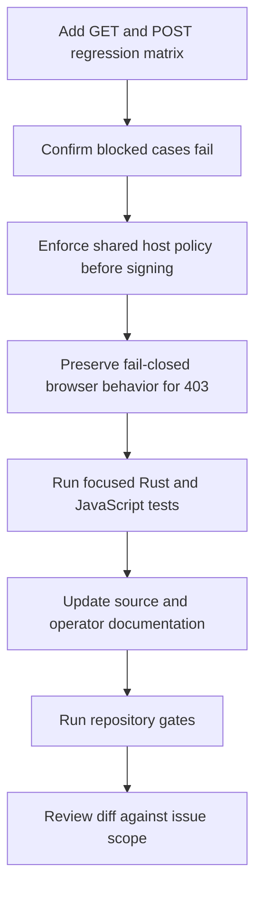

# First-party signing allowlist enforcement implementation plan

> **Status:** Draft, awaiting approval
>
> **For implementers:** Follow `CLAUDE.md`. Keep the change within the approved spec, use target-matched Cargo aliases, and preserve a green workspace after each production edit.

**Goal:** Make `/first-party/sign` reject valid HTTP or HTTPS targets outside a configured `proxy.allowed_domains` before minting a token, without letting the creative runtime bypass that rejection through its raw-URL fallback.

**Issue:** [IABTechLab/trusted-server#1035](https://github.com/IABTechLab/trusted-server/issues/1035)

**Spec:** `docs/superpowers/specs/2026-08-26-first-party-sign-allowlist-enforcement-design.md`

## File map

| File                                                                          | Responsibility                                                                              |
| ----------------------------------------------------------------------------- | ------------------------------------------------------------------------------------------- |
| `crates/trusted-server-core/src/proxy.rs`                                     | Shared host policy, signing-time enforcement, warning log, and GET/POST handler matrix.     |
| `crates/trusted-server-core/src/error.rs`                                     | General allowlist-violation wording and existing `403` mapping.                             |
| `crates/trusted-server-core/src/settings.rs`                                  | Accurate allowlist field documentation and open-mode log.                                   |
| `crates/trusted-server-js/lib/src/integrations/creative/proxy_sign.ts`        | Distinct signed, fallback, and blocked signing outcomes.                                    |
| `crates/trusted-server-js/lib/src/integrations/creative/dynamic_src_guard.ts` | Apply signed URLs, preserve recoverable fallback, and suppress policy-rejected assignments. |
| `crates/trusted-server-js/lib/test/integrations/creative/proxy_sign.test.ts`  | Signing outcome tests.                                                                      |
| `crates/trusted-server-js/lib/test/integrations/creative/image.test.ts`       | Image behavior after a signing-time policy rejection.                                       |
| `crates/trusted-server-js/lib/test/integrations/creative/iframe.test.ts`      | Iframe behavior after a signing-time policy rejection.                                      |
| `docs/guide/api-reference.md`                                                 | Signing endpoint contract, response shape, and off-list response.                           |
| `docs/guide/configuration.md`                                                 | Complete `proxy.allowed_domains` behavior.                                                  |
| `docs/guide/first-party-proxy.md`                                             | Signing, fetch, redirect, and browser rejection behavior.                                   |
| `trusted-server.example.toml`                                                 | Accurate allowlist comment.                                                                 |
| `CHANGELOG.md`                                                                | Unreleased security entry.                                                                  |

No adapter, dependency, route, or configuration-schema changes are expected.

## Execution flow



## Task 1: Add the signing regression matrix

**File:** `crates/trusted-server-core/src/proxy.rs`

- [ ] Add a test-only request builder that accepts a method, signing request URI, and target URL.
  - For GET, form-encode the target as the `url` query parameter.
  - For POST, reuse the existing JSON request builder with `{ "url": target }`.
  - Let the caller select an HTTP or HTTPS signing request so protocol-relative inheritance can be asserted.
  - Keep the helper inside the existing `#[cfg(test)]` module.
- [ ] Add one table-driven test that runs each approved case through GET and POST:
  - exact allowlist match;
  - rejected host;
  - wildcard match;
  - protocol-relative target from an HTTP signing request;
  - empty-list open mode;
  - user information that resembles an allowed host but precedes a blocked destination host; and
  - an allowed host with user information, a non-standard port, path, query, and fragment.
- [ ] Give every assertion a case label containing the method and scenario.
- [ ] Parse successful JSON responses and assert `200 OK` plus a signed `/first-party/proxy` `href`.
- [ ] For the protocol-relative case, assert that `base` or decoded `tsurl` uses the inherited `http://` scheme for both methods.
- [ ] For rejected cases, assert:
  - `handle_first_party_proxy_sign` returns an error;
  - the current context is `TrustedServerError::AllowlistViolation`; and
  - its mapped status is `403 Forbidden`.
- [ ] Leave existing invalid-URL, denylist, protocol-inheritance, non-standard-port, oversized-body, and streaming-body tests intact.

Run the focused test and confirm the rejected-host and user-information bypass cases fail because the current handler signs them:

```bash
cargo test-fastly proxy_sign
```

**Acceptance:** the matrix exercises fourteen method/case combinations. It proves that matching uses the parsed host rather than the full authority and verifies scheme inheritance for GET and POST.

## Task 2: Enforce the shared host policy before signing

**Files:**

- `crates/trusted-server-core/src/proxy.rs`
- `crates/trusted-server-core/src/error.rs`
- `crates/trusted-server-core/src/settings.rs`

- [ ] Rename the private `redirect_is_permitted` helper to `is_host_permitted`.
  - Update its documentation to describe host policy rather than redirects.
  - Update the initial-target and redirect call sites.
  - Rename or update existing helper tests without changing their assertions.
- [ ] Generalize `TrustedServerError::AllowlistViolation`:
  - describe a proxy host blocked by `proxy.allowed_domains`;
  - change the display text from redirect-specific wording to host-policy wording; and
  - leave status mapping and generic client-facing body unchanged.
- [ ] In `handle_first_party_proxy_sign`, after URL parsing and HTTP/HTTPS validation:
  - require `parsed.host_str()`;
  - call `is_host_permitted(&settings.proxy.allowed_domains, host)`;
  - when rejected, log one warning containing the host but not the complete URL; and
  - return `TrustedServerError::AllowlistViolation { host }`.
- [ ] Keep the check before `SystemTime::now()`, `tsexp` construction, and `build_proxy_url_with_extras`, so rejected targets do not reach token work.
- [ ] Preserve the existing `rewrite.exclude_domains` check before parsing and allowlist enforcement.
- [ ] Update the signing handler's `# Errors` documentation to include missing hosts and allowlist rejection.
- [ ] Update `Proxy::allowed_domains` documentation so it covers signing, initial proxy targets, and redirects.
- [ ] Update the empty-list debug log so it describes open host policy rather than redirects only.

Run focused tests:

```bash
cargo test-fastly proxy_sign
cargo test-fastly is_host_permitted
cargo test-fastly allowlist
```

Then run the full Fastly target suite after the production edit:

```bash
cargo test-fastly
```

**Acceptance:** all fourteen signing cases pass, fetch-time tests remain green, off-list signing returns `AllowlistViolation`, and no rejected target reaches signature construction.

## Task 3: Preserve browser blocking for allowlist rejection

**Files:**

- `crates/trusted-server-js/lib/src/integrations/creative/proxy_sign.ts`
- `crates/trusted-server-js/lib/src/integrations/creative/dynamic_src_guard.ts`
- `crates/trusted-server-js/lib/test/integrations/creative/proxy_sign.test.ts`
- `crates/trusted-server-js/lib/test/integrations/creative/image.test.ts`
- `crates/trusted-server-js/lib/test/integrations/creative/iframe.test.ts`

- [ ] Replace the overloaded `string | null` signing result with a discriminated outcome for:
  - `signed`, carrying the proxy `href`;
  - `fallback`, for failures that retain direct loading; and
  - `blocked`, for policy rejection.
- [ ] Map signing responses as follows:
  - a successful response with a valid `href` returns `signed`;
  - `403 Forbidden` returns `blocked`;
  - network errors, malformed success responses, and non-403 HTTP failures return `fallback`.
- [ ] Update the dynamic source guard:
  - apply the proxy URL for `signed`;
  - apply the raw URL for `fallback`; and
  - for `blocked`, clear the pending assignment without invoking the native setter or applying the raw URL.
- [ ] Keep an element's previous resource unchanged when a later assignment is blocked.
- [ ] Preserve stale-request protection through the existing request ID check.
- [ ] Add `proxy_sign` tests for successful, blocked, and fallback outcomes.
- [ ] Add image and iframe tests proving a mocked `403` does not apply the raw external URL.
- [ ] Keep the existing network-failure tests proving direct fallback.

Run focused JavaScript tests:

```bash
(
  cd crates/trusted-server-js/lib
  npx vitest run \
    test/integrations/creative/proxy_sign.test.ts \
    test/integrations/creative/image.test.ts \
    test/integrations/creative/iframe.test.ts
  npm run format
  node build-all.mjs
)
```

**Acceptance:** a `403` leaves the attempted image or iframe URL unapplied, while successful signing and recoverable fallback retain their current behavior.

## Task 4: Update maintained documentation

**Files:**

- `docs/guide/api-reference.md`
- `docs/guide/configuration.md`
- `docs/guide/first-party-proxy.md`
- `trusted-server.example.toml`
- `CHANGELOG.md`

- [ ] Update the `/first-party/sign` API reference:
  - explain that a non-empty `proxy.allowed_domains` is enforced before signing;
  - state that a valid off-list host returns `403 Forbidden`;
  - state that an empty list is open mode; and
  - correct the response example to the actual `href` and `base` fields.
- [ ] Update the configuration guide's `[proxy]` field table and detailed behavior:
  - signing targets, initial fetch targets, and redirect targets are covered;
  - exact, wildcard, case-insensitive, and empty-list behavior stays unchanged.
- [ ] Update the first-party proxy guide:
  - add the signing check beside `/first-party/sign`;
  - describe the allowlist as applying at signing, initial fetch, and every redirect hop; and
  - state that the creative runtime does not load a target directly after an allowlist `403`.
- [ ] Update the example configuration comment so it no longer describes `allowed_domains` as redirect-only.
- [ ] Add a concise Unreleased Security changelog entry covering early rejection and fail-closed runtime handling.
- [ ] Use fictional `example.com` hosts throughout.
- [ ] Leave historical `docs/superpowers/` artifacts and Prebid-specific guides unchanged.

Run documentation checks:

```bash
(
  cd docs
  npm run lint
  npm run format
  npm run build
)
```

**Acceptance:** maintained source and operator documentation agree on signing, initial fetch, redirects, matching, open mode, browser rejection, and `403` behavior.

## Task 5: Run full verification

- [ ] Check Rust formatting:

```bash
cargo fmt --all -- --check
```

- [ ] Run all adapter-aligned test suites and parity tests:

```bash
cargo test-fastly
cargo test-axum
cargo test-cloudflare
cargo test-spin
cargo test --manifest-path crates/trusted-server-integration-tests/Cargo.toml --test parity
```

- [ ] Run every target-specific Clippy gate:

```bash
cargo clippy-fastly
cargo clippy-axum
cargo clippy-cloudflare
cargo clippy-cloudflare-wasm
cargo clippy-spin-native
cargo clippy-spin-wasm
```

- [ ] Run the JavaScript gates:

```bash
(
  cd crates/trusted-server-js/lib
  npx vitest run
  npm run format
  node build-all.mjs
)
```

- [ ] Repeat the documentation gates after any formatting or wording correction:

```bash
(
  cd docs
  npm run lint
  npm run format
  npm run build
)
```

- [ ] Check the final diff and workspace:

```bash
git diff --check
git status --short
git diff -- \
  crates/trusted-server-core/src/proxy.rs \
  crates/trusted-server-core/src/error.rs \
  crates/trusted-server-core/src/settings.rs \
  crates/trusted-server-js/lib/src/integrations/creative/proxy_sign.ts \
  crates/trusted-server-js/lib/src/integrations/creative/dynamic_src_guard.ts \
  crates/trusted-server-js/lib/test/integrations/creative/proxy_sign.test.ts \
  crates/trusted-server-js/lib/test/integrations/creative/image.test.ts \
  crates/trusted-server-js/lib/test/integrations/creative/iframe.test.ts \
  docs/guide/api-reference.md \
  docs/guide/configuration.md \
  docs/guide/first-party-proxy.md \
  trusted-server.example.toml \
  CHANGELOG.md
```

**Acceptance:** all required gates pass, or the final report names an exact external blocker without claiming the blocked check passed.

## Final review checklist

- [ ] GET and POST enforce the same policy after reaching the normalized parsed URL.
- [ ] User information and ports cannot confuse target-host extraction.
- [ ] Ports, paths, queries, fragments, and user information do not participate in matching.
- [ ] Protocol-relative targets inherit the request scheme, and both methods assert that scheme.
- [ ] Empty `proxy.allowed_domains` remains open mode.
- [ ] Exact and wildcard behavior remains case-insensitive and dot-boundary safe.
- [ ] Denylisted, malformed, unsupported-scheme, and missing-host errors retain their existing categories.
- [ ] Rejection logs contain the host and omit the complete target URL.
- [ ] Fetch-time initial-target and redirect enforcement is unchanged.
- [ ] Error status and generic client-facing response behavior are unchanged outside the new early rejection.
- [ ] A signing-time `403` cannot become a direct browser request.
- [ ] Network errors, malformed success responses, and non-403 signing failures retain direct fallback.
- [ ] Source docs, maintained guides, example configuration, and changelog describe the complete behavior.
- [ ] No auth, rate limiting, Origin, CORS, IP, DNS, token, expiry, adapter, route, dependency, or configuration-schema work entered the diff.
