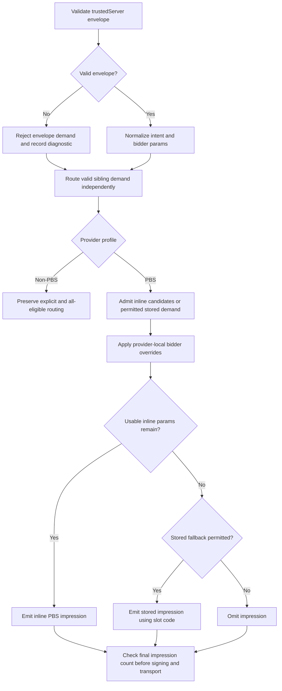

# PBS stored-request intent implementation plan

Status: Implemented and verified. All applicable Task 6 gates passed; independent review found no correctness issues. Deployment has not been performed.

Issue: [IABTechLab/trusted-server#1086](https://github.com/IABTechLab/trusted-server/issues/1086)

Goal: Let TSJS invoke non-PBS all-eligible providers without inventing PBS stored demand. A slot without usable inline PBS params or permitted stored demand must not enter the outbound PBS request or invalidate valid sibling impressions.

## Baseline and scope

This plan follows the configuration-driven provider implementation merged in [#1016](https://github.com/IABTechLab/trusted-server/pull/1016). Source review used `origin/main` at `d704d0ab0c5916d429b80a5707c0f2d74b99cab1`.

The parent fast-forwarded `fix/pbs-stored-requests` to `d704d0ab` before implementation and preserved this plan as an untracked file. Initial `git status --short` showed only this plan. No unrelated changes were present.

Scope correction approved during implementation: the baseline compiler already rejects PBS `all_eligible` in `auction/plan.rs`. Do not enable it or mutate compiled plans for tests. Runtime PBS tests use supported explicit routing and server-owned trusted routes. The existing `compiler_rejects_all_eligible_for_prebid_server_only` regression covers that boundary; APS/standard all-eligible behavior remains supported.

Keep the change limited to intent admission, provider routing, PBS request construction, TSJS envelope generation and refresh state, and their tests and documentation. No dependency, adapter, provider-configuration, or endpoint changes are expected.

Explicit stored IDs, browser-selected provider IDs, revised stored-demand fanout, and removal of legacy inference are out of scope.

## Contract

The field lives inside `trustedServer.params`, beside `bidderParams` and `zone`:

```json
{
  "bidder": "trustedServer",
  "params": {
    "bidderParams": {},
    "storedRequest": false
  }
}
```

- `false` disables stored-request fallback for every PBS provider for this slot. It does not disable valid inline demand or eligible APS/standard providers.
- `true` explicitly permits stored-request fallback. Usable inline params still take precedence within each PBS provider. If overrides leave no usable inline params, the provider may use the slot code as its stored impression ID.
- Omission retains legacy behavior for existing direct `/auction` callers and server-generated opportunities. Preserve both empty-envelope stored inference and the existing fallback when routed empty bidder objects remain unusable after overrides.
- Explicit `null`, strings, numbers, arrays, and objects are invalid values. Do not deserialize through plain `Option<bool>` or use `as_bool().unwrap_or(...)`, which would conflate invalid values with omission.
- Invalid intent rejects the complete envelope atomically, including its inline params and zone. Increment the existing malformed-envelope diagnostic. Do not reinterpret rejection as missing demand. Valid direct sibling bidder entries and non-PBS all-eligible participation retain their existing behavior; this does not introduce whole-request HTTP rejection.
- Browser input still cannot name provider routes. Intent grants no new provider-selection authority. Explicit and legacy stored demand retain existing PBS fanout for this fix.

Internally, introduce a narrow `StoredRequestIntent` enum with `Disabled`, `Explicit`, and `Legacy` states. Retain the distinction through provider-local request construction. Legacy inference depends on the original admitted shape, not merely the map left after route filtering. If needed, carry that admission fact as a payload of `Legacy`, rather than adding independently mutable flags that must agree with the enum. Existing routed candidate params remain necessary for legacy post-override fallback.

A malformed envelope must normalize to no stored permission, not a default `Legacy` state. Keep parsing and validation in `auction/routing.rs` rather than repeatedly inspecting raw JSON in providers.

## Demand flow



## Target files

Paths below are relative to the repository root.

- `crates/trusted-server-core/src/auction/routing.rs`: intent normalization, legacy admission facts, provider-local intent, PBS admission rules, and routing tests.
- `crates/trusted-server-core/src/auction/openrtb.rs`: post-override demand decisions, impression omission, and final empty-request handling.
- `crates/trusted-server-core/src/auction/openrtb/tests.rs`: serialized request and override regressions.
- `crates/trusted-server-core/src/auction/orchestrator.rs`: transport-level mixed-slot and no-request regressions using existing test support.
- `crates/trusted-server-core/src/auction/formats.rs`: wire-to-auction regression coverage and accurate request documentation. Avoid adding a second envelope parser.
- `crates/trusted-server-core/src/creative_opportunities.rs`: preserve and test server-generated stored demand and zone behavior; change production generation only if required by the new internal model.
- `crates/trusted-server-js/lib/src/integrations/prebid/index.ts`: synthetic envelope defaults, publisher intent preservation, immutable snapshots, and refresh reconstruction.
- `crates/trusted-server-js/lib/test/integrations/prebid/index.test.ts`: initial, repeated, and refresh auction payload tests.
- `crates/trusted-server-js/lib/test/core/auction.test.ts`: prove shared serialization retains the boolean without changing `core/auction.ts` unless a test exposes a need.
- `crates/trusted-server-js/lib/test/prebid-artifact-integration.test.mjs`: built-adapter payload expectations.
- `docs/guide/api-reference.md`, `docs/guide/integrations/prebid.md`, and `docs/guide/auction-orchestration.md`: intent semantics, examples, and deployment compatibility.
- `CHANGELOG.md`: concise unreleased fix entry.

## Task 1: Establish the baseline and failing evidence

- [x] Complete the approved branch update and inspect `git status`.
- [x] Run the current routing, PBS builder, and Prebid JS test groups before changing production code. Record environmental failures separately from product failures.
- [x] Add focused regressions in small steps, running each before its production fix. Do not bulk-update snapshots to conceal changed demand.
- [x] First prove that TSJS should serialize `storedRequest: false` for a generated all-eligible envelope but currently omits it.
- [x] Prove that an explicit `true` empty envelope should retain PBS demand and a `false` envelope with valid inline params should retain those params. The current unknown-field validator rejects both, so these distinguish missing support from a working fix.
- [x] Preserve existing omitted-field tests as compatibility evidence. A `false` empty-envelope skip test alone is insufficient: the old validator already rejects the unknown field and can make that assertion pass for the wrong reason.

Focused commands:

```bash
cargo test-fastly auction::routing::tests
cargo test-fastly auction::openrtb::tests
(
  cd crates/trusted-server-js/lib
  npx vitest run test/integrations/prebid/index.test.ts test/core/auction.test.ts
)
```

Acceptance: saved command output identifies at least one relevant failing Rust assertion and one failing JS serialization assertion before their production changes.

## Task 2: Normalize intent and enforce PBS routing

- [x] Add strict optional-field parsing to the existing envelope allowlist and atomic validator. Validate intent before returning from any missing, null, or empty `bidderParams` branch.
- [x] Introduce the internal intent type and carry the required legacy admission facts into `ProviderSlotInput`.
- [x] For PBS, route a slot only when it has assigned inline candidates or permitted stored demand. `AllEligible` alone cannot override this rule, including for malformed envelopes.
- [x] Keep non-PBS routing unchanged. Preserve existing server-owned route handling without exposing it through the browser envelope; a trusted route alone must not cause a demandless PBS wire impression.
- [x] Retain empty object candidates for configured envelope bidders until provider overrides run. Do not treat an empty object as usable inline demand at the final wire boundary.
- [x] Do not turn unconfigured bidders removed by plan filtering into new stored demand when intent is disabled.
- [x] Test two explicit PBS providers plus APS, retaining compiler rejection of all-eligible PBS configurations, empty envelopes, empty bidder objects, unconfigured bidders, and mixed inline ownership.
- [x] Test every malformed intent type, a malformed envelope containing valid-looking inline params, and preservation of independent valid direct demand. Assert diagnostics and absence of stored fallback.
- [x] Retain omitted-field direct `/auction` conversion coverage and the server-generated creative-opportunity stored-request/zone regression.

Run the routing and format test groups after each focused change:

```bash
cargo test-fastly auction::routing::tests
cargo test-fastly auction::formats::tests
cargo test-fastly creative_opportunity_canonical_slot_feeds_shared_stored_router_with_zone
```

Acceptance: `false` suppresses PBS providers without candidate demand while APS remains eligible. Explicit and legacy demand retain their documented routes.

## Task 3: Enforce intent after overrides and prove outbound requests

The current `apply_prebid` fallback uses `has_trusted_stored_request() || !slot.bidder_params().is_empty()`. Updating the router alone leaves this second source of stored inference intact.

- [x] First add and run a builder regression for `false` with a configured bidder whose params remain `{}` after overrides. At this stage it must expose the remaining fallback bug.
- [x] Apply overrides before deciding whether inline params are usable. Preserve the positive case where an override fills an empty object.
- [x] Replace implicit stored inference with the provider-local intent policy. Emit inline demand first; otherwise emit stored demand only when allowed; otherwise omit the impression.
- [x] Preserve slot/impression pairing while filtering. Do not remove impressions and then zip the shortened list with the original slots, which could attach another slot's params or stored ID.
- [x] Check for `NoImpressions` after profile augmentation, before final signing and transport. The existing pre-augmentation check is insufficient once PBS can drop impressions.
- [x] Keep omitted-intent empty-candidate fallback covered. Add `true` with inline params, `true` with unusable post-override params, and `false` with override-populated params.
- [x] Using the existing deterministic executor/orchestrator test support, capture an actual serialized PBS transport request containing a valid inline slot beside a synthetic no-PBS slot. Assert only the valid impression is sent, no stored reference appears for the omitted slot, and the valid bid survives.
- [x] Repeat the mixed routing case across two PBS instances and APS. Assert no-demand PBS providers make zero requests and APS still runs.
- [x] Test an explicit PBS request whose last candidate disappears after overrides. All-eligible PBS is rejected by the compiler and is not a reachable runtime case. Assert zero transport calls, not a serialized empty `imp` array or a debug assertion failure.

```bash
cargo test-fastly auction::openrtb::tests
cargo test-fastly auction::orchestrator::tests
```

Acceptance: evidence observes both the final wire payload and the absence of transport for empty requests. No live PBS service is required to prove the offending impression is absent. Do not claim this prevents HTTP 400 responses caused by unrelated invalid bidder params.

## Task 4: Emit and preserve browser intent

- [x] Add `storedRequest: false` to every newly generated TSJS envelope without publisher-supplied stored intent, including envelopes currently carrying inline candidates. Client-side filtering cannot predict the final server-local demand after routing and overrides.
- [x] Preserve a publisher-authored existing envelope's `true`, `false`, or omitted state during ordinary `requestBids` reuse. Do not rewrite legacy publisher intent merely because its bidder map is empty.
- [x] Extend the request-scoped snapshot with stored intent and preserve field presence. Do not coerce invalid authored values into omission or `false`; leave server validation authoritative.
- [x] Recover intent during synthetic refresh using the same live-ad-unit authority and snapshot fallback as bidder params. Distinguish a publisher-authored omitted legacy envelope from no recovered envelope, which needs the synthetic `false` default.
- [x] Keep intent attached to the slot when code aliases such as container IDs are used. Reuse existing refresh lookup rules rather than adding another matching policy.
- [x] Cover initial empty envelopes, repeated calls on mutated ad units, synthetic refresh without recovered demand, publisher `true` and `false`, legacy omission, live data replacing a stale snapshot, snapshot-only recovery, and client-side bidder preservation.
- [x] Assert actual JSON request bodies through `buildRequests`/`buildAdRequest`, not just intermediate objects. Update the built-artifact expectation as well.

```bash
(
  cd crates/trusted-server-js/lib
  npx vitest run test/integrations/prebid/index.test.ts test/core/auction.test.ts
  npx vitest run test/prebid-artifact-integration.test.mjs
  node build-all.mjs
)
```

Acceptance: TSJS-generated no-stored-demand envelopes remain explicitly disabled on initial and refresh requests, while authored explicit and legacy stored demand are preserved.

## Task 5: Document and sequence deployment

- [x] Document field location, all three valid wire states, invalid `null`, inline-first behavior, post-override fallback, and unchanged server-owned routing authority.
- [x] Show separate examples for synthetic no-PBS demand and intentional stored demand using `example.com` data.
- [x] Update comments that equate every empty bidder map with a stored request.
- [x] Separate server support from TSJS emission in the delivery sequence. Deploy and verify server support on all serving instances before distributing the new JS bundle. If publishing automatically couples the artifacts, resolve the release mechanism before rollout rather than assuming staging is possible.
- [x] Document that the pre-fix #1016 router rejects unknown envelope fields. Early JS deployment can discard valid inline envelope demand, not just retain the original stored-lookup bug.
- [x] Document rollback ordering: after new JS has reached browsers or caches, do not roll back to a server that rejects `storedRequest`. Keep compatible server admission until old clients can safely be served again.
- [x] Keep omission supported in this change. Record removal criteria for a separate migration: inventory direct callers and server-generated paths, migrate them to explicit intent, account for cached clients, and approve a versioned contract change. Do not add an arbitrary expiry or a new telemetry system here.

## Task 6: Full verification and handoff

Shared core changes affect every adapter. Run the repository's applicable gates before PR handoff:

```bash
cargo test-fastly
cargo test-axum
cargo test-cloudflare
cargo test-spin
./scripts/test-cli.sh
cargo fmt --all -- --check
cargo clippy-fastly
cargo clippy-axum
cargo clippy-cloudflare
cargo clippy-cloudflare-wasm
cargo clippy-spin-native
cargo clippy-spin-wasm
(
  cd crates/trusted-server-js/lib
  npx vitest run
  npm run lint
  npm run format
  node build-all.mjs
)
(
  cd docs
  npm run format
  npm run build
)
git diff --check
git status --short
```

- [x] Inspect the final diff against this plan. Preserve unrelated edits and avoid broad formatting churn.
- [x] Report changed files, failing-before and passing-after commands, full gate results, outbound payload/zero-I/O evidence, and any unavailable runtime checks.
- [x] Confirm no browser provider selector, explicit stored ID feature, legacy-removal change, or unrelated adapter refactor entered the patch.
- [x] Keep remaining risks explicit: legacy omitted callers can still infer stored demand; intentional stored requests still fan out and may use nonexistent slot-code IDs; the release depends on server-first deployment.

### Focused implementation evidence

Logs are saved under `/tmp/pbs-intent/`.

- Baselines passed: routing, OpenRTB builder, and the Prebid/shared JS test groups.
- `red-routing-assertion.log` records the old validator rejecting explicit stored intent, with only APS routed rather than APS plus both PBS instances.
- `red-js.log` records serialized generated intent as `[undefined, undefined]` instead of `[false, false]`.
- `red-post-override.log` records the remaining fallback bug after the router fix: disabled empty candidates still produced a stored impression instead of `NoImpressions`.
- Routing, builder, format conversion, creative-opportunity stored/zone compatibility, compiler boundary, orchestrator, and JS serialization/refresh groups passed after the changes. The transport test captures one or two valid PBS wire requests beside APS and observes zero PBS calls when all PBS candidates are unusable.
- Built-artifact integration and `node build-all.mjs` passed. Source changes did not require a shared serializer or creative-opportunity generator change.
- Early local failures were test setup issues, not environment blockers: a JS helper was scoped to a sibling suite; the first Rust rerun briefly hid a still-used method behind `cfg(test)`; a planned PBS AllEligible fixture hit the pre-existing compiler rejection. These were corrected without changing dependencies or configuration. The meaningful red assertions above were then captured independently.

Final focused results: 16 routing, 29 OpenRTB, 33 formats, 77 orchestrator, one creative-opportunity compatibility, and one PBS configuration-boundary test passed. The combined JS source/shared/built-artifact group passed 191 tests.

### Full verification results

All Task 6 commands above were executed. Logs and exact command metadata are under `/tmp/pbs-task6-gates/`.

- `cargo test-fastly`: 2,886 passed, 10 explicitly ignored, including doctests; executed through Viceroy.
- `cargo test-axum`: 41 passed. `cargo test-cloudflare`: 44 passed. `cargo test-spin`: 86 passed. `./scripts/test-cli.sh`: 87 passed.
- `npx vitest run`: 923 tests passed across 45 files, with no type errors. JS lint, formatting, and `node build-all.mjs` passed.
- Rust formatting, documentation formatting/build, and `git diff --check` passed.
- All six clippy aliases initially failed on the new parser's redundant closure. The parent replaced it with `serde_json::Map::is_empty` and corrected one new test URI to `publisher.example.com`. All six clippy aliases, Rust formatting, the 16 routing tests, the 29 OpenRTB tests, and diff checks passed afterward. The full test suites ran before these two mechanical edits and were not repeated in full.
- Independent read-only correctness review inspected the diff and reran focused Rust and JS tests. It found no correctness issues. Parent inspection confirmed the result and the two subsequent mechanical edits.
- No live PBS or deployed-adapter check was run. Transport tests establish that the offending impressions are absent, not that all possible PBS HTTP 400 responses are prevented.
- Documentation dependency installation used the existing lockfile and reported 17 vulnerabilities. No dependency changes were made. Documentation build warnings about `vcl` highlighting and bundle size were non-blocking.

Actual changed files:

- `crates/trusted-server-core/src/auction/routing.rs`
- `crates/trusted-server-core/src/auction/openrtb.rs`
- `crates/trusted-server-core/src/auction/openrtb/tests.rs`
- `crates/trusted-server-core/src/auction/orchestrator.rs`
- `crates/trusted-server-core/src/auction/formats.rs`
- `crates/trusted-server-js/lib/src/integrations/prebid/index.ts`
- `crates/trusted-server-js/lib/test/integrations/prebid/index.test.ts`
- `crates/trusted-server-js/lib/test/core/auction.test.ts`
- `crates/trusted-server-js/lib/test/prebid-artifact-integration.test.mjs`
- `docs/guide/api-reference.md`
- `docs/guide/integrations/prebid.md`
- `docs/guide/auction-orchestration.md`
- `CHANGELOG.md`
- `docs/superpowers/plans/2026-09-10-pbs-stored-request-intent.md`

Remaining risks are the preserved legacy inference and stored-demand fanout, unavailable slot-code stored IDs, and server-first release ordering. The Rust artifact embeds JS, so deployment requires a server-support-only build retaining old JS before the full build. Verification did not change dependencies or perform deployment.
