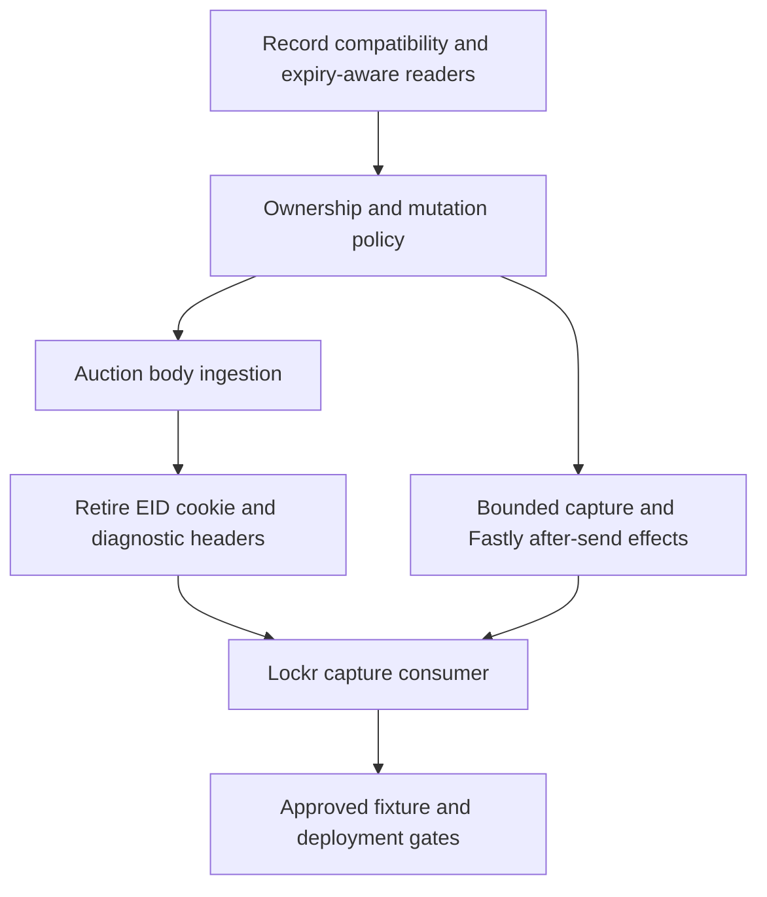

# Server-side identity foundation and Lockr capture implementation plan

**Status:** Milestones 1–5 implemented in the draft change. Local verification is recorded below. Provider activation and deployment compatibility remain gated; this is not live acceptance.

**Specs:** [Foundation](../specs/2026-10-09-server-side-identity-foundation-design.md), [Lockr capture](../specs/2026-10-08-lockr-identity-capture-design.md), [KV snapshot and recovery](../specs/2026-07-10-kv-eid-request-snapshot-ec-recovery-design.md). The [existing LiveRamp browser design](../specs/2026-08-21-liveramp-integration-design.md) does not approve a native resolver.

**Goal:** Persist registered browser auction EIDs and trusted Lockr proxy observations on an existing, consenting EC row, retain expiry and writer metadata through every mutation, and expose only usable records to later auctions. Keep the response intact and send it before capture writes on Fastly. No extra EID cookie, root creation by acquisition, or new provider fetch loop.



## Boundaries and starting code (pre-implementation baseline)

- Core EC owns record and mutation policy: `ec/kv_types.rs` stores schema-v1 `KvPartnerId { uid }`; `ec/kv.rs` has browser `sync_eid_cookie_updates_from_snapshot` with one CAS plus one conflict read, and authoritative `apply_partner_id_updates`, `upsert_partner_ids_from_snapshot`, `upsert_partner_id`, `upsert_partner_id_if_exists`. `ec/batch_sync.rs` calls the last method; `ec/pull_sync.rs` aggregates fill-missing responses. `ec/generation.rs`, `ec/finalize.rs` and `ec/admin.rs` participate in creation, recovery, withdrawal and administrative reads. `ec/identify.rs` separately returns partner UIDs without using `resolve_partner_ids`; include it in expiry-aware reader coverage. Audit every write/serialize site before enabling metadata. Tombstoning deliberately removes identity payload; ordinary mutations must not.
- `ec/registry.rs` builds `PartnerRegistry` from `settings.rs` `EcPartner`; `config.rs::validate_settings_for_deploy` and `validate_settings_for_runtime` are the shared CLI push/validate and startup validation boundaries. `integrations/registry.rs::IntegrationRegistration` and `IntegrationRegistry::with_plan` own capability discovery. Do not introduce a parallel vendor list.
- `auction/endpoints.rs::handle_auction` parses body EIDs, falls back to `ts-eids`, loads an `EcKvSnapshot` and hands it to finalization; its orchestration error path currently returns `Err`. `ec/finalize.rs::ec_finalize_response` currently ingests cookie EIDs plus `sharedId`. `ec/prebid_eids.rs` already normalizes EIDs into source-keyed updates; `ec/eids.rs::resolve_partner_ids` supplies registered KV IDs. `openrtb.rs::Eid` currently has only `source` and `uids`.
- `integrations/lockr.rs::handle_api_proxy` buffers POST bytes once, forwards them and returns the upstream response uninspected. It currently logs a full target URL, including query, which must be redacted before captured traffic is enabled. `integrations/mod.rs::collect_response_bounded` is destructive on overflow and cannot be used for capture pass-through. Fastly `app.rs::EcFinalizeState` carries request context, while `main.rs::edgezero_main` removes extensions before conversion and sends before `run_edgezero_pull_sync_after_send`.
- `auction/formats.rs` emits EID diagnostic headers; `ec/finalize.rs` clears them on withdrawal; `constants.rs::INTERNAL_HEADERS` strips inbound variants. The JS writer is `trusted-server-js/lib/src/integrations/prebid/index.ts::syncPrebidEidsCookie`; `ec/admin.rs` has an EID-cookie diagnostic endpoint. `cookies/template_cache_policy.rs` and `publisher.rs` still recognize the cookie. Inventory these consumers before deleting a constant or admin diagnostic. See also `adapter-fastly/src/app.rs` cookie extraction and `auction/types.rs` stale cookie documentation.

## Check discipline

Each numbered milestone contains smaller red/green steps. Finish and check one step before starting the next; do not change every listed file at once. Add the regression, observe failure, implement the step, then rerun it and adjacent tests. Compatibility tests for already-correct behavior must stay green rather than be forced to fail.

Use these focused commands from the repository root, replacing the example filter with the affected module or regression:

```bash
cargo test-fastly ec::kv_types::tests
cargo test-fastly ec::kv::tests
cargo test-fastly auction::endpoints::tests
cargo test-fastly integrations::lockr::tests
cargo test-axum <test-filter>
HOST_TARGET="$(rustc -vV | awk '/host:/ { print $2 }')"
cargo test --package trusted-server-cli --target "$HOST_TARGET" <test-filter>
(cd crates/trusted-server-js/lib && npx vitest run test/integrations/prebid/index.test.ts)
```

`scripts/test-cli.sh` takes a host target, not a test filter, and runs the full CLI suite plus browser fixtures. Reserve it for the final integration gate. Verify each selected filter actually executes its intended tests. A compile-only check does not prove persistence. Reuse passing evidence while relevant source, fixtures, config and environment remain unchanged. Run broader suites and target-matched lint at stable integration checkpoints, not after each edit.

### 1. Land compatible lifecycle records and reads, without managed writes

**Files:** `crates/trusted-server-core/src/ec/{mod.rs,kv_types.rs,kv.rs,eids.rs,identify.rs,admin.rs,prebid_eids.rs,finalize.rs,generation.rs,batch_sync.rs,pull_sync.rs}`, `crates/trusted-server-core/src/auction/endpoints.rs`, plus existing tests in those files. Change an existing writer only where the audit finds UID-only reconstruction or equality, stale metadata inherited by a replacement UID, or a mutation-policy bypass. Keep schema version 1 and optional/defaulted `expires_at`, `writer`, `revision` fields. A legacy UID-only record has unknown expiry and no inferred provider provenance. Do not implement `updated_at`, `invalidated_at`, attempt state or a refresh scheduler without a current consumer; reserve invalidation semantics for the later provider delivery.

- Red: decode old schema-v1 fixtures; reject unsupported schema; serialize a record with metadata across browser same-UID/different-UID paths, batch push, single partner push, bulk pull, generation/recovery and admin-related round trips. Demonstrate the current UID-only replacement strips metadata. Add equal-UID/different-expiry and equal-UID/equal-metadata cases. Check withdrawal removes payload, not a partial record.
- Green: preserve the existing record where the UID is unchanged, and give legacy authoritative UID replacements an explicit policy that does not inherit a different UID's old expiry. Source ownership will later reject conflicting writes. Assign a non-reused opaque revision for every material managed record change; do not bump on no-op. Test a change that later restores the earlier UID/expiry: it must not restore the earlier revision. Store a known expiry in seconds, reject already-expired `Issued`, retain it when a same-UID observation omits expiry. Do not mistake the existing `KvConsent.updated` for provider freshness.
- Red then green: centralize record usability and test `now < expires_at` versus `now >= expires_at` through `ec/eids.rs::resolve_partner_ids`, `ec/identify.rs` and publisher, `/auction`, SPA `/_ts/page-bids` callers. Obtain usable time through `ec::checked_current_timestamp`, not the epoch-zero failure fallback in `current_timestamp`. Test unavailable time explicitly; a known-expiry record cannot be declared usable without a usable clock. Keep unknown-expiry compatibility unchanged. Suppress an auction-body UID identical to the unusable stored UID before merge, using normalized source matching; a different valid body UID remains current-request-only. No cleanup write on reads. Admin inspection may show retained expired records and their metadata; it is not a delivery API.
- Check: filtered `cargo test-fastly` record, CAS, resolution, publisher and auction tests. Read back serialized KV state in storage tests. **Gate:** do not activate metadata-producing writers until all deployed readers and _all_ old writers have drained. Old binaries discard unknown fields and old readers forward expired UIDs. A passing new-binary test is not a deployment-compatibility proof.

### 2. Validate source owners and separate mutation classes

**Files:** `crates/trusted-server-core/src/settings.rs`, `config.rs`, `ec/{mod.rs,registry.rs,kv.rs,pull_sync.rs,pull_sync_marker.rs,batch_sync.rs}`, `integrations/{registry.rs,mod.rs}`, `crates/trusted-server-cli/src/run.rs` validation tests, `trusted-server.example.toml`; config, registry and KV tests nearby. Add `ec/identity.rs` for common outcomes, trusted update types and the shared acquisition service, and `integrations/identity.rs` for capability contracts and later bounded inspection. These are proposed new paths, not existing modules. Add `identity_owner` to source policy and a capture descriptor with finite source claims to integration registration. Keep disabled acquisition descriptors discoverable, so a `capture_identity = false` kill switch does not invalidate config. No production resolver, named identifier intake, synthetic resolver HTTP protocol or rate-limit state now.

- Red: duplicate/missing/non-claiming owner, disabled owner descriptor, owner with enabled pull or push API conflict, unauthorized integration claiming a source and forged browser metadata. Exercise all three boundaries: `ts config validate`, `ts config push`, and startup `validate_settings_for_runtime`/`IntegrationRegistry::with_plan`. Ensure deploy validation works on unresolved secret references. Existing unowned sources retain legacy push/pull behavior; owned sources must reject legacy authoritative push and skip legacy pull completeness and dispatch, not merely suppress one write after making an outbound request. Resolve the legacy-write configuration decision below before implementing its acceptance rules. `api_token` authenticates read-only `identify` as well as writable `batch-sync`; token presence alone does not prove a conflicting writer. Tests must cover the approved read/write policy without accidentally removing identify access. Update the effective pull-partner set used by completeness, dispatch and `pull_sync_marker.rs` fingerprinting together; an ownership migration must not leave a stale completeness cookie suppressing an eligible legacy pull.
- Green: descriptor claims and runtime registry are one source of truth; validate source policy against claims in the shared deploy/runtime validation functions. Shared service validates trusted origin, registered source, owner, UID length/source count, consent and full EC-ID-bound snapshot. Implement the capture-used `Issued`, `NoChange` and approved withdrawal actions; reserve the remaining outcome contracts without an unused active resolver. Test expiry again at mutation time, because a token can expire between capture and post-send persistence. Browser update cannot set authority or lifecycle metadata. Keep `ec/kv.rs` browser one-CAS/one-conflict-read/no-retry policy distinct from authoritative bounded CAS/re-merge. Authoritative replacement preserves unrelated sources and never creates a missing, failed or tombstoned root. Same UID with changed expiry is a write; unchanged UID and lifecycle metadata is not. A stale result tied to a prior revision must be rejected when revision-conditional mutation becomes necessary; do not expose an unused resolver callback merely to test an imagined provider.
- Check: filtered `cargo test-fastly` config, registry, push/pull and KV tests; host CLI validation tests. Inspect log assertions for redaction.

### 3. Persist browser body once, then retire cookie/header transport

**Files:** `crates/trusted-server-core/src/{auction/endpoints.rs,auction/formats.rs,auction/types.rs,openrtb.rs,ec/prebid_eids.rs,ec/finalize.rs,ec/admin.rs,ec/eids.rs,constants.rs,cookies/template_cache_policy.rs,publisher.rs}`, `crates/trusted-server-adapter-fastly/src/{app.rs,main.rs}`, `crates/trusted-server-js/lib/src/integrations/prebid/index.ts` and its existing tests; update operator docs at `docs/guide/integrations/prebid.md` and `docs/guide/configuration.md` for changed transport. Limit other adapters to compile/behavior parity; they currently have no EC KV graph.

- Red: registered body EIDs enrich an existing root even on no-bid or handled auction-provider error; unknown sources remain current-request-only; no-token/consent-denied/missing/failed/tombstone roots do not write or recover. Prove one combined browser finalization attempt with `sharedId`, using the auction snapshot rather than a second unconditional KV read. Directly reuse the EID-to-update normalization in `ec/prebid_eids.rs`, not a fake cookie. Stage normalized updates in `EcContext` or a typed response effect before dispatch so `Err` paths retain them through the adapter's error conversion; inspect `app.rs` response-finalization behavior rather than assuming an error response keeps extensions.
- Green: keep normal EC finalization timing and publisher-only orphan recovery, including no seeding from the retired cookie. Extend `Eid` with optional string `inserter`/`matcher` and an OpenRTB-compatible integer `mm`, omitted only when absent. Update both the manual parser in `parse_client_auction_eids` and `merge_auction_eids`, not only serde derives. Body-supplied provenance wins over missing KV provenance; preserve empty `matcher` and supplied zero-valued `mm`. Keep existing UID merge precedence and retain UID `ext` for the current auction. Update affected struct constructors and serialization tests. KV-derived EIDs remain registry-`atype` only. Preserve source/UID caps and consent gates. Filter the matching known-expired body UID before merging.
- Only after body tests pass: remove `/auction` cookie fallback, server cookie ingest, JS writer, header emission and old cookie-dependent diagnostics. If retiring an admin route, keep it locally denied with its existing authentication/no-store behavior; do not remove its route and forward admin credentials to publisher fallback. Apply that protection to the Axum and Spin routes as well as Fastly. Keep `x-ts-eids` and `x-ts-eids-truncated` on the inbound strip list; keep EC/consent headers. Keep one transition JS release that expires the old host-only `Path=/` cookie, with a named removal condition: cached bundles that write it have aged beyond the existing one-day max-age and deployment cache lifetime. New servers ignore old bundles' writes. No unconditional server `Set-Cookie` cleanup. Agree an admin diagnostic replacement/removal and identify external header consumers before this deletion.
- Check: filtered `cargo test-fastly` auction/finalize/admin/publisher tests, JS Prebid tests, `rg -n 'ts-eids|x-ts-eids'` review of remaining intentional compatibility references. Verify before/after request cookies and response cache privacy through Fastly tests.

### 4. Add bounded shared capture and one Fastly post-send executor

**Files:** `crates/trusted-server-core/src/integrations/{identity.rs,registry.rs,mod.rs}`, `crates/trusted-server-core/src/ec/{identity.rs,mod.rs,kv.rs,finalize.rs}`, `crates/trusted-server-adapter-fastly/src/{app.rs,main.rs}`; tests beside the boundary. Start with a synthetic capture fixture, not Lockr. A capability declares exact method/path/source claims and interprets a bounded decoded response. The framework associates it with the actual proxied upstream result; inbound client headers/JSON cannot select trusted acquisition.

- Red: 64 KiB original **and separate** 64 KiB decoded JSON cap at exact boundary and +1, compressed expansion, unsupported encoding, decoder failure, malformed capture, streamed oversized response with original prefix replayed, absent or misleading `Content-Length`, and byte-for-byte response/header preservation including encoding and length. Include an oversized single stream chunk and upstream read failure; replay consumed bytes and preserve the underlying stream error rather than manufacturing a capture error response. `collect_response_bounded` cannot be reused because it consumes oversize streams. Bound added capture buffers and decoder working memory; do not copy an oversized incoming chunk into an inspection buffer. Account for retained stream chunks and parser overhead too. No full decompression first.
- Green: inspect only selected proxy responses. A capture failure is a no-op, not a 502 or rewritten body. Stage cloneable effects holding full EC ID, source-validated trusted origin and `EcKvSnapshot`; consume them once before response conversion drops extensions. Before send, expose an approved captured withdrawal to normal finalization so it expires `ts-ec`, removes identity headers and suppresses enrichment. After send, run its existing-key-only tombstone work unless request finalization already handled that identity. A tombstone-only after-send handler cannot change the cookie already sent to the browser. Keep one shared Fastly executor for captured work, with no Lockr-specific branch. Apply withdrawal before capture enrichment and hand **persisted** resulting snapshots to legacy pull sync. `NotRead` may fetch after send; missing and failed never authorize creation. CAS conflicts may refresh, but no unbounded retry or zero-read claim. No-token queues no mutation. If finalization already tombstoned the root, suppress a second tombstone; do not turn a provider timeout into withdrawal.
- Check: filtered `cargo test-fastly` registry/capture/KV/entrypoint tests with a recording send and KV backend. Prove send precedes capture write, no response-byte changes, full-ID association across rotation, failed-write snapshot stays failed, no-token no capture KV work and resulting snapshot changes pull eligibility. Exercise settings-snapshot/reload, finalization-failure and fallback send branches. Failed or withdrawn state must suppress subsequent pull disclosure, not reuse the original live snapshot. Test Axum/Cloudflare/Spin behavior only where an EC KV graph exists; document before-send or unsupported capture on adapters lacking a post-send hook rather than promising persistence.

### 5. Implement Lockr capture behind explicit approval gates

**Files:** `crates/trusted-server-core/src/integrations/lockr.rs`, shared acquisition consent handling in `crates/trusted-server-core/src/{consent/mod.rs,consent/types.rs,ec/consent.rs,ec/identity.rs}`, its tests and sanitized fixtures under its existing test module or a dedicated `crates/trusted-server-core/tests/fixtures/lockr/` directory; `trusted-server.example.toml` and `docs/guide/integrations/lockr.md` for confirmed configuration and operator behavior. Register capture only, not a resolver. Add default-true `capture_identity` kill switch without removing the ownership descriptor. Keep SDK, settings and unlisted paths on the existing proxy path; inspect exact POST `page-view`, `generate-tokens`, `refresh-tokens`, `sync-no-hem-ids`, `revoke-consent` paths. Reuse the already buffered POST bytes for request consent without changing forwarding.

- Fixture gate before enabling each mapping: sanitized SDK `tokenMappings` and `tokenSourceMappings` **and** response examples prove token shape, key/source/type, expiry unit and consent contract. Start with ID5, using `id5id`, `id5-sync.com` and `atype=1`, after its fixture and consent gates pass; decode URL-encoded JSON `advertising_token.universal_uid`, associate `ids.<key_name>.eid` when present, reject mismatched source/oversized UID, convert `identity_expires` milliseconds to seconds and reject expired issue. Do not infer LiveRamp, UID2, EUID, First ID, Yahoo, Criteo or Epsilon token decoding from ID5; leave each unmapped until its own fixture passes. Panorama source/type remains disabled until Lockr confirms it. No provider provenance or `ext` is stored in KV.
- Red: exact route and method selection, aimTokens-only and associated EID, unknown key, source mismatch, non-2xx/malformed/no-token no invalidation, missing/extended expiry, repeat equal observation no write, original/decoded overflow with unchanged proxy response. Consent tests include populated opt-out, malformed non-empty strings, empty optional strings, cookie/body conflict, GPC and otherwise permissive/non-regulated or proxy-mode request policy. Map Lockr's buffered `gppString`, `consentString` and `ccpaString` into named shared consent inputs. Reuse shared decoders and request jurisdiction/expiration policy. Require explicit parse success for populated signals; the existing decoder's absent decoded value or a permissive jurisdiction must not turn malformed body consent into permission. Empty fields impose no positive permission, and body consent can restrict but never override denied request consent. Keep this acquisition check separate from approved explicit withdrawal handling. Never log UID, query-bearing URL, consent string or token; audit shared consent display and error logs as well as Lockr logs. Remove the current full-target-URL logging/error attachment in `lockr.rs` on captured paths, and audit shared error formatting.
- Withdrawal is gated separately: only after Lockr confirms 2xx application-success semantics **and** whether revoke is global EC withdrawal or per-source invalidation. Test revoke despite denied acquisition consent, finalization precedence, cookie expiry and existing-key-only tombstone if global scope is approved. Until then, leave revoke capture disabled and let ordinary request consent withdrawal continue; never infer withdrawal from empty tokens or a network error. Clarify ordering if overlapping SDK calls can return older tokens after newer ones; absent a provider sequence, CAS order is observation order only.
- Check: filtered `cargo test-fastly` Lockr parser/proxy/post-send tests with synthetic responses; no live IDs in fixtures. Then run approved publisher test-route acceptance: consent, unchanged original response, delayed KV readback of UID/source/expiry/writer/revision without exporting values, later bidder payload source presence, same-UID extension, known-expired omission including matching body UID, negative consent and approved revoke. Record statuses, counts and booleans only. Capture stays off for a source until its fixture, consent, ownership and compatibility gates pass.

## Release and rollback

1. Ship optional schema-v1 metadata-aware readers and **every** metadata-preserving writer first, with managed acquisition off. Verify mixed-record fixtures. Obtain deployment propagation and old-invocation drain evidence; old UID-only readers ignore expiry and old writers erase metadata. Confirm operator procedure before the first managed write.
2. Treat browser writer/revision output as metadata activation too; complete the compatibility gate before enabling any path that produces lifecycle metadata. Activate body persistence in a coordinated server release; prove body/no-cookie behavior before the transition JS writer removal. Check diagnostic consumers before header retirement. Roll back the JS transition only with a server that still understands body submission; old cached JS may write the ignored cookie for its remaining lifetime.
3. Deploy synthetic capture framework inactive and verify Fastly send ordering. Although the Lockr setting defaults to true, explicitly deploy `capture_identity = false` until approval and compatibility gates pass; ownership validation must still work. On an approved route, add one confirmed Lockr source with owner and `atype` after resolving conflicting legacy writes or pull configuration. Enable capture, measure source-only counts, KV readback and later auction visibility. Canary first; do not claim first-auction guarantees or automatic retry.
4. Safe immediate mitigation after activation is `capture_identity = false` or removing ownership through an **approved migration**; disabling capture alone does not erase stored expiry. Rolling back to a UID-only binary is unsafe until managed writes stop and expiry-aware read/metadata compatibility is explicitly resolved. Do not automatically transfer owner on module failure. DSR deletion and global consent withdrawal remain authoritative over acquired records.
5. At intermediate checkpoints, run only suites affected by the completed milestone. At the final stable implementation checkpoint, run `cargo fmt --all -- --check`, `cargo test-fastly`, `cargo test-fastly-reuse`, `cargo test-axum`, `cargo test-cloudflare`, `cargo test-spin`, `./scripts/test-cli.sh`, JS tests/build/format, integration parity and affected target-matched clippy aliases per `AGENTS.md`. Reuse unchanged passing results rather than repeat this matrix at every checkpoint. Confirm CI and approved live-route evidence separately. Core tests are not a substitute for an observed post-send KV write and later auction.

## Decisions and remaining approval gates

- The foundation requests revision-conditional invalidation tests but defers `invalidated_at`, invalidation storage and active resolver to later work. Does the first capture delivery need an invalidation marker at all? This plan avoids dead state and blocks source-specific revoke until scope is approved. Native LiveRamp and its intake/refresh questions remain deferred in [#1245](https://github.com/IABTechLab/trusted-server/issues/1245). Cross-browser linkage needs a separate approved design; #1245 is not authorization to build it.
- Implemented ownership policy: reject owned sources with legacy pull enabled. Keep `api_token` read-only for `identify`; reject owned-source batch writes with 403 before limiter/storage. Ownership is validated through deploy/config-push/runtime/startup paths, even with acquisition disabled. Operator ownership migration and invocation drain still need confirmation.
- Implemented `/_ts/admin/eids` retirement as authenticated local 410/no-store/nosniff on all four adapters; unknown admin subpaths remain locally denied. Cookie readers/writer and diagnostic emission are retired; inbound strips remain. External diagnostic consumers must be checked before deployment.
- Confirm deployment drain/rollback for mixed binary versions, external uses of `x-ts-eids` headers, Lockr fixtures and each enabled provider mapping, Lockr consent requirements and revoke semantics/scope. Clarify overlapping SDK response ordering. None is settled by local tests.

## Local implementation verification (2026-10-09)

- `cargo test-fastly`: 219 adapter tests and 2,924 core tests passed, with six core tests ignored; shared-crate and doc tests also passed. `cargo test-fastly-reuse`: 219 passed.
- `cargo test-axum`, `cargo test-cloudflare`, `cargo test-spin`: passed, including authenticated retirement and fallback protection routes. These adapters do not claim post-send KV capture persistence.
- `./scripts/test-cli.sh`: host CLI suite and all four required ignored browser-fixture filters passed. Native `template_build_digest`: ten tests passed.
- Full JS Vitest suite: 48 files, 1,186 tests passed, no type errors. Focused Prebid transport suite: 288 passed.
- Target-matched Clippy passed for Fastly, Axum, Cloudflare native/WASM, Spin native/WASM, CLI and codegen, plus native build-digest tests. Fastly, Axum and Cloudflare development builds passed.
- Recording tests use the actual shared send executor: send sees unchanged KV; factory runs after send; persisted lifecycle state matches the context snapshot consumed by later pull. No effects never opens storage; unavailable storage sends once and leaves KV/context unchanged. Transport tests preserve response parts/bytes and stream errors across independent wire/decoded caps and gzip failures.
- Ownership/config, restrictive consent, missing/failed/withdrawn/full-ID isolation, CAS/no-op/ABA/expiry, browser one-finalization, expiry bypass and withdrawal tests passed. Independent bounded source review found no additional verified privacy/concurrency defect.

Not verified: real provider acceptance, sanitized provider-approved mappings/fixtures, consent/revoke scope approval, overlapping response ordering, deployment propagation/drain, remote CI or external diagnostic consumers. Synthetic fixtures are not provider approval. Keep both Lockr capture switches explicitly false until their independent gates pass. Native LiveRamp, refresh/invalidation scheduling, durable retry and cross-browser linking remain deferred.
