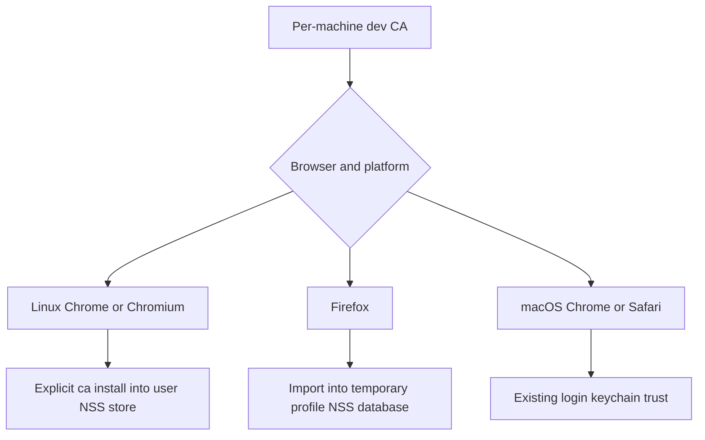

# Linux dev proxy plan

Status: approved, implemented, and independently reviewed with no remaining correctness blockers under the native-install-only scope. Linux checks and native Chrome/Chromium proofs pass. Firefox runtime proof and macOS CI execution remain outstanding.

The parent independently reran the full CLI suite, all 11 trust integration tests,
Rust formatting, CLI Clippy, documentation formatting, and the Chrome XDG browser
proof. All passed. Review identified a launcher-wrapper limitation; source comments
and user documentation now explicitly distinguish skipping known packaging paths
from classifying shell wrappers. The reviewer confirmed this is an unsupported
configuration limit, not a blocker for native installs. Evidence is retained under
`/tmp/ts-linux-evidence/parent-*` and the session's managed review artifacts.

## Goal and scope

Make `ts dev proxy` work on Linux with native Chrome/Chromium and Firefox, while preserving macOS behavior. Keep the proxy engine shared and all new platform code in `trusted-server-cli`.

Recommended first release:

- Headless/manual-client proxy use on Linux.
- Automatic launch of native Chrome/Chromium and Firefox with temporary profiles.
- User-level Chrome/Chromium CA trust through NSS, plus the existing per-profile Firefox import.
- No root requirement, desktop-wide proxy changes, or automatic package installation.
- Safari remains macOS-only. Windows, Snap/Flatpak browser automation, and distro-wide CA installation are out of scope.

The user approved this scope. Browser trust is not the same as system-wide trust. Linux `ca install` must describe exactly which store it changes. Manual clients can use the PEM from `ca path`, such as curl with `--cacert`.

## Findings

The main restriction is deliberate compilation gating, not a macOS-only proxy implementation.

| Area                                        | Current behavior                                                                              | Required change                                                               |
| ------------------------------------------- | --------------------------------------------------------------------------------------------- | ----------------------------------------------------------------------------- |
| `crates/trusted-server-cli/Cargo.toml`      | Proxy dependencies and test dependencies are macOS-only                                       | Enable them for macOS and Linux, not every Unix or native target              |
| `src/commands/dev/mod.rs`                   | Proxy module, command variant, and dispatch are macOS-only                                    | Widen those gates and the empty-enum lint condition                           |
| `src/lib.rs`, `src/run.rs`                  | Output module is macOS-only; comments/help describe a macOS-only proxy                        | Enable output on Linux and update descriptions                                |
| `src/commands/dev/proxy/browser.rs`         | Dormant Linux Chrome command only tries `google-chrome`; Firefox uses `firefox`               | Discover native launcher variants and provide useful missing-browser messages |
| `src/commands/dev/proxy/config.rs`          | `all` always includes Safari; explicit Safari is accepted everywhere                          | Make supported browser selection platform-aware                               |
| CA trust helpers in `browser.rs`            | Non-macOS install only prints instructions; uninstall prints instructions and returns success | Implement Linux trust management and propagate errors                         |
| `tests/proxy_e2e.rs`, `tests/proxy_perf.rs` | Entire suites are macOS-gated                                                                 | Enable on Linux; keep performance workloads explicitly selected               |
| `.github/workflows/test.yml`                | CLI tests and lint only run on macOS                                                          | Add an Ubuntu/macOS matrix                                                    |

Paths beginning with `src/` and `tests/` above are under `crates/trusted-server-cli/`.

The existing networking code uses Tokio, Hyper, and rustls. CA file permissions use Unix APIs that also exist on Linux. The CA directory already honors an absolute `XDG_DATA_HOME`, with a platform data-directory fallback. No proxy-engine rewrite is expected, but Linux compilation and runtime behavior have not yet been tested.

One existing test needs correction when the module becomes reachable on Linux. `restore_system_proxy_if_pending_removes_file_with_empty_service` expects file deletion, while the non-macOS implementation intentionally does nothing. Keep the deletion test macOS-only and add a Linux test proving the function leaves files untouched.

The local machine has `google-chrome-stable`, `chromium`, and `certutil`, but no `google-chrome` or `firefox` executable on PATH. The dormant Chrome launcher would miss both installed browsers. The audit command already has a Chrome/Chromium discovery implementation worth reusing if extraction remains small.

## Trust design

Use NSS `certutil` for Linux browser trust rather than implementing Debian, Fedora, and Arch system trust backends.

[Chromium's Linux certificate documentation](https://chromium.googlesource.com/chromium/src/+/HEAD/docs/linux/cert_management.md) states that Chromium uses a shared NSS database. Since M146 the default is `~/.local/share/pki/nssdb`; an existing `~/.pki/nssdb` takes precedence. Account for XDG configuration and verify the supported browser versions' path-selection behavior before coding the resolver. Do not assume `--user-data-dir` isolates Chromium CA trust.



Extract CA trust operations into `src/commands/dev/proxy/trust.rs` so browser launch does not own install, uninstall, and rotation policy. Keep the implementation small, with platform functions and a testable command boundary rather than a general plugin system.

Required behavior:

- Initialize an absent NSS database without resetting an existing database.
- Repeated install/uninstall converges without duplicate trust or deleting unrelated certificates. Use certificate identity checks, not an unchecked common-name match, for new Linux operations.
- Identify and retain the managed trust destination so uninstall can remove trust even if browser path selection changes. Define handling of an existing legacy and modern database before implementation.
- Distinguish confirmed absence from a failed query, missing `certutil`, permission error, locked database, and failed deletion. Explicit CA commands must not report success on failure.
- `ca regenerate` must leave the old key material untouched if removal from managed persistent trust stores cannot be confirmed. The current non-macOS success stub cannot remain.
- State the limit of that guarantee. Manually imported copies and already-running Firefox temporary profiles are not revoked by removing the shared NSS entry. Document closing launched browsers before rotation and manually removing external imports.
- Never add blanket browser certificate-error bypass flags or disable the browser sandbox.

## Implementation sequence

### 1. Enable and prove the shared proxy on Linux

- [x] Add a CLI regression asserting that `ts dev proxy --help` succeeds on Linux; establish failing-before evidence.
- [x] Widen the Cargo, module, output, dispatch, and integration-test gates to macOS/Linux.
- [x] Fix platform-specific Safari test gating and test the Linux no-op explicitly.
- [x] Run Linux proxy unit and E2E tests. Preserve routing, TLS verification, permissions, non-loopback restrictions, and credential protections.

Target files: CLI `Cargo.toml`, `src/lib.rs`, `src/run.rs`, `src/commands/dev/mod.rs`, proxy `browser.rs`, `tests/proxy_e2e.rs`, and `tests/proxy_perf.rs`.

### 2. Make browser selection and launch work

- [x] Test Linux `all` expansion to Chrome and Firefox, explicit Safari rejection, and unchanged macOS selection.
- [x] Discover `google-chrome`, `google-chrome-stable`, `chromium`, and `chromium-browser` deterministically. Use the existing `which` dependency. Reuse audit discovery only if doing so avoids a second implementation without expanding supported packaging accidentally.
- [x] Keep HTTPS-only proxy arguments, configured listen addresses, temporary profiles, and first-rule navigation.
- [x] Test launcher arguments and missing executables without opening real browsers. Report spawn/configuration failures clearly.

Target files: proxy `config.rs`, `browser.rs`, and optionally a small shared discovery module plus `audit/browser_collector.rs`.

### 3. Implement Linux CA trust safely

- [x] First verify shared NSS lookup and trusted navigation with a disposable HOME and a native browser. Do not touch the developer's real trust store.
- [x] Add tests for fresh/existing databases, legacy/modern paths, repeat operations, certificate identity conflicts, tool failures, and failed-revocation rotation aborts.
- [x] Add `trust.rs`, move the existing macOS operations without changing their trust destination, and implement Linux NSS operations.
- [x] Wire typed results into CA subcommands. Remove keychain-specific Linux error text and preserve key material on failed revocation.
- [x] Reuse NSS setup/import mechanics for Firefox where useful. Print distro-specific dependency guidance when `certutil` is absent.

Target files: new proxy `trust.rs`, proxy `mod.rs`, `browser.rs`, and focused trust tests. Change `ca.rs` only if certificate identity access is needed.

### 4. CI, browser proof, and documentation

- [x] Run CLI tests and Clippy on Ubuntu and macOS in `.github/workflows/test.yml`.
- [x] Add an isolated browser smoke check using a local mapped HTTPS origin. Prove a trusted page loads without ignoring TLS errors, HTTP bypasses the proxy, and missing/revoked trust fails after browser restart. Use disposable trust/profile directories only.
- [ ] Manually verify native Chrome/Chromium on Arch and Firefox on Linux. Record browser versions and the NSS database used. Do not claim Snap/Flatpak coverage from native tests.
- [x] Update `docs/guide/ts-dev-proxy.md` with the Linux quick start, CA path, trust scope, browser selection, dependency packages, uninstall/rotation limitations, and packaging exclusions.

## Checks and acceptance

During development, use `cargo test_cli_linux commands::dev::proxy` and `cargo test_cli_linux --test proxy_e2e`. Run the new CLI regression by its test name before and after enabling the command.

Before handoff:

```bash
./scripts/test-cli.sh
cargo fmt --all -- --check
cargo clippy --package trusted-server-cli --target x86_64-unknown-linux-gnu --all-targets -- -D warnings
cd docs && npm run format
```

Run the host-matched CLI tests and Clippy on macOS through CI as well. Rust integration tests alone do not prove browser trust; retain browser smoke evidence as a separate acceptance requirement. No core or adapter changes are planned, so their full test suites are not required unless implementation expands into those crates.

## Investigation evidence and remaining uncertainty

- Worktree `feature/dev-proxy-linux` was clean before planning.
- Inspected build gates, command dispatch, configuration, browser/CA code, existing proxy tests, CLI aliases, and CI.
- Checked local Rust host and browser executables/versions. Host is `x86_64-unknown-linux-gnu`; Chrome reports 153 and Chromium 151.
- `git diff --check` passed before adding this plan.
- No implementation changes, compilation, Rust tests, browser navigation, or trust-store changes were performed during this investigation.
- Most uncertainty is in NSS path/version behavior and browser packaging, not proxy networking. Resolve those with isolated browser proof before promising broad distro support.

## Implementation evidence

The user approved native Linux Chrome/Chromium and Firefox, user NSS trust,
no root/system-proxy changes, and no Snap/Flatpak automation. The supervisor
approved a small atomic destination/DER journal and non-blocking process-scoped
CA lock. No new dependency package/version, core change, or proxy-networking change was
needed. The existing x509-parser dependency was promoted to Linux production
scope for exact NSS subject comparison after the follow-up below.

Implemented gates, browser selection/discovery, typed trust errors, NSS trust,
Ubuntu/macOS CLI CI matrix, user docs, and a rerunnable isolated browser proof.
Audit discovery was not extracted because its broader candidate set is not the
proxy's native Chrome/Chromium-only contract.

### Trust invariant

Linux records canonical database paths, managed nicknames, and full certificate
DER before importing. Installation preserves earlier destinations. Removal
requires a successful database query and exact DER match, then verifies deletion
before removing each journal entry. Corrupt/unreadable metadata, identity
conflicts, missing tools, failed queries, and failed deletion abort rotation
without touching CA files. Same-directory CA commands and initial loading use a
non-blocking filesystem lock; a per-NSS-directory lock also serializes trust
changes across CA directories. macOS retains the login-keychain/CN contract and
recognizes only `errSecItemNotFound` as query absence.

The Linux tests cover journal-before-import failures, interrupted removal,
retained destinations, same-subject identity conflicts, malformed records, missing
material, missing tools, failed queries/deletion, corrupted DB preservation,
repeated real NSS install/uninstall, unrelated-certificate preservation, path
selection, and lock release. Firefox arguments and HTTPS-only preferences have
unit tests; its NSS import fails closed before launch.

### Failing before, passing after

- Before gate changes, `cargo test_cli_linux --test proxy_cli linux_dev_proxy_help_is_available`
  failed with `error: unexpected argument 'proxy' found` and usage `ts dev`.
- After gate changes, `cargo test_cli_linux --test proxy_cli` passed.
- Logs are outside the repository in `/tmp/ts-linux-evidence/before.log` and
  `/tmp/ts-linux-evidence/after.log`.

### Runtime NSS lookup investigation

Before coding the resolver, a disposable-HOME HTTPS probe confirmed the Chromium
source's lookup contract for both installed browsers. Absolute XDG data, default
`~/.local/share/pki/nssdb`, and existing legacy `~/.pki/nssdb` precedence all loaded
the test page when trusted and rejected it after revocation and restart.
Evidence is in `/tmp/ts-linux-evidence/path-proof.log` and `probe.py`.
Chromium source evidence was fetched from `crypto/nss_util.cc`; Apple query exit
behavior was checked against `SecurityTool/macOS/keychain_find.c` and `security.c`.
These source snapshots are also in that evidence directory. A final check of
Chromium `base/nix/xdg_util.cc` found that nonempty relative XDG paths are used
as-is. The supervisor approved rejecting these ambiguous install destinations
when no legacy directory exists. Unset/empty XDG still uses the HOME default;
uninstall and rotation use their journal and do not consult current XDG.

### Browser proof

On this Arch Linux host:

- Google Chrome `153.0.8010.36` passed all three layouts.
- Chromium `151.0.7922.173 Arch Linux` passed all three layouts.
- Native Firefox is not on PATH. No Firefox runtime proof is claimed.

For each browser and each layout, the checked-in script proved missing trust
produces `ERR_CERT_AUTHORITY_INVALID`, installed trust loads the mapped HTTPS
page, revoked trust fails after restart, and HTTP for the mapped host loads with
the proxy stopped. The mapped upstream is a local HTTP fixture; existing Rust
E2E tests independently cover upstream TLS verification.

```bash
for browser in google-chrome-stable chromium; do
  for layout in xdg default legacy; do
    python3 scripts/test-linux-dev-proxy-browser.py \
      --browser "$browser" --layout "$layout" \
      --logs "/tmp/ts-linux-evidence/$browser-$layout"
  done
done
```

All browser/profile/CA/NSS paths were disposable. No real trust store, browser
profile, system proxy, root operation, package installation, sandbox-disable
flag, or certificate-error bypass was used.

### Validation commands

```bash
cargo test_cli_linux commands::dev::proxy
cargo test_cli_linux --test proxy_e2e
cargo test_cli_linux --test proxy_trust_linux -- --include-ignored
./scripts/test-cli.sh
cargo fmt --all -- --check
cargo clippy --package trusted-server-cli --target x86_64-unknown-linux-gnu --all-targets -- -D warnings
cd docs
PATH="$PWD/../crates/trusted-server-js/lib/node_modules/.bin:$PATH" npm run format
```

Final Linux results: `./scripts/test-cli.sh` passed 182 unit tests, 5 existing
configuration integration tests, the CLI regression, 29 proxy E2E tests, one
performance-configuration test, and 6 automatic trust tests. Six manual performance
workloads and five real-NSS tests are ignored by default. Explicit
`--include-ignored` trust execution passed all 11 trust integration tests. Format,
host-matched CLI Clippy, docs formatting, and `git diff --check` passed.

The documentation directory had no installed Prettier, so formatting reused the
existing JS dependency executable through PATH. Only the changed guide and this
plan were formatted. Linux logs remain in `/tmp/ts-linux-evidence`. macOS has an
added fake-security regression and a CI matrix entry, but neither macOS runtime
nor the remote CI workflow was executed on this Linux host.

### Remaining limits

Close browsers and stop running proxies before rotation. Running Firefox profile
imports and manually imported CA copies are outside persistent revocation.
Preserve the CA journal, use the same CA directory, and do not move managed NSS
databases manually. NSS subject/nickname conflicts fail closed and need explicit
manual recovery. Snap/Flatpak and older Chromium versions are not validated.
No files were staged, committed, or pushed.

### Same-subject follow-up regression and fix

The parent requested a retained regression for two generated CAs with the same
subject and different keys. The new real-NSS test failed before the fix: the
second install returned an identity error only after import, and exporting the
first nickname no longer returned its original DER alone.
`cmd/certutil/certutil.c` explains the behavior: named listing calls
`CERT_CreateSubjectCertList` and exports every matching-subject certificate.
Source and failing output are in `/tmp/ts-linux-evidence/nss-certutil.c` and
`same-subject-before.log`.

Installation now preflights every listed nickname, including spaces, and every
certificate in its PEM export. It compares exact raw DER subject identity and
rejects a different certificate with the same subject before journal/import
mutation. Complete DER parsing is required. The existing x509-parser dependency
was promoted to Linux production scope with supervisor approval. rcgen's CA
reconstruction parser was unsuitable because it rejects multi-valued RDNs and
parses unrelated certificate properties.

A supervisor-approved nonblocking NSS-directory lock serializes preflight/import
and query/deletion across `ts` CA directories. Lock order is CA then NSS, one NSS
destination at a time. Uninstall does not create an absent database. External
browser and certutil writers do not honor these locks.

The regression now passes for both a managed first CA and a manually imported
first CA with a spaced nickname. It proves unchanged database bytes, unchanged
first-certificate export, no second journal/import, and successful first removal.
Additional coverage verifies same-subject multi-certificate exports for unrelated
multi-valued-RDN leaves, an intermediate certificate, repeat identical installs,
failed parsing before import, complete DER parsing, and cross-CA NSS lock
contention. Logs: `same-subject-after.log` and `trust-followup.log`.
