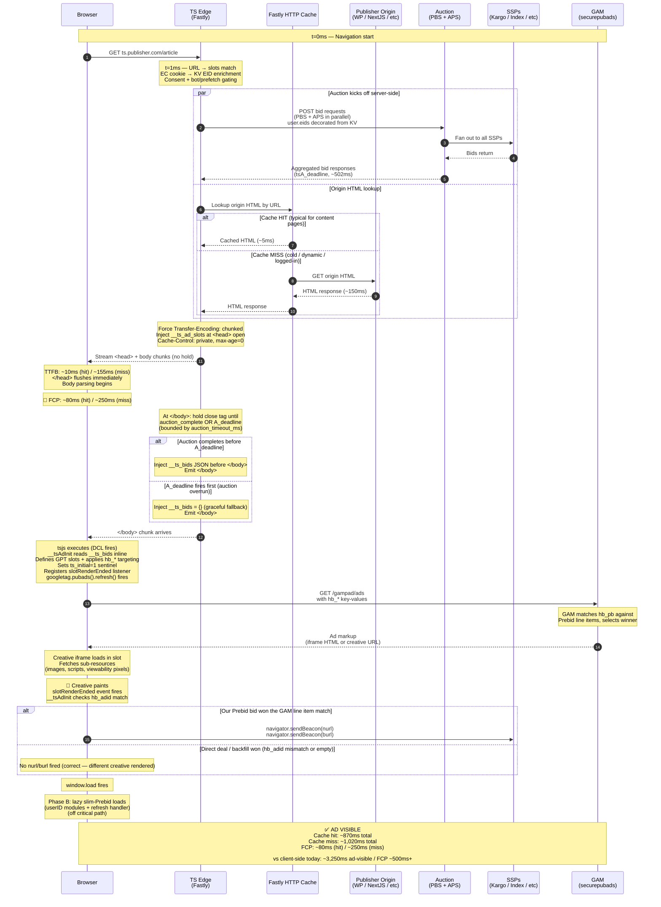

# Server-Side Ad Templates Design

_Author · 2026-04-15_
_Revised · 2026-05-04 (body-injection rework)_

---

## 1. Problem Statement

Today's display ad pipeline on most publisher sites is structurally sequential and
browser-bound:

1. Page HTML arrives at browser
2. Prebid.js (~300KB) downloads and parses
3. Smart Slots SDK scans the DOM to discover ad placements
4. `addAdUnits()` registers slot definitions
5. Prebid auction fires from the browser (~80–150ms RTT to SSPs)
6. Bids return (~1,000–1,500ms window)
7. GPT `setTargeting()` + `refresh()` fires
8. GAM creative renders

**Total time to ad visible: ~3,100ms.**

The browser is the slowest possible place to run an auction. It must first download and
parse multiple SDKs, scan the DOM to discover what ad slots exist, and then fire SSP
requests over a consumer internet connection with high and variable latency.

Trusted Server sits at the Fastly edge — milliseconds from the user, with
data-center-to-data-center RTT to Prebid Server (~20–30ms vs ~80–150ms from a browser).
The server knows, from the request URL alone, exactly which ad slots are available on any
given page. There is no reason to wait for the browser.

---

## 2. Goal

Enable Trusted Server to:

1. Match an incoming page request URL against a set of pre-configured slot templates.
2. Immediately fire the full server-side auction (all providers: PBS, APS, future
   wrappers) in parallel with the origin HTML fetch — before the browser receives a
   single byte.
3. Inject GPT slot definitions into `<head>` so the client can define slots without any
   SDK.
4. Inject the auction result inline before `</body>`, so bids and HTML travel together
   in a single response. The auction runs in parallel with origin fetch and body
   streaming; the close-of-body tag is held only until the auction completes or
   `A_deadline` fires, whichever is first. **FCP is unaffected** — body content above
   `</body>` has already streamed and painted by the time the close tag is held.
5. Eliminate Prebid.js from the page-load critical path. A stripped-down Prebid bundle
   (_slim-Prebid_) is lazy-loaded post-`window.load` to handle scroll/refresh auctions
   and to run userID modules that enrich the EC identity graph for the next request.

**Target time to ad visible: ~870ms (cache hit) / ~1,020ms (cache miss). FCP unchanged
from a no-TS baseline.** Net saving on ad-visible: ~2,200–2,400ms vs today, compounded
across every navigation in the user's clickstream rather than once per session.

> **Note:** The latency numbers in this document are modeled estimates based on known
> edge→PBS RTT ranges and typical origin response times. They should be validated with
> production measurements after Phase 1 ships. Quantitative claims in §6 are tagged with
> the assumptions they depend on.

---

## 3. Non-Goals

- Eliminating client-side GPT / Google Ad Manager — GAM remains in the rendering
  pipeline. The GAM call (`securepubads.g.doubleclick.net`) moving server-side is
  aspirational, contingent on Google agreement, and is not committed for any phase
  (see §9.6).
- Eliminating Prebid entirely — a stripped-down Prebid bundle (_slim-Prebid_) is
  lazy-loaded post-`window.load` to handle scroll/refresh auctions and userID
  enrichment. **TS owns the first impression; Prebid owns subsequent refresh
  auctions.**
- Dynamic slot discovery (reading the DOM) — this design commits to pre-defined,
  URL-matched slot templates. Smart Slots' dynamic injection behavior is replaced by
  server knowledge.
- Changing the `AuctionOrchestrator` internally — the orchestrator already handles
  parallel provider fan-out. This design adds a new trigger point, not new auction
  logic.
- A separate `/ts-bids` endpoint — an earlier revision of this spec proposed a fetch
  endpoint backed by an in-process `bid_cache`. That design was rejected because
  in-process caches don't survive Fastly Compute's per-request Wasm isolate model:
  isolates are not pinned across requests, and there is no documented contract for
  cross-request shared state. Body-injection achieves the same FCP property with a
  single response and no shared-state requirement.

---

## 4. Architecture

### 4.1 New File: `creative-opportunities.toml`

A new config file at the repo root, alongside `trusted-server.toml`. It holds all slot
templates: page pattern matching rules, ad formats, floor prices, GAM targeting
key-values, and per-provider bidder params. PBS bidder-level params (placement IDs,
account IDs) live in Prebid Server stored requests, keyed by slot ID. APS params are
specified inline per slot under `[slot.providers.aps]`.

Loaded at build time via `include_str!()` and compiled into the WASM binary. Slot
changes require a redeploy; this is intentional (fast reads, no KV overhead, no
per-request cost). A migration path to KV-backed config is tracked in §9.5.

`floor_price` is the publisher-owned hard floor per slot — the source of truth for the
minimum acceptable bid price, enforced at the edge before bids reach the ad server. Any
bid below the floor is discarded at the orchestrator level before it enters `__ts_bids`.
SSPs may apply their own dynamic floors independently within their platforms; this floor
is the publisher's baseline that supersedes all other floor logic by virtue of being
enforced earliest in the pipeline.

#### Top-level config (in `trusted-server.toml`)

```toml
[creative_opportunities]
# GAM network ID used to construct default ad-unit paths.
gam_network_id = "21765378893"

# Optional. Defaults to [auction].timeout_ms if not set.
# Recommended: 500ms (vs client-side 1000–1500ms) due to lower edge→PBS RTT.
# This value is also the upper bound on the </body>-close hold; once A_deadline
# fires, TS injects an empty __ts_bids and emits </body> regardless.
auction_timeout_ms = 500

# Granularity table for hb_pb price bucket strings.
# Options: "low" | "medium" | "high" | "auto" | "dense" | "custom"
# Defaults to "dense" if not set.
price_granularity = "dense"
```

#### `creative-opportunities.toml` schema

```toml
[[slot]]
id = "atf_sidebar_ad"
# Optional. Defaults to "/{gam_network_id}/{id}".
# Override for non-standard GAM ad-unit paths.
gam_unit_path = "/21765378893/publisher/atf-sidebar"
# Optional. DOM container element ID. Defaults to slot id.
div_id = "div-atf-sidebar"
page_patterns = ["/20**"]
formats = [{ width = 300, height = 250 }]
floor_price = 0.50

[slot.targeting]
pos = "atf"
zone = "atfSidebar"

[slot.providers.aps]
slot_id = "aps-slot-atf-sidebar"

[[slot]]
id = "below-content-ad"
page_patterns = ["/20**"]
formats = [{ width = 300, height = 250 }, { width = 728, height = 90 }]
floor_price = 0.25

[slot.targeting]
pos = "btf"
zone = "belowContent"

[slot.providers.aps]
slot_id = "aps-slot-below-content"

[[slot]]
id = "ad-homepage-0"
page_patterns = ["/", "/index.html"]
formats = [{ width = 970, height = 250 }, { width = 728, height = 90 }]
floor_price = 1.00

[slot.targeting]
pos = "atf"
zone = "homepage"
slot_index = "0"

[slot.providers.aps]
slot_id = "aps-slot-homepage-0"
```

#### Rust types

```rust
#[derive(Debug, Clone, serde::Deserialize)]
pub struct CreativeOpportunitiesConfig {
    pub gam_network_id: String,
    #[serde(default = "default_auction_timeout_ms")]
    pub auction_timeout_ms: Option<u32>,
    #[serde(default = "PriceGranularity::dense")]
    pub price_granularity: PriceGranularity,
}

#[derive(Debug, Clone, serde::Deserialize)]
pub struct CreativeOpportunitySlot {
    pub id: String,
    pub gam_unit_path: Option<String>,   // defaults to /{gam_network_id}/{id}
    pub div_id: Option<String>,           // defaults to id
    pub page_patterns: Vec<String>,
    pub formats: Vec<CreativeOpportunityFormat>,
    pub floor_price: Option<f64>,
    #[serde(default)]
    pub targeting: HashMap<String, String>, // strings only — validated at startup
    #[serde(default)]
    pub providers: SlotProviders,
}

/// Separate from auction::AdFormat so media_type can default to Banner
/// without requiring it in the TOML. Converted to AdFormat at auction time.
#[derive(Debug, Clone, serde::Deserialize)]
pub struct CreativeOpportunityFormat {
    pub width: u32,
    pub height: u32,
    #[serde(default = "MediaType::banner")]
    pub media_type: MediaType,
}

#[derive(Debug, Clone, Default, serde::Deserialize)]
pub struct SlotProviders {
    pub aps: Option<ApsSlotParams>,
}

#[derive(Debug, Clone, serde::Deserialize)]
pub struct ApsSlotParams {
    pub slot_id: String,
}
```

> **Targeting value types:** `targeting` values are `String`-only (not
> `serde_json::Value`). GPT's `setTargeting()` only accepts `string | string[]`;
> non-string values are silently dropped by the browser. Validated at startup — a
> non-string targeting value is a startup error.

> **Slot ID validation:** Slot IDs are validated at startup against a strict allowlist
> (`[A-Za-z0-9_-]+`). IDs outside this set fail startup. This prevents XSS via crafted
> IDs appearing in the injected `<script>` block.

### 4.2 URL Pattern Matching

At request time, TS matches the request path against each slot's `page_patterns`.
Patterns use the `glob` crate (WASM-compatible):

- `/20**` — matches all date-prefixed article paths (e.g., `/2024/01/my-article/`). Note:
  `**` matches across path separators; `*` stops at `/`. Use `**` for multi-segment
  patterns.
- `/` — matches the homepage exactly
- `/index.html` — exact match

Multiple slots can match a single URL. All matching slots are collected and fed into a
single auction as separate impressions. Pattern matching is purely in-memory against the
pre-parsed config — sub-millisecond. The pattern-match cost is O(slots × patterns);
startup logs the compiled pattern count.

### 4.3 Auction Trigger and the Bounded Body-End Hold

#### Async restructuring of the publisher path

The current `handle_publisher_request` is a synchronous `fn`. Running the auction in
parallel with the origin fetch requires:

1. Converting `handle_publisher_request` to `async fn`
2. Switching the origin fetch from blocking `.send()` to `.send_async()` (returns
   `PlatformPendingRequest`)
3. Adding `orchestrator: &AuctionOrchestrator` as a parameter
4. Awaiting both the auction future and the pending origin request

This is an explicit structural change to the publisher request path. It is listed in §7
as a required migration, not a minor modification.

#### Auction-eligibility gating

Auctions fire on **real first-page-load impressions only**, not on every TS-matched
request. Before firing, TS gates on:

- **Consent** — TCF Purpose 1 (storage access) is the minimum. If consent is absent or
  denied, no auction. The page renders normally; GAM falls back to its own auction.
- **Bot / crawler User-Agent** — well-known crawler UAs (Googlebot, Bingbot,
  AhrefsBot, etc.) skip the auction. SSP QPS budgets are finite; burning them on
  crawler hits is a real cost.
- **Prefetch hints** — requests carrying `Sec-Purpose: prefetch` or `Purpose: prefetch`
  skip the auction. Avoids spending auction inventory on speculative navigations that
  may never paint.
- **Method** — only `GET` requests trigger auctions. `HEAD` requests skip.
- **Slot match** — at least one slot in `creative-opportunities.toml` must match the
  request path. Empty match = no auction.

Skipped auctions emit no `__ts_bids` and let the page proceed unmodified by the ad
stack. Skipped requests still benefit from the EC cookie set / KV identity update
paths that run independently of the auction.

#### Consent and EC ID

Before firing the auction, TS reads consent signals and the EC ID from the incoming
page request. EC ID resolution → KV lookup → enriched EID set retrieval is part of the
existing EC pipeline and is the load-bearing identity input to the auction (see §4.8).

Consent gating:

- If consent is **absent or denied** (no TCF consent string, or purpose 1 not consented):
  the auction is not fired. `__ts_bids` is omitted from the page. GPT falls back to its
  own auction. This is treated as a first-class edge case in §8.
- **Mid-page consent revocation** is out of scope for Phase 1; bids already injected
  remain. Phase 2 will address consent event propagation.

#### Auction execution

When the gates above are satisfied, TS calls `AuctionOrchestrator::run_auction()` with
the matched slots converted to `AdSlot` objects, decorated with `user.eids` from the
EC graph. This happens at request receipt time, in parallel with the origin fetch via
`send_async()`.

The orchestrator's existing behavior is unchanged:

- All providers (PBS, APS) are dispatched simultaneously
- Per-provider timeout budgets are enforced from the remaining auction deadline
  (`creative_opportunities.auction_timeout_ms`, falling back to `[auction].timeout_ms`)
- Floor price filtering, bid unification, and winning bid selection are applied as today
- PBS resolves bidder params from its stored requests by slot ID
- APS bidder params are read from `[slot.providers.aps]` in
  `creative-opportunities.toml`

#### The bounded `</body>` hold

Bids are injected into the page inline before `</body>`. This requires holding the
close-of-body tag until the auction completes. The hold is **bounded by `A_deadline`**
and **invisible to FCP** because all body content above `</body>` has already streamed
and painted by the time the close tag is held.

**Timing definitions:**

- `T₀` = request receipt at the edge
- `A_deadline` = `T₀ + auction_timeout_ms`
- `origin_drain_time` = wall-clock when the origin response (or its `</body>` chunk in
  the streaming case) reaches the edge

**Body-close emission time:**

```
body_close_emit_time = max(origin_drain_time, min(A_deadline, auction_complete_time))
```

In English:

- If the auction completes before origin drains: body close tag flushes when origin
  emits it, with bid data injected. **No hold.** Typical cache-hit path where origin is
  ~5ms and auction is ~500ms — the auction is the long pole, but it has already
  finished by the time we need it because we waited for origin too.
- If origin drains before the auction completes: body close held until either auction
  completes or `A_deadline` fires. Hold is bounded by `A_deadline`.
- If `A_deadline` fires first: TS injects `__ts_bids = {}` (graceful no-bid fallback)
  and emits the close tag. GPT proceeds without bid targeting; GAM runs its own auction.
  This is the **soft inner deadline watchdog** — auction overrun never blocks the page
  past `A_deadline`.

**Why this works without hurting FCP:** body content above `</body>` has already
streamed and painted. Holding `</body>` delays `DOMContentLoaded` and `window.load`
events but not FCP. Third-party scripts hooked on DCL fire later by at most the hold
duration; this is a real cost on cache-hit pages where origin drains in <50ms but
auction takes ~500ms. The publisher decides this trade-off via `auction_timeout_ms` —
500ms is the recommended default and the hard upper bound on DCL slip.

**FCP is unaffected by the auction.** First Contentful Paint is bounded by origin time
and resource load time, exactly the same as a page without TS in the path.

> **Implementation mechanic:** lol_html's `el.on_end_tag()` registers a synchronous
> handler against the body element. Coordinating an async auction result into a
> synchronous handler requires shared state (e.g., `Arc<RwLock<Option<BidResult>>>`)
> that the auction task writes when complete and the close-tag handler reads, plus an
> outer flow-control mechanism that holds chunk emission past `</body>` until the
> shared state is populated or `A_deadline` fires. Detailed mechanics are part of the
> implementation plan (see §7).

### 4.4 Head and Body Injection

TS injects two `<script>` blocks into the HTML response:

1. **`window.__ts_ad_slots`** — at `<head>` open, immediately from config. No auction
   wait. Available to GPT the moment the browser parses `<head>`.
2. **`window.__ts_bids`** — before `</body>`, after the bounded hold described in §4.3.
   Carries the per-slot Prebid targeting and `nurl`/`burl` for billing.

#### `__ts_ad_slots` (at `<head>` open)

Owned by the `gpt` integration head injector:

```json
[
  {
    "id": "atf_sidebar_ad",
    "gam_unit_path": "/21765378893/publisher/atf-sidebar",
    "div_id": "div-atf-sidebar",
    "formats": [[300, 250]],
    "targeting": { "pos": "atf", "zone": "atfSidebar" }
  },
  {
    "id": "below-content-ad",
    "gam_unit_path": "/21765378893/below-content-ad",
    "div_id": "below-content-ad",
    "formats": [
      [300, 250],
      [728, 90]
    ],
    "targeting": { "pos": "btf", "zone": "belowContent" }
  }
]
```

#### `__ts_bids` (before `</body>`)

JSON object keyed by slot ID:

```json
{
  "atf_sidebar_ad": {
    "hb_pb": "2.50",
    "hb_bidder": "kargo",
    "hb_adid": "abc123",
    "nurl": "https://ssp.example/win?id=abc123",
    "burl": "https://ssp.example/billing?id=abc123"
  },
  "below-content-ad": {
    "hb_pb": "1.00",
    "hb_bidder": "appnexus",
    "hb_adid": "def456",
    "nurl": "https://appnexus.example/win?id=def456",
    "burl": "https://appnexus.example/billing?id=def456"
  }
}
```

`hb_pb` is computed using the **dense** granularity table (publisher-configurable via
`price_granularity` in `[creative_opportunities]`). Per-slot keys are `hb_pb`,
`hb_bidder`, `hb_adid`, `nurl`, `burl` — both `nurl` and `burl` ride into the page
because both are fired client-side from `slotRenderEnded` (see §4.5).

#### Injection mechanic

`__ts_ad_slots` is emitted via the existing `el.prepend()` head handler (already used
by integrations for head-tag injection).

`__ts_bids` is emitted via lol_html's `el.on_end_tag()` registered against the body
element. The handler reads from a shared auction-result state (resolved by the auction
task, fallback to `{}` on watchdog) and calls
`end_tag.before(<script>...</script>, ContentType::Html)`.

> **Security:** All string values are JSON-serialized via `serde_json` and HTML-escaped
> before insertion into the `<script>` block. The wrapper uses
> `JSON.parse(<escaped string>)`, never raw string interpolation. `<`, `>`, `&`, U+2028,
> U+2029 are unicode-escaped to neutralize any markup that could break out of the
> `<script>` context.

> **Cache contract (load-bearing invariant):** The HTML response with `__ts_bids`
> contains per-user bid data inline. TS sets **`Cache-Control: private, max-age=0`** on
> the browser-facing response. **`Surrogate-Control` and `Fastly-Surrogate-Control`
> are stripped** so downstream Fastly-aware caches do not override the directive. The
> Fastly edge cache for the **origin** response is unaffected — TS reads the cached
> origin HTML and assembles a fresh per-request response on every hit. **The
> assembled response must never be re-cached** by any intermediate proxy or shared
> cache. See §4.7 for the full caching rationale, including why `no-store` was
> rejected in favor of `max-age=0` (BFCache eligibility).

### 4.5 Win Notifications — Both `nurl` and `burl` Client-Side

Win notification responsibilities are split by where the truth lives. **Both `nurl`
and `burl` fire client-side from the GPT `slotRenderEnded` event after `hb_adid`
match.** Server-side firing is rejected for both because it would report wins for
auctions whose bids never actually rendered (direct deal won the GAM line item, GAM
backfill won, user navigated away before tsjs loaded, etc.) — that's billing inflation
and a violation of MRC counting standards.

**Render-confirmed firing pattern (registered in `__tsAdInit`):**

```javascript
googletag.pubads().addEventListener('slotRenderEnded', function (event) {
  var slotId = event.slot.getSlotElementId()
  var bidData = (window.__ts_bids || {})[slotId] || {}
  var ourBidWon =
    !event.isEmpty &&
    bidData.hb_adid &&
    event.slot.getTargeting('hb_adid')[0] === bidData.hb_adid

  if (ourBidWon) {
    if (bidData.nurl) navigator.sendBeacon(bidData.nurl)
    if (bidData.burl) navigator.sendBeacon(bidData.burl)
  }
})
```

The `hb_adid` match confirms two things: that the slot was filled (`!event.isEmpty`)
**and** that **our** Prebid bid (not a direct deal or backfill) won the GAM line item
match. Only then are SSP win/billing pixels fired.

**Per-bidder suppression** (`[integrations.<bidder>].suppress_nurl`, default `false`)
is retained as an escape hatch in case a specific PBS deployment fires `nurl`
internally and wants to avoid double-firing. APS `burl` follows the same client-side
path.

> **Operational note:** Client-side firing introduces a small (~50–200ms) delay in
> win-pixel arrival vs server-side firing. SSPs accept this — it's identical to
> conventional client-side Prebid integrations today. Server-side firing would arrive
> faster but would inflate counts on impressions that never rendered.

### 4.6 Client Residual

Prebid.js is removed from the page-load critical path. A small inline shim
(`__tsAdInit`) reads `window.__ts_bids` synchronously from the page, drives GPT
directly, and registers the `slotRenderEnded` listener for win/billing pixels. **No
fetch, no Promise, no second round-trip — bids are already on the page.**

```javascript
window.__tsAdInit = function () {
  var slots = window.__ts_ad_slots || []
  var bids = window.__ts_bids || {}

  googletag.cmd.push(function () {
    slots.forEach(function (slot) {
      var gptSlot = googletag
        .defineSlot(slot.gam_unit_path, slot.formats, slot.div_id)
        .addService(googletag.pubads())

      // Apply config-defined targeting
      Object.entries(slot.targeting || {}).forEach(function ([k, v]) {
        gptSlot.setTargeting(k, v)
      })

      // Apply auction-result targeting
      var bidData = bids[slot.id] || {}
      ;['hb_pb', 'hb_bidder', 'hb_adid'].forEach(function (key) {
        if (bidData[key]) gptSlot.setTargeting(key, bidData[key])
      })

      // Slot-ownership sentinel — slim-Prebid skips initial-rendered slots and
      // clears this key when running its own auction on refresh.
      gptSlot.setTargeting('ts_initial', '1')
    })

    googletag.pubads().enableSingleRequest()
    googletag.enableServices()

    // Fire win/billing pixels on confirmed render (see §4.5)
    googletag.pubads().addEventListener('slotRenderEnded', function (event) {
      var slotId = event.slot.getSlotElementId()
      var bidData = bids[slotId] || {}
      if (
        !event.isEmpty &&
        bidData.hb_adid &&
        event.slot.getTargeting('hb_adid')[0] === bidData.hb_adid
      ) {
        if (bidData.nurl) navigator.sendBeacon(bidData.nurl)
        if (bidData.burl) navigator.sendBeacon(bidData.burl)
      }
    })

    googletag.pubads().refresh()
  })
}
```

#### Phase B: lazy slim-Prebid for refresh and identity warm-up

After `window.load`, tsjs lazy-loads a stripped-down Prebid bundle (_slim-Prebid_) in
the background. This bundle has two responsibilities, neither on the user's critical
path:

- Run **userID modules** to refresh identity provider tokens (ID5, sharedID, LiveRamp,
  etc.). Tokens are written to first-party cookies that subsequent TS requests
  harvest server-side and merge into the EC graph (see §4.8).
- Register as the **auction handler for GPT scroll/refresh events**. When the
  publisher's refresh policy fires (sticky-anchor refresh, viewability dwell, infinite
  scroll), slim-Prebid runs a fresh client-side auction on refreshing slots and
  applies new `hb_*` targeting before the publisher's `refresh()` trigger.

Slim-Prebid is a **custom Prebid build** with bid adapters that TS handles
server-side removed. Realistic bundle size with the major userID modules (ID5,
sharedID, LiveRamp ATS, Lockr) and a minimal auction wrapper is ~80–120KB minified —
meaningfully smaller than full Prebid (~250KB+) but not as small as a pure shim.
Bundle composition is open (see §9.8).

**Slot ownership signal:** `ts_initial=1` on initial-rendered slots distinguishes
TS-served impressions from Prebid-served refresh impressions. Slim-Prebid checks for
this key on refresh; it clears the key when re-targeting (the refresh impression is
Prebid-served, not TS-served) and runs its own client-side auction. GAM line-item
attribution and reporting can use this sentinel to separate the two streams.

This script is part of the existing `gpt` integration bundle
(`crates/js/lib/src/integrations/gpt/index.ts`). The lazy slim-Prebid loader is a new
sibling module loaded post-`window.load`.

#### Failure modes

- **`__ts_bids = {}`** (auction watchdog fired or zero bids above floor): GPT runs
  without bid targeting; GAM falls back to its own auction. Same graceful degradation
  path as a no-bid scenario today.
- **`__ts_bids` missing entirely** (consent denied, bot UA, no slot match): same
  fallback, plus the page proceeds with no TS ad stack at all.
- **slim-Prebid fails to load:** refresh auctions don't fire; initial-render
  impressions unaffected. Publisher's existing GPT refresh logic (if any) takes over.
- **`__tsAdInit` not yet defined when `</body>` script executes:** the shim is loaded
  via the `gpt` integration bundle which is part of the head injection — this is a
  build-time invariant, not a runtime risk.

### 4.7 Caching Behavior

Page assets and bid results have very different cacheability properties. The
architecture is designed so that everything that can be cached, is.

**What gets cached where:**

| Asset                   | Cached at                          | Cacheability                                              |
| ----------------------- | ---------------------------------- | --------------------------------------------------------- |
| Origin HTML             | Fastly edge HTTP cache             | Yes, if origin sends `Cache-Control: public, max-age=...` |
| Origin CSS / fonts / JS | Fastly edge + browser              | Yes (typically hashed URLs, immutable)                    |
| `tsjs` bundle           | Fastly edge + browser              | Yes (already content-hashed via `bundle.rs`, immutable)   |
| `__ts_ad_slots` payload | Computed per-request               | Sub-millisecond match — not worth caching                 |
| `__ts_bids` payload     | Live result of per-request auction | Per-user, never shared                                    |
| Assembled HTML response | Browser disk cache + BFCache only  | `private, max-age=0` — same-user only, never shared       |

**Architecture:**

1. Fastly's built-in HTTP cache stores the **origin response** keyed by URL, governed
   by the origin's own `Cache-Control` headers. TS does not implement its own HTML
   caching layer — it leverages the existing Fastly cache.
2. On request: TS reads from cache (cache hit, ~5ms) or fetches from origin (cache
   miss, ~150ms typical).
3. TS injects `__ts_ad_slots` at `<head>` open and `__ts_bids` before `</body>` per
   request. **The cached origin entry is never modified** — modifications happen on
   the per-request assembled response only.
4. The auction runs in parallel regardless of HTML cache state.

**`Cache-Control` directive on the assembled response:**

TS sets **`Cache-Control: private, max-age=0`** on the browser-facing response. This:

- **`private`** prevents intermediate-cache leaks. Per-user bid data must never be
  served from a shared cache to a different user.
- **`max-age=0`** forces revalidation on hard reload. A fresh request gets a fresh
  auction.
- **(deliberately not `no-store`)** preserves browser BFCache eligibility. Chrome and
  Firefox treat `no-store` as a hard ineligibility signal for the back/forward cache,
  which provides instant restore on back-button navigation. Losing BFCache is a real
  UX downgrade for navigation-heavy sites (news, recirculation, "next article"
  flows).

**Why `no-store` was rejected:** the threats `no-store` would mitigate beyond
`private` are (a) browser disk cache cross-OS-user leaks (rare; same exposure as any
per-user HTML today, e.g., logged-in pages) and (b) BFCache restoration showing stale
bid data — but BFCache restoration replays the already-rendered ad without firing a
new GAM call, so stale bids are inert. Trading BFCache instant-restore for these two
marginal threats is a net loss.

**Headers stripped on the way out:**

- `Surrogate-Control` and `Fastly-Surrogate-Control` from origin — these would
  override `Cache-Control` for downstream Fastly-aware caches.

`Cache-Control` from origin on the **origin response stored in the Fastly edge cache**
is preserved — that's how Fastly knows when to serve cached origin HTML to the next
request. Only the **browser-facing assembled response** carries `private, max-age=0`.

The `bid_cache` and `request_id` machinery from the prior revision is **gone** — bids
travel inline with the HTML response, not via a separate fetch.

**When caching doesn't apply (origin-side):**

- **Logged-in users** — origin typically returns `Cache-Control: private`. Falls back
  to cache-miss timing (full origin fetch).
- **Personalized SSR** — same.
- **Dynamic NextJS routes without ISR** — origin sends `Cache-Control: no-store` or
  short max-age. Falls back to cache-miss timing.
- **First request after deploy or cache purge** — cold cache, full origin fetch.
- **Long-tail URLs** — low cache hit rate, treat as cache-miss case.

For typical news / content publisher sites with anonymous visitors on stable content
pages, expect 70–90%+ Fastly edge cache hit rate. The cache-hit timing in §5 is the
realistic common case.

### 4.8 Identity Model

The server-side auction's CPM uplift depends materially on the identity decoration of
`user.eids` in the bid stream. **TS does not collect identity in the auction critical
path** — identity is _retrieved_ from the EC KV graph at request time and _enriched_
asynchronously through three sync paths.

> **Reference:** This section summarizes the identity dependency for auction purposes.
> Full identity architecture, partner sync flows, and Phase A/B tier model live in the
> separate _Identity Resolution_ design (forthcoming).

#### EC graph as load-bearing input

At request time, before firing the auction:

1. TS resolves the `ts-ec` cookie or generates a new EC ID
   (HMAC-SHA256(IP, publisher_passphrase)).
2. KV lookup against `ec_store` retrieves the enriched EID set bound to the EC ID
   (partner UIDs from sync paths described below).
3. EIDs are decorated into `AuctionRequest.user.eids` and forwarded to PBS + APS.

The EC graph is populated by three sync paths (all running off the auction critical
path):

- **Pixel sync (browser → TS)** — `/identify` endpoint receives partner-resolved IDs
  via image-pixel or postMessage flows from the publisher's site.
- **S2S batch push (partner → TS)** — partners push EID sets keyed by IP or hashed
  email to TS via authenticated S2S endpoints.
- **S2S pull (TS → partner)** — TS resolves EC IDs against partner databases (IP graph,
  bid-stream history) on a scheduled batch interval.

#### Phase A vs Phase B identity

| Phase   | When                          | Source                                                                                                | Effect                               |
| ------- | ----------------------------- | ----------------------------------------------------------------------------------------------------- | ------------------------------------ |
| Phase A | Auction critical path         | EC + KV + Tier 1 server-side providers (SharedID 1P cookie, UID2 server SDK, LiveRamp ATS API, Lockr) | Decorates _this_ auction             |
| Phase B | Post-`window.load` (off path) | slim-Prebid userID modules (ID5, ATSv2 envelope, Criteo ID, etc.)                                     | Enriches EC graph for _next_ request |

Phase A adds **no auction latency** — KV lookup happens in parallel with origin
fetch and slot match, sub-millisecond once the EC ID is resolved. Phase B is
fire-and-forget after first paint and benefits subsequent navigations.

#### Bare-EC first-impression caveat

A user with no prior interaction with the EC graph (truly new EC, no federated
consortium hit, no prior partner sync) gets an auction with **bare identity** on the
very first impression of the EC's lifetime. Subsequent impressions are enriched as
Phase B and partner sync paths populate the graph. The duration of the bare window
depends on partner sync cadence:

- Pixel sync fires on next `/identify` call — usually within seconds of first paint.
- S2S batch push is partner-scheduled — minutes to hours.
- S2S pull is TS-scheduled — minutes to hours.

**Measurement:** the auction emits an `auction_eid_count` metric (number of EIDs
decorated per auction). Distribution of this metric vs revenue uplift validates the
identity coverage / CPM relationship in production. A high-volume zero-EID tail
signals that partner sync paths need acceleration.

#### Federated-consortium passphrase

EC = HMAC(IP, passphrase). Publishers sharing a passphrase share an EC graph. A user
new to publisher A but known to publisher B (using the shared passphrase) hits a
**populated graph** on first request to A. This shrinks the bare-EC cohort
meaningfully for publishers participating in a consortium. Operationally, this
requires data-sharing agreements between consortium members — a contractual surface,
not a technical one.

#### Clickstream-compounding property

Every full page navigation in a user's session is an independent TS-accelerated
server-side auction. A user reading article 1 → article 2 → article 3 gets three
independent auctions, each decorated with the EID set the EC graph held at that
moment. The speed win and the identity decoration **compound across the clickstream**
rather than being a session-start one-time benefit.

**SPA caveat:** pure client-side SPAs that route via `pushState` without issuing an
HTML request do not re-trigger TS. All slots on SPA-routed views rely on slim-Prebid
for both auction and identity. Streaming-SSR setups (Next.js App Router, etc.) that
emit HTTP requests on route changes get the full TS-accelerated auction per route.
See §8.

---

## 5. Request-Time Sequence

Sequence applies to all origins (WordPress, Drupal, Rails, NextJS 14/16, static sites).
TS forces chunked encoding on every response, so origin format is invisible from the
browser's perspective.

### 5.1 Visual Sequence (full content + creative flow)



### 5.2 Cache-Hit Sequence (typical for content publisher pages)

This is the common case for anonymous visitors on cacheable content pages.

```
t=0ms     GET ts.publisher.com/article arrives at Fastly edge

t=1ms     URL matched against creative-opportunities.toml
          Slots matched: [atf_sidebar_ad, below-content-ad, section_ad]
          EC cookie resolved → KV lookup for EID enrichment
          Consent: TCF Purpose 1 present → auction proceeds
          Bot/prefetch gates: pass

t=2ms     AuctionOrchestrator.run_auction() dispatched (parallel)
          PBS + APS dispatched in parallel via send_async()
          user.eids decorated from KV graph
          Edge→PBS RTT: ~20–30ms
          Fastly cache lookup dispatched in parallel
          __ts_ad_slots <script> assembled from config

t=5ms     Cache HIT — origin HTML retrieved from Fastly edge cache
          TS forces Transfer-Encoding: chunked
          __ts_ad_slots injected at <head> open
          Cache-Control: private, max-age=0 set on response
          Stream begins to browser

t=10ms    Browser TTFB ~10ms
          CSS, fonts, framework JS, tsjs all begin downloading
          (most also from Fastly cache + browser cache)

t=60ms    </head> chunk reaches browser (no hold)
          Body parsing begins immediately

t=80ms    FIRST CONTENTFUL PAINT ✨ (auction never blocked rendering)

t=502ms   Server-side auction completes (≤500ms budget) or A_deadline fires
          Winning bids selected; nurl/burl per slot included in __ts_bids
          __ts_bids JSON injected before </body>
          </body> emitted
          (origin drained at t=5ms, so </body> was held ~497ms — DCL slip)

t=510ms   </body> reaches browser
          tsjs executes (DCL fires)
          __tsAdInit reads __ts_bids inline (no fetch)
          GPT slots defined; hb_* + ts_initial=1 targeting applied
          slotRenderEnded listener registered
          googletag.pubads().refresh() fires

t=620ms   GET /gampad/ads (GAM RTT ~110ms)

t=720ms   Creative fetch begins

t=870ms   Creative sub-resources + paint
          slotRenderEnded fires; nurl + burl fired via sendBeacon

          AD VISIBLE ~870ms
          FIRST CONTENTFUL PAINT ~80ms

(post window.load — off critical path)
~t=1,500ms   slim-Prebid lazy-loads
             userID modules run, refresh 1P identity cookies
             GPT refresh handler registered (off critical path)
```

### 5.3 Cache-Miss Sequence (cold cache, dynamic page, logged-in user)

Worst case — first request to a URL after a deploy or cache purge, or a page marked
uncacheable by origin (`Cache-Control: private`).

```
t=0ms     GET ts.publisher.com/article arrives at Fastly edge
t=1ms     URL matched, EC lookup, consent + gate checks
t=2ms     Auction dispatched, origin fetch dispatched in parallel

t=150ms   Origin HTML arrives at edge (cache miss — full origin RTT)
          TS forces chunked encoding, injects __ts_ad_slots at <head> open
          Stream begins to browser

t=200ms   </head> reaches browser (no hold)
t=250ms   FIRST CONTENTFUL PAINT
t=502ms   Auction completes; __ts_bids injected; </body> emitted
          (origin drained at 150ms, auction at 502ms — </body> held ~352ms)
t=512ms   </body> reaches browser; tsjs runs; refresh() fires
t=622ms   GET /gampad/ads
t=722ms   Creative fetch
t=1,020ms AD VISIBLE
```

### 5.4 Key Timing Properties

| Metric     | Cache hit | Cache miss | Client-side today |
| ---------- | --------- | ---------- | ----------------- |
| TTFB       | ~10ms     | ~155ms     | ~150–500ms        |
| FCP        | ~80ms     | ~250ms     | ~500ms+           |
| DCL        | ~510ms    | ~512ms     | ~700ms+           |
| Ad visible | ~870ms    | ~1,020ms   | ~3,250ms          |

- **The auction never blocks FCP.** FCP is bounded by origin time and browser parsing
  only — same as a page without TS in the ad path.
- **Body content paints first; ads slot in after.** The page is responsive and
  readable while ads finish loading.
- **DCL is delayed by the auction hold** (up to `auction_timeout_ms`). Third-party
  scripts hooked on DCL fire later by at most the hold duration. This is the explicit
  trade-off for the speed win on ad-visible.
- **Cache-hit FCP under 100ms is achievable** for anonymous visitors on stable content.
  The typical case for news publisher article pages.
- **Ad-visible converges across cache hit/miss** because the auction is the long pole
  in both cases. Cache miss costs FCP, not ad-visible.

---

## 6. Performance Summary

| Stage                      | Client-side today | TS cache hit | TS cache miss | Saving (cache hit)  |
| -------------------------- | ----------------- | ------------ | ------------- | ------------------- |
| Origin HTML to browser     | ~150ms            | ~10ms TTFB   | ~155ms TTFB   | parallel w/ auction |
| Script load chain          | ~700ms            | ~40ms        | ~40ms         | -660ms              |
| Script parse/JIT           | ~280ms            | ~10ms        | ~10ms         | -270ms              |
| Sequential SDK hops        | ~200ms            | 0            | 0             | -200ms              |
| Auction window             | ~1,500ms          | ~500ms       | ~500ms        | -1,000ms            |
| GAM + creative             | ~570ms            | ~360ms       | ~360ms        | -210ms              |
| **Ad visible (wall)**      | **~3,250ms**      | **~870ms**   | **~1,020ms**  | **~2,380ms**        |
| **First Contentful Paint** | ~500ms+           | **~80ms**    | **~250ms**    | **-420ms**          |

> Components don't sum cleanly because of parallelism — auction + origin fetch run
> concurrently, and the GAM + creative leg is post-body-close. The wall-clock totals
> are what matter.

**Compounding across the clickstream.** Every full page navigation in a user's session
is an independent TS-accelerated server-side auction. The speed win and identity
decoration compound across the clickstream rather than being a session-start one-time
benefit. Modern engagement patterns (multi-article reads, recirculation modules,
auto-advance "next article") mean a meaningful share of impressions are
initial-slot impressions, not refresh impressions — exactly the surface this design
optimizes.

**Auction RTT improvement.** Browser fires SSP requests at 80–150ms RTT; edge fires at
20–30ms. Auction timeout can drop from 1,000–1,500ms to 500ms while still collecting
more complete results, because edge→PBS latency is ~5–7x lower.

**TS edge overhead.** TS adds processing on the request path: URL match, UUID-free
gating, EC/KV lookup, head-script assembly, header rewrite, force-chunk. Estimated at
≤5ms on warm Wasm isolates; to be measured in production. The §6 cache-hit numbers
include this overhead.

**Identity coverage caveat.** First-time visitors with no prior EC graph hit get a
bare-identity auction on impression #1. CPM uplift on Tier 3 (browser-coupled) ID
providers — ID5, ATSv2 envelope, Criteo ID, etc. — only lands on impression #2+ within
an EC lifetime, after Phase B has populated 1P cookies for next-request harvest. The
clickstream-compounding property means this dilution mostly resolves within the first
few navigations of a new EC.

**Confidence intervals.** The numbers above are point estimates against modeled
assumptions (origin RTT, edge→PBS RTT, GAM RTT, creative weight). p95 ad-visible is
likely 1.3–1.5x the median for slow networks and tail GAM/creative RTTs. Production
measurement plan is to instrument each leg independently before claiming the headline
saving.

---

## 7. Implementation Scope

### New

- `creative-opportunities.toml` — slot template config file at repo root
- `crates/trusted-server-core/src/creative_opportunities.rs` — config types, TOML
  parsing, URL glob matching, slot-to-`AdSlot` conversion
- `crates/trusted-server-core/src/price_bucket.rs` — Prebid price granularity tables
  (dense default; publisher-configurable); converts raw CPM `f64` to `hb_pb` string
- `crates/trusted-server-core/build.rs` updates — `include_str!()` for
  `creative-opportunities.toml`; startup slot-ID validation
- **slim-Prebid bundle build target** — custom Prebid build with TS-handled bid
  adapters removed; bundled with `crates/js/lib/src/integrations/gpt/` and lazy-loaded
  post-`window.load`. Bundle composition tracked in §9.8.
- **Auction-eligibility gating** — bot UA list, prefetch hint detection, HEAD-method
  short-circuit; runs before any auction work

### Modified

- **`crates/trusted-server-core/src/publisher.rs`** — primary structural change:
  - Convert `handle_publisher_request` from `fn` to `async fn`
  - Switch origin fetch from `.send()` to `.send_async()` (returns
    `PlatformPendingRequest`)
  - Add `orchestrator: &AuctionOrchestrator` parameter
  - Apply auction-eligibility gates (consent, bot UA, prefetch, method, slot match)
  - Resolve EC cookie → KV lookup for EID enrichment; decorate `user.eids` on
    `AuctionRequest`
  - Match slots, fire auction (returns a future), origin fetch in parallel
  - Coordinate the `</body>` hold: shared auction-result state populated by the
    auction task; close-tag handler reads from it; outer flow holds chunk emission
    past `</body>` until the state is populated or `A_deadline` fires
  - Force chunked encoding on the response (strip `Content-Length`, set
    `Transfer-Encoding: chunked`)
- **`crates/trusted-server-adapter-fastly/src/main.rs`** — `.await` the now-async
  publisher handler; pass orchestrator reference
- **`crates/trusted-server-core/src/html_processor.rs`**:
  - Inject `window.__ts_ad_slots` at `<head>` open via existing `el.prepend()` head
    handler (no hold)
  - Inject `window.__ts_bids` before `</body>` via lol_html's `el.on_end_tag()` on
    the body element, reading from shared auction-result state
  - Set `Cache-Control: private, max-age=0` on the assembled response
  - Strip `Surrogate-Control` and `Fastly-Surrogate-Control` from the response
- **`crates/trusted-server-core/src/integrations/gpt.rs`** — extend head injector to
  emit `window.__ts_ad_slots` from matched slots; emit `__tsAdInit` bootstrap script
- **`crates/js/lib/src/integrations/gpt/index.ts`** — add `__tsAdInit` function with
  synchronous bid read, `slotRenderEnded` nurl + burl firing, `ts_initial` sentinel;
  add lazy slim-Prebid loader scheduled for post-`window.load`
- **`crates/trusted-server-core/src/integrations/prebid.rs`** — add
  `suppress_nurl` per-bidder config (default `false`); **no server-side nurl firing
  in the page-load path** (firing is client-side from `slotRenderEnded`)
- **`trusted-server.toml`** — add `[creative_opportunities]` section
- **`crates/trusted-server-core/src/settings.rs`** — add `CreativeOpportunitiesConfig`
  to `Settings`

### Deleted (relative to prior revision of this spec)

- `crates/trusted-server-core/src/bid_cache.rs` — never created; in-process cache
  approach was rejected
- `/ts-bids` endpoint — never created
- `request_id` UUID minting and `__ts_request_id` page injection — never created

### Unchanged

- `AuctionOrchestrator` internals — no changes; new call site only
- PBS stored request configuration — bidder params remain in PBS, keyed by slot ID
- GAM line item configuration — targeting key-values pass through unchanged

---

## 8. Edge Cases

**No slots match the URL** — auction is not fired. `__ts_bids` is omitted. The page
renders with `__ts_ad_slots` still absent (no slots = no slot config to inject); no
`</body>` hold. Existing client-side Prebid/GPT flow runs unmodified (for publishers
in dual-mode rollout).

**Consent absent or denied** — auction is not fired. `__ts_bids` is omitted; `</body>`
flushes immediately on origin emit. `Cache-Control: private, max-age=0` is still set.
Page loads normally; GAM runs its own auction without TS targeting.

**Bot / crawler User-Agent** — auction skipped. `__ts_bids` omitted; `</body>` flushes
immediately. SSP QPS budget preserved. Crawlers typically don't render JS, but if they
do, GPT runs without TS targeting.

**Prefetch hint (`Sec-Purpose: prefetch` or `Purpose: prefetch`)** — auction skipped.
Avoids burning auction inventory on speculative navigations that may never paint. If
the user does click through, the actual click navigation is a fresh request and
triggers a real auction.

**HEAD request** — auction skipped; response carries headers only.

**Auction times out with partial results (watchdog)** — `__ts_bids` includes whatever
bids arrived before `A_deadline`. Slots with no bid are omitted. GPT fires without
pre-set targeting for those slots; GAM falls back to its own auction.

**Auction times out with zero results** — `__ts_bids = {}` injected. All slots fire
GAM without bid targeting. No revenue impact beyond the timeout scenario itself.

**Buffered origin (WordPress, Drupal, Rails, NextJS 14, static sites)** — origin
returns full HTML in one response. TS strips `Content-Length`, sets
`Transfer-Encoding: chunked`, and feeds the response through the streaming pipeline
as chunks. From the browser's perspective, behavior is identical to a streaming
origin. The `</body>` hold mechanic is identical. Auction runs in parallel with
origin response; usually completes around the same time origin drains.

**Streaming origin (NextJS 16, Remix, SvelteKit with streaming)** — origin emits HTML
chunks progressively. TS forwards them through the streaming pipeline directly. No
buffering at the edge before `</body>`. The `</body>` hold mechanic is identical.

**SPA / pushState navigation** — pure client-side SPAs (CSR React/Vue, hashbang
routing) don't issue an HTML request on route change, so TS never sees the
navigation and no server-side auction fires for the new "page." All slots on
SPA-routed views rely on slim-Prebid for both auction and identity. Streaming-SSR
setups (Next.js App Router, etc.) that emit HTTP requests on route changes get the
full TS-accelerated auction per route. The speed-win story differs by publisher
architecture and should be confirmed during onboarding.

**Bare-EC first impression** — a new EC with no prior partner sync hits the auction
with `user.eids = []`. Bid stream lacks Tier 3 identity; CPMs may be 10–30% lower than
enriched impressions. Subsequent navigations populate the EC graph. Measure via the
`auction_eid_count` distribution.

**BFCache restoration** — user navigates back to a TS-served page. Browser restores
the page from BFCache (eligible because we set `private, max-age=0`, not `no-store`).
Already-rendered ads display from the BFCache snapshot; no new GAM call fires; no new
auction needed. `__ts_bids` in JS heap is stale but inert. This is the desired
behavior — instant back-button restore for the user.

**Slow origin (origin drain > A_deadline)** — `</body>` waits for origin regardless
of auction state. Auction has more wall-clock budget; results more likely complete by
the time origin drains. No extra hold beyond origin drain.

**Slim-Prebid fails to load** — refresh auctions don't fire; initial-render
impressions are unaffected. Publisher's existing GPT refresh logic (if any) takes
over. Phase B identity refresh doesn't happen for that session — EC graph staleness
shifts to next session's S2S sync.

**`creative-opportunities.toml` missing or malformed** — startup fails with a clear
error. No silent degradation.

**Config empty (zero slots)** — treated as "no match" for all URLs; auction never
fires. No error. Useful as a kill-switch: deploying an empty
`creative-opportunities.toml` disables the feature without a code change.

**Slot ID not found in PBS stored requests** — PBS returns a no-bid for that slot.
Slot is omitted from `__ts_bids`. The remaining slots proceed normally.

---

## 9. Open Questions

1. **URL pattern coverage** — does `/20**` cover all article paths, or are there
   non-date-prefixed article URLs? Publisher to confirm per onboarding.
2. **PBS stored request setup** — slot IDs in `creative-opportunities.toml` must have
   corresponding stored requests configured in the publisher's PBS instance before
   this goes live. Recommend a CI check or startup probe to PBS that lists stored
   requests and diffs against the toml; tracked as a Phase 1 implementation item.
3. **Homepage slot count** — the example shows slots 0 and 1. Are there additional
   slots following the same pattern? Slot IDs and count to be confirmed with ad ops.
4. **Auction timeout** — ✅ Resolved: dedicated key
   `[creative_opportunities].auction_timeout_ms` with fallback to
   `[auction].timeout_ms`. This value is also the upper bound on the `</body>` hold.
   Per-provider ceilings (`[integrations.prebid].timeout_ms`,
   `[integrations.aps].timeout_ms`) remain unchanged; the orchestrator's existing
   `min(remaining_budget, provider_timeout)` logic applies.
5. **KV-backed config migration path** — Phase 1 ships with `include_str!()` for
   simplicity and cost. When ad ops require live slot edits between deploys, the
   migration path is: load from `services.kv_store()` at request time with a
   compiled-in fallback. Design tracked as a follow-up.
6. **Server-side GAM** — the real latency ceiling beyond the auction is the GAM call
   (`securepubads.g.doubleclick.net`, ~110ms RTT). Routing GAM through the edge would
   eliminate that hop, but it requires Google agreement which is a business
   negotiation, not an engineering decision. **Aspirational, not committed for any
   phase.** The current architecture is shape-compatible (`__ts_ad_slots` gives the
   edge full slot inventory) so no rework would be required if Google agrees later.
7. **`tsjs-gpt` bootstrap delivery** — ✅ Resolved: `__tsAdInit` is part of the
   existing `gpt` integration bundle, not a new integration. Injection order:
   `window.__ts_ad_slots` (head) → existing GPT shim → `__tsAdInit` (head) →
   `window.__ts_bids` (body close). Bid script can rely on `__tsAdInit` and slot
   config being defined.
8. **slim-Prebid bundle composition** — which userID modules ship in the lazy bundle?
   Default candidates: ID5, sharedID, LiveRamp ATS, Lockr. Each adds bundle weight
   (~10–25KB each). Publisher per-deployment override should be possible. Bundle
   target size is "as small as possible while covering the publisher's enabled
   identity providers." Tracked as a slim-Prebid build-system item.
9. **Privacy Sandbox interaction** — Topics API (`Sec-Browsing-Topics`) can be read at
   the edge and decorated into the bid stream as a future enhancement. Protected
   Audience (FLEDGE) is on-device by design and cannot move server-side; it runs in
   parallel client-side via slim-Prebid (when supported). Out of scope for Phase 1
   beyond this acknowledgment.
10. **Per-bidder consent resolution** — Phase 1 gates on TCF Purpose 1 globally.
    Real-world consent is per-vendor, per-purpose, and interacts with Google Consent
    Mode, USP_v2, and GPP. A bidder may be allowed for some purposes but not others.
    Phase 2 should specify per-bidder consent-resolution rules and partial-consent
    behavior. Tracked as a follow-up before Phase 2.
