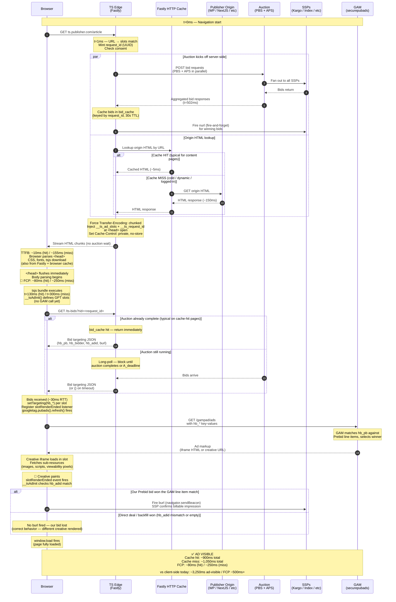

# Server-Side Ad Templates Design

_Author · 2026-04-15_

---

## 1. Problem Statement

Today's display ad pipeline on most publisher sites is structurally sequential and
browser-bound:

1. Page HTML arrives at browser
2. Prebid.js (~300KB) downloads and parses
3. Smart Slots SDK scans the DOM to discover ad placements
4. `addAdUnits()` registers slot definitions
5. Prebid auction fires from the browser (~80–150ms RTT to SSPs)
6. Bids return (~1,000–1,500ms window)
7. GPT `setTargeting()` + `refresh()` fires
8. GAM creative renders

**Total time to ad visible: ~3,100ms.**

The browser is the slowest possible place to run an auction. It must first download and
parse multiple SDKs, scan the DOM to discover what ad slots exist, and then fire SSP
requests over a consumer internet connection with high and variable latency.

Trusted Server sits at the Fastly edge — milliseconds from the user, with
data-center-to-data-center RTT to Prebid Server (~20–30ms vs ~80–150ms from a browser).
The server knows, from the request URL alone, exactly which ad slots are available on any
given page. There is no reason to wait for the browser.

---

## 2. Goal

Enable Trusted Server to:

1. Match an incoming page request URL against a set of pre-configured slot templates
2. Immediately fire the full server-side auction (all providers: PBS, APS, future wrappers)
   in parallel with the origin HTML fetch — before the browser receives a single byte
3. Inject GPT slot definitions into `<head>` so the client can define slots without any SDK
4. Cache auction results at the edge keyed by request ID. Serve them to the client via
   a fast `/ts-bids` endpoint when the client fetches them. Bid delivery is decoupled
   from page rendering — the auction never blocks FCP. The `/auction` POST endpoint is
   retained as a fallback for pages whose URLs do not match any slot template,
   preserving backward compatibility for publishers who have not yet adopted
   `creative-opportunities.toml`.
5. Eliminate Prebid.js from the client entirely

**Target time to ad visible: ~1,150ms. FCP unchanged from a no-TS baseline. Net saving
on ad-visible: ~2,100ms.**

> **Note:** The latency numbers in this document are modeled estimates based on known
> edge→PBS RTT ranges and typical origin response times. They should be validated with
> production measurements after Phase 1 ships.

---

## 3. Non-Goals

- Eliminating client-side GPT / Google Ad Manager — GAM remains in the rendering
  pipeline for Phase 1. The GAM call (`securepubads.g.doubleclick.net`) moves
  server-side in a future phase (see §9.6).
- Dynamic slot discovery (reading the DOM) — this design commits to pre-defined,
  URL-matched slot templates. Smart Slots' dynamic injection behavior is replaced by
  server knowledge.
- Changing the `AuctionOrchestrator` internally — the orchestrator already handles
  parallel provider fan-out. This design adds a new trigger point, not new auction
  logic.

---

## 4. Architecture

### 4.1 New File: `creative-opportunities.toml`

A new config file at the repo root, alongside `trusted-server.toml`. It holds all slot
templates: page pattern matching rules, ad formats, floor prices, GAM targeting
key-values, and per-provider bidder params. PBS bidder-level params (placement IDs,
account IDs) live in Prebid Server stored requests, keyed by slot ID. APS params are
specified inline per slot under `[slot.providers.aps]`.

Loaded at build time via `include_str!()` and compiled into the WASM binary. Slot
changes require a redeploy; this is intentional (fast reads, no KV overhead, no
per-request cost). A migration path to KV-backed config is tracked in §9.5.

`floor_price` is the publisher-owned hard floor per slot — the source of truth for the
minimum acceptable bid price, enforced at the edge before bids reach the ad server. Any
bid below the floor is discarded at the orchestrator level before it enters `__ts_bids`.
SSPs may apply their own dynamic floors independently within their platforms; this floor
is the publisher's baseline that supersedes all other floor logic by virtue of being
enforced earliest in the pipeline.

#### Top-level config (in `trusted-server.toml`)

```toml
[creative_opportunities]
# GAM network ID used to construct default ad-unit paths.
gam_network_id = "21765378893"

# Optional. Defaults to [auction].timeout_ms if not set.
# Recommended: 500ms (vs client-side 1000–1500ms) due to lower edge→PBS RTT.
# This value gates both the auction deadline and the <head>-boundary hold in
# streaming mode — they share the same deadline (T₀ + auction_timeout_ms).
auction_timeout_ms = 500

# Granularity table for hb_pb price bucket strings.
# Options: "low" | "medium" | "high" | "auto" | "dense" | "custom"
# Defaults to "dense" if not set.
price_granularity = "dense"
```

#### `creative-opportunities.toml` schema

```toml
[[slot]]
id = "atf_sidebar_ad"
# Optional. Defaults to "/{gam_network_id}/{id}".
# Override for non-standard GAM ad-unit paths.
gam_unit_path = "/21765378893/publisher/atf-sidebar"
# Optional. DOM container element ID. Defaults to slot id.
div_id = "div-atf-sidebar"
page_patterns = ["/20**"]
formats = [{ width = 300, height = 250 }]
floor_price = 0.50

[slot.targeting]
pos = "atf"
zone = "atfSidebar"

[slot.providers.aps]
slot_id = "aps-slot-atf-sidebar"

[[slot]]
id = "below-content-ad"
page_patterns = ["/20**"]
formats = [{ width = 300, height = 250 }, { width = 728, height = 90 }]
floor_price = 0.25

[slot.targeting]
pos = "btf"
zone = "belowContent"

[slot.providers.aps]
slot_id = "aps-slot-below-content"

[[slot]]
id = "ad-homepage-0"
page_patterns = ["/", "/index.html"]
formats = [{ width = 970, height = 250 }, { width = 728, height = 90 }]
floor_price = 1.00

[slot.targeting]
pos = "atf"
zone = "homepage"
slot_index = "0"

[slot.providers.aps]
slot_id = "aps-slot-homepage-0"
```

#### Rust types

```rust
#[derive(Debug, Clone, serde::Deserialize)]
pub struct CreativeOpportunitiesConfig {
    pub gam_network_id: String,
    #[serde(default = "default_auction_timeout_ms")]
    pub auction_timeout_ms: Option<u32>,
    #[serde(default = "PriceGranularity::dense")]
    pub price_granularity: PriceGranularity,
}

#[derive(Debug, Clone, serde::Deserialize)]
pub struct CreativeOpportunitySlot {
    pub id: String,
    pub gam_unit_path: Option<String>,   // defaults to /{gam_network_id}/{id}
    pub div_id: Option<String>,           // defaults to id
    pub page_patterns: Vec<String>,
    pub formats: Vec<CreativeOpportunityFormat>,
    pub floor_price: Option<f64>,
    #[serde(default)]
    pub targeting: HashMap<String, String>, // strings only — validated at startup
    #[serde(default)]
    pub providers: SlotProviders,
}

/// Separate from auction::AdFormat so media_type can default to Banner
/// without requiring it in the TOML. Converted to AdFormat at auction time.
#[derive(Debug, Clone, serde::Deserialize)]
pub struct CreativeOpportunityFormat {
    pub width: u32,
    pub height: u32,
    #[serde(default = "MediaType::banner")]
    pub media_type: MediaType,
}

#[derive(Debug, Clone, Default, serde::Deserialize)]
pub struct SlotProviders {
    pub aps: Option<ApsSlotParams>,
}

#[derive(Debug, Clone, serde::Deserialize)]
pub struct ApsSlotParams {
    pub slot_id: String,
}
```

> **Targeting value types:** `targeting` values are `String`-only (not
> `serde_json::Value`). GPT's `setTargeting()` only accepts `string | string[]`;
> non-string values are silently dropped by the browser. Validated at startup — a
> non-string targeting value is a startup error.

> **Slot ID validation:** Slot IDs are validated at startup against a strict allowlist
> (`[A-Za-z0-9_-]+`). IDs outside this set fail startup. This prevents XSS via
> crafted IDs appearing in the injected `<script>` block.

### 4.2 URL Pattern Matching

At request time, TS matches the request path against each slot's `page_patterns`.
Patterns use the `glob` crate (WASM-compatible):

- `/20**` — matches all date-prefixed article paths (e.g., `/2024/01/my-article/`). Note:
  `**` matches across path separators; `*` stops at `/`. Use `**` for multi-segment
  patterns.
- `/` — matches the homepage exactly
- `/index.html` — exact match

Multiple slots can match a single URL. All matching slots are collected and fed into a
single auction as separate impressions. Pattern matching is purely in-memory against the
pre-parsed config — sub-millisecond. The pattern-match cost is O(slots × patterns);
startup logs the compiled pattern count.

### 4.3 Auction Trigger

#### Async restructuring of the publisher path

The current `handle_publisher_request` is a synchronous `fn`. Running the auction in
parallel with the origin fetch requires:

1. Converting `handle_publisher_request` to `async fn`
2. Switching the origin fetch from blocking `.send()` to `.send_async()` (returns
   `PlatformPendingRequest`)
3. Adding `orchestrator: &AuctionOrchestrator` as a parameter
4. Awaiting both the auction future and the pending origin request (via the platform's
   `select` / join primitive)

This is an explicit structural change to the publisher request path. It is listed in §7
as a required migration, not a minor modification.

#### Consent and EC ID

Before firing the auction, TS reads consent signals and the EC ID from the incoming page
request — the same pipeline already executed in `handle_publisher_request` (EC ID at
line 483, consent at lines 497–508). These are forwarded into `AuctionRequest` exactly
as they are today from the client POST path.

Consent gating:

- If consent is **absent or denied** (no TCF consent string, or purpose 1 not consented):
  the auction is not fired. `__ts_bids` is omitted from the page. GPT falls back to its
  own auction. This is treated as a first-class edge case in §8.
- **Mid-page consent revocation** is out of scope for Phase 1; bids already injected into
  `<head>` remain. Phase 2 will address consent event propagation.

EC ID behavior at the new trigger is identical to the existing path — generated or read
from cookie, forwarded in the `AuctionRequest`.

#### Auction execution

When slots are matched and consent is present, TS calls
`AuctionOrchestrator::run_auction()` with the matched slots converted to `AdSlot`
objects. This happens at request receipt time — in parallel with the origin fetch via
`send_async()`.

The orchestrator's existing behaviour is unchanged:

- All providers (PBS, APS) are dispatched simultaneously
- Per-provider timeout budgets are enforced from the remaining auction deadline
  (`creative_opportunities.auction_timeout_ms`, falling back to `[auction].timeout_ms`)
- Floor price filtering, bid unification, and winning bid selection are applied as today
- PBS resolves bidder params from its stored requests by slot ID
- APS bidder params are read from `[slot.providers.aps]` in `creative-opportunities.toml`

#### Page rendering is never held

**The auction never blocks page rendering.** This is a deliberate design choice and the
single most important property of the streaming behavior.

Holding `</head>` to inject bid results would block body parsing — browsers do not begin
body render until `</head>` is received because head content (CSS, scripts) can affect
rendering. A 300–500ms head hold for the auction to complete would mean the user sees a
blank page for that entire window. This is unacceptable regardless of how good the TTFB
metric looks.

Instead, **bid delivery is decoupled from page rendering**:

1. TS forces chunked encoding on every origin response (`Transfer-Encoding: chunked`),
   regardless of origin format (WordPress, Drupal, NextJS 14, etc.). Buffered origin
   responses are re-chunked at the edge.
2. `__ts_ad_slots` is injected at the `<head>` open tag — known immediately from config,
   zero wait. Browser receives this with the first head chunk.
3. **`</head>` flushes as soon as origin emits it.** No buffering, no auction wait. Body
   parsing and rendering begin immediately.
4. The auction fires server-side in parallel with origin fetch. Results are cached at the
   edge by `request_id` with a short TTL.
5. The client tsjs bundle calls `GET /ts-bids?rid=<request_id>` to retrieve auction
   results. Server returns results when the auction completes (cache hit if already
   done; otherwise blocks the response until `A_deadline`).
6. Client applies bid targeting to GPT slots, then fires `googletag.pubads().refresh()`.

**Timing definitions and bounds:**

- `T₀` = request receipt at the edge
- `A_deadline` = `T₀ + auction_timeout_ms` (configured in
  `[creative_opportunities].auction_timeout_ms`)

The `/ts-bids` endpoint blocks until auction completion or `A_deadline`, whichever fires
first. The browser's bid wait is concurrent with body rendering — by the time the bid
fetch resolves, the user has already been viewing rendered page content for hundreds of
milliseconds.

**FCP is unaffected by the auction.** First Contentful Paint is bounded by origin time
and resource load time, exactly the same as a page without TS in the path.

**Ad timing slips by ~30ms** versus a hypothetical head-hold injection — the
client→edge→client RTT for the `/ts-bids` fetch. Negligible to users; significantly
better than today's client-side auction (~1,500ms).

### 4.4 Head Injection

TS injects a single `<script>` block at the `<head>` open tag containing
`window.__ts_ad_slots` and `window.__ts_request_id`. Bid results are NOT injected into
the page — the client fetches them via `/ts-bids` (see §4.5).

**`window.__ts_ad_slots`** — emitted at the `<head>` opening tag, immediately from
config. No auction needed. Available to GPT the moment the browser parses `<head>`.
Owned by the `gpt` integration head injector (not `prebid.rs`):

```json
[
  {
    "id": "atf_sidebar_ad",
    "gam_unit_path": "/21765378893/publisher/atf-sidebar",
    "div_id": "div-atf-sidebar",
    "formats": [[300, 250]],
    "targeting": { "pos": "atf", "zone": "atfSidebar" }
  },
  {
    "id": "below-content-ad",
    "gam_unit_path": "/21765378893/below-content-ad",
    "div_id": "below-content-ad",
    "formats": [
      [300, 250],
      [728, 90]
    ],
    "targeting": { "pos": "btf", "zone": "belowContent" }
  }
]
```

**`window.__ts_request_id`** — a per-request opaque identifier (UUID v4) minted by TS
at request receipt. Used by the client to correlate the page request with the cached
auction result via `GET /ts-bids?rid=<request_id>`:

```html
<script>
  window.__ts_ad_slots = [
    {
      id: 'atf_sidebar_ad',
      gam_unit_path: '/21765378893/publisher/atf-sidebar',
      div_id: 'div-atf-sidebar',
      formats: [[300, 250]],
      targeting: { pos: 'atf', zone: 'atfSidebar' },
    },
    /* ... */
  ]
  window.__ts_request_id = '550e8400-e29b-41d4-a716-446655440000'
</script>
```

> **Security:** All string values are JSON-serialized via `serde_json` and HTML-escaped
> before insertion into the `<script>` block. The wrapper uses `JSON.parse(ESCAPED)`,
> not raw string interpolation.

> **Cache contract:** The HTML response with `__ts_request_id` is per-user data and must
> not be cached across users. TS sets `Cache-Control: private, no-store` on the response
> before forwarding, overriding any conflicting cache headers from the publisher origin.
> `Surrogate-Control` and `Fastly-Surrogate-Control` are also stripped.

#### `/ts-bids?rid=<request_id>` endpoint

A new TS endpoint at root path `/ts-bids` serves cached auction results for a given
request ID. JSON response, keyed by slot ID:

```json
{
  "atf_sidebar_ad": {
    "hb_pb": "2.50",
    "hb_bidder": "kargo",
    "hb_adid": "abc123",
    "burl": "https://ssp.example/billing?id=abc123"
  },
  "below-content-ad": {
    "hb_pb": "1.00",
    "hb_bidder": "appnexus",
    "hb_adid": "def456",
    "burl": "https://appnexus.example/billing?id=def456"
  }
}
```

`hb_pb` is computed using the **dense** granularity table (publisher-configurable via
`price_granularity` in `[creative_opportunities]`). The key set is `hb_pb`, `hb_bidder`,
`hb_adid`, and `burl` — matching GAM standard Prebid targeting keys. `burl` is included
so the client can fire it from the `slotRenderEnded` event (see §4.6).

**Behavior:**

- If the auction has already completed for `<request_id>`, response returns immediately
  with cached results (cache hit). Typical case for non-trivial origin times.
- If the auction is still in flight, the request blocks until completion or `A_deadline`,
  whichever fires first. Long-poll semantics, capped by the auction timeout.
- If `<request_id>` is unknown (cache miss, expired TTL, or never created), returns
  `404`. Client falls back to firing GPT without pre-set targeting.
- If no slot received a bid above floor, returns `{}`. Client fires GPT without targeting.
- Response carries `Cache-Control: private, no-store`.

**Storage:** auction results cached in-process (per-edge-instance) keyed by request ID
with a 30-second TTL. Sized small (a few KB per entry) and short-lived; no Fastly KV
write on the hot path.

**Security:** request IDs are 128-bit unguessable UUIDs. Even if a request ID leaks, the
worst-case impact is reading bid metadata that's already destined for that session's
GPT slots — no cross-user data exposure.

### 4.5 Win Notifications

Win notification responsibilities are split by where the truth lives:

**`nurl` (SSP win event) — fired server-side.** When the orchestrator selects a winning
bid, TS fires a fire-and-forget background HTTP request to `nurl` from the edge
(edge→SSP RTT ~20–30ms, no auction-path latency cost). A per-integration switch
(`[integrations.prebid].fire_nurl_at_edge`, default `true`) handles cases where the PBS
deployment already fires win events internally to avoid double-firing. APS win
notification follows its own spec.

**`burl` (billing event) — fired client-side.** `burl` is embedded per slot in
`__ts_bids` (see §4.4). The `__tsAdInit` script registers a GPT `slotRenderEnded`
listener after defining slots. On render: if `!event.isEmpty` and
`event.slot.getTargeting('hb_adid')[0] === bidData.hb_adid`, the client fires `burl`
via `navigator.sendBeacon`. This confirms both that the ad rendered and that our specific
Prebid bid (not a direct deal or backfill) won the GAM line item match.

### 4.6 Client Residual

Prebid.js is eliminated. The client-side ad bootstrap is replaced by a small inline
script that reads `__ts_ad_slots`, fetches bids from `/ts-bids`, drives GPT directly,
and handles billing notifications. Slot definition happens immediately; bid targeting
and `refresh()` happen after `/ts-bids` resolves:

```javascript
window.__tsAdInit = function () {
  var slots = window.__ts_ad_slots || []
  var rid = window.__ts_request_id

  // Kick off bid fetch as early as possible. Fires in parallel with GPT setup.
  var bidsPromise = rid
    ? fetch('/ts-bids?rid=' + encodeURIComponent(rid), { credentials: 'omit' })
        .then(function (r) {
          return r.ok ? r.json() : {}
        })
        .catch(function () {
          return {}
        })
    : Promise.resolve({})

  googletag.cmd.push(function () {
    // Define slots immediately — no auction wait
    var gptSlots = slots.map(function (slot) {
      var gptSlot = googletag
        .defineSlot(slot.gam_unit_path, slot.formats, slot.div_id)
        .addService(googletag.pubads())
      Object.entries(slot.targeting).forEach(function ([k, v]) {
        gptSlot.setTargeting(k, v)
      })
      return { id: slot.id, gptSlot: gptSlot }
    })

    googletag.pubads().enableSingleRequest()
    googletag.enableServices()

    // Apply bid targeting and refresh once /ts-bids resolves.
    bidsPromise.then(function (bids) {
      gptSlots.forEach(function ({ id, gptSlot }) {
        var bidData = bids[id] || {}
        ;['hb_pb', 'hb_bidder', 'hb_adid'].forEach(function (key) {
          if (bidData[key]) gptSlot.setTargeting(key, bidData[key])
        })
      })

      // Fire burl on confirmed render
      googletag.pubads().addEventListener('slotRenderEnded', function (event) {
        var slotId = event.slot.getSlotElementId()
        var bidData = bids[slotId] || {}
        if (
          !event.isEmpty &&
          bidData.burl &&
          event.slot.getTargeting('hb_adid')[0] === bidData.hb_adid
        ) {
          navigator.sendBeacon(bidData.burl)
        }
      })

      googletag.pubads().refresh()
    })
  })
}
```

**Why slot definition happens before bid fetch resolves:** GPT slot definition is
synchronous and cheap. Defining slots early lets GPT prepare iframes and start any
internal work that doesn't require ad server response. `refresh()` is the call that
actually triggers the GAM ad request — that's the one we delay until bids arrive.

**Failure modes:**

- `/ts-bids` returns 404 (unknown rid, TTL expired) → `bidsPromise` resolves to `{}`,
  `refresh()` fires without bid targeting, GAM falls back to its own auction. Same
  graceful degradation as no-bid case.
- `/ts-bids` network failure → caught, resolves to `{}`, same fallback.
- Auction times out server-side → `/ts-bids` returns `{}`, same fallback.

This script is part of the existing `gpt` integration bundle
(`crates/js/lib/src/integrations/gpt/index.ts`), extending the existing GPT shim.
Injected via the `gpt` head injector alongside `window.__ts_ad_slots`.

### 4.7 Caching Behavior

Page assets and bid results have very different cacheability properties. The
architecture is designed so that everything that can be cached, is.

**What gets cached where:**

| Asset                    | Cached at                        | Cacheability                                              |
| ------------------------ | -------------------------------- | --------------------------------------------------------- |
| Origin HTML              | Fastly edge HTTP cache           | Yes, if origin sends `Cache-Control: public, max-age=...` |
| Origin CSS / fonts / JS  | Fastly edge + browser            | Yes (typically hashed URLs, immutable)                    |
| `tsjs` bundle            | Fastly edge + browser            | Yes (already content-hashed via `bundle.rs`, immutable)   |
| `__ts_ad_slots` payload  | Could be precomputed per pattern | In-memory match is sub-millisecond — not worth caching    |
| `__ts_request_id`        | **Never**                        | Per-request UUID, minted at request receipt               |
| Bid results (`/ts-bids`) | In-process `bid_cache`, 30s TTL  | Per-request, never shared across users                    |

**Architecture:**

1. Fastly's built-in HTTP cache stores the **origin response** keyed by URL. TS
   does not implement its own HTML caching layer — it leverages the existing
   Fastly cache.
2. On request: TS reads from cache (cache hit, ~5ms) or fetches from origin
   (cache miss, ~150ms typical).
3. TS injects `__ts_ad_slots` + `__ts_request_id` at the `<head>` open via the
   existing `el.prepend()` head handler. This injection is per-request — origin
   HTML in cache is unmodified.
4. TS forces `Transfer-Encoding: chunked` and streams the assembled response
   to the browser.
5. The auction runs in parallel regardless of HTML cache state — bids land in
   `bid_cache` keyed by `request_id`, served via `/ts-bids` when the client
   fetches.

The `bid_cache` (per-request bid results) and Fastly's HTML cache are
**independent systems**. HTML cache hit/miss does not affect auction firing;
auction firing does not affect HTML caching.

**`Cache-Control` handling:**

TS preserves the origin's `Cache-Control` header on the response sent to the
browser, with one override: when `__ts_request_id` is injected (any matched
page), TS sets `Cache-Control: private, no-store` on the **browser-facing**
response to prevent intermediate caches or the browser from caching the
per-user assembled HTML. The Fastly edge cache for the **origin** response is
unaffected — TS reads the cached origin HTML and assembles a fresh per-request
response on every hit.

`Surrogate-Control` and `Fastly-Surrogate-Control` headers from origin are
preserved (they control Fastly's cache, not the browser's).

**When caching doesn't apply:**

- **Logged-in users** — origin typically returns `Cache-Control: private`. Falls
  back to cache-miss timing (full origin fetch).
- **Personalized SSR** (per-user content, A/B test variants) — same.
- **Dynamic NextJS routes without ISR** — origin sends `Cache-Control: no-store`
  or short max-age. Falls back to cache-miss timing.
- **First request after deploy or cache purge** — cold cache, full origin fetch.
- **Long-tail URLs** — low cache hit rate, treat as cache-miss case.

For typical news / content publisher sites with anonymous visitors on stable
content pages, expect 70–90%+ edge cache hit rate. The cache-hit timing in §5
is the realistic common case, not the optimistic best case.

---

## 5. Request-Time Sequence

Sequence applies to all origins (WordPress, Drupal, Rails, NextJS 14/16, static sites).
TS forces chunked encoding on every response, so origin format is invisible from the
browser's perspective.

### 5.1 Visual Sequence (full content + creative flow)



### 5.2 Cache-Hit Sequence (typical for content publisher pages)

This is the common case for anonymous visitors on cacheable content pages.

```
t=0ms     GET ts.publisher.com/article arrives at Fastly edge

t=1ms     URL matched against creative-opportunities.toml
          Slots matched: [atf_sidebar_ad, below-content-ad, section_ad]
          Consent check: TCF consent present → auction proceeds
          Request ID minted: 550e8400-e29b-41d4-a716-446655440000

t=2ms     AuctionOrchestrator.run_auction() dispatched (parallel)
          PBS + APS dispatched in parallel via send_async()
          Edge→PBS RTT: ~20–30ms
          Fastly cache lookup dispatched in parallel
          __ts_ad_slots + __ts_request_id <script> assembled from config

t=5ms     Cache HIT — origin HTML retrieved from Fastly edge cache
          TS forces Transfer-Encoding: chunked
          <head> open chunk: TS injects __ts_ad_slots and __ts_request_id
          Cache-Control: private, no-store set on response
          Chunk forwarded to browser immediately

t=10ms    Browser receives first byte (TTFB ~10ms)
          CSS, fonts, framework JS, tsjs all begin downloading
          (most also served from Fastly cache + browser cache)

t=60ms    </head> chunk flushes to browser (no auction wait)
          Body parsing begins immediately
          FCP candidates start to render

t=80ms    FIRST CONTENTFUL PAINT ✨ (auction never blocked rendering)

t=130ms   tsjs bundle executes
          __tsAdInit() reads __ts_ad_slots
          fetch('/ts-bids?rid=...') dispatched (long-poll)
          GPT slots defined synchronously (no GAM call yet)

t=502ms   Server-side auction completes (500ms budget) or A_deadline fires
          Winning bids selected, nurl fired as background requests
          Bids cached at edge by request_id (30s TTL)
          /ts-bids long-poll resolves, response returned

t=532ms   Browser receives /ts-bids response (~30ms RTT)
          Bid targeting applied via gptSlot.setTargeting()
          slotRenderEnded listener registered for burl
          googletag.pubads().refresh() fires

t=652ms   GET /gampad/ads

t=752ms   Creative fetch

t=900ms   Creative sub-resources + paint; burl fired via slotRenderEnded

          AD VISIBLE ~900ms
          FIRST CONTENTFUL PAINT ~80ms
```

### 5.3 Cache-Miss Sequence (cold cache, dynamic page, logged-in user)

This is the worst case — first request to a URL after a deploy or cache purge,
or a page that's marked uncacheable by origin (`Cache-Control: private`).

```
t=0ms     GET ts.publisher.com/article arrives at Fastly edge
t=1ms     URL matched, request_id minted, consent checked
t=2ms     Auction dispatched, origin fetch dispatched in parallel

t=150ms   Origin HTML arrives at edge (cache miss — full origin RTT)
          TS forces chunked encoding, injects __ts_ad_slots + __ts_request_id
          Stream begins to browser

t=200ms   </head> reaches browser
t=250ms   FIRST CONTENTFUL PAINT
t=300ms   tsjs executes, fetch /ts-bids
t=502ms   Auction completes; /ts-bids resolves
t=532ms   Bids in browser, refresh() fires
t=1052ms  AD VISIBLE
```

### 5.4 Key Timing Properties

| Metric     | Cache hit | Cache miss | Client-side today |
| ---------- | --------- | ---------- | ----------------- |
| TTFB       | ~10ms     | ~155ms     | ~150–500ms        |
| FCP        | ~80ms     | ~250ms     | ~500ms+           |
| Ad visible | ~900ms    | ~1,050ms   | ~3,250ms          |

- **The auction never blocks page rendering.** FCP is bounded by origin time
  and browser parsing only — same as a page without TS in the ad path.
- **Body content paints first; ads slot in after.** The page is responsive
  and readable while ads finish loading.
- **Cache-hit FCP under 100ms is achievable** for anonymous visitors on
  stable content. This is the typical case for news publisher article pages.

---

## 6. Performance Summary

| Stage                      | Client-side today | TS cache hit | TS cache miss | Saving (cache hit) |
| -------------------------- | ----------------- | ------------ | ------------- | ------------------ |
| Origin HTML fetch          | ~150ms            | ~5ms         | ~150ms        | -145ms             |
| Script load chain          | ~700ms            | ~40ms        | ~40ms         | -660ms             |
| Script parse/JIT           | ~280ms            | ~10ms        | ~10ms         | -270ms             |
| Sequential SDK hops        | ~200ms            | 0            | 0             | -200ms             |
| Auction window             | ~1,500ms          | ~500ms       | ~500ms        | -1,000ms           |
| `/ts-bids` round-trip      | 0                 | +30ms        | +30ms         | -                  |
| GAM + creative             | ~570ms            | ~570ms       | ~570ms        | —                  |
| **Ad visible (total)**     | **~3,250ms**      | **~900ms**   | **~1,050ms**  | **~2,350ms**       |
| **First Contentful Paint** | ~500ms+           | **~80ms**    | **~250ms**    | **-420ms**         |

The auction never blocks page rendering. FCP is bounded by origin time and browser
parsing only — auction work happens entirely in parallel with origin fetch and body
streaming. For typical content publisher pages with anonymous visitors (high cache
hit rate), the cache-hit numbers are the realistic common case.

The ~30ms `/ts-bids` round-trip cost is the only latency added vs a hypothetical
head-injection design (which would block FCP and was rejected — see §4.3).

Auction RTT improvement: browser fires SSP requests at 80–150ms RTT; edge fires at
20–30ms. Auction timeout can drop from 1,000–1,500ms to 500ms while still collecting
more complete results, because edge→PBS latency is ~5–7x lower.

---

## 7. Implementation Scope

### New

- `creative-opportunities.toml` — slot template config file
- `crates/trusted-server-core/src/creative_opportunities.rs` — config types, TOML
  parsing, URL glob matching, slot-to-`AdSlot` conversion, price bucketing
- `crates/trusted-server-core/build.rs` — `include_str!()` for
  `creative-opportunities.toml`; startup slot-ID validation
- `crates/trusted-server-core/src/price_bucket.rs` — Prebid price granularity tables
  (dense default; publisher-configurable); converts raw CPM `f64` to `hb_pb` string
- `crates/trusted-server-core/src/bid_cache.rs` — in-process auction result cache keyed
  by `request_id`, 30-second TTL, fixed-size LRU. Per-edge-instance only; no Fastly KV
  writes on the hot path.
- **`/ts-bids` endpoint** — new root-path GET endpoint. Long-poll: returns immediately
  if cached, blocks until `A_deadline` if auction in flight. Returns `404` for unknown
  request IDs. `Cache-Control: private, no-store`.

### Modified

- **`crates/trusted-server-core/src/publisher.rs`** — primary structural change:
  - Convert `handle_publisher_request` from `fn` to `async fn`
  - Switch origin fetch from `.send()` to `.send_async()` (returns
    `PlatformPendingRequest`)
  - Add `orchestrator: &AuctionOrchestrator` and `bid_cache: &BidCache` parameters
  - Mint per-request UUID for `request_id`; pass into `__ts_ad_slots` injection
  - Match slots, check consent, fire auction (writes result to `bid_cache` on
    completion) and origin fetch concurrently. **Do not await the auction in the
    page-handling path** — let it complete asynchronously and write to `bid_cache`.
  - Force chunked encoding on the response (strip `Content-Length`, set
    `Transfer-Encoding: chunked`)
- **`crates/trusted-server-adapter-fastly/src/main.rs`** — update `route_request` call
  site to `.await` the now-async publisher handler; pass orchestrator and bid_cache
  references; add `/ts-bids` route handler
- **`crates/trusted-server-core/src/html_processor.rs`** — inject
  `window.__ts_ad_slots` and `window.__ts_request_id` at `<head>` open via existing
  `el.prepend()` head handler. **No `</head>` injection — head flushes immediately.**
  Set `Cache-Control: private, no-store` header on the response.
- **`crates/trusted-server-core/src/integrations/gpt.rs`** — extend head injector to
  emit `window.__ts_ad_slots` and `window.__ts_request_id` from matched slots; emit
  `__tsAdInit` bootstrap script
- **`crates/js/lib/src/integrations/gpt/index.ts`** — add `__tsAdInit` function with
  `/ts-bids` fetch + bidsPromise pattern + `slotRenderEnded` burl-firing logic
- **`crates/trusted-server-core/src/integrations/prebid.rs`** — add
  `fire_nurl_at_edge` config key; add nurl fire-and-forget call in orchestrator result
  handling
- **`trusted-server.toml`** — add `[creative_opportunities]` section
- **`crates/trusted-server-core/src/settings.rs`** — add `CreativeOpportunitiesConfig`
  to `Settings`

### Unchanged

- `AuctionOrchestrator` internals — no changes; new call site only
- PBS stored request configuration — bidder params remain in PBS, keyed by slot ID
- GAM line item configuration — targeting key-values pass through unchanged

---

## 8. Edge Cases

**No slots match the URL** — auction is not fired. Neither global is emitted. The page
loads with no TS ad stack; existing client-side Prebid/GPT flow runs unmodified (for
publishers in dual-mode rollout).

**Consent absent or denied** — auction is not fired. Neither global is emitted.
`Cache-Control: private, no-store` is still set (to prevent caching the consent-negative
response if personalised ads were previously served). Page loads normally; GAM runs its
own auction without Prebid targeting.

**Auction times out with partial results** — `/ts-bids` returns whatever bids arrived
before `A_deadline`. Slots with no bid are omitted from the response. GPT fires without
pre-set targeting for those slots; GAM falls back to its own auction for them.

**Auction times out with zero results** — `/ts-bids` returns `{}`. All slots fire GAM
without bid targeting. No revenue impact beyond the timeout scenario itself.

**Buffered origin (WordPress, Drupal, Rails, NextJS 14, static sites)** — origin
returns full HTML in one response. TS strips `Content-Length`, sets
`Transfer-Encoding: chunked`, and feeds the response through the streaming pipeline as
chunks. From the browser's perspective, behavior is identical to a streaming origin.
The auction runs in parallel with the (now-chunked) origin response; bids land in the
edge `bid_cache` and are served via `/ts-bids` when the client fetches them.

**Streaming origin (NextJS 16, Remix, SvelteKit with streaming)** — origin emits HTML
chunks progressively. TS forwards them through the streaming pipeline directly. No
buffering at the edge. `</head>` flushes the moment origin emits it. Same `/ts-bids`
fetch pattern as buffered origins.

**`/ts-bids` request with unknown `rid`** — request ID expired (>30s TTL), invalid
format, or never created. Endpoint returns `404`. Client `bidsPromise` resolves to `{}`,
GPT fires without pre-set targeting (graceful degradation).

**Slow origin** — auction has more time; results more likely to be complete by the time
the client's `/ts-bids` fetch reaches the edge. No additional impact on FCP, which is
already bounded by origin time.

**Client never fetches `/ts-bids`** — e.g., user navigates away before tsjs loads, or
JS is disabled. The cache entry expires harmlessly after 30 seconds. `nurl` for
winning bids has already fired server-side at bid-selection time, so SSP win counting
is unaffected.

**`creative-opportunities.toml` missing or malformed** — startup fails with a clear
error. No silent degradation.

**Config empty (zero slots)** — treated as "no match" for all URLs; auction never fires.
No error. Useful as a kill-switch: deploying an empty `creative-opportunities.toml`
disables the feature without a code change.

**Slot ID not found in PBS stored requests** — PBS returns a no-bid for that slot. Slot
is omitted from `__ts_bids`. The remaining slots proceed normally.

---

## 9. Open Questions

1. **URL pattern coverage** — does `/20**` cover all article paths, or are there
   non-date-prefixed article URLs? Publisher to confirm.
2. **PBS stored request setup** — slot IDs in `creative-opportunities.toml` must have
   corresponding stored requests configured in the publisher's PBS instance before this
   goes live.
3. **Homepage slot count** — the example shows slots 0 and 1. Are there additional slots
   following the same pattern? Slot IDs and count to be confirmed with ad ops.
4. **Auction timeout** — ✅ Resolved: new dedicated key
   `[creative_opportunities].auction_timeout_ms` with fallback to `[auction].timeout_ms`.
   Per-provider ceilings (`[integrations.prebid].timeout_ms`,
   `[integrations.aps].timeout_ms`) remain unchanged; the orchestrator's existing
   `min(remaining_budget, provider_timeout)` logic applies.
5. **KV-backed config migration path** — Phase 1 ships with `include_str!()` for
   simplicity and cost. When ad ops require live slot edits between deploys, the migration
   path is: load from `services.kv_store()` at request time with a compiled-in fallback.
   Design tracked as a follow-up before Phase 2.
6. **Phase 2 server-side GAM** — The real latency ceiling is the GAM call
   (`securepubads.g.doubleclick.net`). Phase 2 routes the GAM ad request through the edge
   (securepubads proxy + creative bundling), eliminating the last browser→Google hop. The
   Phase 1 architecture is designed to be shape-compatible with this: `__ts_ad_slots`
   gives the edge the full slot inventory it needs to build a server-side GAM request.
7. **`tsjs-gpt` bootstrap delivery** — ✅ Resolved: `__tsAdInit` is part of the existing
   `gpt` integration bundle, not a new integration. Injection order: `window.__ts_ad_slots`
   → existing GPT shim → `__tsAdInit` — all emitted by the `gpt` head injector in a single
   `<script>` block, guaranteeing order before GPT.js loads.
