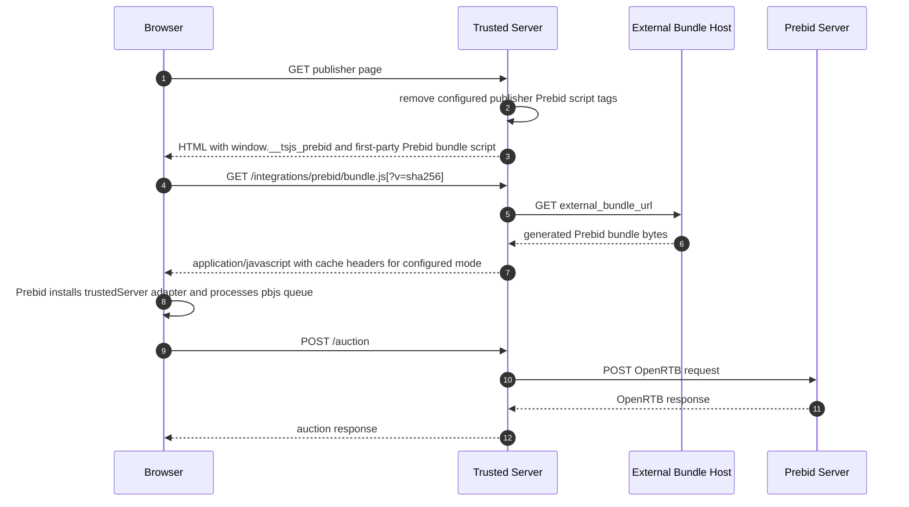

# External Prebid Bundle First-Party Proxy Design

> **Status:** Proposal
> **Date:** 2026-05-28
> **Phase:** 1 only

## Problem

The Prebid integration currently builds Prebid.js into the Trusted Server JS
artifact. The Rust `trusted-server-js` crate embeds that JS with `include_str!`,
so publisher-specific Prebid module selections become part of the Trusted Server
binary.

That creates a deployment and attestation problem: different publishers often
need different Prebid bidder adapters and User ID modules, but those choices
should not require different Trusted Server WASM artifacts. Trusted Server should
remain a stable, attestable runtime while Prebid remains a publisher-specific
browser asset.

We still need the browser to load Prebid through the publisher's first-party
origin so the integration preserves the current first-party deployment model.

## Goals

- Remove Prebid.js runtime bytes from the Trusted Server embedded JS bundle.
- Keep the current `/auction` flow and custom `trustedServer` Prebid adapter.
- Support publisher-specific generated Prebid bundles outside the Rust/Cargo
  build.
- Serve the generated Prebid bundle through a first-party Trusted Server route.
- Keep managed-mode script interception so publisher Prebid scripts are not
  double-loaded.
- Support content-addressed URLs and integrity metadata so external bundles can
  be auditable and cacheable when hash metadata is configured.
- Keep Phase 1 focused on the external bundle flow only.

## Non-Goals

- Supporting publisher-owned existing Prebid bundles in this phase.
- Supporting arbitrary runtime module selection from the Trusted Server edge.
- Replacing the custom `trustedServer` adapter with Prebid.js native S2S/PBS
  configuration.
- Building an administrative UI for bundle generation.
- Removing the Prebid npm dependency from JS tooling if it is still needed by an
  external bundle generator.

## Current Architecture Summary

Current Prebid bundling path:

1. `crates/trusted-server-js/lib/build-all.mjs` generates Prebid adapter and User ID module
   imports.
2. `crates/trusted-server-js/lib/src/integrations/prebid/index.ts` imports `prebid.js`, Prebid
   modules, generated adapters, and generated User ID modules.
3. Vite emits `tsjs-prebid.js`.
4. `crates/trusted-server-js/build.rs` copies `tsjs-prebid.js` into Cargo `OUT_DIR`.
5. `crates/trusted-server-js/src/bundle.rs` embeds it with generated `include_str!` metadata.
6. `crates/trusted-server-core/src/integrations/prebid.rs` registers Prebid as a
   deferred JS module with `.with_deferred_js()`.
7. `html_processor.rs` injects `/static/tsjs=tsjs-prebid.min.js` as a deferred
   script.
8. `publisher.rs` serves that script from embedded bytes.

Phase 1 replaces steps 3-8 for Prebid only. The core Trusted Server JS bundle
continues to work as it does today for non-Prebid modules.

## Proposed Model

Trusted Server becomes responsible for:

- Prebid server-side configuration
- `/auction`
- HTML script interception
- injecting `window.__tsjs_prebid`
- injecting a first-party script URL for the external Prebid bundle
- proxying that script URL to the configured external asset

The external generated Prebid bundle becomes responsible for:

- importing `prebid.js`
- importing selected bidder adapters
- importing selected consent and User ID modules
- registering the `trustedServer` bid adapter
- shimming `pbjs.requestBids()` as today
- calling `pbjs.processQueue()` after modules and the adapter are installed

## Configuration

Add external bundle settings under `integrations.prebid`:

```toml
[integrations.prebid]
enabled = true
server_url = "https://prebid-server.example.com/openrtb2/auction"
timeout_ms = 1000
bidders = ["example-bidder"]

# Phase 1 requires a generated external Prebid bundle.
external_bundle_url = "https://assets.example.com/prebid/trusted-prebid-abc123.js"
# Optional but recommended. Enables content-addressed URLs and immutable caching.
external_bundle_sha256 = "abc123..."

# Optional but recommended when sha256 is configured.
external_bundle_sri = "sha384-..."

[proxy]
# Required for external_bundle_url. Include the bundle host and any HTTPS redirect targets.
allowed_domains = ["assets.example.com"]
```

### Field Semantics

| Field                    | Required                               | Description                                                                                                                         |
| ------------------------ | -------------------------------------- | ----------------------------------------------------------------------------------------------------------------------------------- |
| `external_bundle_url`    | Yes when Prebid integration is enabled | Absolute `https://` URL of the generated Prebid bundle. Host must be permitted by `proxy.allowed_domains`.                          |
| `external_bundle_sha256` | No                                     | Hex SHA-256 of the exact JS bytes. When present, enables content-addressed URLs and immutable caching for versioned route requests. |
| `external_bundle_sri`    | Recommended when SHA-256 is configured | Optional browser Subresource Integrity value for the proxied first-party script response.                                           |

Prebid config should fail validation when:

- `external_bundle_url` is missing while Prebid is enabled
- `external_bundle_url` is not `https://`
- `proxy.allowed_domains` is empty while `external_bundle_url` is configured
- `external_bundle_url` host is not permitted by `proxy.allowed_domains`
- `external_bundle_sha256` is present but malformed
- `external_bundle_sri` is present but malformed

## First-Party Bundle Route

Trusted Server should expose a stable first-party route for the configured
bundle:

```text
GET /integrations/prebid/bundle.js
```

When `external_bundle_sha256` is configured, Trusted Server should inject a
content-addressed URL:

```text
GET /integrations/prebid/bundle.js?v=<external_bundle_sha256>
```

The injected script tag should use the first-party URL, not the external asset
URL directly. In content-addressed mode, it should include the hash query value
and `integrity` metadata when configured:

```html
<script
  src="/integrations/prebid/bundle.js?v=abc123..."
  integrity="sha384-..."
  defer
></script>
```

If `external_bundle_sha256` is omitted, the injected script tag should omit the
content hash query value and Trusted Server must not serve the response as an
immutable asset.

### Why Not Use `/first-party/proxy` Directly?

The generic first-party proxy is designed for creative assets. It may forward EC
IDs, follow creative-oriented response processing paths, and uses signed target
URLs. The Prebid bundle is a static application asset and should have a narrower
route with asset-specific behavior.

The new route can still reuse the lower-level proxy helper, but it should call it
with asset-safe options:

- `forward_ec_id = false`
- `copy_request_headers = false` or a minimal static-asset header set
- `stream_passthrough = true`
- redirects allowed only when every hop remains `https://` and the redirect
  target host is permitted by `proxy.allowed_domains`
- no HTML/CSS rewriting

## Runtime Request Flow



## HTML Injection Behavior

When Prebid is enabled, Prebid head injection should emit:

1. the existing `window.pbjs` queue stub
2. `window.__tsjs_prebid` config
3. a first-party script tag for `/integrations/prebid/bundle.js`, with `?v=<sha256>` when a SHA-256 hash is configured

The script tag should be injected at the same early head insertion point used by
current TSJS injection.

The generated external Prebid bundle should be `defer`-safe. It must install all
modules and the `trustedServer` adapter before calling `pbjs.processQueue()`.

## Script Interception Behavior

In Phase 1, Trusted Server always owns Prebid loading through the generated
external bundle. Therefore existing publisher Prebid script tags should continue
to be removed when they match `script_patterns`.

Requests for intercepted publisher Prebid script URLs may continue returning the
existing empty JS response. This prevents duplicate Prebid instances when the
publisher page references its original Prebid asset.

Publisher-existing Prebid mode is explicitly out of scope for Phase 1.

## External Bundle Generation

Add a generation path outside the Cargo build, for example:

```bash
node crates/trusted-server-js/lib/build-prebid-external.mjs \
  --adapters exampleBidder,anotherExampleBidder \
  --user-id-modules sharedIdSystem,uid2IdSystem \
  --out dist/prebid/
```

The generated bundle should include:

- Prebid.js core
- selected bidder adapters
- consent modules required by the integration
- selected User ID modules
- the existing Trusted Server Prebid adapter/shim logic

The generator should emit a manifest:

```json
{
  "prebidVersion": "10.26.0",
  "adapters": ["exampleBidder", "anotherExampleBidder"],
  "userIdModules": ["sharedIdSystem", "uid2IdSystem"],
  "sha256": "abc123...",
  "sri": "sha384-...",
  "filename": "trusted-prebid-abc123.js"
}
```

Trusted Server config should reference the generated asset URL. When the
manifest includes hash values, config should also reference those values to
enable content-addressed delivery, immutable caching, and browser SRI when
configured.

## Required Code Changes

### JS Build

- Stop including `src/integrations/prebid/index.ts` in the default `build-all.mjs`
  embedded TSJS discovery path, or move the Prebid external entrypoint outside
  `src/integrations`.
- Move reusable Trusted Server Prebid adapter/shim code into a module that can be
  used by the external bundle generator.
- Keep Prebid-related generated adapter/User ID imports in the external bundle
  generator, not the embedded Trusted Server build.

### Rust Integration

- Add `external_bundle_url`, `external_bundle_sha256`, and
  `external_bundle_sri` fields to `PrebidIntegrationConfig`.
- Do not register Prebid with `.with_deferred_js()`.
- Register a Prebid integration GET route for `/integrations/prebid/bundle.js`.
- Implement the route as a first-party proxy to `external_bundle_url` with static
  asset behavior.
- Inject the first-party script tag from the Prebid head injector.
- Preserve current script-pattern removal/empty-script behavior.

### Publisher Static Serving

- `/static/tsjs=tsjs-prebid.min.js` should no longer be a Prebid loading path.
- Existing deferred-module serving can remain for other integrations.

## Response Headers

For successful first-party bundle responses, Trusted Server should always set or
normalize:

```text
Content-Type: application/javascript; charset=utf-8
```

Caching depends on whether the browser-visible URL is content-addressed.

When `external_bundle_sha256` is configured, the injected URL should include
`?v=<external_bundle_sha256>` and Trusted Server should serve the response as an
immutable asset:

```text
Cache-Control: public, max-age=31536000, immutable
ETag: "sha256:<external_bundle_sha256>"
```

If the route query `v` is present, it must match `external_bundle_sha256`. If no
SHA-256 is configured, any `v` query value should return `404 Not Found`. This
avoids ambiguous cache entries.

When `external_bundle_sha256` is omitted, the injected URL should not include a
content hash query value and Trusted Server must not use `immutable`. It should
use a short-lived revalidation-oriented policy, for example:

```text
Cache-Control: public, max-age=300, s-maxage=300, stale-while-revalidate=60, stale-if-error=86400
```

In this mode, validators may be omitted. Phase 1 preserves streaming passthrough,
so Trusted Server should not buffer the bundle solely to compute an `ETag`.

## Integrity and Attestation

This design separates two attestable artifacts:

1. Trusted Server WASM binary
2. generated external Prebid bundle

The Trusted Server binary hash should no longer vary with Prebid module choices.
The Prebid bundle should be audited through its own manifest containing:

- Prebid version
- module list
- bundle hash
- SRI value
- generator version or source revision when available

When configured, browser SRI validates the first-party proxied response. SRI is
recommended with `external_bundle_sha256`, but it is not required; deployments may
use the hash metadata only for versioned first-party URLs, cache policy, and
manifest auditing.

Phase 1 does not perform mandatory edge-side SHA-256 byte validation. Doing so
would require buffering the proxied bundle and would break the streaming
passthrough behavior for this route. If `external_bundle_sha256` is omitted,
Trusted Server cannot treat the route as content-addressed. That mode trades
stronger attestation and long-lived caching for easier operations and must use
non-immutable cache headers.

## Migration Plan

1. Add required external bundle URL config and optional hash/SRI metadata.
2. Add first-party bundle proxy route and injection.
3. Add external bundle generation tooling and manifest output.
4. Remove Prebid from the embedded TSJS build and never register it as deferred JS.
5. Update docs and examples to point publishers at the generated external bundle.

## Test Plan

### Rust Tests

- Config validation accepts valid external bundle settings.
- Config validation rejects missing required external bundle settings and malformed optional hash or SRI metadata.
- Registry does not include `prebid` in embedded or deferred JS IDs.
- Head injection emits the first-party bundle URL with the configured hash when present and without a hash query value when absent.
- Script interception still removes matching publisher Prebid scripts.
- Bundle route proxies to `external_bundle_url` without forwarding EC ID.
- Bundle route rejects mismatched `v` query values when SHA-256 is configured and rejects any `v` query value when SHA-256 is omitted.
- Bundle route blocks redirects to non-HTTPS URLs.
- Bundle route blocks redirects whose target hosts are not permitted by
  `proxy.allowed_domains`.
- Bundle route emits JavaScript content type and immutable cache headers in content-addressed mode.
- Bundle route emits JavaScript content type and non-immutable short-lived cache headers when SHA-256 is omitted.

### JS Tests

- External generated bundle registers the `trustedServer` adapter.
- External generated bundle shims `requestBids()` as the previous embedded bundle
  did.
- External generated bundle calls `pbjs.processQueue()` after module/adapter
  registration.
- Client-side bidder adapter selection is reflected in the generated manifest.

### Browser/Integration Tests

- Publisher page loads no `/static/tsjs=tsjs-prebid.min.js`.
- Browser loads `/integrations/prebid/bundle.js?v=<sha256>` from first-party
  origin when SHA-256 is configured, or `/integrations/prebid/bundle.js` when it
  is omitted.
- Original publisher Prebid script tag is removed or neutralized.
- A Prebid auction still posts to `/auction`.
- No duplicate Prebid instances are created.

## Final Phase 1 Decisions

- Edge-side SHA-256 byte validation is not mandatory in Phase 1 because the route
  preserves streaming passthrough.
- Redirects are allowed only when every hop remains `https://` and each redirect
  target host is permitted by `proxy.allowed_domains`.
- The injected script tag omits `crossorigin` because the browser-visible bundle
  URL is same-origin.
