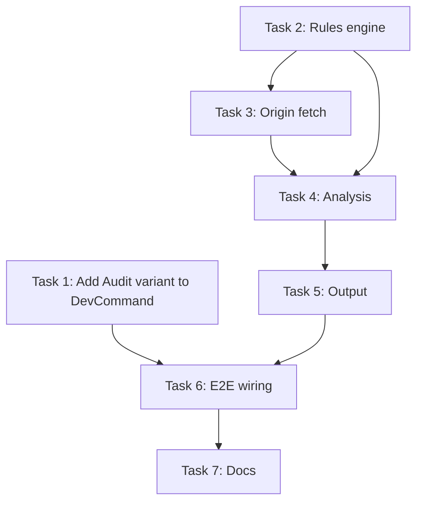

# Technical Specification: Origin Cache-Header Audit (`ts dev audit headers`)

**Status:** Draft
**Author:** @vasujain00
**Epic:** [#834](https://github.com/IABTechLab/trusted-server/issues/834)
**Planning task:** [#835](https://github.com/IABTechLab/trusted-server/issues/835)
**Related:** [#293](https://github.com/IABTechLab/trusted-server/issues/293) (cache header refactoring), [#428](https://github.com/IABTechLab/trusted-server/issues/428) (ETag multi-value), PR #860
**Last updated:** 2026-08-21

---

## 1. Overview

Trusted Server serves many content types through one edge hostname -- HTML, JS bundles, creatives/images, static assets, RTB/JSON -- each with a different optimal caching posture. Today TS mostly passes origin cache directives through untouched and exposes no diagnostics, so publishers can't tell whether each content type is cached correctly.

This spec defines `ts dev audit headers`, a CLI command that audits origin response cache directives grouped by content type and returns a per-type pass/warn/fail verdict naming the responsible header and recommending the correct value.

**Out of scope:** Auto-fixing headers, request-side cache-key/hit-ratio analysis, and the `ts dev proxy` tool.

---

## 2. Command Surface

```
ts dev audit headers [OPTIONS] [URLS...]
```

### Arguments

| Argument | Description                       |
| -------- | --------------------------------- |
| `URLS…`  | Explicit URLs to audit (optional) |

### Options

| Flag              | Description                               | Default                            |
| ----------------- | ----------------------------------------- | ---------------------------------- |
| `--config <path>` | Path to `trusted-server.toml`             | `./trusted-server.toml`            |
| `--origin <url>`  | Override origin URL (skips config lookup) | from config `publisher.origin_url` |
| `--json`          | Machine-readable JSON output              | human table                        |

### Exit codes

| Code | Meaning                               |
| ---- | ------------------------------------- |
| 0    | All groups pass                       |
| 1    | At least one group has a FAIL verdict |
| 2    | Warnings only (no fails)              |

---

## 3. Content-Type Taxonomy

Responses are classified into groups by their `Content-Type` response header. The MIME type is normalized before matching: parameters are stripped (e.g. `text/html; charset=utf-8` becomes `text/html`) and the value is lowercased.

| Group         | Matching Content-Types                                                  |
| ------------- | ----------------------------------------------------------------------- |
| `Html`        | `text/html`                                                             |
| `JavaScript`  | `application/javascript`, `text/javascript`, `application/x-javascript` |
| `Image`       | `image/*`                                                               |
| `StaticAsset` | `text/css`, `font/*`, `application/font-*`                              |
| `RtbJson`     | `application/json`                                                      |
| `Other`       | Everything else (not evaluated, reported as info)                       |

---

## 4. Cacheability Rules

Each content-type group has an expected caching posture. Rules are evaluated against: `Cache-Control`, `Surrogate-Control`, `s-maxage`, `Surrogate-Key`, `Vary`, `ETag`.

Note on `s-maxage`: Fastly honors `Surrogate-Control` first, then `s-maxage` (the shared-cache TTL from RFC 9111), then `max-age`. Rules below that reference CDN TTL behavior account for all three.

### 4.1 HTML (personalized/consent-sensitive)

| Header              | Expected                                                        | Verdict if wrong                                                                            |
| ------------------- | --------------------------------------------------------------- | ------------------------------------------------------------------------------------------- |
| `Cache-Control`     | Contains `no-store`, OR (`private` AND `no-cache`)              | FAIL: "HTML served without no-store or private+no-cache risks sharing personalized content" |
| `Vary`              | If present, should NOT contain `*`                              | WARN: "Vary: \* disables all caching including CDN"                                         |
| `Vary`              | Should NOT contain `User-Agent` or `Cookie` (hit-ratio killers) | WARN: "Vary on User-Agent/Cookie destroys CDN hit ratio for HTML"                           |
| `Surrogate-Control` | If present, contains `no-store` or `private`                    | FAIL: "CDN may cache personalized HTML"                                                     |

### 4.2 JavaScript bundles (hashed filenames, immutable)

| Header          | Expected                                                  | Verdict if wrong                                                                               |
| --------------- | --------------------------------------------------------- | ---------------------------------------------------------------------------------------------- |
| `Cache-Control` | Contains `public` AND `max-age>=31536000` AND `immutable` | WARN: "Hashed JS bundles should use long-lived immutable caching"                              |
| `ETag`          | Present (strong preferred)                                | WARN: "Missing ETag means no conditional revalidation"                                         |
| `Surrogate-Key` | Present                                                   | WARN: "Without Surrogate-Key, selective CDN purge is impossible -- full-cache purges required" |
| `Vary`          | Should NOT contain `User-Agent` or `Cookie`               | WARN: "Vary on User-Agent/Cookie destroys CDN hit ratio for JS assets"                         |

### 4.3 Images / Creatives

| Header              | Expected                                                                       | Verdict if wrong                                                     |
| ------------------- | ------------------------------------------------------------------------------ | -------------------------------------------------------------------- |
| `Cache-Control`     | Contains `public` AND `max-age>=86400`                                         | WARN: "Images re-fetched too frequently"                             |
| `Surrogate-Control` | If present, `max-age` should be >= `Cache-Control` max-age (or use `s-maxage`) | WARN: "CDN caching shorter than browser caching"                     |
| `Surrogate-Key`     | Present                                                                        | WARN: "Without Surrogate-Key, creatives can't be selectively purged" |
| `Vary`              | Should NOT contain `User-Agent` or `Cookie`                                    | WARN: "Vary on User-Agent/Cookie destroys CDN hit ratio for images"  |

### 4.4 Static Assets (CSS, fonts)

| Header          | Expected                                                  | Verdict if wrong                                                           |
| --------------- | --------------------------------------------------------- | -------------------------------------------------------------------------- |
| `Cache-Control` | Contains `public` AND `max-age>=31536000` AND `immutable` | WARN: "Static assets should use long-lived immutable caching"              |
| `Surrogate-Key` | Present                                                   | WARN: "Without Surrogate-Key, static assets can't be selectively purged"   |
| `Vary`          | Should NOT contain `User-Agent` or `Cookie`               | WARN: "Vary on User-Agent/Cookie destroys CDN hit ratio for static assets" |

### 4.5 RTB/JSON (real-time, never cached)

| Header              | Expected                        | Verdict if wrong                                          |
| ------------------- | ------------------------------- | --------------------------------------------------------- |
| `Cache-Control`     | Contains `no-store`             | FAIL: "RTB responses cached = stale bids served to users" |
| `Surrogate-Control` | If present, contains `no-store` | FAIL: "CDN caching RTB responses"                         |

Note: `no-store` alone is sufficient per RFC 9111 Section 5.2.2.5. The audit accepts any directive set that includes `no-store` (e.g. `private, no-store`, or bare `no-store`).

### 4.6 ETag handling (ref: #428)

When evaluating ETag presence, handle multi-value `If-None-Match` correctly:

- Accept both strong (`"abc"`) and weak (`W/"abc"`) ETags
- Multiple comma-separated values in `If-None-Match` are valid per RFC 7232

### 4.7 Surrogate-Key evaluation

`Surrogate-Key` (Fastly) enables targeted cache purging by tag. It is evaluated only on cacheable groups (JavaScript, Image, StaticAsset) -- non-cacheable groups (Html, RtbJson) skip the check since uncached content never needs purging. Absence is a WARN, never a FAIL: caching still works without it, but operational purges become all-or-nothing.

---

## 5. URL Discovery

When no explicit URLs are provided:

1. Read `publisher.origin_url` from `trusted-server.toml`
2. Fetch the root HTML page from origin (`/`)
3. Parse the HTML response to discover asset URLs per content type:
   - HTML: the `/` response itself
   - JS: extract `<script src="...">` URLs from the HTML response
   - Images: extract `` and `<link rel="icon">` URLs; fall back to `/favicon.ico`
   - Static: extract `<link rel="stylesheet" href="...">` URLs from the HTML response
   - RTB/JSON: not discoverable from HTML; requires explicit `--url` or presence of `/_ts/api/v1/identify` in config routes (see note below)
4. Resolve relative URLs against `publisher.origin_url`
5. Fetch each discovered URL directly from origin and classify by response `Content-Type`

**Note on `/_ts/` paths:** Routes under `/_ts/` are served by the Trusted Server edge application, NOT by the publisher origin. The audit fetches directly from the origin server, so these paths would 404. RTB/JSON endpoints must be provided explicitly via `URLS...` arguments or discovered from the origin's HTML (e.g. inline fetch targets).

When explicit URLs are provided, skip discovery and classify each by its response `Content-Type`.

---

## 6. Output Format

### 6.1 Human-readable (default)

```
Origin: https://origin.publisher.com

 Content Type  | Type Verdict | Header           | Verdict  | Recommendation
───────────────┼──────────────┼──────────────────┼──────────┼──────────────────────────────────────
 HTML          | ✗ FAIL       | Cache-Control    | ✗ FAIL   | Set `no-store` or `private, no-cache`
 HTML          |              | Vary             | ✓ PASS   | --
 JS Bundle     | ✓ PASS       | Cache-Control    | ✓ PASS   | --
 Image         | ⚠ WARN       | Cache-Control    | ⚠ WARN   | Consider `public, max-age=86400`
 RTB/JSON      | ✗ FAIL       | Cache-Control    | ✗ FAIL   | Set `no-store`

Summary (per content type): 1 pass, 1 warn, 2 fail (4 types audited)
```

The **Type Verdict** column shows the group-level rollup (worst-of across all header checks in that group). The summary counts content-type groups, matching the epic's "per-type pass/warn/fail verdict."

### 6.2 JSON (`--json`)

```json
{
  "origin": "https://origin.publisher.com",
  "groups": [
    {
      "content_type": "Html",
      "urls_sampled": ["https://origin.publisher.com/"],
      "verdict": "Fail",
      "verdicts": [
        {
          "header": "Cache-Control",
          "verdict": "Fail",
          "actual": "public, max-age=3600",
          "expected": "no-store",
          "recommendation": "HTML served without no-store risks sharing personalized content"
        }
      ]
    }
  ],
  "summary": {
    "total_groups": 4,
    "pass": 1,
    "warn": 1,
    "fail": 2
  }
}
```

---

## 7. Architecture

### 7.1 Module structure

New modules in `crates/trusted-server-cli/src/commands/dev/`:

```
audit/
  mod.rs          -- pub entry point: DevAuditCommand enum + dispatch
  headers/
    mod.rs        -- run_audit_headers()
    rules.rs      -- ContentTypeGroup, CachePolicy, evaluate()
    fetch.rs      -- AuditHeadersArgs, origin fetching, classification
    analyze.rs    -- AuditReport, GroupReport, HeaderVerdict, run_analysis()
    output.rs     -- human table + JSON rendering
```

### 7.2 Key types

```rust
pub enum ContentTypeGroup { Html, JavaScript, Image, StaticAsset, RtbJson, Other }

/// Verdicts are unit variants — messages live on `HeaderVerdict.recommendation`.
pub enum Verdict { Pass, Warn, Fail }

pub struct HeaderVerdict {
    pub header: String,
    pub verdict: Verdict,
    pub actual: Option<String>,
    pub expected: String,
    pub recommendation: String,
}

pub struct GroupReport {
    pub content_type: ContentTypeGroup,
    pub urls_sampled: Vec<String>,
    /// Group-level (per-type) verdict: worst-of rollup over `verdicts`.
    /// Any Fail -> Fail; else any Warn -> Warn; else Pass.
    pub verdict: Verdict,
    pub verdicts: Vec<HeaderVerdict>,
}

pub struct AuditReport {
    pub origin: String,
    pub groups: Vec<GroupReport>,
    pub summary: AuditSummary,
}

/// Counts are per content-type GROUP (the epic's "per-type verdict"),
/// not per header row. pass + warn + fail == total_groups.
pub struct AuditSummary {
    pub total_groups: usize,
    pub pass: usize,
    pub warn: usize,
    pub fail: usize,
}
```

---

## 8. CLI Integration

### 8.1 Adding `Audit` to existing `DevCommand`

On main, `DevCommand` (`crates/trusted-server-cli/src/commands/dev/mod.rs`) is already a `clap::Subcommand` enum with a macOS-only `Proxy` variant. The audit command adds a new variant available on **all host platforms** (not macOS-gated):

```rust
/// The `ts dev …` command group.
#[derive(Debug, clap::Subcommand)]
pub enum DevCommand {
    /// Run the local production-hostname dev proxy (macOS only).
    #[cfg(target_os = "macos")]
    Proxy(proxy::ProxyArgs),

    /// Audit origin cache headers for correctness.
    Audit(DevAuditCommand),
}

#[derive(Debug, clap::Subcommand)]
pub enum DevAuditCommand {
    /// Audit cache-related response headers per content type.
    Headers(AuditHeadersArgs),
}
```

Unlike `ts dev proxy` (macOS-only due to keychain/TLS dependencies), `ts dev audit` is cross-platform. It does not require `tokio`, `ring`, or `aws-lc-sys`.

### 8.2 Error handling

The CLI uses `CliResult<T> = Result<T, String>` with `cli_error()` / `report_error()` helpers (see `crates/trusted-server-cli/src/error.rs`). The audit command follows this pattern — returning descriptive `String` errors via `cli_error()` for failures like unreachable origins or invalid config paths.

### 8.3 HTTP client dependency scoping

`reqwest` is defined at workspace level but not currently consumed by `trusted-server-cli`. It must be added to the CLI crate's `[target.'cfg(not(target_arch = "wasm32"))'.dependencies]` section (same scope as `chromiumoxide`, `tokio`, etc.) so it does not break the workspace default `wasm32-wasip1` target:

```toml
# In crates/trusted-server-cli/Cargo.toml
[target.'cfg(not(target_arch = "wasm32"))'.dependencies]
reqwest = { workspace = true }
```

---

## 9. Design Decisions

| Decision               | Choice                                                        | Rationale                                                                                                                             |
| ---------------------- | ------------------------------------------------------------- | ------------------------------------------------------------------------------------------------------------------------------------- |
| Cacheability rules     | Hardcoded in v1                                               | YAGNI; configurable rules add complexity before we know the right defaults                                                            |
| CDN assumption         | Fastly-aware (check `Surrogate-Control`) but don't require it | TS is Fastly-first but may run elsewhere                                                                                              |
| URL discovery          | HTML-parse from origin root page                              | Config-free DX for common case; explicit URLs for CI and edge cases                                                                   |
| `no-store` sufficiency | `no-store` alone passes for HTML and RTB                      | RFC 9111 §5.2.2.5: `no-store` is the strongest single directive; requiring `private` AND `no-store` would fail correct configurations |
| CLI placement          | `ts dev audit headers`                                        | Groups under existing `dev` subcommand tree; `audit` is the sub-group for future audit types                                          |
| Cross-platform         | Available on all host targets (not macOS-only)                | Unlike proxy, audit has no OS-specific deps (no CA, no keychain, no TLS intercept)                                                    |
| Verdict type           | Unit enum (Pass/Warn/Fail)                                    | Messages belong on `HeaderVerdict`; avoids custom serde for payload-carrying variants                                                 |
| `s-maxage` awareness   | Check as CDN TTL source alongside Surrogate-Control           | Fastly resolves shared-cache TTL from Surrogate-Control > s-maxage > max-age                                                          |
| Discovery scope        | Origin-only URLs                                              | `/_ts/` paths are edge-handled; probing them against origin returns 404                                                               |

---

## 10. Tasks

### Task 1: Add `Audit` variant to `DevCommand`

**Type:** Modification (extends existing `commands/dev/mod.rs`)
**Dependencies:** None

Add `DevAuditCommand` enum with `Headers(AuditHeadersArgs)` variant to the existing `DevCommand` subcommand tree. Wire dispatch in `dev::run()`. Stub handler returns "not yet implemented" message.

**Acceptance criteria:**

- `ts dev audit headers --help` shows usage
- `ts dev proxy` still works (macOS)
- `ts dev` with no subcommand shows available subcommands
- All existing tests pass

---

### Task 2: Content-type taxonomy + cacheability rules engine

**Type:** Net-new (`commands/dev/audit/headers/rules.rs`)
**Dependencies:** None (parallel with Task 1)

Define `ContentTypeGroup`, classification function (with MIME parameter stripping), per-group expected cache postures, and `evaluate()` producing pass/warn/fail verdicts. Account for `s-maxage` as a CDN TTL source. Evaluate `Vary` on all cacheable groups (not just HTML).

**Acceptance criteria:**

- Each group has documented expected posture
- `evaluate()` returns per-header verdicts with recommendation text
- `no-store` alone passes for HTML and RTB (RFC 9111 compliance)
- Handles multi-value ETag (#428)
- Content-Type parameter stripping (`;` and after is removed before matching)
- Unit tests cover all classification + evaluation logic

---

### Task 3: Origin request engine

**Type:** Net-new (`commands/dev/audit/headers/fetch.rs`)
**Dependencies:** Task 2 (uses `ContentTypeGroup`)

Fetch responses from origin using `reqwest` (scoped to `cfg(not(target_arch = "wasm32"))`). Support explicit URL list and HTML-parsed discovery from origin root page.

**Acceptance criteria:**

- Fetches directly from origin, classifies by Content-Type
- Handles connection failures, timeouts, non-2xx gracefully via `cli_error()`
- HTML-parse discovery: extracts script/img/link tags from root page
- Does NOT probe `/_ts/*` paths (they are edge-only)
- Supports both explicit URLs and config-derived discovery

---

### Task 4: Header analysis + verdict generation

**Type:** Net-new (`commands/dev/audit/headers/analyze.rs`)
**Dependencies:** Tasks 2 + 3

Group responses by content type, run evaluation, produce `AuditReport`.

**Acceptance criteria:**

- Groups responses correctly
- Per-group, per-header verdicts with summary
- Group-level (per-type) verdict computed as worst-of rollup: any Fail -> Fail, else any Warn -> Warn, else Pass
- Summary counts content-type groups (pass + warn + fail == total_groups)
- Handles missing headers, multiple values, non-standard directives

---

### Task 5: Output formatting

**Type:** Net-new (`commands/dev/audit/headers/output.rs`)
**Dependencies:** Task 4

Terminal table (colored if tty) + `--json` mode + exit code logic. JSON serializes `Verdict` as bare string (`"Pass"`, `"Warn"`, `"Fail"`) using `#[serde(rename_all = "PascalCase")]`.

**Acceptance criteria:**

- Human output readable in terminal
- JSON output valid, stable, machine-parseable
- Exit codes: 0=pass, 1=fail, 2=warn-only

---

### Task 6: End-to-end wiring + integration tests

**Type:** Integration
**Dependencies:** Tasks 1-5

Wire `run_audit_headers()` into dispatch. Integration test with mock HTTP server.

**Acceptance criteria:**

- `ts dev audit headers` runs end-to-end
- Integration test covers pass/warn/fail scenarios
- Error messages are actionable

---

### Task 7: Documentation

**Type:** Docs
**Dependencies:** Task 6

`docs/guide/cache-header-audit.md` + update `docs/guide/cli.md` + clap help text.

**Acceptance criteria:**

- Guide covers all user scenarios with copy-pasteable examples
- `ts dev audit headers --help` is clear and useful

---

## 11. Dependency Graph



**Parallel tracks:** Tasks 1 and 2 can start immediately and independently.

---

## 12. Open Questions

1. Should `ts dev audit headers` require a running local server, or always hit the remote origin directly?
2. Should we add a `--strict` flag that treats warnings as failures (for CI gates)?
3. Should the URL discovery crawl follow redirects from the origin?
