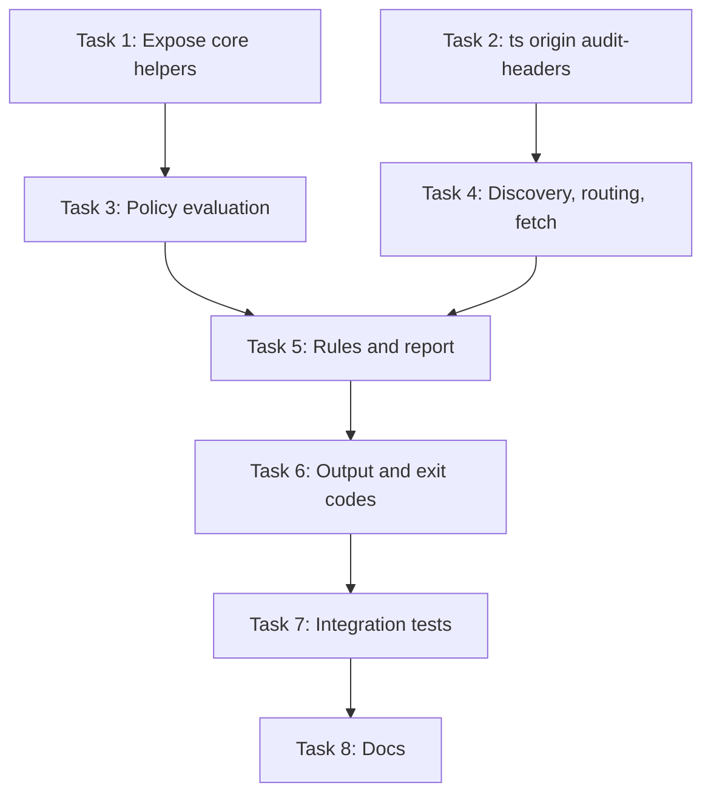

# Technical Specification: Origin Cache-Header Audit (`ts origin audit-headers`)

**Status:** Draft (revision 3)
**Author:** @vasujain00
**Epic:** [#834](https://github.com/IABTechLab/trusted-server/issues/834)
**Planning task:** [#835](https://github.com/IABTechLab/trusted-server/issues/835)
**Related:** [#293](https://github.com/IABTechLab/trusted-server/issues/293) and PR #860 (configurable cache header policies), PR #1169 (`ts origin probe-shareability`, origin readthrough, `ts cache purge`), [#1009](https://github.com/IABTechLab/trusted-server/issues/1009) (ESI template cache spike), [#428](https://github.com/IABTechLab/trusted-server/issues/428) (request-side `If-None-Match`, out of scope here)
**Last updated:** 2026-10-07

---

## 1. Overview

Trusted Server (TS) serves HTML, JavaScript, stylesheets, fonts, images, and JSON through one edge hostname. For most of these, the publisher origin's cache headers still decide how the platform's read-through cache and browsers store the response. TS changes them in a few known places:

- **Ad-serving HTML.** With `creative_opportunities.origin_readthrough_enabled` unset (the default), TS fetches the origin for ad-serving document requests with the edge cache bypassed and rewrites the response to `no-store, private` (`enforce_synthesized_html_cache_privacy`). Other document requests (bots, prefetches, consent-denied requests, pages without an ad template) keep the platform default and receive the origin's headers.
- **Origin readthrough.** With `origin_readthrough_enabled = true`, document requests use TS's request-side shareability decision instead, and cached documents are tagged with TS's own surrogate keys so `ts cache purge` can remove them. TS makes no response-side check on this path, so safety rests on the origin's own `Cache-Control`, verified with `ts origin probe-shareability`. Subresources keep the platform default either way.
- **Cookie-bearing responses.** Every adapter rewrites a non-private `Cache-Control` on a response that carries `Set-Cookie` to `private, max-age=0` and strips the edge-cache headers (`enforce_set_cookie_cache_privacy`).
- **Operator asset rules.** For non-HTML paths that an enabled `cache.asset_rules` rule or preset matches, TS replaces the origin's cache headers (`Settings::asset_cache_policy_for_path`).
- **The template cache.** With `creative_opportunities.assembly_mode = "esi"` (opt-in, Fastly-only, an experimental spike for #1009), TS stores origin HTML in a shared, reader-neutral cache, but only when the origin's headers allow it.

`ts origin probe-shareability` already answers one question about the origin: may its HTML be shared between readers? It answers by varying cookies, user agents, and configured `Vary` headers and comparing the responses. This spec adds the question it doesn't cover. `ts origin audit-headers` fetches the origin's HTML and every subresource the way TS does, works out the effective browser and shared-cache policy for each response (including the TS overrides above), and reports a per-URL and per-type verdict that names the responsible header and recommends a value. For HTML shareability it defers to the probe.

**Out of scope:** auto-fixing headers; request-side cache-key and hit-ratio analysis; the HTML shareability verdict (`ts origin probe-shareability`); `ts dev proxy`; responses TS generates itself (TSJS bundles, `/auction`, `/_ts/*`), whose policy TS owns; creatives, which TS serves through `/first-party/proxy`; auditing through the edge instead of the origin (see §13).

---

## 2. Command Surface

```
ts origin audit-headers [OPTIONS]
```

`audit-headers` joins `probe-shareability` under `ts origin` and follows its conventions: URLs arrive through a repeatable `--url`, credentials come only from the environment, origins must be HTTPS except on loopback, and redirects are never followed.

### Options

| Flag                                                   | Description                                                                                                        | Default                                  |
| ------------------------------------------------------ | ------------------------------------------------------------------------------------------------------------------ | ---------------------------------------- |
| `--url <url>`                                          | Same-site publisher URL to audit instead of running discovery (§5.3). Repeatable. JSON is only audited this way.   | discovery from `/`                       |
| `--sample <path>`                                      | Extra same-site HTML page to sample during discovery. Repeatable.                                                  | `/` only                                 |
| `--app-config <path>`, `--manifest <path>`, `--no-env` | Shared `AppConfigArgs`: config path resolution and the EdgeZero environment overlay, as in `ts audit ad-templates` | `<app.name>.toml` beside `edgezero.toml` |
| `--origin <url>`                                       | Override `publisher.origin_url`. Every other setting still comes from the config when one loads.                   | from config                              |
| `--runtime <fastly\|cloudflare\|generic>`              | Shared-cache precedence to evaluate (§4.3)                                                                         | `fastly`                                 |
| `--max-urls <n>`                                       | Cap on fetched URLs                                                                                                | `100`                                    |
| `--timeout <secs>`                                     | Per-request timeout                                                                                                | `10`                                     |
| `--strict`                                             | Treat WARN verdicts as failures (exit 1)                                                                           | off                                      |
| `--json`                                               | Machine-readable output (§7.2)                                                                                     | human table                              |

Credentials are read from the environment, never from flags, because a flag is visible to every process on the host through `ps` and lands in shell history:

| Variable                                | Use                                                                                                |
| --------------------------------------- | -------------------------------------------------------------------------------------------------- |
| `TRUSTED_SERVER_PROBE_ADMISSION_COOKIE` | A bot-wall admission cookie (`name=value`) sent on every request, shared with `probe-shareability` |
| `TRUSTED_SERVER_ORIGIN_HEADERS`         | Extra request headers for origins that require a shared secret, one `Name: value` per line         |

When no config loads (no `edgezero.toml` and no `--app-config`), `--origin` is required, and the report states that the TS overrides (Host override, asset routes, asset rules, cookie and template settings) were not applied.

### Exit codes

Same exit codes as the other `ts` assertion commands (see `docs/guide/cli.md` and `RunOutcome` in `crates/trusted-server-cli/src/run.rs`):

| Code | Meaning                                                                                                                      |
| ---- | ---------------------------------------------------------------------------------------------------------------------------- |
| 0    | Audit completed; no FAIL verdicts (WARN verdicts allowed unless `--strict`)                                                  |
| 1    | Audit completed and found a FAIL verdict, or a WARN verdict with `--strict`                                                  |
| 2    | Audit could not complete: bad arguments, a config load error, or a transport failure (DNS, connect, TLS, timeout) on any URL |

As in `ts audit ad-templates verify`, the report is written before the command exits 2, so partial results are kept. An HTTP error status is not a transport failure; it is graded (§3.3).

---

## 3. Response Model

### 3.1 Per-URL record

Each fetched URL produces one record: the requested URL, the origin request actually sent (backend URL and `Host`), the discovery context, the status, the normalized `Content-Type`, the response headers, and a transport error if the fetch failed. Every verdict belongs to exactly one record. Group verdicts are rollups over records (§6.7).

### 3.2 Classification

The discovery context decides the expected group, and the response `Content-Type` confirms it. The `Content-Type` is normalized first: parameters are stripped (`text/html; charset=utf-8` becomes `text/html`) and the value is lowercased.

| Group         | Discovery context                                                                                               | Matching Content-Types                                                  |
| ------------- | --------------------------------------------------------------------------------------------------------------- | ----------------------------------------------------------------------- |
| `Html`        | Sampled page                                                                                                    | `text/html`, `application/xhtml+xml`                                    |
| `JavaScript`  | `<script src>`, `rel="modulepreload"`, `rel="preload" as="script"`                                              | `text/javascript`, `application/javascript`, `application/x-javascript` |
| `StaticAsset` | `rel="stylesheet"`, `rel="preload" as="style"` or `as="font"`, CSS `@font-face` sources                         | `text/css`, `font/*`, `application/font-*`                              |
| `Image`       | ``, `srcset`, `<picture>` sources, lazy-load `data-src` and `data-srcset`, icons, other CSS `url()` values | `image/*`                                                               |
| `Json`        | `--url` only                                                                                                    | `application/json`, `application/*+json`                                |
| `Other`       | Anything else                                                                                                   | Everything else                                                         |

When the context and the `Content-Type` disagree (a script served as `text/plain`, or a response with no `Content-Type`), the record keeps the context's group and gets a WARN `content_type_mismatch`. A `--url` has no context, so the `Content-Type` alone decides.

`Json` carries no assumed posture. RTB responses come from the TS edge (`POST /auction`, `GET /_ts/page-bids`), not the publisher origin, so the audit never treats origin JSON as bid data. `Other` records get `not_audited` rows and stay out of the counts.

### 3.3 Status codes

- **2xx:** the content rules in §6 apply.
- **3xx:** one redirect row with the status, `Location`, and effective shared-cache policy. Fastly caches 301 and 302 responses by default, so a shared-cacheable 301 or 302 gets a WARN `redirect_shared_cacheable`. Content rules don't apply.
- **304:** not expected, because the audit sends no conditional requests. Reported as INFO.
- **4xx/5xx:** one error-response row. Fastly caches 404 and 410 responses by default, so a 404 or 410 with an effective shared TTL above 10 minutes gets a WARN `error_response_cached`. Content rules don't apply, and an error page never stands in for a sampled HTML page.
- **Transport failure:** the record carries `error`, and the run exits 2 after the report (§2).

---

## 4. Effective Cache Policy

### 4.1 Directive parsing

Every `Cache-Control`, `Surrogate-Control`, `CDN-Cache-Control`, and `Cloudflare-CDN-Cache-Control` field line is parsed into a directive map, quoted-string aware, with the same semantics as `trusted_server_core::cache_policy::cache_control_value_has_directive`. Duplicate or conflicting directives (two `max-age` values, or `immutable` next to `no-store`) resolve to the most restrictive reading and add a WARN `conflicting_directives`. Qualified `private="..."` and `no-cache="..."` are recorded but never count as their unqualified forms.

### 4.2 Browser policy

The browser policy comes from `Cache-Control`, falling back to `Expires`, `Date`, and `Age` when there is no `max-age`. It records whether a browser may store the response, the freshness lifetime, whether the response must revalidate (`no-cache`, `max-age=0`, `must-revalidate`), and `immutable`.

### 4.3 Shared-cache policy

`--runtime` selects which field governs the edge:

| Runtime      | Precedence                                                                                                                                                                                                       |
| ------------ | ---------------------------------------------------------------------------------------------------------------------------------------------------------------------------------------------------------------- |
| `fastly`     | `Surrogate-Control` (`max-age`, `stale-while-revalidate`, `stale-if-error`), then `Cache-Control` `s-maxage`, then `max-age`, then `Expires`, with `Age` subtracted. A response with `Set-Cookie` is not stored. |
| `cloudflare` | `Cloudflare-CDN-Cache-Control`, then `CDN-Cache-Control`, then `Cache-Control`. A targeted field replaces `Cache-Control` and `Expires` (RFC 9213 §2.2).                                                         |
| `generic`    | `CDN-Cache-Control`, then `Cache-Control` (`s-maxage`, `max-age`, `private`, `no-store`), then `Expires`                                                                                                         |

Fastly Compute honors the first targeted header that parses successfully, so `Surrogate-Control` can override a stricter `Cache-Control` ([Fastly, HTTP caching semantics](https://www.fastly.com/documentation/guides/concepts/edge-state/cache/cache-freshness/)). The audit therefore never reads `Cache-Control` alone as the edge policy. Fastly documents only `max-age`, `stale-while-revalidate`, and `stale-if-error` for `Surrogate-Control`, so any other `Surrogate-Control` directive is reported as INFO `unsupported_directive` and has no effect. A targeted field the selected runtime doesn't read, such as `CDN-Cache-Control` under `fastly`, gets a `not_evaluated` row instead of being ignored.

### 4.4 TS overrides

The audit applies what TS does to the origin response before a browser sees it, using TS's own public functions wherever they exist:

1. **Asset rules.** For non-HTML `GET` responses with a 2xx or 304 status whose origin policy isn't `private` or `no-store`, `Settings::asset_cache_policy_for_path` returns the TS-rendered policy. It replaces the origin policy in the effective result, and the record names the rule.
2. **Cookie privacy.** If the response carries `Set-Cookie`, the audit runs `enforce_set_cookie_cache_privacy` on a synthetic response built from the origin headers. The result is `private, max-age=0` (unless the origin was already `private` or `no-store`) with no edge-cache headers.
3. **HTML paths.** Which path a document request takes depends on the request (consent, bot classification, slot matching, reader cookies), so the audit can't pick one effective HTML policy. For each sampled page it reports which TS paths apply, from config and `match_slots`: the ad-serving bypass with `no-store, private` rewriting, readthrough with TS surrogate keys, or the platform default with the origin's headers. The origin policy is graded as the policy for requests that reach the platform default.

Each record carries both the origin policy and the effective policy. The audit never raises a WARN about an origin header that TS replaces.

---

## 5. Discovery and Fetching

### 5.1 Sampling

Without `--url`, the audit samples `/` plus each `--sample` path. Each sampled page is parsed with `scraper` (already a CLI dependency) for:

- `<script src>`, `<link rel="modulepreload">`, and `<link rel="preload">` with `as="script"`, `"style"`, `"font"`, or `"image"`
- `<link rel="stylesheet">`
- ``, `srcset` on `` and `<picture><source>`, and lazy-load `data-src` and `data-srcset`
- `<link rel="icon">`, `rel="shortcut icon"`, and `rel="apple-touch-icon"`, falling back to `/favicon.ico` when there are none
- one level of `url()` references inside fetched stylesheets (fonts and background images)

JSON is not discoverable from HTML. It is audited only from `--url`.

### 5.2 URL resolution

Relative references resolve per the WHATWG URL standard against the sampled document's URL and its `<base href>`, not against `publisher.origin_url`.

### 5.3 Mapping a URL to the origin request

A URL is same-site when its host is `publisher.domain` or the host of `publisher.origin_url`. TS rewrites origin-host URLs in HTML to the public host, so both appear in origin HTML. A same-site URL maps to the request TS would send:

1. **`/_ts/*` paths** are edge routes served by TS, not the origin. They are skipped as `not_audited` (`edge_route`).
2. **Asset routes.** If `Settings::asset_route_for_path` matches, the backend is the route's `origin_url`, with `path_pattern` and `target_path` applied, and the `Host` header is the route target's host, as in TS's `asset_origin_host_header`. Routes with `auth` (S3 SigV4) or `image_optimizer` are skipped as `not_audited` (`route_requires_auth`, `image_optimizer_route`): the audit holds no signing credentials, and image-optimizer responses come from Fastly, not the origin.
3. **Everything else** goes to `publisher.origin_url` with the `Host` header from `Publisher::origin_host_header()`, which is `origin_host_header_override` when set.

Third-party URLs are never fetched. They are listed as `not_audited` (`third_party`) so the operator can see what was left out. Every `--url` must be same-site; a third-party `--url` is an argument error (exit 2).

### 5.4 Request profile

TS forwards the browser's request headers to the origin, so the audit sends a browser-like request:

- `GET`. The body is read only for sampled HTML and stylesheets, capped at 5 MiB; every other response is closed after its headers.
- `User-Agent`: the desktop browser string `probe-shareability` already uses, shared rather than duplicated
- `Accept`: chosen per discovery context
- `Accept-Encoding: gzip`, from the CLI client's `gzip` feature, which also decodes bodies for parsing
- no cookies, apart from the admission cookie when `TRUSTED_SERVER_PROBE_ADMISSION_COOKIE` is set
- any headers from `TRUSTED_SERVER_ORIGIN_HEADERS`

The JSON output echoes the profile, with credential values redacted.

### 5.5 Redirects

No TS adapter follows origin redirects: Fastly's backend API has no follow mode, the Axum adapter uses `redirect::Policy::none()`, and the Cloudflare adapter uses `RequestRedirect::Manual`. The audit uses `redirect::Policy::none()`, like `probe-shareability` and `ts cache purge`, and grades every 3xx response as its own record (§3.3). For a sampled HTML page only, it then requests a same-site `Location` as a new record, the way a browser comes back through TS, for up to 3 hops. It never follows a redirect to another host.

### 5.6 Safety limits

Discovered URLs come from untrusted HTML, and the audit runs on operator laptops and CI runners:

- only same-site hosts are fetched (§5.3)
- targets must be HTTPS, as in `probe-shareability`; plain HTTP is accepted only for a loopback development origin
- a target that resolves to a loopback, RFC 1918, or link-local address is refused unless the configured origin itself resolves there (local development)
- `--max-urls` (default 100) and `--timeout` (default 10 seconds per request) bound the run, with at most 4 requests in flight; hitting the URL cap adds a run-level warning
- every origin-controlled string in human output (header values, URLs) goes through `escape_terminal_text`

---

## 6. Rules

Verdicts are `pass`, `info`, `warn`, `fail`, and `not_audited`. Only `warn` and `fail` affect rollups and exit codes. Each verdict carries a stable `code`, a human `message`, and, where a fix exists, a `recommendation` that holds the value to set.

### 6.1 Rules for every 2xx group

| Check                          | Condition                                                                                                                                                                                           | Verdict | Code                      |
| ------------------------------ | --------------------------------------------------------------------------------------------------------------------------------------------------------------------------------------------------- | ------- | ------------------------- |
| Edge overrides origin privacy  | Origin `Cache-Control` has `private` or `no-store`, but the effective shared policy (§4.3) is still storable, for example `Cache-Control: private` with `Surrogate-Control: max-age=3600` on Fastly | FAIL    | `edge_overrides_private`  |
| Cookie on a cacheable response | `Set-Cookie` is present and the origin policy is shared-cacheable. TS serves it as `private, max-age=0`, and Fastly's read-through cache won't store it.                                            | WARN    | `set_cookie_on_cacheable` |
| Conflicting directives         | §4.1                                                                                                                                                                                                | WARN    | `conflicting_directives`  |
| Content-Type mismatch          | §3.2                                                                                                                                                                                                | WARN    | `content_type_mismatch`   |
| Validator                      | The browser policy requires revalidation or has no freshness, and the response has neither `ETag` (strong or weak, RFC 9110 §8.8.3) nor `Last-Modified` (RFC 9110 §8.8.2)                           | WARN    | `missing_validator`       |

The audit never sends conditional requests, so request-side `If-None-Match` parsing (#428) does not apply.

### 6.2 HTML

Whether origin HTML may be shared between readers is the question `ts origin probe-shareability` answers, by varying cookies, user agents, and configured `Vary` headers and comparing the responses. A single anonymous fetch can't answer it, so this audit doesn't duplicate the probe. For each sampled page it reports:

- INFO `ts_paths`: which TS paths apply to the page (§4.4) and the origin's browser and shared-cache policy
- INFO `run_probe_shareability` when the shared-cache policy is storable, with the exact `ts origin probe-shareability --url ...` command for the sampled pages
- INFO `add_private` when the response has `no-store` without `private`. Bare `no-store` already forbids storage in any cache (RFC 9111 §5.2.2.5), but some CDNs ignore it (Fastly's VCL documentation lists it as ignored), and TS itself emits `no-store, private`.
- the §6.1 rules, which are about headers alone

The audit never recommends removing `Vary: Cookie` or `Vary: User-Agent` from HTML, because they protect cookie-dependent and dynamically served pages from cross-serving.

**Template-cache eligibility.** This applies only when `creative_opportunities.assembly_mode = "esi"`. The audit reports why the template cache would refuse the page, using TS's own gate (exposed in Task 1), with one WARN `template_cache_ineligible` per reason:

- `Cache-Control` or `Surrogate-Control` contains `private`, `no-store`, or `no-cache`
- no positive shared freshness
- `Set-Cookie` is present
- `Vary: *` or `Vary: Cookie`
- a `Vary` name that isn't listed in `template_cache_vary`
- any edge-cache header other than `Surrogate-Control` (`Fastly-Surrogate-Control`, `CDN-Cache-Control`, `Cloudflare-CDN-Cache-Control`)
- a non-200 status, a non-HTML type, or an unsupported `Content-Encoding`

These are necessary conditions only. Eligibility also depends on the request (`Authorization`, the cookie policy), which `probe-shareability` exercises and an anonymous fetch can't. With `assembly_mode = "inline"`, the default, the audit skips this assessment.

### 6.3 JavaScript and static assets

Whether a long `immutable` lifetime is safe depends on whether the URL changes when the content changes ([RFC 8246](https://www.rfc-editor.org/rfc/rfc8246.html)).

| URL                                                                                                                                                              | Expectation                                                                                 | Verdict if not met                                     |
| ---------------------------------------------------------------------------------------------------------------------------------------------------------------- | ------------------------------------------------------------------------------------------- | ------------------------------------------------------ |
| Matches an enabled `cache.asset_rules` rule                                                                                                                      | TS sets the policy, so origin TTL checks are skipped                                        | INFO `policy_set_by_ts_rule`, naming the rule          |
| Filename fingerprint, detected with TS's `CacheAssetFingerprintStyle` detectors (a hex suffix of 8 or more characters, or the 8-character esbuild Base32 suffix) | Browser `max-age` of at least 31536000 with `immutable`, and a shared TTL of at least 1 day | WARN `fingerprinted_short_ttl`                         |
| Anything else (a stable URL such as `/js/app.js`, or a `?ver=` query string)                                                                                     | A validator (§6.1) and no `immutable`                                                       | WARN `immutable_on_stable_url` when `immutable` is set |

The ambiguous `vite-base64-url` style is not used for detection, matching the `cache.asset_rules` validation that refuses `immutable` with it. `public` is never required: RFC 9111 §5.2.2.9 calls it unnecessary on a response that `max-age` already makes cacheable.

On a shared-cacheable asset, `Vary` containing `Cookie` or `User-Agent` gets a WARN `vary_hit_ratio`, and `Vary: *` gets a WARN `vary_wildcard`.

### 6.4 Images

Images use the same fingerprint logic as §6.3. A stable image URL should have an effective shared TTL of at least 1 day; otherwise it gets a WARN `short_shared_ttl` recommending `max-age=86400` or a `Surrogate-Control` TTL. `Vary: Accept` is fine (format negotiation), while `Cookie` and `User-Agent` get `vary_hit_ratio`.

### 6.5 JSON

JSON gets only the §6.1 rules, plus an INFO row showing the effective browser and shared-cache policies and an `add_private` INFO under the same condition as HTML. No group-specific posture is assumed.

### 6.6 Surrogate-Key

`Surrogate-Key` is advisory and only checked with `--runtime fastly`. Subresources keep the platform default even with origin readthrough enabled, so TS never tags them; cacheable JavaScript, static-asset, and image records without an origin `Surrogate-Key` get an INFO `no_surrogate_key`. Fastly can still purge a single URL without a key; keys only make group purges possible. The check never affects rollups. Documents cached through readthrough carry TS's own keys and are purged with `ts cache purge`.

### 6.7 Rollups

A record's verdict is the worst of its `warn` and `fail` checks, or `pass` when there are none. A group's verdict is the worst over its records. Groups with no audited records appear as `not_audited` and stay out of the pass, warn, and fail counts.

---

## 7. Output Format

### 7.1 Human-readable (default)

```
Origin: https://origin.example.com (runtime: fastly)

 Type         | URL                                | Verdict | Check                    | Recommendation
──────────────┼────────────────────────────────────┼─────────┼──────────────────────────┼──────────────────────────────────────────
 HTML         | /                                  | ℹ INFO  | run_probe_shareability   | ts origin probe-shareability --url ...
 JavaScript   | /assets/app.3f9a1c2b.js            | ✓ PASS  |                          |
 JavaScript   | /js/legacy.js                      | ⚠ WARN  | immutable_on_stable_url  | `max-age=3600` with an `ETag`
 Image        | /images/hero.jpg                   | ✗ FAIL  | edge_overrides_private   | `Surrogate-Control: max-age=0`
 Other        | https://cdn.example.net/vendor.js  | -       | third_party              | not audited

Summary (per content type): HTML pass, JavaScript warn, Image fail, StaticAsset not audited (3 types audited)
```

Each row is one check on one URL. The type-level verdict is the rollup from §6.7.

### 7.2 JSON (`--json`)

The JSON contract mirrors `ts audit ad-templates verify --json`: snake_case enum values, per-URL entries in discovery order, a stable `code` next to a `message` that consumers must not parse, and `ok` and `strict` at the top. In `--json` mode, stdout carries only this document.

```json
{
  "ok": false,
  "strict": false,
  "origin": "https://origin.example.com",
  "runtime": "fastly",
  "request_profile": {
    "user_agent": "Mozilla/5.0 (Windows NT 10.0; Win64; x64) AppleWebKit/537.36 (KHTML, like Gecko) Chrome/130.0.0.0 Safari/537.36",
    "accept_encoding": "gzip",
    "admission_cookie": "redacted",
    "extra_headers": []
  },
  "urls": [
    {
      "url": "https://www.example.com/images/hero.jpg",
      "origin_request": {
        "url": "https://origin.example.com/images/hero.jpg",
        "host": "www.example.com"
      },
      "group": "image",
      "context": "img",
      "status": 200,
      "content_type": "image/jpeg",
      "error": null,
      "verdict": "fail",
      "origin_policy": {
        "browser_ttl_secs": 0,
        "shared_ttl_secs": 3600,
        "governing_field": "surrogate_control"
      },
      "effective_policy": {
        "browser_ttl_secs": 0,
        "shared_ttl_secs": 3600,
        "governing_field": "surrogate_control",
        "ts_override": null
      },
      "checks": [
        {
          "header": "surrogate_control",
          "verdict": "fail",
          "code": "edge_overrides_private",
          "actual": "max-age=3600",
          "message": "Cache-Control is private, but Fastly reads Surrogate-Control first and stores the response for 3600 seconds.",
          "recommendation": "Surrogate-Control: max-age=0"
        }
      ]
    }
  ],
  "groups": [{ "group": "image", "verdict": "fail", "urls_audited": 1 }],
  "summary": {
    "groups_audited": 3,
    "pass": 1,
    "warn": 1,
    "fail": 1,
    "not_audited": 1
  },
  "warnings": []
}
```

---

## 8. Architecture

### 8.1 Module structure

New module in `crates/trusted-server-cli/src/commands/origin/`:

```
audit_headers/
  mod.rs       -- AuditHeadersArgs (clap), run_audit_headers() -> CliResult<RunOutcome>
  discover.rs  -- HTML and CSS reference extraction, URL resolution
  route.rs     -- URL to origin-request mapping (§5.3)
  fetch.rs     -- request profile, redirects, limits, on the shared reqwest client
  policy.rs    -- directive parsing, browser and shared-cache policy, TS overrides
  rules.rs     -- classification and the §6 rules
  report.rs    -- UrlResult, GroupResult, AuditReport, rollups
  output.rs    -- human and JSON writers over the injected io::Write
```

### 8.2 Key types

```rust
/// Content-type group a record is graded under.
pub(crate) enum ContentTypeGroup { Html, JavaScript, StaticAsset, Image, Json, Other }

/// Outcome of one check; serialized as snake_case.
pub(crate) enum Verdict { Pass, Info, Warn, Fail, NotAudited }

/// Header (or status line) a check is about.
pub(crate) enum AuditedHeader {
    CacheControl, SurrogateControl, CdnCacheControl, CloudflareCdnCacheControl,
    Expires, Age, Vary, ETag, LastModified, SetCookie, SurrogateKey, ContentType, Location,
}

/// The request the audit sent, mirroring what TS would send to origin.
pub(crate) struct OriginRequest {
    pub url: url::Url,
    pub host: String,
}

/// One fetched URL and every check graded against it.
pub(crate) struct UrlResult {
    pub url: url::Url,
    pub origin_request: Option<OriginRequest>,
    pub group: ContentTypeGroup,
    pub context: Option<DiscoveryContext>,
    pub status: Option<u16>,
    pub content_type: Option<String>,
    pub error: Option<String>,
    pub origin_policy: Option<CachePolicySummary>,
    pub effective_policy: Option<CachePolicySummary>,
    pub verdict: Verdict,
    pub checks: Vec<HeaderCheck>,
}

/// One rule outcome. `code` is stable; `message` is for humans only.
pub(crate) struct HeaderCheck {
    pub header: AuditedHeader,
    pub verdict: Verdict,
    pub code: &'static str,
    pub actual: Option<String>,
    pub message: String,
    pub recommendation: Option<String>,
}

/// Browser and shared-cache policy derived in §4.
pub(crate) struct CachePolicySummary {
    pub browser_storable: bool,
    pub browser_ttl_secs: Option<u64>,
    pub must_revalidate: bool,
    pub immutable: bool,
    pub shared_storable: bool,
    pub shared_ttl_secs: Option<u64>,
    pub governing_field: AuditedHeader,
    pub ts_override: Option<TsOverride>,
}

/// Whole-run report; group verdicts roll up from `urls`.
pub(crate) struct AuditReport {
    pub ok: bool,
    pub strict: bool,
    pub origin: url::Url,
    pub runtime: Runtime,
    pub request_profile: RequestProfile,
    pub urls: Vec<UrlResult>,
    pub groups: Vec<GroupResult>,
    pub summary: AuditSummary,
    pub warnings: Vec<RunWarning>,
}
```

---

## 9. CLI Integration

### 9.1 Adding `audit-headers` to `ts origin`

```rust
/// Subcommands under `ts origin`.
#[derive(Debug, Subcommand)]
pub enum OriginCommand {
    /// Check whether an origin's responses may be shared between readers.
    ProbeShareability(ProbeShareabilityArgs),
    /// Audit origin cache headers per content type.
    AuditHeaders(audit_headers::AuditHeadersArgs),
}
```

`AuditHeadersArgs` derives `clap::Args`, so the variant needs no `#[command(subcommand)]`; that attribute is only for a variant wrapping a subcommand enum, such as `ts audit`'s `AdTemplates`. clap derives the `audit-headers` name from the variant.

Today `commands::origin::run` returns `CliResult<()>`, and `run.rs` maps success to `RunOutcome::Success`, so exit 1 is unreachable through `ts origin`. Task 2 changes `origin::run` to return `CliResult<RunOutcome>` and `run.rs` to pass it through. `probe-shareability` keeps its current behavior, returning an error when the origin is not shareable, so this change doesn't alter its exit codes (§13).

### 9.2 Configuration

`AuditHeadersArgs` flattens `AppConfigArgs` and loads settings with `load_settings`, which applies the EdgeZero environment overlay (for example `TRUSTED_SERVER__PUBLISHER__ORIGIN_URL`). The audit reads `publisher.domain`, `publisher.origin_url`, `Publisher::origin_host_header()`, `proxy.asset_routes`, `cache.asset_rules`, and `creative_opportunities` (assembly mode, readthrough, template settings, and slots).

### 9.3 Error handling

The CLI uses `CliResult<T> = Result<T, String>` with the `cli_error()` and `report_error()` helpers (see `crates/trusted-server-cli/src/error.rs`). Tool failures return an error, which `main.rs` turns into exit 2. A transport failure on one URL is recorded on its record; the command writes the full report and then returns an error, as `ts audit ad-templates verify` does.

### 9.4 Output

`print_stdout` and `print_stderr` are workspace lints that CI runs with `-D warnings`. `ts origin` subcommands already receive an injected `io::Write` from `run.rs`, so `output.rs` writes through it.

### 9.5 HTTP client

The audit reuses the CLI's existing HTTP client; no dependency changes. `trusted-server-cli` already declares `reqwest` 0.12 with `default-features = false` and the `gzip`, `json`, and `rustls-tls-webpki-roots-no-provider` features for `probe-shareability` and `ts cache purge`. The `-no-provider` feature matters. The CLI already links rustls's `aws-lc-rs` provider through `reqwest` 0.13 (`chromiumoxide`, `edgezero-cli`). The workspace's `rustls-tls` feature would add `ring` as well, making rustls's process default ambiguous so that the `ServerConfig::builder()` and `ClientConfig::builder()` calls in `ts dev proxy` panic. Without a provider feature, `reqwest` panics with `No provider set` unless a default is installed. The audit therefore calls `crate::tls::install_crypto_provider()` before building its client, as the existing commands do.

---

## 10. Design Decisions

| Decision               | Choice                                                          | Rationale                                                                                                                                                                                     |
| ---------------------- | --------------------------------------------------------------- | --------------------------------------------------------------------------------------------------------------------------------------------------------------------------------------------- |
| CLI placement          | `ts origin audit-headers`                                       | `ts origin` holds questions about the publisher origin's behavior. Sitting next to `probe-shareability` reuses its HTTP client, browser user agent, redirect policy, and credential handling. |
| HTML shareability      | Deferred to `ts origin probe-shareability`                      | Shareability needs varied requests and response comparison. The probe already does that and gates `origin_readthrough_enabled`.                                                               |
| What is audited        | Origin responses, with TS overrides applied                     | Origin headers decide read-through caching and what browsers receive wherever TS doesn't override. Showing origin and effective policy avoids false WARNs.                                    |
| Shared-cache policy    | Per-runtime precedence                                          | Fastly lets `Surrogate-Control` override a stricter `Cache-Control`; RFC 9213 targeted fields replace `Cache-Control`.                                                                        |
| `immutable`            | Recommended only for fingerprinted URLs                         | Matches the `cache.asset_rules` validation and the #860 cache-control design.                                                                                                                 |
| `no-store` sufficiency | `no-store` alone passes; INFO suggests adding `private`         | RFC 9111 §5.2.2.5 forbids storage; some CDNs ignore `no-store`, and TS emits `no-store, private`.                                                                                             |
| Redirects              | Never followed across hosts; every 3xx is graded                | Mirrors every TS adapter, none of which follows origin redirects.                                                                                                                             |
| Discovery scope        | Same-site URLs through configured routes; no `/_ts/` paths      | Third-party and edge-owned responses aren't the publisher origin's.                                                                                                                           |
| Credentials            | Environment variables only                                      | Same rule as `probe-shareability` and `ts cache purge`: flags leak through `ps` and shell history.                                                                                            |
| Exit codes             | 0, 1, 2 with `--strict`                                         | Same contract as the other assertion commands.                                                                                                                                                |
| HTTP client            | The CLI's existing `reqwest` with the installed rustls provider | Keeps one rustls provider in the CLI (§9.5).                                                                                                                                                  |
| Cacheability rules     | Hardcoded in v1                                                 | YAGNI; configurable rules add complexity before we know the right defaults.                                                                                                                   |

---

## 11. Tasks

### Task 1: Expose TS's cache helpers from core

**Type:** Modification (`crates/trusted-server-core`)
**Dependencies:** None

Make two existing private checks public so the CLI grades with TS's own logic: the filename fingerprint detector behind `CacheAssetFingerprintStyle`, and the template-cache gate as a function that returns its bypass reasons. The test-only `template_cache_bypass_reason` in `publisher.rs` already has the right shape.

**Acceptance criteria:**

- No behavior change in TS; existing asset-rule and template-cache tests pass
- `cargo test-fastly` and `cargo clippy-fastly` pass

---

### Task 2: Add `ts origin audit-headers`

**Type:** Modification (`commands/origin/mod.rs`, `run.rs`)
**Dependencies:** None (parallel with Task 1)

Add `AuditHeadersArgs` in `audit_headers/mod.rs` and the `AuditHeaders` variant. Change `origin::run` to return `CliResult<RunOutcome>`, with `probe-shareability` mapping its current success to `RunOutcome::Success`. A stub handler returns `RunOutcome::Success`.

**Acceptance criteria:**

- `ts origin audit-headers --help` shows usage
- `ts origin probe-shareability` behaves exactly as before, including its exit codes
- All existing CLI tests pass

---

### Task 3: Effective policy evaluation

**Type:** Net-new (`audit_headers/policy.rs`)
**Dependencies:** Task 1

Implement §4: directive parsing, browser policy, per-runtime shared-cache policy, and the TS overrides.

**Acceptance criteria:**

- `Cache-Control: private` with `Surrogate-Control: max-age=3600` is shared-storable under `fastly`
- `CDN-Cache-Control` produces `not_evaluated` under `fastly`
- `Age` subtraction, the `Expires` fallback, duplicate and conflicting directives, and qualified `private` are covered
- Asset-rule and cookie overrides match TS's `asset_cache_policy_for_path` and `enforce_set_cookie_cache_privacy`

---

### Task 4: Discovery, routing, and fetching

**Type:** Net-new (`audit_headers/discover.rs`, `audit_headers/route.rs`, `audit_headers/fetch.rs`)
**Dependencies:** Task 2

Implement §5 on the shared client, calling `tls::install_crypto_provider()` first.

**Acceptance criteria:**

- Relative URLs resolve against the document URL and `<base href>`
- Same-site URLs map through `asset_route_for_path` and `origin_host_header()`; edge, third-party, auth, and image-optimizer routes are reported as `not_audited`
- Redirects are never followed across hosts, and a sampled page follows at most 3 same-host hops
- HTTPS-only (loopback excepted), limits, and private-address refusal apply
- Credentials come only from the environment and are redacted in output

---

### Task 5: Rules and report

**Type:** Net-new (`audit_headers/rules.rs`, `audit_headers/report.rs`)
**Dependencies:** Tasks 3 and 4

Implement §3.2, §3.3, and §6.

**Acceptance criteria:**

- Every `code` in §3 and §6 has a unit test
- Rollups follow §6.7, and `not_audited` stays out of the counts

---

### Task 6: Output and exit codes

**Type:** Net-new (`audit_headers/output.rs`)
**Dependencies:** Task 5

Implement §7 and the exit codes in §2.

**Acceptance criteria:**

- Human output escapes origin-controlled strings with `escape_terminal_text`
- A golden test pins the `--json` contract, and stdout carries only JSON in `--json` mode
- Exit codes 0, 1, and 2 are covered, including `--strict` and a transport failure

---

### Task 7: Integration tests

**Type:** Integration
**Dependencies:** Task 6

Reuse the `support_origin::FixtureServer` fixture that `tests/origin_probe.rs` drives. It records every request, so tests can assert the `Host` header and backend each URL reached.

**Acceptance criteria:**

- Pass, warn, and fail scenarios
- A redirect, a 404, a cookie-bearing asset, and a third-party URL
- The fixture observes the configured Host override and an asset-route backend

---

### Task 8: Documentation

**Type:** Docs
**Dependencies:** Task 7

Add `docs/guide/cache-header-audit.md`, a `ts origin` section in `docs/guide/cli.md` covering both subcommands, and a sidebar entry in `docs/.vitepress/config.mts` next to CLI and Dev Proxy. Cross-link the guide with the `probe-shareability` steps in `docs/guide/configuration.md`, and update the placement note in epic #834.

**Acceptance criteria:**

- The guide covers every rule code with a copy-pasteable fix
- `ts origin audit-headers --help` is clear and useful

---

## 12. Dependency Graph


```mermaid
flowchart TD
    T1["Task 1: Expose core helpers"] --> T3["Task 3: Policy evaluation"]
    T2["Task 2: ts origin audit-headers"] --> T4["Task 4: Discovery, routing, fetch"]
    T3 --> T5["Task 5: Rules and report"]
    T4 --> T5
    T5 --> T6["Task 6: Output and exit codes"]
    T6 --> T7["Task 7: Integration tests"]
    T7 --> T8["Task 8: Docs"]
```

**Parallel tracks:** Tasks 1 and 2 can start immediately and independently.

---

## 13. Open Questions

1. Should the effective shared-cache evaluation move into `trusted-server-core`, so the template-cache gate and the CLI share one implementation? v1 keeps it in the CLI, with parity tests built from the gate's cases.
2. Should a later version also audit through a TS staging host, to see TS-rendered headers end to end? v1 audits the origin only. Origins that accept only CDN traffic need `TRUSTED_SERVER_ORIGIN_HEADERS` for their shared secret, or a run from an allowed host.
3. Should `--runtime` default from the deployment target instead of `fastly`?
4. Should `probe-shareability` move its "not shareable" result from exit 2 to exit 1 once `ts origin` carries `RunOutcome`, so CI can tell it from a tool failure? That is a behavior change for an existing command and belongs in its own PR.

Resolved since the previous revision: the audit always goes to the origin directly (previously question 1), `--strict` exists (question 2), and redirects are never followed across hosts (question 3).
