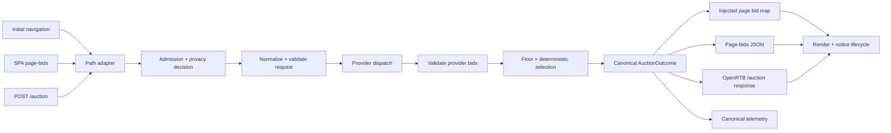

# Server-Side and Client-Side Auction Parity Design

_Author: Codex · 2026-07-14_

Status: Proposed master design, approved for specification by the user. Runtime
implementation requires a separately reviewed plan for each delivery phase.

---

## 1. Purpose

Trusted Server supports three ways to initiate an auction:

1. an initial publisher navigation, using split dispatch/collect execution while
   the origin response is fetched;
2. SPA navigation through `GET /__ts/page-bids`; and
3. browser-driven auctions through `POST /auction`, including the core `requestAds`
   API, the custom Prebid `trustedServer` adapter, and GPT refreshes.

These paths currently share provider implementations and parts of the orchestrator,
but they do not share one complete contract. Request construction, endpoint admission,
slot validation, error handling, response projection, rendering, notice delivery, and
telemetry differ by path. Those differences can change privacy exposure, bidder
eligibility, the winning bid, creative rendering, provider accounting, or observability.

This document defines the canonical auction contract and the boundaries that every
entry path must use. It is the single program-level source of truth. Delivery remains
split into independently testable implementation phases so high-risk fixes can ship
without waiting for the entire program.

## 2. Decision summary

Trusted Server will use a **shared canonical auction pipeline with thin path adapters**.
Every entry path must produce the same validated domain request and consume the same
auction outcome. Path adapters may differ in transport, latency strategy, and final
rendering integration, but not in privacy decisions, slot validity, provider bid
validity, price/floor comparisons, deterministic tie-breaking, or bid identity.

Executable ad markup will be preserved for compatibility only when it is rendered in a
guaranteed isolated iframe. Trusted Server will never inject provider markup into the
publisher's top-level document or an unsandboxed same-origin iframe. Sanitization that
removes scripts is not the production compatibility boundary; sandbox isolation is.

The program is delivered in five phases:

1. security and endpoint admission;
2. canonical request construction and auction economics;
3. bid response, creative rendering, and notice lifecycle;
4. browser lifecycle and media capability parity; and
5. telemetry, adapter validation, cross-language contracts, and documentation.

Each phase receives its own implementation plan and can be reviewed, tested, deployed,
and rolled back independently. This master design must not be reinterpreted separately
by those plans.

## 3. Goals

- Make security, privacy, consent, identity, validation, economics, and failure rules
  identical for equivalent auctions regardless of entry path.
- Put common behavior in shared Rust or TypeScript functions instead of duplicating it
  in endpoint, publisher, or integration-specific code.
- Preserve provider bid identity and all data required for rendering, accounting,
  debugging, and telemetry without forwarding arbitrary provider metadata to browsers.
- Make winner selection deterministic and independent of provider response completion
  order.
- Preserve valid direct-provider bids when another provider or mediator fails.
- Give executable creatives one explicit, testable isolation boundary.
- Separate win, render, and billing events and fire notices exactly once per auction bid
  at the correct lifecycle event.
- Preserve publisher ad-unit/media/bidder configuration across initial auctions, SPA
  navigation, and refresh without mutating publisher-owned objects.
- Make adapter limitations explicit and fail configuration early when a requested
  capability cannot be provided.
- Establish cross-language contract fixtures so Rust and TypeScript consumers cannot
  silently drift.
- Provide a traceable disposition and acceptance test for every confirmed audit finding.

## 4. Non-goals

- Implementing a billing-grade impression ledger or exactly-once notice delivery.
- Adding a production ad-server mediator beyond the existing mediator interface.
- Adding multi-currency auction comparison. Phase 2 remains USD-only and rejects bids
  in a different currency rather than comparing unlike values.
- Making Cloudflare or Spin perform true concurrent provider fan-out when their runtime
  adapters cannot provide it.
- Adding server-side native or video demand where no provider implementation exists.
  Unsupported media must be preserved for eligible client bidders or rejected
  explicitly; it must not be silently coerced to banner.
- Recording native browser bidder outcomes as server-side wins. Browser and server
  telemetry may be correlated later, but must retain distinct meanings.
- Providing an authenticated server-to-server public auction API. `/auction` remains a
  same-origin browser endpoint.
- Refactoring unrelated publisher proxy, consent, EC, or integration code.
- Treating the existing `adserver_mock` as a production mediator or price decoder.

## 5. Definition of parity

Parity does not mean byte-identical HTTP requests or identical latency. Two auction
paths are in parity when the same logical publisher, page, privacy decision, slots,
provider configuration, and provider responses yield:

- the same eligible provider/slot pairs;
- the same normalized OpenRTB/business inputs;
- the same valid bid candidates;
- the same floor decisions and deterministic winner;
- the same preserved bid/render/notice identity;
- equivalent no-bid and partial-failure semantics; and
- telemetry with the same meaning.

Differences are allowed only when declared by a capability matrix. Examples include
split dispatch versus synchronous execution, a sequential adapter rejecting
multi-provider configuration, and native bidders executing only in the browser.

## 6. Current and target architecture



Path adapters own only transport-specific work:

- parsing the incoming wire shape;
- obtaining the real request URL/path;
- choosing split or synchronous orchestration;
- serializing the path's response shape; and
- integrating with GPT, Prebid, or direct TS rendering.

The shared pipeline owns all behavioral decisions.

## 7. Canonical domain contracts

### 7.1 `AuctionAdmission`

`AuctionAdmission` is computed once before identity resolution or provider dispatch. It
contains:

- `source`: `InitialNavigation`, `SpaNavigation`, or `AuctionApi`;
- `auction_enabled`;
- `request_allowed` and a typed denial reason;
- normalized publisher origin and page URL;
- `ConsentContext` and the resulting auction/identity/EID decisions;
- request metadata needed by providers after split dispatch, including user agent,
  language, DNT/GPC, client IP/geo, referer, and selected forwarded headers; and
- a fresh random `auction_id`.

An EC ID is user identity, not auction identity. It must never be used to derive
`auction_id`. Each attempted auction receives a UUID even when the same EC participates
in multiple page loads or refreshes.

### 7.2 `CanonicalPage`

All entry paths construct the same page representation:

- `publisher_origin`: the trusted public origin of the downstream request;
- `page_url`: absolute same-origin URL with fragment removed;
- `telemetry_path`: path only, with query and fragment removed; and
- `referer`: validated request referer when available.

The public origin is not `publisher.origin_url`, which identifies the upstream backend.
It is derived from `RequestInfo` only after the adapter has removed spoofable forwarded
headers: the host comes from the downstream `Host` header and must equal
`publisher.domain` or be a subdomain of it; the scheme comes from adapter-authenticated
TLS metadata. HTTPS is required in production. Plain HTTP is accepted only when
`publisher.domain` is `localhost` or a loopback IP, in which case the sanitized `Host`
port is retained for Axum/local development. A missing trusted scheme/host or a host
outside the configured publisher domain is rejected before auction work.

Initial navigation uses the actual downstream URL. SPA page-bids validates its `path`
against the publisher origin. `/auction` clients send `pageUrl`; during migration, a
missing value falls back to a same-origin `Referer`, then the publisher root. A supplied
cross-origin, credential-bearing, malformed, or over-2048-byte URL is a bad request.
Provider requests receive `page_url`; telemetry receives only `telemetry_path`.

### 7.3 `CanonicalAuctionRequest`

The normalized request contains:

- random `auction_id`;
- source and canonical page;
- publisher domain and optional configured Prebid account ID;
- consent-gated user ID and EIDs;
- snapshotted device/request data;
- validated slots;
- allowlisted auction context/first-party data; and
- a single USD auction currency.

Client EIDs retain the existing hard limits: at most 64 sources, 32 UIDs per source,
255 UTF-8 bytes per source name, and 512 UTF-8 bytes per UID. Entries beyond a count
limit are truncated deterministically; blank or oversized source/UID values are dropped.
Consent determines whether the bounded result is attached at all.

#### 7.3.1 Identity provenance and precedence

The EC cookie and the identity graph have distinct roles. On browser-facing paths,
`ts-ec` supplies an existing EC value; Trusted Server does not fetch an EC from KV. The
EC value is instead the lookup key used to resolve partner IDs from the KV identity
graph. `/auction` and page-bids are read-only for EC creation: when no permitted EC is
already available they do not mint one. Initial navigation may create an EC only after
the shared admission and identity decision permits it.

`/auction` resolves EIDs in this order:

1. Parse bounded, same-request `eids[]` from the admitted JSON body.
2. Only when body EIDs are absent, parse the bounded `ts-eids` cookie as a browser-input
   fallback.
3. When EC use is permitted and the adapter exposes KV identity, resolve registered
   partner IDs from KV using the existing EC as the lookup key.
4. Merge KV-resolved EIDs first and client EIDs second, grouping by exact `source` and
   deduplicating by exact `uid.id`. A duplicate retains server-resolved metadata and
   fills only missing `atype` or `ext` metadata from the client value. Distinct UIDs for
   one source are preserved.
5. Apply the shared identity and consent decision to the complete merged set. A denial
   removes both `user.id` and all EIDs before any provider request is built.

Initial-navigation and page-bids requests have no same-request EID body. They merge the
bounded `ts-eids` browser fallback with EC-keyed KV EIDs under the same rules. An
adapter without KV may still use permitted browser EIDs, but its missing KV capability
is declared and tested rather than silently presented as full identity parity. A KV
miss is an empty server-resolved set, not an auction failure.

The `ts-eids` cookie is browser-origin identity input. TSJS writes it from Prebid.js
`getUserIdsAsEids()` output, and Trusted Server may ingest registered partner IDs from
it into KV for future requests. It is not a serialized KV response and is never the
transport used to send identity to PBS or another demand partner.

#### 7.3.2 Identity wire-hop contract

Tests and documentation distinguish the three transformations instead of treating a
downstream bidder capture as the `/auction` wire request:

| Hop                          | EID location               | Impression bidder location |
| ---------------------------- | -------------------------- | -------------------------- |
| Browser/TSJS to `/auction`   | top-level request `eids[]` | `adUnits[].bids[]`         |
| Trusted Server to PBS        | OpenRTB `user.ext.eids`    | `imp[].ext.prebid.bidder`  |
| PBS to an OpenRTB 2.6 bidder | OpenRTB `user.eids`        | `imp[].ext.bidder`         |

The final row is PBS normalization for a bidder's declared OpenRTB version; it is not a
second Trusted Server serializer. OpenRTB 2.5 bidder requests may retain the extension
form. At every hop, EIDs travel in the bounded, consent-gated body. Neither `ts-ec` nor
`ts-eids` is required or permitted as downstream cookie transport.

#### 7.3.3 Browser identity response boundary

Browser-facing auction responses do not expose merged or KV-resolved partner IDs in
`x-ts-eids` or `x-ts-eids-truncated`. The current headers have no source-TSJS consumer,
duplicate identity already carried in the request/provider body, and can make
server-resolved partner IDs browser-readable without a partner-use policy. Phase 1
removes them from the auction response contract and updates the obsolete setup/edge
cookie documentation and tests.

The server does not synthesize or overwrite `ts-eids` from KV. A future browser consumer
for server-resolved EIDs requires a new versioned contract, explicit source-by-source
authorization, consent review, size limits, and tests; it is not introduced as an
implicit compatibility behavior.

`integrations.prebid.account_id`, when configured, populates OpenRTB
`site.publisher.id`. It is not injected into browser configuration unless a browser
consumer actually needs it. Dead configuration is not retained for compatibility.

Supply-chain and first-party data are accepted only through typed, bounded fields.
Arbitrary `ortb2`, `source`, `site`, `regs`, or device JSON is never copied from a
browser payload. Phase 2 may model the subset already available from Prebid—such as
`source.schain`, site content, and COPPA—only after per-field validation and consent
gating.

### 7.4 `ValidatedAdSlot`

Every slot must satisfy all of the following:

- non-empty trimmed ID of at most 256 UTF-8 bytes;
- globally unique ID within the auction;
- at least one format;
- positive width and height for dimensional formats;
- no duplicate format tuples;
- finite, non-negative USD floor when present;
- unique, non-empty bidder names;
- bounded JSON bidder parameters;
- bounded, allowlisted targeting/context keys; and
- at least one provider or browser bidder capable of handling a declared media type.

Configured creative opportunities additionally require globally unique creative IDs,
div IDs, GAM paths, and provider routing IDs such as APS `slotID` where those values are
used as map keys.

Unknown media types are rejected. A video/native-only slot is never silently omitted or
converted to banner. The Trusted Server Prebid adapter may initially remain banner-only,
but client-side native/video bids remain attached to their original media definitions.

The canonical wire limits are:

| Item                | Limit and behavior                                                        |
| ------------------- | ------------------------------------------------------------------------- |
| `/auction` body     | 256 KiB; reject with `413` before JSON parsing                            |
| Ad units            | 100 per auction; reject the request if exceeded                           |
| Formats             | 20 unique formats per slot; reject the slot/request if exceeded           |
| Bidders             | 50 unique bidders per slot                                                |
| Bidder name         | 128 UTF-8 bytes, trimmed and non-empty                                    |
| Bidder params       | 16 KiB serialized JSON per bidder; total remains inside body limit        |
| Targeting           | 64 entries per slot; key at most 64 bytes; value at most 4 KiB serialized |
| Auction context     | 32 allowlisted entries                                                    |
| Context text        | 1 KiB UTF-8 bytes                                                         |
| Context string list | 100 items, each at most 256 UTF-8 bytes                                   |

Browser-supplied targeting accepts only strings, finite numbers, booleans, and arrays of
those scalar values. Nested objects are rejected. Configured server-side targeting is
subject to the same count/key/serialized-value limits so paths cannot diverge.

### 7.5 `ProviderOutcome`

Every provider call returns a structured outcome, not an untyped error:

- `Bids(Vec<BidCandidate>)`;
- `NoBid`;
- `LaunchFailed`;
- `TimedOut`;
- `TransportFailed`;
- `HttpError { status }`;
- `InvalidResponse`; or
- `RejectedByCapability`.

HTTP 204 is `NoBid`. Other non-2xx provider responses are `HttpError { status }`.
`TransportFailed` is reserved for failures without an HTTP response; malformed or
semantically invalid successful response bodies are `InvalidResponse`. Provider launch,
transport, HTTP, parse, or timeout failures do not erase successful outcomes from other
providers. If every provider fails, the auction produces a canonical no-winner outcome
carrying all provider failures; it is not converted into an endpoint-specific generic
error.

### 7.6 `BidCandidate`

A bid candidate preserves:

- provider and seat/bidder;
- original OpenRTB bid ID and impression ID;
- original creative ID, deal ID, advertiser domains, and expiry;
- finite positive price and currency;
- actual media type, width, and height;
- one usable render source: inline `adm`, VAST/native response, or validated cache
  coordinates;
- `nurl`, `burl`, and supported event trackers;
- provider metadata needed by mediation; and
- a bounded, allowlisted public metadata projection.

Provider, bidder, bid ID, impression ID, creative ID, deal ID, and advertiser-domain
strings are each limited to 512 UTF-8 bytes. Notice/cache URLs are limited to 4096 bytes
and must parse as HTTPS before and after macro resolution. Public metadata is limited to
32 keys and 32 KiB serialized in total; values outside the allowlist are retained only
inside provider-private mediation state and never sent to the browser.

Synthetic bid IDs and creative IDs are forbidden when the provider supplied real ones.
If a provider omits an optional ad ID, the original required bid ID remains sufficient
for internal identity and renderer lookup.

A provider bid is rejected before mediation/selection when:

- `impid` does not identify a requested slot;
- price is missing for a directly comparable bid, non-finite, zero, or negative;
- currency is not USD;
- dimensions are zero or incompatible with the requested slot;
- media type is unsupported or incompatible;
- neither inline creative nor usable cache/render coordinates exist; or
- identity/metadata fields exceed the bounds above.

APS encoded-price bids remain non-comparable until decoded by a mediator. They cannot
win the parallel-only selector.

### 7.7 `AuctionOutcome`

The canonical result contains:

- auction ID and source;
- normalized request summary;
- every provider outcome, including failures;
- all valid bid candidates;
- selected winner per slot;
- explicit rejection/no-winner reasons;
- provider completion timestamps and total decision duration; and
- data needed by telemetry and each response projection.

Path-specific serialization must not recompute winners or reconstruct bid identity.

## 8. Endpoint admission and privacy

### 8.1 Shared same-origin policy

`POST /auction` and `GET /__ts/page-bids` use one shared same-origin checker.

`POST /auction` requires:

- a media type of `application/json` (case-insensitive, with parameters such as
  `charset=utf-8` allowed);
- `X-TSJS-Auction: 1`;
- `Sec-Fetch-Site: same-origin` when the header is present;
- an exact publisher-origin match when `Origin` is present; and
- a body within the existing endpoint limit.

Cross-origin CORS preflights for `/auction` are rejected by Trusted Server and are not
proxied to the publisher origin. Missing `Origin` is accepted only when the custom header
is present and Fetch Metadata does not report a cross-site request. This retains browser
and test-client compatibility without creating a general server-to-server API.

The TS core client and custom Prebid adapter always send the custom header. Requests
from older direct integrations receive `403` or `415` with a migration message; the
security boundary is not weakened to preserve undocumented callers.

`GET /__ts/page-bids` applies the corresponding explicit contract:

- `X-TSJS-Page-Bids: 1` is always required;
- `Sec-Fetch-Site`, when present, must be `same-origin`;
- `Origin`, when present, must exactly match `publisher_origin`;
- missing `Origin` is accepted only with the required custom header and no Fetch
  Metadata value reporting a cross-site request; and
- the normalized `path` must remain within the canonical publisher origin.

`OPTIONS /auction` and `OPTIONS /__ts/page-bids` always return `403` with the response
privacy headers. They never proxy to the publisher origin and never emit
`Access-Control-Allow-*`. A cross-origin page therefore cannot obtain permission to
attach either custom header.

Admission checks use one fixed precedence on every adapter:

1. reject an advertised `Content-Length` above 256 KiB with `413`;
2. reject a non-JSON media type with `415`;
3. reject failed origin/custom-header/Fetch-Metadata checks with `403`;
4. collect at most 256 KiB and return `413` if a streaming body crosses the limit;
5. parse JSON and validate the wire request, returning `400` on failure; and
6. only then evaluate the auction kill switch and consent decision.

Therefore a disabled auction still rejects a cross-site, malformed, wrongly typed, or
oversized request. The disabled `200` no-bid behavior applies only to an otherwise valid,
admitted request. Every rejection includes the response privacy headers.

### 8.2 Auction kill switch

The shared admission function enforces `[auction].enabled` before EC graph lookup,
provider dispatch, or telemetry that implies execution. All three paths represent a
disabled auction as a successful no-bid/empty-page-bids outcome, not an internal error.
Tests assert zero provider calls.

### 8.3 Cookie forwarding

No partner receives the raw publisher `Cookie` header.

For PBS consent forwarding, a shared helper parses inbound cookies and reconstructs an
outbound header containing only the recognized consent-cookie allowlist:

- `euconsent-v2`;
- `__gpp`;
- `__gpp_sid`; and
- `usprivacy`.

`OpenrtbOnly` sends none of these cookies. `CookiesOnly` and `Both` send only present,
valid allowlisted consent cookies. Publisher sessions, authentication cookies, EC,
EIDs, and unknown cookies are always omitted. Non-UTF-8 or unparseable values fail
closed and are omitted rather than forwarded unchanged.

Consent-gated identity is built once and reused by initial navigation, page-bids, and
`/auction`. Native browser bidders must also honor the server-injected auction and
identity decisions; publisher Prebid consent modules may provide richer CMP integration
but cannot override a server denial.

### 8.4 Response privacy

Every `/auction` success, no-bid, rejection, and error response includes:

```
Cache-Control: private, no-store
Pragma: no-cache
```

The same policy remains on page-bids and personalized HTML. Raw EC IDs are never exposed
in response headers. Consent/EID metadata remains bounded and consent-gated.

### 8.5 Sensitive logging

Normal debug logs must not serialize complete OpenRTB requests/responses, creative
markup, raw consent strings, IP addresses, EIDs, EC IDs, or bidder parameters. A shared
redaction/summary helper logs only auction ID, provider, slot counts, bidder names,
status, size, and timings.

Full protocol dumps, if retained at all, require a separately named dangerous setting,
a startup warning, bounded/truncated values, and operational documentation. The existing
Prebid `debug` response-metadata feature remains explicit and default-off; it does not
implicitly enable sensitive request logging.

## 9. Request construction and provider dispatch

### 9.1 One request builder

Initial navigation, page-bids, and `/auction` provide path inputs to one builder. The
builder alone:

- generates the auction ID;
- creates canonical page/publisher/device/user data;
- applies consent and EID gating;
- validates slots, floors, bidder maps, media, targeting, and context;
- snapshots request data needed after split dispatch; and
- returns `CanonicalAuctionRequest`.

The split collect path must not give mediators a placeholder request when they need real
client attributes. Required attributes are captured as typed fields during dispatch and
stored in the dispatched token. Provider implementations read the typed snapshot rather
than arbitrary request headers.

### 9.2 Provider capability validation

Provider declarations are executable constraints. Before dispatch, the orchestrator
intersects slot media types with `supports_media_type`. Unsupported provider/slot pairs
become explicit capability rejections. A provider claiming video support must construct
a valid video request and have tests; otherwise its declaration is changed to banner-only.

Adapter runtime capabilities are validated at startup. Sequential-only adapters reject
multi-provider configurations before serving traffic. Fastly/Axum concurrent fan-out and
Cloudflare/Spin limitations remain documented rather than hidden behind path-specific
behavior.

Duplicate provider names are configuration errors. A bidder appearing in both Prebid
`bidders` and `client_side_bidders` is also a configuration error, not a warning, because
it otherwise executes in both auctions. Duplicate APS or creative routing identifiers
fail configuration validation.

### 9.3 Context, targeting, floors, and bidder parameters

The canonical slot carries floors, targeting, provider parameters, and allowlisted
context through every path. Providers receive only the subset their typed adapter
supports. Unsupported fields produce a diagnostic rather than disappearing silently.

PBS receives per-impression `bidfloor` and `bidfloorcur`. Mediators receive the same
per-slot floors rather than only an unrelated global floor. Floor filtering occurs on
every decoded bid before final selection. If a mediator returns a below-floor choice,
the orchestrator still considers any other valid above-floor candidate; it does not
erase the runner-up.

`/auction` gains optional, backward-compatible page, floor, targeting, and typed context
fields. During migration, absence uses documented defaults; invalid supplied data is a
bad request rather than silently ignored.

## 10. Winner selection and failure semantics

### 10.1 Deterministic selection

For each slot, valid decoded bids are ordered by:

1. price descending;
2. configured provider order ascending;
3. bidder/seat lexicographically;
4. original bid ID lexicographically.

Completion order never participates. Multiple valid bids from one provider or seat are
retained until selection; no intermediate `HashMap` may choose a last-write winner.

Mediation can replace the direct winner only with a valid decoded candidate. The
mediated clearing price is the winner's price for response and telemetry. Original SSP
price remains separate metadata and never overwrites the clearing price.

### 10.2 Partial failure

Provider and mediator failures are data in `AuctionOutcome`. Successful direct bids
remain eligible when another provider or mediator fails. An endpoint returns an internal
error only for a Trusted Server invariant/configuration failure that prevents producing
a valid outcome, not for an upstream no-bid or ordinary provider failure.

The three paths project outcomes as follows:

| Outcome                    | Initial navigation             | Page-bids          | `/auction`              |
| -------------------------- | ------------------------------ | ------------------ | ----------------------- |
| Winner(s)                  | Inject slots/bids              | JSON slots/bids    | OpenRTB `seatbid`       |
| Valid no-bid               | Page without bid targeting     | Empty slots/bids   | `200` empty `seatbid`   |
| Disabled/consent denied    | No provider call               | `200` empty        | `200` empty `seatbid`   |
| Partial provider failure   | Use remaining bids             | Use remaining bids | Use remaining bids      |
| Invalid caller input       | Not applicable/origin behavior | `400`/`403`        | `400`/`403`/`413`/`415` |
| Internal invariant failure | Serve origin safely            | `500` JSON error   | `500` JSON error        |

## 11. Bid projection and wire contracts

### 11.1 Canonical response projection

All response projections consume `AuctionOutcome` and preserve:

- auction, bid, impression, creative, and deal identity;
- actual dimensions/media type;
- clearing price and currency;
- expiry/TTL;
- advertiser domains;
- inline or cache render source;
- resolved notice URLs/event trackers; and
- bounded public metadata such as DSA/categories/attributes when modeled.

The `/auction` response stays OpenRTB-shaped. Real provider `bid.id`, `crid`, `dealid`,
`exp`, `nurl`, `burl`, `adomain`, `w`, `h`, and `adm` are projected when present.
Trusted Server extensions carry cache coordinates and explicitly versioned metadata that
has no standard field. Currency comes from the canonical outcome; the TypeScript adapter
does not hardcode it. TTL and `netRevenue` are derived from modeled provider/config data;
if the provider contract cannot establish `netRevenue`, configuration must supply it.

### 11.2 Versioning and compatibility

The browser request includes an optional `version` field. Missing means version 1 during
migration. Additive optional fields remain compatible; removing fields or changing their
meaning requires a new version and a transition supporting both versions.

Rust owns canonical wire fixtures. TypeScript tests consume Rust-produced request,
response, injected-bid, and page-bids fixtures. Rust tests consume TypeScript-produced
request fixtures. CI fails if a consumer cannot parse every supported version.

## 12. Creative rendering security contract

### 12.1 Render sources

A winning bid has a deterministic `RenderPlan` with one primary `RenderSource` and at
most one fallback:

- `InlineAdm { markup }`;
- `PrebidCache { id, https_url }`;
- a typed VAST/native source when supported in a later provider phase; or
- a provider-owned opaque source that only its mediator/renderer understands.

When both valid inline `adm` and cache coordinates are present, inline `adm` is primary
and cache is fallback. If inline markup exceeds its size bound, cannot resolve required
OpenRTB macros, or otherwise fails pre-render validation, a valid cache source becomes
primary. If no usable source remains, the bid is rejected. A runtime inline-render
failure may attempt the validated cache fallback once; it must not repeat win notices.

Inline markup and fetched cache markup share the same renderer. A valid inline bid does
not require optional `adid` or cache identity; the canonical bid ID is the lookup key.

### 12.2 Isolation

Production executable markup is not passed through the current script-stripping
sanitizer. It may undergo bounded macro resolution and non-destructive, context-aware
first-party URL rewriting, but those transformations must not remove normal ad scripts,
styles, or trackers.

Every executable creative is placed in a newly created sandboxed child iframe. The
default sandbox permits only:

```
allow-scripts allow-popups allow-forms
```

It excludes `allow-same-origin`, top navigation, and unsandboxed publisher-DOM access.
If Prebid Universal Creative's `mkFrame` cannot guarantee that contract, Trusted Server
creates and owns the inner iframe itself. Setting a provider URL on an existing
unsandboxed GAM iframe is forbidden.

Debug rendering uses the same isolation boundary. Debug flags may change routing or
diagnostics, not the level of creative privilege.

### 12.3 Size and load behavior

Markup remains bounded to 1 MiB unless a later measured requirement changes the limit.
The renderer uses the bid's actual dimensions; slot-first-size and `300x250` are not
production fallbacks. Missing/invalid dimensions reject the bid before rendering.

The HTML processor injects final auction data at explicit `</body>` when present and at
eligible document EOF otherwise. Injection is guarded by a single sentinel so malformed
or implicit-body HTML cannot cause duplicate initialization.

## 13. Win, render, and billing notices

### 13.1 Ownership and lifecycle

Trusted Server selects a header-bidding candidate, but GAM or browser Prebid may still
choose a different final ad. Therefore provider notices are not fired when the server
merely selects a candidate on those paths. Core `requestAds` has no later selector: its
server-selected bid becomes final only when the direct render controller successfully
claims the matching slot and commits that bid as the slot's render choice.

The browser integration emits three typed lifecycle events:

- `WinConfirmed`: GAM/Prebid selected this exact auction bid, or direct `requestAds`
  committed it as the matching slot's render choice;
- `RenderConfirmed`: the isolated renderer accepted the creative and its iframe reached
  the defined loaded state; and
- `RenderFailed`: lookup, cache fetch, isolation, or load failed.

`nurl` fires once on `WinConfirmed`. `burl` and render event trackers fire once on
`RenderConfirmed`. A failed render never produces a billing notice. Provider-specific
event trackers with explicit event types follow their modeled event.

For GAM, a matching `slotRenderEnded`/creative request confirms the win; the bridge's
response alone does not confirm rendering. For the custom Prebid adapter, the adapter's
`onBidWon`/equivalent Prebid event confirms the win. For direct `requestAds`, claiming
the slot emits `WinConfirmed` before the iframe load attempt, so a later render failure
can still have a win notice but never a billing notice.

`RenderConfirmed` has one concrete meaning for inline and cache markup: the TS-owned
sandbox iframe was inserted, its `srcdoc` or URL was assigned, and its first `load`
event fired within 5000 ms. Cache rendering additionally requires a successful bounded
cache fetch before iframe creation. PUC/MessageChannel rendering must send an explicit
acknowledgement from the TS-owned inner renderer after that same iframe `load`; posting
`Prebid Response` is not an acknowledgement. Error, removal, or timeout before the
acknowledgement emits `RenderFailed`.

### 13.2 Macro resolution

Before a notice URL or `adm` leaves the server projection, a shared resolver substitutes
supported OpenRTB macros from canonical data, including auction price/currency, auction
ID, original bid ID, impression ID, seat ID, and ad ID. Unsupported macros remain
detectable and cause the notice to be rejected/logged rather than invoked as a raw URL.
URLs are revalidated as HTTPS after substitution.

For creative markup, every recognized `${AUCTION_*}` macro is resolved. If any
`${AUCTION_*}` token remains, that inline source is invalid and the renderer uses a
validated cache fallback when available; otherwise the bid is rejected. Other `${...}`
text is preserved because it may belong to the creative's own JavaScript/template
language rather than OpenRTB.

Notice invocation uses an HTTP GET-compatible image/fetch tracker. `sendBeacon` POST is
not used for OpenRTB notice URLs unless a separately modeled provider contract explicitly
requires POST.

### 13.3 Deduplication

The deduplication key is the full canonical bid identity plus event:

```
(auction_id, provider, bidder_or_seat, original_bid_id, impression_id, event_kind)
```

It is never based only on slot or URL. This permits the same provider URL in later
auctions and prevents bids that reuse an upstream ID across providers or impressions
from colliding, while still preventing duplicate messages for one rendered bid.
In-memory browser deduplication is best effort; provider endpoints remain responsible
for network-level idempotency.

## 14. Browser API, Prebid, refresh, and SPA behavior

### 14.1 Core `requestAds`

The existing callback API remains source compatible. Its timeout bounds the full fetch
using `AbortController`. The callback executes exactly once after success, no-bid,
failure, or timeout—never synchronously before the request finishes. Callback exceptions
do not change auction completion.

The client sends `X-TSJS-Auction`, actual `pageUrl`, context, consent-gated EIDs, and the
canonical slot fields. It does not use `keepalive` for an unbounded auction request; this
avoids the browser keepalive body-size limit. Navigation-time reliability is handled by
normal request lifecycle rather than silently failing large payloads.

### 14.2 Publisher ad-unit ownership

Trusted Server never mutates publisher-owned `pbjs.adUnits` or request-scoped ad units.
The Prebid shim clones and normalizes the minimum data it needs. It stores immutable
snapshots keyed by all known aliases: Prebid code, GPT element ID, injected slot ID,
configured creative ID, and div ID.

Server-side bidder folding works from the snapshot. Client-side bidders remain on the
publisher copy. A bidder configured as both server- and client-side fails configuration
instead of executing twice.

### 14.3 Refresh

Refresh reconstructs ad units from the immutable original snapshot rather than a
previously mutated `pbjs.adUnits` array. It preserves:

- every original media type and size;
- inline server bidder parameters;
- client-side bidder parameters;
- floors, targeting, zone, and typed context; and
- request-scoped ad units that were never registered globally.

Trusted Server participates only for formats its provider capabilities support. Native
or video client bidders continue to receive their original native/video request. One
missing DOM slot must not delay unrelated slots; per-slot readiness is bounded.

### 14.4 Consent and identities in native bidders

The server injects its normalized auction/identity permission into the Prebid bootstrap.
The shim suppresses all native bidder execution when auction permission is denied and
suppresses user-ID synchronization/EID persistence when identity permission is denied.
Publisher-provided Prebid consent-management configuration may be stricter but not more
permissive than the server decision.

The minimum fail-closed suppression gate ships in Phase 1, not Phase 4. If the injected
decision is denied or absent/unknown in a fail-closed jurisdiction, the wrapped
`requestBids` does not invoke server or native adapters and completes its callback with
an empty result. When identity permission is denied, EID cookie writes, user-ID module
startup, and identity synchronization are disabled. Phase 4 replaces the initial
snapshot with dynamic CMP/consent-change handling for long-lived SPA sessions; it may
become stricter but cannot create a temporary permission that Phase 1 denied.

## 15. Telemetry contract

Telemetry is built from `AuctionOutcome`, never reconstructed independently in each
endpoint.

- Auction identity is the fresh auction UUID.
- Bid identity uses provider + original bid ID + impression ID.
- Provider latency is captured when the provider completes, not when origin streaming
  later reaches EOF.
- Total auction decision time stops when the canonical outcome is decided.
- Mediated clearing price and original provider price are separate fields.
- Media attribution comes from the actual bid.
- Provider failures and partial successful responses are retained.
- A server-selected candidate is called `candidate_winner`, not an impression or
  monetized win.
- Browser `WinConfirmed`, `RenderConfirmed`, and `RenderFailed` events, when collected,
  use distinct event names and cannot retroactively change server candidate facts.
- Telemetry page data uses normalized path only and excludes EC/EIDs, query strings, raw
  consent, and creative markup.

The Rust serializer and Tinybird datasource remain separate deployment artifacts, but CI
must compare their versioned field/type contract or generate one from the other. Schema
changes require fixture and Tinybird validation in the same phase.

## 16. Adapter boundary and forwarded headers

Each adapter exposes a capability record covering concurrent dispatch, background work,
KV identity, client IP/geo, and trusted forwarded-header sources. Startup validates the
auction configuration against it.

All adapters normalize or remove externally supplied `Forwarded`, `X-Forwarded-Host`,
and `X-Forwarded-Proto` before core URL derivation. Only runtime-authenticated platform
metadata may reconstruct those values. Axum's development role does not exempt it from
parity tests; Cloudflare tests document which headers the platform guarantees.

Adapter parity tests cover routing and behavior for:

- `/auction` POST and OPTIONS;
- page-bids admission;
- content type and custom headers;
- cache policy on success/no-bid/error;
- disabled auctions making no provider calls;
- spoofed forwarding headers; and
- unsupported concurrency configurations.

## 17. Rollout and backward compatibility

### Phase 1: Security and endpoint admission

- Add shared origin/content-type/custom-header enforcement.
- Stop raw cookie forwarding; allowlist consent cookies only.
- Remove browser-facing `x-ts-eids`/`x-ts-eids-truncated`; do not persist KV EIDs back
  into `ts-eids` without a separately approved contract.
- Enforce the kill switch before provider work.
- Add private/no-store responses and redacted request logging.
- Normalize forwarded headers where missing.
- Inject the server consent decision and fail closed for native bidders/identity sync.
- Update TS callers and adapter tests in the same release.

Compatibility impact: undocumented direct `/auction` callers without the TS header or
JSON content type stop working. This is an intentional security break and must be called
out in release notes. The documented `x-ts-eids` and `x-ts-eids-truncated` response
headers are also removed; operators or private clients that inspected them must use
provider-side observability rather than reading partner identifiers back into the
browser.

### Phase 2: Request and auction economics

- Introduce canonical admission/request/slot/provider-outcome/bid validation helpers.
- Generate unique auction IDs and canonical page data.
- Carry floors, targeting, account ID, context, and typed request snapshots.
- Enforce media capabilities, duplicate configuration validation, 204 no-bid handling,
  partial failure, floor filtering, and deterministic selection.
- Keep USD-only behavior explicit.

Compatibility impact: invalid slots/bids that were previously silently accepted become
bad requests, capability rejections, or no-bids.

### Phase 3: Response, creative, and notices

- Preserve original identity and modeled OpenRTB fields in all projections.
- Introduce canonical render sources and macro resolution.
- Use one guaranteed sandboxed renderer for inline/cache markup.
- Add typed win/render/failure events and correct notice timing/deduplication.
- Add EOF HTML injection fallback.

Compatibility impact: publishers must use the supported PUC/renderer contract. Creative
markup that cannot be isolated or lacks valid dimensions/render source is rejected.

### Phase 4: Browser lifecycle and media parity

- Correct `requestAds` timeout/callback behavior.
- Stop mutating publisher ad units.
- Preserve request-scoped data, aliases, media, bidder params, and context on refresh.
- Add dynamic CMP/consent-change handling for native bidders and enforce adapter
  availability.

Compatibility impact: callback timing becomes asynchronous and correct; code depending
on the existing premature callback was relying on a defect and must migrate.

### Phase 5: Telemetry, schemas, docs, and cleanup

- Emit telemetry solely from canonical outcomes and lifecycle events.
- Add cross-language fixtures and Tinybird schema parity checks.
- Publish the adapter capability matrix and two-path operational guide.
- Remove obsolete endpoint/configuration documentation and stale debug-only `adm` text.
- Remove superseded helpers only after all callers migrate.

Each phase is protected by a feature/configuration rollout where a behavioral change
cannot safely be atomic. Old and new response parsers may coexist during one release,
but security fixes are not feature-disabled by default.

## 18. Testing strategy and acceptance criteria

### 18.1 Test levels

1. **Pure Rust unit tests** for admission, page normalization, slot/bid validation,
   identity provenance/merge/gating, cookie allowlisting, macro resolution, floor/tie
   selection, and response projection.
2. **Provider contract tests** for PBS, APS, and mediator 204/no-bid/errors, media
   capabilities, identity wire-hop placement, malformed/unknown bids, floors,
   cache/notice extraction, and partial failure.
3. **Rust path-parity fixtures** that feed equivalent logical auctions through initial,
   page-bids, and `/auction` construction and compare normalized requests/outcomes.
4. **Vitest browser tests** for request headers/timeouts/callbacks, immutable ad units,
   refresh aliases/media/context, consent suppression, render isolation, macro-resolved
   notices, and lifecycle deduplication.
5. **Cross-language fixtures** produced by Rust and consumed by TypeScript, and vice
   versa, covering every optional field and supported wire version.
6. **Adapter integration tests** across Fastly, Axum, Cloudflare, and Spin for route,
   admission, privacy headers, forwarded-header normalization, and declared capability
   behavior.
7. **HTML streaming tests** for explicit, implicit, missing, split, and malformed body
   closing tags with exactly-once injection.

### 18.2 Mandatory parity scenarios

The following scenarios must yield equivalent normalized outcomes in every applicable
path:

- one banner bidder/winner;
- no bids and HTTP 204;
- one provider failure plus one successful provider;
- all providers fail;
- mediator failure with a valid direct runner-up;
- below-floor top response plus above-floor runner-up;
- equal-price responses arriving in opposite orders;
- unknown impression ID, non-positive price, wrong currency, zero dimensions, and no
  render source;
- inline creative with bid ID but no optional ad ID/cache;
- cache creative with win and billing notices;
- consent denied, GPC/US opt-out, missing consent in fail-closed jurisdiction, and
  consent allowed;
- `/auction` body EIDs taking precedence over `ts-eids`, KV/client EID merge preserving
  multiple UIDs, KV miss, no EC, and an adapter without KV identity;
- TS-to-PBS `user.ext.eids`/`imp.ext.prebid.bidder`, a PBS OpenRTB 2.6 fixture with
  `user.eids`/`imp.ext.bidder`, and no EC/EID/publisher cookies in the PBS headers;
- browser-facing responses omitting `x-ts-eids` and `x-ts-eids-truncated` even when KV
  or client EIDs were available to the provider request;
- duplicate slot/provider/bidder/routing identifiers;
- multi-size banner selecting a non-first size;
- native/video client bidder with banner-only server provider;
- initial, SPA, and refresh auctions for one EC producing different auction IDs; and
- slow origin plus fast provider producing provider-only latency.

### 18.3 Required commands per phase

After each change, run the target-matched tests required by `CLAUDE.md`. Before every PR
handoff, run the full repository CI gate list below. Use the aliases and never bare
`cargo test --workspace`:

```
cargo fmt --all -- --check

cargo clippy-fastly
cargo clippy-axum
cargo clippy-cloudflare
cargo clippy-cloudflare-wasm
cargo clippy-spin-native
cargo clippy-spin-wasm

cargo test-fastly
cargo test-axum
cargo test-cloudflare
cargo test-spin

cargo test --manifest-path crates/trusted-server-integration-tests/Cargo.toml --test parity
```

The JavaScript and documentation gates are:

```
cd crates/trusted-server-js/lib
node build-all.mjs
npx vitest run
npm run format

cd ../../../docs
npm run format
```

The `cd ../../../docs` command assumes the preceding working directory is
`crates/trusted-server-js/lib`; runners may invoke each command from the repository root
instead. Tests must use the repository-pinned Node version. A local runtime below
dependency minimums is an environment failure, not a passing or failing JavaScript
verification.

## 19. Documentation requirements

Public documentation must clearly distinguish:

- automatic initial-navigation SSAT;
- SPA page-bids;
- direct core `requestAds`;
- the custom Prebid adapter and native client bidders;
- final GAM/PUC rendering requirements;
- inline versus cache creative delivery;
- notice ownership and lifecycle;
- server candidate telemetry versus rendered impressions;
- consent and cookie forwarding;
- EC/EID provenance, merge precedence, consent gating, and the three identity wire
  shapes;
- the removal of browser-facing EID response headers and the fact that `ts-eids` is
  browser-origin input rather than a KV export;
- media/provider/adapter capabilities; and
- refresh behavior and timeout tiers.

Obsolete Equativ configuration, nonexistent ad endpoints, nonexistent `auto_configure`,
and future-tense descriptions of already implemented GPT behavior are removed or
replaced. Configuration references include `creative_opportunities`, page patterns,
GAM network/slot templates, `allowed_context_keys`, Prebid account ID semantics, and
adapter limitations.

## 20. Audit finding traceability

| ID  | Confirmed discrepancy                                 | Design disposition                           | Phase |
| --- | ----------------------------------------------------- | -------------------------------------------- | ----- |
| S1  | Raw publisher cookies forwarded to PBS                | Consent-cookie allowlist; fail closed        | 1     |
| S2  | `/auction` cross-site triggerable                     | Shared same-origin/content-type/header gate  | 1     |
| S3  | `/auction` bypasses auction kill switch               | Shared admission before provider work        | 1     |
| S4  | Full OpenRTB debug logging contains sensitive data    | Shared redacted summaries                    | 1     |
| S5  | `/auction` lacks explicit private/no-store            | Apply to every response class                | 1     |
| S6  | Forwarded-header normalization differs by adapter     | Trusted platform normalization + tests       | 1     |
| S7  | Browser responses expose merged EIDs with no consumer | Remove EID response headers                  | 1     |
| R1  | EC-derived auction IDs are reused                     | Fresh UUID per auction                       | 2     |
| R2  | `/auction` loses actual page URL/path                 | Canonical page with validated client URL     | 2     |
| R3  | Empty/duplicate/zero-sized slots accepted             | `ValidatedAdSlot` invariants                 | 2     |
| R4  | Media capability declarations are unused/inaccurate   | Enforce declarations; fix APS claim/request  | 2     |
| R5  | Context, targeting, floors, and account ID disappear  | Canonical typed request fields               | 2     |
| R6  | Client/native consent can be more permissive          | Phase 1 suppression; Phase 4 dynamic updates | 1/4   |
| E1  | Synchronous mediator failure discards direct bids     | Structured partial outcomes                  | 2     |
| E2  | Floor filtering can erase eligible runner-up          | Preselection floor validation + fallback     | 2     |
| E3  | Provider bids are not validated against request       | Shared `BidCandidate` validator              | 2     |
| E4  | Equal-price ties depend on completion order           | Explicit deterministic comparator            | 2     |
| E5  | Duplicate providers/routes execute or overwrite       | Configuration uniqueness errors              | 2     |
| E6  | HTTP 204 is a parse failure                           | Map to `NoBid`                               | 2     |
| E7  | All-provider launch failure differs by path           | Canonical no-winner with failure details     | 2     |
| E8  | Overlapping server/client bidder runs twice           | Reject overlap at configuration time         | 2     |
| B1  | `/auction` drops notice/cache/original identity       | Canonical bid and OpenRTB projection         | 3     |
| B2  | Inline bid without adid/cache cannot render           | Original bid ID is renderer identity         | 3     |
| B3  | Raw notice macros are invoked                         | Shared server macro resolver                 | 3     |
| B4  | Win and billing fire at the same premature event      | Typed win/render lifecycle                   | 3     |
| B5  | URL-based dedupe suppresses later auctions            | Auction/bid/event dedupe key                 | 3     |
| B6  | Creative policy differs by path                       | One isolated production renderer             | 3     |
| B7  | Bid dimensions are lost or defaulted                  | Preserve and require actual dimensions       | 3     |
| B8  | Implicit/missing body close loses auction injection   | Exactly-once EOF fallback                    | 3     |
| J1  | `requestAds` ignores timeout and calls back early     | AbortController + completion callback        | 4     |
| J2  | Refresh loses request-scoped units/params             | Immutable normalized registry                | 4     |
| J3  | Refresh coerces native/video to banner                | Preserve original media for client bidders   | 4     |
| J4  | Prebid shim mutates publisher ad units                | Clone; never mutate caller objects           | 4     |
| J5  | Refresh aliases do not cover all slot identities      | Canonical alias set                          | 4     |
| T1  | Split-phase latency includes origin time              | Capture provider completion timestamps       | 5     |
| T2  | Telemetry can mark wrong bid/price/media              | Canonical bid identity and clearing price    | 5     |
| T3  | Mediator errors lose partial telemetry                | Build from structured provider outcomes      | 5     |
| C1  | Rust/TypeScript wire contracts drift                  | Bidirectional versioned fixtures             | 5     |
| C2  | Tinybird schema is independently maintained           | Versioned comparison/generation check        | 5     |
| C3  | Public docs describe obsolete behavior                | Replace with current two-path guide          | 5     |
| C4  | Production `adm` comments/types say debug-only        | Align contracts with renderer policy         | 3/5   |

### Findings deliberately not treated as defects

- USD-only comparison is intentional in this program; non-USD bids are rejected.
- Cloudflare/Spin sequential limitations remain declared adapter capabilities.
- Fastly-only KV identity remains a declared capability until another adapter implements
  equivalent storage.
- Native browser bidder telemetry is not relabeled as a server outcome.
- The normal GPT bootstrap ordering concern is not treated as a current-path defect.
- APS encoded prices require mediation and are not made directly comparable.

## 21. Completion criteria

This parity program is complete only when:

1. all three entry paths use the canonical admission, request, validation, outcome, and
   telemetry contracts;
2. no raw publisher cookie or sensitive full OpenRTB payload reaches PBS/logs by default;
3. EC/EID provenance, precedence, consent gating, and wire-hop placement match the
   versioned identity contract without exposing server-resolved EIDs to the browser;
4. equivalent fixture auctions produce equivalent normalized outcomes;
5. invalid/unsupported input fails explicitly and consistently;
6. original bid/render/notice identity survives every response projection;
7. executable creative markup can run only in the verified isolation boundary;
8. win and billing notices use resolved URLs and correct lifecycle events;
9. browser refresh preserves original publisher configuration and media;
10. adapter limitations are validated before traffic;
11. Rust, JS, adapter, formatting, clippy, and cross-language contract checks pass; and
12. public documentation accurately describes deployed behavior and migration impacts.
