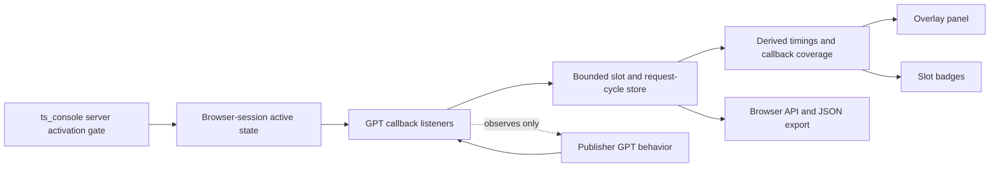

# GPT Runtime Diagnostics Overlay Specification

**Date:** 2026-07-28
**Status:** Implemented — live publisher acceptance pending
**Branch:** `feature/gpt-runtime-diagnostics-overlay`

## Summary

Create an opt-in browser diagnostic console that reports facts directly observed from Google Publisher Tag (GPT) lifecycle callbacks. The console helps a publisher answer:

- Which GPT slots requested ads?
- How long did each request take to receive a response and render?
- Did GPT report the slot as filled or empty?
- Did the rendered slot load and become viewable?
- Which callbacks were missing or could not be matched to a request cycle?
- Where is the corresponding slot on the page?

The feature deliberately does **not** attempt to prove whether a rendered creative originated from Trusted Server, Prebid, a direct GAM line item, backfill, or another demand path. It presents GPT-observed facts without inferring creative provenance.

The intended result is a substantially smaller replacement for the auction-to-creative tracing work in PR #961.

## Context

A live publisher test-site audit demonstrated that GPT lifecycle diagnostics remain useful even when end-to-end attribution does not.

The successful run captured:

- 9 GPT requests
- 9 GPT responses
- 7 GPT renders
- 6 GPT load callbacks
- 4 viewable-impression callbacks
- Request-to-response and response-to-render timing
- Filled, empty, and unresolved outcomes
- Callback correlation coverage and missing-generation anomalies

The same run also demonstrated the limits of the broader design:

- GAM did not preserve enough Trusted Server context to prove creative provenance.
- Initial request generations were invalidated by a page navigation signal before GPT callbacks arrived.
- Later GPT slots had synthetic trace identities and no usable DOM binding.
- All GPT load callbacks were unmatched.
- The overlay mounted and was then removed during page startup.
- No Trusted Server auction produced a winner, so winner and creative-acknowledgement behavior could not be evaluated.

These observations support a narrower tool centered on the GPT runtime itself.

## Problem

Publishers can inspect GPT network traffic and individual console events, but reconstructing the lifecycle of each slot and refresh manually is difficult. The browser receives several independent callbacks at different times, and the same slot can participate in multiple request cycles.

A useful diagnostic tool needs to organize those callbacks without claiming evidence that GPT does not expose. The current broader tracing model mixes reliable GPT observations with attempted server, Prebid, and creative correlation. That creates substantial implementation and testing complexity while leaving the most important provenance question unresolved.

## Product Goal

Provide a durable, low-interference GPT diagnostic overlay that organizes documented GPT callbacks into per-slot request cycles, computes directly observable timings, highlights missing callbacks, and points the user to the corresponding slot element.

Success means a publisher can open a page with `ts_console=true`, inspect GPT activity visually, and export the same information for debugging without changing auction or rendering behavior.

## Non-Goals

This specification does not include:

- Auction trace IDs or bid trace IDs.
- Trusted Server auction outcome propagation.
- Server-winner-to-GAM attribution.
- Prebid bid-response, targeting-selection, bid-won, or render correlation.
- Creative renderer acknowledgement.
- Attribution labels such as `trusted_server`, `gam_only`, or `direct_or_unattributed`.
- Confidence hierarchies for creative provenance.
- OpenRTB response extensions for diagnostics.
- Auction telemetry or Tinybird datasource changes.
- Collection of bid prices, targeting values, user identifiers, creative markup, or auction payloads.
- Modification of GPT slot definition, display, refresh, targeting, request, or rendering behavior.
- General-purpose ad-server debugging outside GPT.

If provenance across Trusted Server, Prebid, GAM, and the final creative is revisited later, it should be specified as a separate integration that uses controlled identifiers or controlled test creatives.

## Design Principles

### Report observations, not provenance

A non-empty `slotRenderEnded` callback proves that GPT reported a non-empty render. It does not prove which demand source supplied the creative. The UI must use labels such as **Filled** and **Empty**, not **GAM winner** or **Trusted Server winner**.

### Prefer documented callbacks over interception

The implementation should use `googletag.pubads().addEventListener(...)` through the GPT command queue. It must not patch `googletag.display`, `googletag.defineSlot`, `pubads.refresh`, `fetch`, XHR, history methods, or publisher callbacks.

### Preserve raw callback truth

Every observed callback is counted. If a callback cannot be matched safely to a request cycle, it remains visible as unmatched or ambiguous rather than being dropped or forced into a generation.

### Keep activation local and explicit

Diagnostics are available only when the integration is enabled for the deployment and the current browser session has been explicitly activated.

### Do not alter the ad lifecycle

The diagnostic module observes GPT. It does not gate requests, delay publisher code, suppress display or refresh calls, create slots, apply targeting, or render creatives.

## Primary User Flow

1. A developer opens a publisher page with `?ts_console=true`.
2. The server establishes a host-only session cookie, conditionally delivers diagnostics, and an early bootstrap removes the activation parameter from the visible URL.
3. GPT listeners install before the first ad request where integration ordering permits.
4. The data store begins recording GPT callbacks immediately.
5. The visual overlay mounts after page startup, without participating in framework hydration.
6. The developer sees one panel row per GPT slot and request cycle.
7. Visible, exactly bound slot elements receive concise badges.
8. Scrolling, lazy loading, and refreshes update the panel and badges.
9. The developer exports a versioned JSON snapshot if deeper inspection is needed.
10. `?ts_console=false` disables the console for the browser session.

## Scope

### In scope

- Browser-session activation and conditional delivery using `ts_console`.
- Early, idempotent GPT listener installation.
- GPT slot identity and exact DOM-element binding.
- Per-slot initial request and refresh cycles.
- GPT callback timing and callback coverage.
- Filled, empty, pending, loaded, and viewable state.
- A Shadow DOM panel and on-page badges.
- Overlay survival across hydration, DOM replacement, scrolling, resizing, and SPA navigation.
- A bounded in-memory data store.
- A versioned browser API and JSON export.
- Unit, browser-integration, and live-site acceptance tests.

### Out of scope

- Changes to `/auction` requests or responses.
- Changes to auction orchestration or bid selection.
- Changes to server telemetry.
- Changes to Prebid integration behavior.
- Changes to creative rendering behavior.
- Server-side correlation identifiers.
- Persistence or upload of diagnostic records.
- A remote diagnostics dashboard.

## Architecture



### Minimal server responsibility

The server is responsible for configuration gating, exact directive/cookie parsing, stripping private activation inputs before generic handling, cache-safe conditional module delivery, and placing activation/module tags early enough to observe initial GPT activity.

The server must not:

- Create an auction trace context.
- Modify auction responses.
- Add diagnostic fields to OpenRTB.
- Emit diagnostic telemetry.
- Vary auction behavior when the console is active.

Diagnostic records remain client-local, but conditional module delivery requires a server-recognized activation bit. Active/directive HTML therefore uses a host-only HttpOnly session cookie and strict private/no-store cache policy; the standalone static module remains cookie-independent and publicly cacheable.

### Browser components

The browser implementation consists of four focused components:

1. **Activation gate** — manages browser-session cookie activation, conditional delivery, and URL cleanup.
2. **GPT observer** — installs documented event listeners and normalizes callbacks.
3. **Diagnostics store** — retains bounded slot and request-cycle records and computes timings.
4. **Presentation layer** — renders the panel and badges from store snapshots.

The store and observer must not depend on the overlay. Removing or closing the overlay must not stop callback capture.

## Activation Requirements

### Configuration gate

The integration is disabled by default at the deployment level. If the integration is not configured, no GPT listeners or overlay are installed.

A dedicated name such as the following should be used to reflect the reduced scope:

```toml
[integrations.gpt_diagnostics]
enabled = false
```

The final configuration name may reuse an existing integration registry convention, but it should not be named `ad_trace` unless the implementation still performs broader ad tracing.

### Query directives

| Directive          | Effect                                      |
| ------------------ | ------------------------------------------- |
| `ts_console=1`     | Enable diagnostics for the browser session  |
| `ts_console=true`  | Enable diagnostics for the browser session  |
| `ts_console=0`     | Disable diagnostics for the browser session |
| `ts_console=false` | Disable diagnostics for the browser session |

Values are case-sensitive. Duplicate or unrecognized directives fail closed for the current response.

### Browser-session persistence and delivery

Activation uses `__Host-ts-console=1; Path=/; Secure; HttpOnly; SameSite=Lax` with no persistent expiry. Exactly one canonical cookie activates clean document navigations across tabs on the same origin. Duplicate cookies fail closed, and every copy is stripped before generic cookie, origin, or auction handling.

Inactive HTML omits the diagnostics module. Active HTML injects its content-hashed standalone module synchronously after core so listeners precede publisher GPT code. Active/directive HTML is `private, no-store` without surrogate cache headers; the standalone module is public and does not vary on the cookie.

### URL cleanup

After the server consumes a directive, an early bootstrap removes every reserved `ts_console` pair from the visible URL using `history.replaceState`. The origin sees no reserved directive. All unrelated query parameters, the path, and the fragment are preserved.

This one-time URL cleanup is not a general history patch. The diagnostics module must not wrap `pushState`, `replaceState`, or route-change handlers.

### Inactive behavior

When inactive:

- No diagnostics module is delivered.
- No GPT event listeners are registered.
- No diagnostics API is exposed.
- No overlay host is created.
- No DOM observers are started.
- No diagnostic network requests are made.

## GPT Listener Requirements

The observer installs through `googletag.cmd.push(...)` and registers these documented PubAdsService events:

| GPT event               | Diagnostic meaning                           |
| ----------------------- | -------------------------------------------- |
| `slotRequested`         | Start of a new request cycle for a slot      |
| `slotResponseReceived`  | GPT received a response for the slot         |
| `slotRenderEnded`       | GPT reported a filled or empty render result |
| `slotOnload`            | The slot's creative iframe load event fired  |
| `impressionViewable`    | GPT reported a viewable impression           |
| `slotVisibilityChanged` | GPT reported a new visibility percentage     |

Listener installation must be:

- Idempotent.
- Safe when GPT is absent or delayed.
- Early enough to observe initial requests where deployment ordering permits.
- Isolated so an exception in diagnostics cannot escape into publisher GPT callbacks.

If GPT never becomes available, the overlay may show **Waiting for GPT**, but must not poll aggressively or modify the GPT queue contract.

## Slot Identity and Element Binding

### Runtime identity

The GPT `Slot` object is the primary runtime identity. A `WeakMap` should associate each observed slot object with its diagnostic record. This prevents duplicate or reused element IDs from merging unrelated slot instances.

### Display identity

For presentation and export, the diagnostic record contains:

- `slotElementId`, from `slot.getSlotElementId()`, when non-empty.
- `adUnitPath`, from `slot.getAdUnitPath()`, when available.
- A monotonically increasing runtime slot number for the current page.

The preferred display label is the exact GPT slot element ID. If it is unavailable, the panel uses **Unbound GPT slot N**. A synthetic label must never be presented as a real DOM ID.

### Exact DOM binding

The presentation layer begins binding through an exact `document.getElementById(slotElementId)` lookup. A binding is valid only when exactly one connected DOM element has that ID and exactly one retained GPT slot record claims it. A targeted exact-ID query may verify DOM uniqueness. If uniqueness cannot be verified, the binding remains ambiguous.

It must not:

- Use prefix matching.
- Assume `googletag.display` receives a string.
- Call string methods on publisher-provided display arguments.
- Create a missing publisher slot element.
- Guess between container and inner-element IDs.
- Select the first DOM element or newest GPT slot when an ID is duplicated.

Binding is retried when relevant callbacks occur and after DOM mutations. If no exact element exists, the slot remains visible in the panel as **Unbound** and receives no badge. If multiple DOM elements or retained GPT slot records use the same ID, each affected slot is shown with an **Ambiguous binding** and receives no badge.

### Element replacement

If a framework replaces a bound element with a new element using the same ID, the badge layer rebinds to the new element. The request records remain associated with the GPT slot object.

## Request-Cycle Model

### Cycle creation

Every `slotRequested` callback creates a new request cycle for that GPT slot. Cycles use a one-based `requestNumber`:

- `1` — Initial request
- `2` — Refresh 1
- `3` — Refresh 2
- And so on

No cycle is created from `display`, `refresh`, route changes, DOM mutation, or server auction activity.

### Callback matching

GPT callbacks identify a slot but do not provide a stable request-cycle identifier. Matching therefore follows conservative stage compatibility:

- `slotResponseReceived` can match a cycle with a request timestamp and no response timestamp.
- `slotRenderEnded` can match a cycle with no render timestamp.
- `slotOnload` can match a rendered cycle that is not known empty and has no load timestamp.
- `impressionViewable` can match a rendered cycle that is not known empty and has no prior viewable timestamp.
- `slotVisibilityChanged` updates slot-level current and maximum visibility and is not required to belong to one request cycle.

A callback is attached only when there is one compatible cycle. If there are no compatible cycles, it is recorded as unmatched. If overlapping cycles make more than one cycle compatible, it is recorded as ambiguous with reason `overlapping_request_cycles`.

The implementation must not guess a request cycle merely to improve a correlation percentage.

### Navigation behavior

A route change does not supersede or terminate an active GPT request cycle. GPT callbacks can legitimately arrive after publisher hydration, `replaceState`, SPA navigation, or other route signals.

Cycles remain until their callbacks arrive or bounded retention evicts them. The overlay may mark the slot element as disconnected without changing the GPT lifecycle record.

### Render resolution

`slotRenderEnded` determines the directly observed render outcome:

| GPT fact                          | Display outcome           |
| --------------------------------- | ------------------------- |
| `isEmpty === true`                | Empty                     |
| `isEmpty === false`               | Filled                    |
| Render callback, fill unavailable | Rendered (fill unknown)   |
| No render callback yet            | Pending render            |
| Unmatched render callback         | Unmatched render callback |

The word **Filled** means only that GPT reported a non-empty render.

### Load and viewability

Load and viewability are independent observed facts after any render not known empty:

- A filled cycle without `slotOnload` displays **Load not observed**.
- An unknown-fill render retains observed load/viewability without inferring Filled.
- A known-empty render never accepts load or viewability callbacks.
- A load callback does not prove creative provenance.
- An `impressionViewable` callback displays **Viewable**.
- Absence of a viewable callback is not classified as failure.

## Timing Model

All lifecycle timestamps use `performance.now()` and are relative to the current document's performance time origin.

Each request cycle may contain:

| Field           | Source                              |
| --------------- | ----------------------------------- |
| `requestedAtMs` | `slotRequested`                     |
| `responseAtMs`  | `slotResponseReceived`              |
| `renderAtMs`    | `slotRenderEnded`                   |
| `loadAtMs`      | `slotOnload`                        |
| `viewableAtMs`  | First matching `impressionViewable` |

Derived durations are emitted only when both endpoints exist and are ordered:

| Duration           | Calculation                    |
| ------------------ | ------------------------------ |
| Request → response | `responseAtMs - requestedAtMs` |
| Response → render  | `renderAtMs - responseAtMs`    |
| Request → render   | `renderAtMs - requestedAtMs`   |
| Render → load      | `loadAtMs - renderAtMs`        |
| Render → viewable  | `viewableAtMs - renderAtMs`    |

Negative or invalid durations are not displayed. A uniquely correlated callback remains matched, while the store adds a callback issue with reason `invalid_event_order`. Matching disposition and sequence validity are recorded separately.

No network timing is inferred from Performance Resource Timing entries in this scope.

## Recorded GPT Facts

For each render cycle, the store may record these fields when exposed by GPT:

- `isEmpty`
- Rendered `size`
- `isBackfill`
- `slotContentChanged`
- Current visibility percentage
- Maximum observed visibility percentage

The first version does not record:

- Creative ID
- Line item ID
- Campaign ID
- Advertiser ID
- Company IDs
- Targeting keys or values
- Bidder identity
- Bid price
- Creative HTML

These exclusions keep the tool focused and reduce privacy and export concerns.

## Diagnostic States

The panel derives a primary lifecycle state from observed GPT facts:

| State                   | Meaning                                                 |
| ----------------------- | ------------------------------------------------------- |
| Waiting for request     | Slot observed, but no `slotRequested` callback captured |
| Requesting              | Request observed; response not yet observed             |
| Response received       | Response observed; render not yet observed              |
| Rendered (fill unknown) | Render observed without a boolean `isEmpty` fact        |
| Filled                  | GPT reported a non-empty render                         |
| Empty                   | GPT reported an empty render                            |

The panel augments that primary state with independent facts and issues:

| Augmentation        | Meaning                                                        |
| ------------------- | -------------------------------------------------------------- |
| Loaded              | A render not known empty later produced `slotOnload`           |
| Viewable            | A render not known empty later produced `impressionViewable`   |
| Incomplete sequence | Affirmative evidence shows a missing or invalid lifecycle step |
| Unbound             | No exact current DOM element matches the slot element ID       |
| Ambiguous binding   | More than one DOM element or GPT slot record claims the ID     |

A cycle is marked **Incomplete sequence** only when a matched callback violates lifecycle ordering, a later-stage callback proves an earlier stage was absent, or another recorded issue can be assigned to that cycle. Elapsed time alone never makes a cycle incomplete. An unmatched or ambiguous callback that cannot be assigned safely creates a slot-level issue instead.

A request without a response remains **Requesting**, and a response without a render remains **Response received**. A filled cycle without a load remains **Filled** with **Load not observed**. Absence of a viewable callback is not classified as a failure.

## Callback Coverage

The store maintains mutually exclusive matching-disposition counters for each callback type:

```text
observed / matched / unmatched / ambiguous
```

For each callback type, `observed` equals `matched + unmatched + ambiguous`. Sequence validity is tracked separately, so a uniquely correlated callback with invalid ordering remains matched and also produces a callback issue.

Examples:

```text
Responses: 9 observed · 6 matched · 3 unmatched
Loads: 6 observed · 6 matched
```

Coverage is a diagnostic of the observer's ability to organize callbacks. It is not an ad-fill or revenue metric.

Callback issues include unmatched callbacks, ambiguous callbacks, and matched callbacks with invalid event ordering. Each issue retains:

- Callback kind
- Runtime slot number
- Slot element ID, if available
- Relative timestamp
- Matching disposition
- Reason

## Overlay Requirements

### Host and isolation

The overlay uses one host with a stable ID and a closed Shadow DOM. Styles must not leak into the publisher page, and publisher styles must not affect overlay controls.

Only one overlay instance may exist.

### Hydration-safe mounting

GPT listeners and data capture begin immediately after activation, but the visual host mounts only after the document reaches `complete` and at least two animation frames have elapsed.

A lifecycle manager outside the overlay host observes document-level child replacement. If the active host is removed by hydration, DOM reconciliation, or SPA shell replacement, the manager remounts it after a debounce.

Explicit user closure is different from external removal:

- **Close** sets a dismissed state and prevents automatic remounting for the current document.
- `window.tsjs.gptDiagnostics.show()` clears dismissal and mounts the UI again.
- External host removal does not set dismissal.

### Panel

The fixed panel shows:

- Whether GPT has been observed.
- Callback coverage and unmatched counts.
- One row per slot, showing the latest request by default.
- Expandable previous request and refresh cycles.
- Slot element ID or **Unbound GPT slot N**.
- Ad unit path, when available.
- Filled, empty, pending, loaded, and viewable facts.
- Relevant timings.
- Rendered size and backfill flag, when available.
- Whether the exact slot element is currently bound and visible.

Required controls:

- Collapse/expand panel.
- Filter by All, Visible, Filled, Empty, Pending/Incomplete, and Unbound/Ambiguous.
- Export JSON.
- Close.

### Badges

A badge is shown only when:

- The slot has an exact, connected DOM binding.
- The element has a non-zero rectangle.
- The element intersects the viewport.
- At least one request cycle has been observed.

The badge is positioned adjacent to the slot without changing publisher layout. Positioning updates through throttled scroll, resize, element resize, and relevant DOM mutation signals.

The first version may use one badge per bound slot without implementing complex collision optimization. If badges overlap, the panel remains the authoritative complete view.

Example badge:

```text
Filled · 728×90
Response 276 ms · Render 42 ms
Viewable after 1.0 s
```

Example empty badge:

```text
Empty
Response 277 ms · Render 3 ms
```

The badge must never say that a creative came from GAM, Trusted Server, Prebid, or a particular bidder.

### Publisher DOM impact

The overlay must not add diagnostic data attributes to publisher slot elements. Binding and state are held in internal maps. Temporary visual highlighting, if implemented, must use a separate overlay element rather than changing publisher classes or inline styles.

## Browser API and Export

When active, the feature exposes:

```ts
window.tsjs.gptDiagnostics = {
  snapshot(),
  export(),
  subscribe(listener),
  show(),
  hide(),
};
```

The API is read-only except for presentation controls. It does not expose internal mutation methods.

### Export schema

The JSON export is versioned independently of internal implementation details.

```ts
interface GptDiagnosticsExportV1 {
  version: 1
  capturedAt: string
  page: {
    origin: string
    pathname: string
  }
  slots: Array<{
    runtimeSlotNumber: number
    slotElementId?: string
    adUnitPath?: string
    binding: {
      status: 'bound' | 'unbound' | 'ambiguous'
      reason?:
        | 'missing_slot_element_id'
        | 'missing_element'
        | 'duplicate_dom_id'
        | 'dom_uniqueness_unverifiable'
        | 'duplicate_gpt_slot_id'
    }
    currentVisibilityPercentage?: number
    maximumVisibilityPercentage?: number
    requests: GptRequestCycle[]
  }>
  callbackIssues: Array<{
    kind: string
    runtimeSlotNumber: number
    slotElementId?: string
    timestampMs: number
    disposition: 'matched' | 'unmatched' | 'ambiguous'
    reason: string
  }>
  coverage: Record<
    string,
    {
      observed: number
      matched: number
      unmatched: number
      ambiguous: number
    }
  >
  metadata: {
    droppedCallbacks: number
    evictedSlots: number
    evictedRequestCycles: number
  }
}
```

`GptRequestCycle` contains the request number, directly observed timestamps and render facts, and valid derived durations. It contains no server auction or bidder fields.

The export includes the page origin and pathname, but excludes query parameters and fragments.

## Bounded Storage

The diagnostics store is memory-only and bounded. Initial limits should be simple constants with unit tests:

- Maximum 64 observed GPT slot objects.
- Maximum 10 retained request cycles per slot.
- Maximum 128 retained callback issue records.

When a limit is exceeded:

- Evict the least-recently-active slot, or the oldest cycle/issue at those bounds.
- Increment the corresponding metadata counter.
- Let an evicted Slot re-enter only on a future `slotRequested`, preserving its monotonic request number; earlier non-request callbacks remain unmatched.
- Keep the latest request cycles visible and do not throw into publisher code.

The implementation does not use IndexedDB, localStorage, or sessionStorage for diagnostic records. The HttpOnly session cookie stores only activation; no diagnostic data is uploaded.

## SPA and Dynamic-Page Behavior

- History changes do not reset the store.
- Route changes do not supersede GPT request cycles.
- New GPT slots discovered after navigation are added normally.
- Disconnected elements become unbound while their records remain available.
- Recreated elements with the same exact ID can be rebound.
- The overlay remounts if the publisher replaces the UI host.
- A full document navigation starts a new in-memory store while browser-session activation persists through the HttpOnly cookie.

## Error Handling

All diagnostic callback handlers have a top-level exception boundary. Errors are reported through the existing `tsjs` logger at warning level and do not escape into GPT.

The observer must tolerate:

- Missing GPT globals.
- Missing or throwing slot methods.
- Empty slot element IDs.
- Duplicate element IDs.
- Callbacks observed before the overlay exists.
- Callbacks with no request cycle.
- Overlapping request cycles.
- Publisher removal of the overlay host.
- Missing `ResizeObserver` or `MutationObserver`.

A degraded browser may lose optional badge updates, but the GPT callback store should continue operating where event listeners are available.

## Privacy and Security

- Diagnostics are opt-in for a host-scoped browser session; diagnostic records remain document-local.
- No diagnostic record is automatically transmitted.
- No user identifier, cookie value, targeting value, bid value, creative markup, or auction payload is collected.
- The export excludes URL query strings and fragments.
- The feature is not an authentication or authorization boundary.
- Shadow DOM isolates the UI but is not treated as a security boundary.
- Export is initiated only by an explicit user action.

## Performance and Non-Interference

The inactive path omits diagnostics JavaScript entirely after the bounded server activation check.

When active:

- GPT callback handlers perform bounded synchronous work.
- UI rendering is scheduled and coalesced, not performed directly inside GPT callbacks.
- Scroll, resize, and mutation-driven layout updates are limited to one per animation frame.
- DOM lookup is exact and scoped to observed slot IDs.
- Mutation handling is debounced and does not rescan the entire document for arbitrary ad patterns.
- No diagnostic network requests are made.
- No publisher or GPT function is replaced.

## Smaller-PR Boundary

The implementation PR should be limited to:

- Deployment configuration for the diagnostics integration.
- Server-recognized browser-session activation and conditional module delivery.
- GPT observer and bounded diagnostics store.
- Overlay and badge presentation.
- Focused documentation.
- Unit and browser tests for this functionality.

The PR should not modify:

- Auction orchestrator or endpoint response formats.
- OpenRTB bid extensions.
- Prebid integration code, except deleting superseded tracing hooks if this replaces PR #961.
- Creative renderers or acknowledgement protocols.
- Tinybird schemas or telemetry clients.
- Unrelated adapter or authentication middleware changes beyond the minimal fallback preparation hook.
- GPT request gating, slot handoff, display, refresh, or targeting behavior.

Any required change in those excluded areas is a scope expansion and should trigger explicit review of this specification.

## Test Strategy

### Unit tests

The diagnostics store must cover:

- Initial request lifecycle.
- Multiple sequential refresh cycles.
- Filled and empty render outcomes.
- Load and viewability timing.
- Missing response, render, load, and viewability callbacks.
- Callback observed without a request.
- Overlapping request cycles.
- Invalid callback ordering.
- Slot object identity with duplicate element IDs.
- Ambiguous binding for duplicate DOM IDs and duplicate GPT slot IDs.
- Exact element binding and rebinding.
- Matched callback issues with invalid event ordering.
- Bounded retention and eviction counters.
- Export schema stability.
- Explicit absence of provenance labels and fields.

### Browser integration tests

A controlled GPT stub or fixture page must verify:

- Listener installation through `googletag.cmd`.
- No patched GPT or browser methods.
- No listeners or overlay when inactive.
- Query activation, deactivation, and URL cleanup.
- Browser-session persistence across document navigation and tabs.
- Inactive documents make no standalone diagnostics module request.
- Active/directive HTML is private no-store while the static module stays public.
- Panel rendering before and after callbacks.
- Badge placement on an exact, uniquely bound visible element.
- No badge for an unbound or ambiguously bound slot.
- Refresh history in the panel.
- Overlay remount after external host removal.
- No remount after explicit Close.
- Overlay survival after a simulated framework root replacement.
- Export matching the visible panel state.

### Live-site harness tests

The publisher Playwright harness should verify:

1. `?ts_console=true` loads the normal page successfully.
2. The diagnostic API is available.
3. The overlay remains present after load, hydration, scrolling, and a settle period.
4. No new page error is attributable to diagnostics.
5. GPT callback counts are non-zero when the page serves ads.
6. Every observed callback is represented as matched, unmatched, or ambiguous.
7. Timings are non-negative and consistent with callback order.
8. At least one exact, visible GPT slot receives a badge when the page exposes a usable slot element ID.
9. Unbound or ambiguously bound slots remain visible in the panel without a badge.
10. A refresh produces a new request number rather than replacing the initial request.
11. The JSON export matches panel counts and status.
12. `?ts_console=false` leaves no API, overlay, badge, or listeners active on the next document.

A trace-off control should clear activation in the same valid browser session when bot-protection access is session-sensitive.

## Acceptance Criteria

The specification is satisfied when all of the following are true:

- [x] The console can be enabled and disabled using the documented query directives.
- [x] Activation persists only for the host-scoped browser session and applies across its tabs.
- [x] The implementation uses documented GPT listeners without patching GPT behavior.
- [x] Each `slotRequested` creates a distinct initial or refresh request cycle.
- [x] Filled and empty labels are derived only from `slotRenderEnded.isEmpty`.
- [x] Lifecycle timings are displayed only from observed, ordered callbacks.
- [x] Unmatched and ambiguous callbacks remain visible in coverage diagnostics.
- [x] Matched callbacks with invalid ordering remain matched and expose an `invalid_event_order` issue.
- [x] Navigation does not invalidate an active GPT request cycle.
- [x] Exact, unique DOM binding produces a badge for eligible visible slots.
- [x] Unbound and ambiguously bound slots are clearly labeled and never receive guessed bindings.
- [x] The overlay survives external removal and normal SPA activity.
- [x] Explicit Close prevents automatic remount until Show is requested.
- [x] The overlay does not add attributes, classes, or styles to publisher slot elements.
- [x] Exported data contains no auction, bidder, targeting, creative-markup, or user fields.
- [x] The inactive path installs no listeners or observers.
- [x] The active path makes no diagnostic network requests.
- [ ] The console does not produce a hydration error or alter normal ad behavior on the live test site.
- [x] All data structures are bounded and expose eviction counters.
- [x] The implementation remains within the smaller-PR boundary.

## Resolved Decisions

- The panel opens fully by default. Activation is explicit, and the existing collapse control allows the user to reduce its visual impact.
- Exports include `adUnitPath` whenever GPT exposes it. Exported facts do not depend on panel expansion state.
- The first version uses badges as its only spatial indicator. Temporary click-to-highlight behavior is deferred.
- Overlapping refresh behavior is tested with a deterministic GPT event-bus stub. The fixture emits two `slotRequested` callbacks for the same `Slot` object before response or render callbacks and verifies that subsequent callbacks remain ambiguous rather than being forced into either cycle.
- The `ts_console` activation name is retained for compatibility. Deployment configuration uses the narrower `gpt_diagnostics` name.
- Matching disposition and sequence validity are separate. A uniquely correlated callback with invalid ordering remains matched and also produces an `invalid_event_order` callback issue.
- **Incomplete sequence** augments the observed lifecycle state and requires affirmative evidence of a gap or invalid ordering. Elapsed time alone does not make a lifecycle incomplete.
- DOM binding is conservative. Duplicate DOM IDs or duplicate retained GPT slot IDs produce an ambiguous binding with no badge rather than selecting an element or slot heuristically.

## Open Questions

No open questions remain for the first version.

## Related

- Prior exploratory implementation: [PR #961](https://github.com/IABTechLab/trusted-server/pull/961)
