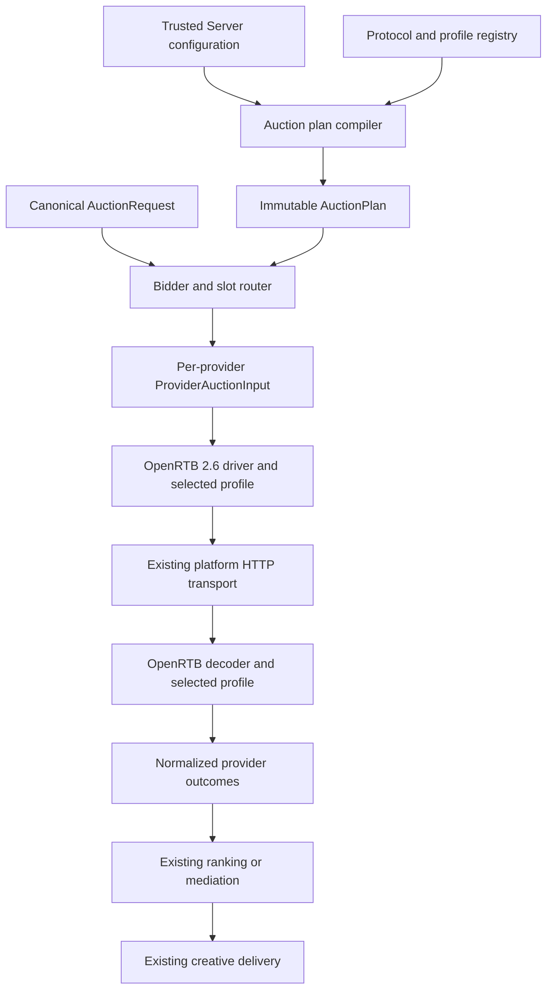

# Config-First Auction Provider Architecture

**Date:** 2026-08-10
**Status:** Draft
**Scope:** Configuration-first OpenRTB 2.6 auction providers with Prebid Server and APS parity

## Summary

Redesign Trusted Server auction-provider registration around configuration-defined provider instances.

The auction orchestrator will no longer contain statically configured Prebid Server and APS provider instances. Instead:

- Provider instances are defined under `[auction.providers.*]`.
- OpenRTB 2.6 is the only protocol implemented in the first version.
- A provider selects an OpenRTB profile that owns nonstandard request and response semantics.
- Trusted Server integrations may register profiles through a compile-time Rust registry.
- A central bidder registry routes each client-requested bidder to exactly one provider.
- Provider configuration is compiled and validated at startup into an immutable auction plan.
- The runtime orchestrator operates only on compiled provider plans and normalized auction data.

This redesign changes provider registration, routing, request construction, and response normalization. It deliberately preserves existing auction economics, privacy enforcement, signing behavior, creative delivery, mediation, and telemetry unless a structural change is required to support the new provider architecture.

> **Core principle:** Configuration defines provider instances. Rust code registers
> tested protocols and profiles. A compiler turns configuration into an immutable
> plan. The orchestrator executes that plan without knowing about Prebid Server,
> APS, or any specific exchange.

## Goal

Allow operators to register any endpoint that conforms to the supported OpenRTB 2.6 subset without adding a new provider implementation.

The same architecture must fully replace the current Prebid Server and APS auction providers while preserving their required behavior through OpenRTB profiles.

## Problem

The current system models Prebid Server and APS as statically named provider implementations. Each implementation combines several concerns:

- Provider identity and enablement.
- OpenRTB request construction.
- Provider-specific request extensions.
- HTTP transport and backend registration.
- Timeout handling.
- OpenRTB response parsing.
- Provider-specific validation.
- Creative interpretation.
- Diagnostics.

This causes several constraints:

- Only one instance of each statically named provider can be registered.
- Adding a standards-compliant OpenRTB endpoint still requires Rust provider code.
- Provider identity, protocol behavior, and upstream seat identity are not cleanly separated.
- Slot routing is implicit and differs by provider.
- Deploy-time validation and runtime registration maintain separate provider inventories.
- Prebid browser integration concerns are coupled to server-side provider configuration.

The auction orchestrator itself already has useful behavior for parallel execution, deadlines, partial failures, winner selection, mediation, and telemetry. The redesign should preserve those strengths while replacing provider construction and routing.

## Design Decisions

### Configuration-first boundary

“Configuration-first” means a standards-compliant endpoint within the supported OpenRTB 2.6 subset can be onboarded using configuration alone.

It does not mean:

- Arbitrary OpenRTB variants can be programmed through configuration.
- New protocols can be implemented through templates or scripts.
- Provider-specific behavior can use unrestricted JSON transformations.

If an endpoint requires nonstandard semantics, those semantics are implemented as ordinary Rust profile behavior registered in this repository.

### Protocol scope

The architecture may support additional protocols later, but the first version implements only:

```text
openrtb-2.6
```

No runtime plugin, sandboxed WASM, dynamic native extension, or configuration scripting system is included.

### Provider configuration location

All server-side auction-provider instances are configured under:

```toml
[auction.providers.*]
```

Browser and page integrations remain under:

```toml
[integrations.*]
```

A browser integration may be disabled while its server-side auction profile is used by a provider.

### Profile model

The first version exposes one profile selection per provider rather than a configurable list of capabilities.

Profiles are registered Rust implementations with narrow responsibility for protocol-specific request and response semantics. The initial profiles are:

- `standard`
- `prebid-server`
- `aps`

Internally, profile implementations may share smaller components. Those components are not exposed as a public capability-composition language in the first version.

### Current behavior preservation

The redesign preserves the current behavior of:

- Trusted Server request signing, using the existing signing protocol.
- Consent extraction, privacy enforcement, and identity gating.
- Highest decoded-price winner selection.
- Current floor enforcement.
- Current USD assumptions.
- Optional external mediation.
- Creative sanitization and delivery.
- APS rendering behavior.
- Prebid Cache handling.
- Existing auction telemetry and provider outcome semantics.

The project does not redesign these systems.

### Media scope

The first version supports banner inventory only.

Non-banner formats are excluded before provider routing and are never emitted upstream. A slot with no valid banner format is skipped. The canonical model and protocol boundary may remain extensible to video and native, but video and native request construction, validation, ranking, and rendering are outside this specification.

## Non-Goals

This specification does not include:

- A new auction pricing or ranking model.
- Currency conversion or a new money representation.
- Changes to floor behavior.
- Changes to external mediation behavior.
- A new request-signing protocol.
- A new privacy or consent system.
- A new telemetry schema.
- A new creative renderer architecture.
- Video or native media support.
- Multiple routes for the same bidder.
- Request splitting across multiple upstream calls for one provider.
- Runtime-loaded profiles or plugins.
- Sandboxed WASM extensions.
- Arbitrary JSONPath, templates, scripts, or response expressions.
- Speculative endpoint authentication mechanisms.
- Label-based routing, provider groups, or a general routing rule language.
- Arbitrary overrides of standard OpenRTB fields.
- Migration compatibility with the current provider configuration schema.

Breaking configuration changes are acceptable for this design.

## Terminology

### Provider ID

A unique operator-defined provider instance, such as:

```text
pbs-primary
aps-primary
rubicon-direct
```

Provider health, runtime correlation, configuration, and telemetry use the provider ID.

### Bidder ID

A demand source requested by the publisher or browser integration, such as:

```text
rubicon
pubmatic
appnexus
```

Trusted Server maps each bidder ID to one provider ID.

### Protocol

The wire contract used by a provider. The only first-version value is `openrtb-2.6`.

### Profile

A registered Rust implementation that augments generic OpenRTB request construction and interprets nonstandard response semantics.

### Seat

The buyer identity returned in `seatbid.seat`. A seat is not a provider ID and must not be used for transport correlation.

### Provider plan

An immutable, validated runtime representation compiled from one provider's configuration.

## High-Level Architecture



### Control plane

The control plane parses configuration, registers available profiles, validates provider and bidder references, and compiles an immutable `AuctionPlan` during startup.

### Runtime plane

The runtime plane receives a canonical auction request, routes its bidder demand to provider plans, creates one provider-specific input per provider, executes the existing concurrent auction flow, and normalizes responses before the existing decision stage.

Raw configuration is not repeatedly interpreted during auctions.

## Configuration Schema

### Auction configuration

The provider blocks are the source of truth. A separate ordered provider-name list is not required.

```toml
[auction]
enabled = true
timeout_ms = 2000

[auction.providers.pbs-primary]
protocol = "openrtb-2.6"
profile = "prebid-server"
endpoint = "https://pbs.example/openrtb2/auction"
timeout_ms = 900
routing = "explicit"

[auction.providers.aps-primary]
protocol = "openrtb-2.6"
profile = "aps"
endpoint = "https://aps.example/bid"
timeout_ms = 700
routing = "explicit"

[auction.providers.aps-primary.profile]
account_id = "example-account"
allow_script_creatives = false

[auction.providers.rubicon-direct]
protocol = "openrtb-2.6"
profile = "standard"
endpoint = "https://rubicon.example/bid"
timeout_ms = 650
routing = "explicit"

[auction.providers.rubicon-direct.profile]
request_ext = { account = "example-account" }
imp_ext = { placementGroup = "display" }
```

### Common provider fields

| Field        | Required | Default         | Meaning                                                                    |
| ------------ | -------- | --------------- | -------------------------------------------------------------------------- |
| `protocol`   | Yes      | None            | Registered protocol identifier. First version supports only `openrtb-2.6`. |
| `profile`    | No       | `standard`      | Registered OpenRTB profile identifier.                                     |
| `endpoint`   | Yes      | None            | Fixed operator-configured HTTPS endpoint.                                  |
| `timeout_ms` | No       | Auction timeout | Maximum provider timeout, capped by the remaining auction deadline.        |
| `routing`    | No       | `explicit`      | `explicit` or `all_eligible`.                                              |

Provider presence under `[auction.providers.*]` means the provider is configured for the enabled auction. The implementation may add a conventional enablement field only if required by the broader settings system; it must not reintroduce a separate provider inventory.

### Bidder registry

The central bidder registry maps each client-visible bidder to exactly one provider:

```toml
[auction.bidders.rubicon]
provider = "rubicon-direct"

[auction.bidders.pubmatic]
provider = "pbs-primary"

[auction.bidders.appnexus]
provider = "pbs-primary"

[auction.bidders.aps]
provider = "aps-primary"
```

The client requests bidders. It does not select providers or endpoints.

### Browser integrations

Browser-specific behavior remains separate:

```toml
[integrations.prebid]
# Browser bundle, injection, adapter, and script behavior only.
```

Enabling or disabling a browser integration does not register, enable, or disable an auction provider.

## Configuration Validation

The auction plan compiler must reject configuration when:

- A provider ID is duplicated or invalid.
- A protocol is unknown.
- A profile is unknown.
- A profile configuration cannot be parsed or validated.
- A bidder references an unknown provider.
- A bidder has more than one provider route.
- A profile cannot support banner inventory.
- A provider endpoint is invalid or violates existing outbound endpoint requirements.
- A provider's static extension configuration is not an object.
- Static extensions exceed bounded size or nesting limits.
- Static extensions collide with reserved fields owned by the OpenRTB driver, signing, or profile.
- Auction request signing cannot be initialized while auctions are enabled.
- More than one active provider is configured for a platform adapter that cannot perform concurrent fan-out. This target-specific validation is conservative because one auction may request bidders routed to different providers, and any `all_eligible` provider may participate alongside them.

The same compiler and registry must be used by:

- Deploy-time configuration validation.
- Runtime startup.
- Provider-plan construction.
- Configuration schema or documentation generation where supported.

## Profile Registry

### Registration

Profiles are registered through ordinary Rust code compiled into Trusted Server.

Conceptually:

```text
auction core module → registers "standard"
prebid module       → registers "prebid-server"
aps module          → registers "aps"
```

A profile's availability does not depend on its corresponding browser integration being enabled.

### Factory responsibility

A profile factory:

1. Parses its typed configuration.
2. Validates its configuration.
3. Reports supported media and creative representations.
4. Compiles immutable runtime profile behavior.

### Runtime responsibility

A profile may:

- Augment a generic OpenRTB request within fields reserved to that profile.
- Interpret provider-specific response extensions.
- Apply provider-specific bid validation.
- Produce the existing normalized creative or renderer representation.
- Extract provider-specific metadata required to preserve current behavior.

A profile must not overwrite fields owned by the OpenRTB driver, central privacy enforcement, or signing. Each profile declares the request extensions and response fields it owns, and the compiler rejects ownership collisions.

A profile may not:

- Select its endpoint.
- Send HTTP requests.
- Register platform backends.
- Resolve secrets.
- Route other providers' bidders.
- Rank bids.
- Invoke mediation.
- Override central privacy enforcement.
- Modify another provider plan.

### Runtime inputs

A profile receives only:

- Its compiled profile configuration.
- The provider ID.
- The provider's routed slots and bidder parameters.
- Canonical publisher, user, device, consent, and context data already approved for the auction.
- The effective provider timeout.
- Request-local parse state where required.

A profile does not receive the raw downstream HTTP request or unrestricted runtime services. Browser headers needed by OpenRTB must be normalized into canonical auction data before profile execution.

To preserve current Prebid consent-forwarding modes, request admission also produces a bounded, privacy-approved representation containing only the existing allowlisted consent-cookie names and values. The profile selects `openrtb_only`, `cookies_only`, or `both`; common OpenRTB request finalization and transport then apply that mode without exposing the raw browser cookie header to the profile.

## Canonical Auction Model

The canonical auction model remains independent of the OpenRTB wire format.

Conceptually:

```rust
AuctionRequest {
    id,
    slots,
    publisher,
    user,
    device,
    privacy,
    context,
}
```

A slot separates requested demand from provider routing and provider-specific input:

```rust
AuctionSlot {
    id,
    banner_formats,
    floor,
    bidder_params,
    trusted_provider_routes,
}
```

- `bidder_params` is keyed by bidder ID and originates from client or server auction input.
- `trusted_provider_routes` is available only to trusted server-side opportunity construction.
- Client input cannot choose provider IDs directly.

## Routing Model

### Client-originated demand

For each bidder requested on a slot:

1. Look up the bidder in `[auction.bidders]`.
2. Resolve its single provider ID.
3. Add the slot and only that bidder's parameters to the provider's routed view.
4. Record an `unroutable_bidder` outcome when no route exists.
5. Continue the auction for other routable bidders and providers.

Example client demand:

```text
Slot: header
Bidders: rubicon, pubmatic, appnexus
```

Configured routes:

```text
rubicon  → rubicon-direct
pubmatic → pbs-primary
appnexus → pbs-primary
```

Resulting provider inputs:

```text
rubicon-direct
└── header
    └── rubicon parameters

pbs-primary
└── header
    ├── pubmatic parameters
    └── appnexus parameters
```

### Trusted server-generated demand

Server-generated opportunities that intentionally rely on stored requests may name trusted provider routes without supplying bidder parameters.

This supports the existing Prebid stored-request path without allowing the browser to choose an endpoint.

### Routing modes

#### `explicit`

The provider receives only slots routed through:

- The central bidder registry.
- Trusted server-generated provider routes.

This is the default.

#### `all_eligible`

The provider receives every banner-compatible slot, regardless of bidder routes.

This mode must be explicitly configured and exists to preserve use cases similar to the current APS behavior.

### No eligible slots

When a provider has no eligible slots:

- No upstream request is sent.
- The provider is recorded as `skipped_no_eligible_slots`.
- This is distinct from no-bid because the provider was not called.

## Provider Auction Input

Routing produces one immutable `ProviderAuctionInput` per provider.

It contains only:

- Slots admitted by explicit routes or by that provider's `all_eligible` mode.
- Bidder parameters assigned to that provider through the central bidder registry.
- Privacy-approved canonical auction data.
- Provider identity.
- Effective timeout.

`all_eligible` admits additional banner slots but does not grant access to bidder parameters assigned to another provider. A profile never receives another provider's bidder parameters and therefore does not need provider-specific exclusion logic.

## OpenRTB 2.6 Driver

The generic driver owns standard banner OpenRTB behavior.

### Request responsibilities

- Request and impression IDs.
- Banner formats.
- Site and publisher data currently supplied by Trusted Server.
- Device and user data currently supplied by Trusted Server.
- Existing consent and EID forwarding behavior.
- Floors and floor currency.
- `tmax` using the effective timeout.
- Current secure-impression requirements.
- Current auction currency assumptions.
- Existing Trusted Server signing extension, using the existing signing protocol.

### Response responsibilities

- HTTP 204 and ordinary empty responses as no-bid where currently supported.
- Standard OpenRTB response decoding.
- Request ID correlation.
- `seatbid.seat` preservation.
- Standard bid ID, impression ID, price, dimensions, domains, creative markup, and notification URLs.
- Current banner compatibility checks.
- Existing response-size bounds.
- Existing error and outcome classifications where applicable.

### Bidder parameters

Client-supplied bidder parameters are profile input, not generic OpenRTB fields.

The generic driver does not invent a location for them.

- The `prebid-server` profile consumes them.
- Another profile may consume them in a provider-specific way.
- The `standard` profile does not forward nonempty bidder parameters by default.
- Unconsumed nonempty parameters produce bounded `unused_bidder_params` diagnostics.

### Static extensions

The standard profile may accept validated static objects for:

- `request.ext`
- `imp.ext`

Static extensions:

- Cannot contain secrets.
- Cannot contain templates.
- Cannot read request data.
- Cannot use JSONPath or arbitrary expressions.
- Are bounded by size and nesting depth.
- Cannot overwrite fields reserved by signing, the OpenRTB driver, or another profile responsibility.

### Ordinary field overrides

The first version does not support arbitrary overrides of fields such as `site.domain`, `device.ip`, `user.id`, or `imp.tagid`.

Typed configuration for additional standard fields should be added only when a concrete endpoint requires it.

## Prebid Server Profile

The `prebid-server` profile preserves required Prebid Server behavior while delegating standard fields to the OpenRTB driver.

### Profile responsibilities

- Construct `imp.ext.prebid.bidder` from routed bidder parameters.
- Preserve current deterministic bidder-parameter merging and validation semantics where still applicable.
- Support stored-request fallback for trusted server-generated provider routes.
- Add Prebid-specific request extensions and test/debug fields.
- Preserve Prebid Cache coordinate extraction.
- Preserve Prebid response diagnostics required by current behavior.
- Preserve notification suppression behavior through the common provider outcome model.
- Preserve current request-local data needed to parse responses.

### Responsibilities moved to common architecture

- Endpoint and timeout configuration.
- Provider identity.
- Bidder routing.
- Standard OpenRTB request fields.
- Trusted Server signing invocation.
- Standard consent and EID forwarding.
- HTTP transport and backend correlation.
- Standard response parsing and validation.
- Winner selection and mediation.

### Profile configuration parity

The central bidder registry is the sole server-side bidder allowlist and route source. The Prebid profile does not define a second `bidders` list.

The first version must preserve these server-side controls and defaults:

| Current control            | New owner                                                      | Default and validation                                                                     |
| -------------------------- | -------------------------------------------------------------- | ------------------------------------------------------------------------------------------ |
| `server_url`               | Common provider `endpoint`                                     | Required fixed HTTPS endpoint.                                                             |
| `timeout_ms`               | Common provider `timeout_ms`                                   | Inherits the auction timeout when omitted.                                                 |
| `bidders`                  | Central `[auction.bidders]` registry                           | Every bidder route is explicit and unique.                                                 |
| `debug`                    | `auction.providers.<id>.profile.debug`                         | `false`; preserves current request and response debug behavior.                            |
| `test_mode`                | `auction.providers.<id>.profile.test_mode`                     | `false`; preserves the current OpenRTB test flag.                                          |
| `debug_query_params`       | `auction.providers.<id>.profile.debug_query_params`            | Absent by default; preserves current page-URL behavior when configured.                    |
| `bid_param_zone_overrides` | `auction.providers.<id>.profile.bid_param_zone_overrides`      | Empty by default; preserves current typed validation and merge behavior.                   |
| `bid_param_overrides`      | `auction.providers.<id>.profile.bid_param_overrides`           | Empty by default; preserves current typed validation and merge behavior.                   |
| `bid_param_override_rules` | `auction.providers.<id>.profile.bid_param_override_rules`      | Empty by default; preserves current rule validation, ordering, and shallow-merge behavior. |
| `consent_forwarding`       | `auction.providers.<id>.profile.consent_forwarding`            | `both`; preserves the existing `openrtb_only`, `cookies_only`, and `both` behavior.        |
| `suppress_nurl`            | Common `auction.providers.<id>.notifications.suppress_all`     | `false`.                                                                                   |
| `suppress_nurl_bidders`    | Common `auction.providers.<id>.notifications.suppress_bidders` | Empty; every entry must name a bidder routed to this provider.                             |

Stored-request fallback remains built-in Prebid profile behavior rather than another configuration switch. Existing browser-only fields, including bundle configuration, script patterns, client-side bidders, account injection, and excluded GAM ad-unit suffixes, remain under `[integrations.prebid]`.

Parity tests must cover defaults and non-default values for every field in this table.

### Browser integration separation

The Prebid browser integration continues to own:

- Browser bundle construction.
- JavaScript injection.
- Browser adapter behavior.
- Client-side bidder configuration.
- Script interception and rewriting.

It does not own the server-side Prebid provider endpoint or bidder route map.

## APS Profile

The `aps` profile preserves APS-specific OpenRTB and rendering behavior.

### Profile responsibilities

- Add APS account and SDK request extensions.
- Preserve APS inventory identity behavior.
- Interpret the APS response shape and extension fields.
- Preserve APS-specific bid validation.
- Extract creative URL and tag type.
- Produce the existing typed APS renderer descriptor.
- Preserve script-creative opt-in behavior.
- Preserve APS diagnostics required by current behavior.

### Responsibilities moved to common architecture

- Endpoint and timeout configuration.
- Provider identity.
- Bidder routing or explicit `all_eligible` routing.
- Standard OpenRTB request fields.
- Trusted Server signing invocation.
- Standard consent and EID forwarding.
- HTTP transport and backend correlation.
- Winner selection and mediation.

### Profile configuration parity

The first version must preserve these APS controls and defaults:

| Current control          | New owner                                               | Default and validation                                                                                       |
| ------------------------ | ------------------------------------------------------- | ------------------------------------------------------------------------------------------------------------ |
| `endpoint`               | Common provider `endpoint`                              | Required fixed HTTPS endpoint; legacy unsupported endpoint forms remain rejected.                            |
| `timeout_ms`             | Common provider `timeout_ms`                            | Inherits the auction timeout when omitted.                                                                   |
| `account_id`             | `auction.providers.<id>.profile.account_id`             | Required, nonempty, and subject to the current size and input validation.                                    |
| `debug`                  | `auction.providers.<id>.profile.debug`                  | `false`; preserves current debug behavior.                                                                   |
| `allow_script_creatives` | `auction.providers.<id>.profile.allow_script_creatives` | `false`; preserves the existing explicit script opt-in.                                                      |
| `inventory_domain`       | `auction.providers.<id>.profile.inventory_domain`       | Absent by default; preserves current domain validation.                                                      |
| `inventory_page_origin`  | `auction.providers.<id>.profile.inventory_page_origin`  | Absent by default; must be configured with `inventory_domain` and preserve current origin/domain validation. |

Parity tests must cover defaults, debug behavior, inventory override validation, iframe creatives, permitted script creatives, and rejected script creatives.

Using the APS profile must activate any server-side renderer support it requires independently of browser integration enablement.

## Request Signing

Trusted Server request signing is an auction-wide requirement.

The project will:

- Reuse the existing signing implementation and wire contract.
- Avoid cryptographic or protocol redesign.
- Apply existing signing behavior to every OpenRTB provider request.
- Keep signing configuration global rather than repeated under providers.
- Fail startup when auctions are enabled and required signing infrastructure cannot be initialized.

The exact existing signing payload and verification behavior remain unchanged by this specification.

## Transport and Execution

The existing platform transport abstractions remain responsible for:

- Backend registration and naming.
- Asynchronous request dispatch.
- Response correlation.
- Existing request and response bounds.
- Existing timeout behavior.
- Existing platform-specific fan-out capability checks.

At most one outbound request is sent per provider per auction. Exactly one request is sent for each provider with eligible slots, containing every slot admitted by its routing mode.

The first version does not split one provider's slots across multiple requests and does not send one request per slot.

The existing auction deadline remains authoritative:

```text
min(provider timeout, auction time remaining)
```

Provider failures remain isolated from other provider outcomes.

Custom endpoint authentication is included only if required by the first concrete generic endpoint. This specification does not define speculative bearer-token, custom-header, or secret-store authentication schemas.

## Response Normalization

Every provider response is normalized into the existing shared auction response and bid model, or its clean architectural equivalent.

The normalized result must preserve:

- Provider ID.
- Returned seat.
- Slot/impression ID.
- Bid ID.
- Decoded price and existing currency assumptions.
- Banner dimensions.
- Standard creative markup or existing typed renderer.
- Existing notification URL behavior.
- Provider-specific metadata required for current diagnostics.

Profile-specific response interpretation occurs before bids reach ranking or mediation.

One provider's malformed response does not fail another provider. Existing behavior for whether an invalid individual bid or full response is dropped should be preserved unless the common driver can enforce an equivalent stricter check without changing externally visible behavior.

## Decision, Mediation, and Delivery

This project does not redesign the decision or delivery stages.

After normalization, the existing system continues to:

- Select the highest decoded-price bid per slot when no mediator is configured.
- Apply existing floors.
- Use existing USD assumptions.
- Invoke the existing mediator path when configured.
- Fall back according to existing mediation behavior.
- Sanitize and rewrite creatives according to existing settings.
- Serialize standard creatives and APS renderer descriptors according to existing contracts.

Provider profiles do not rank bids or choose winners.

## Telemetry and Diagnostics

Existing auction telemetry and provider result reporting remain in scope for parity.

The new architecture must preserve the ability to report:

- Provider instance ID.
- Provider outcome.
- Response time.
- Bid count.
- Returned seats.
- Existing error classifications.
- Winner status.
- Existing profile-specific diagnostics when enabled.

The redesign may centralize how diagnostics are carried, but it must not introduce a new telemetry product or schema as part of this work.

New routing outcomes should be distinguishable:

- `unroutable_bidder`
- `skipped_no_eligible_slots`
- `unused_bidder_params`

These outcomes use existing bounded diagnostic or outcome fields. They do not add telemetry fields or change the meaning of existing outcomes. They must not include sensitive bidder parameters.

## Runtime Flow

```text
1. Receive or construct canonical banner auction request.
2. Apply existing consent, identity, and privacy enforcement.
3. Resolve each client bidder through the central bidder registry.
4. Add trusted provider routes for server-generated opportunities.
5. Build one filtered ProviderAuctionInput per provider.
6. Skip providers with no eligible slots.
7. Use the OpenRTB 2.6 driver to construct the standard request.
8. Invoke the selected profile to augment the request.
9. Apply the existing Trusted Server request signature.
10. Dispatch one request per provider through existing transport.
11. Decode the standard OpenRTB response.
12. Invoke the selected profile for provider-specific normalization.
13. Produce normalized provider outcomes.
14. Run existing local ranking or mediation.
15. Run existing creative delivery and telemetry.
```

## Failure Behavior

The system must preserve partial-auction behavior.

| Condition                                                                           | Required outcome                                                                                                   |
| ----------------------------------------------------------------------------------- | ------------------------------------------------------------------------------------------------------------------ |
| Unknown bidder in runtime request                                                   | Record `unroutable_bidder`; continue other demand.                                                                 |
| Provider has no eligible slots after applying its routing mode and banner filtering | Record `skipped_no_eligible_slots`; do not call provider.                                                          |
| Profile configuration invalid                                                       | Reject configuration at deploy/startup.                                                                            |
| Provider cannot build a valid request                                               | Provider-local launch/build failure.                                                                               |
| Provider transport fails                                                            | Provider-local transport failure.                                                                                  |
| Provider times out                                                                  | Provider-local timeout.                                                                                            |
| Provider returns valid no-bid                                                       | Provider no-bid.                                                                                                   |
| Provider response cannot be decoded                                                 | Provider-local parse failure.                                                                                      |
| Individual bid is invalid                                                           | Preserve current profile/common validation behavior; valid sibling bids remain eligible where currently supported. |
| No providers produce valid bids                                                     | Existing auction no-winner behavior.                                                                               |

No request with zero eligible impressions should be sent upstream.

## Security Requirements

- Provider endpoints are fixed operator configuration, never client-derived.
- Clients cannot select provider IDs or endpoint URLs.
- Each bidder has one server-controlled provider route.
- Endpoint validation must preserve existing HTTPS and backend security requirements.
- Static extensions cannot contain secrets or request templates.
- Profiles cannot bypass central privacy enforcement.
- Profiles cannot access raw browser requests or unrestricted runtime services.
- Provider parameters must not be logged or returned in unbounded diagnostics.
- Existing response-body limits remain enforced.
- Existing creative sanitization remains enforced after winner selection.

## Acceptance Criteria

### Configuration and compilation

- [ ] Provider instances are configured under `[auction.providers.*]`.
- [ ] The first version recognizes only `openrtb-2.6`.
- [ ] `standard`, `prebid-server`, and `aps` profiles are registered through Rust profile factories.
- [ ] Profile availability is independent of browser integration enablement.
- [ ] Provider and profile configuration is compiled once at startup.
- [ ] Deploy validation and runtime startup use the same provider compiler and registry.
- [ ] Duplicate provider IDs, unknown profiles, invalid endpoints, and invalid bidder routes fail validation.
- [ ] Target-specific validation rejects more than one active provider on adapters without concurrent fan-out support.
- [ ] Auction startup fails when required existing signing infrastructure is unavailable.

### Routing

- [ ] Clients submit bidder identities and parameters without selecting providers.
- [ ] `[auction.bidders]` routes each bidder to exactly one provider.
- [ ] Unknown runtime bidders are recorded as `unroutable_bidder` without failing other demand.
- [ ] `explicit` is the default provider routing mode.
- [ ] `all_eligible` is available only through explicit provider configuration.
- [ ] Trusted server-generated slots may route directly to providers without inline bidder parameters.
- [ ] Provider inputs contain only slots admitted by the provider's routing mode and only bidder parameters assigned to that provider.
- [ ] `all_eligible` does not expose bidder parameters assigned to another provider.
- [ ] Providers with no eligible slots are skipped without an upstream request.

### OpenRTB and profiles

- [ ] The common OpenRTB driver constructs current standard banner request fields.
- [ ] The common driver preserves existing consent, identity, floor, timeout, currency, and signing behavior.
- [ ] Tests prove that standard, Prebid Server, and APS requests apply the unchanged signing protocol after profile request augmentation.
- [ ] Standard OpenRTB endpoints can be configured without adding a provider implementation.
- [ ] Static `request.ext` and `imp.ext` objects are bounded and validated.
- [ ] Client bidder parameters are not assigned an invented generic wire location.
- [ ] The Prebid profile preserves current bidder parameters, stored requests, cache handling, diagnostics, and notification behavior.
- [ ] Prebid parity tests cover `openrtb_only`, `cookies_only`, and `both` using only the canonical allowlisted consent-cookie representation.
- [ ] The APS profile preserves current account extensions, inventory identity, response validation, renderer, script policy, and diagnostics.
- [ ] Prebid and APS no longer register singleton auction-provider instances.

### Runtime behavior

- [ ] At most one outbound request is sent per provider per auction, and none is sent when the provider has no eligible slots.
- [ ] Existing concurrent fan-out and timeout behavior remains intact.
- [ ] Provider failures remain isolated.
- [ ] Returned seats remain distinct from provider IDs.
- [ ] Existing winner selection, floors, mediation, creative delivery, and telemetry continue to behave as before.
- [ ] Banner behavior has parity with the existing Prebid and APS paths.
- [ ] Non-banner formats are excluded before routing and are never emitted upstream.
- [ ] A slot with no banner formats is skipped.
- [ ] Video and native are not introduced by this work.

## Deferred Design Areas

The following require separate requirements before implementation:

- Additional protocols.
- Video and native support.
- Multiple provider routes for one bidder.
- Provider groups and label/rule-based routing.
- Request splitting for large auctions.
- New money or currency-conversion models.
- New signing protocol versions.
- New privacy or data-sharing controls.
- New diagnostics and telemetry schemas.
- General endpoint authentication configuration.
- Arbitrary standard-field mappings.
- Runtime or sandboxed profile extensions.

## Open Questions

No unresolved product decisions currently block this specification.

Implementation planning must still identify:

- The exact Rust profile-factory and compiled-profile interfaces.
- The minimal changes required to separate the current Prebid and APS logic into common OpenRTB and profile-owned behavior.
- The first concrete generic OpenRTB endpoint and whether it requires authentication or additional typed fields.
- The complete parity test fixture set for Prebid, APS, routing, signing, and split dispatch/collect execution.
- The exact configuration representation needed by existing environment override and app-config tooling.

These are implementation-planning questions and must not expand the product scope defined above.

## Related Designs

- [Auction Orchestration Flow](./2026-03-19-auction-orchestration-flow-design.md)
- [Prebid Generic Bid Parameter Override Rules](./2026-04-08-prebid-generic-bid-param-override-rules-design.md)
- [APS OpenRTB First-Class Integration](./2026-07-15-aps-openrtb-first-class-integration-design.md)
