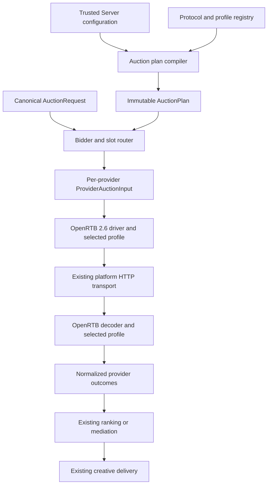

# Config-First Auction Provider Architecture

**Date:** 2026-08-10
**Status:** Draft
**Scope:** Configuration-first OpenRTB 2.6 auction providers with Prebid Server and APS parity

## Summary

Redesign Trusted Server auction-provider registration around configuration-defined provider instances.

The auction orchestrator will no longer contain statically configured Prebid Server and APS provider instances. Instead:

- Provider instances are defined under `[auction.providers.*]`.
- OpenRTB 2.6 is the only protocol implemented in the first version.
- A provider selects an OpenRTB profile that owns nonstandard request and response semantics.
- Trusted Server integrations may register profiles through a compile-time Rust registry.
- A central bidder registry routes each client-requested bidder to exactly one provider.
- Provider configuration is compiled and validated at startup into an immutable auction plan.
- The runtime bidder-provider path operates only on compiled provider plans and normalized auction data.

This redesign changes provider registration, routing, request construction, and response normalization. It deliberately preserves existing auction economics, privacy enforcement, signing behavior, creative delivery, the existing statically registered mock mediation path, and telemetry unless a structural change is required to support the new provider architecture. It does not introduce a generic mediator type or mediator profile.

> **Core principle:** Configuration defines provider instances. Rust code registers
> tested protocols and profiles. A compiler turns configuration into an immutable
> plan. The orchestrator executes that plan without knowing about Prebid Server,
> APS, or any specific exchange.

## Goal

Allow operators to register any endpoint that conforms to the supported OpenRTB 2.6 subset without adding a new provider implementation.

The same architecture must fully replace the current Prebid Server and APS auction providers while preserving their required behavior through OpenRTB profiles.

## Problem

The current system models Prebid Server and APS as statically named provider implementations. Each implementation combines several concerns:

- Provider identity and enablement.
- OpenRTB request construction.
- Provider-specific request extensions.
- HTTP transport and backend registration.
- Timeout handling.
- OpenRTB response parsing.
- Provider-specific validation.
- Creative interpretation.
- Diagnostics.

This causes several constraints:

- Only one instance of each statically named provider can be registered.
- Adding a standards-compliant OpenRTB endpoint still requires Rust provider code.
- Provider identity, protocol behavior, and upstream seat identity are not cleanly separated.
- Slot routing is implicit and differs by provider.
- Deploy-time validation and runtime registration maintain separate provider inventories.
- Prebid browser integration concerns are coupled to server-side provider configuration.

The auction orchestrator itself already has useful behavior for parallel execution, deadlines, partial failures, winner selection, mediation, and telemetry. The redesign should preserve those strengths while replacing provider construction and routing.

## Design Decisions

### Configuration-first boundary

“Configuration-first” means a standards-compliant endpoint within the supported OpenRTB 2.6 subset can be onboarded using configuration alone.

It does not mean:

- Arbitrary OpenRTB variants can be programmed through configuration.
- New protocols can be implemented through templates or scripts.
- Provider-specific behavior can use unrestricted JSON transformations.

If an endpoint requires nonstandard semantics, those semantics are implemented as ordinary Rust profile behavior registered in this repository.

### Protocol scope

The architecture may support additional protocols later, but the first version implements only:

```text
openrtb-2.6
```

No runtime plugin, sandboxed WASM, dynamic native extension, or configuration scripting system is included.

### Provider configuration location

All server-side auction-provider instances are configured under:

```toml
[auction.providers.*]
```

Browser and page integrations remain under:

```toml
[integrations.*]
```

A browser integration may be disabled while its server-side auction profile is used by a provider.

### Profile model

The first version exposes one profile selection per provider rather than a configurable list of capabilities.

Profiles are registered Rust implementations with narrow responsibility for protocol-specific request and response semantics. The initial profiles are:

- `standard`
- `prebid-server`
- `aps`

Internally, profile implementations may share smaller components. Those components are not exposed as a public capability-composition language in the first version.

### Current behavior preservation

The redesign preserves the current behavior of:

- Trusted Server request signing, using the existing signing protocol, while intentionally expanding enabled signing coverage to every OpenRTB provider.
- Consent extraction, privacy enforcement, and identity gating.
- Highest decoded-price winner selection.
- Current floor enforcement.
- Current USD assumptions.
- The existing statically registered mock mediation path.
- Creative sanitization and delivery.
- APS rendering behavior.
- Prebid Cache handling.
- Existing auction telemetry and provider outcome semantics.

The project does not redesign these systems.

### Media scope

The first version supports banner inventory only.

Non-banner formats are excluded before provider routing and are never emitted upstream. A slot with no valid banner format is skipped. The canonical model and protocol boundary may remain extensible to video and native, but video and native request construction, validation, ranking, and rendering are outside this specification.

## Non-Goals

This specification does not include:

- A new auction pricing or ranking model.
- Currency conversion or a new money representation.
- Changes to floor behavior.
- A generic mediator type, mediator profile, or configuration-first mediator architecture.
- Changes to the existing mock mediation behavior.
- A new request-signing protocol.
- A new privacy or consent system.
- A new telemetry schema.
- A new creative renderer architecture.
- Video or native media support.
- Multiple routes for the same bidder.
- Request splitting across multiple upstream calls for one provider.
- Runtime-loaded profiles or plugins.
- Sandboxed WASM extensions.
- Arbitrary JSONPath, templates, scripts, or response expressions.
- Speculative endpoint authentication mechanisms.
- Label-based routing, provider groups, or a general routing rule language.
- Arbitrary overrides of standard OpenRTB fields.
- Migration compatibility with the current provider configuration schema.

Breaking configuration changes are acceptable for this design.

## Terminology

### Provider ID

A unique operator-defined provider instance, such as:

```text
pbs-primary
aps-primary
fictional-direct
```

Provider IDs must match `^[a-z][a-z0-9-]{0,62}$`. This lowercase ASCII grammar is part of the configuration contract: it excludes control characters and adapter-specific punctuation aliases, keeps backend names bounded, and still requires target-encoded collision validation.

Provider health, runtime correlation, backend discrimination, configuration, and telemetry use the provider ID.

### Bidder ID

A demand source requested by the publisher or browser integration, such as:

```text
rubicon
pubmatic
appnexus
```

Trusted Server maps each bidder ID to one provider ID.

### Protocol

The wire contract used by a provider. The only first-version value is `openrtb-2.6`.

### Profile

A registered Rust implementation that augments generic OpenRTB request construction and interprets nonstandard response semantics.

### Seat

The buyer identity returned in `seatbid.seat`. A seat is not a provider ID and must not be used for transport correlation.

### Delivery bidder code

The bidder code serialized to the browser-facing auction response. It is distinct from provider ID and returned seat because current delivery contracts differ: Prebid Server uses a valid returned seat or the fallback `unknown`, while APS must continue to use `aps` so the existing browser renderer activates.

### Provider plan

An immutable, validated runtime representation compiled from one provider's configuration.

## High-Level Architecture



### Control plane

The control plane parses configuration, registers available profiles, validates provider and bidder references, and compiles an immutable `AuctionPlan` during startup.

### Runtime plane

The runtime plane receives a canonical auction request, routes its bidder demand to provider plans, creates one provider-specific input per provider, executes the existing concurrent auction flow, and normalizes responses before the existing decision stage.

Raw configuration is not repeatedly interpreted during auctions.

## Configuration Schema

### Auction configuration

The provider blocks are the source of truth for bidder providers. A separate ordered bidder-provider name list is not required.

The existing `[auction].mediator` reference may continue to select the current statically registered mock mediator. That mediator is not configured under `[auction.providers.*]`, is not bidder-routed, and is not compiled through the protocol and profile registry. This specification does not generalize mediation.

```toml
[auction]
enabled = true
timeout_ms = 2000

[auction.providers.pbs-primary]
protocol = "openrtb-2.6"
profile = "prebid-server"
endpoint = "https://pbs.example/openrtb2/auction"
timeout_ms = 900
routing = "explicit"

[auction.providers.aps-primary]
protocol = "openrtb-2.6"
profile = "aps"
endpoint = "https://aps.example/bid"
timeout_ms = 700
routing = "all_eligible"

[auction.providers.aps-primary.profile_config]
account_id = "example-account"
allow_script_creatives = false

[auction.providers.rubicon-direct]
protocol = "openrtb-2.6"
profile = "standard"
endpoint = "https://rubicon.example/bid"
timeout_ms = 650
routing = "explicit"

[auction.providers.rubicon-direct.profile_config]
request_ext = { account = "example-account" }
imp_ext = { placementGroup = "display" }
```

### Common provider fields

| Field        | Required | Default         | Meaning                                                                    |
| ------------ | -------- | --------------- | -------------------------------------------------------------------------- |
| `protocol`   | Yes      | None            | Registered protocol identifier. First version supports only `openrtb-2.6`. |
| `profile`    | No       | `standard`      | Registered OpenRTB profile identifier.                                     |
| `endpoint`   | Yes      | None            | Fixed operator-configured HTTPS endpoint.                                  |
| `timeout_ms` | No       | Profile default | Maximum provider timeout, capped by the remaining auction deadline.        |
| `routing`    | No       | `explicit`      | `explicit` or `all_eligible`.                                              |

Each provider may also define a `profile_config` table. The selected profile parses that table as typed configuration; an omitted table is treated as empty configuration.

Standard OpenRTB notification suppression is common provider configuration:

```toml
[auction.providers.pbs-primary.notifications]
suppress_all = false
suppress_seats = ["example-seat"]
```

- `suppress_all` removes `nurl` and `burl` from every normalized bid returned by the provider.
- `suppress_seats` removes those URLs only when the exact returned `seatbid.seat` value matches an entry.
- Seat suppression is independent of the bidder registry because returned seats may be aliases or originate from stored requests.
- Suppression entries must be nonempty, unique strings without ASCII control characters. A provider may configure at most 128 entries, and each entry may contain at most 128 UTF-8 bytes.
- Suppression is applied after response parsing and before bids reach ranking, mediation, or delivery.

When `timeout_ms` is omitted, the compiler resolves it from the selected profile: `prebid-server` uses 1000 ms, `aps` uses 800 ms, and `standard` uses the auction timeout. An explicit provider value overrides that default. Runtime still caps the resolved timeout by the remaining auction deadline.

Provider presence under `[auction.providers.*]` means the provider is configured for the enabled auction. The implementation may add a conventional enablement field only if required by the broader settings system; it must not reintroduce a separate provider inventory.

### Bidder registry

The central bidder registry maps each client-visible bidder to exactly one provider:

```toml
[auction.bidders.rubicon]
provider = "rubicon-direct"

[auction.bidders.pubmatic]
provider = "pbs-primary"

[auction.bidders.appnexus]
provider = "pbs-primary"

[auction.bidders.aps]
provider = "aps-primary"
```

The client requests bidders. It does not select providers or endpoints.

### Browser integrations

Browser-specific behavior remains separate:

```toml
[integrations.prebid]
# Browser bundle, injection, adapter, and script behavior only.
```

Enabling or disabling a browser integration does not register, enable, or disable an auction provider.

## Configuration Validation

The auction plan compiler must reject configuration when:

- A provider ID is duplicated or invalid.
- Two provider IDs collide after target-adapter backend-name encoding.
- A protocol is unknown.
- A profile is unknown.
- A profile configuration cannot be parsed or validated.
- A bidder references an unknown provider.
- A bidder has more than one provider route.
- A profile cannot support banner inventory.
- A provider endpoint is not an absolute HTTPS URL with a nonempty host, contains URL credentials or a fragment, or violates stricter selected-profile endpoint requirements.
- A provider's static extension configuration is not an object.
- Static extensions exceed bounded size or nesting limits.
- Static extensions collide with reserved fields owned by the OpenRTB driver, signing, or profile.
- Request signing is enabled but its structural configuration is missing or invalid.
- More than one active provider is configured for a platform adapter that cannot perform concurrent fan-out. This target-specific validation is conservative because one auction may request bidders routed to different providers, and any `all_eligible` provider may participate alongside them.

Compilation has two explicit stages:

1. Target-independent compilation parses settings, resolves profiles and defaults, validates routes and field ownership, canonicalizes endpoints, and produces the immutable plan.
2. Target validation receives that plan plus an adapter capability and shared pure backend-name prediction description. It validates fan-out support, deadline claims, and encoded backend-name uniqueness without rebuilding provider configuration or duplicating runtime naming algorithms.

The same compiler, registry, and target validator must be used by deploy tooling and runtime startup. A target-aware deploy or push passes the selected adapter description and must reject target-specific failures before publication. A target-agnostic `config validate` command runs the complete first stage and clearly reports that target checks are deferred; adapter startup remains the final mandatory target check. Configuration schema or documentation generation may consume the same registry where supported.

## Profile Registry

### Registration

Profiles are registered through ordinary Rust code compiled into Trusted Server.

Conceptually:

```text
auction core module → registers "standard"
prebid module       → registers "prebid-server"
aps module          → registers "aps"
```

A profile's availability does not depend on its corresponding browser integration being enabled.

### Factory responsibility

A profile factory:

1. Parses its typed configuration.
2. Validates its configuration.
3. Reports supported media and creative representations.
4. Declares its fixed typed standard-field policy.
5. Compiles immutable runtime profile behavior.

### Runtime responsibility

A profile may:

- Declare a fixed typed policy for standard OpenRTB fields.
- Augment a generic OpenRTB request within fields reserved to that profile.
- Interpret provider-specific response extensions.
- Apply provider-specific bid validation.
- Perform deterministic provider-local candidate reduction when required to preserve registered profile behavior.
- Produce the existing normalized creative or renderer representation.
- Extract provider-specific metadata required to preserve current behavior.

A profile must not directly overwrite fields owned by the OpenRTB driver, central privacy enforcement, or signing. The common driver applies the profile's compiled standard-field policy while constructing those fields. Each profile also declares the request extensions and response fields it owns, and the compiler rejects ownership collisions.

A profile may not:

- Select its endpoint.
- Send HTTP requests.
- Register platform backends.
- Resolve secrets.
- Route other providers' bidders.
- Compare bids across providers, apply auction floors, or choose final auction winners.
- Invoke mediation.
- Override central privacy enforcement.
- Modify another provider plan.

### Typed standard-field policy

Central privacy enforcement defines the maximum data permitted for an auction. A compiled profile field policy may omit data from that approved view, but it cannot restore, derive, or request data that central enforcement removed.

The common driver remains the only component that constructs standard OpenRTB fields. Each registered profile declares a fixed Rust policy for differences such as:

- `imp.tagid`.
- Primary `banner.w` and `banner.h` fields.
- `banner.topframe`.
- `site.ref` forwarding.
- Precise latitude and longitude.

These policies are registered, reviewed, and tested Rust behavior. They are not operator-configurable arbitrary field overrides. The `prebid-server` and `aps` profiles preserve their current field behavior through their respective policies.

The `standard` profile uses the shared PBS and APS baseline. It includes request and impression IDs, banner formats, site domain and sanitized page URL, consent-approved user ID and EIDs, user agent, IP address, coarse geo, DNT, language, consent fields, floors, secure-impression requirements, effective timeout, and current USD currency assumptions. By default it omits `site.ref`, precise latitude and longitude, `imp.tagid`, primary `banner.w` and `banner.h`, and `banner.topframe`.

Consent fields have a fixed wire policy rather than a profile-defined arbitrary map:

- `standard` emits an admitted TCF string as `user.consent`; applies the current jurisdiction and applicability rules to `regs.gdpr` and `regs.ext.gdpr`; mirrors admitted USP, GPP, and GPP SID values in their current top-level `regs` and compatibility `regs.ext` placements; and omits `user.ext.ConsentedProvidersSettings`.
- `prebid-server` preserves that current OpenRTB policy plus its existing consent-forwarding mode and Google Additional Consent mapping in `user.ext.ConsentedProvidersSettings`.
- `aps` preserves its current OpenRTB consent placements and deliberately omits Google Additional Consent.

Golden field-matrix tests are normative for absent consent, GDPR applicability and jurisdiction combinations, TCF, USP, GPP and section IDs, Google Additional Consent, and cookie-sourced versus KV- or policy-sourced consent. A common-driver extraction may not broaden one profile to fields currently exposed only by another.

### Runtime inputs

A profile receives only:

- Its compiled profile configuration.
- The provider ID.
- The provider's routed slots and bidder parameters.
- Canonical publisher, user, device, consent, and context data already approved for the auction.
- The effective provider timeout.
- Request-local parse state where required.

A profile does not receive the raw downstream HTTP request or unrestricted runtime services. Browser values needed by OpenRTB are normalized into canonical auction data before profile execution.

Request admission also retains a transport-owned Prebid header snapshot containing exactly the first values selected by the current HTTP header API for `Cookie`, `User-Agent`, `Referer`, and `Accept-Language`. It preserves accepted header bytes without introducing a second truncation rule; the existing inbound request/header limit remains authoritative. The snapshot is not exposed to profiles or other unrestricted runtime code. Common Prebid transport forwards the current `User-Agent`, `Referer`, and `Accept-Language` values and synthesizes `X-Forwarded-For` only from the platform-attested client IP, never from a client-supplied `X-Forwarded-For` value. The Prebid field policy may also use the raw accepted `Referer` for its existing `site.ref` behavior; the canonical `site.page` remains sanitized separately. APS and `standard` do not receive these raw browser headers.

To preserve current Prebid consent-forwarding behavior, the compiled Prebid profile selects `openrtb_only`, `cookies_only`, or `both`, and common transport applies the existing behavior to the snapshotted `Cookie` value:

- `both` and `cookies_only` forward the complete selected `Cookie` header value unchanged.
- `openrtb_only` removes the existing allowlisted consent-cookie names and forwards the remaining cookies.
- When the header cannot be parsed by the existing stripping path, current fallback behavior is preserved, including forwarding the original non-UTF-8 value.
- If stripping removes every cookie, the upstream `Cookie` header is omitted.
- Consent originating from KV or policy state remains in the OpenRTB body when no browser consent cookie can carry it, including in `cookies_only` mode.

No other first-version profile receives a browser `Cookie` header. Reducing Prebid forwarding to consent cookies only, changing malformed-header handling, or otherwise redesigning these modes requires a separate consent-focused specification.

## Canonical Auction Model

The canonical auction model remains independent of the OpenRTB wire format.

Conceptually:

```rust
AuctionRequest {
    id,
    slots,
    publisher,
    user,
    device,
    privacy,
    context,
}
```

A slot separates requested demand from provider routing and provider-specific input:

```rust
AuctionSlot {
    id,
    banner_formats,
    floor,
    bidder_params,
    trusted_provider_routes,
}
```

- `bidder_params` is keyed by bidder ID and originates from client or server auction input.
- `trusted_provider_routes` is produced only by trusted server-side opportunity construction or admission normalization of a recognized integration envelope.
- Client input cannot choose provider IDs directly.

## Routing Model

### Prebid browser-envelope normalization

The reserved `trustedServer` browser-adapter entry is an admission envelope, not a bidder ID. Before central routing, request admission unpacks its bounded `bidderParams` object into the canonical slot bidder map:

```text
trustedServer.bidderParams.rubicon  → bidder_params.rubicon
trustedServer.bidderParams.pubmatic → bidder_params.pubmatic
```

Each nested key becomes the client-requested bidder ID and is resolved only through `[auction.bidders]`. Nested values become that bidder's parameters. The envelope cannot name provider IDs or endpoints. Its optional `zone` value is preserved as a bounded Prebid slot-matching fact for existing override rules; it does not participate in provider routing.

A usable `bidderParams` value is a bounded JSON object containing at least one nonempty bidder key whose value is an object accepted by the existing bidder-parameter admission rules. The fallback cases are exact:

- Missing, `null`, or an empty `bidderParams` object creates stored-request routes to every configured `prebid-server` plan.
- A non-object `bidderParams`, an invalid bidder key or value, or a bounds violation is malformed input and does not trigger stored-request fan-out.
- An object containing a structurally valid but unregistered bidder is usable; it produces `unroutable_bidder` during central routing and does not trigger stored-request fallback.
- A partially malformed object is rejected rather than partially routed.

A programmatic request may contain both a direct bidder entry and the same bidder inside the envelope. To preserve the existing Prebid merge rule, a usable direct object wins; an unusable direct value cannot overwrite a usable envelope value. Admission applies this rule deterministically before central routing. It never relies on map iteration order.

When fallback applies, request admission derives a server-controlled stored-request route to each configured `prebid-server` provider plan. The client still does not select those provider IDs. Each routed Prebid plan receives the slot without inline bidder parameters and applies the existing stored-request fallback. This preserves initial and refresh auction behavior that currently uses an empty synthetic `trustedServer` bid.

### Client-originated demand

For each bidder requested on a slot:

1. Look up the bidder in `[auction.bidders]`.
2. Resolve its single provider ID.
3. Add the slot and only that bidder's parameters to the provider's routed view.
4. Record an `unroutable_bidder` outcome when no route exists.
5. Continue the auction for other routable bidders and providers.

Example client demand:

```text
Slot: header
Bidders: rubicon, pubmatic, appnexus
```

Configured routes:

```text
rubicon  → rubicon-direct
pubmatic → pbs-primary
appnexus → pbs-primary
```

Resulting provider inputs:

```text
rubicon-direct
└── header
    └── rubicon parameters

pbs-primary
└── header
    ├── pubmatic parameters
    └── appnexus parameters
```

### Trusted server-generated demand

Server-generated opportunities that intentionally rely on stored requests may name trusted provider routes without supplying bidder parameters.

For migration, existing creative-opportunity construction expresses empty Prebid stored-request intent without a provider ID; the trusted router expands it to every configured `prebid-server` plan, matching the browser-envelope rule. Explicit creative-opportunity bidder parameters continue through `[auction.bidders]`. Creative opportunities no longer hard-code an APS provider instance: an `aps` plan configured as `all_eligible` receives every compatible slot, while an explicitly routed APS plan participates only through a centrally routed bidder or a trusted server-generated route.

This supports the existing Prebid stored-request and APS paths without allowing the browser to choose an endpoint.

### Routing modes

#### `explicit`

The provider receives only slots routed through:

- The central bidder registry.
- Trusted server-generated provider routes.

This is the default.

#### `all_eligible`

The provider receives every banner-compatible slot, regardless of bidder routes.

This mode must be explicitly configured. It is the migration-equivalent routing mode for the current APS provider, which receives every banner-compatible slot. Operators may deliberately choose `explicit` for narrower APS participation.

### No eligible slots

When a provider has no eligible slots:

- No upstream request is sent.
- The provider is recorded as `skipped_no_eligible_slots`.
- This is distinct from no-bid because the provider was not called.

## Provider Auction Input

Routing produces one immutable `ProviderAuctionInput` per provider.

It contains only:

- Slots admitted by explicit routes or by that provider's `all_eligible` mode.
- Bidder parameters assigned to that provider through the central bidder registry.
- Privacy-approved canonical auction data.
- Provider identity.
- Effective timeout.

`all_eligible` admits additional banner slots but does not grant access to bidder parameters assigned to another provider. A profile never receives another provider's bidder parameters and therefore does not need provider-specific exclusion logic.

## OpenRTB 2.6 Driver

The generic driver owns standard banner OpenRTB behavior and applies the selected profile's compiled standard-field policy.

### Request responsibilities

- Request and impression IDs.
- Banner formats.
- Site and publisher data currently supplied by Trusted Server.
- Device and user data currently supplied by Trusted Server.
- Existing consent and EID forwarding behavior.
- Floors and floor currency.
- `tmax` using the effective timeout.
- Current secure-impression requirements.
- Current auction currency assumptions.
- Common Trusted Server signing finalization when enabled, plus the documented PBS host/scheme-only behavior when disabled.

### Response responsibilities

- HTTP 204 and ordinary empty responses as no-bid where currently supported.
- Standard OpenRTB response decoding.
- Transport association between the dispatched provider request and its response. For parity, omission or mismatch of the OpenRTB response `id` alone does not reject a PBS or APS response in the first version; profiles may preserve stricter existing behavior where one already exists.
- `seatbid.seat` preservation independently from delivery bidder code.
- Standard bid ID, impression ID, price, dimensions, domains, creative markup, and notification URLs.
- Current banner compatibility checks.
- Existing response-size bounds.
- Existing error and outcome classifications where applicable.

### Bidder parameters

Client-supplied bidder parameters are profile input, not generic OpenRTB fields.

The generic driver does not invent a location for them.

- The `prebid-server` profile consumes them.
- Another profile may consume them in a provider-specific way.
- The `standard` profile does not forward nonempty bidder parameters by default.
- Unconsumed nonempty parameters produce bounded `unused_bidder_params` diagnostics.

### Static extensions

The standard profile may accept validated static objects for:

- `request.ext`
- `imp.ext`

Static extensions:

- Cannot contain secrets.
- Cannot contain templates.
- Cannot read request data.
- Cannot use JSONPath or arbitrary expressions.
- Are bounded by size and nesting depth.
- Cannot overwrite fields reserved by signing, the OpenRTB driver, or another profile responsibility.

### Ordinary field overrides

The first version does not support operator-configured arbitrary overrides of fields such as `site.domain`, `device.ip`, `user.id`, or `imp.tagid`.

A registered profile's fixed typed standard-field policy is not an arbitrary override. Typed operator configuration for additional standard fields should be added only when a concrete endpoint requires it.

## Prebid Server Profile

The `prebid-server` profile preserves required Prebid Server behavior while delegating standard fields to the OpenRTB driver.

### Profile responsibilities

- Construct `imp.ext.prebid.bidder` from routed bidder parameters.
- Preserve current deterministic bidder-parameter merging and validation semantics where still applicable.
- Support stored-request fallback for trusted server-generated provider routes and admission-generated empty `trustedServer` envelopes.
- Add Prebid-specific request extensions and test/debug fields.
- Preserve Prebid Cache coordinate extraction.
- Preserve Prebid response diagnostics required by current behavior.
- Preserve notification suppression behavior through the common provider outcome model.
- Preserve current request-local data needed to parse responses.

### Responsibilities moved to common architecture

- Endpoint and timeout configuration.
- Provider identity.
- Bidder routing.
- Standard OpenRTB request fields.
- Trusted Server signing invocation.
- Standard consent and EID forwarding.
- HTTP transport and backend correlation.
- Standard response parsing and validation.
- Winner selection and mediation.

### Profile configuration parity

The central bidder registry is the sole server-side bidder allowlist and route source. The Prebid profile does not define a second `bidders` list.

The first version must preserve these server-side controls and defaults:

| Current control            | New owner                                                        | Default and validation                                                                     |
| -------------------------- | ---------------------------------------------------------------- | ------------------------------------------------------------------------------------------ |
| `server_url`               | Common provider `endpoint`                                       | Required fixed HTTPS endpoint.                                                             |
| `timeout_ms`               | Common provider `timeout_ms`                                     | Defaults to 1000 ms for `prebid-server`; explicit values override it.                      |
| `bidders`                  | Central `[auction.bidders]` registry                             | Every bidder route is explicit and unique.                                                 |
| `debug`                    | `auction.providers.<id>.profile_config.debug`                    | `false`; preserves current request and response debug behavior.                            |
| `test_mode`                | `auction.providers.<id>.profile_config.test_mode`                | `false`; preserves the current OpenRTB test flag.                                          |
| `debug_query_params`       | `auction.providers.<id>.profile_config.debug_query_params`       | Absent by default; preserves current page-URL behavior when configured.                    |
| `bid_param_zone_overrides` | `auction.providers.<id>.profile_config.bid_param_zone_overrides` | Empty by default; preserves current typed validation and merge behavior.                   |
| `bid_param_overrides`      | `auction.providers.<id>.profile_config.bid_param_overrides`      | Empty by default; preserves current typed validation and merge behavior.                   |
| `bid_param_override_rules` | `auction.providers.<id>.profile_config.bid_param_override_rules` | Empty by default; preserves current rule validation, ordering, and shallow-merge behavior. |
| `consent_forwarding`       | `auction.providers.<id>.profile_config.consent_forwarding`       | `both`; preserves the existing `openrtb_only`, `cookies_only`, and `both` behavior.        |
| `suppress_nurl`            | Common `auction.providers.<id>.notifications.suppress_all`       | `false`; preserves global `nurl` and `burl` suppression.                                   |
| `suppress_nurl_bidders`    | Common `auction.providers.<id>.notifications.suppress_seats`     | Empty; exact returned seat IDs, validated independently of bidder routes.                  |

Stored-request fallback remains built-in Prebid profile behavior rather than another configuration switch. Existing browser-only fields, including bundle configuration, script patterns, client-side bidders, account injection, and excluded GAM ad-unit suffixes, remain under `[integrations.prebid]`.

Parity tests must cover defaults and non-default values for every field in this table.

### Browser integration separation

The Prebid browser integration continues to own:

- Browser bundle construction.
- JavaScript injection.
- Browser adapter behavior.
- Client-side bidder configuration.
- Script interception and rewriting.
- Browser `timeout_ms` and `debug`, with their current defaults of 1000 ms and `false`, for the injected global Prebid.js configuration.

Browser `timeout_ms` and `debug` are independent from every server-side provider's common timeout and `profile_config.debug`. No value is selected from multiple provider plans for browser injection. The browser integration does not own the server-side Prebid provider endpoint or bidder route map.

## APS Profile

The `aps` profile preserves APS-specific OpenRTB and rendering behavior.

### Profile responsibilities

- Add APS account and SDK request extensions.
- Preserve APS inventory identity behavior.
- Interpret the APS response shape and extension fields.
- Preserve APS-specific bid validation.
- Preserve the current highest-price-per-impression candidate reduction and bid-ID tie-breaker, including displaced-bid diagnostics.
- Extract creative URL and tag type.
- Produce the existing typed APS renderer descriptor.
- Preserve script-creative opt-in behavior.
- Preserve APS diagnostics required by current behavior.
- Preserve a valid returned `seatbid.seat` separately while continuing to mark accepted APS bids with delivery bidder code `aps` for the existing browser renderer.

### Responsibilities moved to common architecture

- Endpoint and timeout configuration.
- Provider identity.
- Bidder routing or explicit `all_eligible` routing.
- Standard OpenRTB request fields.
- Trusted Server signing invocation.
- Standard consent and EID forwarding.
- HTTP transport and backend correlation.
- Winner selection and mediation.

### Profile configuration parity

The first version must preserve these APS controls and defaults:

| Current control          | New owner                                                      | Default and validation                                                                                       |
| ------------------------ | -------------------------------------------------------------- | ------------------------------------------------------------------------------------------------------------ |
| `endpoint`               | Common provider `endpoint`                                     | Required fixed HTTPS endpoint; legacy unsupported endpoint forms remain rejected.                            |
| `timeout_ms`             | Common provider `timeout_ms`                                   | Defaults to 800 ms for `aps`; explicit values override it.                                                   |
| `account_id`             | `auction.providers.<id>.profile_config.account_id`             | Required, nonempty, and subject to the current size and input validation.                                    |
| `debug`                  | `auction.providers.<id>.profile_config.debug`                  | `false`; preserves current debug behavior.                                                                   |
| `allow_script_creatives` | `auction.providers.<id>.profile_config.allow_script_creatives` | `false`; preserves the existing explicit script opt-in.                                                      |
| `inventory_domain`       | `auction.providers.<id>.profile_config.inventory_domain`       | Absent by default; preserves current domain validation.                                                      |
| `inventory_page_origin`  | `auction.providers.<id>.profile_config.inventory_page_origin`  | Absent by default; must be configured with `inventory_domain` and preserve current origin/domain validation. |

Parity tests must cover defaults, `all_eligible` routing as the current-behavior migration path, optional narrower `explicit` routing, debug behavior, inventory override validation, iframe creatives, permitted script creatives, and rejected script creatives.

Using the APS profile must activate any server-side renderer support it requires independently of browser integration enablement.

## Request Signing

Request signing remains controlled by the existing optional global configuration. When global signing is enabled, signing is an auction-wide requirement and every OpenRTB provider request contains the complete version 1.1 Trusted Server signing extension.

When global signing is disabled, no provider request contains signature-bearing fields (`version`, `signature`, `kid`, or `ts`). To preserve current Prebid wire behavior, the `prebid-server` profile may still emit `ext.trusted_server` containing only its existing `request_host` and `request_scheme` fields. APS and `standard` emit no `ext.trusted_server` object while signing is disabled. Static extension configuration cannot claim this reserved object.

Applying the complete extension to APS and configuration-defined standard providers is an intentional coverage expansion from the current PBS-only behavior. It is not request-body signing and is not described as wire-parity with the current APS request.

The project will:

- Reuse the existing signing implementation and version 1.1 wire contract.
- Avoid cryptographic or protocol redesign.
- Keep signing configuration global rather than repeated under providers.
- Compile only the enabled signing policy into the immutable auction plan; loaded key material is never stored in the plan.
- Load the current signer once during auction admission, before provider routing and dispatch, when global signing is enabled.
- Fail the auction before any provider request is dispatched when the current signer cannot be loaded.
- Reuse that auction-local signer for every provider request in the fan-out.
- Preserve live key rotation by loading the current key for each admitted auction rather than only at process startup.

Signing version 1.1 authenticates only its existing canonical payload: version, key ID, publisher host, publisher scheme, OpenRTB request ID, and timestamp. It does not authenticate the serialized OpenRTB body, provider ID, endpoint, bidder parameters, or profile extensions. Body or provider binding requires a future signing-protocol version and is outside this specification.

Profiles augment their owned request fields before common request finalization. The common finalizer then inserts the signing extension and freezes the request ID and signing-owned fields. This ordering prevents profiles or static extensions from overwriting signing fields; it does not imply that version 1.1 authenticates the augmented body.

Parity and compatibility tests must prove that Prebid Server preserves the existing signing contract and that APS accepts requests containing the extension. The standard-profile compatibility endpoint is a fictional local mock that exists only in automated tests. It implements the documented standard OpenRTB subset, requires no authentication or additional typed fields, and must not become a runtime endpoint, built-in provider, production-support claim, or new profile.

## Transport and Execution

The existing platform transport abstractions remain responsible for:

- Backend registration and naming.
- Asynchronous request dispatch.
- Response correlation.
- Existing request and response bounds.
- Existing timeout behavior.
- Existing platform-specific fan-out capability checks.

The compiler canonicalizes each provider endpoint once. The endpoint must be an absolute HTTPS URL with a nonempty host and no embedded username, password, or fragment. The same canonical endpoint supplies both the outbound request URI and the platform backend specification. Automatic redirects are not followed; a different destination requires a configuration change and recompilation. Existing TLS certificate and hostname verification remain enabled. Registered profiles may impose stricter endpoint validation, including the APS legacy-endpoint rejection.

Every provider backend specification uses the validated provider ID as its discriminator. A profile ID is never sufficient for backend discrimination because multiple provider instances may use the same profile, endpoint, and timeout. Target-specific validation must reject provider IDs that collide after any adapter-specific backend-name encoding; lossy normalization may not silently merge them.

Dispatch state associates the resulting backend identity with exactly one provider ID and compiled profile within an auction. A collision must fail before either mapping can overwrite the other. This first-version contract preserves the existing backend-name correlation mechanism without introducing a new cross-adapter per-request token system.

At most one outbound request is sent per provider per auction. Exactly one request is sent for each provider with eligible slots, containing every slot admitted by its routing mode.

The first version does not split one provider's slots across multiple requests and does not send one request per slot.

The runtime always computes the logical provider budget as:

```text
min(provider timeout, auction time remaining)
```

That exact logical budget controls whether a provider may launch, the OpenRTB `tmax` value, and whether later upstream or mediator network work may launch. It is distinct from a transport timeout used for backend construction and from a hard transport deadline. An adapter may canonicalize or quantize its transport timeout for stable backend identity, but that derived value must not replace the exact logical budget or shorten `tmax`.

A hard network deadline is enforced only when the target adapter exposes an abortable total-request deadline. On such an adapter, a completion after the enforced deadline is discarded and classified as a provider timeout.

Fastly currently provides first-byte and between-byte backend timeout controls, not an absolute total-request deadline. Axum has broader task/client cancellation behavior, and Cloudflare and Spin may use eager or broader platform HTTP execution, but no current adapter claims an enforceable provider-wide total-request deadline for this capability. To preserve current behavior, an already-launched call may therefore complete after its logical budget and its completed response remains eligible for local ranking and delivery. No additional provider or mediator network work may launch once the auction has no remaining logical budget, but local decision and delivery still complete. This rule applies equally when split dispatch/collect observes a completed response after the logical deadline. Documentation and tests must state that such an auction can exceed the configured wall-clock budget.

The plan compiler and target-specific validator use an adapter capability description that distinguishes:

- Concurrent fan-out support.
- Enforceable total-request transport deadlines.

Adapters without concurrent fan-out continue to reject configurations with more than one active bidder provider. An adapter without an enforceable outbound deadline may still run one provider, preserving current behavior, but its documentation and tests must identify the transport limitation.

Provider failures remain isolated from other provider outcomes.

The automated standard-profile endpoint fixture is unauthenticated and test-only. This specification does not define bearer-token, custom-header, secret-store, or other endpoint-authentication schemas.

## Response Normalization

Every provider response is normalized into the existing shared auction response and bid model, or its clean architectural equivalent.

The normalized result must preserve:

- Provider ID.
- Valid returned seat, when present.
- Delivery bidder code.
- Slot/impression ID.
- Bid ID.
- Decoded price and existing currency assumptions.
- Banner dimensions.
- Standard creative markup or existing typed renderer.
- Existing notification URL behavior.
- Provider-specific metadata required for current diagnostics.

Profile-specific response interpretation occurs before bids reach auction ranking or mediation. A registered profile may deterministically reduce its own provider response when required for parity, but it cannot compare bids across providers, apply auction floors, select final winners, or invoke mediation.

Identity normalization is explicit:

- A valid string `seatbid.seat` becomes `returned_seat`.
- A missing or non-string seat becomes no returned seat and cannot match `notifications.suppress_seats`.
- Prebid Server uses the valid returned seat as its delivery bidder code and otherwise preserves the current `unknown` fallback.
- APS always uses `aps` as its delivery bidder code, independently of its returned seat.
- Provider ID remains the only backend, health, and transport-correlation identity.

One provider's malformed response does not fail another provider. Existing behavior for whether an invalid individual bid or full response is dropped should be preserved unless the common driver can enforce an equivalent stricter check without changing externally visible behavior.

## Decision, Mock Mediation, and Delivery

This project does not redesign the decision or delivery stages and does not introduce a generic mediator type. The existing `[auction].mediator` reference and statically registered mock mediator remain outside the compiled bidder-provider plan. Provider profiles cannot invoke mediation.

After normalization, the existing system continues to:

- Select the highest decoded-price bid per slot when no mediator is configured.
- Apply existing floors.
- Use existing USD assumptions.
- Invoke the existing mediator path when configured.
- Fall back according to existing mediation behavior.
- Sanitize and rewrite creatives according to existing settings.
- Serialize standard creatives and APS renderer descriptors according to existing contracts.

Provider profiles do not perform cross-provider ranking or choose final auction winners. Provider-local candidate reduction remains part of response normalization where explicitly registered for parity.

## Telemetry and Diagnostics

Existing auction telemetry and provider result reporting remain in scope for parity.

The new architecture must preserve the ability to report:

- Provider instance ID.
- Provider outcome.
- Response time.
- Bid count.
- Returned seats.
- Existing error classifications.
- Winner status.
- Existing profile-specific diagnostics when enabled.

The redesign may centralize how diagnostics are carried, but it must not introduce a new telemetry product or schema as part of this work. The existing telemetry seat carrier uses `returned_seat` when present and otherwise falls back to the delivery bidder code to preserve missing-seat behavior. If mock mediation reconstructs a bid, it restores the original provider bid's returned seat rather than deriving it from the mediator or delivery alias.

New routing outcomes should be distinguishable:

- `unroutable_bidder`
- `skipped_no_eligible_slots`
- `unused_bidder_params`

They use a fixed `routing` object in existing metadata maps rather than new response or telemetry fields:

- Auction-level `OrchestrationResult.metadata["routing"]` carries `unroutable_bidder_count` for internal diagnostics and bounded structured logging.
- A skipped provider produces its ordinary provider result with `AuctionResponse.metadata["routing"].skipped_no_eligible_slots = true`, so the existing `ProviderSummary.metadata` carrier remains usable.
- A called provider that receives but does not consume routed parameter objects records `AuctionResponse.metadata["routing"].unused_bidder_params_count`.

Only booleans and saturating counts are carried. Bidder parameter values and bidder-ID lists are never included. Existing telemetry may consume these existing metadata carriers, but this work adds no telemetry columns or new client response fields.

## Runtime Flow

```text
1. Receive or construct canonical banner auction request.
2. Apply existing consent, identity, and privacy enforcement.
3. Resolve each client bidder through the central bidder registry.
4. Add trusted provider routes for server-generated opportunities.
5. Build one filtered ProviderAuctionInput per provider.
6. Skip providers with no eligible slots.
7. Use the OpenRTB 2.6 driver to construct the standard request.
8. Invoke the selected profile to augment the request.
9. Apply the existing Trusted Server request signature.
10. Dispatch one request per provider through existing transport.
11. Decode the standard OpenRTB response.
12. Invoke the selected profile for provider-specific normalization.
13. Produce normalized provider outcomes.
14. Run existing local ranking or mediation.
15. Run existing creative delivery and telemetry.
```

## Failure Behavior

The system must preserve partial-auction behavior.

| Condition                                                                           | Required outcome                                                                                                   |
| ----------------------------------------------------------------------------------- | ------------------------------------------------------------------------------------------------------------------ |
| Unknown bidder in runtime request                                                   | Record `unroutable_bidder`; continue other demand.                                                                 |
| Provider has no eligible slots after applying its routing mode and banner filtering | Record `skipped_no_eligible_slots`; do not call provider.                                                          |
| Profile configuration invalid                                                       | Reject configuration at deploy/startup.                                                                            |
| Enabled auction signing cannot load the current signer                              | Fail the auction before any provider request is dispatched.                                                        |
| Provider cannot build a valid request                                               | Provider-local launch/build failure.                                                                               |
| Provider transport fails                                                            | Provider-local transport failure.                                                                                  |
| Provider times out                                                                  | Provider-local timeout.                                                                                            |
| Provider returns valid no-bid                                                       | Provider no-bid.                                                                                                   |
| Provider response cannot be decoded                                                 | Provider-local parse failure.                                                                                      |
| Individual bid is invalid                                                           | Preserve current profile/common validation behavior; valid sibling bids remain eligible where currently supported. |
| No providers produce valid bids                                                     | Existing auction no-winner behavior.                                                                               |

No request with zero eligible impressions should be sent upstream.

## Security Requirements

- Provider endpoints are fixed operator configuration, never client-derived.
- Clients cannot select provider IDs or endpoint URLs.
- Each bidder has one server-controlled provider route.
- Provider endpoints are canonical absolute HTTPS URLs with nonempty hosts and no URL credentials or fragments.
- The same canonical endpoint is used for the request URI and backend registration, redirects are not followed automatically, and existing TLS certificate and hostname verification remain enabled.
- Static extensions cannot contain secrets or request templates.
- Profiles cannot bypass central privacy enforcement.
- Profiles cannot access raw browser requests or unrestricted runtime services.
- Provider parameters must not be logged or returned in unbounded diagnostics.
- Existing response-body limits remain enforced.
- Existing creative sanitization remains enforced after winner selection.

## Acceptance Criteria

### Configuration and compilation

- [ ] Provider instances are configured under `[auction.providers.*]`, with the selected profile's typed settings under `profile_config`.
- [ ] The first version recognizes only `openrtb-2.6`.
- [ ] `standard`, `prebid-server`, and `aps` profiles are registered through Rust profile factories.
- [ ] Profile availability is independent of browser integration enablement.
- [ ] Provider and profile configuration is compiled once at startup.
- [ ] Omitted provider timeouts resolve to 1000 ms for `prebid-server`, 800 ms for `aps`, and the auction timeout for `standard`; explicit values override those defaults.
- [ ] Deploy validation and runtime startup use the same two-stage provider compiler, profile registry, adapter capability descriptions, and shared backend-name prediction algorithms; target-agnostic validation reports deferred target checks.
- [ ] Provider IDs enforce the documented lowercase ASCII grammar and length; duplicate IDs, target-encoded backend-name collisions, unknown profiles, invalid endpoints, and invalid bidder routes fail validation.
- [ ] Endpoint tests require canonical absolute HTTPS URLs, reject missing hosts, credentials, and fragments, use the same URL for request and backend construction, and prove redirects are not followed automatically.
- [ ] Every backend specification uses the provider ID rather than the profile ID as its discriminator.
- [ ] Two provider IDs using the same profile, endpoint, and timeout dispatch and correlate independently.
- [ ] Target-specific validation rejects more than one active provider on adapters without concurrent fan-out support.
- [ ] Adapter capabilities distinguish concurrent fan-out from enforceable total-request transport deadlines.
- [ ] Invalid enabled signing configuration fails deploy/startup validation.
- [ ] When signing is enabled, inability to load the current signer fails auction admission before any provider dispatch.

### Routing

- [ ] Clients submit bidder identities and parameters without selecting providers.
- [ ] Request admission unfolds the reserved `trustedServer.bidderParams` envelope into canonical bidder IDs before routing.
- [ ] The reserved `trustedServer` envelope cannot name provider IDs or endpoints, and its `zone` value cannot influence routing.
- [ ] Missing, null, and empty recognized `trustedServer.bidderParams` create server-controlled stored-request routes to configured `prebid-server` plans; malformed, unknown-bidder, partial-validity, bounds, and direct/envelope collision cases follow the documented deterministic rules.
- [ ] Initial and refresh auction tests cover mixed PBS, APS, direct server-side, and client-side bidders, proving that only server-side entries are unfolded and routed.
- [ ] `[auction.bidders]` routes each bidder to exactly one provider.
- [ ] Unknown runtime bidders are recorded as `unroutable_bidder` without failing other demand.
- [ ] `explicit` is the default provider routing mode.
- [ ] `all_eligible` is available only through explicit provider configuration and is documented as the current-behavior migration mode for APS.
- [ ] Trusted server-generated slots may route directly to providers without inline bidder parameters.
- [ ] Provider inputs contain only slots admitted by the provider's routing mode and only bidder parameters assigned to that provider.
- [ ] `all_eligible` does not expose bidder parameters assigned to another provider.
- [ ] Providers with no eligible slots are skipped without an upstream request.

### OpenRTB and profiles

- [ ] The common OpenRTB driver constructs current standard banner request fields by applying the selected profile's fixed typed field policy.
- [ ] Central privacy enforcement defines the maximum permitted data, and profile policies may only omit from that approved view.
- [ ] The `prebid-server` and `aps` field policies preserve their current request differences, including the complete consent-field matrix.
- [ ] The `standard` profile uses the documented shared PBS and APS baseline, consent placements, and omissions.
- [ ] Prebid transport preserves current `User-Agent`, raw `Referer`, `Accept-Language`, platform-attested `X-Forwarded-For`, and exact selected `Cookie` header behavior without exposing the raw request to profiles.
- [ ] The common driver preserves existing consent, identity, floor, timeout, currency, and signing wire semantics while intentionally expanding enabled signing coverage to every OpenRTB provider.
- [ ] Tests prove that standard, Prebid Server, and APS requests receive the version 1.1 signing extension after profile request augmentation when global signing is enabled.
- [ ] Tests prove that global signing disabled removes all signature-bearing fields, preserves the existing PBS-only host/scheme object, and omits `ext.trusted_server` from APS and `standard`.
- [ ] Signing tests document that version 1.1 does not bind the request body, provider ID, endpoint, bidder parameters, or profile extensions.
- [ ] APS and the automated, fictional standard-profile mock endpoint have signed-request compatibility fixtures; the latter exists only in tests and requires no runtime feature or authentication.
- [ ] Standard OpenRTB endpoints can be configured without adding a provider implementation.
- [ ] Static `request.ext` and `imp.ext` objects are bounded and validated.
- [ ] Client bidder parameters are not assigned an invented generic wire location.
- [ ] The Prebid profile preserves current bidder parameters, stored requests, cache handling, diagnostics, and notification behavior.
- [ ] Common notification suppression preserves `nurl` and `burl` by default, supports provider-wide suppression, and matches per-seat suppression against exact returned seat IDs independently of bidder routes.
- [ ] Prebid parity tests cover the exact existing `openrtb_only`, `cookies_only`, and `both` Cookie-header behavior, including KV/policy-sourced body-consent fallback.
- [ ] The APS profile preserves current account extensions, inventory identity, response validation, renderer, script policy, diagnostics, and deterministic highest-price-per-impression reduction with its bid-ID tie-breaker.
- [ ] Prebid and APS no longer register singleton auction-provider instances.

### Runtime behavior

- [ ] At most one outbound request is sent per provider per auction, and none is sent when the provider has no eligible slots.
- [ ] The exact logical provider budget always controls launch eligibility and OpenRTB `tmax`; adapter-specific transport-timeout canonicalization does not replace or shorten it.
- [ ] Hard total-request deadlines discard late completions where supported and are not claimed for any current adapter without an abortable absolute deadline.
- [ ] On adapters without enforceable provider deadlines, completed late responses remain eligible, no new network work launches after logical budget exhaustion, and synchronous plus split execution tests document the possible wall-clock overrun.
- [ ] Existing adapter-specific concurrent fan-out and timeout behavior remains intact.
- [ ] Provider failures remain isolated.
- [ ] Provider ID, returned seat, and delivery bidder code remain distinct through direct and mediated outcomes, browser delivery, and the existing telemetry seat carrier; PBS and APS preserve their documented delivery aliases.
- [ ] Existing winner selection, floors, mock mediation, creative delivery, and telemetry continue to behave as before.
- [ ] Banner behavior has parity with the existing Prebid and APS paths.
- [ ] Non-banner formats are excluded before routing and are never emitted upstream.
- [ ] A slot with no banner formats is skipped.
- [ ] Video and native are not introduced by this work.

## Deferred Design Areas

The following require separate requirements before implementation:

- Additional protocols.
- Video and native support.
- Multiple provider routes for one bidder.
- Provider groups and label/rule-based routing.
- Request splitting for large auctions.
- New money or currency-conversion models.
- New signing protocol versions.
- New privacy or data-sharing controls.
- Consent-cookie forwarding minimization or changes to existing malformed-header behavior.
- New diagnostics and telemetry schemas.
- General endpoint authentication configuration.
- Arbitrary standard-field mappings.
- Runtime or sandboxed profile extensions.
- Generic mediator types, mediator profiles, and configuration-first mediation.
- New abortable outbound-timeout implementations for adapters that do not currently provide them.
- Broader outbound-network policy for IP literals, private or reserved networks, custom ports, and DNS rebinding.

## Open Questions

No unresolved product decisions currently block this specification.

Implementation planning must still identify:

- The exact Rust profile-factory and compiled-profile interfaces.
- The minimal changes required to separate the current Prebid and APS logic into common OpenRTB and profile-owned behavior.
- The internal organization of the unauthenticated, automated standard-profile mock endpoint and its fixtures.
- The complete parity test fixture set for Prebid, APS, routing, signing, and split dispatch/collect execution.
- The exact configuration representation needed by existing environment override and app-config tooling.

These are implementation-planning questions and must not expand the product scope defined above.

## Related Designs

- [Auction Orchestration Flow](./2026-03-19-auction-orchestration-flow-design.md)
- [Prebid Generic Bid Parameter Override Rules](./2026-04-08-prebid-generic-bid-param-override-rules-design.md)
- [APS OpenRTB First-Class Integration](./2026-07-15-aps-openrtb-first-class-integration-design.md)
