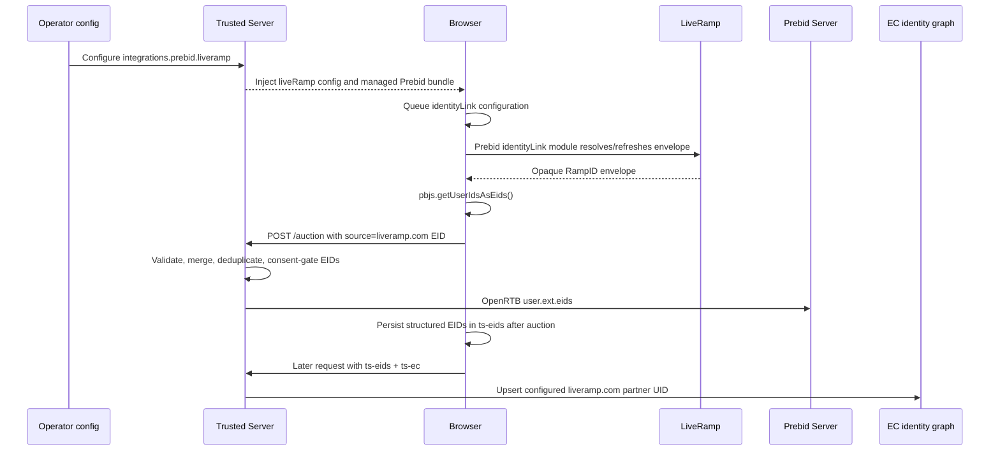

# LiveRamp Integration Design

**Issue:** [#355 — Investigate and document LiveRamp integration](https://github.com/IABTechLab/trusted-server/issues/355)

**Parent epic:** [#354 — LiveRamp integration](https://github.com/IABTechLab/trusted-server/issues/354)

**Initiative:** [#55 — Monetization integrations](https://github.com/IABTechLab/trusted-server/issues/55)

**Status:** Proposed

**Date:** 2026-08-21

## 1. Executive summary

LiveRamp integration is feasible in two distinct forms, but they must not be
treated as one protocol:

1. **RampID identity-envelope forwarding through Prebid.js is feasible now.**
   Trusted Server already bundles Prebid's `identityLinkIdSystem`, reads
   `liveramp.com` EIDs through `pbjs.getUserIdsAsEids()`, sends them to
   `/auction`, merges them with EC/KV identities, applies consent gating, and
   forwards them to Prebid Server as OpenRTB `user.ext.eids`.
2. **LiveRamp ATS Direct audience segments are not part of that EID flow.** ATS
   Direct returns a separate segment envelope and has separate subscription,
   storage, TTL, deal-approval, and activation requirements. The cited
   LiveRamp documentation describes activating these values as GAM `atsd`
   targeting, not as a `liveramp.com` EID.

The first implementation should make the existing RampID path operationally
complete by adding typed LiveRamp configuration under the Prebid integration,
injecting a deterministic `identityLink` User ID configuration, validating the
generated bundle, and documenting a live verification procedure. Native
server-to-server ATS resolution and ATS Direct segment activation remain
separate follow-up decisions.

## 2. Issue hierarchy and collected requirements

The GitHub issue hierarchy is:

```text
#55 Initiative: Monetization integrations
└── #354 Epic: LiveRamp integration
    └── #355 Task: Investigate and document LiveRamp integration
        └── IABTechLab/uid2-optout#385: Get test credentials from LR team
```

The three trusted-server issues have empty or placeholder bodies, so their
comments and linked documentation define the operative requirements.

### 2.1 Issue #354

The only comment asks the team to confirm whether LiveRamp segments are passed
to auction requests through the Prebid.js integration. This specification must
therefore distinguish identity envelopes from segment data and answer both
questions explicitly.

### 2.2 Issue #355

The comments establish the following sequence and requirements:

1. Review LiveRamp's Real-Time Identity Service (RTIS) tag documentation.
2. Wait for LiveRamp to clarify the integration.
3. Test the documentation LiveRamp supplied.
4. Review the ATS Envelope API page LiveRamp recommended.
5. Write a specification and determine feasibility.

The issue's direct deliverable is an evidence-backed specification. If the
recommended path is feasible, implementation follows the approved design.

### 2.3 Credential dependency

Issue #355 has a cross-repository child,
[IABTechLab/uid2-optout#385](https://github.com/IABTechLab/uid2-optout/issues/385),
named “Get test credentials from LR team.” It remains open. Its only comment
says that LiveRamp would be emailed.

Automated tests must not depend on LiveRamp credentials. A live Placement ID
and a LiveRamp-approved test origin are nevertheless required for final
end-to-end verification against LiveRamp.

## 3. Terminology and product boundaries

### 3.1 RampID identity envelope

Prebid's LiveRamp module is named `identityLinkIdSystem`, its configuration name
is `identityLink`, and its EID source is `liveramp.com`. It resolves an encrypted
RampID envelope into Prebid's identity APIs. The envelope identifies a user to
authorized demand partners; Trusted Server treats the value as opaque.

### 3.2 RTIS

LiveRamp's Real-Time Identity Service tag is a pixel or JavaScript tag that uses
LiveRamp cookie recognition and redirects a RampID to an endpoint registered
with LiveRamp. It requires LiveRamp to configure a tag ID and callback endpoint.
Trusted Server has no RTIS callback route today.

RTIS is not selected for the first implementation because the managed Prebid
module already provides the browser-to-bidstream path, while a new callback
would require correlation, endpoint authentication, storage, abuse protection,
and a LiveRamp-specific server contract.

### 3.3 ATS Envelope API

The ATS Envelope API resolves hashed email, hashed phone, or configured custom
IDs into one or more encrypted envelopes. A server-to-server call requires a
Placement ID, a privacy-approved Origin, consent parameters where applicable,
and the browser's client IP in `X-Forwarded-For`.

The ordinary ATS response contains an identity envelope with `type: 19` and
`source: "envelopeLiveramp"`. A no-consent response is HTTP 204. Configuration,
authorization, service, and geographic/consent failures use distinct 4xx
statuses.

### 3.4 ATS Direct segments

ATS Direct is a separate product layered onto an approved ATS placement and
subscription. Its V2 response can include `type: 26`, `source: "atsDirect"`,
whose value represents matching deal/segment IDs. LiveRamp documents storing
this in `_lr_atsDirect`, maintaining a region-dependent TTL, refreshing it, and
applying selected deal IDs to GAM under the `atsd` targeting key.

An ATS Direct segment envelope is not a RampID and must not be placed in
`user.ext.eids` under `liveramp.com`.

## 4. Current Trusted Server capabilities

The following capabilities already exist on `main`:

- `crates/trusted-server-js/lib/src/integrations/prebid/user_id_modules.json`
  includes `identityLinkIdSystem` in the default preset, maps the Prebid config
  name `identityLink`, and maps EID source `liveramp.com`.
- `crates/trusted-server-js/lib/src/integrations/prebid/index.ts` reads
  `pbjs.getUserIdsAsEids()`, validates EID structure, and includes valid EIDs in
  the current `/auction` request.
- The same TSJS module persists structured OpenRTB-style EIDs in the first-party
  `ts-eids` cookie after auction completion.
- `crates/trusted-server-core/src/auction/endpoints.rs` parses current-request
  EIDs, loads server-resolved EIDs from the EC/KV graph, merges and deduplicates
  them, and applies centralized consent gating.
- `crates/trusted-server-core/src/integrations/prebid.rs` serializes the merged
  set to Prebid Server as OpenRTB `user.ext.eids`.
- `crates/trusted-server-core/src/ec/prebid_eids.rs` ingests `ts-eids` on a
  later request and maps configured sources such as `liveramp.com` into the
  EC/KV identity graph.
- The external bundle manifest and runtime diagnostics already identify which
  Prebid User ID modules were compiled into the bundle.

### 4.1 Current gap

Trusted Server includes the module but does not configure it. There is no typed
operator setting for LiveRamp's Placement ID or the module's storage behavior.
The integration only works when publisher JavaScript independently queues the
correct `pbjs.setConfig({ userSync: { userIds: [...] } })` call.

That is not a complete managed integration: configuration can be lost when the
publisher's Prebid asset is intercepted, deployments cannot validate it, and
operators cannot audit it alongside the generated bundle manifest.

## 5. Approaches considered

### 5.1 Selected: typed LiveRamp configuration within Prebid

Add an optional LiveRamp subsection to `PrebidIntegrationConfig`, inject it
through `window.__tsjs_prebid`, and let the TSJS Prebid shim install an
operator-owned `identityLinkIdSystem` configuration before queued Prebid work
is processed.

Benefits:

- Uses the existing module, bundle generator, EID transport, consent gate, and
  EC/KV ingestion path.
- Keeps browser identity configuration beside the Prebid bundle that consumes
  it.
- Adds no new upstream route or PII-bearing server API.
- Can be fully tested without external credentials, with a separate live
  verification gate.

Trade-off: this only resolves identities visible to the browser module; it does
not add server-side HEM resolution or ATS Direct segments.

### 5.2 Rejected for the first implementation: standalone LiveRamp integration

A new `integrations/liveramp` module could own browser and server APIs. This is
premature because only the Prebid browser path is approved, while the ATS API
input contract and ATS Direct product scope remain unresolved. It would also
duplicate Prebid lifecycle and bundle validation responsibilities.

Revisit this boundary if a future approved design adds server-to-server ATS
resolution or a non-Prebid LiveRamp consumer.

### 5.3 Rejected: RTIS callback endpoint

An RTIS endpoint would introduce a new unauthenticated redirect/callback
surface and a correlation problem without improving the already-supported
Prebid identity path. LiveRamp also requires per-endpoint configuration. It is
not justified for the current requirement.

### 5.4 Deferred: native server-to-server ATS resolution

Native resolution is technically possible with Trusted Server's platform HTTP
abstractions, consent context, geo context, and client IP access. It is not
implementation-ready because:

- Trusted Server has no approved source for hashed email, hashed phone, or a
  LiveRamp custom ID.
- Sending a hashed identifier to LiveRamp is a privacy and publisher-contract
  decision, not merely a transport detail.
- LiveRamp credentials/configuration and an approved Origin are unavailable.
- Rate limits, timeout policy, caching, envelope refresh, and identifier
  deletion semantics are not confirmed.
- [#630 — HEM Resolution (LiveRamp)](https://github.com/IABTechLab/trusted-server/issues/630)
  was closed as not planned and must not be silently revived.

## 6. Proposed configuration

LiveRamp configuration is optional and nested under the existing Prebid
integration:

```toml
[integrations.prebid]
enabled = true
server_url = "https://prebid.example.com/openrtb2/auction"
external_bundle_url = "https://assets.example.com/prebid/trusted-prebid-<sha256>.js"
external_bundle_sha256 = "<sha256>"
external_bundle_sri = "sha256-<base64>"

[integrations.prebid.liveramp]
placement_id = "999"
not_use_3p = false
storage_type = "cookie"
expires_days = 15
refresh_in_seconds = 1800
```

The Rust representation is an optional field on `PrebidIntegrationConfig`:

```rust
pub struct PrebidIntegrationConfig {
    // Existing fields omitted.
    pub liveramp: Option<PrebidLiveRampConfig>,
}

pub struct PrebidLiveRampConfig {
    pub placement_id: String,
    pub not_use_3p: bool,
    pub storage_type: PrebidLiveRampStorageType,
    pub expires_days: u16,
    pub refresh_in_seconds: u32,
}

pub enum PrebidLiveRampStorageType {
    Cookie,
    Html5,
}
```

Defaults:

| Field                | Default  | Reason                                                                                                     |
| -------------------- | -------- | ---------------------------------------------------------------------------------------------------------- |
| `not_use_3p`         | `false`  | Matches the documented Prebid/LiveRamp example and permits RTIS until authentication replaces it with ATS. |
| `storage_type`       | `cookie` | Provides first-party browser persistence and matches the documented example.                               |
| `expires_days`       | `15`     | LiveRamp's conservative recommendation for GDPR/CCPA traffic.                                              |
| `refresh_in_seconds` | `1800`   | LiveRamp recommends refreshing rotating encrypted envelopes every 30 minutes.                              |

`placement_id` is required when the subsection exists. It must be non-empty,
trimmed, and contain only ASCII digits. `expires_days` must be from 1 through 30. `refresh_in_seconds` must be non-zero. The storage name is deliberately not
configurable: the LiveRamp/Prebid contract requires `idl_env`.

Omitting `[integrations.prebid.liveramp]` preserves current behavior and emits
no LiveRamp configuration.

## 7. Browser configuration and ordering

The Rust Prebid head injector extends `window.__tsjs_prebid` with a camel-cased
`liveRamp` object containing the validated values. The Placement ID is an
operator identifier rather than a secret, but diagnostics must not copy
envelope values.

The TSJS Prebid shim translates the injected object into:

```javascript
{
  userSync: {
    userIds: [
      {
        name: 'identityLink',
        params: {
          pid: '999',
          notUse3P: false,
        },
        storage: {
          type: 'cookie',
          name: 'idl_env',
          expires: 15,
          refreshInSeconds: 1800,
        },
      },
    ]
  }
}
```

Publisher commands may already be waiting in `window.pbjs.que`, including a
`requestBids` command. Appending the managed configuration would be too late:
Prebid processes existing commands in insertion order, so a publisher auction
could run before the new entry.

When LiveRamp is configured, the shim instead installs a narrowly scoped,
idempotent wrapper around `pbjs.setConfig` before calling `pbjs.processQueue()`:

1. Capture and bind the real `pbjs.setConfig` implementation.
2. Replace `pbjs.setConfig` with a wrapper that only normalizes calls containing
   `userSync.userIds`. Other configuration calls pass through unchanged.
3. For a `userSync.userIds` call, preserve every non-`identityLink` entry,
   remove all publisher-supplied `identityLink` entries, and append exactly one
   operator-managed entry. Preserve sibling `userSync` and top-level fields.
4. Apply the operator-managed entry synchronously through the captured function
   before processing any existing queue entries.
5. Call `pbjs.processQueue()`. Queued publisher `setConfig` calls flow through
   the wrapper, so a later queued `requestBids` observes the managed entry.
6. Keep the wrapper installed after queue processing so later publisher
   `setConfig` calls cannot silently replace or delete the operator-owned
   LiveRamp policy. Repeated TSJS installation must not stack wrappers.

This policy gives the operator ownership of the single `identityLink` entry
when `[integrations.prebid.liveramp]` exists. Publishers retain ownership of all
other Prebid and User ID configuration. Omitting the subsection installs no
wrapper and preserves current publisher behavior exactly.

After queue processing, the existing bundle diagnostics confirm that
`identityLinkIdSystem` is present in the external bundle. A missing module is a
configuration error surfaced through existing TSJS diagnostics and logging;
the auction itself continues without a LiveRamp EID.

## 8. Data flow



Identity resolution is asynchronous. The design does not promise a LiveRamp
EID in the first auction on a new browser. Current-request forwarding applies
as soon as `getUserIdsAsEids()` exposes the envelope; `ts-eids` and EC/KV
ingestion provide reuse on later requests.

## 9. Consent, privacy, and security

- Trusted Server continues to apply its centralized consent gate before EIDs
  reach providers. No LiveRamp-specific bypass is introduced.
- Prebid's User ID and consent-management modules remain responsible for
  deciding whether the browser may call LiveRamp. LiveRamp must be configured
  correctly in the publisher's CMP/GVL posture.
- LiveRamp envelope values are opaque identifiers. They must never appear in
  logs, public diagnostics, error bodies, or telemetry dimensions.
- The implementation does not collect plaintext or hashed email and does not
  add an API for publishers to submit either value.
- The managed configuration preserves unrelated publisher User ID entries but
  owns the single `identityLink` entry when enabled. This prevents ambiguous
  duplicate LiveRamp configurations.
- Existing EID size limits, source/UID validation, cookie caps, merge rules,
  and consent withdrawal behavior remain authoritative.
- Live credentials and Placement IDs must not be committed to fixtures or
  repository configuration.

## 10. Error and degraded behavior

| Condition                                           | Behavior                                                                                           |
| --------------------------------------------------- | -------------------------------------------------------------------------------------------------- |
| LiveRamp subsection absent                          | Preserve current behavior; configure no `identityLink` entry.                                      |
| Invalid Placement ID or unsafe bounds               | Reject configuration at startup/validation time.                                                   |
| `identityLinkIdSystem` missing from external bundle | Emit existing missing-module diagnostics; continue auctions without LiveRamp EID.                  |
| LiveRamp network or recognition failure             | Prebid module yields no EID; continue auction normally.                                            |
| No consent or opted-out user                        | Forward no LiveRamp EID; continue auction normally.                                                |
| Malformed LiveRamp EID                              | Existing client/server EID sanitizers drop it.                                                     |
| Oversized `ts-eids` payload                         | Existing bounded cookie behavior truncates whole UID/source entries; no partial UID is written.    |
| EC/KV unavailable                                   | Current-request EID can still reach `/auction`; persistence degrades without blocking the auction. |

Trusted Server does not parse LiveRamp envelope contents and therefore cannot
distinguish authenticated ATS envelopes from cookie-recognized RTIS envelopes.
That distinction remains inside LiveRamp's module and encrypted envelope.

## 11. Testing strategy

Implementation follows test-driven development.

### 11.1 Rust configuration tests

Add tests in `crates/trusted-server-core/src/integrations/prebid.rs` and the
settings tests to prove:

- a complete LiveRamp subsection deserializes with expected values;
- documented defaults are applied;
- missing, blank, whitespace-padded, or nonnumeric Placement IDs fail;
- invalid expiry and zero refresh values fail;
- unknown storage types fail;
- omission remains backward-compatible;
- serialized head configuration uses the expected camel-cased keys;
- script-breaking input cannot escape the injected script element.

### 11.2 TypeScript unit tests

Add tests in
`crates/trusted-server-js/lib/test/integrations/prebid/index.test.ts` proving:

- no LiveRamp config produces no `identityLink` entry;
- enabled config creates the exact documented Prebid object;
- an unrelated publisher `userIds` list is preserved;
- a publisher-provided `identityLink` entry is replaced, not duplicated;
- managed configuration is active before an already-queued publisher
  `requestBids` call;
- queued publisher `setConfig` followed by `requestBids` preserves other User
  ID entries while the auction observes the managed `identityLink` entry;
- a publisher `identityLink` update after `processQueue()` is normalized back
  to the operator-managed values;
- repeated installation does not stack `setConfig` wrappers;
- configuration calls unrelated to `userSync.userIds` pass through unchanged;
- missing `identityLinkIdSystem` appears in existing diagnostics;
- `getUserIdsAsEids()` output for `liveramp.com` enters the current auction;
- malformed and empty envelope values are dropped;
- envelope values are not written to logs or diagnostics;
- the existing `ts-eids` persistence path preserves the opaque value without
  decoding it.

### 11.3 Bundle tests

Extend external bundle tests to prove:

- the default preset contains `identityLinkIdSystem`;
- explicitly selecting it stamps the module into the manifest;
- selecting a bundle without it produces a deterministic diagnostic when
  LiveRamp configuration is present.

### 11.4 Rust auction/EC regression tests

Existing generic EID tests cover most transport behavior. Add or retain a
LiveRamp-named fixture proving that a `liveramp.com` EID:

- is forwarded as `user.ext.eids` to the Prebid provider;
- merges without duplication against the EC/KV version;
- is removed when consent denies identity forwarding;
- is ingested into the configured `liveramp.com` EC partner namespace on a
  later request.

### 11.5 Live credential validation

Run outside CI against a LiveRamp-approved non-production origin:

1. Obtain a test Placement ID and confirm the origin is approved.
2. Generate a Prebid bundle containing `identityLinkIdSystem`.
3. Configure `[integrations.prebid.liveramp]` with the test Placement ID.
4. Load the publisher page with positive consent.
5. Confirm `idl_env` is created or refreshed according to the selected storage.
6. Confirm `pbjs.getUserIdsAsEids()` returns a `liveramp.com` entry without
   recording its value.
7. Inspect a controlled Prebid Server request and confirm the same source is
   present in `user.ext.eids`.
8. Confirm a later request can ingest the EID into the configured EC partner.
9. Repeat with opt-out/no-consent and confirm no LiveRamp EID is forwarded.
10. Repeat with an unapproved origin and document the expected degraded result.

Record only booleans, source names, counts, and status codes. Do not capture or
publish live envelopes.

## 12. Documentation changes

Implementation updates:

- `trusted-server.example.toml` with a commented LiveRamp example;
- `docs/guide/integrations/prebid.md` with configuration, lifecycle, bundle,
  consent, troubleshooting, and verification guidance;
- `docs/guide/configuration.md` with the typed field reference;
- optionally a short `docs/guide/integrations/liveramp.md` page if the Prebid
  guide would become difficult to navigate. The first implementation should
  avoid duplicating the authoritative Prebid flow across two pages.

The documentation must state that:

- RampID envelopes, not audience segments, are forwarded as EIDs;
- a Placement ID and LiveRamp-approved origin are operational prerequisites;
- the first auction may not contain a newly resolved identity;
- a module included in a bundle is inert until configured;
- ATS Direct segments require separate enablement and implementation.

## 13. Rollout and observability

1. Land configuration and tests with the subsection absent by default.
2. Generate and publish a test bundle that includes `identityLinkIdSystem`.
3. Validate on a non-production approved origin with debug logging restricted
   to source names/counts.
4. Enable for a canary publisher property.
5. Monitor missing-module diagnostics, LiveRamp EID presence counts, auction
   error rates, and cookie/header size truncation counts. Never dimension
   metrics by envelope value.
6. Validate opt-out behavior before broader rollout.
7. Document the tested Placement/origin configuration in operator-owned,
   non-repository deployment records.

No database or KV migration is required. Omitting the new subsection provides
an immediate configuration rollback.

## 14. Acceptance criteria

Issue #355's implementation portion is complete when:

- operators can configure LiveRamp RampID through typed Trusted Server config;
- invalid configuration fails before serving traffic;
- managed configuration preserves non-LiveRamp publisher User ID modules and
  owns one deterministic `identityLink` entry;
- bundle diagnostics detect a missing `identityLinkIdSystem`;
- valid `liveramp.com` EIDs follow the existing browser → `/auction` → Prebid
  Server path without exposing envelope contents;
- existing consent, validation, merge, cookie, and EC/KV behavior is preserved;
- automated Rust and TypeScript tests pass;
- operator documentation explains setup, timing, privacy, failure behavior,
  and live verification;
- credential-based validation is completed, or the remaining credential block
  is explicitly recorded with an owner and the implementation is labeled
  “code complete, live validation pending”; and
- the parent epic receives the explicit answer: RampID identity envelopes can
  be passed through the Prebid auction path; ATS Direct segments are not passed
  by this implementation.

## 15. Out of scope and follow-up work

### 15.1 Server-to-server ATS resolution

Create or reopen a dedicated issue only after product approval. Its design must
define the hashed-identifier source, origin approval, consent mapping,
`X-Forwarded-For` handling, timeout/cache/refresh policy, geographic failure
behavior, data deletion, and credential storage. It must also reconcile the
decision that closed #630 as not planned.

### 15.2 ATS Direct audience segments

Create a separate issue if publishers require LiveRamp segment activation. It
must define:

- ATS Direct subscription and approved-deal prerequisites;
- whether the integration calls the API or consumes existing browser storage;
- `_lr_atsDirect` and TTL ownership;
- refresh behavior and regional TTL rules;
- whether activation targets GAM (`atsd`), Prebid first-party data, a Prebid
  real-time-data module, or more than one destination;
- consent and deletion behavior; and
- the exact evidence needed to confirm segment delivery.

### 15.3 RTIS callback

Do not add an RTIS callback unless a concrete non-Prebid use case demonstrates
that the browser module is insufficient and LiveRamp approves the endpoint
contract.

## 16. Authoritative references

- [LiveRamp: Implementing the Real-Time Identity Service Tag](https://docs.liveramp.com/identity/en/implementing-liveramp-s-real-time-identity-service-tag.html)
- [LiveRamp: Call the ATS Envelope API](https://developers.liveramp.com/authenticatedtraffic-api/docs/4-call-the-ats-envelope-api)
- [LiveRamp: Retrieving Envelope Endpoints](https://developers.liveramp.com/authenticatedtraffic-api/v1.0/docs/about-the-ats-api)
- [LiveRamp: ATS Direct](https://developers.liveramp.com/authenticatedtraffic-api/docs/implement-ats-direct-via-api)
- [Prebid: LiveRamp RampID User ID module](https://docs.prebid.org/dev-docs/modules/userid-submodules/ramp.html)
- [Prebid: User ID module](https://docs.prebid.org/dev-docs/modules/userId.html)
