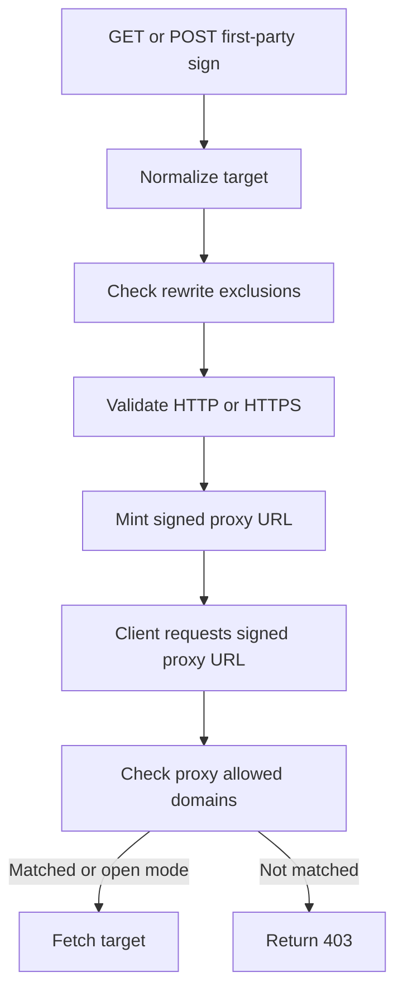
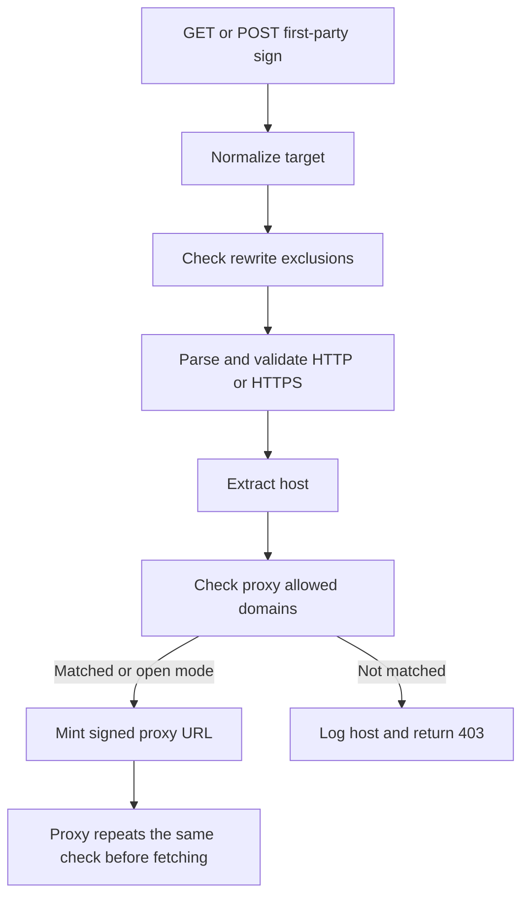
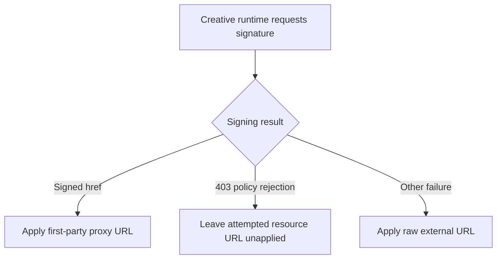

# First-party signing allowlist enforcement

**Issue:** [IABTechLab/trusted-server#1035](https://github.com/IABTechLab/trusted-server/issues/1035)

**Date:** 2026-08-26

**Status:** Proposed

## Problem

`GET` and `POST /first-party/sign` accept an absolute HTTP or HTTPS target and mint a short-lived `/first-party/proxy` URL for it. The signing handler currently checks `rewrite.exclude_domains`, but it does not check `proxy.allowed_domains`.

The proxy checks `proxy.allowed_domains` later, before fetching the initial target and at each redirect hop. When an operator configures an allowlist, a client can therefore obtain a valid signature for an off-list host even though using that signature fails with `403 Forbidden`.

This does not bypass fetch-time enforcement. It does make the signing endpoint inconsistent with proxy policy, and operators cannot distinguish off-policy signing attempts until a signed URL is used.

## Goals

- Enforce `proxy.allowed_domains` in `/first-party/sign` before minting a token.
- Apply the same host-matching rules used by the proxy fetch path.
- Cover GET query and POST JSON inputs.
- Cover protocol-relative targets after they inherit the request scheme.
- Preserve open mode when `proxy.allowed_domains` is empty.
- Log the rejected host without logging the complete target URL.
- Keep dynamic browser resources blocked when signing fails because of the allowlist.
- Keep source documentation, operator documentation, and example configuration accurate.

## Non-goals

- Authentication or authorization.
- Rate limiting.
- `Origin` validation or CORS changes.
- Private or reserved IP blocking.
- DNS resolution or rebinding protection.
- Token, signature, or expiry changes.
- JavaScript changes unrelated to distinguishing an allowlist rejection from other signing failures.
- Changing the existing direct-load fallback for network errors, malformed success responses, or non-403 signing failures.
- Adapter route changes.
- Changes for issue #982's opaque-origin signing broker or CORS-safe asset route.
- Changes to click URL signing or `/first-party/proxy-rebuild`.

## Current behavior



The allowlist check uses `url::Url::host_str()`. It does not include the port, path, query, fragment, or user information. Matching is case-insensitive:

- `example.com` matches only `example.com`.
- `*.example.com` matches `example.com` and subdomains at any depth.
- `*.example.com` does not match `evil-example.com`.
- An empty list permits every valid host.

## Approved behavior



### Validation order

The signing handler will retain this order:

1. Read the target from `GET ?url=` or the POST JSON body.
2. Trim it and give a protocol-relative target the request's scheme.
3. Apply the existing `rewrite.exclude_domains` behavior.
4. Parse the target URL.
5. Require an HTTP or HTTPS scheme.
6. Require a host.
7. Check the host against `proxy.allowed_domains`.
8. Create `tsexp`, sign the target, and serialize the response.

A URL rejected by `rewrite.exclude_domains` keeps its existing error behavior, even when it would also fail the allowlist. Malformed URLs, unsupported schemes, and missing hosts also keep their existing error categories. `403 Forbidden` is reserved for a valid host rejected by a non-empty allowlist.

### Shared host policy

Rename the private `redirect_is_permitted` helper to `is_host_permitted`. The helper already governs initial proxy targets as well as redirects, and the signing handler will become its third caller.

The helper remains the single place that combines:

- empty-list open mode; and
- exact or wildcard matching through `is_host_allowed`.

Fetch-time enforcement keeps its current behavior. Only the private helper name and its callers change.

### Rejection and logging

A rejected signing request will emit one warning containing the host only:

```text
sign request for `blocked.example.com` blocked: host not in proxy.allowed_domains
```

The handler will return `TrustedServerError::AllowlistViolation`, which already maps to `403 Forbidden`. Generalize the variant's documentation and display text from redirect-specific wording to host-policy wording so it remains accurate for initial fetches, redirects, and signing requests.

The existing generic client-facing error body remains unchanged.

### Browser behavior for policy rejection

The current creative runtime treats every signing failure as permission to use the raw external URL. Today an off-list dynamic resource receives a signed URL and is later blocked by `/first-party/proxy`. Returning `403` earlier from `/first-party/sign` without changing the runtime would instead make that resource load directly in the browser.



Preserve the current effective policy for an allowlist rejection:

- a `403` response from `/first-party/sign` is a policy rejection;
- the attempted resource URL is not applied to the image or iframe, so the browser does not request it directly;
- network errors, malformed success responses, and non-403 signing failures retain the existing direct-load fallback; and
- successful signing continues to apply the returned proxy `href`.

Represent these outcomes explicitly in the creative runtime rather than overloading `null`. A discriminated result such as `signed`, `fallback`, or `blocked` lets the dynamic source guard distinguish a policy rejection from a recoverable signing failure. On `blocked`, the guard clears the pending assignment without invoking the native setter. If the element already had a resource, it remains unchanged.

This is the only JavaScript behavior change in scope.

### Input forms

Both supported forms reach the same normalized `url::Url` before allowlist enforcement:

```text
GET /first-party/sign?url=https%3A%2F%2Fcdn.example.com%2Fasset.js
```

```json
{
  "url": "https://cdn.example.com/asset.js"
}
```

For a target such as `//cdn.example.com/asset.js`, the handler retains the existing request-scheme inheritance before extracting and checking `cdn.example.com`.

Methods other than GET and POST retain their current internal handler behavior. Adapter routing continues to expose only GET and POST.

## Test contract

### Core handler

Add handler-level coverage for the following seven cases through both GET and POST, producing fourteen combinations:

| Case                           | `proxy.allowed_domains` | Target                                                       | Expected result                                  |
| ------------------------------ | ----------------------- | ------------------------------------------------------------ | ------------------------------------------------ |
| Exact match                    | `cdn.example.com`       | `https://cdn.example.com/asset.js`                           | `200` with signed `href`                         |
| Rejected host                  | `allowed.example.com`   | `https://blocked.example.com/asset.js`                       | `AllowlistViolation`, status `403`               |
| Wildcard match                 | `*.example.com`         | `https://static.cdn.example.com/asset.js`                    | `200` with signed `href`                         |
| Protocol-relative match        | `cdn.example.com`       | `//cdn.example.com/asset.js` from an HTTP signing request    | `200`, signed `href`, and `base` using `http://` |
| Open mode                      | empty                   | `https://unlisted.example.com/asset.js`                      | `200` with signed `href`                         |
| User information cannot bypass | `allowed.example.com`   | `https://allowed.example.com@blocked.example.com:9443/path`  | `AllowlistViolation`, status `403`               |
| Non-host URL parts are ignored | `allowed.example.com`   | `https://user@allowed.example.com:9443/path?cache=1#section` | `200` with signed `href`                         |

The test should use one table-driven matrix and identify the method and case in each assertion. Successful cases need not assert time-dependent token bytes. They must parse the response, prove that the handler returned `200`, and verify that `href` is a signed `/first-party/proxy` URL. The protocol-relative case must also verify the inherited scheme through `base` or the decoded `tsurl`. The rejected cases must prove both the error variant and its `403` mapping.

The two authority cases verify that policy is applied to `Url::host_str()`, not the full authority or a substring of the input. Together with the existing host-matching tests, they lock down the rule that user information, port, path, query, and fragment do not participate in matching.

Existing host-matching and fetch-time tests remain in place, with helper references renamed as needed.

### Creative runtime

Add JavaScript tests for all three signing outcomes:

- a successful response applies the signed proxy `href`;
- a `403` response produces a blocked outcome and does not apply the raw external image or iframe URL; and
- network errors and non-403 failures retain the raw-URL fallback.

No adapter-specific tests are required. Every adapter calls the shared core handler.

## Documentation contract

Update all maintained source and operator-facing descriptions of this setting:

- `docs/guide/api-reference.md`
  - State that `/first-party/sign` checks `proxy.allowed_domains` before signing.
  - Document `403` for a valid off-list host.
  - Correct the response example to the actual `{ href, base }` shape.
- `docs/guide/configuration.md`
  - Describe signing, initial proxy targets, and redirect targets as covered by the allowlist.
  - Preserve exact, wildcard, case-insensitive, and open-mode semantics.
- `docs/guide/first-party-proxy.md`
  - Add signing-time enforcement to the signing endpoint and proxy allowlist sections.
  - State that a runtime `403` policy rejection does not fall back to a direct browser request.
- `crates/trusted-server-core/src/settings.rs`
  - Generalize the `Proxy::allowed_domains` documentation and open-mode log so they cover signing, initial targets, and redirects.
- `trusted-server.example.toml`
  - Replace the redirect-only comment with wording that covers signed and fetched proxy targets.
- `CHANGELOG.md`
  - Add an Unreleased Security entry describing early rejection at `/first-party/sign`.

Prebid-specific documentation remains unchanged because its descriptions of bundle-host and redirect-host requirements are already accurate.

## Expected files

| File                                                                          | Change                                                                                                                  |
| ----------------------------------------------------------------------------- | ----------------------------------------------------------------------------------------------------------------------- |
| `crates/trusted-server-core/src/proxy.rs`                                     | Rename and reuse the shared host-policy helper, enforce it before signing, log rejections, and add the GET/POST matrix. |
| `crates/trusted-server-core/src/error.rs`                                     | Generalize `AllowlistViolation` documentation and display wording.                                                      |
| `crates/trusted-server-core/src/settings.rs`                                  | Correct the allowlist field documentation and open-mode log.                                                            |
| `crates/trusted-server-js/lib/src/integrations/creative/proxy_sign.ts`        | Return distinct signed, fallback, and blocked outcomes.                                                                 |
| `crates/trusted-server-js/lib/src/integrations/creative/dynamic_src_guard.ts` | Keep allowlist-rejected resource assignments from reaching the native setter.                                           |
| `crates/trusted-server-js/lib/test/integrations/creative/proxy_sign.test.ts`  | Cover `403` policy rejection and non-policy fallback.                                                                   |
| `crates/trusted-server-js/lib/test/integrations/creative/image.test.ts`       | Prove an off-list image is not loaded directly.                                                                         |
| `crates/trusted-server-js/lib/test/integrations/creative/iframe.test.ts`      | Prove an off-list iframe is not loaded directly.                                                                        |
| `docs/guide/api-reference.md`                                                 | Document signing-time allowlist behavior and `403`.                                                                     |
| `docs/guide/configuration.md`                                                 | Describe the full allowlist policy.                                                                                     |
| `docs/guide/first-party-proxy.md`                                             | Update signing, browser rejection, and proxy allowlist sections.                                                        |
| `trusted-server.example.toml`                                                 | Correct the allowlist comment.                                                                                          |
| `CHANGELOG.md`                                                                | Record the security fix.                                                                                                |

No dependency, configuration schema, adapter, or routing changes are expected.

## Completion criteria

- A valid off-list GET or POST target returns `403` before token creation when `proxy.allowed_domains` is non-empty.
- Exact and wildcard matches continue to sign successfully.
- URL authority parsing cannot confuse user information or a port with the target host.
- Protocol-relative inputs are checked after scheme inheritance, and both GET and POST tests verify the inherited scheme.
- Empty-list open mode continues to sign valid targets.
- Signing and fetch paths use one host-policy helper.
- Fetch-time target and redirect enforcement is unchanged.
- A signing-time `403` does not cause the creative runtime to load the rejected URL directly.
- Non-policy signing failures retain their existing direct-load fallback.
- Logs identify rejected hosts without exposing paths or query strings.
- Source docs, current guides, example configuration, and changelog describe the behavior.
- All focused and repository-required checks pass.
