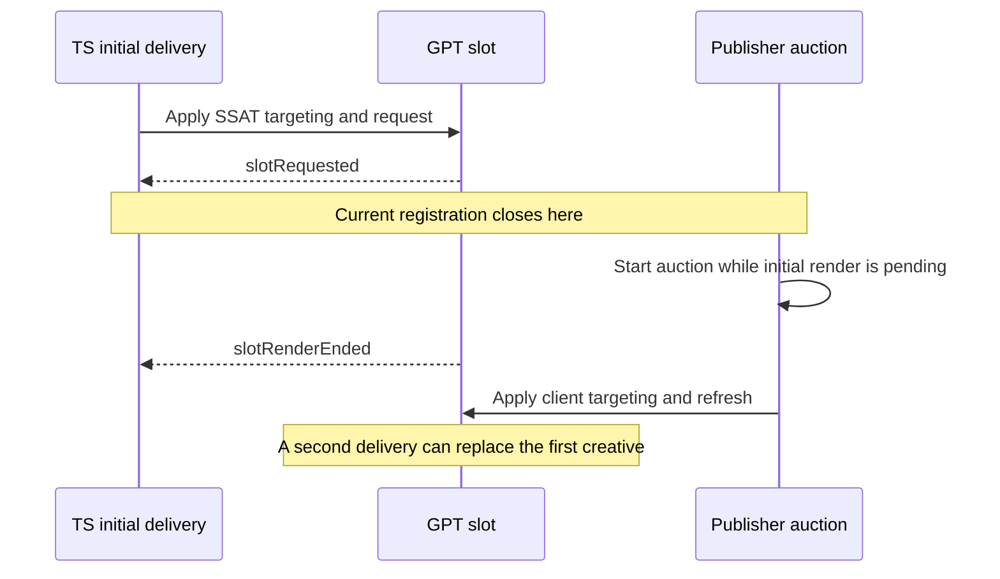

# Prevent Competing Initial Ad Deliveries — Issue 1190

## Status and decision

Proposed specification for issue #1190, “Prevent ad flicker when a client-side
auction runs against a slot that already has an SSAT result.” Prepared against
`main` at `7dbb83efe63a41b678ac3da21e9f8e1e520a70fa` on 2026-09-22. This document
defines the proposed behavior; it does not claim that the reported production
flicker has been reproduced or fixed.

Extend the existing per-slot first-impression ownership mechanism. Trusted Server
(TS) must retain ownership through its initial GPT render outcome. Publisher
auctions that start during that protected interval receive an immutable losing
delivery disposition, which survives their timeout, completion, and repeated
callbacks. A fresh publisher refresh after settlement remains eligible.

This is a logical ownership lock in asynchronous JavaScript, not a thread mutex.
It controls permission to mutate targeting and deliver an impression. It does not
hold the event loop, pause unrelated slots, or require cancelling bidder requests.

The compatibility assumption is to preserve ordinary subsequent refreshes without
requiring a new publisher API. Consequently, an unmarked publisher auction that
starts only after initial settlement is a subsequent auction. Protecting against
that auction as “late initial setup” requires an explicit intent contract and is
outside this proposal. This distinction is an acceptance boundary, not something
an arbitrary delay can infer.

## 1. Problem and evidence

### 1.1 What is known

The issue currently supplies a description but no reproduction, trace, or linked
implementation. Code inspection identifies two browser delivery paths for the
same placement:

1. Rust injects SSAT auction results into the document. The initial scheduler
   installs them into `tsjs.bids`; `adInit()` applies targeting and asks GPT/GAM
   to serve the slot. The creative can be delivered through the TS render bridge.
2. A publisher Prebid auction completes, applies targeting, and calls GPT
   `refresh()`. The TS refresh wrapper can also initiate a fresh auction for a
   publisher refresh.

SSAT is server-side auction execution, not server-painted ad pixels. Both display
paths ultimately execute in the browser. Having a candidate in `tsjs.bids` does
not prove GAM selected it; `ts_initial=1` alone does not prove there was a bid.

Existing first-impression arbitration, introduced by earlier work including
#1079 and #1083, protects several overlaps. However, the current implementation
ends registration of losing TS competitors when GPT emits `slotRequested`, even
though the initial render can still be pending. It also closes registration when
one losing delivery is consumed or abandoned, and refuses registration after a
five-second claim lease. Each is a distinct escape from pending-render protection.

### 1.2 What live investigation did and did not establish

An authenticated proxy investigation successfully loaded the page and ad stack.
Six additional cache-disabled document loads were traced after initial checks.
No SSAT bids appeared in the sampled `tsjs.bids` state on those six loads; each
observed slot received one initial GPT request during its observation window.
Some loads were TS-owned without an SSAT bid; others were publisher-owned. A
publisher auction produced a client-side winning bid on one load. An earlier,
longer trace showed a later publisher refresh, not an SSAT replacement.

These observations neither reproduce nor disprove #1190. They establish that
live demand is unsuitable as the deterministic test prerequisite. Do not copy
the investigated domain, credentials, cookies, account configuration, creative
IDs, or captured auction payloads into fixtures or documentation.

### 1.3 Deterministic hypothesis to test



The controlled regression must show the second native request and fixture
creative replacement on the unmodified baseline. If it does not, stop and
investigate the actual trigger before implementing a speculative behavior change.

## 2. Scope and terminology

| Term               | Meaning in this specification                                                                                        |
| ------------------ | -------------------------------------------------------------------------------------------------------------------- |
| Physical placement | The exact connected DOM element, not just its ID or GAM path.                                                        |
| Initial attempt    | The winning ownership claim and its first GPT request for one placement lifetime.                                    |
| Placement lifetime | Navigation generation, exact element identity, and bound GPT slot identity.                                          |
| Protected interval | TS ownership acquisition through the matching first `slotRenderEnded`, or verified retirement before that event.     |
| Settlement         | The first matching GPT render outcome, including an empty outcome. It is not proof of pixels or billable visibility. |
| Losing delivery    | Work classified against the TS protected interval when its auction or delivery attempt starts.                       |
| Subsequent refresh | Fresh work admitted after settlement, without provenance tying it to a losing initial attempt.                       |
| Tombstone          | Retained denial information for known losing work; retaining it does not keep the initial lock open.                 |

In scope: the managed TS GPT/Prebid path, its early bootstrap, initial targeting,
request admission, callback correlation, slot handoff, and deterministic tests.
The same lifecycle contract applies to TS-owned first impressions with no bid so
the bootstrap does not implement a different lock for bid presence. Tests must
separately demonstrate the issue with a real fixture SSAT candidate.

Out of scope: changing auction prices/winners, forcing SSAT to beat a publisher
that already owns the impression, globally disabling client bidders, holding every
publisher auction until server results arrive, changing refresh intervals, adding
a general renderer scheduler, or proving cross-origin creative pixels. No new
server auction payload or public configuration option is needed.

Direct unmanaged `pbjs.renderAd`, another Prebid global, arbitrary DOM replacement,
or native functions captured before TS installs its wrappers are not controlled
by this lock. The spec must not promise protection from those paths. If the
baseline reproduction identifies one of them, revise the scope before coding.

## 3. Current implementation map

Paths below are relative to the repository root. Symbols are more durable anchors
than line numbers as implementation proceeds.

| File                                                            | Relevant responsibility/change                                                                                                                                                           |
| --------------------------------------------------------------- | ---------------------------------------------------------------------------------------------------------------------------------------------------------------------------------------- |
| `crates/trusted-server-js/lib/src/core/first_impression.ts`     | Claim acquisition, registration, lease pruning, losing-token consumption, lifecycle observation, fallback reservation. Extend this authority.                                            |
| `crates/trusted-server-js/lib/src/core/types.ts`                | `FirstImpressionSlotClaim`, `FirstImpressionPublisherAuction`, `FirstImpressionState`, shared `TsjsApi` state.                                                                           |
| `crates/trusted-server-js/lib/src/integrations/gpt/index.ts`    | `installTsAdInit`, `installFirstImpressionLifecycleObservers`, `installLatePublisherSlotHandoff`, targeting, initial scheduling, SPA cleanup, creative bridge.                           |
| `crates/trusted-server-js/lib/src/integrations/prebid/index.ts` | Wrapped `requestBids`, `registerPendingPublisherBids`, `publisherDeliverySlots`, `prepareSuppressedPublisherSlot`, `installRefreshHandler`; targeting admission and callback provenance. |
| `crates/trusted-server-js/lib/src/core/slot_element.ts`         | Existing shared exact/prefix resolution; preserve its identity and ambiguity rules.                                                                                                      |
| `crates/trusted-server-core/src/integrations/gpt_bootstrap.js`  | Early duplicate of ownership, listeners, scheduling, targeting, fallback, and handoff. Must implement the same contract.                                                                 |
| `crates/trusted-server-core/src/integrations/gpt.rs`            | Embeds the bootstrap; preserve emitted contract and compilation.                                                                                                                         |
| `crates/trusted-server-core/src/publisher.rs`                   | `build_bids_script`, initial result injection. Normally unchanged; use as reference/fixture input.                                                                                       |
| `crates/trusted-server-js/lib/src/integrations/aps/render.ts`   | Existing authenticated asynchronous renderer behavior and failure evidence; do not reinterpret runner load as pixels.                                                                    |

Specifically, fix all three admission-closing paths, not only
`observeFirstImpressionGptLifecycle`: `consumePublisherFirstImpressionDelivery`
and `releasePublisherFirstImpressionAuction` currently close registration too.
The `claim.expiresAt` check is a fourth independent gate.

Current losing-token consumption deletes both the token and its pending bid/code
correlation. That supports one-shot suppression but not repeated delivery from
the same losing auction. Current publisher callback registration also resolves
element/generation at callback time; capture them at auction start instead.

`installRefreshHandler` currently clears targeting before it registers a new
synthetic refresh. Classification must precede this destructive work. Restoration
of the original TS targeting snapshot is insufficient once a later legitimate
refresh has installed newer targeting.

## 4. Alternatives and selected design

| Approach                                                                      | Advantage                                                                                                    | Failure/tradeoff                                                                                                       | Decision                                                                        |
| ----------------------------------------------------------------------------- | ------------------------------------------------------------------------------------------------------------ | ---------------------------------------------------------------------------------------------------------------------- | ------------------------------------------------------------------------------- |
| Boolean lock released on render                                               | Small implementation                                                                                         | Loses auction provenance; late and duplicate callbacks can replace the ad after unlock.                                | Reject.                                                                         |
| Extend shared ownership through GPT settlement, retaining losing dispositions | Fits existing architecture, preserves first claimant and subsequent refreshes; testable without live demand. | Requires lifecycle, targeting, provenance, bootstrap, and capacity work. Cannot infer unmarked post-settlement intent. | Select.                                                                         |
| SSAT remains exclusive until publisher explicitly marks a fresh refresh       | Distinguishes delayed initial setup from later refresh even after settlement.                                | Requires a public integration contract and publisher changes; risks suppressing existing refresh policies.             | Defer unless the narrower contract is rejected or the reproduction requires it. |

No fixed cooldown or artificial auction delay is part of the selected design.
Network requests may finish naturally; losing delivery is discarded rather than
queued for replay after settlement. Replaying it would merely postpone flicker.

## 5. Required invariants

1. One owner authorizes the initial GPT delivery for a managed placement lifetime.
   Ownership is acquired synchronously before targeting writes or request calls.
2. Publisher-first behavior is preserved. Delayed SSAT data cannot overwrite an
   already claimed/requested/rendered publisher impression.
3. A TS request event records progress; it does not settle the initial attempt.
4. No supported competing initial delivery clears protected targeting, issues a
   second native request, replaces the fixture creative, or fires TS win/billing
   work for a suppressed delivery.
5. Known losing provenance remains losing after settlement and across repeated
   callbacks. A targeting check does not consume permission for a later refresh.
6. A fresh accepted subsequent refresh can update the slot once. A stale losing
   callback cannot restore the original SSAT snapshot over its newer targeting.
7. Initial settlement is monotonic. Later `slotRequested` events cannot reopen
   the initial attempt or change its settled outcome.
8. Every delayed mutation revalidates generation, exact element, bound GPT slot,
   and delivery attempt. Reused IDs and ad IDs are insufficient authentication.
9. Admission/filtering is per slot. Mixed requests preserve eligible slots and
   their options; unrelated slots are never blocked by a managed-slot lock.
10. State remains bounded, and inability to record a claim/denial is an explicit
    outcome rather than implicit permission to deliver.

## 6. Ownership and delivery model

### 6.1 Shared state

Keep state under `tsjs.firstImpression`; do not introduce a second competing lock.
Extend each claim with the exact GPT slot once defined/reused, an initial attempt
identity, and immutable settlement information. Bind before invoking any native
operation that can synchronously emit a GPT event. The acquisition-to-binding
setup segment must not await asynchronous work.

Separate these concerns, even if existing fields are retained for compatibility:

- Initial lifecycle: preparing, requested, settled, or retired.
- Owner: publisher or TS.
- Publisher pre-request lease: controls existing abandoned-publisher fallback.
- Initial settlement reason: filled GPT render or empty GPT render.
- Per-auction delivery disposition: publisher initial, losing initial, or
  accepted subsequent work; bound to captured placement identity.
- Latest accepted targeting/delivery revision: prevents stale restoration.

`publisherRegistrationClosed` must describe closure of the initial classification
window, not consumption of one token. A settled claim remains stored for the
placement lifetime so late results can still be rejected. New subsequent work
gets its own delivery context without resetting the initial lifecycle.

### 6.2 Transition table

| Current state and event                                                  | Action                                                                              | Result                                                           |
| ------------------------------------------------------------------------ | ----------------------------------------------------------------------------------- | ---------------------------------------------------------------- |
| Untouched placement; publisher auction starts                            | Register publisher claim before native `requestBids`.                               | Publisher owns initial attempt under existing pre-request lease. |
| Untouched placement; TS begins setup                                     | Acquire claim, bind slot, snapshot protected keys, apply targeting.                 | TS preparing.                                                    |
| Publisher owns; SSAT data/adInit arrives                                 | Preserve publisher ownership and existing bounded fallback rules.                   | No TS retarget/request.                                          |
| TS preparing; native initial request starts                              | Record request identity and time.                                                   | TS requested; protection remains active.                         |
| TS preparing/requested; publisher auction or uncorrelated refresh starts | Classify affected slots before targeting/request mutation.                          | Losing initial work for protected slots.                         |
| Losing work completes, throws, times out, or repeats                     | Preserve denial; filter delivery and targeting.                                     | Other registrations and initial lifecycle unchanged.             |
| Matching first `slotRenderEnded`, filled or empty                        | Store terminal GPT outcome and close initial admission window.                      | Settled; retain losing tombstones.                               |
| Settled; fresh eligible publisher work starts                            | Admit a new delivery revision.                                                      | Ordinary subsequent refresh, initial state stays settled.        |
| Settled; known losing work arrives                                       | Reject mutation/request; do not restore stale TS targeting.                         | Latest accepted revision unchanged.                              |
| Setup fails before any request could have started                        | Release TS ownership with existing denial identities retained separately as needed. | Fresh work may claim; old losing work is not silently promoted.  |
| Navigation, exact element replacement, or verified GPT slot retirement   | Invalidate the lifetime and pending capabilities.                                   | New lifetime may independently acquire ownership.                |
| Stale/duplicate GPT event                                                | Ignore for initial state.                                                           | No settlement of a replacement element/slot.                     |

### 6.3 Meaning of render completion

Use the first matching `slotRenderEnded` as the compatibility boundary. It is
available for GAM-selected creatives, empty responses, inline creatives, cached
creatives, and APS without inventing a new cross-origin acknowledgment protocol.

This boundary means GPT completed its render phase. It does not mean nested
assets loaded, APS painted pixels, the iframe became viewable, or a beacon fired.
`MessagePort.postMessage()` success and APS runner-script load must not independently
settle the lock. A publisher auction starting after GPT settlement is eligible
even if nested assets are still loading; that is an explicit limitation of this
version. If that ordering reproduces #1190, this design needs a renderer/intent
contract revision before implementation, not a misleading success assertion.

### 6.4 Failures, deadlines, and recovery

Preserve the current five-second **publisher pre-request** lease and at-most-once
per-slot TS fallback. It is not a lease on TS protection after request submission.
Do not change the separate APS renderer timeout or synthetic auction watchdog.

For TS setup exceptions, release only when the implementation knows no request
could have started. A native call that may dispatch and then throw is an uncertain
submission: retain protection rather than assume rollback is safe.

An empty matching GPT render settles the attempt and permits a new publisher
auction. Missing markup, cache failure, message-post failure, APS runner failure,
and renderer timeout remain creative failures; they must not be called successful
pixel delivery or automatically trigger another impression. If GPT already
settled, those failures do not reopen its initial lock.

If a submitted GPT request never emits its matching render event, elapsed time
alone must not authorize a competing delivery: an old native request could still
render later. A five-second pending-request diagnostic may mark the attempt
stalled, but must not unlock, clear denial records, or refresh it. The affected
slot remains protected until a terminal event or verified retirement. Recovery is
an existing publisher destroy/redefine lifecycle or navigation, not an automatic
retry. Never destroy a publisher-owned slot merely to implement a TS timeout.

This deliberately chooses safety over automatic recovery for a genuinely stuck
native request. Other slots and navigation continue. A guarantee of bounded
automatic recovery would require a reliable cancellation/replacement contract
with GPT, which this proposal does not assume. Test and document this operational
limitation rather than hiding it behind an expiry.

## 7. Auction provenance and delivery admission

### 7.1 Capture at the start

Before native publisher `requestBids`, capture requested ad-unit scope, generation,
exact resolved element, current bound GPT slot/attempt, unique registration, and
per-slot disposition. Preserve existing `adUnits`/`adUnitCodes` scoping. The
callback must not re-resolve an old code into a new route or replacement element.

Keep a compact immutable disposition in the callback context as well as bounded
indexes for deferred delivery. This allows a known denied callback to remain
denied even when detailed diagnostic/index capacity is unavailable. Restore nested
callback context with `try/finally`; preserve receiver, arguments, return values,
and exception behavior of wrapped APIs.

The synthetic refresh path captures the same facts before clearing targeting or
starting its auction. Callback/watchdog completion is at most once. A timeout
cannot reclassify an already denied initial delivery as a subsequent refresh.

Custom targeting can resolve a code only later, or match it to several slots.
Do not interpret an unresolved start-time code as permission. Capture one shared,
bounded placement snapshot per publisher auction, covering the currently known
managed elements from injected slot resolution and live managed GPT slots. Each
entry holds exact element/GPT identity and its current initial-attempt state;
all ad units in that auction share the snapshot rather than copying it. Assign
auction starts, TS acquisitions, and settlements a monotonic sequence within the
navigation so ordering does not depend on wall-clock ties or adjustments.

When native custom matching later identifies a managed target, bind it against
that snapshot. If its TS initial attempt was pending when the auction started,
deny delivery even if it is now settled. If the element was captured but unclaimed
and TS acquired it before the publisher first resolved/claimed it, TS is the
first valid claimant: deny the old auction when its start precedes TS settlement.
If it was already settled at auction start, classify fresh work as subsequent.
For a managed target missing from the snapshot, or whose captured element/GPT
identity has changed, refuse that auction's mutation of that target and require
a new auction; never rebind old work to a newly discovered placement. Unmanaged
targets retain native behavior. One code matching several slots is evaluated
independently against each captured placement.

An element captured before any GPT slot exists is a distinct case from replacement:
its first subsequently bound GPT slot may be adopted for classification if the
same element and generation remain live. A previously captured nonempty GPT slot
identity may never be replaced by lookup. Record retirement so destroying and
redefining a slot on the same element also requires fresh auction work.

Bound each snapshot to the existing 256-placement capacity and share its lifetime
with its bounded publisher registration. If the snapshot/index cannot be retained,
use the explicit overflow disposition in section 7.3. Do not retain snapshots for
ordinary completed work beyond the existing delivery-correlation lifetime. This
captures known managed placements without retaining all page elements or cloning
the DOM. A publisher dynamically introducing a managed target after auction start
must start fresh work for that target.

### 7.2 Correlation rules and unavoidable ambiguity

Use captured active callback context first where it identifies the exact affected
slot. Otherwise use a unique bid/ad-ID registration combined with placement
identity. An ad ID alone is not unique across placements or auctions. Preserve
code-only/no-bid delivery inside a known callback. Do not consume a denial merely
because targeting was attempted.

Outside callback context, an asynchronous delivery with a uniquely retained bid
identity can still be rejected after settlement. A code-only call has no such
identity: the same `refresh([slot])` could be a delayed no-bid callback or a fresh
refresh timer. During active protection it is suppressed. After settlement, an
otherwise uncorrelated code-only call is treated as a fresh refresh intent; do not
let old code-only tombstones block every future bare refresh indefinitely.

Therefore this design does **not** guarantee suppression of arbitrary asynchronous
code-only callbacks after settlement. Supported publisher callbacks should deliver
synchronously within `bidsBackHandler`, or retain uniquely correlatable bid
identity for deferred delivery. Stronger protection needs an explicit refresh/
delivery token API or publisher adapter, not patching global timers/Promises.
Acceptance tests must include this limitation as a compatibility case.

When a call positively matches multiple conflicting retained bid registrations,
do not guess which one it consumes. Suppress mutation for the affected protected
placement and report ambiguity. Fresh work with an exact accepted context remains
eligible. Never broaden that suppression to unrelated slots.

### 7.3 Replays and bounds

Do not delete the denial on its first attempted consumption. Repeated targeting,
refresh, callback invocation, auction timeout, and callback exception must remain
idempotently denied for known losing context. Keep only compact provenance; never
retain creative markup, whole response bodies, or unnecessary DOM subtrees.

Preserve the existing bounds of 256 first-impression slots and 16 detailed
publisher registrations per slot. Audit pending bid/code indexes and apply their
declared bounds consistently; retained entries must not make a map grow without
limit or be evicted in a way that silently grants permission.

At slot-claim capacity, TS declines to acquire another initial slot and leaves it
publisher-owned. At per-slot registration/index capacity, an active TS claim
still yields an explicit denied disposition in captured callback context. Set a
bounded per-slot overflow marker if deferred provenance cannot be represented.
While that marker applies, unattributable targeting/delivery for that placement
fails closed, including after settlement; an exact fresh accepted callback
context may proceed. Navigation or verified lifetime replacement clears it.

This exceptional overflow policy can suppress an otherwise legitimate anonymous
refresh. Emit bounded evidence and test the tradeoff. Do not claim both unlimited
late anonymous protection and unlimited refresh liveness with finite storage.
Avoid per-denial timers for immortal tombstones; cleanup is by lifetime invalidation.

## 8. Targeting and GPT integration

### 8.1 Protect before mutation

Delivery suppression is too late if a losing callback has already overwritten
the targeting an initial request will read. Put admission before
`clearRefreshTargeting`, Prebid GPT-targeting application, and native request
dispatch. Keep the same authority for all three decisions.

Wrap the supported Prebid `setTargetingForGPTAsync` entry point and use narrowly
scoped GPT slot targeting guards for managed keys to enforce the final per-slot
decision. Preserve custom slot matching and mixed/unscoped targeting semantics;
do not assume one ad-unit code identifies one slot. Native Prebid matching can
run, while guarded slot writes reject unauthorized changes. Bind guards before
initial TS targeting and make installation idempotent across bootstrap/runtime.

The installed Prebid implementation applies a complete targeting/reset map through
GPT `slot.updateTargetingFromMap`, not only individual setters. Guard that API as
an atomic per-slot transaction: inspect the selected `hb_adid` and captured auction
provenance in the complete incoming map before applying any managed reset/write.
Preserve unrelated entries, `null` deletion/reset semantics, receiver, return
value, and exception behavior. Do not first apply the reset map and then reject
the winning keys. Include this real API in the browser fixture and typed GPT
test doubles; a mock that only calls individual setters will miss the live path.

If a supported targeting implementation emits individual writes instead, stage
its managed writes for the duration of the synchronous targeting transaction,
resolve the complete selected targeting and per-slot provenance, and commit only
accepted writes. Do not assume `hb_adid` is written first. On a targeting exception,
discard staged managed writes and rethrow; unrelated native behavior remains
unchanged. Direct individual setters outside a targeting transaction use the
captured callback context or current active protection, with the post-settlement
unattributable-write limitation stated below.

Guard `setTargeting` and `clearTargeting` for the TS-managed `hb_*`, `ts_initial`,
and configured slot keys recorded in the accepted snapshot. Preserve unrelated
publisher keys. A no-argument clear must preserve protected keys while clearing
unprotected keys with equivalent native behavior. TS internal writes use a
synchronous, per-slot accepted context, always restored in `finally`.

Unscoped Prebid targeting can select old bids even inside a fresh callback. Check
selected bid provenance for each affected placement; do not authorize every
write solely because the outer callback is fresh. Reused/nonunique bid identities
must follow the ambiguity rule. Direct arbitrary publisher writes after settlement
without attributable context remain outside late-callback protection.

The initial TS snapshot is only authoritative for its delivery revision. Never
restore it over targeting from an accepted subsequent refresh. Prefer preventing
losing writes; any necessary restoration must compare the captured revision to
the current accepted revision and preserve the latter.

### 8.2 Requests, handoff, and SRA

Keep `adInitRefreshInProgress`/internal handoff bypass scoped to TS's own initial
delivery. It is not an application-wide permission to bypass ownership.

Continue one-inner-div GPT slot handoff and its `defineSlot`/`display` behavior.
GPT slot creation ownership and initial impression ownership are separate: a slot
handed to a publisher can retain the TS initial-delivery claim. Consume equivalent
one-shot handoff suppression when the outer delivery wrapper suppresses it, so
two wrappers do not accidentally suppress the next legitimate refresh.

For a mixed or bare `refresh`, snapshot concrete target slots before asynchronous
work. Filter only denied/stale members; scope targeting to eligible members;
preserve options and native call count. Never call native `refresh([])` when all
members are denied. Preserve existing SRA batching of the surviving slots rather
than issuing one request per slot. Late-added slots cannot join an older bare
refresh callback.

Excluded GAM paths still need ownership checks even when no synthetic auction
runs. With `disableInitialLoad`, display/register once and permit the one internal
TS refresh; the guard must not turn it into another client auction.

## 9. Navigation, bootstrap, and creative safety

The bootstrap and full bundle must share one state schema and identical transition
rules. The bootstrap can install GPT listeners first and set
`firstImpressionListenersInstalled`; the bundle then leaves those closures active.
A runtime-only fix is therefore insufficient. Change both paths together without
a broad bundling refactor or extra shipped dependency.

Require parity for bootstrap-only, runtime-only, bootstrap then bundle while a
request is pending, bundle then activation flag, and delayed GPT command-queue
execution. Installing twice must not duplicate listeners/wrappers or reset claims.

Preserve initial scheduling after load and hydration frames. Scheduling or having
an SSAT candidate is not itself a claim. Hidden tabs must not lose protection
because timers advanced while animation frames were paused.

On SPA navigation, retain the existing synchronous old-targeting cleanup and
generation change. Reject queued work and callbacks from the old generation. On
same-ID element replacement, invalidate the old physical lifetime even without
navigation. A GPT event must match the captured GPT slot and element; resolving
the current element by string ID alone can incorrectly settle a replacement.
Verified destroy/redefine similarly retires the old GPT identity.

Keep the existing authenticated creative-bridge checks: current bid identity,
generation, connected source iframe, expected source window, containment in the
slot root, and unambiguous mapping. Cached responses, APS completion, and iframe
resize must not mutate a newer accepted delivery. Bind any additional attempt
checks to this authority; do not weaken them or introduce unauthenticated success
messages. Preserve existing beacon semantics and test no additional beacon work
from denied/stale deliveries.

## 10. Diagnostics and support boundary

Provide bounded debug evidence for acquisition, initial request, settlement,
suppressed delivery/targeting, stale context, ambiguity, overflow, and stalled
request. Include navigation/attempt identity, relative timing, owner, and a reason
code. Use existing logging/diagnostics facilities; no new analytics service or UI
project is required. Never log credentials, cookie values, creative markup, or
full bidder responses.

Diagnostics must distinguish candidate availability, selected targeting, native
request, GPT filled/empty render, creative response sent, and actual fixture
replacement evidence. Denied delivery is not a new GPT request cycle. A diagnostics
exception or disabled recorder cannot change admission or release ownership.

Document these limits prominently in the GPT diagnostics guide:

- Request-time protection now extends to GPT render settlement.
- Pixels and post-settlement unmarked initial intent are not inferred.
- Correlated losing callbacks remain denied; asynchronous anonymous code-only
  callbacks after settlement cannot reliably be distinguished from fresh refresh.
- A stalled submitted request stays protected until settlement or retirement.
- Overflow uses a conservative per-slot policy rather than granting permission.

## 11. Verification specification

### 11.1 Deterministic browser fixture

Add `crates/trusted-server-integration-tests/browser/tests/shared/gpt-first-impression.spec.ts`.
Use the built production core/GPT/external Prebid/shim bundles and a controlled
fixture page. Follow `aps-renderer.spec.ts` for coupled/decoupled bundle loading
and real Prebid Universal Creative assets. Use fictional endpoints under
`example.com`; route all bidder/creative traffic locally.

The existing `helpers/gpt-stub.ts` only supports diagnostics and has no-op request
methods. It is not an adequate flicker oracle. Provide a focused fixture GPT
implementation with real slot identity/targeting, native request recording,
controllable lifecycle events, and visibly distinct iframe creatives. The fixture
must not contain the ownership/suppression algorithm being tested.

Use explicit barriers for auction completion, GPT request/render events, cache
responses, and renderer readiness. Assert request count, targeting at dispatch,
iframe identity, creative content marker, and replacement mutations. Screenshots
before/after callback release and retained traces support those assertions; sleeps
and human visual judgment are not the pass/fail oracle. A stubbed GPT browser test
proves TS orchestration, not live GAM internals.

### 11.2 Required matrix

| Case                                                                            | Required assertion                                                                                  |
| ------------------------------------------------------------------------------- | --------------------------------------------------------------------------------------------------- |
| Publisher registers before TS                                                   | Publisher retains first delivery; arriving SSAT does not retarget or request again.                 |
| TS claims; client starts before native request                                  | Client delivery is denied before and after TS settlement.                                           |
| Client starts after `slotRequested`, before `slotRenderEnded`                   | Baseline reproduction fails; fixed behavior has one initial request and unchanged fixture creative. |
| Same client completion before/after render, reverse order, duplicate invocation | Identical losing disposition; no second request or targeting mutation.                              |
| Suppress or throw from first losing auction, then start another before render   | Second auction remains losing; one token cannot close the protection interval.                      |
| Pending render crosses five seconds                                             | Lease expiry does not grant delivery; late registered and known losing work remains denied.         |
| Fresh publisher auction after settlement                                        | Exactly one additional delivery; newer targeting/creative may replace the initial one.              |
| Old losing callback after that legitimate refresh                               | Newer targeting and iframe remain intact; no original SSAT restoration.                             |
| Empty GPT outcome; SSAT absent; GAM selects other demand                        | Correct settlement, no false assertion of SSAT win, subsequent refresh preserved.                   |
| Known synchronous no-bid callback; deferred uniquely identified bid             | Both correlate and suppress through supported context.                                              |
| Post-settlement anonymous code-only refresh                                     | Allowed as fresh work unless overflow/positive ambiguity applies; limitation explicit.              |
| Multiple conflicting bid matches                                                | No guessed delivery or deletion; unrelated slots unaffected.                                        |
| Setup throw before request; uncertain throw after possible dispatch             | Safe release only before submission; no automatic second request afterward.                         |
| Missing GPT render event                                                        | Stalled evidence, no timer-triggered unlock/retry; valid retirement permits new lifetime.           |
| Synthetic callback, watchdog, then late callback                                | At-most-once completion and no resurrection of denied work.                                         |
| Mixed SRA, bare refresh, excluded paths, late-added slot                        | Exact surviving list, options and batching preserved; no targeting on filtered slots.               |
| Scoped `adUnitCodes`, unscoped/custom matching targeting                        | Correct per-placement filtering and native API semantics.                                           |
| Direct managed targeting clear/set while protected                              | Protected snapshot remains; unrelated keys retain native behavior.                                  |
| Disabled initial load, late define/display handoff, nested wrappers             | One initial request; later refresh is not suppressed twice.                                         |
| Bootstrap/runtime in either order and duplicate installation                    | Identical state transitions, single listeners/wrappers, live claims adopted.                        |
| Navigation, same-ID DOM replacement, destroyed/redefined GPT slot               | Old events/callbacks cannot affect the new lifetime.                                                |
| Hydrated aliases, hidden/responsive prefixes, duplicate GAM paths/ad IDs        | Exact identity rules hold; ambiguity never broadens ownership.                                      |
| Inline ADM, held cache response, APS runner failure/late completion             | Existing source authentication and revision guards hold; no extra renderer/beacon work from denial. |
| 17th registration, 257th claim, bid/code index cap                              | Explicit bounded overflow behavior; no silent permission and no unbounded map.                      |
| Diagnostics disabled, throwing recorder, hidden tab                             | Same admission behavior; no reliance on diagnostics or animation-frame timing for expiry.           |

Additional targeting regressions must use native `updateTargetingFromMap` with
reset/null entries, custom matching supplied after auction start for an otherwise
unrelated code, one code matching both protected and eligible slots, a managed
element introduced/replaced after the start snapshot, and a losing selected bid
inside a fresh unscoped targeting call. For individual-write implementations,
exercise reset-before-ad-ID ordering and an exception midway through staging.

Run the critical request-to-render overlap with an SSAT fixture winner, not merely
`ts_initial=1` or an empty bid map. Run the same case with diagnostics disabled.

### 11.3 Existing suites to extend

- `crates/trusted-server-js/lib/test/integrations/prebid/index.test.ts`: real
  wrapper composition, callback correlation, targeting, replay, refresh/SRA,
  overflow, and the existing post-request-is-refresh expectation. Replace that
  expectation with separate pending-render and settled cases.
- `crates/trusted-server-js/lib/test/integrations/gpt/ad_init.test.ts`: acquisition,
  exceptions, lifecycle identity, handoff, creative safety, and no-bid behavior.
- `crates/trusted-server-js/lib/test/integrations/gpt/gpt_bootstrap.test.ts`: execute
  the actual Rust-owned bootstrap, including bootstrap-to-runtime adoption.
- `crates/trusted-server-js/lib/test/integrations/gpt/spa_hook.test.ts` and
  `schedule_initial_ad_init.test.ts`: navigation, hydration, delayed GPT and frames.
- `crates/trusted-server-js/lib/test/integrations/gpt_diagnostics`: evidence-only
  integration; no admission decisions delegated to diagnostics.

Use fake time for lease/watchdog cases and explicit promise barriers for ordering.
Tests must fail because the forbidden request/mutation occurs on baseline, not
because a proposed new private field is missing.

### 11.4 Commands and prerequisites

From `crates/trusted-server-js/lib`:

```sh
npx vitest run test/integrations/prebid/index.test.ts test/integrations/gpt/ad_init.test.ts test/integrations/gpt/gpt_bootstrap.test.ts test/integrations/gpt/spa_hook.test.ts test/integrations/gpt/schedule_initial_ad_init.test.ts test/integrations/gpt_diagnostics
npx vitest run
npm run lint
npm run format
node build-all.mjs
```

From the repository root, after adding the proposed browser test:

```sh
./scripts/integration-tests-browser.sh tests/shared/gpt-first-impression.spec.ts
```

The browser script prepares bundles, Fastly WASM, framework containers, and Viceroy
configuration, and exercises both supported framework fixtures. It requires the
repository-pinned Node/Rust toolchains, `wasm32-wasip1`, Viceroy, Docker, browser
dependencies, and an available origin port. Do not assume a direct Playwright
invocation's default artifact paths are already populated. Run the existing APS
browser suite as a regression check when creative integration code changes.

For implementation handoff, run the full CI gate list in the current `AGENTS.md`,
including target-matched Rust tests/clippy, parity, JS build/tests/format, and docs
format. Bootstrap edits affect the Rust core embedding even when auction Rust
logic is unchanged. This specification-only change needs document formatting and
reference review; it does not claim the future runtime/browser checks have run.

## 12. Delivery sequence and acceptance

1. Build and run the deterministic baseline reproduction. Record the ordering,
   native requests, targeting snapshots, and creative replacement assertion.
2. Implement shared lifecycle/provenance semantics with unit regressions. Keep
   failure, replay, identity, and capacity behavior explicit.
3. Apply the same contract in bootstrap and full GPT paths. Add targeting and
   delivery admission at the existing wrappers, preserving handoff/SRA semantics.
4. Run the browser matrix, then relevant regression suites and full CI gates.
   Update the diagnostics guide and the earlier first-impression design documents
   to identify the superseded request-time boundary.
5. Review before deployment. Compare initial request counts, later refresh counts,
   empty/stalled outcomes, and suppression reasons on a controlled test placement.

Implementation is accepted only when a controlled baseline failure is demonstrated,
the selected protection interval produces one initial delivery, late correlated
losers cannot mutate a newer accepted delivery, subsequent refreshes still work,
and bootstrap/runtime parity plus failure/capacity tests pass. Do not close the
issue based on intermittent live bids or passing helper-state tests alone.

Deploy bootstrap and bundle semantics as one release. For rollback, revert that
release coherently; mixed old/new ownership code must not be the rollback plan.
No new feature flag is required for this focused correction. Watch for increased
blank/stalled slots, lost legitimate refreshes, targeting mismatch, duplicate
requests, or state growth; these are rollback signals, not reasons to weaken
denial silently in production.

## 13. Decisions reserved for spec review

The proposed defaults are fully specified above. Review must explicitly accept
the GPT-render settlement milestone, ordinary post-settlement refresh semantics,
the anonymous deferred callback limitation, and the stalled-request safety policy.
If a stronger “keep SSAT until explicitly refreshed” guarantee is required, select
the explicit publisher intent alternative and revise this document before an
implementation plan is written. No runtime change is authorized by the existence
of this draft alone.
