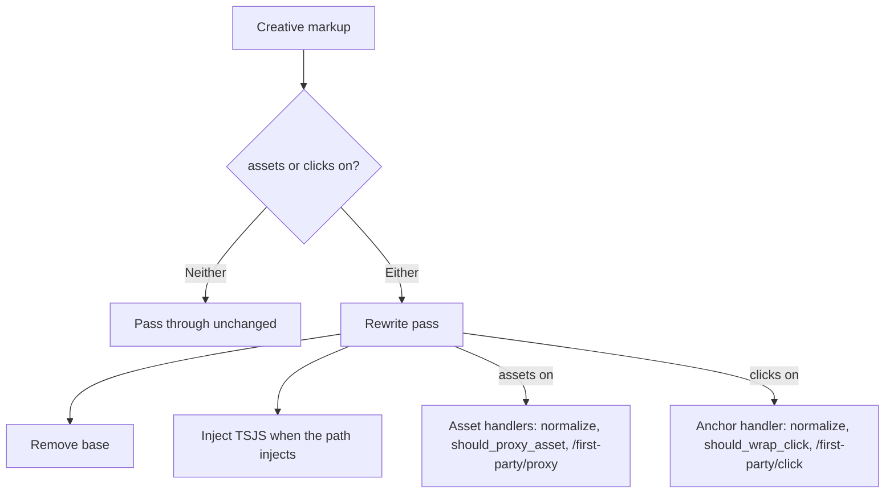

# Creative click rewriting switch

**Issue:** [IABTechLab/trusted-server#1234](https://github.com/IABTechLab/trusted-server/issues/1234)

**Related:** [IABTechLab/trusted-server#1231](https://github.com/IABTechLab/trusted-server/issues/1231) (asset host allowlist)

**Date:** 2026-10-07

**Status:** Draft

Line numbers below are at `main` 7a0ecb4c.

## Problem

Click wrapping is not a feature of its own. The creative rewrite pass turns every eligible `<a href>` and `<area href>` into a signed `/first-party/click` redirect. It does this in the same lol_html pass, behind the same switch (`[auction] rewrite_creatives`) and through the same per-URL check (`to_abs`) that it uses to proxy assets.

As a result an operator cannot:

- keep first-party click tracking while leaving creative assets direct; or
- proxy creative assets while leaving advertiser landing links untouched.

## Goals

- Add a switch that turns click wrapping on or off without affecting asset rewriting.
- Narrow `rewrite_creatives` to asset rewriting. Keep its name so existing configs still parse.
- Leave rewritten output unchanged for every existing config. In particular, upgrading must not turn click wrapping on for operators who have `rewrite_creatives = false`.
- Keep `[rewrite] exclude_domains` applying to anchors.
- Define the `to_abs` split that this issue and #1231 share, so either implementation can land first.
- Keep the config blob compatible with older binaries while the new setting is unset.

## Non-goals

- The asset host allowlist (#1231). It never applies to anchors.
- Unregistering `/first-party/click` or `/first-party/proxy-rebuild` when clicks are off. Creatives that were already served can still hold signed click URLs.
- Adding a click guard to the inline SSAT/page-bids path.
- Mapping any server setting onto the client `TsCreativeConfig` flags.
- Changing asset rewriting inside HTML or CSS fetched through `/first-party/proxy`. That path keeps proxying assets regardless of `rewrite_creatives`.
- Domain checks at `/first-party/click` and `/first-party/proxy-rebuild`. Those endpoints redirect any validly signed target by design (`proxy.rs:1896-1904`).

## Current behavior

### One pass, one switch

`process_auction_creative_with_rewriter` (`crates/trusted-server-core/src/creative.rs:1008-1035`) enforces the size cap, optionally sanitizes, and then runs the rewrite pass only when `settings.auction.rewrite_creatives` is true (`creative.rs:1031`). With rewriting off, the markup ships exactly as sanitization left it.

The pass itself, `rewrite_creative_html_impl` (`creative.rs:1125`), registers every handler unconditionally:

| Handler                          | Location                             | Effect                                                                     |
| -------------------------------- | ------------------------------------ | -------------------------------------------------------------------------- |
| `<base>` removal                 | `creative.rs:1163`                   | Removes bidder `<base>` so root-relative first-party URLs cannot rebase.   |
| `<body>` TSJS injection          | `creative.rs:1168`                   | Prepends the unified bundle once when `inject_tsjs` is set.                |
| Asset handlers                   | `creative.rs:1179-1281`, `1293-1339` | img, script, link, media, object/embed, input, SVG, iframe, srcset, CSS.   |
| Anchor handler                   | `creative.rs:1283`                   | `a[href], area[href]` → `build_click_url`, sets `href` and `data-tsclick`. |
| Body-less fragment TSJS fallback | `creative.rs:1391`                   | Prepends the bundle when no `<body>` token was seen.                       |

Every per-URL decision for assets and anchors goes through `to_abs` (`creative.rs:54-75`). It trims, maps `//host` to `https://host`, rejects anything that is not an `http://` or `https://` prefix, and returns `None` when `settings.rewrite.is_excluded` matches (`creative.rs:70`). `None` leaves the attribute untouched, so an excluded anchor keeps its raw `href` and gets no `data-tsclick`.

`to_abs` returns the trimmed input string, not a parsed URL. `build_signed_url_for` (`creative.rs:554`) parses it again with `url::Url` and, if parsing fails, returns the clear URL unchanged (`creative.rs:560-562`).

`Rewrite::is_excluded` (`crates/trusted-server-core/src/settings.rs:645-670`) parses the URL and compares the lowercased host against raw config entries, so an entry written in uppercase never matches. `proxy::is_host_allowed` (`crates/trusted-server-core/src/proxy.rs:1242`) already lowercases both sides and uses the same exact or `*.example.com` rule.

### Three entry points

| Entry point                           | Caller                                                                                                                                        | Gated by `rewrite_creatives` | URL form                  | TSJS                                                   |
| ------------------------------------- | --------------------------------------------------------------------------------------------------------------------------------------------- | ---------------------------- | ------------------------- | ------------------------------------------------------ |
| `POST /auction` `adm`                 | `auction/formats.rs:398` → `process_auction_creative` (`creative.rs:985`)                                                                     | Yes                          | Root-relative             | Injected (`rewrite_creative_html`, `creative.rs:1051`) |
| SSAT and page-bids inline `adm`       | `publisher.rs:5835` → `process_inline_auction_creative` (`creative.rs:998`)                                                                   | Yes                          | Absolute on `base_origin` | Not injected (`creative.rs:1085`)                      |
| HTML fetched via `/first-party/proxy` | `finalize_proxied_response` (`proxy.rs:643-678`) → `CreativeHtmlProcessor` (`creative.rs:1409`) → `rewrite_proxied_html` (`creative.rs:1062`) | No                           | Root-relative             | Injected                                               |

The proxy path ignoring `rewrite_creatives` is pinned by `auction_rewrite_setting_does_not_change_proxied_html_or_css_rewriting` (`proxy.rs:3582`).

### Runtime pieces

- `/first-party/click` (`handle_first_party_click`, `proxy.rs:1545`) validates the signature, appends `ts-ec`, and returns a `302`.
- `/first-party/proxy-rebuild` (`handle_first_party_proxy_rebuild`, `proxy.rs:1812`) re-signs a click after creative script added or removed query parameters.
- Both are routed in every adapter and gated by no setting.
- The injected script is the unified bundle (`tsjs::tsjs_unified_script_tag`, `tsjs.rs:66`), which is core plus immediate modules (`publisher.rs:544-549`). `creative` is always an immediate module (`integrations/registry.rs:1216`).
- The creative runtime (`crates/trusted-server-js/lib/src/integrations/creative/index.ts:13-16`) installs the click guard when `TsCreativeConfig.clickGuard` is true (the default) and the render guard when `renderGuard` is true (default false). `TsCreativeConfig` is defined in `crates/trusted-server-js/lib/src/shared/globals.ts:10-15`. No server setting maps to either flag.
- The click guard (`crates/trusted-server-js/lib/src/integrations/creative/click.ts`) acts only on anchors that carry a server-set `data-tsclick`. `handleGuardedClick` returns early without one (`click.ts:433-434`), and the mutation monitor scans only `a[data-tsclick], area[data-tsclick]` (`click.ts:467`).

### Config plumbing

`AuctionConfig` uses `deny_unknown_fields` (`crates/trusted-server-core/src/auction_config_types.rs:16-17`). `rewrite_creatives` is a `bool` with default `true` and `skip_serializing_if = "is_default_rewrite_creatives"` (`auction_config_types.rs:46-50`, `141-148`), so the default never reaches the blob. The tests are `default_rewrite_creatives_is_not_serialized` (`auction_config_types.rs:233`), `legacy_blob_without_rewrite_creatives_preserves_rewriting` (`config_payload.rs:715`) and `disabled_rewrite_creatives_survives_blob_round_trip` (`config_payload.rs:739`).

The EdgeZero typed loader applies `TRUSTED_SERVER__...` overlays at `ts config` time. It only replaces scalar leaves already present in the TOML, and the existing TOML type drives coercion (see `docs/guide/cli.md:118-124` and the CLI tests in `crates/trusted-server-cli/tests/config_env_overlay.rs:123-342`). `trusted-server.example.toml:257-268` keeps `rewrite_creatives = true` uncommented for that reason.

## Design

### Overview



### Setting

Add one field to `AuctionConfig`, next to `rewrite_creatives`:

```rust
/// Wrap creative click-through links (`<a href>`, `<area href>`) in signed
/// `/first-party/click` redirects.
///
/// Unset keeps each path's existing behavior: auction creatives follow
/// [`Self::rewrite_creatives`], and HTML fetched through `/first-party/proxy`
/// keeps wrapping. An explicit value applies to every path. Unset is omitted
/// from serialized config blobs, so older binaries keep loading them.
#[serde(default, skip_serializing_if = "Option::is_none")]
pub rewrite_clicks: Option<bool>,
```

`AuctionConfig::default()` sets it to `None`. Two methods resolve it, so no call site reads the raw field:

```rust
impl AuctionConfig {
    /// Whether auction creatives (`/auction` and inline SSAT) wrap clicks.
    #[must_use]
    pub fn rewrites_auction_clicks(&self) -> bool {
        self.rewrite_clicks.unwrap_or(self.rewrite_creatives)
    }

    /// Whether HTML fetched through `/first-party/proxy` wraps clicks.
    #[must_use]
    pub fn rewrites_proxied_clicks(&self) -> bool {
        self.rewrite_clicks.unwrap_or(true)
    }
}
```

Resolution:

| `rewrite_creatives` | `rewrite_clicks` | Auction assets | Auction clicks | Proxied HTML assets | Proxied HTML clicks |
| ------------------- | ---------------- | -------------- | -------------- | ------------------- | ------------------- |
| `true` (default)    | unset (default)  | on             | on             | on                  | on                  |
| `false`             | unset            | off            | off            | on                  | on                  |
| `true`              | `false`          | on             | off            | on                  | off                 |
| `false`             | `true`           | off            | on             | on                  | on                  |
| `true`              | `true`           | on             | on             | on                  | on                  |
| `false`             | `false`          | off            | off            | on                  | off                 |

The first two rows are today's behavior, byte for byte.

`rewrite_creatives` keeps its name and type. Its doc comment, the example TOML and the guides change to say it governs asset rewriting only, plus the shared `<base>` removal and TSJS injection described below.

### URL normalization and policy (shared with #1231)

This section is the coordination contract. The #1231 spec describes the same split, and the shared step's code is identical in both implementation PRs. The canonical code is in the implementation plan's "Shared step" section.

`to_abs` is replaced by a pure normalizer in `creative.rs` with the same crate visibility `to_abs` has today:

```rust
pub(super) fn normalize_creative_url(url: &str) -> Option<url::Url> {
    let trimmed = url.trim();
    let is_http = trimmed
        .get(..7)
        .is_some_and(|prefix| prefix.eq_ignore_ascii_case("http://"));
    let is_https = trimmed
        .get(..8)
        .is_some_and(|prefix| prefix.eq_ignore_ascii_case("https://"));
    if trimmed.starts_with("//") {
        url::Url::parse(&format!("https:{trimmed}")).ok()
    } else if is_http || is_https {
        url::Url::parse(trimmed).ok()
    } else {
        None
    }
}
```

It trims the input, maps a protocol-relative `//host/...` to `https://host/...`, and accepts only a case-insensitive `http://` or `https://` prefix. It parses absolute input in place without allocating, and returns `None` for empty, relative, non-http(s) or unparseable input. It needs no separate hostless check, because `url` rejects an `http(s)` URL without a host. It makes no policy decision and reads no settings.

Policy lives on `Rewrite` in `settings.rs`:

```rust
impl Rewrite {
    #[must_use]
    pub fn should_proxy_asset(&self, host: &str) -> bool {
        !self.is_excluded_host(host)
    }

    #[must_use]
    pub fn should_wrap_click(&self, host: &str) -> bool {
        !self.is_excluded_host(host)
    }

    fn is_excluded_host(&self, host: &str) -> bool {
        self.exclude_domains
            .iter()
            .any(|pattern| is_host_allowed(host, pattern))
    }

    fn normalize(&mut self) { /* trim, lowercase, drop "" and "*" with a warning */ }
}
```

- `should_proxy_asset`: not excluded. #1231 adds its include clause ("include list empty or `host` included") through `proxy::is_host_permitted`. Only #1231 makes `is_host_permitted` `pub(crate)` and imports it, because this issue doesn't use it and an unused import fails clippy.
- `should_wrap_click`: not excluded. The #1231 include list never applies here.
- The shared matcher is the existing case-insensitive `proxy::is_host_allowed` (`proxy.rs:1242`): an exact host, or `*.example.com` matching `example.com` and any subdomain on a dot boundary. `host` is `Url::host_str()` from the normalized URL.
- `Rewrite::normalize` trims and lowercases `exclude_domains`, and drops empty and bare `"*"` entries with a warning. It runs from `Settings::normalize_deserialized`, right after `self.proxy.normalize()`, so it covers TOML and config-blob loads alike. This mirrors `Proxy::normalize` for `allowed_domains`.
- `Rewrite::is_excluded` and its stale `#[allow(dead_code)]` are removed.

Call sites in `creative.rs` use two private helpers:

```rust
fn asset_target(settings: &Settings, raw: &str) -> Option<url::Url> {
    normalize_creative_url(raw).filter(|url| {
        url.host_str()
            .is_some_and(|host| settings.rewrite.should_proxy_asset(host))
    })
}

fn click_target(settings: &Settings, raw: &str) -> Option<url::Url> {
    normalize_creative_url(raw).filter(|url| {
        url.host_str()
            .is_some_and(|host| settings.rewrite.should_wrap_click(host))
    })
}
```

- `proxy_if_abs`, `rewrite_srcset` and `CssUrlRewriter::rewrite` call `asset_target`. `proxied_attr_value` follows through `proxy_if_abs`.
- The anchor handler calls `click_target`.
- `build_proxy_url` and `build_click_url` keep their `&str` parameter and receive `url.as_str()`. `build_signed_url_for` already re-parses its input (`creative.rs:560`), and re-parsing a serialized `Url` is the identity, so the signed output is unchanged.
- `/first-party/sign` (`proxy.rs:1672-1702`) handles the target in this order:
  1. It keeps its own request-scheme handling for `//` input, building the string into a `let protocol_relative;` binding, and borrows absolute input as-is.
  2. It calls `normalize_creative_url`, binding the result as `target`. `None` becomes `unsupported url`.
  3. It keeps the `missing host` guard.
  4. It calls `should_proxy_asset`. A decline logs `log::debug!("sign request for `{host}` declined by rewrite policy")` and returns `unsupported url`.
  5. It runs the existing `proxy.allowed_domains` check unchanged.

  Malformed input that used to return `invalid url`, and a non-http scheme that used to return `unsupported scheme`, now both return `unsupported url`. All three are `TrustedServerError::Proxy`, which maps to `502`, so client-visible status is unchanged.

These edge cases change, all in the safe direction:

- Uppercase `exclude_domains` entries start matching, because the shared matcher is case-insensitive and entries are lowercased at load.
- Empty and bare `"*"` exclude entries, which never matched a host, are dropped with a warning.
- An `http(s)`-prefixed value that `url::Url` cannot parse (for example `https://exa mple.example/x`) is left byte-for-byte untouched. Before, `to_abs` accepted it and `build_signed_url_for` wrote the raw string back re-quoted, so `` became ``, and an anchor also gained `data-tsclick="https://exa mple.example/x"`. Red-phase runs against `main` reproduced both.

These go in `CHANGELOG.md` under Unreleased › Fixed, in whichever PR lands the shared step.

### Rewrite pass

`rewrite_creative_html_impl` takes one more parameter, which stays within the seven-argument limit:

```rust
/// Which rewrite features one creative pass applies.
#[derive(Debug, Clone, Copy, PartialEq, Eq)]
struct CreativeFeatures {
    assets: bool,
    clicks: bool,
}

impl CreativeFeatures {
    const ALL: Self = Self { assets: true, clicks: true };
    fn any(self) -> bool { self.assets || self.clicks }
}

fn rewrite_creative_html_impl(
    settings: &Settings,
    markup: &str,
    base_origin: &str,
    inject_tsjs: bool,
    max_output_size: usize,
    features: CreativeFeatures,
) -> String
```

`CreativeFeatures` is its own type because `process_auction_creative_with_rewriter` resolves it once from settings and hands it to the per-path rewriter closure. Two positional `bool`s would be easy to swap. A full options struct for all five per-call arguments was considered and dropped, because it grows the diff without simplifying any caller.

The handler vector is built before `HtmlRewriter::new`:

```rust
let mut element_content_handlers = vec![/* <base> removal, <body> TSJS */];
if features.assets {
    element_content_handlers.extend([/* asset handlers, unchanged */]);
}
if features.clicks {
    element_content_handlers.push(/* anchor handler */);
}
```

- `<base>` removal and the `<body>` TSJS handler are always registered. The pass only runs when at least one switch is on.
- Asset handlers (img, script, link, media, object, embed, input, SVG, iframe, `[style]`, `<style>`, `[srcset]`, `[imagesrcset]`) are registered only when `features.assets` is true.
- The anchor handler is registered only when `features.clicks` is true.
- The body-less TSJS fallback keeps its current condition.
- Every `element!` and `text!` invocation yields the same tuple type, so `extend([...])` with an array type-checks with no annotations.
- Not registering handlers, rather than checking a flag inside each one, means lol_html does no selector matching for a disabled feature.

Callers:

| Caller                                                                    | `features.assets`           | `features.clicks`                   | `inject_tsjs` |
| ------------------------------------------------------------------------- | --------------------------- | ----------------------------------- | ------------- |
| `process_auction_creative` (`/auction`)                                   | `auction.rewrite_creatives` | `auction.rewrites_auction_clicks()` | `true`        |
| `process_inline_auction_creative` (SSAT, page-bids)                       | `auction.rewrite_creatives` | `auction.rewrites_auction_clicks()` | `false`       |
| `rewrite_proxied_html` (`CreativeHtmlProcessor`)                          | `true`                      | `auction.rewrites_proxied_clicks()` | `true`        |
| `rewrite_creative_html`, `rewrite_inline_creative_html` (public wrappers) | `true`                      | `true`                              | as today      |

`process_auction_creative_with_rewriter` replaces the `rewrite_creatives` check with `features.any()`. When both features are off it returns the sanitized markup unchanged, exactly as today. The `process_*` functions now call `rewrite_creative_html_impl` directly, so the public wrappers keep full-rewrite semantics and existing callers, such as `proxy.rs:3543`, are unaffected.

`CreativeCssProcessor` contains no anchors and is unchanged.

### Endpoints and client

- `/first-party/click` and `/first-party/proxy-rebuild` stay routed and ungated.
- No JavaScript changes. With clicks off no anchor carries `data-tsclick`, so the click guard installs but does nothing.
- No change to `TsCreativeConfig`.

## Open decisions resolved

### 1. Switch name, table and type

`[auction] rewrite_clicks`, type `Option<bool>`, unset by default.

- **Table.** It sits next to `rewrite_creatives` because its unset value is defined in terms of that field, and operators look for both switches in the same place. `[rewrite]` holds host-pattern lists, not feature switches.
- **Type.** A plain `bool` cannot work. A default of `true` would turn clicks on for operators with `rewrite_creatives = false`, and a default of `false` would turn clicks off for everyone else. `Option<bool>` that follows `rewrite_creatives` when unset is the only shape that keeps both groups unchanged with no config edit.
- **Serialization.** `skip_serializing_if = "Option::is_none"` keeps unset out of the blob, matching the `rewrite_creatives` pattern. Any explicit value, `true` or `false`, is serialized, and older binaries reject it.
- **Example TOML and overlays.** TOML has no null, so an unset `Option` cannot be written as a leaf. An uncommented `rewrite_clicks = true` in the example would be an explicit value: it would decouple clicks from `rewrite_creatives` for anyone copying the file and put the key into every blob, which blocks rollback. The example therefore carries the leaf commented out, directly under `rewrite_creatives`, with a note that an environment override (`TRUSTED_SERVER__AUCTION__REWRITE_CLICKS`) applies only after the operator uncomments it. This deviates from the issue's suggestion to add the leaf uncommented. It is the only option that keeps the unset default reachable. The configuration guide's overlay warning lists `rewrite_clicks` with the same caveat.
- A tri-state string (`"inherit" | "on" | "off"`) would allow an uncommented default leaf, but it adds a new config idiom for one field and makes overlays coerce strings. It was rejected.

### 2. HTML fetched through `/first-party/proxy`

The switch covers it, but only when set explicitly.

- Unset keeps today's behavior: proxied HTML wraps clicks whatever `rewrite_creatives` says (`rewrites_proxied_clicks()` returns `true`). Following `rewrite_creatives` here would silently change proxied output for operators who have `rewrite_creatives = false` today.
- An explicit `rewrite_clicks = false` leaves anchors raw everywhere, including nested documents served through `/first-party/proxy`. An operator who opts out of click wrapping expects that for every link in the creative, not only the top-level `adm`.
- An explicit `true` wraps everywhere.
- Asset rewriting in proxied HTML stays unconditional, as today.

The rule for operators is short: unset means "as before" on every path, and a set value applies to every path.

### 3. `<base>` removal and TSJS injection

Both run whenever the pass runs, which is when either switch is on.

- `<base>` removal protects root-relative `/first-party/proxy` URLs, root-relative `/first-party/click` URLs and the root-relative `/static/tsjs=` script alike, so it is needed whichever feature is on. On the inline path URLs are absolute, but removal is kept for parity, as `inline_rewrite_strips_base_elements` (`creative.rs`) pins today.
- TSJS injection on `/auction` with clicks on delivers the click guard, which is required.
- TSJS injection on `/auction` with only assets on is usually inert. The click guard has no `data-tsclick` anchor to act on, and the render guard defaults to off (`renderGuard: false`). The reason to keep it is that toggling `rewrite_clicks` then changes only anchors and nothing else in the output. Assets-only output is today's default output with the anchors left raw, which keeps the four-combination matrix easy to reason about and test.
- The inline path never injects TSJS, as today.
- With both switches off, nothing runs: no `<base>` removal, no TSJS, byte-for-byte pass-through.

Injecting TSJS only when clicks are on was considered. It would save an inert bundle in the assets-only mode, but toggling clicks would then change two things (anchors and the script tag) instead of one. It can be revisited separately if the bundle weight in assets-only deployments matters.

### 4. Server switch and `TsCreativeConfig.clickGuard`

They stay independent, and no server setting maps to `clickGuard`.

- `rewrite_clicks` decides whether the server emits signed click URLs and `data-tsclick`.
- `clickGuard` decides whether the client repairs those URLs when creative script mutates them. It is a client-side opt-out that a creative or publisher can set through `tsCreativeConfig`.
- With `rewrite_clicks` off there is nothing to guard. The guard installs and stays inert (`click.ts:433-434`, `click.ts:467`), so plumbing the server switch into the client would add config surface with no behavior change.
- With `rewrite_clicks` on and `clickGuard = false`, signed click URLs still redirect, but mutated `href` values are not re-signed. That stays a client choice.
- `creative-processing.md` documents both, and how they interact.

### 5. Landing alongside #1231

Both issues replace `to_abs` with the normalizer and policy split above.

- Whichever implementation PR lands first introduces the shared step, and both PRs carry identical code for it:
  - `normalize_creative_url`, `asset_target` and `click_target`;
  - `Rewrite::should_proxy_asset`, `Rewrite::should_wrap_click` and `Rewrite::normalize`;
  - the `/first-party/sign` call-site migration;
  - the shared tests;
  - the CHANGELOG Fixed entry.
- Shared tests build `Rewrite::default()` and `.extend`/`.push` its lists, never a `Rewrite { .. }` literal, so they keep compiling when #1231 adds a field. Extending a list rather than assigning the whole field also avoids `clippy::field_reassign_with_default`, so no test needs an `#[allow]`.
- The canonical shared code and tests are #1231's text plus four tests from this issue (`unparseable_absolute_click_url_is_left_byte_identical`, `exclude_domains_match_case_insensitively_in_the_rewrite_pass`, `proxy_sign_rejects_excluded_urls_case_insensitively`, `settings_load_normalizes_rewrite_exclude_domains`). Both plans' "Shared step" sections are identical.
- The second PR rebases onto it and adds only its own piece. #1231 adds the include list to `should_proxy_asset`. This issue adds `rewrite_clicks` and gates the anchor handler.
- Neither PR changes the other's semantics. `should_wrap_click` never consults the include list, and `should_proxy_asset` never consults `rewrite_clicks`.
- Both features add a field to a `deny_unknown_fields` struct with its default skipped, so blob compatibility does not depend on landing order.

## Test plan

### Config

`auction_config_types.rs`:

- `rewrite_clicks` defaults to `None`, and `AuctionConfig::default()` serializes without the key.
- `Some(true)` and `Some(false)` both serialize.
- A table test covers the resolution table above for both `rewrites_auction_clicks` and `rewrites_proxied_clicks`.

`config_payload.rs`, next to `config_payload.rs:715`:

- A blob without `rewrite_clicks` loads as `None` and resolves from `rewrite_creatives`, for both values of `rewrite_creatives`.
- The default is absent from the serialized payload.
- `rewrite_clicks = false` with `rewrite_creatives = true`, and `rewrite_clicks = true` with `rewrite_creatives = false`, both survive a round trip.

`settings.rs`, next to `test_auction_rewrite_creatives_accepts_explicit_false` (`settings.rs:6569`): TOML accepts `rewrite_clicks = false` and `rewrite_clicks = true`.

`crates/trusted-server-cli/tests/config_env_overlay.rs`:

- With the leaf present, `TRUSTED_SERVER__AUCTION__REWRITE_CLICKS=false` reaches the pushed envelope.
- With the leaf absent, the override is ignored and the envelope has no `rewrite_clicks`. This pins the documented caveat.

### Normalizer and policy

The shared test set is listed in the plan's "Shared step" section and is identical in #1231:

- `normalize_creative_url_conversions` replaces the `to_abs_*` conversion tests: protocol-relative, uppercase scheme, trimming, ports, non-network schemes and unparseable input.
- `proxy_if_abs_respects_exclude_domains` replaces the `to_abs` exclusion tests.
- `rewrite_policy_matches_exclude_patterns_case_insensitively` covers exact and `*.example.org` matches (apex, deep subdomain, dot boundary) for both policy methods.
- `rewrite_normalize_trims_lowercases_and_drops_inert_exclude_entries`, `rewrite_exclude_domains_match_mixed_case_entries_from_toml` and `settings_load_normalizes_rewrite_exclude_domains` cover normalization and its wiring into settings load.
- `unparseable_absolute_url_is_left_byte_identical` and `unparseable_absolute_click_url_is_left_byte_identical` cover the asset and click paths.
- `exclude_domains_match_case_insensitively_in_the_rewrite_pass` checks mixed-case entries in the rewrite pass.
- `proxy_sign_rejects_excluded_urls` and `proxy_sign_rejects_excluded_urls_case_insensitively` check `502` for absolute and `//` input, over GET and POST.

### Four-combination matrix

One table-driven test (`asset_and_click_switches_combine_on_auction_and_inline_paths`) covers both entry points, `process_auction_creative` (`/auction`) and `process_inline_auction_creative` (inline), over `(rewrite_creatives, rewrite_clicks)` in `{(true, Some(true)), (true, Some(false)), (false, Some(true)), (false, Some(false))}`. Each case names its combination and path in every assertion message.

Fixture: a `<base href="https://base.example.com/">`, ``, `srcset`, an inline `style` with `url()`, a `<style>` block, `<a href>` and `<area href>` to `https://landing.example.com/`, an anchor to an excluded host, and a `mailto:` anchor. Run it once with `<body>` and once as a body-less fragment.

| Assets | Clicks | Asset URLs           | Anchors                               | `<base>` | TSJS on `/auction`   | TSJS inline |
| ------ | ------ | -------------------- | ------------------------------------- | -------- | -------------------- | ----------- |
| on     | on     | `/first-party/proxy` | `/first-party/click` + `data-tsclick` | removed  | once (both fixtures) | none        |
| on     | off    | `/first-party/proxy` | raw `href`, no `data-tsclick`         | removed  | once (both fixtures) | none        |
| off    | on     | raw                  | `/first-party/click` + `data-tsclick` | removed  | once (both fixtures) | none        |
| off    | off    | raw                  | raw                                   | kept     | none                 | none        |

In every case:

- On the inline path, emitted first-party URLs are absolute on `base_origin`.
- The excluded anchor and the `mailto:` anchor stay raw with no `data-tsclick` whenever clicks are on.
- The `off`/`off` output equals the sanitized input byte for byte.

### Unchanged output when unset

- `rewrite_clicks = None` with `rewrite_creatives = true` produces the same output as `Some(true)` on both paths, and the existing rewrite tests pass unchanged.
- `rewrite_clicks = None` with `rewrite_creatives = false` passes through byte for byte. The existing `process_auction_creative_passes_through_byte_for_byte_when_disabled` (`creative.rs:3194`) covers this.

### Proxied HTML

Extend `auction_rewrite_setting_does_not_change_proxied_html_or_css_rewriting` (`proxy.rs:3582`), or add siblings, with an anchor in the HTML fixture:

- Unset with `rewrite_creatives = false`: anchors are wrapped and assets are proxied, as today.
- `rewrite_clicks = Some(false)`: anchors stay raw with no `data-tsclick`, assets are still proxied, and TSJS is still injected.
- `rewrite_clicks = Some(true)` with `rewrite_creatives = false`: anchors are wrapped.

### End-to-end

- `auction/formats.rs`: one `convert_to_openrtb_response` test with clicks on and assets off. The `adm` has a wrapped anchor, a raw image and TSJS.
- `publisher.rs`: one inline-path test, near the existing `rewrite_creatives` tests at `publisher.rs:22627`, with clicks off and assets on. The `adm` has a raw anchor and an absolute proxied image.

No adapter-specific tests are needed. Every adapter calls the shared core functions.

### JavaScript

No changes and no new tests. The click guard's early return without `data-tsclick` is existing behavior.

## Rollout

1. **Spec PR.** Land this document on its own.
2. **Implementation PR.** Link this spec. If #1231's implementation has merged, rebase onto its normalizer and policy split and add only `rewrite_clicks` and the anchor gating. Otherwise this PR introduces the split as described above, and #1231 rebases onto it.
3. **Binary first.** Deploy the new binary with the existing config. `rewrite_clicks` is unset, so behavior is unchanged on every path and old and new binaries accept the same blob during a rolling deploy.
4. **Config second.** To split the features, set `rewrite_clicks` in `trusted-server.toml`, run `ts config validate`, and push. An environment override needs the leaf present in the TOML first.

### Rollback

- **Unset `rewrite_clicks`:** roll back the binary. The blob does not carry the key.
- **Explicit `rewrite_clicks`:** first remove the leaf from the TOML and remove any `TRUSTED_SERVER__AUCTION__REWRITE_CLICKS` override. Then run `ts config validate`, push the resulting blob, and only then roll back the binary. An older binary rejects a blob that carries the key because of `deny_unknown_fields`.
- An older binary cannot express clicks off with assets on. Rolling back from that configuration re-enables click wrapping. The configuration guide's rollback note says so.

### Compatibility notes

- Click URLs signed before a switch-off keep working, because `/first-party/click` and `/first-party/proxy-rebuild` stay routed.
- The case-insensitive `exclude_domains` matching ships with whichever of #1231 and #1234 lands first, and that PR carries the CHANGELOG note.

## Documentation updates

| File                                                     | Change                                                                                                                                                                                                                                                                                                                                                                  |
| -------------------------------------------------------- | ----------------------------------------------------------------------------------------------------------------------------------------------------------------------------------------------------------------------------------------------------------------------------------------------------------------------------------------------------------------------- |
| `trusted-server.example.toml`                            | Reword the `rewrite_creatives` comment (`trusted-server.example.toml:264-267`) to cover assets only. Add `# rewrite_clicks = true` below it, with its unset behavior and the overlay and rollback caveats.                                                                                                                                                              |
| `docs/guide/configuration.md`                            | Add `rewrite_clicks` to the `[auction]` table (`configuration.md:1930-1938`). Update the processing paragraph (`configuration.md:1940-1956`) and the upgrade, rollback and overlay warning (`configuration.md:1959-1985`).                                                                                                                                              |
| `docs/guide/creative-processing.md`                      | Update Processing Triggers (`creative-processing.md:46-56`), replace the Auction Rewrite Control table with the four-combination matrix, and document the proxied-HTML rule. Add `data-tsclick` and the switch to "Anchors (Click Tracking)" (`creative-processing.md:300-326`) and use an example.com landing URL there. Explain `clickGuard` versus `rewrite_clicks`. |
| `docs/guide/auction-orchestration.md`                    | Update the `rewrite_creatives` references (lines 164, 198, 636-660) to name both switches.                                                                                                                                                                                                                                                                              |
| `docs/guide/api-reference.md`                            | Mention `rewrite_clicks` next to `rewrite_creatives` (line 171).                                                                                                                                                                                                                                                                                                        |
| `crates/trusted-server-core/src/auction/README.md`       | Mention `rewrite_clicks` next to `rewrite_creatives` (line 111).                                                                                                                                                                                                                                                                                                        |
| `crates/trusted-server-core/src/auction_config_types.rs` | Narrow the `rewrite_creatives` doc comment and document `rewrite_clicks`.                                                                                                                                                                                                                                                                                               |
| `crates/trusted-server-core/src/auction/endpoints.rs`    | Update the response doc (lines 83-89). It also still says sanitization is mandatory, which is stale.                                                                                                                                                                                                                                                                    |
| `crates/trusted-server-core/src/creative.rs`             | Update the module docs (lines 1-38) and the wrapper docs, including the stale `tsjs-creative.min.js` name at lines 1043-1044.                                                                                                                                                                                                                                           |
| `CHANGELOG.md`                                           | Under Unreleased › Added: `[auction].rewrite_clicks`, its unset behavior, binary-first rollout and rollback. If this PR introduces the split, also note case-insensitive `exclude_domains` matching.                                                                                                                                                                    |

## Expected files

| File                                                     | Change                                                                                              |
| -------------------------------------------------------- | --------------------------------------------------------------------------------------------------- |
| `crates/trusted-server-core/src/auction_config_types.rs` | Field, resolution methods and tests.                                                                |
| `crates/trusted-server-core/src/creative.rs`             | `CreativeFeatures`, conditional handlers, caller wiring, and the normalizer if this PR lands first. |
| `crates/trusted-server-core/src/settings.rs`             | `should_proxy_asset`, `should_wrap_click` and `normalize` if this PR lands first, and TOML tests.   |
| `crates/trusted-server-core/src/proxy.rs`                | `/first-party/sign` call site if this PR lands first, and proxied-HTML tests.                       |
| `crates/trusted-server-core/src/config_payload.rs`       | Blob round-trip tests.                                                                              |
| `crates/trusted-server-core/src/auction/formats.rs`      | End-to-end `/auction` test.                                                                         |
| `crates/trusted-server-core/src/publisher.rs`            | End-to-end inline test.                                                                             |
| `crates/trusted-server-cli/tests/config_env_overlay.rs`  | Overlay tests.                                                                                      |
| Documentation files listed above                         | As listed.                                                                                          |

No dependency, adapter, routing or JavaScript changes are expected.

## Completion criteria

- With `rewrite_clicks` unset, rewritten output is unchanged for both values of `rewrite_creatives` on all three entry points.
- The four-combination matrix passes on the `/auction` and inline paths, including `<base>` removal and TSJS injection when only one switch is on.
- With clicks off, anchors keep their raw `href` and get no `data-tsclick`.
- With clicks on and assets off, anchors are wrapped and asset URLs are untouched.
- `exclude_domains` still applies to anchors, and the #1231 include list does not.
- An explicit `rewrite_clicks` governs proxied HTML, and unset keeps proxied HTML wrapping.
- A config round-trip test shows the unset default is left out of the serialized blob.
- The documentation and CHANGELOG updates above are made.
- All CI gates in `AGENTS.md` pass.
