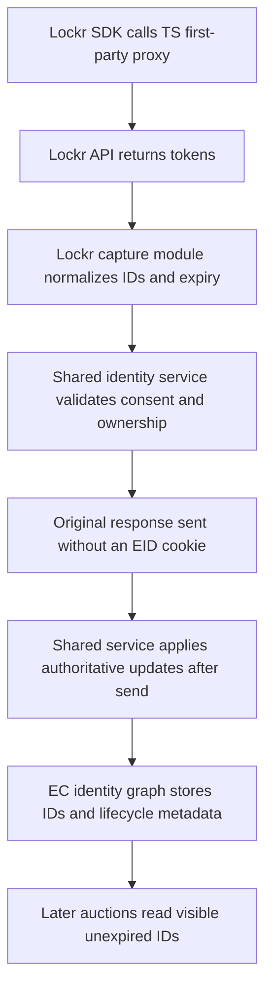

# Proxy-side identity capture for lockr-issued IDs

Status: ID5-only capture implemented in the draft change, awaiting code review.
Provider fixtures, consent approval, revocation semantics and live acceptance
remain gated; rollout configuration explicitly disables capture. Depends on the
[server-side identity foundation](2026-10-09-server-side-identity-foundation-design.md).
See the [implementation plan and verification](../plans/2026-10-09-server-side-identity-foundation-and-lockr.md).

Issue: [#1246](https://github.com/IABTechLab/trusted-server/issues/1246).

The foundation owns capability registration, common identity outcomes, source
ownership, lifecycle records, consent/mutation policy and adapter execution.
It also owns auction-body ingestion and retirement of `ts-eids` and the EID
diagnostic headers. This spec defines Lockr's capture behavior using those
contracts; it does not introduce a separate identity service or KV writer.

Related: [KV EID request snapshot and EC recovery](2026-07-10-kv-eid-request-snapshot-ec-recovery-design.md)
defines existing snapshot and root safety rules retained by the foundation.

## 1. Purpose and agreed direction

The lockr SDK obtains partner IDs, ID5 today and other providers by
configuration, and hands them to Prebid through
`pbjs.setConfig({ortb2: {user: {ext: {eids}}}})`. Trusted Server collects auction
EIDs from `pbjs.getUserIdsAsEids()`, which only reports the Prebid User ID
module. The lockr IDs therefore reach client-side bidders but do not reach the
server-side auction or the EC identity graph. This was measured on the
production publisher route on 2026-10-06 in Safari and reconfirmed on
2026-10-08 in Chrome, direct versus TS matched arm. Six captured `/auction`
payloads contained no `id5-sync.com` entry while the same page carried the ID
in `ortb2.user.ext.eids`.

Capture those IDs in the first-party proxy response from lockr's API. Submit
common identity outcomes to the shared service, which persists them under the
visitor's existing EC ID after sending the response on Fastly.

The lockr SDK still runs in the browser. Capture does not depend on Prebid
configuration or the TS JavaScript EID collector. There is no `ts-eids-s` or
replacement EID cookie. `ts-ec` remains the browser's identity pointer.

Delayed availability is accepted: a later auction sees an ID only after the
deferred write completes and its KV read can see the record. The first auction
may miss it. There is no cookie fallback or durable capture retry queue.

## 2. Observed lockr flow

All lockr API traffic on a TS page goes through `/integrations/lockr/api/*`,
proxied by `handle_api_proxy` in
`crates/trusted-server-core/src/integrations/lockr.rs` to
`https://identity.loc.kr`. The trust-server SDK build hard-codes
`host: "/integrations/lockr/api"`, so no client shim is involved in routing.

Measured call sequence after the publisher's consent gate opens:

| Order | Request                                                                 | Carries                                                                                                                            |
| ----- | ----------------------------------------------------------------------- | ---------------------------------------------------------------------------------------------------------------------------------- |
| 1     | `GET /integrations/lockr/sdk`                                           | SDK body, 118,542 bytes                                                                                                            |
| 2     | `POST .../publisher/app/v2/identityLockr/settings`                      | Request `{appID}`; response publisher settings                                                                                     |
| 3     | `POST .../publisher/app/v2/identityLockr/page-view`                     | Request `LTID`, existing provider tokens, consent strings and page context; first-issue response `aimTokens[]` and `ids.<key>.eid` |
| 4     | `POST .../refresh-tokens`, `.../generate-tokens`, `.../sync-no-hem-ids` | Later token updates                                                                                                                |
| 5     | `POST .../revoke-consent`                                               | `LTID` and `optOutReason`                                                                                                          |

Measured `page-view` response on first issue, with identifier values elided:

```json
{
  "success": true,
  "data": true,
  "pvStatus": true,
  "aimTokens": [
    {
      "advertising_token": "%7B%22universal_uid%22%3A%22ID5*...%22%7D",
      "identity_expires": 1791315739717,
      "key_name": "id5id",
      "settings": { "dropCookie": false, "dropLocalStorage": false }
    }
  ],
  "ids": {
    "id5id": {
      "eid": {
        "source": "id5-sync.com",
        "uids": [
          {
            "id": "ID5*...",
            "atype": 1,
            "ext": { "linkType": 1, "pba": "..." }
          }
        ]
      }
    }
  }
}
```

The response is 603 bytes. The SDK writes provider cookie and localStorage
`id5id`, and exposes the EID to Prebid with `inserter: "Lockr-For-Publishers"`,
`matcher: ""`, `mm: 2`. Those provider-owned browser stores are not removed.

The integration XHR carries `ts-ec` and publisher consent cookies to TS. The
proxy does not forward publisher cookies or authorization to lockr. Its body
carries lockr's own consent strings. The route already builds an `EcContext`
and attaches `EcFinalizeState`; Fastly already has post-send execution.

Today the upstream response body is not inspected. `/auction` body EIDs are
used for that auction, while cookie EIDs are persisted by finalization. The
foundation changes the latter contract to direct auction-body ingestion before
retiring the cookie path.

## 3. Requirements and non-goals

1. Capture lockr-issued IDs without requiring the Prebid User ID module or
   a TS browser capture module.
2. Implement the foundation's optional capture capability only. Lockr has no
   active server-side resolver in this delivery.
3. Return original proxy responses intact, with no added EID cookie and no
   Fastly KV enrichment write before send.
4. Submit authoritative `Issued` outcomes for owned, registered sources;
   subsequent SDK token responses use the same path.
5. Preserve known provider expiry through the foundation's lifecycle record.
   Suppress expired IDs on later auctions without a hot-path cleanup write.
6. Translate explicit consent revocation separately from token acquisition,
   including when current request consent no longer allows identity use.
7. Retain consent, size, UID, root and tombstone safety requirements from the
   foundation. A failed capture must not break the SDK call.

Out of scope: server-to-server calls to lockr, identifier intake, cross-browser
linking, changing Prebid provider discovery, direct ID5 or LiveRamp proxies,
OpenRTB provenance/provider `ext` storage, and client-side delivery of KV IDs.

## 4. Capture implementation

### 4.1 Registration and response handling

Register `LockrIntegration` through `.with_identity_capture()` alongside its
existing proxy and attribute rewriter. Its identity descriptor claims the
confirmed source mappings in section 4.2. It registers no resolver capability.
`capture_identity = false` disables observation while preserving the descriptor
needed to validate configured source ownership.

The capture paths are exact POST paths relative to `/integrations/lockr/api`:

- `/publisher/app/v2/identityLockr/page-view`
- `/publisher/app/v2/identityLockr/generate-tokens`
- `/publisher/app/v2/identityLockr/refresh-tokens`
- `/publisher/app/v2/identityLockr/sync-no-hem-ids`
- `/publisher/app/v2/identityLockr/revoke-consent`

The foundation handles bounded inspection and response preservation. Apply its
independent 64 KiB original-body and 64 KiB decoded-JSON limits. Compressed
responses must be decoded incrementally; overflow, unsupported encoding or
decode failure skips capture and forwards original bytes and headers unchanged.
The SDK and unlisted API paths retain existing handling.

Extract request-body consent signals from the POST bytes already buffered for
forwarding. Supply them to the shared service without consuming the request
again or modifying the forwarded payload. The integration does not write KV,
set identity cookies or run its own background dispatch.

### 4.2 Token normalization

For token endpoints, read `aimTokens[]` and associated
`ids.<key_name>.eid`. Prefer the EID's source and UID, validating the source
against the mapping for that known key. When only `aimTokens[]` is present,
map `key_name` using the SDK's `tokenMappings` and `tokenSourceMappings`:

| `key_name`                 | `source`                    | Expected `atype` |
| -------------------------- | --------------------------- | ---------------- |
| `id5id`                    | `id5-sync.com`              | 1                |
| `_lr_env`                  | `liveramp.com`              | 3                |
| `__uid2_advertising_token` | `uidapi.com`                | 3                |
| `__euid_advertising_token` | `euid.eu`                   | 3                |
| `firstid`                  | `first-id.fr`               | 1                |
| `connectId`                | `yahooinc.com`              | 3                |
| `panoramaId`               | `panorama.com`, unconfirmed | 1                |
| `cto_bidid`                | `criteo.com`                | 3                |
| `_publink`                 | `epsilon.com`               | 3                |

Do not enable the unconfirmed Panorama mapping until lockr confirms the source
and type. Unknown keys and mismatched sources are dropped with redacted debug
logging. An arbitrary EID source cannot expand Lockr's registered claims.

For ID5, decode the URL-encoded JSON `advertising_token` and extract
`universal_uid`. Submit one valid UID per source using the existing non-empty,
512-byte UID limit. Source and aggregate caps are enforced by the foundation.
Decode all supported provider token shapes using sanitized SDK/response
fixtures before enabling their mappings; the ID5 shape alone is not evidence
that every provider uses the same token encoding.

Convert associated `identity_expires` from milliseconds to Unix seconds and
include it in `Issued`. Drop a token already expired at capture time. The
foundation stores known expiry and filters expired values on every later
auction path. Missing expiry remains unknown; it does not erase a known expiry
for the same UID.

Unlike the earlier standalone draft, expiry is not discarded after parsing.
This depends on the foundation's metadata-compatible storage rollout, not a
Lockr-specific KV schema or timer. Lockr does not actively refresh records:
new expiry or replacement tokens arrive through later SDK responses.

A response with valid tokens produces `Issued`; a valid response with no new
tokens produces `NoChange`. Non-2xx or malformed token responses skip capture.
Neither an empty token response nor a fetch failure invalidates stored IDs.

### 4.3 Consent and ownership

The shared service requires allowed EC consent, a valid existing `ts-ec`,
a registered source owned by `lockr`, and a live consenting root at mutation.
Integration XHRs never generate or recover an identity.

Lockr supplies its request-body `gppString`, `consentString` and `ccpaString`
when populated. Empty optional fields are absent signals, not positive consent.
Malformed non-empty signals fail closed; valid opt-outs cannot be overridden
by allowed cookie consent. The shared consent layer interprets these signals,
not a second Lockr-specific consent engine. Confirm any additional broker or
provider-purpose requirements before enabling the relevant mappings.

Failed token gating leaves the response intact and queues no enrichment.
Browser submissions of the same source remain conservative foundation inputs;
they cannot choose the `lockr` writer identity or replace a stored owned record.

### 4.4 Explicit withdrawal

The current provider contract assumes a successful 2xx `revoke-consent` response
means explicit publisher-level identity withdrawal. Translate it into the
foundation's `ConsentWithdrawn` outcome with global EC scope. Confirm both the
application-success semantics and the scope with lockr before rollout; a
provider-specific opt-out must not be widened into a global withdrawal.

This outcome does not pass through token-consent eligibility: revocation must
still work after consent becomes denied. The shared finalizer expires `ts-ec`
and the service applies the existing-key-only tombstone path. Normal request
withdrawal takes precedence and suppresses duplicate work. Lockr never clears
or recreates a root independently.

### 4.5 Shared persistence and auction delivery

The shared service stages trusted capture effects with the full EC ID and
snapshot. Fastly extracts them before response conversion, sends the response,
then applies them before legacy pull sync. Lockr has no private
`DeferredIdentityUpdates` type, adapter branch or mutation function.

The service applies authoritative replacement for the configured owner,
preserving unrelated sources and rejecting withdrawn roots. Same UID and same
lifecycle metadata skip writes; a changed known expiry can require a write even
if the UID is unchanged. Pass the resulting persisted snapshot to later work.

Integration requests can carry a `NotRead` snapshot. The first required lookup
then happens after send; generation refresh or CAS conflict can add reads.
Persistence is best-effort and costs execution time without holding Fastly
response bytes. Other adapters follow the foundation's supported timing and
KV capability rules.

Auctions resolve usable registered records from KV, deriving `atype` from the
source registry. Set the registry type to the confirmed mapping. Do not stamp
`Lockr-For-Publishers` onto every KV ID for a source: another input may have
populated it. Provider `ext`, extra UIDs and OpenRTB provenance remain absent
from later KV-only auctions, as defined by the foundation.

## 5. Data flow and freshness



| Event                           | Persistence                                       | Auction availability                                                           |
| ------------------------------- | ------------------------------------------------- | ------------------------------------------------------------------------------ |
| First issue                     | Authoritative update after send                   | Once a later KV read sees the record                                           |
| SDK refresh                     | Replacement or expiry update after send           | Once new state is visible                                                      |
| Provider expiry                 | Stored record becomes unusable; no timer required | Omitted when request time reaches known expiry                                 |
| Explicit global revoke          | EC cookie expired; existing-key-only tombstone    | Later requests stop using the identity; dispatched auctions cannot be recalled |
| Returning visitor, no new token | No capture mutation                               | Existing usable KV state only                                                  |

Inspection can retain 64 KiB of original bytes and 64 KiB of decoded JSON, plus
bounded stream/decoder overhead. There are no additional TS EID cookie bytes
on later requests.

There is no cookie-based repair of a failed capture write. A later token-bearing
SDK response, browser-body submission or separately authorized partner path can
attempt persistence again under the foundation's writer rules. A returning
`page-view` with no token does not repair a missed capture. Expiry-aware omission
also does not initiate a Lockr fetch. These limits and delayed KV visibility are
accepted for this draft.

## 6. Configuration

Add `capture_identity` under `[integrations.lockr]`, default `true`, as the
publisher capture kill switch. It does not disable browser-body ingestion,
expiry-aware reads or normal EC consent withdrawal.

Capturing a source requires its foundation source policy, for example:

```toml
[[ec.partners]]
name = "ID5"
source_domain = "id5-sync.com"
openrtb_atype = 1
bidstream_enabled = true
identity_owner = "lockr"
```

`identity_owner` is a proposed foundation field, not an existing runtime option.
Check the publisher registry and disable conflicting legacy authoritative paths
before enabling the owner. Missing registration or another selected owner means
Lockr does not persist the source. There is no cookie to forward an unregistered
captured ID. Valid browser-body EIDs can still reach their current auction under
the foundation's existing forwarding rules.

## 7. Error handling

Use the foundation's redaction, bounds and root safety policy:

- Non-2xx, malformed JSON, unknown key, mismatched source or invalid token:
  preserve the response, drop the affected acquisition, no raw-token log.
- Original or decoded size overflow, unsupported encoding or decode failure:
  skip capture and replay the original response unchanged.
- Denied token consent, missing EC, missing registration or owner mismatch:
  no enrichment; the SDK call still succeeds independently.
- Missing, unreadable or withdrawn root: no creation or resurrection.
- Post-send persistence failure: redacted log; no immediate retry, durable
  queue or change to the already-sent response.
- No tokens: `NoChange`, not invalidation or consent withdrawal.

## 8. Verification

Foundation tests own shared registration, browser migration, metadata
compatibility, buffering limits, mutation rules and adapter timing. Lockr tests
prove that this consumer reaches those paths correctly:

- Exact POST path selection; SDK, settings and unlisted paths unchanged.
- `aimTokens` only, associated `ids.*.eid`, URL-encoded ID5 JSON, each enabled
  provider token shape, unknown keys, mismatched sources and oversized UIDs.
- Millisecond expiry conversion, already-expired rejection, missing expiry and
  same-UID expiry extension; known expiry survives the persisted record.
- Original and decoded cap overflow, including compressed expansion, skips
  Lockr effects while retaining response bytes and encoding headers.
- No-token response produces no token mutation; non-2xx/malformed token
  response cannot invalidate existing records.
- Populated body opt-outs, malformed signals, empty optional fields and cookie
  consent conflicts exercise shared consent policy without modifying forwarding.
- Explicit revoke works with denied consent, chooses the confirmed withdrawal
  scope and does not duplicate request-finalization tombstones.
- Owned/registered sources persist; unregistered or differently owned sources
  do not; browser input cannot impersonate Lockr authority.
- Capture effects execute after Fastly send through the foundation, not a
  separate Lockr adapter implementation; persisted snapshot handoff is retained.
- No newly emitted TS EID cookie or diagnostic EID header; provider browser
  stores and existing publisher credential stripping remain unchanged.

Live acceptance on an approved publisher test route:

1. Fresh profile, grant consent and wait for `page-view`.
2. Confirm original response bytes and no TS EID cookie from capture.
3. Allow for post-send work and KV visibility. Inspect the session's admin EC
   record for the registered source and lifecycle metadata, without exporting IDs.
4. Trigger a later auction and inspect bidder-facing payload evidence. Do not
   require the browser body to contain a server-added ID or rely on `x-ts-eids`.
5. Reload with no new tokens: unchanged UID and expiry do not cause a write.
6. Trigger SDK refresh: confirm changed UID or expiry persists after visibility.
7. Exercise known expiry in a controlled fixture and confirm omission, including
   a stale matching UID resubmitted in a browser auction body.
8. Trigger confirmed global revoke: EC cookie expires, tombstone exists and
   later enrichment cannot revive it.

No live identifiers, placement settings or credentials belong in fixtures or
committed validation notes. Keep sanitized status/source/count evidence only.

## 9. Rollout

1. Deliver the foundation, including metadata-preserving writers/readers,
   source ownership, browser-body migration and EID cookie/header retirement.
2. Confirm Lockr path, provider token shapes, consent and revoke contracts using
   sanitized fixtures; leave unconfirmed source mappings disabled.
3. Register the capture consumer and its `capture_identity` kill switch.
4. Configure the affected registered sources with `identity_owner = "lockr"`
   and their confirmed `atype`, after resolving conflicting authoritative paths.
5. Complete the foundation's deployment compatibility gate before activation.
6. Enable capture on an approved test route and run live acceptance, including
   visibility delay, expiry extension and withdrawal.

Disabling capture stops new observations; it does not make already stored
expiry metadata safe for an older UID-only binary. Follow the foundation's
rollback contract. No `ts-eids-s` is introduced at any stage.

## 10. Open questions and future work

1. Confirm the Panorama source/type and all enabled provider token shapes with
   lockr. Do not infer them solely from the measured ID5 example.
2. Confirm request-body consent details and any additional broker/provider
   permission requirements.
3. Confirm successful revoke response semantics and whether withdrawal is
   global or source-specific before enabling that outcome.
4. Confirm token ordering when SDK requests overlap. The foundation does not
   infer provider issuance order from edge wall clocks.

Known expiry persistence is now a proposed foundation decision rather than an
unimplemented Lockr-local open question. OpenRTB provenance storage remains
outside this delivery. Active Lockr resolution from `ltid`, direct provider
capture and client-side consumers require separate follow-up specs; no current
S2S contract is assumed.
