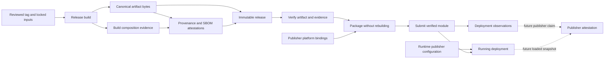

# Release binary attestation and publisher attestation foundations

**Issue:** [#1235 — Publish attested release binaries with build provenance and SBOMs](https://github.com/IABTechLab/trusted-server/issues/1235)

**Date:** 2026-10-09

**Status:** Draft for maintainer review. Implementation requires approval and merge of this specification in its own PR.

**Source baseline:** `da31a215e62a8201610de367ee06d572708952df`.

**Related work:** [#161](https://github.com/IABTechLab/trusted-server/issues/161), [#167](https://github.com/IABTechLab/trusted-server/pull/167), [#799](https://github.com/IABTechLab/trusted-server/pull/799), [#1045](https://github.com/IABTechLab/trusted-server/pull/1045), and [#1084](https://github.com/IABTechLab/trusted-server/pull/1084).

## Problem

Publishers and vendors need to verify that a distributed Trusted Server binary was built from the reviewed repository source. Current CI builds binaries for validation but publishes no attested release distribution. Operators build their own wasm, and `ts deploy` delegates to deployment paths that can build again before uploading.

A signature on a release artifact is useful only when the deployment path preserves the artifact identity being verified. Fastly packaging also matters: `compute publish` builds before deployment, and `compute build` can annotate the wasm after Cargo produces it. Attesting one file and uploading a transformed file breaks the connection to the original attestation.

Project attestation will eventually include publisher identity, configuration, deployment, runtime claims, and possibly vendor endorsements. Binary provenance must provide a stable subject for those claims without treating them as equivalent or choosing their future wire format prematurely.

This design establishes a canonical release artifact per version, target, and approved build variant; provenance and SBOM evidence for those bytes; and a deployment path that consumes verified bytes. It defines the minimal interfaces that later publisher attestation can reference.

## Goals

1. Publish the first Fastly wasm and Linux/macOS `ts` executables through an immutable GitHub Release.
2. Generate and verify SLSA build provenance and an artifact-specific SBOM attestation for every executable artifact.
3. Require fresh locked Rust and JS builds with an explicit compile-time input inventory.
4. Prevent publisher configuration, secrets, resource bindings, and publisher-specific permission policy from affecting release binary bytes.
5. Deploy an attested Fastly artifact without compiling or modifying its wasm, for both production and staging.
6. Provide exact online and offline verification procedures with a constrained signer, source ref, and source revision.
7. Make immutable build facts available to future #161 work, while keeping the final binary digest external.
8. Keep artifact identity, publisher identity, configuration identity, deployment observations, and runtime evidence distinct.
9. Preserve existing logical-store mapping and staged configuration isolation, with exact deployment outcomes usable by the separate health-check and rollback lifecycle commands.
10. Require byte-identical clean rebuilds of all initial executable artifacts, publish replayable recipes and inputs, and support operator reconstruction against the authenticated release digest.

## Non-goals

- Runtime attestation endpoints, per-request claims, remote execution proof, and freshness/replay protocols. These belong to #161.
- Publisher enrollment, domain ownership verification, a publisher trust registry, or selection of DSSE/JWT for publisher claims.
- Signing or attesting `trusted-server.toml`, computing a new public configuration hash, or exposing resolved settings.
- Resolving permission-policy distribution or authorization semantics. The permission specification owns these decisions; this specification supplies a compatibility requirement.
- Vendor endorsement protocols or CODEOWNERS changes.
- Signatures or the final artifact checksum embedded in a wasm custom section.
- Requiring an external rebuild witness as a release prerequisite, or claiming that two project-controlled builds establish independent builder trust.
- Cloudflare, Spin, Axum, containers, Windows, Linux ARM64, universal macOS binaries, or standalone tsjs release distributions.
- Attesting the publisher-selected external Prebid.js bundle.
- Making all CLI commands self-contained without their documented external tools or repository resources.
- Apple Developer ID signing/notarization or automatic installer/self-update infrastructure.

## Decisions

| Question                    | Decision                                                                                                                                              |
| --------------------------- | ----------------------------------------------------------------------------------------------------------------------------------------------------- |
| First executable artifacts  | Fastly `wasm32-wasip1`; CLI `x86_64-unknown-linux-gnu`, `aarch64-apple-darwin`, and `x86_64-apple-darwin`                                             |
| Fastly build variant        | Existing production defaults; `reusable-sandbox` and test features are off                                                                            |
| Deployment strategy         | Both reproducible executable production and verified artifact deployment; downloading verified release bytes remains the default operator route       |
| Reproducibility gate        | Two clean builds per initial target must match the entire distributed executable; missing results or mismatches block the complete release            |
| Integrated operator flow    | Add an artifact deployment path to `ts deploy` through an additive EdgeZero interface; retain a documented native Fastly packing route during rollout |
| SBOM                        | SPDX 2.3 JSON generated by pinned Syft plus a repository-owned composition step using the actual Cargo build graph and JS bundle evidence             |
| SBOM distribution           | One SBOM per executable, published as a release asset and embedded as that executable's SBOM attestation predicate                                    |
| Release trigger             | Protected `v*` tag push, followed by strict stable/prerelease SemVer validation; no arbitrary-ref manual publishing                                   |
| Workflow boundary           | `.github/workflows/release.yml` calls `.github/workflows/release-build.yml`; the reusable workflow builds and signs                                   |
| SLSA claim                  | Initially Build Level 2; using a reusable workflow does not by itself justify a Level 3 claim                                                         |
| Signing mechanism           | GitHub `actions/attest` v4, pinned by full commit SHA; GitHub OIDC and public-good Sigstore                                                           |
| Verification implementation | Reuse the GitHub CLI's verifier through a checked subprocess interface; do not implement a second Sigstore verifier in Rust                           |
| Artifact identity           | SHA-256 of the final distributed file, with exact target and build variant recorded separately                                                        |
| Runtime build facts         | Release version, package version, source commit, target, and build variant; no self-computed wasm checksum                                            |
| Publisher groundwork        | A verified artifact input, structured deployment observations, and documented identity boundaries; no publisher claim implementation                  |

## Current behavior and affected surfaces

The baseline has two repository-owned build scripts: core and JS. EdgeZero is pinned to `683202c66948146ec360f490126f1d60f920288b`; its CLI build script generates adapter registrations from its manifest and Cargo features. It does not embed publisher settings. Trusted Server does not currently use EdgeZero's manifest-embedding `app!` macro.

| Surface                                            | Baseline behavior                                                                                | Design consequence                                                                                 |
| -------------------------------------------------- | ------------------------------------------------------------------------------------------------ | -------------------------------------------------------------------------------------------------- |
| `crates/trusted-server-cli/src/run.rs`             | Delegates build, deploy, and typed config push to EdgeZero                                       | Artifact deployment must extend the owning interface rather than wrap an unconditional build       |
| `edgezero.toml`                                    | Fastly production deploy selects `fastly compute publish`                                        | Verified artifact deployment bypasses source-build manifest commands                               |
| EdgeZero Fastly staging                            | Builds, clones/updates a service version, redirects its configuration selector, and stages it    | Verification must precede the first provider write; staging must accept a prebuilt package         |
| `crates/trusted-server-core/src/config_payload.rs` | Verifies a blob envelope, resolves secrets, and returns validated `Settings`                     | Existing configuration separation is retained                                                      |
| `crates/trusted-server-core/build.rs`              | Extracts the default logical config-store ID and hashes core inputs into `TEMPLATE_BUILD_DIGEST` | Release builds use the repository manifest unchanged; the template digest is not artifact identity |
| `crates/trusted-server-js/build.rs`                | Builds and embeds discovered `tsjs-*.js`, with several fallback paths                            | A strict release mode must reject fallback and incomplete module inventories                       |
| `crates/trusted-server-js/lib/build-all.mjs`       | Vite/Rollup IIFEs, esbuild minification, cleaned `dist`                                          | Capture package contribution evidence from the actual bundle build                                 |
| `crates/trusted-server-cli/src/prebid_bundle.rs`   | Locates JS resources in a repository and has a compiled checkout-path fallback                   | CLI distribution must document source-resource dependencies and record this compile-time input     |
| `.github/workflows/test.yml`                       | Builds/tests adapters and native CLI without release publication                                 | Add a dedicated release workflow; do not turn ordinary PR CI into a signing authority              |
| `crates/trusted-server-core/src/request_signing/`  | Deployment Ed25519 keys, JWKS discovery, request signatures                                      | These keys and signatures remain separate from release provenance                                  |

## Design

### 1. Trust claims and assurance boundary

| Claim              | Subject and authority                                                          | What it does not establish                                                                   |
| ------------------ | ------------------------------------------------------------------------------ | -------------------------------------------------------------------------------------------- |
| Build provenance   | Exact artifact digest; trusted GitHub workflow identity                        | Publisher identity, approved configuration, or live execution                                |
| Release membership | Tag, source commit, and release assets; GitHub immutable release attestation   | Build correctness or acceptable software behavior                                            |
| Publisher identity | Publisher/domain/key relationship; a future externally trusted identity policy | Which artifact is deployed                                                                   |
| Deployment binding | Artifact, service/version, environment, and observed deployment result         | Independent proof of which bytes execute at an edge location                                 |
| Runtime claims     | Loaded instance/configuration/request snapshot; future #161 policy             | Truth against an operator controlling both code and signing keys without additional evidence |
| Vendor endorsement | Defined code/configuration/policy scope; vendor authority                      | Approval of unrelated scope or publisher authorization                                       |

A publisher can run altered code that reports an official artifact digest and signs that statement with a legitimate deployment key. The official binary provenance and that publisher signature can both verify. This design therefore promises provenance of distributed bytes and preservation of submitted bytes, not remote execution attestation.

Consumers continue to trust the reviewed source, the chosen build workflow, GitHub's identity assertions, and the applicable Sigstore trust roots. Provenance does not establish absence of vulnerabilities or correctness of an SBOM. Release integrity does not prevent an authorized future release from containing different software.

The release evidence uses established supply-chain standards: SLSA build provenance through GitHub/Sigstore and SPDX 2.3 for the SBOM. The release index, build-composition adapter, CLI policy, and local deployment receipt are project-specific contracts. Their use does not establish certification or a standardized publisher-attestation protocol. SLSA Build Level 2 is an implementation target to validate against the platform and producer requirements, not a rating achieved by this document.

The separation of evidence, authority, verification policy, and a consumer's authorization decision is also consistent with the IETF RATS architecture. RATS is an architectural reference for future runtime work; this design implements neither a RATS protocol nor hardware-backed remote attestation.



### 2. No configuration in release binaries

**Requirement: no configuration may be compiled into the release binary. Anything that varies by deployment must enter through runtime app configuration or platform stores/bindings.**

This prohibits publisher domains, service/account IDs, physical store names, customer-specific integration selection, secrets, configuration revisions, and deployment-specific permission policy as build inputs. A canonical artifact includes the repository's registered integrations; configuration selects their runtime behavior. Operators do not produce reduced publisher-specific binaries and call them the canonical release.

The repository's logical store identifiers, product defaults, and the fictional CLI configuration scaffold are source-defined product inputs, not an operator's active configuration. They remain identical for all users of a release artifact. The CLI scaffold is used to create a configuration file, never as an embedded deployment configuration fallback.

The repository copy of `edgezero.toml` is immutable within a release build. Physical resource names and version-linked selectors are configured at deployment time. An operator modifying a local manifest must still deploy verified canonical release bytes, downloaded or reconstructed through the declared recipe; the modified manifest is not supplied to Cargo for that artifact.

The proposed embedded permission policy in #1045/#1084 cannot be adopted as publisher-variable build data. A fixed enforcement implementation may be source code, but variable policy must preserve the separation above. A conflicting permission change blocks publication until its owning specification resolves the conflict. This design does not choose a policy store, policy signature, or policy authority.

### 3. Complete compile-time input contract

Every release records the following input classes in build evidence. New inputs must be added to this inventory in the implementation PR introducing them. An attestation is not a claim that generic GitHub provenance automatically enumerates every transitive input; the supplementary build evidence supplies the details below.

| Input                        | Scope and control                                                                                                                                                                            |
| ---------------------------- | -------------------------------------------------------------------------------------------------------------------------------------------------------------------------------------------- |
| Git source snapshot          | Exact peeled tag commit and tracked bytes of workspace/crate manifests, Rust/TS/JS source, embedded assets, build scripts, and release scripts                                               |
| Cargo resolution             | Root `Cargo.lock`, registry checksums, exact git revisions, resolved package/features, target and host dependency roles                                                                      |
| npm resolution               | JS `package.json` and `package-lock.json`, pinned Node and bundled npm version, installed package versions and integrity metadata                                                            |
| Toolchain configuration      | `rust-toolchain.toml`, `.tool-versions`, `.cargo/config.toml`, Rust compiler/LLVM/sysroot identity, Node/npm identity                                                                        |
| Build recipe                 | Package and binary target, target triple, explicit feature policy, release profile including current `debug = 1`, linker/native compiler settings and any byte transformations               |
| Repository EdgeZero manifest | Entire tracked `edgezero.toml`, default logical configuration ID derived by core, and the manifest digest                                                                                    |
| Core template build digest   | All non-editor regular files under `core/src`, core `build.rs`/`Cargo.toml`, and root `Cargo.toml`/`Cargo.lock`/`edgezero.toml`; normalized relative paths and original bytes                |
| Embedded/generated JS        | Fresh core and discovered integration IIFEs, exact module IDs/digests, and the generated Rust module table copied into `OUT_DIR`                                                             |
| Other embedded assets        | Core GPT bootstrap, CLI browser collector/consent scripts, and the CLI's tracked `trusted-server.example.toml` scaffold                                                                      |
| OpenRTB bindings             | Checked-in generated bindings and their tracked sources; normal releases do not regenerate protobuf or invoke an ambient `protoc`                                                            |
| Dependency-generated code    | Build-script and proc-macro outputs, including EdgeZero CLI adapter registrations derived from its pinned manifest and enabled features                                                      |
| Release build facts          | Validated release version, source commit, target and variant supplied by the release recipe; package version comes from the unchanged Cargo manifest                                         |
| Native build inputs          | Runner image version, SDK/Xcode where applicable, linker, compiler/assembler, build tools, vendored native library metadata, and linked external libraries                                   |
| Paths and environment        | Checkout/build paths, `CARGO_MANIFEST_DIR`, `OUT_DIR`, reviewed compile-trace wrapper, sanitized compiler/native-tool settings, explicit Vite mode, and permitted release environment values |

`TEMPLATE_BUILD_DIGEST` hashes the complete raw manifest and can change after a comment-only manifest edit. It also includes ordinary untracked files under core source. Release builds therefore use a fresh checkout containing only the expected source snapshot and release outputs outside `core/src`. The digest remains a cache compatibility input; it does not cover the complete binary or compiler and must not be advertised as provenance.

The CLI currently embeds `CARGO_MANIFEST_DIR` as a resource-discovery fallback, and debug metadata can contain paths. Official release builds disable that developer checkout fallback while retaining explicit/current-checkout resource discovery and clear diagnostics for repository-dependent commands. Rust path remapping does not rewrite arbitrary strings produced by `env!`. Debug/native paths and SDK inputs are controlled by the reproducibility contract below; recording ambient values alone is insufficient.

Release preflight rejects any presence of `TSJS_SKIP_BUILD` before environment sanitization; silently removing it would hide a prohibited release request. The build script independently enforces the same rule. Reject other prohibited operator build inputs, then construct the permitted build environment rather than inheriting arbitrary compiler/tool overrides. Remove operator `TRUSTED_SERVER__*` and `EDGEZERO__*` values from the actual build environment.

The recipe sets or rejects compiler/tool overrides including `RUSTC`, `RUSTDOC`, `RUSTC_WRAPPER`, `RUSTC_WORKSPACE_WRAPPER`, `RUSTFLAGS`, `CARGO_ENCODED_RUSTFLAGS`, `CARGO_BUILD_RUSTFLAGS`, target-specific Cargo rustflags/linkers, Cargo profile overrides, `NODE_OPTIONS`, and npm/Vite configuration overrides. The only compiler wrapper is the reviewed composition recorder. Control Cargo home/configuration layers and prohibit unreviewed command-line configuration overrides; record the approved settings. Vite release execution explicitly disables environment-file loading and uses the approved production mode. Release scripts validate permitted native compiler settings rather than inheriting operator values. Platform authentication is unavailable to build jobs. This is a controlled release recipe, not a claim of a fully hermetic build.

No wall-clock build timestamp, workflow run ID, publisher identity, or final artifact checksum is embedded. Operational timestamps and run identifiers remain external evidence. Set `SOURCE_DATE_EPOCH` to the peeled source commit's committer timestamp and record it. Audit tools that do not honor this variable; setting it is not a blanket determinism guarantee.

#### Reproducible executable contract

Issue #1235 permits verified release deployment, reproducible local builds, or both in a stated order. This specification selects both. Establish the executable recipes and reproducibility fixtures before release publication, then retain the verified deployment path so operators can use canonical bytes without rebuilding. Nothing in the baseline proves reproducibility yet; the following requirements must be demonstrated during implementation.

Reproducibility means that the specified source, environment and instructions reconstruct the **complete distributed executable bytes**, separately for each target/variant. It does not mean different target binaries match, or that an arbitrary ambient host can run bare Cargo and obtain the same result. The contract covers embedded JS and every final executable transformation, including any required macOS ad-hoc signature. It does not require byte-identical Sigstore bundles/certificates, transparency entries, run timestamps, logs, SBOM generation times, every intermediate, or publisher-specific Fastly archives.

Each artifact has a tracked recipe implementation and a version-1 `<asset>.build-recipe.json` descriptor, authenticated through provenance and the release index. The descriptor contains:

- Repository, peeled commit, release facts, package/bin, target/variant, recipe source revision and script digests.
- Exact Rust/toolchain components, Node/npm and bundler identities; permitted features, complete effective release profile, Cargo source/configuration layers and compiler/linker arguments.
- Locked source/material identities and the authenticated retained-input archive digest, including git dependencies, npm optional packages, native bundler tools and permitted lifecycle inputs.
- Host architecture, byte-affecting platform/toolchain identities, native compiler/linker/archiver/build tools, sysroot or SDK, and required environment bootstrap instructions.
- Build-path/remapping policy, locale/timezone, commit-derived epoch, generic target CPU/code-generation policy, relevant concurrency settings, and every final byte transformation.

Descriptor version and fields are validated against the reviewed recipe; a downloadable descriptor cannot substitute arbitrary commands or tools. Operator replay uses the tracked reproduction script from the approved source revision. Environment and dependency inputs must be retrievable and integrity-verifiable without release-workflow credentials. Missing pins, unavailable required inputs or an unproven target block publication; they are not silently waived. Implementation selects actual tool/SDK/image pins through the reviewed release-tools manifest and proves the complete target matrix before the first tag.

**Environment and dependency reconstruction.** Fastly and Linux CLI builds run in an OCI builder image pinned by manifest digest and explicit `linux/amd64` platform on GitHub-hosted Linux runners. Retain the image and its reviewed bootstrap definition; builder-image construction pins base images and fetched tool/native inputs, rather than resolving floating OS packages. The image is a build environment, not a new Trusted Server container distribution. Document image retrieval/export and digest checking for operator replay.

macOS recipes use native Apple tooling on the matching architecture, with explicit Xcode/CLT build, SDK identity/content digest, OS compatibility requirements, `SDKROOT`, deployment target and native tool identities. Validate required identities before compilation and record the actual runner OS/image. A hosted runner label is a scheduler selection, not an immutable environment pin. Provide a tested bootstrap on a separate compatible Mac; any OS/tool input that affects bytes becomes an explicit checked recipe input. A missing SDK/tool pin fails rather than falling back to whatever Xcode is active. Operators obtain platform SDKs through their supported distribution; this design does not promise SDK redistribution inside a public source archive.

Prepare an authenticated, versioned `release-inputs.tar.zst` containing the exact source snapshot, integrity-checked Cargo vendored sources including locked git dependencies, generated Cargo source-replacement configuration, and per-platform npm input archives/cache needed for fresh installation. Retain platform tool archives/images where distributable; otherwise the descriptor supplies acquisition prerequisites and integrity checks. The input archive is self-contained for project dependencies, not a substitute for the declared OS/SDK environment. Assemble it before compilation with normalized file ordering/metadata and safe extraction rules. It contains source/dependency materials and preparation configuration, never generated final recipe descriptors, rebuild records or executables; the later recipe/index can name its digest without a checksum cycle. Recorded raw vendored-material identities do not replace original Cargo source/revision identities in the SBOM.

Both release builds and operator replay compare the archive's tracked source bytes, file modes and link targets with the approved Git tree independently obtained from the repository. A signed archive naming a commit is insufficient if its contents differ from that commit. Locked dependency archives/revisions are checked independently as well. Preparation may access the network; both clean compile phases use freshly extracted materials, Cargo `--frozen` and fresh `npm ci` with recorded offline options. Enforce network denial for compilation/lifecycle processes as well: Cargo's offline flag alone does not prevent a dependency build script from fetching additional inputs. Unexpected fetches fail and require a reviewed input/recipe correction.

**Path, time and native output control.** Use canonical internal source/dependency/output/toolchain paths and tested Rust remappings covering relative and absolute paths, plus native compiler/debug prefix mappings where applicable. Preserve the declared `debug = 1` profile; any stripping is a pinned final transformation shared by CI and local replay. Normalize source/material mtimes using the recorded epoch where tools consume them, fix locale/timezone and reject host-specific CPU auto-tuning. Vary external checkout locations while keeping declared internal paths canonical; do not claim unrestricted internal-path independence without testing it.

Linux selects a deterministic content-derived linker build-ID policy. macOS controls linker OSO debug paths and modification times, validates the selected linker's reproducible mode/epoch behavior, and preserves a tested content-derived UUID policy. Do not introduce random UUIDs or indiscriminately disable UUID generation. Any required linker ad-hoc signing has recorded deterministic settings and is included in the final comparison; removing a signature only for comparison is forbidden. Developer ID signing, trusted timestamps, notarization and stapling remain outside the first distribution. Rust remapping alone does not normalize native linker output or arbitrary generated source.

**Release gate.** For every one of the four initial targets, Build A and Build B execute the complete recipe in separate fresh hosted jobs. Each verifies/materializes its own source and dependencies, owns new Cargo/npm/JS output directories, and consumes no executable, compiled cache, generated JS or generated code from the other build. They use the same checked recipe/environment inputs. The trusted collection job checks current-run artifact identities, source/recipe/environment consistency, embedded JS/module digests, final sizes and SHA-256 values, then byte-compares the two complete executables. No normalization or excluded byte regions are allowed at comparison time. A missing result, environment mismatch, input mutation or unequal bytes stops signing/publication of the complete release.

After successful comparison, choose Build A's executable as the canonical asset and attest it with its SBOM, build evidence, recipe and `<asset>.rebuild-check.json` as explicit provenance subjects. The version-1 rebuild record binds the source, recipe/input digests, observed environments, both build-job/artifact identities, both final lengths/digests, module inventory and comparison outcome. Workflow topology and current-run artifacts establish that the jobs were separate; an arbitrary predicate field asserting independence is insufficient. These project-controlled executions establish measured recipe repeatability. They do not establish independent witness trust, prevent a compromised common compiler from producing the same malicious output, or imply SLSA Build Level 3.

**Operator replay.** Verify the release/index, executable, recipe and input identities before executing the recipe. The tracked `scripts/release/reproduce.sh` validates the approved descriptor, bootstraps/checks its target environment, extracts only authenticated inputs into a fresh workspace, builds without compilation network access and emits the final executable. It never downloads Build A's executable as a build input. A proposed invocation after obtaining the approved source is:

```sh
./scripts/release/reproduce.sh \
  --recipe ./release-evidence/trusted-server-fastly.wasm.build-recipe.json \
  --inputs ./release-inputs.tar.zst \
  --source-commit '<reviewed-40-character-commit>' \
  --output-dir ./rebuild-output

cmp ./release-evidence/trusted-server-fastly.wasm \
  ./rebuild-output/trusted-server-fastly.wasm
```

This script is new implementation work. The same interface supports each named native CLI asset under its declared platform recipe. A matching locally reconstructed wasm can use the existing `--release --artifact` verification path: its digest is the attested release subject, so ordinary online/offline provenance, SBOM and publication checks still apply. Matching bytes do not create new GitHub provenance, and successful compilation without digest equality is not verification. A mismatch reports failure and preserves diagnostic output; pinned `diffoscope` or equivalent format-aware diagnostics may explain it but cannot convert it into success.

### 4. Artifact matrix and distribution

| Asset name                    | Cargo package and target                         | Hosted runner    | Compatibility                                                                    |
| ----------------------------- | ------------------------------------------------ | ---------------- | -------------------------------------------------------------------------------- |
| `trusted-server-fastly.wasm`  | `trusted-server-adapter-fastly`, `wasm32-wasip1` | `ubuntu-24.04`   | Fastly production default feature set                                            |
| `ts-x86_64-unknown-linux-gnu` | `trusted-server-cli`, `x86_64-unknown-linux-gnu` | `ubuntu-24.04`   | Initial Linux baseline: Ubuntu 24.04; record actual dynamic library requirements |
| `ts-aarch64-apple-darwin`     | `trusted-server-cli`, `aarch64-apple-darwin`     | `macos-15`       | macOS 15 ARM64; explicit deployment target 15.0                                  |
| `ts-x86_64-apple-darwin`      | `trusted-server-cli`, `x86_64-apple-darwin`      | `macos-15-intel` | macOS 15 Intel; explicit deployment target 15.0                                  |

Runner labels fix an OS generation, not an immutable VM image. Capture the actual image/toolchain versions and perform executable startup checks on each selected runner. Inspect native linkage and loader paths on Linux/macOS. Validate the Linux CLI's version/help/config-init commands outside a checkout in a clean Ubuntu 24.04 runtime with only its documented runtime dependencies installed; a provisioned build runner alone does not establish that compatibility. Reject dependencies on absolute runner-only paths or undeclared libraries. Changes to compatibility require a reviewed recipe change. Linux portability to older glibc, ARM Linux, and older macOS is not implied.

Use explicit Cargo packages/targets with `--release --frozen` after the authenticated input-preparation step; this includes locked resolution. Fastly does not enable `reusable-sandbox`; production build commands do not use `--all-features`. CLI uses its existing default feature graph, including EdgeZero's default adapter registrations. Do not remove dependencies merely because they appear unrelated at the workspace level.

Ship raw executables to avoid an archive/extracted-executable identity ambiguity. Downloads may need their executable permission restored after verification. Any linker signing, stripping, or other transformation happens before checksums and attestation. No operation may modify an attested executable afterward.

Each executable has named companions:

- `<asset>.spdx.json` — its artifact-specific SBOM.
- `<asset>.provenance.sigstore.json` — the generated build-provenance bundle.
- `<asset>.sbom.sigstore.json` — the generated SBOM attestation bundle.
- `<asset>.build-evidence.json` — selected build inputs, composition roles, and embedded module inventory.
- `<asset>.build-recipe.json` — the authenticated versioned recipe and reconstruction inputs.
- `<asset>.rebuild-check.json` — observed clean-build identities and exact executable comparison.

Release-wide assets are `release-index.json`, `release-index.provenance.sigstore.json`, `release-inputs.tar.zst`, and `SHA256SUMS`. The index records the input archive's name/size/digest; its provenance also names that archive as a subject. The checksum file covers every other published asset and never itself. The release index excludes its own digest and its own attestation bundle; its signed identity is external, so there is no checksum cycle.

The release index is a versioned distribution index, not a publisher-attestation schema. Version 1 records repository, tag, source commit, recipe revision, and an exact artifact list. Each artifact entry records name, byte length, SHA-256, package, target, variant, compatibility baseline, and companion asset names/digests. Consumers reject duplicate names, unknown required schema versions, traversal paths, and conflicting identities.

Each artifact's provenance covers its binary, SBOM file, build-evidence file, recipe and rebuild-check file as explicit subjects after the dual-build gate passes. The separate SBOM invocation covers the binary as subject and the SPDX document as predicate. The release index and input archive receive provenance after the matrix artifacts and bundles are collected. Index assembly verifies that all entries came from the expected source/ref and complete matrix.

`ts --version` identifies the release version and source revision. The existing Cargo package version is retained separately; the release process does not edit `Cargo.toml` to make an existing workspace version equal the tag.

CLI help and `ts config init` must work outside a checkout. Repository-dependent developer commands and `ts prebid client` keep documented prerequisites; missing source resources return a clear diagnostic rather than implying that the release binary includes those resources. The release does not introduce an installer for them.

### 5. Strict JS and clean build execution

Introduce a tracked `TSJS_RELEASE_BUILD=1` mode for the Cargo JS build script. It is a release policy switch, not a mechanism to embed publisher settings. Preserve the documented local fallback mode outside release execution.

Strict mode:

1. Rejects the presence of `TSJS_SKIP_BUILD`, including an empty value or `0`.
2. Requires the JS manifest, lockfile, pinned Node/npm, and build entry points.
3. Runs `npm ci` with build dependencies included even if `node_modules` already exists; any invocation or installation failure stops the build.
4. Deletes old JS output and builds bundles during each clean Cargo build that embeds them.
5. Requires exactly core plus the sorted integration entry points discovered from tracked source. Missing, empty, duplicate, or unexpected `tsjs-*.js` output is an error.
6. Produces bundle composition evidence during that build and checks each bundle's recorded digest against the bytes copied into `OUT_DIR`.
7. Checks the exit status of explicitly requested JS tests. Release validation also runs JS tests as an independent blocking step.
8. Tracks the strict flag, skip/test flags, selected tools, recipe inputs, and relevant environment changes so an incremental local invocation cannot silently keep a previous permissive result.

Release jobs have fresh checkouts and isolated Cargo target directories. Do not restore compiled Cargo output, `dist`, `OUT_DIR`, or `node_modules` from caches. Verified Cargo/npm download caches may be used only with archive bytes revalidated against locked checksums/integrity before fresh extraction; restored extracted source trees are not assumed to match a lockfile. Input preparation freshly checks out pinned git dependencies and verifies their locked revisions before vendoring; each offline clean build independently verifies and materializes that authenticated vendored content. No parallel Cargo process mutates a shared crate `dist` directory; each matrix job owns its checkout.

Record npm lifecycle execution and generated native/tool inputs separately from the package archive integrity. `npm ci` authenticates selected archive content under the lockfile, but permitted install scripts execute code and may generate or modify installed files; it does not make every resulting file byte-identical to the archive. Review and record the required lifecycle behavior, including esbuild's native tool setup, rather than disabling all scripts and silently breaking the selected bundler.

Capture expected source identities before building and ensure tracked inputs have not changed afterward. Generated output belongs in dedicated output paths. Release scripts are responsible for validating source-only directories, not just checking that `git status` reports no tracked modifications.

### 6. Artifact-specific SBOM generation

The generator choice is **pinned Syft with a repository-owned build composition adapter**, emitting SPDX 2.3 JSON. The adapter is release tooling, not a new runtime dependency or a general attestation framework. It reconciles Syft package/license metadata with the packages and files observed in this artifact's build.

The implementation pins Syft's exact version and verified download digest in a reviewed release-tools manifest. The release records that pin and the composition adapter's source revision. Generator upgrades require fixture and schema validation; a floating installer or `latest` version is not permitted.

#### Cargo composition

Run the selected release build with Cargo JSON messages and fresh output. Preserve `compiler-artifact` and `build-script-executed` evidence, package IDs, features, target kinds, and native link declarations. Correlate these with locked Cargo metadata for both the artifact target and build host; host-built proc macros and build dependencies must not disappear because metadata was filtered only to the wasm target.

Cargo JSON messages establish compiled membership, but do not themselves expose compile-unit dependency edges or a compilation target triple. Capture actual compiler invocations through a reviewed, allowlisted `RUSTC_WRAPPER` that forwards the unchanged invocation and exit status while recording `--target`, crate type, feature configuration, output identity and `--extern` references. The wrapper belongs to the pinned recipe and introduces no compiler flag transformations. Compiler probes are distinguished from real compilation. Join these records to Cargo package/artifact metadata to preserve each host/target compilation unit and its feature set; resolve dependency roles from the observed edges rather than assuming a workspace metadata graph is the unit graph. Ambiguous unit or source mappings fail generation.

Classify normal target dependencies, proc macros, build scripts/build dependencies, and tooling separately. Packages with more than one role retain each role. Exclude dev-only packages not used by the selected release build. Include the Rust standard library/sysroot identity and vendored/native components where the build declares them, rather than treating Cargo registry packages as the entire binary composition.

This is a conservative build-derived component inventory: selected compiled components may include code eliminated by the linker. The SBOM must not claim exact function-level reachability. A complete workspace lockfile is retained as build material but is not labeled as the selected artifact's runtime dependency list.

#### JS composition

Add a release-only Rollup output hook to `build-all.mjs` that records module contributions for each IIFE. Record contributing package roots, versions, lockfile integrity metadata, bundle filenames/digests, and repository source modules using normalized relative paths. The inventory conservatively records contributions surviving Rollup rendering; Vite's later esbuild minification/tree shaking can remove additional code, so Rollup's module records do not establish exact final-code reachability. Exclude type-only imports and modules eliminated by Rollup. Compute the bundle digest from the final written file after all transformations. Virtual/plugin-generated modules and helpers introduced by later transforms identify their generating tool or repository source rather than disappear from the evidence.

Preserve the installed npm dependency inventory separately as build material, including Vite, Rollup, esbuild, and relevant native packages. A dependency's npm `devDependency` classification does not mean it is irrelevant to production building. Package ownership mapping failures for contributing third-party modules fail the release; they do not silently create an empty JS component list.

The Prebid shim is embedded. The external Prebid.js bundle is not. Although the JS project's lockfile includes `prebid.js`, a type-only import in the shim must not make the SBOM claim that full Prebid.js is inside the wasm. Future bundled third-party code must appear even if it is installed under a development dependency declaration.

#### Composition and validation

Syft catalogs the installed/build input material to supply package identities, checksums, and supported native/license metadata. The composition adapter enriches Rust licenses from Cargo manifests and available license files rather than assuming Syft's Rust catalogers provide them. It selects and relates the metadata using the Cargo and bundle observations above, adds first-party and sysroot/native records, and emits one SPDX document rooted at the final artifact's digest. Joins include Cargo source identity/revision and npm installation/lockfile location; name and version alone cannot distinguish every package source.

Use explicit SPDX relationships to distinguish components used in the artifact from build dependencies/tools; preserve evidence roles in the companion build-evidence file where SPDX cannot express the full build selection. Dynamic platform libraries are declared external requirements, not falsely represented as vendored bytes. Missing license information uses `NOASSERTION`, not an invented license. Native inputs requiring manual declarations are captured in the reviewed recipe and validated against build evidence.

Validate SPDX schema, unique component IDs, package sources, relationship endpoints, exact root artifact digest, and coverage against the observed graphs. Reject a document larger than the attestation action's supported predicate size rather than publishing an unattested fallback.

A fixture proof is an implementation prerequisite: target-specific Cargo selection, host build dependencies, a real third-party JS contribution, the Prebid type-only case, and native component declarations must all be represented correctly. If the chosen generator cannot meet that contract, update this approved specification in the implementation PR before changing format or generator. The generator choice is settled; its adequacy is verified rather than assumed.

### 7. Release workflow and publication authority

`.github/workflows/release.yml` handles protected tag pushes and release publication. It accepts only validated SemVer `v` tags, resolves the peeled commit, requires it to belong to reviewed `main` history, and requires successful project checks for that exact commit. An annotated tag's object ID is not substituted for the source commit.

Eligibility uses reviewed workflow-file identities, not arbitrary successful check names. Require completed `success` runs of `test.yml` and `format.yml` for the exact peeled commit in this repository, with `push` to `main` as the accepted event/ref. Clippy is part of `format.yml` at the baseline. Enumerate the required non-optional jobs in the recipe; skipped, cancelled, unrelated, fork, PR-only, stale, or still-running results do not satisfy the gate. The recipe must account for every AGENTS.md CI requirement. Gates whose workflow is path-filtered run as explicit blocking release-validation jobs when there is no eligible exact-commit result. A tag on an older reviewed commit is eligible only if that commit's required checks can still be established or rerun through the trusted validation path.

The workflow invokes local `.github/workflows/release-build.yml` at the same source revision. The reusable workflow owns input preparation, the fixed artifact matrix with separate A/B build jobs, comparison and attestation jobs, and its own index collection/signing job. Signing jobs consume validated current-run outputs only after every required reproducibility comparison succeeds; build/lifecycle-script execution receives no signing permissions. The caller publication job does not sign the index. The reusable workflow does not accept arbitrary shell commands, script paths, artifact paths, repository overrides, or caller-generated provenance predicates.

The initial supported assurance is SLSA Build Level 2. Level 3 requires a separately reviewed isolation design in which build execution cannot subvert provenance generation; moving steps into a reusable workflow alone does not satisfy that requirement. The early reusable boundary keeps that upgrade separate from runtime and publisher interfaces.

All external actions are pinned by full commit SHA with a readable version comment. Binary tools are pinned and downloaded with verified identity/checksum. Build runners are GitHub-hosted. PR workflows, forks, and arbitrary manual-dispatch refs cannot publish official artifacts.

| Job responsibility                  | Permissions                                                                                              |
| ----------------------------------- | -------------------------------------------------------------------------------------------------------- |
| Eligibility and validation          | `contents: read`; `checks: read` and `actions: read` only where needed to verify exact-commit CI results |
| Settings capability preflights      | `contents: read` for `GITHUB_TOKEN`; isolated repository administration-read credential described below  |
| Prepare inputs and clean builds A/B | `contents: read`; no OIDC or attestation writes                                                          |
| Compare and attest validated builds | `contents: read`, `id-token: write`, `attestations: write`, `artifact-metadata: write`                   |
| Collect, validate, and attest index | Same attestation permissions; only authenticated artifacts from the current release run                  |
| Draft preparation and final publish | Separate jobs with `contents: write`; no OIDC signing, settings credential or deployment credentials     |

Declare read-only defaults and grant writes per job. Reusable-workflow callers grant only the permissions required by the called jobs. No platform credentials, operator configuration, or publisher secrets enter the release workflow.

For each artifact, invoke SHA-pinned `actions/attest` twice after the comparison gate: once for SLSA provenance with explicit binary/SBOM/build-evidence/recipe/rebuild-check subjects, and once with the binary subject plus `sbom-path`. Supplying `sbom-path` selects SBOM mode; it does not also generate the separate provenance claim. Keep the returned Sigstore bundles as named release assets.

Before publication, the collection job verifies all provenance/SBOM bundles with the expected reusable signer, source ref and commit, and hosted-runner policy. It verifies that each signed SPDX predicate corresponds to the published SBOM's parsed document, that all artifact/build-evidence/SBOM/recipe/rebuild subject digests match, and that the full matrix has successful consistent rebuild records. It then creates and attests the release index and retained input archive.

The draft preparation job creates a draft, uploads the complete expected asset set and checksums, re-downloads the draft assets, and validates their digests/evidence. A repeat settings preflight depends on successful draft preparation, and a separate final publication job depends on that preflight. Only then does it publish. Immutable releases must already be enabled; the initial settings preflight checks the repository capability before builds begin and the publication job confirms the resulting release is immutable afterward. If the setting cannot be established, the workflow stops without publishing.

The immutable-release settings API requires repository administration-read access, which the ordinary `GITHUB_TOKEN` permission set above does not provide. Configure a repository-scoped read-only settings credential as `RELEASE_SETTINGS_READ_TOKEN`, with administration-read and no write permissions. It is available only to isolated settings preflight jobs that execute reviewed workflow logic without checkout/build scripts; build, signing and publication jobs never receive it. The initial preflight and a repeat preflight immediately before publication require a successful settings response with `enabled: true`; missing credentials, denied access, disabled state and indeterminate responses fail closed. Record the read result without recording the token. This workflow does not enable or disable immutability itself. A post-publication immutable-state check detects a settings change racing the last preflight and reports it as a release incident, not a successful immutable publication.

Use a tag-scoped concurrency group with no cancellation of a publishing run. Re-running an already published tag refuses publication. A partial draft may be resumed only when its tag/source and every existing asset digest match the verified intended set; conflicting bytes require explicit draft recovery, never silent replacement or movement of a published tag. All mandatory matrix failures leave an unpublished draft or no release. An API uncertainty after publication is reconciled by reading release state, not by creating another release.

Administrative prerequisites are part of rollout: immutable releases enabled; active `v*` tag rules limiting creation/update/deletion and bypass actors; approved workflow changes; and maintainers responsible for release authority under project governance. These settings are verified evidence, not effects implied by committing workflow YAML.

### 8. Online verification policy and commands

The trusted source repository is `IABTechLab/trusted-server`. The signer is `IABTechLab/trusted-server/.github/workflows/release-build.yml`, because the reusable workflow contains the attestation action. The source ref is the exact selected `refs/tags/<tag>` and the source digest is its reviewed peeled commit. The expected GitHub OIDC issuer is `https://token.actions.githubusercontent.com`.

The CLI's release policy fixes GitHub host `github.com`, repository, signer, issuer, supported targets/variants, predicate types, and hosted-runner requirement. Operator configuration cannot weaken those values. The checked subprocess uses explicit host/repository selection, fixed verifier arguments, and an approved GitHub CLI executable/version; it clears unapproved host/configuration overrides and accepts no forwarded verifier arguments. A future reviewed builder revision policy may additionally pin `--signer-digest`; it must distinguish the reusable workflow revision from the application source revision.

The release index is authenticated before its target/variant/digest fields are trusted. Online consumers validate immutable release membership, expected tag/source identity, index provenance, artifact provenance, the artifact's SPDX attestation, and authenticated consistent recipe/rebuild records. The project workflow's rebuild record is observed comparison evidence, not an independent witness endorsement. Operator reconstruction additionally verifies the retained input archive before extraction. `SHA256SUMS` is a convenience check only until authenticated through the release or independently signed evidence.

The following uses a fictional future release tag. The reviewed commit is obtained from the verified immutable release record and the consumer's release approval policy; a value read from an unauthenticated JSON index is insufficient.

```sh
RELEASE_TAG=v1.2.0
REVIEWED_COMMIT='<reviewed-40-character-commit>'

gh release download "$RELEASE_TAG" \
  -R github.com/IABTechLab/trusted-server \
  --pattern 'trusted-server-fastly.wasm*' \
  --pattern 'release-index*' \
  --pattern SHA256SUMS

gh release verify "$RELEASE_TAG" -R github.com/IABTechLab/trusted-server
gh release verify-asset "$RELEASE_TAG" release-index.json \
  -R github.com/IABTechLab/trusted-server

gh attestation verify release-index.json \
  -R IABTechLab/trusted-server \
  --hostname github.com \
  --signer-workflow IABTechLab/trusted-server/.github/workflows/release-build.yml \
  --source-ref "refs/tags/$RELEASE_TAG" \
  --source-digest "$REVIEWED_COMMIT" \
  --deny-self-hosted-runners

gh attestation verify trusted-server-fastly.wasm \
  -R IABTechLab/trusted-server \
  --hostname github.com \
  --signer-workflow IABTechLab/trusted-server/.github/workflows/release-build.yml \
  --source-ref "refs/tags/$RELEASE_TAG" \
  --source-digest "$REVIEWED_COMMIT" \
  --deny-self-hosted-runners

gh attestation verify trusted-server-fastly.wasm \
  -R IABTechLab/trusted-server \
  --hostname github.com \
  --signer-workflow IABTechLab/trusted-server/.github/workflows/release-build.yml \
  --source-ref "refs/tags/$RELEASE_TAG" \
  --source-digest "$REVIEWED_COMMIT" \
  --deny-self-hosted-runners \
  --predicate-type https://spdx.dev/Document/v2.3 # allow-domain: spdx.dev

gh release verify-asset "$RELEASE_TAG" trusted-server-fastly.wasm \
  -R github.com/IABTechLab/trusted-server
gh release verify-asset "$RELEASE_TAG" trusted-server-fastly.wasm.spdx.json \
  -R github.com/IABTechLab/trusted-server
```

The same checks apply to each named CLI executable before installing or executing it. The integrated verifier also checks index fields and verifies every referenced companion before consuming it. A successful command checking one predicate is not treated as successful verification of all required evidence.

`gh --format json` results are interpreted only after a successful exit. Bind source and signer constraints through certificate-backed verifier flags; do not elevate arbitrary predicate fields into independently trusted identity. Validate subject digests and expected predicate/document relationships explicitly.

The implementation pins a supported GitHub CLI version in the release tools manifest and documents that version as the minimum tested verifier. Missing commands, incompatible JSON output, failed network access, or partial results fail closed; they do not fall back to checksums alone.

### 9. Offline verification

An online preparation step saves the release assets, their bundles, and a trusted-root snapshot acquired through GitHub CLI's trusted-root mechanism. Trust roots and the consumer's approved release tag/commit policy must be transported securely; roots included by an arbitrary artifact supplier are not authoritative.

Provide a read-only `ts release verify <tag> --asset <supported-asset> --output-evidence <directory>` export using the same fixed verification library as deployment. It performs the complete online policy without provider credentials or writes. Only after every check succeeds does it save the verified assets/bundles, roots and version-1 `verified-publication.json`, and report that record's SHA-256 plus the verified source commit. Its record fields are the publication bindings listed below; it is a consumer observation rather than another release asset or publisher claim. Partial exports cannot be mistaken for successful verification. The consumer approves and transfers the resulting record pin and roots through its trusted channel.

For the proposed export interface:

```sh
ts release verify v1.2.0 --asset trusted-server-fastly.wasm \
  --output-evidence ./release-evidence
```

This export command is new work, not available at the baseline. Its output enables the offline deployment example below without requiring operators to hand-author a record asserting that checks passed.

The native GitHub CLI can also prepare a trusted-root snapshot:

```sh
gh attestation trusted-root --hostname github.com > trusted_root.jsonl
```

The published bundles avoid dependence on the GitHub attestation API during offline verification. `gh attestation download` is an alternative online export, not an offline retrieval step.

```sh
RELEASE_TAG=v1.2.0
REVIEWED_COMMIT='<reviewed-40-character-commit>'

gh attestation verify release-index.json \
  -R IABTechLab/trusted-server \
  --hostname github.com \
  --bundle release-index.provenance.sigstore.json \
  --custom-trusted-root trusted_root.jsonl \
  --signer-workflow IABTechLab/trusted-server/.github/workflows/release-build.yml \
  --source-ref "refs/tags/$RELEASE_TAG" \
  --source-digest "$REVIEWED_COMMIT" \
  --deny-self-hosted-runners

gh attestation verify trusted-server-fastly.wasm \
  -R IABTechLab/trusted-server \
  --hostname github.com \
  --bundle trusted-server-fastly.wasm.provenance.sigstore.json \
  --custom-trusted-root trusted_root.jsonl \
  --signer-workflow IABTechLab/trusted-server/.github/workflows/release-build.yml \
  --source-ref "refs/tags/$RELEASE_TAG" \
  --source-digest "$REVIEWED_COMMIT" \
  --deny-self-hosted-runners

gh attestation verify trusted-server-fastly.wasm \
  -R IABTechLab/trusted-server \
  --hostname github.com \
  --bundle trusted-server-fastly.wasm.sbom.sigstore.json \
  --custom-trusted-root trusted_root.jsonl \
  --signer-workflow IABTechLab/trusted-server/.github/workflows/release-build.yml \
  --source-ref "refs/tags/$RELEASE_TAG" \
  --source-digest "$REVIEWED_COMMIT" \
  --deny-self-hosted-runners \
  --predicate-type https://spdx.dev/Document/v2.3 # allow-domain: spdx.dev
```

Offline index verification and digest checks bind the artifact/companions to the signed distribution index. A signed build index can also exist before publication, so it alone does not establish official release membership. Official offline `ts deploy --release` additionally requires a securely transferred record of previously successful online immutable-release and asset verification. That record binds the repository, tag, peeled source commit, release-index digest, selected artifact and companion digests, verification policy, and observation time. It is an explicit trust input from the consumer's approved online preparation process, protected by that process's authenticated evidence-transfer channel. Store its bytes as `verified-publication.json` in the evidence directory and require `--publication-record-sha256` supplied independently through that approved channel; the verifier matches the record's exact bytes to this pin before trusting its fields. A checksum copied from the supplied evidence directory is insufficient. Do not describe this consumer-approved record as an offline-verifiable GitHub release attestation unless a supported verifier actually verifies that evidence.

The offline profile does not claim a fresh GitHub release-state lookup or fresh revocation information. Online `gh release verify-asset` has no assumed offline replacement in this design. Standalone bundle verification without the transferred publication record remains useful build/distribution verification, but cannot produce an official-release `VerifiedArtifact` for deployment. The consumer's policy determines how old a transferred record may be; securely supplied approval and roots remain required.

Offline artifact verification also does not make platform deployment offline: uploading still requires provider access. The automated offline verifier is tested with network access denied to establish that no hidden attestation/root lookup is required.

### 10. Verified Fastly artifact deployment

#### Operator interface

Add release-artifact selection to the existing `ts deploy` command with a Trusted Server argument wrapper that flattens the existing EdgeZero deployment arguments and adds the release/evidence/receipt flags. Source deployment still delegates to the existing EdgeZero path; release deployment calls the new typed prebuilt-package path after Trusted Server verification. The proposed public flow is:

```sh
ts deploy --adapter fastly --service-id '<service-id>' \
  --release v1.2.0 --receipt deployment-receipt.json

ts deploy --adapter fastly --service-id '<service-id>' \
  --release v1.2.0 --staging --receipt staged-deployment-receipt.json

ts deploy --adapter fastly --service-id '<service-id>' \
  --release v1.2.0 --artifact ./trusted-server-fastly.wasm \
  --offline --evidence-dir ./release-evidence \
  --expected-source-commit '<reviewed-40-character-commit>' \
  --publication-record-sha256 '<approved-publication-record-sha256>' \
  --trusted-root ./trusted_root.jsonl --receipt deployment-receipt.json
```

These are new interfaces to implement, not commands available at the baseline.

`--release` enables the fixed official-release policy. `--artifact` chooses local bytes but requires that policy and the selected release. `--offline` requires the local artifact, evidence directory, securely supplied root, approved source commit, and the trusted previously verified publication record described above with an independently approved `--publication-record-sha256` pin. `--evidence-dir` contains the authenticated index, all required companions, and that record when offline. The offline record and its approved pin must arrive through the consumer's approved evidence-transfer process. Online deployment resolves and verifies the immutable release record; automation may also supply `--expected-source-commit` to pin its approved revision.

Reject unsupported adapters, missing evidence, unsupported targets/variants, conflicting deployment inputs, and artifact-related flags without `--release`. Arbitrary passthrough flags that override package, directory, source-build behavior, verification, service/version selection, or provider safety are forbidden on this route. Artifact deployment bypasses manifest build/deploy overrides; it does not run `fastly compute publish` or an operator-supplied shell command.

Existing source-build commands remain available for development and custom distributions, with a clear diagnostic that the resulting bytes have not been established as the canonical release. The supported attested production path uses release artifacts. A local build is not equivalent merely because its source commit or compiled version string matches.

A local build following the published reproduction recipe is eligible only when its complete digest matches the selected official artifact and the existing release/evidence checks succeed. It uses the same retained-byte/package path, never a special bypass for locally compiled code. Arbitrary local builds retain the diagnostic above.

#### Interface ownership

Trusted Server owns official release acquisition/verification and the `VerifiedArtifact` value. Its fields are private; callers cannot construct one by supplying a path and an asserted checksum. It owns retained bytes, SHA-256, validated release/source identity, target/variant, verification policy version, and evidence references. Provider code cannot replace its bytes through passthrough arguments.

EdgeZero owns an additive typed artifact deployment request/result and platform lifecycle. Its request accepts an explicitly prepared package and expected digest with adapter/service/staging parameters and validated deployment context: selected platform manifest, declared logical config-store IDs, physical resource mappings, and any allowed version comment. Trusted Server checks that the context includes the configuration logical ID expected by the canonical artifact before mutation. An absent config declaration must not take EdgeZero's generic no-config staging branch and silently retain the production selector. The package and lifecycle use the same resolved context; manifest shell overrides cannot replace it.

Its result reports exact observed service/version and activation or staging state. Its structured failure reports whether a provider mutation was attempted, any known service/version, the last confirmed phase, and an explicit unknown outcome when a timeout or unparseable response prevents confirmation. An error never implies that no deployment occurred. Uncertain uploads or activation require reconciliation before retry, rather than guessing a version or repeating the write.

This is additive to source deployment, not a rewrite of all `AdapterAction` execution. EdgeZero treats the Trusted Server verifier as its trusted caller; it is not assigned responsibility for recognizing IAB release policy. Official release flags, evidence acquisition and signer constraints remain in Trusted Server's argument wrapper, not in generic EdgeZero `DeployArgs`.

The implementation first lands the upstream capability and pins a reviewed EdgeZero revision. It must not duplicate staging cloning/selector logic in Trusted Server to work around an unconditional upstream build. If upstream support is delayed, the documented native route below permits use of released bytes, but integrated `ts deploy --release` acceptance remains incomplete.

#### Ordering and byte preservation

1. Parse all arguments and validate provider/manifest selection without writes.
2. Acquire the release index, binary, SBOM, build evidence and bundles into a private working directory.
3. Verify identities, required predicates, release membership when online, target/variant, sizes, and all referenced digests.
4. Retain verified bytes in that directory; do not later reopen an arbitrary operator path as the upload source.
5. Pack those bytes with the selected publisher-owned Fastly manifest using `compute pack --wasm-binary` or an equivalent byte-preserving package implementation.
6. Inspect the completed archive safely and require exactly one expected regular `bin/main.wasm` member with the verified digest. Reject symlinks, traversal, duplicate members, unexpected executable payloads, and manifest/package mismatches.
7. Hash the complete selected archive, retain it privately, and recheck it immediately before provider upload.
8. Only now perform provider writes using the explicit package. Capture the exact provider service/version result.
9. For staging, preserve current version comments and isolated config selectors before marking the exact version staged, without activating production. For production, activate the exact uploaded version according to the existing deployment behavior.
10. Return a structured outcome and write the requested receipt atomically. Health checks and rollback remain explicit lifecycle commands or orchestration follow-ups; `ts deploy` does not automatically perform them at the baseline. A production rollback uses a version captured before deployment, never a guessed current active version.

No build, wasm annotation, stripping, signing, or post-build hook runs between artifact verification and upload. A Fastly provider package hash is not assumed to equal raw wasm SHA-256. Packaging verification establishes which module was submitted; it does not establish execution at every edge node.

Failure before step 8 makes no provider writes, configuration pushes, selector changes, or service provisioning. Failure after provider mutation reports the exact known outcome and preserves enough evidence for recovery; receipt-writing failure must not be presented as proof that no deployment occurred.

Operators/orchestrators serialize mutating deployment and rollback operations per service, including staging. EdgeZero's staging selector twin is mutable and shared by staged versions of one service; concurrent reconciliation can race, and a selector link is not an immutable configuration snapshot. Production rollback's active-version guard is not an atomic provider precondition. Preserve the current guards and documented serialization requirement; this change does not add a distributed lock or solve external actors bypassing that serialization.

#### Native Fastly route during rollout

The pinned Fastly 15.1.0 commands support:

```sh
fastly compute pack --wasm-binary ./trusted-server-fastly.wasm
fastly compute deploy --package '<verified-package-path>' \
  --service-id '<service-id>'
```

Use the verification procedures first, then inspect/hash the packed wasm and selected package before the second command. Do not select an archive merely by a guessed name or assume the pack command's success proves its contents. Do not substitute `compute publish --package`; at the pinned version it still builds. `compute build --metadata-disable` is also not a byte-preserving packaging route.

This native route does not automatically provide the integrated verifier, staging guarantees, or structured receipts. Its documentation makes those limits explicit.

### 11. Build facts and publisher attestation groundwork

#### Immutable build facts

Add a small `BuildInfo` surface in core containing release version, Cargo package version, source commit, target triple, and build variant. Release recipes supply validated `TS_RELEASE_VERSION`, `TS_SOURCE_COMMIT`, `TS_BUILD_TARGET`, and `TS_BUILD_VARIANT`; build scripts track them. Missing/malformed values fail an official release. Ordinary local builds identify missing release metadata as unverified/local; they do not masquerade as an official release.

`BuildInfo` is platform-independent static data. It imports no GitHub/Sigstore client and no publisher identity/key types. Future #161 code may report these fields, but their presence does not prove the identity of the responding binary. The embedded JS module table supplies available module IDs/digests separately from the runtime-enabled integration set.

A wasm cannot hash its own deployed bytes through the current platform abstractions. Embedding its final whole-file checksum would create a circular digest dependency. The final digest stays in external attestations/index/deployment records. The Fastly service version remains a distinct platform identifier; existing `X-TS-Version` must not be relabeled as the release artifact identity.

#### Deployment observations

A requested receipt is a versioned local JSON observation record, not a publisher signature or a platform attestation. Version 1 contains:

- Release repository/tag/source commit, artifact target/variant, and raw module SHA-256.
- Verification policy version, online/offline profile, and evidence bundle digests.
- Package SHA-256 and the observed package member digest.
- CLI and platform tool versions.
- Adapter, observed service/version, staging/production mode, activation/staging outcome, and observation timestamp.
- Health status `not_performed` for a deployment-only operation; a later explicit check can produce its own observed result. Unknown provider state remains unknown, never inferred from command failure.
- Previous deployment version when actually captured.

It contains no tokens, resolved secrets, complete publisher manifest, configuration document, or claimed publisher authorization. It does not assert a config digest unless the deployment operation actually observed and verified one; config push is a separate operation. Exact service/version comes from deployment responses, not a racy post-deploy lookup of whatever version is now active.

Store receipts with restricted local permissions and explicit caller-selected paths. A future publisher signer can reference the record's defined bytes/digest, but #161 must define its authority, validation and freshness policy. A local receipt alone is not independent evidence against the operator producing it.

#### Future configuration and identity boundaries

Preserve the following distinctions when #161 adds its implementation:

| Identity                          | Defined meaning                                                                           | Future ownership                            |
| --------------------------------- | ----------------------------------------------------------------------------------------- | ------------------------------------------- |
| Artifact digest                   | SHA-256 of the exact distributed executable                                               | Release/deployment tooling                  |
| Raw configuration-document digest | Exact serialized bytes, where a protocol explicitly selects those bytes                   | Config-attestation design                   |
| Canonical unresolved-data digest  | Existing versioned EdgeZero envelope data hash, including secret references               | Config loader plus future snapshot metadata |
| Effective settings identity       | A future explicit projection of defaults, policy, selections and secret-version treatment | #161 and permission design                  |
| Publisher identity                | Externally authorized publisher/domain/key relationship                                   | Publisher trust design                      |
| Public claim digest               | Exact payload bytes under a chosen signed claim protocol                                  | #161                                        |

The existing configuration envelope verifies integrity, not publisher authorization, expiry, rollback protection, or domain ownership. Its `generated_at` value is outside the canonical data digest. Do not assign it stronger semantics merely because it accompanies a hash.

The current loader verifies the envelope and then discards envelope metadata while returning resolved `Settings`. Future #161 work should carry the verified unresolved identity alongside the actually loaded settings snapshot. This specification documents that seam but does not change settings-loading APIs or introduce a public configuration digest now.

Fastly reusable instances retain settings for their lifetime, and Axum retains them from startup. Runtime claims must describe the snapshot used for the relevant operation, not a freshly fetched store value that the instance has not adopted. Staging selectors, physical bindings, and future permission policy are also runtime/deployment inputs, not artifact inputs.

Do not reuse `template_fingerprint` as public configuration identity. It hashes build/cache inputs, embedded JS, and resolved settings. `Redacted<T>` redacts formatting but serializes transparently, so its digest input includes secret values. Public secret-bearing digests can enable guessing or correlation and conflate config changes with secret rotation.

Existing request signatures cover version, key ID, host, scheme, request ID, and timestamp. They do not bind the artifact, configuration, attestation document, or request body. A future attestation reference must be explicitly included in a versioned signed payload; adding an unsigned extension is insufficient. Future publisher/runtime signing should define key purpose and domain separation rather than making request-signing keys an implicit release or publisher authority.

The integration registry can provide an enabled capability inventory. It is not vendor endorsement or a permission sandbox. A vendor's later endorsement must name a precise code/configuration/policy scope and be verified under the vendor's authority.

No generic attestation framework, arbitrary predicate registry, publisher endpoint, or empty publisher implementation is added for these future requirements. The release/deployment interfaces above provide the useful groundwork without committing to those protocols.

#### Assumptions and decisions deferred to publisher work

| Foundation selected now                                  | Consequence for future claims                                                                   | Decision still open                                                                        |
| -------------------------------------------------------- | ----------------------------------------------------------------------------------------------- | ------------------------------------------------------------------------------------------ |
| Artifact identity is external SHA-256 of final bytes     | A publisher claim can reference an independently verified release subject                       | How a provider or other authority establishes that those bytes execute remotely            |
| Publisher authorization is separate from release signing | A valid build signature does not authorize a publisher/domain                                   | Enrollment, ownership verification, delegation, trust roots, key rotation and revocation   |
| Configuration is loaded at runtime                       | Claims must bind the snapshot actually used, including explicit policy/secret-version treatment | Public projection, canonicalization, config authorization, freshness and rollback policy   |
| Deployment receipts are local observations               | Later signing must preserve their limited assurance and known/unknown states                    | Which authority signs, what it independently observes, and which consumers trust it        |
| Claim types may evolve independently                     | Release index/build facts do not become a universal publisher schema                            | Transport, DSSE/JWT/EAT or another format, discovery, versioning and purpose-specific keys |
| Runtime state and request context can change             | Static artifact identity cannot imply a fresh request/config claim                              | Nonces/timestamps, replay windows, request/body binding and verifier appraisal policy      |
| Vendor approval names its own scope                      | An enabled integration is not evidence of endorsement                                           | Code/config/policy scope, vendor signing authority and permission enforcement              |

Future designs may revise these integration seams through reviewed versions. No assumption here requires a central publisher registry, reuse of deployment request-signing keys, a particular hosting provider, or a hardware attestation mechanism.

### 12. Other adapter and asset boundaries

| Surface            | Follow-up artifact definition                                                                                                |
| ------------------ | ---------------------------------------------------------------------------------------------------------------------------- |
| Cloudflare         | Final worker-build JS/WASM asset set and Wrangler bundling semantics, with build hooks bypassed during verified deployment   |
| Spin               | Deployable component and any package/OCI transformations, variables/bindings, and a validated upload path                    |
| Axum               | Native executable or container distribution and an explicit deployment mechanism                                             |
| Standalone tsjs    | Individual bundle subjects, module inventory and composition evidence; runtime concatenation remains separately identifiable |
| External Prebid.js | Publisher-selected bundle digest/SRI and future configuration/deployment binding                                             |

Each future artifact gets its own digest, target/variant recipe, SBOM and byte-preserving deployment contract. It does not inherit assurance solely because another adapter from the same source release was attested. Embedded tsjs is covered by its containing binary's identity; enabled/deferred module selection remains runtime behavior.

## Test plan

### Build and configuration independence

- Fresh strict-mode build succeeds with pinned tools and locks.
- Missing npm/Node, failed `npm ci`, failed bundling, absent manifest/lockfile, and any `TSJS_SKIP_BUILD` presence reject the release even with populated old `dist`/`node_modules`.
- Failed explicitly requested JS tests stop the build.
- Missing core/integration output, empty or unexpected output, and bundle/evidence digest mismatches reject release generation.
- Changing strict-mode environment after a permissive build cannot reuse the permissive Cargo result.
- Operator configuration presence/content and physical resource mappings do not change canonical bytes under the same controlled recipe; prohibited operator build variables reject release preflight.
- Workflow preflight rejects skip-flag presence before sanitization; unreviewed compiler wrappers, Cargo configuration layers and tool startup overrides cannot replace the selected recipe.
- Editing repository `edgezero.toml` changes the recorded input/template digest and is rejected when it conflicts with the selected source snapshot.
- Build metadata rejects malformed/missing release facts and distinguishes local builds, package version, release version, and service version.
- First-artifact feature selection matches current production defaults and does not enable reusable sandbox or test utilities.

### SBOM composition

- Validate SPDX 2.3 schema and the root binary SHA-256 for all matrix artifacts.
- Target-specific normal dependencies and host-built proc macros/build dependencies retain correct roles and per-unit features, including a package compiled in both contexts. Compiler-trace mappings and exact source joins are fixture-tested.
- Dev-only and unrelated workspace packages do not become artifact runtime components.
- Native/vendor/sysroot components and external library requirements are represented according to observed build declarations.
- Contributing third-party JS appears with package identity and integrity metadata. Later minifier elimination is represented conservatively and does not produce an exact final-code reachability claim.
- Prebid's type-only shim import does not imply full external Prebid.js is embedded.
- Tool-generated/virtual JS and packages declared as npm development dependencies retain their correct roles.
- Unknown contributing package ownership, missing graph coverage, broken SPDX relationships, and oversized predicates reject publication.
- Published SBOM data matches the verified SPDX predicate and separately attested SBOM-file digest.

### Reproducibility and operator reconstruction

- Demonstrate complete byte equality of A/B builds for Fastly, Linux CLI, macOS ARM64 CLI and macOS Intel CLI before the first release. There is no per-target warning-only fallback.
- Use separate clean jobs and newly materialized source/dependencies/outputs; prove Build B cannot consume A's executable, compiled cache or generated JS/code.
- Compare source, recipe, platform/toolchain inputs and embedded module digests as well as final size/SHA-256 and byte equality. Inject a one-byte executable change, missing build, wrong recipe/SDK and incorrect source epoch; each blocks publication.
- Replay the published recipe on a clean Linux container host for both Linux-built assets and on a separate compatible Mac for each native Apple target. Reconstruct from authenticated retained inputs without workflow/provider credentials or compilation networking.
- Vary external checkout directory, fresh dependency materialization and execution time while honoring the declared canonical internal environment. Test permitted parallelism variations where the recipe claims they do not affect bytes.
- Inspect final files for leaked developer checkout paths; test the release CLI's disabled compiled-path fallback and retained explicit/current-checkout resource behavior.
- Validate native build IDs, Apple OSO paths/times, UUID and ad-hoc signature settings; compare the actual distributed signed bytes without removing sections for comparison.
- Verify input-archive identity and safe bounded extraction; reject source contents/modes/link targets inconsistent with the independently obtained approved Git tree. Missing archives/tools, incompatible platforms, prohibited fetches or changed inputs fail with a clear diagnostic.
- A locally reconstructed matching wasm passes ordinary release verification before provider writes; a mismatching one fails even when compiled version/source facts match.
- Recipe/rebuild/input-archive identities remain consistent with provenance/index/offline publication records. Runtime claims never interpret repeatability as proof of remote execution or independent compiler trust.

### Verification and publication

- Verify both provenance and SPDX predicates for every binary with fixed signer/ref/commit constraints.
- Reject altered binaries, bundles, index entries and companions; wrong repository/signer/issuer/ref/commit; unsupported target/variant; and self-hosted-runner provenance.
- A provenance-only, SBOM-only, or checksum-only result cannot produce a `VerifiedArtifact`.
- Exercise missing/incompatible GitHub CLI, network failure, malformed JSON and partially successful command sequences.
- Verify saved bundles/roots with networking disabled; untrusted or absent roots fail.
- Read-only online export applies the complete deployment verification policy, rejects unsupported assets, performs no provider writes, and emits no successful publication record after a partial failure.
- Official offline deployment rejects absent/untrusted publication records, missing or mismatched independently approved record pins, and records inconsistent with tag/source/index/artifact identities, even when all build bundles verify. A signed index from an unpublished build is insufficient.
- Inherited GitHub host/configuration overrides cannot redirect the official verifier's authority or weaken fixed signer/issuer policy.
- Validate index schema/paths, duplicate assets, expected matrix completeness, and companion provenance subjects.
- Fail CI eligibility when successful checks are absent for the exact source commit, not merely for current `main`.
- Exercise failed matrix jobs, partial draft recovery, conflicting drafts, concurrent runs, already published tags, and uncertain publication responses.
- Use a disposable public test repository to prove draft upload, immutable publication, release attestation and `gh release verify-asset` for all assets. Test denied/missing administration-read credentials and disabled immutability before any publication. Publishing an official test tag requires maintainer release authorization; unprivileged CI does not use production release authority.

### Deployment and recovery

- Verification precedes all provider writes, including staged version cloning and selector updates.
- Use a fake provider/recorded command runner to prove release deployment never invokes source build, `compute publish`, wasm annotation or manifest shell overrides.
- Inspect real pinned Fastly packed fixtures and require exact verified module bytes; reject archive traversal, symlinks, duplicate wasm members and altered archives.
- Replacing the original operator artifact path after verification cannot substitute upload bytes; changing retained/package bytes is detected before upload.
- Production and staging submit the explicitly verified package and return exact service/version results.
- Staged config selectors and physical resource mappings keep current isolation behavior.
- Missing/incompatible manifest or config logical-ID context rejects Trusted Server staging before mutation; the prepared package and lifecycle share the same validated context.
- Partial upload/stage/activation, uncertain responses and receipt-write failure preserve known/unknown outcomes and require reconciliation before retry. Deployment-only receipts report no health check performed.
- Separate health-check and rollback commands can consume the exact returned version; orchestration captures production's previous version before mutation and serializes lifecycle writes per service.
- Readiness of `/health` or a reported version is never asserted to be cryptographic artifact verification.
- Native CLI startup/help/config-init work outside the source tree; repository-dependent commands retain explicit prerequisites.
- Native linkage inspection and clean Ubuntu 24.04 runtime smoke establish the advertised Linux baseline independently of build-runner provisioning.

### Required repository checks

Implementation verification uses the target-matched tests/lints for changed core, JS, CLI and adapter behavior, plus upstream EdgeZero tests for the additive deploy interface. Before implementation PR handoff, run the complete AGENTS.md CI gate list, including reusable Fastly tests, parity tests, CLI host tests, native template-build-digest tests, JS build/tests/format, and documentation/Markdown formatting.

The specification-only PR needs Markdown formatting, relative-reference validation, and design review. It does not claim runtime tests establish behavior that has not been implemented.

## Rollout

1. **Approve the contract.** Land this specification in its own PR. Record maintainer approval; implementation PRs link it. Confirm the permission work accepts the configuration separation requirement.
2. **Prove composition, reproducibility and upstream capability.** Validate the selected SBOM pipeline fixtures, demonstrate exact-byte clean builds and operator replay for all four target recipes, and land EdgeZero's additive prebuilt production/staging request/result. Pin the reviewed upstream revision before adopting it. An unresolved target blocks the selected first-release matrix; any reduced matrix requires a reviewed specification change.
3. **Implement release build support.** Add strict JS mode, composition evidence, build facts, deterministic recipes/tools/environment pins, retained inputs, A/B comparison gates, index generation, provenance/SBOM signing and publication workflows. Reconcile obsolete CI comments claiming configuration is baked into wasm.
4. **Implement verified deployment.** Add the fixed release policy, online/offline evidence handling, retained artifact/package verification, provider sequencing and optional local receipts. Document the native Fastly route as a transitional/manual path.
5. **Prepare release authority.** Verify immutable releases and tag rulesets, provision the isolated repository-scoped read-only settings credential, audit bypass permissions and action/tool pins, and prove publication in a disposable public repository. Do not backfill historical tags with claims that their old operator builds were attested.
6. **Publish the first eligible new tag.** Complete the full artifact matrix, verify immutable membership and all predicates, and exercise an explicitly authorized test deployment through the supported artifact route.
7. **Move operator guidance to verified bytes.** Update `docs/guide/cli.md`, add `docs/guide/release-verification.md` and navigation, and update `CHANGELOG.md`. Document the default download/deploy route and exact operator rebuild recipe, expected digest checks, environment/input acquisition, supported targets, installation prerequisites, identity policy, offline limits, staging and rollback. Distinguish ordinary custom builds from verified reconstructed artifacts.
8. **Continue separately.** #161 designs publisher trust, loaded-config metadata, claim signing/freshness and runtime transport. Later work can add adapters, independent rebuild witnesses, broader environment portability and stronger builder isolation without changing the artifact/deployment identity boundary.

A delayed EdgeZero change does not justify rebuilding inside the verified deployment path. Releases may be distributed with the manual packing instructions during rollout, but #1235's integrated deployment acceptance is not marked complete until the declared route is available and verified.

Published immutable releases are never repaired by overwriting assets or moving tags. A defective release is documented and superseded by a new version; maintainers publish any consumer-facing withdrawal/advisory policy separately. Existing historical attestations remain verifiable evidence of their original claims, not a guarantee of ongoing recommendation.

## Alternatives considered

| Approach                                                        | Benefit                                                                          | Reason for the selected order                                                                                                                                                                                                              |
| --------------------------------------------------------------- | -------------------------------------------------------------------------------- | ------------------------------------------------------------------------------------------------------------------------------------------------------------------------------------------------------------------------------------------ |
| Verify and deploy release bytes                                 | Direct connection between attested subject and submitted module                  | Selected default operator route; operators need not rebuild to deploy verified bytes                                                                                                                                                       |
| Reproducible executable recipes plus verified deployment        | Operators can reconstruct and compare while retaining direct verified deployment | Selected together: all initial targets must pass clean-build comparisons and replay fixtures before publication                                                                                                                            |
| Require every operator to rebuild before deployment             | Every deployment starts with local reconstruction                                | Unnecessary operational prerequisite; reconstruction is supported, while mandatory release comparisons establish recipe repeatability                                                                                                      |
| Publish evidence but keep unconditional local deployment builds | Small CI-only change                                                             | Rejected: operators do not necessarily submit the attested subject                                                                                                                                                                         |
| Attest the Fastly package instead of wasm                       | Identifies one complete provider archive                                         | Rejected for the canonical artifact: publisher manifests/resource identities vary; retain a separate deployment package digest                                                                                                             |
| SBOM from whole dependency graph or bare wasm scan              | Simple existing tool invocation                                                  | Rejected as sufficient composition evidence: target/dev/build roles and embedded JS are misrepresented or missed                                                                                                                           |
| Rust-native SBOM tooling or `cargo-auditable`                   | Reduces custom Rust dependency tooling                                           | Cargo's precise SBOM precursor is currently unstable; stable cargo-auditable uses metadata fallback, modifies executable bytes and does not replace JS/native composition. Revisit when a maintained pipeline proves the selected contract |
| Implement publisher/runtime attestation now                     | Delivers more claim types at once                                                | Deferred: identity authority, schema, snapshot/freshness and independent execution assurance need #161's reviewed threat model                                                                                                             |

Composition tooling, cross-platform reproducibility and the provider lifecycle interface are the largest implementation costs. Keep the adapter limited to observed selection, metadata joins, relationships and validation; reuse Syft and maintained parsers rather than writing a new package scanner. Composition/replay fixture proofs precede production workflow work so feasibility failures can change the approved contract early. Recipe reproducibility complements provenance and verified deployment; independent witnesses and stronger builder isolation add further assurance later.

## Acceptance criteria

- [ ] This draft is approved and merged independently; implementation links the approved version and updates it for material design changes.
- [ ] The no-configuration requirement and compile-time inventory are enforced for every initial artifact.
- [ ] Protected eligible `v*` tags publish the complete immutable artifact/SBOM/bundle/index/checksum distribution.
- [ ] All executable artifacts pass provenance, SBOM and immutable-release asset verification with the documented policy.
- [ ] Strict JS release builds reject missing tools, installation failure, skip flags and stale/incomplete output.
- [ ] Every initial executable passes separate clean A/B builds with exact complete-byte equality; any missing or mismatched target blocks publication.
- [ ] Authenticated recipes and retained inputs support demonstrated operator replay for all four targets without release credentials or compilation networking.
- [ ] Locally reconstructed wasm must match the official digest and pass ordinary evidence verification before deployment; version/source metadata alone never suffices.
- [ ] SBOM fixtures prove target/build-host selection and embedded JS scope, including the external Prebid exclusion.
- [ ] Both production and staging artifact deployment preserve verified wasm bytes and perform no provider writes on verification failure.
- [ ] Read-only online export produces verified offline evidence; official offline deployment requires the previously verified publication record and its independently approved digest pin, works without verification network access, and documents its freshness limits.
- [ ] Build facts distinguish release/package/source/target/variant from service version and final binary checksum.
- [ ] Deployment observations preserve exact known results without claiming publisher authorization or remote execution proof.
- [ ] Immutable-release settings, active tag rules and release authority are verified and documented.
- [ ] CLI/operator verification guidance and changelog are updated; historical source builds are not relabeled as attested.
- [ ] Publisher/configuration/runtime/vendor protocols remain separate, with the necessary handoff contracts documented for #161.

## Supersession and references

Upon approval, this specification replaces the binary-attestation, canonical build, release publication and artifact-deployment sections of [the January attestation proposal](2026-01-15-attestation-design.md). Its runtime/configuration examples remain historical reference for #161, not approved implementation contracts. In particular, the embedded-config baseline, embedded final-binary digest, and assumption that signatures independently prove remote execution are not adopted.

Authoritative implementation references:

- [GitHub artifact attestations](https://docs.github.com/en/actions/concepts/security/artifact-attestations).
- [Reusable workflow verification and SLSA guidance](https://docs.github.com/en/actions/how-tos/secure-your-work/use-artifact-attestations/increase-security-rating).
- [GitHub immutable releases](https://docs.github.com/en/code-security/concepts/supply-chain-security/immutable-releases).
- [GitHub release verification](https://docs.github.com/en/code-security/how-tos/secure-your-supply-chain/secure-your-dependencies/verify-release-integrity).
- [Immutable-release settings API](https://docs.github.com/en/rest/repos/repos#check-if-immutable-releases-are-enabled-for-a-repository).
- [GitHub CLI attestation verification](https://cli.github.com/manual/gh_attestation_verify), [bundle download](https://cli.github.com/manual/gh_attestation_download), and [trusted roots](https://cli.github.com/manual/gh_attestation_trusted-root). <!-- allow-domain: cli.github.com -->
- [Attestation action modes and outputs](https://github.com/actions/attest).
- [SLSA build requirements](https://slsa.dev/spec/v1.2/build-requirements). <!-- allow-domain: slsa.dev -->
- [SPDX relationships](https://spdx.github.io/spdx-spec/v2.3.1/relationships-between-SPDX-elements/). <!-- allow-domain: spdx.github.io -->
- [IETF RATS architecture](https://www.rfc-editor.org/rfc/rfc9334.html). <!-- allow-domain: www.rfc-editor.org -->
- [Reproducible build definition](https://reproducible-builds.org/docs/definition/). <!-- allow-domain: reproducible-builds.org -->
- [Build-environment definition](https://reproducible-builds.org/docs/perimeter/) and [SOURCE_DATE_EPOCH](https://reproducible-builds.org/docs/source-date-epoch/). <!-- allow-domain: reproducible-builds.org -->
- [Rust source-path remapping](https://doc.rust-lang.org/rustc/remap-source-paths.html), [Cargo vendoring](https://doc.rust-lang.org/cargo/commands/cargo-vendor.html), and [Apple target/SDK selection](https://doc.rust-lang.org/rustc/platform-support/apple-darwin.html).
- [npm clean installation](https://docs.npmjs.com/cli/v11/commands/npm-ci/). <!-- allow-domain: docs.npmjs.com -->
- [Apple build UUID guidance](https://developer.apple.com/documentation/technotes/tn3178-checking-for-and-resolving-build-uuid-problems) and [Apple linker options](https://github.com/apple-oss-distributions/ld64/blob/main/doc/man/man1/ld-classic.1). <!-- allow-domain: developer.apple.com -->
- [Cargo SBOM precursor](https://doc.rust-lang.org/cargo/reference/unstable.html#sbom) and [cargo-auditable's metadata/precursor selection](https://github.com/rust-secure-code/cargo-auditable/blob/master/cargo-auditable/src/collect_audit_data.rs).
- [Syft package catalogers](https://oss.anchore.com/docs/guides/sbom/catalogers/) and [Rust capabilities](https://oss.anchore.com/docs/capabilities/rust/). <!-- allow-domain: oss.anchore.com -->
- [Rollup output hooks](https://rollupjs.org/plugin-development/). <!-- allow-domain: rollupjs.org -->
- [Cargo build messages](https://doc.rust-lang.org/cargo/reference/external-tools.html) and [metadata](https://doc.rust-lang.org/cargo/commands/cargo-metadata.html).
- [GitHub-hosted runner labels](https://docs.github.com/en/actions/reference/runners/github-hosted-runners).
- Pinned Fastly v15.1.0 [publish](https://github.com/fastly/cli/blob/v15.1.0/pkg/commands/compute/publish.go#L119), [wasm annotation](https://github.com/fastly/cli/blob/v15.1.0/pkg/commands/compute/build.go#L208), and [precompiled wasm packing](https://github.com/fastly/cli/blob/v15.1.0/pkg/commands/compute/pack.go#L87).

Tool/action versions and hosted-runner availability are validated when implementation pins are selected. A later incompatible tool/API change requires a reviewed recipe or specification update, not a silent change to verification policy.
