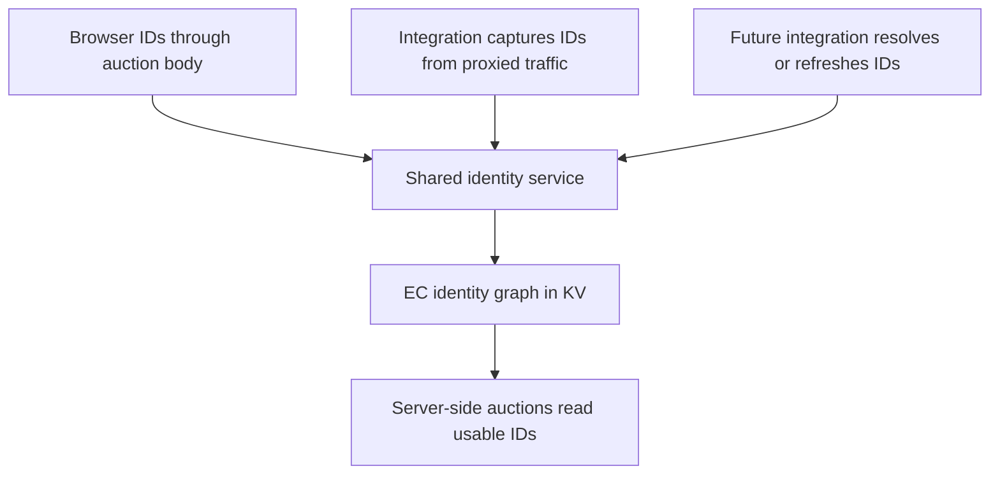
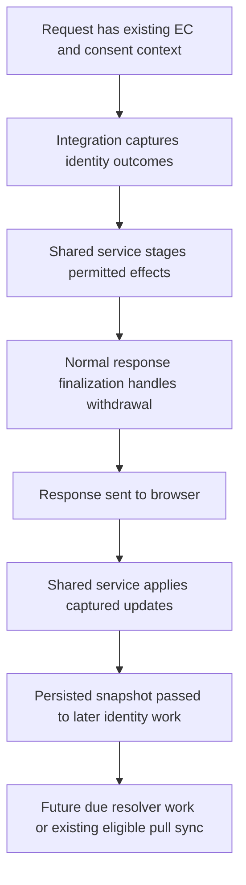

# Server-side identity foundation

Status: Architecture implemented in the draft change, awaiting code review.
See the [implementation plan and verification](../plans/2026-10-09-server-side-identity-foundation-and-lockr.md).
Provider activation and metadata-compatible deployment remain unverified.

First consumer: [Lockr proxy-side identity capture](2026-10-08-lockr-identity-capture-design.md).

Related: [KV EID request snapshot and EC recovery](2026-07-10-kv-eid-request-snapshot-ec-recovery-design.md)
defines the snapshot, root-creation and withdrawal rules retained here.
[The existing LiveRamp design](2026-08-21-liveramp-integration-design.md)
describes the browser path. A separate future spec must approve any native
resolution protocol and identifier intake.

## 1. Purpose

Give integrations a standard way to contribute server-side identities without
making each integration implement storage, consent handling and auction wiring.

The ownership rule is:

> Integrations acquire and interpret identities. A shared identity service
> coordinates lifecycle work. EC owns persistence, consent and auction delivery.

Capture and active resolution are different capabilities. They share identity
outcomes and mutation policy, not a single provider HTTP protocol.



This spec owns the shared contracts. The Lockr spec owns the first provider
implementation. A later LiveRamp spec can use the resolution contract without
changing the Lockr protocol.

## 2. Starting system and gaps (pre-implementation baseline)

- `integrations/registry.rs` registers optional proxies, request filters,
  rewriters and head injectors, but no identity capabilities.
- `ec/registry.rs` builds the source policy and partner API registry from
  `[[ec.partners]]`. An EID source is the key into the identity graph.
- `/auction` uses body EIDs for the current auction. Its EC finalization
  currently persists request cookies, not those body EIDs.
- `ec/pull_sync.rs` implements a specific bearer-authenticated protocol:
  send `ec_id`, receive `{"uid":"..."}`, and fill missing sources only.
  It does not refresh existing UIDs; its refresh interval is currently unused.
- `KvPartnerId` stores only `uid`. It cannot express provider expiry, the
  authoritative writer, or the version a refresh result was based on.

Reuse the existing snapshot, conditional-write and post-send mechanisms.
Do not mistake the legacy pull-sync wire protocol for a universal resolver.

The shared identity service belongs in core EC code and uses `KvIdentityGraph`;
it is not another store or vendor registry. The integration registry exposes
capabilities to that service. Platform adapters only supply execution timing
and services, including the point at which a response has been sent.

## 3. Scope and invariants

The first delivery covers integration capability registration, common outcomes,
source ownership, expiry-aware records, browser-body ingestion, bounded capture
and the Fastly post-send capture path. Resolution and refresh contracts are
specified now; a production active resolver is implemented only with an
approved provider spec.

Invariants:

1. No additional EID cookie. `ts-ec` remains the pointer to an existing EC row.
2. Integration capture and `/auction` enrichment never create or recover a
   root. Existing eligible publisher-navigation creation and recovery remain.
3. Missing and unreadable rows are distinct. Neither authorizes enrichment.
4. A tombstone is never revived by identity acquisition.
5. Browser input is not an authoritative partner update.
6. A provider timeout or configuration failure does not revoke consent or
   erase a still-valid ID.
7. Known-expired or invalidated records are not exposed to bidders.
8. Stored state and response extensions identify the full EC ID, not just its
   IP-derived hash prefix. A rotated identity cannot reuse the old snapshot.
9. Logs and telemetry never contain UIDs, envelopes, hashes submitted for
   resolution, consent strings, or query URLs carrying those values.
10. Fastly capture persistence and future active resolution run after send.
    Browser-body persistence keeps existing EC finalization timing.

Non-goals: LiveRamp API implementation, hashed-identifier collection or storage,
cross-browser linking, provider-specific authentication, audience segments,
multiple stored UIDs per source, arbitrary provider metadata in KV, durable
background queues, and guaranteed inclusion in the first auction.

## 4. Registration and configuration

### 4.1 Optional integration capabilities

Extend the existing integration registration, not a separately maintained list
of identity vendors:

```rust
IntegrationRegistration::builder("example_identity")
    .with_identity_capture(capture)
    .with_identity_resolver(resolver)
    .build()
```

The sketch shows optional capabilities, not a requirement to implement both.
A capture-only module needs no resolver or dummy HTTP endpoint. A resolver-only
module needs no browser SDK or proxy route. Each capability declares the finite
set of source namespaces it can produce and its consent requirements.

The initial implementation registers capture. Reserve the resolver contract
without enabling an unused production fetch loop.

### 4.2 Integration IDs and source namespaces

An integration ID identifies the acquisition module. An EID `source` identifies
the partner namespace stored in KV. They are not interchangeable: one broker
can issue several sources, and multiple modules can issue the same source.

Keep provider protocol settings under `[integrations.<module>]`. Keep generic
source policy, bidstream permission and existing partner API authentication
under `[[ec.partners]]`.

Add an optional, vendor-neutral source policy field:

```toml
[[ec.partners]]
name = "Example identity source"
source_domain = "ids.example.com"
openrtb_atype = 3
bidstream_enabled = true
identity_owner = "example_identity"
```

`identity_owner` selects the one integration allowed to replace or invalidate
that source through managed acquisition. Validate that the configured module
has an identity descriptor claiming the source. Reject ambiguous ownership;
do not resolve it by registration order. A configured module can disable its
acquisition capability without losing its ownership descriptor or invalidating
the kill switch configuration.

Without an owner, browser and legacy partner paths retain their existing source
policy. Managed integration updates require an explicit owner. Browser input
can still fill an absent source conservatively, but cannot replace a stored
record or confer provider authority.

For an owned source, legacy push and pull paths must not bypass owner checks.
Disable conflicting authoritative paths or route an explicitly authorized
writer through the same policy. Do not silently allow a generic pull to replace
an integration-owned envelope. Changing the owner is an operator migration,
not an automatic fallback when a module fails.

## 5. Acquisition contracts and common outcomes

### 5.1 Capture

A capture capability declares exact proxy response paths and interprets a
bounded decoded body. The framework supplies request-local EC and consent
context, method, status and response metadata. The module knows its provider
schema; the framework owns buffering, bounds and response preservation.

If the provider needs consent values from a POST body, the integration extracts
them from its existing forwarding buffer and supplies normalized signals.
It must not consume the body twice or let a second parser modify forwarding.

Only framework-associated upstream responses can produce authoritative capture
updates. An arbitrary browser body or inbound diagnostic header cannot select
this trust level or impersonate a module.

### 5.2 Resolution and refresh

The future resolver contract separates planning, HTTP execution and parsing:

1. Given permitted inputs, current record and consent, the module plans no
   work, reports missing inputs, or builds a resolution/refresh request.
2. The shared coordinator enforces eligibility, due time, consent, allowlists,
   rate limits, timeout and response limits using platform HTTP services.
3. The module interprets the provider response into common identity outcomes.
4. EC applies those outcomes against the record version used to plan the work.

Inputs must be approved by the provider spec and represented as named types.
No generic request header becomes a trusted hashed identifier by convention.
The framework does not grant modules access to all publisher cookies or
credentials; disclosure is limited to declared, permitted inputs.

### 5.3 Outcomes

| Outcome                | Meaning and shared action                                                                                                                   |
| ---------------------- | ------------------------------------------------------------------------------------------------------------------------------------------- |
| `Issued`               | Validated source and UID, optional provider expiry; apply the appropriate update policy. A refresh may keep the UID while extending expiry. |
| `NoChange`             | Nothing new was observed; do not manufacture a write.                                                                                       |
| `NoMatch`              | Resolution produced no ID; it does not invalidate an existing ID or withdraw consent.                                                       |
| `Invalidated`          | The provider rejected a particular existing record; make that record unusable only if its expected revision still matches.                  |
| `ConsentWithdrawn`     | Explicit withdrawal with a provider-spec-defined scope; never inferred from a generic empty response.                                       |
| `RetryableFailure`     | Temporary network/provider failure; preserve valid state and apply bounded retry policy.                                                    |
| `ConfigurationFailure` | Approval, credentials or request configuration is wrong; preserve valid state and report a redacted operational error.                      |

Capture decode/schema errors skip capture without changing the proxy response.
Module output is validated again at the shared trust boundary against source
claims, configured ownership, UID caps and allowed metadata. The service assigns
the writer identity and update class; neither comes from browser JSON.

Per-source invalidation is not a global EC withdrawal. A provider spec must
explicitly justify a global withdrawal outcome. The shared finalizer gives
withdrawal precedence over enrichment and suppresses duplicate tombstones when
normal request consent finalization has already handled it.

## 6. Stored records and freshness

### 6.1 Proposed record extension

Keep one UID per source, and add optional lifecycle fields to `KvPartnerId`:

| Field            | Purpose                                                                           |
| ---------------- | --------------------------------------------------------------------------------- |
| `uid`            | Existing opaque identifier.                                                       |
| `expires_at`     | Provider expiry in Unix seconds, when known.                                      |
| `writer`         | Framework-assigned integration, browser or legacy writer identity.                |
| `revision`       | Opaque version changed on every material record mutation.                         |
| `updated_at`     | Server time of a material persisted change, not proof of provider issuance order. |
| `invalidated_at` | Marks a rejected record unusable while retaining its revision.                    |

The first delivery adds expiry, writer and revision support. The table also
reserves the semantics of update timestamps and per-source invalidation; do not
add unused runtime state or scheduling merely to fill out the future contract.
Those fields, refresh timing and attempt/backoff state are implemented when a
consumer needs them. Acquisition timestamps are not a substitute for
provider-owned ordering.

Known provider expiry is preserved through KV and auction resolution. Reject an
already-expired issued token. Do not clear a known expiry merely because a
same-UID observation omitted it. A same-UID authoritative observation with a
changed, supported expiry is a material update; unchanged UID and lifecycle
metadata require no write. Do not write merely to update an observation clock.

Legacy UID-only records and browser inputs have unknown expiry and retain their
existing row-lifetime behavior. Do not invent a historical expiry or falsely
label them as provider-resolved. This compatibility choice does not guarantee
that legacy IDs are still valid; tightening unknown-expiry policy is a separate
operator decision.

The record extension does not store OpenRTB provenance, UID `ext`, or extra UIDs.
Writer identity is storage metadata, not proof that a provider requires a
particular `inserter` or `matcher` value in the bidstream.

### 6.2 Mutation classes

Browser enrichment keeps the current conservative policy: fill absent sources,
skip unchanged values, preserve different values, and perform at most one CAS
write followed by at most one conflict read with no retry write. Browser input
cannot set expiry, writer, revision or invalidation metadata. Expired and
invalidated records count as existing records, not empty slots that the browser
can revive.

Authoritative acquisition can replace an owned source and update supported
lifecycle metadata. It retains bounded CAS refresh and re-merge, preserving
unrelated sources and rejecting a missing or withdrawn root.

For future resolver updates and invalidation, carry the revision used to plan
the call. If another writer changed that record, discard the stale result;
do not delete or overwrite the replacement. Comparing UID alone is insufficient
because a same-UID refresh can change expiry. Source invalidation retains a
non-deliverable record marker so a stale browser submission cannot refill it.
DSR deletion and global withdrawal still remove identity payload through their
existing authoritative paths.

Capture-only updates without a provider sequence retain observation/CAS ordering.
They do not promise chronological provider freshness across overlapping SDK
requests. A provider requiring stronger ordering must supply an ordering
contract in its integration spec, not rely on edge wall clocks.

### 6.3 Auction reads

Resolve only live, consented, bidstream-enabled records whose known expiry has
not passed and which are not invalidated. Retain expired records as lifecycle
state; auction omission does not require a hot-path cleanup write.

When browser EIDs are merged with KV, a browser UID matching a known-expired or
invalidated record must also be omitted for that source. Otherwise request-body
precedence would bypass the usability rule. A different valid browser UID can
still be used in its current auction under existing consent rules without
becoming an authoritative replacement in KV.

Body-supplied OpenRTB provenance remains current-request metadata. Add optional
`inserter`, `matcher` and `mm` to `Eid` parsing and merging; an empty `matcher`
is a supplied value. Later KV-derived EIDs use source registry `atype` and do
not synthesize provider provenance. The first delivery preserves existing caps
and consent gates across all auction paths.

## 7. Consent and execution timing

The shared service evaluates global EC consent and each module's additional
requirements. A global `consent.ok` flag alone does not prove vendor or purpose
permission. Future outbound disclosure rechecks the live consenting row just
before dispatch and respects current request privacy signals. Mutation rechecks
root consent through conditional-write semantics.



For browser-body ingestion, stage updates before auction dispatch and carry them
through EC finalization, including handled provider-error responses. Preserve
current auction behavior when persistence fails. Denied identity use stages no
updates. Browser persistence does not require a successful bid or a winning bid.

Fastly removes cloneable identity effects before response conversion drops
extensions. Shared effects carry the full EC ID, trusted acquisition origin and
snapshot; the adapter does not parse provider payloads. Run captured mutations
after send and before legacy pull sync. Pass only persisted outcome snapshots
forward, including changed generations and failed states.

Capture routes can have `NotRead` snapshots. Their first required lookup occurs
after send. A reusable snapshot avoids that lookup, but unusable generations,
stale misses and CAS conflicts can require refresh reads. No zero-read claim is
made. No-token responses queue no token mutation.

Best-effort after-send work adds execution time, not Fastly response latency.
There is no durable queue, guaranteed retry or first-auction availability.
Other adapters use the shared service only where EC KV support exists. Document
before-send behavior where no post-send execution hook exists; do not claim
persistence on unsupported adapters.

## 8. Browser-body migration and EID cookie retirement

Use validated `/auction` body EIDs both for current-request forwarding and for
registered-source browser enrichment. Expose the existing EID-to-update helper
without round-tripping through a fake cookie. Reuse the auction snapshot in
finalization instead of performing a second unconditional lookup.

Remove the `ts-eids` writer and server readers only after body ingestion is
verified. Final behavior:

- `/auction` gets current-request client EIDs from the body, with no EID-cookie
  fallback. Unknown sources remain usable only in that current auction.
- Publisher and SPA page-bid auctions read registered IDs from KV.
- The separate `sharedId` cookie retains its existing ingestion behavior;
  combine browser inputs into one finalization mutation attempt.
- Orphan recovery no longer seeds IDs from a `ts-eids` cookie.
- Late browser IDs need another auction submission for persistence. No new
  page-exit beacon or cookie fallback is introduced.

Retire `x-ts-eids` and `x-ts-eids-truncated` emission, checking external diagnostic
tooling first. Keep both names on the inbound internal-header strip list.
Do not remove EC or consent headers as part of this change.

A transition JavaScript release expires the old host-only `Path=/` cookie;
its existing max-age is one day. New servers ignore it even if cached older
bundles still write it. Remove the cleanup shim once the transition artifacts
have aged out. Do not add unconditional server cookie cleanup that changes
cache privacy on every response.

## 9. Bounded transport and failure policy

Capture response inspection has independent 64 KiB limits for original body
bytes and decoded JSON bytes. Decode incrementally into bounded buffers; do not
allocate the full decompressed body before checking its size. Exceeding either
limit, unsupported encoding or decode failure skips capture and preserves the
original body and encoding/length headers. Oversized streaming bodies must
replay the collected original prefix and remaining stream, not fail after a
destructive collector consumes the prefix.

Memory accounting includes both buffers and bounded stream/decoder overhead;
the total budget is not 64 KiB. Future resolver HTTP uses equivalent independent
wire and decoded limits, though it has no browser response to replay.

Retain UID length and source-count caps. Provider request building must use
HTTPS, an explicit destination allowlist and narrowly allowed headers. Do not
forward publisher credentials by default. Disable or revalidate redirects
before any request carrying identity input leaves the approved destination.

Failures are best-effort and redacted. No-match and failed attempts need bounded
negative-cache/backoff policy when an active resolver is introduced; define its
state lifetime and key in that provider delivery. Do not introduce nested,
unbounded retries in modules and the coordinator.

## 10. Resolution lifecycle reserved for later delivery

A future resolver distinguishes missing, usable, refresh-due, expired and
invalidated state. Missing approved inputs means no call. Expired or invalidated
values are not auction-usable, even if refresh or re-resolution cannot run.

Refresh is initially activity-driven: a qualifying request can trigger due work
after send. There is no promise that a task runs while a visitor is inactive.
A provider spec defines resolution inputs, refresh inputs, interval, failure
backoff and whether a particular response invalidates the old record.

Reuse post-send orchestration without changing the legacy protocol's
fill-missing-only behavior for unowned sources. Skip integration-owned sources
in legacy completeness and dispatch decisions. Rate-limit keys must define
whether their identity scope is the full EC ID or the IP-derived EC hash;
the existing generic pull limiter uses the hash and is not a per-cookie limit.

No module can create cross-browser linkage by storing a UID in KV. Chrome and
Safari ordinarily have different full EC IDs. A later linking design must
establish an approved association; a common IP prefix is not proof of a person.

## 11. Compatibility and delivery sequence

The proposed record fields are additive and optional within schema version 1.
Legacy records decode as before. Unsupported schema versions still fail closed.
Do not bump the schema merely to make old records unreadable.

However, older writers would deserialize and reserialize away unknown metadata,
and older readers would ignore expiry. Deploy metadata-preserving readers and
all mutation paths before activating managed writes. This includes browser,
push, pull, withdrawal, recovery and admin-related mutations. Test their
round-trips and equality rules; a UID-only overwrite must not strip expiry.

Activation requires deployment propagation and old invocation drain. Rolling
back to a UID-only binary after activation is unsafe unless managed writes are
stopped and record compatibility is explicitly handled. Disabling acquisition
is safe but does not remove expiry-aware reader requirements.

Delivery stages:

1. Add defaulted record fields, usability checks and metadata-preserving
   mutation plumbing with managed acquisition inactive.
2. Add common outcomes, source ownership and capture registration. Keep
   authoritative and browser mutation classes distinct.
3. Add browser-body ingestion, verify it, then retire EID cookie/header paths.
4. Add bounded capture handling and shared Fastly effect execution, using
   synthetic integration fixtures before enabling Lockr.
5. Implement and enable the separate Lockr consumer after ownership and
   provider validation checks pass.
6. Implement active resolution and refresh only with its later provider spec.

## 12. Verification and open decisions

Foundation tests must cover:

- Optional capability registration and source-ownership validation, including
  a capture kill switch without invalidating the configured owner.
- Legacy record decoding and every writer preserving lifecycle metadata.
- Browser fill-missing and conflict bounds; rejection of forged authority and
  metadata; no browser resurrection of expired/invalidated state.
- Authoritative replacement and same-UID expiry changes; unchanged metadata
  skips writes; unrelated sources survive CAS conflicts.
- Known expiry boundaries across publisher, `/auction` and SPA auction paths,
  including an expired UID resubmitted in the auction body.
- Revision-conditional invalidation and stale resolver-result rejection,
  with same-UID/new-expiry and concurrent-withdrawal cases.
- Missing versus failed roots, no-create enrichment, snapshot identity
  association, withdrawal precedence and duplicate-tombstone suppression.
- Independent original/decoded size limits, compressed expansion, unsupported
  encodings, decode failure and byte-identical capture pass-through.
- Browser updates surviving handled auction-provider failures; one combined
  browser finalization mutation with `sharedId`; body-only migration behavior.
- Fastly send-before-capture-write ordering and resulting snapshot handoff to
  pull sync; no-token and failed-update paths; supported adapter behavior.
- Redacted errors and no private data in logs, including provider query URLs.

Resolve before implementation activation:

1. Confirm deployment propagation/drain and rollback procedures for additive
   lifecycle metadata. Passing new-reader tests does not prove old-writer safety.
2. Confirm capture ordering expectations when an SDK issues overlapping token
   requests; no provider sequence is assumed by this foundation.
3. Identify external consumers of the diagnostic EID headers before retirement.

Provider expiry, writer and revision storage are proposed foundation decisions,
not already implemented capabilities. LiveRamp protocol approval, identifier
intake, refresh response semantics and country-specific TTL remain for its
future spec. OpenRTB provenance storage remains outside this first delivery.
